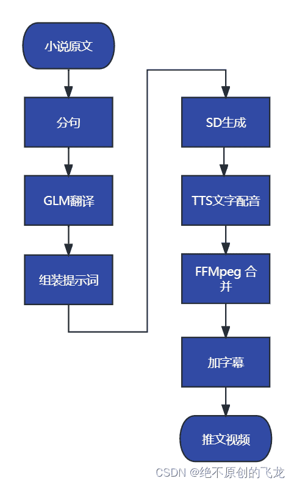
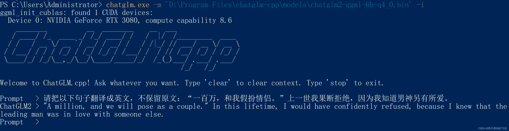
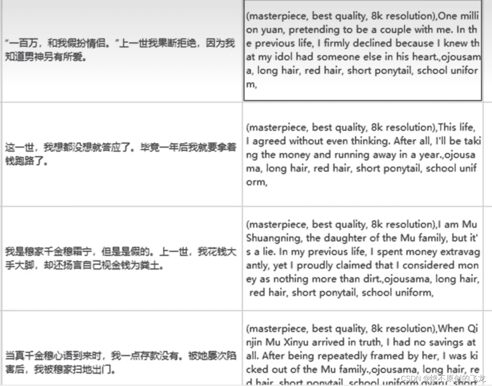

<!--yml
category: 视频
date: 2023-09-17 14:36:17
-->

# 【Python 自动化】小说推文一键生成思路概述

> 来源：[https://blog.csdn.net/wizardforcel/article/details/132758208](https://blog.csdn.net/wizardforcel/article/details/132758208)

最近看了一下小说推文成品软件的思路，发现可以完全迁移到我的 [BookerAutoVideo](https://github.com/dracounion/BookerAutoVideo) 上面来。这篇短文里面，我试着分析一下整个推文视频生成的流程，以及简要阐述一下有什么工具。

整体流程是这样：

## 分句

原文是按照段落组织的，我们可能希望按照句子生成图片。于是我们需要把段落拆成句子，像这样：

由于用于生成图片的软件 SD 不支持中文提示词，我们需要翻译成英文，用 ChatGLM 即可，纯本地部署，非常方便。

[THUDM/ChatGLM2-6B](https://github.com/THUDM/ChatGLM2-6B)

也可以用 GGML 上的版本加速生成：

[li-plus/chatglm.cpp](https://github.com/li-plus/chatglm.cpp/)

翻译之后的文本时提示词的一部分，它只能表述内容，我们要需要加上风格、质量等提示词：

然后每个提示词交给 SD 生成一幅画（同样也有 GGML 上的版本）。

[AUTOMATIC1111/stable-diffusion-webui](https://github.com/AUTOMATIC1111/stable-diffusion-webui)

[leejet/stable-diffusion.cpp](https://github.com/leejet/stable-diffusion.cpp)

之后，我们可以选择输出成剪映脚本，也可以输出成我的 BookerAutoVideo 的脚本，其它三个功能见我的上个博文。

[https://blog.csdn.net/wizardforcel/article/details/132633370](https://blog.csdn.net/wizardforcel/article/details/132633370)