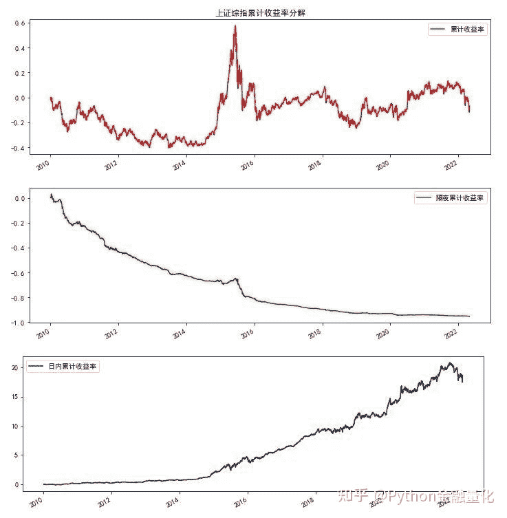
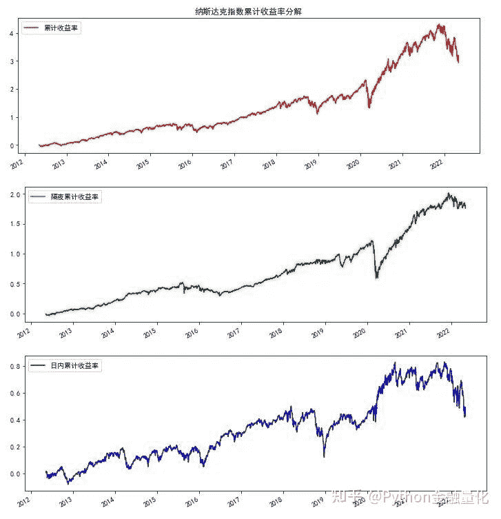
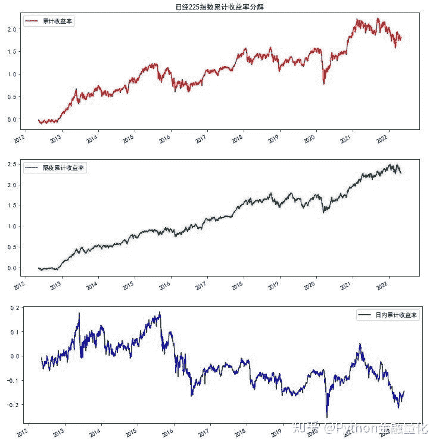
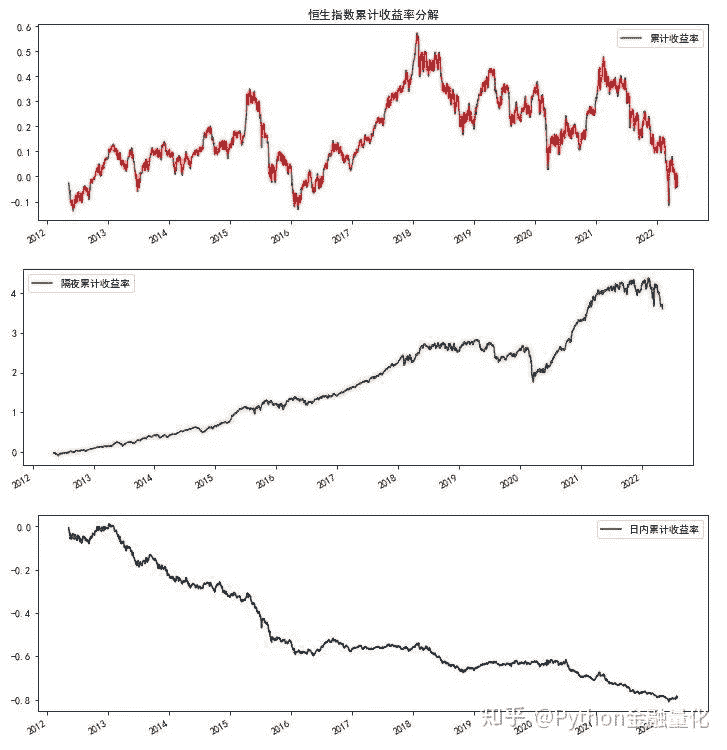
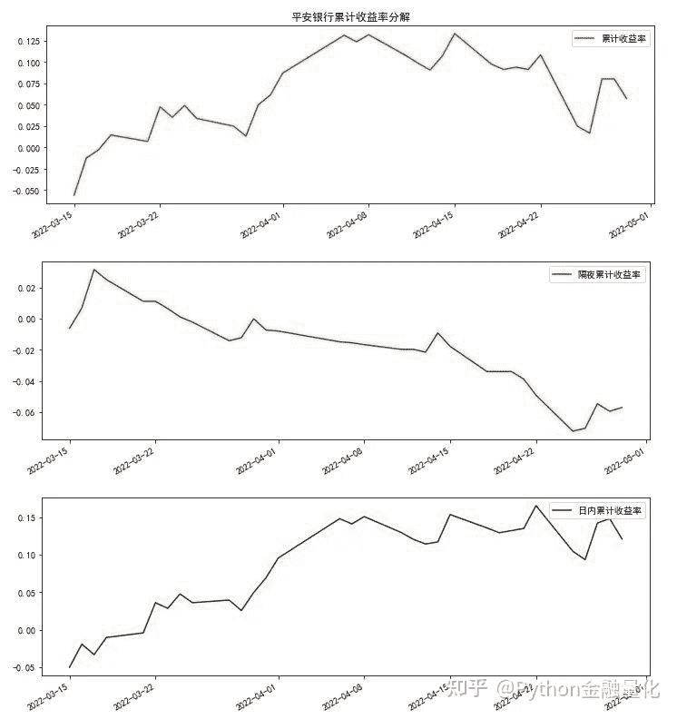
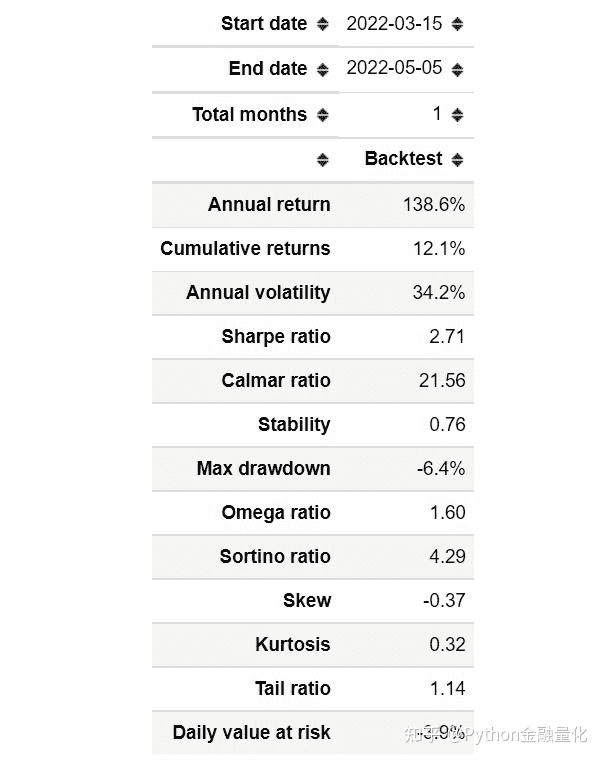
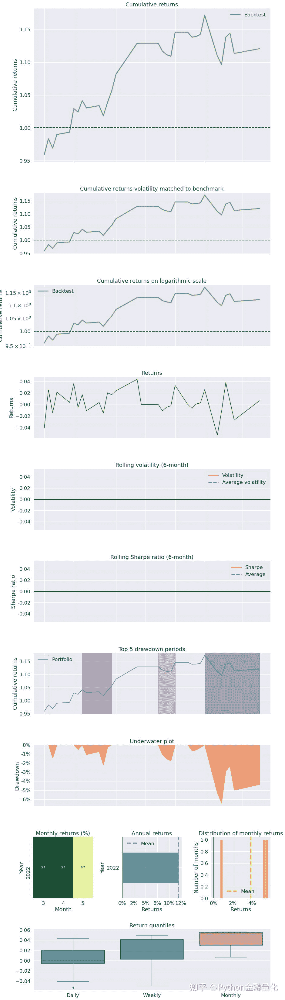
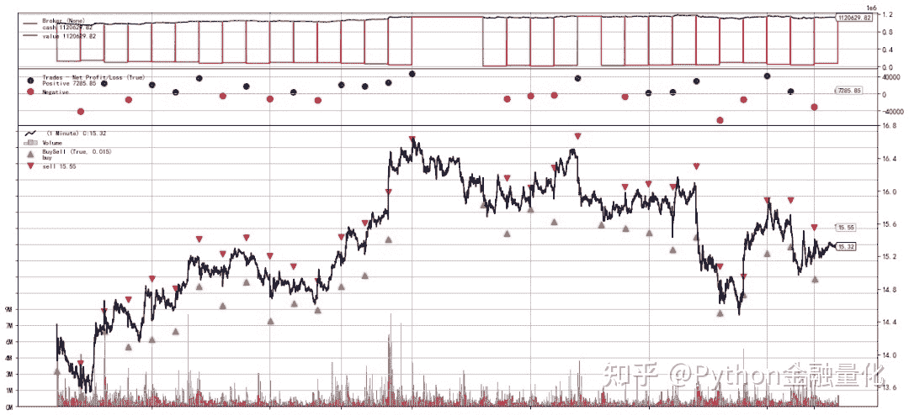

<!--yml
category: 交易
date: 2023-09-17 20:10:21
-->

# 【backtrader回测】隔夜持仓 VS 日内交易 - 知乎

> 来源：[https://zhuanlan.zhihu.com/p/512232177](https://zhuanlan.zhihu.com/p/512232177)

## 1 引言

有效市场理论认为，价格反映了信息，很难通过预测市场来获取超额收益。换句话说，如果市场是有效的，买入持有策略将是最优的，任何企图通过选股或择时的策略长远来看都难以战胜市场。但我们观察到，股票价格波动（作用）本身作为一个非常重要的因素，会导致随后的价格运动（反馈）。所有的市场参与者都是通过执行自己的决策来对价格走势做出贡献的，但他们在很大程度上受到价格运动的影响，并通过不断接收市场价格的反馈来检验和修正他们的假设。这是所有市场（不仅仅是股市）都存在的现象，也是alpha值的最大来源。

股市收盘和第二天开盘之间有一段相当长的时间，在这段时间内产生的信息会立即反映为开盘时的价格变化，这一价格变化被称为隔夜价差。而股市当天开盘和当天收盘之间也有一段时间，但这段时间股价是通过连续竞价发生价格变化，这一价格变化也叫日内交易价差。理论上，持有股票的时间越长，波动风险可能越大（收益也可能越高），如果隔夜持仓或日内持仓则将可以将波动风险控制在较小范围。本文试图探讨在不选股不择时的情况下，对A股市场单纯采用日内交易或隔夜持仓策略进行历史回测，为大家构建日内交易提供参考。

## 2 收益率分解

下面使用tushare pro获取几个全球主要指数，包括A股上证综指、创业板，纳斯达克、日经225指数和香港恒生指数。将指数累计收益率分解为隔夜累计收益率和日内交易累计收益率。由于日收益率=当天收盘价/前日收盘价-1，隔夜收益率=当天开盘价/前日收盘价-1，日内收益率=当天收盘价/当天开盘价-1。因此有（1+日收益率）=（1+隔夜收益率）（1+日内收益率）。

（1）上证综累计收益率情况（201001-202205）

隔夜累计收益率为负数（亏损超过80%），日内累计收益率惊人的高（超过1500%）。



（2）创业板指数（201005-202205），累计收益率分解后的结果与上证综指类似。


（3）纳斯达克指数累计收益率分解

纳斯达克指数近十年来指数增长了三四倍，分解后的隔夜持仓或日内交易累计收益率均不如一直买入持有的策略高。



（4）日经225指数累计收益率分解

日经225指数刚好与A股相反，隔夜持仓累计收益率为正，而日内交易累计收益率为负。



（5）香港恒生指数分解走势与日经指数相似



实际上，国外研究发现隔夜持仓累计收益率通常是正的，而日内交易持仓累计收益率往往较小或负的（与香港、日本、美国指数图基本吻合）。A股市场在隔夜价差和日内价差上的表现与国外成熟市场正好相反，一方面，可能是由于国内市场的投机氛围更重，某些游资或机构在日内交易中往往利用资金优势炒作某些个股；另一方面，A股市场经常出现开盘暴跌，收盘大幅反弹的情况（国家队参与“救市”）。

## 3 backtrader回测

由于分时数据获取较困难（tushare pro积分+次数限制），本文以平安银行（原深发展，代码000001.SZ）为例，使用backtrader分别对隔夜持仓和日内交易策略进行量化回测。策略逻辑很简单粗暴，日内交易采取开盘价买入，收盘时卖出（A股目前没有开放T+0，可以采用滚动式做T持仓）；隔夜持仓则刚好相反，即收盘时买入持仓，第二天开盘卖出。这里忽略开盘或收盘涨跌停无法成交的情况，如果对指数数据进行回测就不会存在这样的问题。

下面使用tushare pro获取000001.SZ在2022年3月15日至2022年5月6日的1分钟数据为例进行回测。先来看一下这段时间该股的累计收益率情况，买入持有累计收益率低于8%，隔夜累计收益率为负，日内累计交易率为正（10%-12%）。



日内交易策略回测

```
import backtrader as bt
import matplotlib.pyplot as plt
import pandas as pd
from datetime import datetime, time
#交易策略
class IntraDayStrategy(bt.Strategy):
    #默认不打印交易日志
    params=(('printlog',False),)

    def __init__(self):
        self.order = None 
        self.buyprice = None
        self.buycomm = None

    def next(self):
        if self.order:  # 检查交易指令
            return

        #是否持有头寸
        if not self.position:  #没有头寸
            cash = self.broker.get_cash()
            #使用90%资金进行交易
            size=int(cash*0.90/100/data.close[0])*100
            try:
                if (self.data.datetime.time() == time(hour=9, minute=30, second=00)) :
                        self.buy(size=size, exectype=bt.Order.Market)
            except Exception:
                traceback.print_exc()
        else:  #持有头寸
            if self.data.datetime.time() == time(hour=14, minute=59, second=00):
                    self.close()

    #交易记录日志（可省略，默认不输出结果）
    def log(self, txt, dt=None,doprint=False):
        if self.params.printlog or doprint:
            dt = dt or self.datas[0].datetime.date(0)
            print(f'{dt.isoformat()},{txt}')

    def notify_order(self, order):
        # 如果order为submitted/accepted,返回空
        if order.status in [order.Submitted, order.Accepted]:
            return
        # 如果order为buy/sell executed,报告价格结果
        if order.status in [order.Completed]: 
            if order.isbuy():
                self.log(f'买入:\n价格:{order.executed.price:.2f},\
                成本:{order.executed.value:.2f},\
                手续费:{order.executed.comm:.2f}')
                self.buyprice = order.executed.price
                self.buycomm = order.executed.comm
            else:
                self.log(f'卖出:\n价格：{order.executed.price:.2f},\
                成本: {order.executed.value:.2f},\
                手续费{order.executed.comm:.2f}')
            self.bar_executed = len(self) 
        # 如果指令取消/交易失败, 报告结果
        elif order.status in [order.Canceled, order.Margin, order.Rejected]:
            self.log('交易失败')
        self.order = None

    def notify_trade(self,trade):
        if not trade.isclosed:
            return
        self.log(f'策略收益：\n毛收益 {trade.pnl:.2f}, 净收益 {trade.pnlcomm:.2f}') 
```

回测系统设置

```
#读取本地分时数据
data=pd.read_csv('1min_data.csv',index_col=0)
data.index=pd.to_datetime(data.trade_time)
data=data.sort_index()
data=data[['open','high','low','close','vol']]
data=data.rename(columns={'vol':'volume'})
#data.head()

#初始化回测系统
cerebro = bt.Cerebro(cheat_on_open=True)
#添加策略printlog=True打印交易日志
cerebro.addstrategy(IntraDayStrategy,printlog=False)

#添加数据
data1=bt.feeds.PandasData(dataname=data['2022-03-15':],
                   timeframe=bt.TimeFrame.Minutes,)
cerebro.adddata(data1)
#初始资金设置
startcash = 1000000
cerebro.broker.setcash(startcash)
# 设置佣金为0.08%
cerebro.broker.setcommission(commission=0.0008)

#运行回测系统
cerebro.addanalyzer(bt.analyzers.PyFolio, _name='pyfolio')
results = cerebro.run()
strat = results[0]
pyfoliozer = strat.analyzers.getbyname('pyfolio')
returns, positions, transactions, gross_lev = pyfoliozer.get_pf_items()

#获取回测结束后的总资金
portvalue = cerebro.broker.getvalue()
pnl = portvalue - startcash
#打印结果
print(f'总资金: {round(portvalue,2)}')
print(f'净收益: {round(pnl,2)}')

总资金: 1120629.82
净收益: 120629.82 
```

100万本金，净收益12万，期间收益率12%左右，年化收益率高到138.6%，夏普比率2.7，总体结果非常不错。

```
#使用pyfolio展示回测结果
import pyfolio as pf
#pf.create_full_tear_sheet(returns)
```



回测可视化

```
plt.rcParams['figure.figsize']=[18, 8]
#cerebro.plot(iplot=False)
```



## **隔夜策略**

结果显示，隔夜持仓策略表现较糟糕，亏损9万多。

```
class OvernightStrategy(bt.Strategy):
    pass
#打印结果
print(f'总资金: {round(portvalue,2)}')
print(f'净收益: {round(pnl,2)}')

总资金: 909535.89
净收益: -90464.11 
```


## 4 结语

本文简单探讨了主要指数隔夜持仓和日内交易策略表现出的收益率差异，并以某个股的分时数据为例使用backtrader进行了量化回测。A股指数日内交易表现出高收益，而隔夜收益为低收益（负收益）的现象与欧美日和香港等成熟市场截然相反，可能与市场参与者的构成（国内以游资散户为主）和交易文化有较大关联。读者可以深入挖掘A股市场的这一价格运动模式，探讨形成价格反差的内在逻辑。本文回测过程没有考虑涨跌停板的影响，而且标的和回测期间的选择有一定的随意性，所以结论存在一定的局限性。本文旨在为大家研究市场提供一个新视角和Python编程参考，不构成任何投资建议，交易有风险，投资需谨慎。