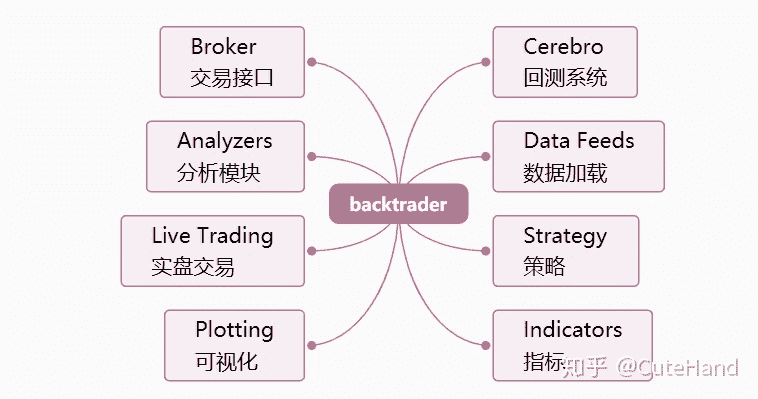

<!--yml
category: 交易
date: 2023-09-17 20:11:54
-->

# 【手把手教你】入门量化回测最强神器backtrader（一） - 知乎

> 来源：[https://zhuanlan.zhihu.com/p/122183963](https://zhuanlan.zhihu.com/p/122183963)

## 1 引言

目前基于Python的量化回测框架有很多，开源框架有zipline、vnpy、pyalgotrader和backtrader等，而量化平台有Quantopian（国外）、聚宽、万矿、优矿、米筐、掘金等，这些量化框架或平台各有优劣。就个人而言，比较偏好用backtrader，因为它功能十分完善，有完整的使用文档，安装相对简单（直接pip安装即可）。优点是运行速度快，支持pandas的矢量运算；支持参数自动寻优运算，内置了talib股票分析技术指标库；支持多品种、多策略、多周期的回测和交易；支持pyflio、empyrica分析模块库、alphalens多因子分析模块库等；扩展灵活，可以集成TensorFlow、PyTorch和Keras等机器学习、神经网络分析模块。而不足之处在于，backtrader学习起来相对复杂，编程过程中使用了大量的元编程（类class），如果Python编程基础不扎实（尤其是类的操作），学起来会感到吃力。本文作为backtrader的入门系列之一，对其运行框架进行简要介绍，并以实际案例展示量化回测的过程。

## 2 backtrader简介

如果将backtrader包分解为核心组件，主要包括以下组成部分：
（1）数据加载（Data Feed）：将交易策略的数据加载到回测框架中。

（2）交易策略（Strategy）：该模块是编程过程中最复杂的部分，需要设计交易决策，得出买入/卖出信号。
（3）回测框架设置（ Cerebro）：需要设置（i）初始资金（ii）佣金（iii）数据馈送（iv）交易策略（v）交易头寸大小。
（4）运行回测：运行Cerebro回测并打印出所有已执行的交易。
（5）评估性能（Analyzers）:以图形和风险收益等指标对交易策略的回测结果进行评价。

“Lines”是backtrader回测的数据，由一系列的点组成，通常包括以下类别的数据：Open（开盘价）, High（最高价）, Low（最低价）, Close（收盘价）, Volume（成交量）, OpenInterest（无的话设置为0）。Data Feeds（数据加载）、Indicators（技术指标）和Strategies（策略）都会生成 Lines。价格数据中的所有”Open” (开盘价)按时间组成一条 Line。所以，一组含有以上6个类别的价格数据，共有6条 Lines。如果算上“DateTime”（时间，可以看作是一组数据的主键），一共有7条 Lines。当访问一条 Line 的数据时，会默认指向下标为 0 的数据。最后一个数据通过下标 -1 来访问，在-1之后是索引0，用于访问当前时刻。因此，在回测过程中，无需知道已经处理了多少条/分钟/天/月，”0”一直指向当前值，下标 -1 来访问最后一个值。



## 3 回测应用实例

量化回测说白了是使用历史数据去验证交易策略的性能，因此回测的第一步是搭建交易策略，这也是backtrader要设置的最重要和复杂的部分，策略设定好后，其余部分的代码编写是手到擒来。

01构建策略（Strategy）

交易策略类代码包含重要的参数和用于执行策略的功能，要定义的参数或函数名如下：

（1）params-全局参数，可选：更改交易策略中变量/参数的值，可用于参数调优。

（2）log：日志，可选：记录策略的执行日志，可以打印出该函数提供的日期时间和txt变量。

（3） __init__：用于初始化交易策略的类实例的代码。

（4）notify_order，可选：跟踪交易指令（order）的状态。order具有提交，接受，买入/卖出执行和价格，已取消/拒绝等状态。

（5）notify_trade，可选：跟踪交易的状态，任何已平仓的交易都将报告毛利和净利润。

（6）next，必选：制定交易策略的函数，策略模块最核心的部分。

下面以一个简单的单均线策略为例，展示backtrader的使用过程，即**当收盘价上涨突破20日均线买入（做多），当收盘价下跌跌穿20日均线卖出（做空）**。为简单起见，不报告交易回测的日志，因此log、notify_order和notify_trade函数省略不写。

```
class my_strategy1(bt.Strategy):
    #全局设定交易策略的参数
    params=(
        ('maperiod',20),
           )

    def __init__(self):
        #指定价格序列
        self.dataclose=self.datas[0].close
        # 初始化交易指令、买卖价格和手续费
        self.order = None
        self.buyprice = None
        self.buycomm = None

        #添加移动均线指标，内置了talib模块
        self.sma = bt.indicators.SimpleMovingAverage(
                      self.datas[0], period=self.params.maperiod)
    def next(self):
        if self.order: # 检查是否有指令等待执行, 
            return
        # 检查是否持仓 
        if not self.position: # 没有持仓
            #执行买入条件判断：收盘价格上涨突破20日均线
            if self.dataclose[0] > self.sma[0]:
                #执行买入
                self.order = self.buy(size=500)         
        else:
            #执行卖出条件判断：收盘价格跌破20日均线
            if self.dataclose[0] < self.sma[0]:
                #执行卖出
                self.order = self.sell(size=500)
```

02数据加载（Data Feeds）

策略设计好后，第二步是数据加载，backtrader提供了很多数据接口，包括quandl（美股）、yahoo、pandas格式数据等，我们主要分析A股数据。

`mpl.rcParams['axes.unicode_minus']=False`

```
#先引入后面可能用到的包（package）
import pandas as pd  
from datetime import datetime
import backtrader as bt
import matplotlib.pyplot as plt
%matplotlib inline   

#正常显示画图时出现的中文和负号
from pylab import mpl
mpl.rcParams['font.sans-serif']=['SimHei']

#使用tushare旧版接口获取数据
import tushare as ts 
def get_data(code,start='2010-01-01',end='2020-03-31'):
    df=ts.get_k_data(code,autype='qfq',start=start,end=end)
    df.index=pd.to_datetime(df.date)
    df['openinterest']=0
    df=df[['open','high','low','close','volume','openinterest']]
    return df 
```

`dataframe=get_data('600000')`

```
#回测期间
start=datetime(2010, 3, 31)
end=datetime(2020, 3, 31)
# 加载数据
data = bt.feeds.PandasData(dataname=dataframe,fromdate=start,todate=end)
```

03 回测设置（Cerebro）

回测设置主要包括几项：回测系统初始化，数据加载到回测系统，添加交易策略， broker设置（如交易资金和交易佣金），头寸规模设置作为策略一部分的交易规模等，最后显示执行交易策略时积累的总资金和净收益。

```
# 初始化cerebro回测系统设置                           
cerebro = bt.Cerebro()  
#将数据传入回测系统
cerebro.adddata(data) 
# 将交易策略加载到回测系统中
cerebro.addstrategy(my_strategy1) 
# 设置初始资本为10,000
startcash = 10000
cerebro.broker.setcash(startcash) 
# 设置交易手续费为 0.2%
cerebro.broker.setcommission(commission=0.002) 
```

04 执行回测

输出回测结果。

`print(f'净收益: {round(pnl,2)}')`

```
d1=start.strftime('%Y%m%d')
d2=end.strftime('%Y%m%d')
print(f'初始资金: {startcash}\n回测期间：{d1}:{d2}')
#运行回测系统
cerebro.run()
#获取回测结束后的总资金
portvalue = cerebro.broker.getvalue()
pnl = portvalue - startcash
#打印结果
print(f'总资金: {round(portvalue,2)}')

初始资金: 10000
回测期间：20100331:20200331
总资金: 12065.36
净收益: 2065.36
```

05可视化

对上述结果进行可视化，使用内置的matplotlib画图。至此，简单的单均线回测就完成了。下面图形展示了浦发银行在回测期间的价格走势、买卖点和交易总资金的变化等。当然，本文着重以最简化的例子展示backtrader的框架和运行过程，要想更详细的展示回测过程和结果，还需要加入其他函数和模块，关于Analyzers分析模块的应用请留意下一篇推文。

```
%matplotlib inline #在jupyter notebook上运行
cerebro.plot(style='candlestick') 
```


## 4 结语

backtrader是目前功能最完善的Python量化回测框架之一（单机版），得到欧洲很多银行、基金等金融机构的青睐，并应用于实盘交易中。作为入门序列之一，本文简单介绍了backtrader框架的各个组成部分，然后以20日单均线策略为例，展示了回测系统的编程和运行。公众号接下来将以专题的形式为大家全面介绍backtrader的应用。学习没有捷径，要想全面而深入地学习backtrader回测框架，最好的方法是研读其官方文档。

**参考资料：**

backtrader官方文档：

[https://www.backtrader.com/docu/](https://link.zhihu.com/?target=https%3A//www.backtrader.com/docu/)