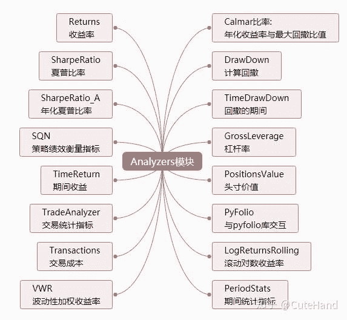
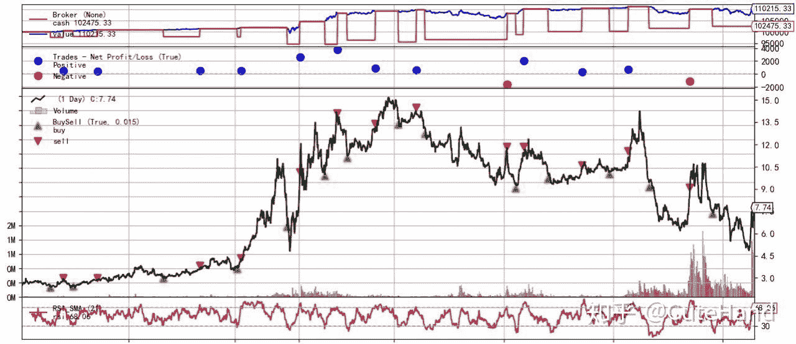
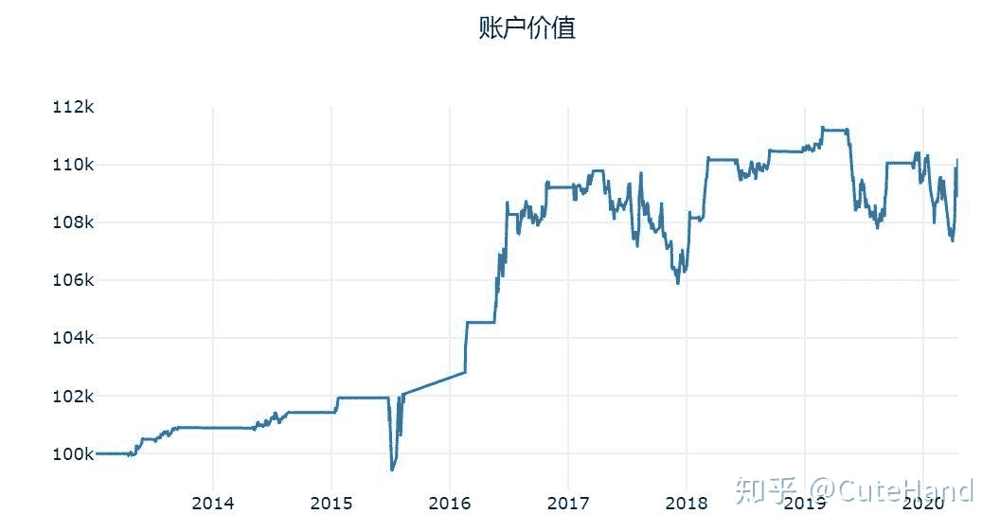
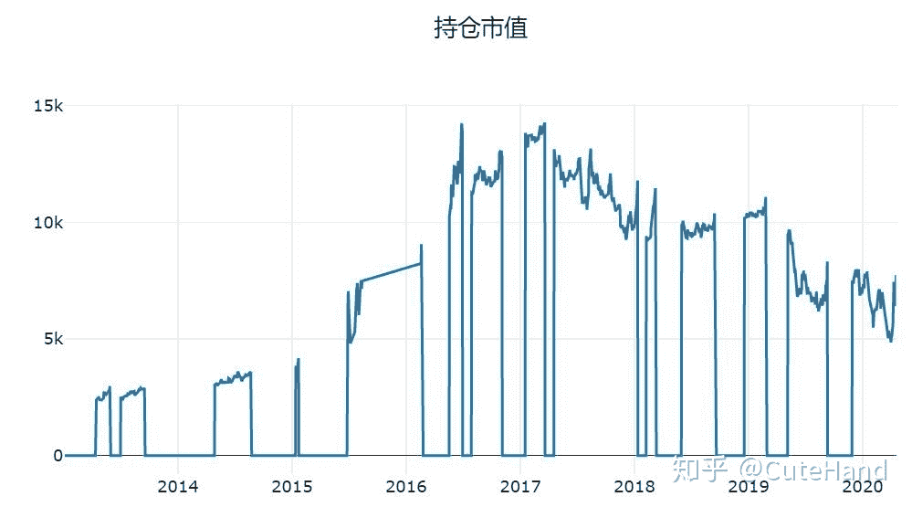
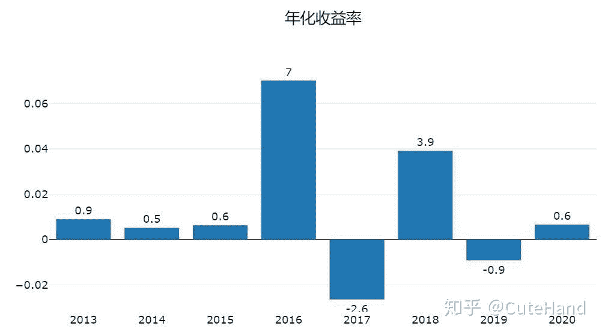
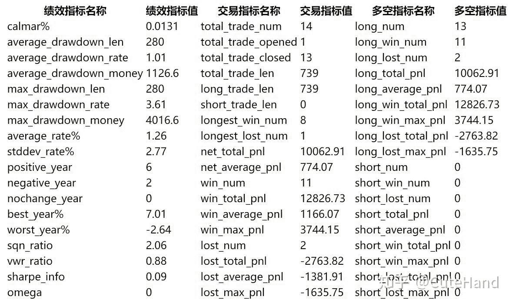

<!--yml
category: 交易
date: 2023-09-17 20:11:44
-->

# 【手把手教你】入门量化回测最强神器backtrader（三） - 知乎

> 来源：[https://zhuanlan.zhihu.com/p/133623610](https://zhuanlan.zhihu.com/p/133623610)

## 1 引言

关于backtrader，前两篇推文分别介绍了整个框架的组成部分和回测系统的运行，以及策略模块交易日志的编写和策略参数的寻优。本文在这两篇文章的基础上，着重介绍backtrader的Analyzers模块，并对策略的业绩评价指标进行可视化分析。Analyzers模块涵盖了评价一个量化策略的完整指标，如常见的夏普比率、年化收益率、最大回撤、Calmar比率等等。Analyzers模块原生代码能获取的评价指标如下图所示，其中TradeAnalyzer和PeriodStats又包含了不少指标。由于采用元编程，Analyzers的扩展性较强，可以根据需要添加自己的分析指标，如获取回测期间每一时刻对应的总资金。



## 2 Python实现代码

01 策略模块编写

## **再次回顾一下交易策略模块（Strategy）的组成部分。交易策略类代码通常包含参数或函数名如下：**

（1）params-全局参数，可选：更改交易策略中变量/参数的值，可用于参数调优。

（2）log：日志，可选：记录策略的执行日志，可以打印出该函数提供的日期时间和txt变量。

（3） init：用于初始化交易策略的类实例的代码。

（4）notify_order，可选：跟踪交易指令（order）的状态。order具有提交，接受，买入/卖出执行和价格，已取消/拒绝等状态。

（5）notify_trade，可选：跟踪交易的状态，任何已平仓的交易都将报告毛利和净利润。

（6）next，必选：制定交易策略的函数，策略模块最核心的部分。

（7）其他，包括start()、nextsstart()、stop()、prenext()、notify_fund()、notify_store()和notify_cashvalue。

下面以技术分析指标RSI（不了解的请自行百度）的择时策略为例，当RSI<30时买入，RSI>70时卖出。为了简便起见，策略模块中只包含最核心的交易信号。

```
import pandas as pd

import backtrader as bt
from datetime import datetime
class MyStrategy(bt.Strategy):
    params=(('short',30),
            ('long',70),)
    def __init__(self):
        self.rsi = bt.indicators.RSI_SMA(
                   self.data.close, period=21)
    def next(self):
        if not self.position:
            if self.rsi < self.params.short:
                self.buy()
        else:
            if self.rsi > self.params.long:
                self.sell()
```

02 回测设置

回测系统设置与之前一样，主要是数据加载、交易本金、手续费、交易数量的设置，此处以tushare的旧接口获取股票002537的交易数据进行量化回测。

```
from __future__ import (absolute_import, division, print_function,  
                        unicode_literals) 
import tushare as ts
#以股票002537为例
df=ts.get_k_data('002537',start='2010-01-01')
df.index=pd.to_datetime(df.date)
#df['openinterest'] = 0
df=df[['open','high','low','close','volume']]
data = bt.feeds.PandasData(dataname=df,                               
                            fromdate=datetime(2013, 1, 1),                               
                            todate=datetime(2020, 4, 17) )
# 初始化cerebro回测系统设置                           
cerebro = bt.Cerebro()  
# 加载数据
cerebro.adddata(data) 
# 将交易策略加载到回测系统中
cerebro.addstrategy(MyStrategy) 
# 设置初始资本为100,000
cerebro.broker.setcash(100000.0) 
#每次固定交易数量
cerebro.addsizer(bt.sizers.FixedSize, stake=1000) 
#手续费
cerebro.broker.setcommission(commission=0.001) 
```

03 运行回测

这里重点是Analyzers模块的调用与结果输出，调用模块是cerebro.addanalyzer()，再从模块中获取分析指标，如夏普比率是bt.analyzers.SharpeRatio，然后是给该指标重命名方便之后调用，_name='SharpeRatio'。要获取分析指标，需要先执行回测系统，cerebro.run()，并将回测结果赋值给变量results，分析指标存储在results[0]里（strat变量代替），通过strat.analyzers.SharpeRatio.get_analysis()即可获取相应数据，其他指标操作方法类似。

```
print('初始资金: %.2f' % cerebro.broker.getvalue())
cerebro.addanalyzer(bt.analyzers.SharpeRatio, _name = 'SharpeRatio')
cerebro.addanalyzer(bt.analyzers.DrawDown, _name='DW')
results = cerebro.run()
strat = results[0]
print('最终资金: %.2f' % cerebro.broker.getvalue())
print('夏普比率:', strat.analyzers.SharpeRatio.get_analysis())
print('回撤指标:', strat.analyzers.DW.get_analysis())
```

输出结果：
初始资金: 100000.00
最终资金: 110215.33
夏普比率: OrderedDict([('sharperatio', 0.094)])
回撤指标: AutoOrderedDict([('len', 280), ('drawdown', 1.01), ('moneydown', 1126.60), ('max', AutoOrderedDict([('len', 280), ('drawdown', 3.61), ('moneydown', 4016.60)]))])

04 回测结果可视化

下面输出回测图表，一张大图上包含三张图：

（1）资金变动图：可以看到在实施交易策略的数据期内，资金的盈利/损失。
（2）交易收益/亏损。 蓝色（红色）点表示获利（亏损）交易以及获利（亏损）多少。
（3）价格图表。 绿色和红色箭头分别表示交易策略的进入点和退出点。 黑线是交易标的随时间变化的价格， 条形图表示每个条形图期间资金的交易量。

```
%matplotlib inline 
cerebro.plot()
```



05 Analyzers模块指标可视化

下面是对Analyzers模块涵盖的策略评价指标进行可视化。注意，下图中用到的所有评价指标的获取方法与上述的夏普比率和最大回撤是一样的。为更好地展示结果，本文将其这些分析指标的值进行表格和图形化，采用plotly和dash进行动态可视化（也可以使用pyecharts）。由于这部分内容涉及的代码较多，此处省略。**以下策略结果可视化代码借鉴了云金杞的《[用dash和plotly输出backtrader的回测结果](https://zhuanlan.zhihu.com/p/98775974)》，之前在参考资料上没有备注，对原作者表示抱歉，详细内容大家可通过原文学习。**

通过图形和绩效评价指标可以直观的看出量化策略的表现，输出结果如下：



## 3 结语

本文以RSI技术指标构建择时策略为例，着重介绍了Analyzers模块的调用方法和结果报告，并对回测的评价指标进行可视化。通过上述图表可见backtrader作为一个本地开源框架的强大之处，只需适当的设置，便可得到与量化平台类似的回测效果。最后，学习没有捷径，要想全面而深入地学习backtrader，最好是研读其官方文档。当然，编程能力较强的可以直接研究其安装包的原生代码，了解各个模块的构成，并进行功能扩展和数据源对接等。

**参考资料：**

**1\.** backtrader官方文档和安装包原生代码

[](https://link.zhihu.com/?target=https%3A//www.backtrader.com/docu/)

2\. 云金杞的《用dash和plotly输出backtrader的回测结果》

[云金杞：用dash和plotly输出backtrader的回测结果](https://zhuanlan.zhihu.com/p/98775974)