<!--yml
category: 交易
date: 2023-09-17 20:10:53
-->

# 【手把手教你】用backtrader量化回测海龟交易策略 - 知乎

> 来源：[https://zhuanlan.zhihu.com/p/161882477](https://zhuanlan.zhihu.com/p/161882477)

## **01 引言**

海龟交易策略是比较经典的趋势交易系统之一，涵盖了从入场交易（品种选择）、仓位管理（基于ATR加减仓）、离场（触发条件）的整个过程。机械套用海龟交易法则在A股上进行交易可能效果不佳，但其交易系统的思维和动态仓位管理仍然值得挖掘和学习借鉴。公众号推文《【手把手教你】用Python量化海龟交易法则》简要介绍了海龟交易法则的基本原理，使用Python对其买卖信号进行了可视化分析，并利用Pandas对相关指数和个股运用简化版的海龟交易规则进行了历史回测。本文在此基础上，利用backtrader框架对海龟交易法则进行完整的量化回测。

## **02 策略代码**

以下代码使用Jupyter notebook进行编译。

```
from __future__ import (absolute_import, division, print_function,unicode_literals)
import backtrader as bt
import pandas as pd
import tushare as ts
import matplotlib.pyplot as plt
%matplotlib inline
from pylab import mpl
mpl.rcParams['font.sans-serif']=['SimHei']
mpl.rcParams['axes.unicode_minus']=False
```

使用tushare获取数据，根据backtrader的数据格式对数据进行处理。

```
def get_data(code,start='2010-01-01',end='2020-07-16'):
    df=ts.get_k_data(code,autype='qfq',start=start,end=end)
    df.index=pd.to_datetime(df.date)
    df['openinterest']=0
    df=df[['open','high','low','close','volume','openinterest']]
    return df
```

**交易策略**

回顾一下海龟交易法则的策略思路：

入场条件：当收盘价突破20日价格高点时，买入一单元股票；

加仓条件：当价格大于上一次买入价格的0.5个ATR（平均波幅），买入一单元股票，加仓次数不超过3次；

止损条件：当价格小于上一次买入价格的2个ATR时清仓；

离场条件：当价格跌破10日价格低点时清仓。

这里的20日价格高点和10日价格低点构成唐奇安通道，所以海龟交易法则也可以理解成通道突破的趋势跟踪。

大家可能有一个疑问，唐奇安通道为啥是以20日、10线为上下轨线，不能是30日、5日或其他吗？当然，这里的20日和10日参数其实是根据经验而定的。不同标的参数选取可能存在一定差异，下面不妨将时间周期作为可变参数，通过参数优化选取合适的时间周期进行回测。

```
class TurtleStrategy(bt.Strategy):
#默认参数
    params = (('long_period',20),
              ('short_period',10),  
              ('printlog', False), )   

    def __init__(self):        
        self.order = None      
        self.buyprice = 0      
        self.buycomm = 0      
        self.buy_size = 0      
        self.buy_count = 0       
        # 海龟交易法则中的唐奇安通道和平均波幅ATR        
        self.H_line = bt.indicators.Highest(self.data.high(-1), period=self.p.long_period)        
        self.L_line = bt.indicators.Lowest(self.data.low(-1), period=self.p.short_period)       
        self.TR = bt.indicators.Max((self.data.high(0)- self.data.low(0)),\
                                    abs(self.data.close(-1)-self.data.high(0)), \
                                    abs(self.data.close(-1)  - self.data.low(0)))        
        self.ATR = bt.indicators.SimpleMovingAverage(self.TR, period=14)       
        # 价格与上下轨线的交叉      
        self.buy_signal = bt.ind.CrossOver(self.data.close(0), self.H_line)        
        self.sell_signal = bt.ind.CrossOver(self.data.close(0), self.L_line)    

    def next(self): 
        if self.order:
            return        
        #入场：价格突破上轨线且空仓时        
        if self.buy_signal > 0 and self.buy_count == 0:                                 
            self.buy_size = self.broker.getvalue() * 0.01 / self.ATR            
            self.buy_size  = int(self.buy_size  / 100) * 100                             
            self.sizer.p.stake = self.buy_size             
            self.buy_count = 1            
            self.order = self.buy()        
        #加仓：价格上涨了买入价的0.5的ATR且加仓次数少于3次（含）        
        elif self.data.close >self.buyprice+0.5*self.ATR[0] and self.buy_count > 0 and self.buy_count <=4:           
            self.buy_size  = self.broker.getvalue() * 0.01 / self.ATR            
            self.buy_size  = int(self.buy_size  / 100) * 100            
            self.sizer.p.stake = self.buy_size             
            self.order = self.buy()           
            self.buy_count += 1        
        #离场：价格跌破下轨线且持仓时        
        elif self.sell_signal < 0 and self.buy_count > 0:            
            self.order = self.sell()            
            self.buy_count = 0        
        #止损：价格跌破买入价的2个ATR且持仓时        
        elif self.data.close < (self.buyprice - 2*self.ATR[0]) and self.buy_count > 0:           
            self.order = self.sell()
            self.buy_count = 0   

    #交易记录日志（默认不打印结果）
    def log(self, txt, dt=None,doprint=False):
        if self.params.printlog or doprint:
            dt = dt or self.datas[0].datetime.date(0)
            print(f'{dt.isoformat()},{txt}')

    #记录交易执行情况（默认不输出结果）
    def notify_order(self, order):
        # 如果order为submitted/accepted,返回空
        if order.status in [order.Submitted, order.Accepted]:
            return
        # 如果order为buy/sell executed,报告价格结果
        if order.status in [order.Completed]: 
            if order.isbuy():
                self.log(f'买入:\n价格:{order.executed.price},\
                成本:{order.executed.value},\
                手续费:{order.executed.comm}')

                self.buyprice = order.executed.price
                self.buycomm = order.executed.comm
            else:
                self.log(f'卖出:\n价格：{order.executed.price},\
                成本: {order.executed.value},\
                手续费{order.executed.comm}')

            self.bar_executed = len(self) 

        # 如果指令取消/交易失败, 报告结果
        elif order.status in [order.Canceled, order.Margin, order.Rejected]:
            self.log('交易失败')
        self.order = None

    #记录交易收益情况（可省略，默认不输出结果）
    def notify_trade(self,trade):
        if not trade.isclosed:
            return
        self.log(f'策略收益：\n毛收益 {trade.pnl:.2f}, 净收益 {trade.pnlcomm:.2f}')

    def stop(self):
        self.log(f'(组合线：{self.p.long_period},{self.p.short_period})； \
        期末总资金: {self.broker.getvalue():.2f}', doprint=True)
```

由于交易过程中需要对仓位进行动态调整，每次交易一单元股票（不是固定的一股或100股，根据ATR而定），因此交易头寸需要重新设定。

```
class TradeSizer(bt.Sizer):
    params = (('stake', 1),)    
    def _getsizing(self, comminfo, cash, data, isbuy):        
        if isbuy:          
            return self.p.stake        
        position = self.broker.getposition(data)        
        if not position.size:            
            return 0        
        else:            
            return position.size        
        return self.p.stake
```

为了与backtrader回测结果进行对比，下面对选取的标的在区间的价格走势和累计涨幅进行可视化。

```
def plot_stock(code,title,start,end):
    dd=ts.get_k_data(code,autype='qfq',start=start,end=end)
    dd.index=pd.to_datetime(dd.date)
    dd.close.plot(figsize=(14,6),color='r')
    plt.title(title+'价格走势\n'+start+':'+end,size=15)
    plt.annotate(f'期间累计涨幅:{(dd.close[-1]/dd.close[0]-1)*100:.2f}%', xy=(dd.index[-150],dd.close.mean()), 
             xytext=(dd.index[-500],dd.close.min()), bbox = dict(boxstyle = 'round,pad=0.5',
            fc = 'yellow', alpha = 0.5),
             arrowprops=dict(facecolor='green', shrink=0.05),fontsize=12)
    plt.show()
```

将backtrader回测设置封装成函数，减少代码的复用。

```
def main(code,long_list,short_list,start,end='',startcash=1000000,com=0.001):
    #创建主控制器
    cerebro = bt.Cerebro()      
    #导入策略参数寻优
    cerebro.optstrategy(TurtleStrategy,long_period=long_list,short_period=short_list)    
    #获取数据
    df=ts.get_k_data(code,autype='qfq',start=start,end=end)
    df.index=pd.to_datetime(df.date)
    df=df[['open','high','low','close','volume']]
    #将数据加载至回测系统
    data = bt.feeds.PandasData(dataname=df)    
    cerebro.adddata(data)
    #broker设置资金、手续费
    cerebro.broker.setcash(startcash)           
    cerebro.broker.setcommission(commission=com)    
    #设置买入设置，策略，数量
    cerebro.addsizer(TradeSizer)    
    print('期初总资金: %.2f' % cerebro.broker.getvalue())    
    cerebro.run(maxcpus=1) 
```

## **03回测实例**

**指数回测**

上面对整个海龟交易策略在backtrader上的回测进行了函数封装，下面以上证综指为例（假设可以直接交易），对2010-01-01至2020-07-17期间进行回测。从下图可看出，如果按照“买入持有”进行交易，期间累计涨幅是-0.91%，这对于广大A股股民来说已经是见怪不怪了。两会期间已经有专家指出上证综指的失真，并提出对上证综指进行修订以反映实体经济的发展趋势。

```
plot_stock('sh','上证综指','2010-01-01','2020-07-17') 
```

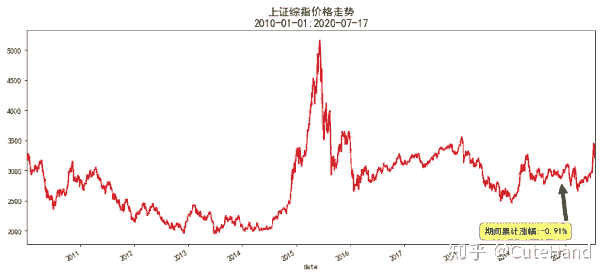

通过对参数进行优化发现，如果以上证综指为交易标的，最优的参数并非是（20、10）日组合，而是（50,5）日，即指数突破50日线新高时才入场，跌破5日最低时离场。

```
long_list=range(20,70,5)
short_list=range(5,20,5)
main('sh',long_list,short_list,'2010-01-01','2020-07-17') 
```

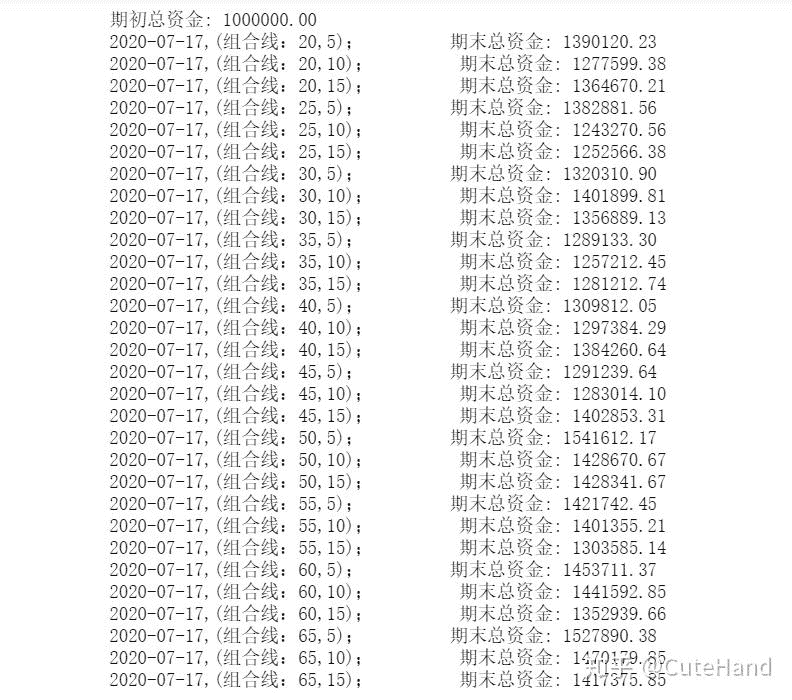

将回测设置和策略评价指标可视化进行封装，由于篇幅有限，策略评价指标可视化代码此处省略。

```
def performance(code,long,short,start,end,startcash,com):
    代码略

#回测实例
df00,df0,df1,df2,df3,df4=performance('sh',50,5,'2010-01-01','2020-07-17',1000000,0.001)
```

#输出结果：

2020-07-17,(组合线：50,5)； 期末总资金: 1541612.17

量化回测绩效评价指标：

`df00`

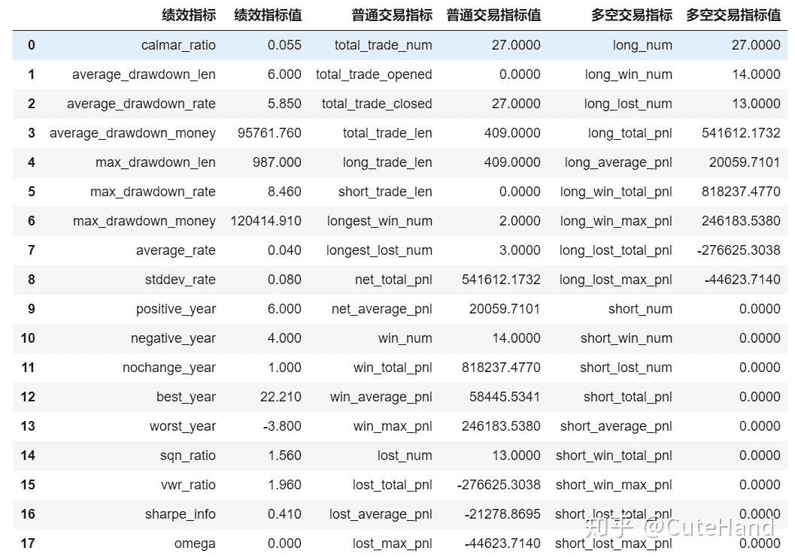

对交易标的回测结果进行可视化，包含账户价值、持仓价值和每年的年化收益率。

```
def plot_result_py(data,v,title,plot_type='line',zoom=False):
    代码略，完整代码见知识星球

plot_result_py(df0,'total_value','账户价值')
```

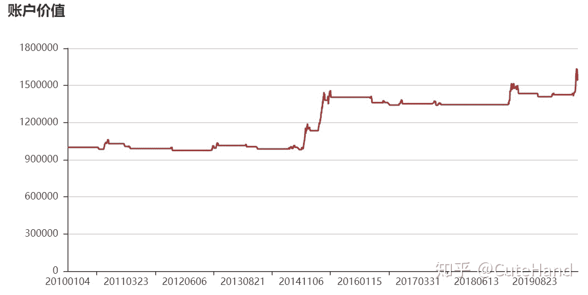

```
plot_result_py(df4,'total_position_value','持仓市值')
```

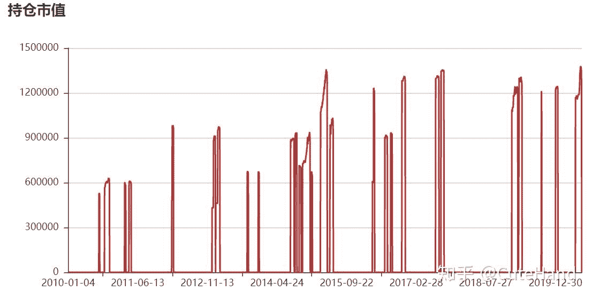

```
plot_result_py(df3,'year_rate','年化收益%',plot_type='bar')
```

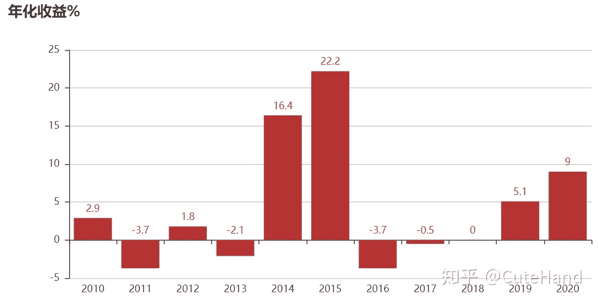

**个股回测**

由于指数不可直接交易，下面以中国平安（601318）股票为例进行回测。下图显示，如果以“买入持有”策略交易中国平安，十年来累计收益率达到232.62%，远远跑赢上证综指。

```
plot_stock('601318','中国平安','2010-01-01','2020-07-17')
```

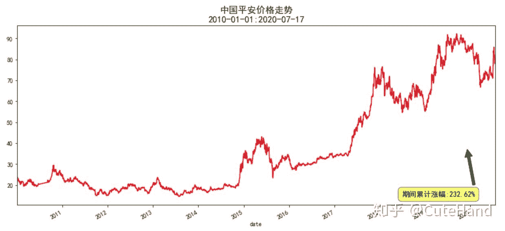

参数优化显示，中国平安最佳参数刚好是海龟交易法则提出的（20,10）日组合，看来先贤总结的经验还是值得推敲的。

```
long_list=range(20,70,5)
short_list=range(5,20,5)
main('601318',long_list,short_list,'2010-01-01','2020-07-16',startcash=100000)
```

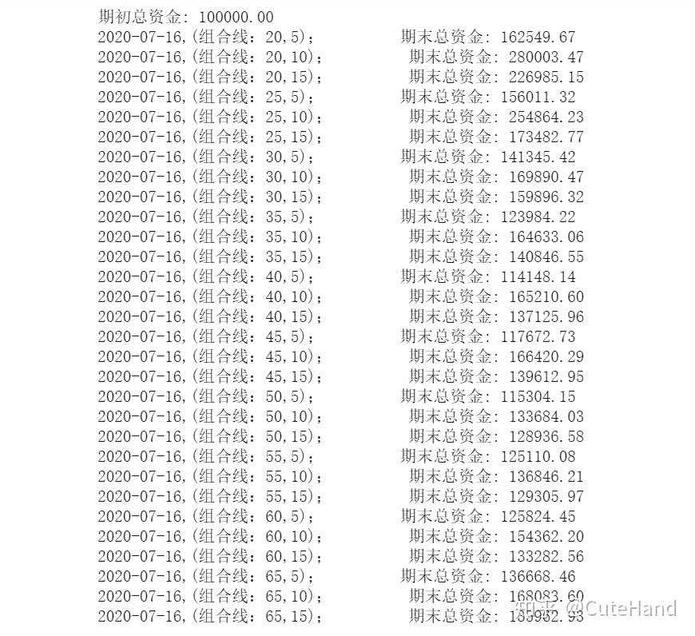

中国平安回测绩效指标：


中国平安回测期间账户价值：

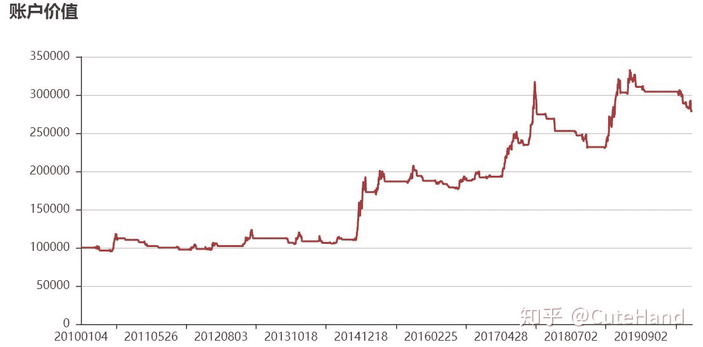

中国平安回测期间持仓市值：

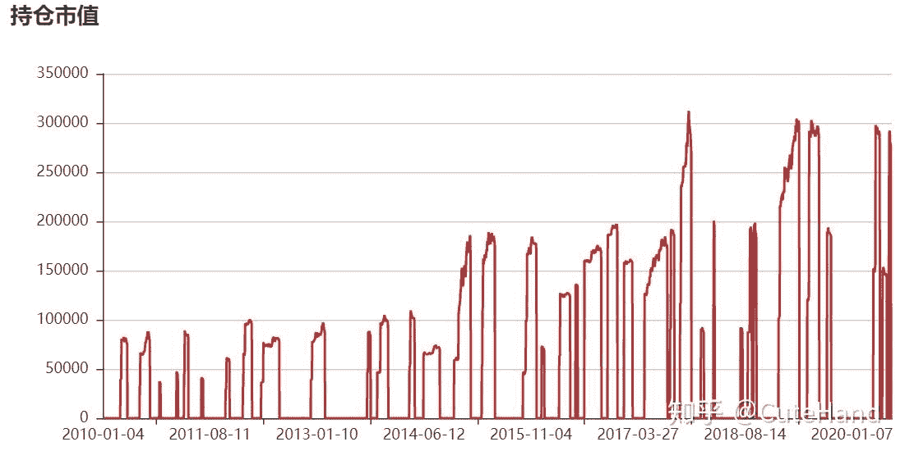

中国平安回测期间年化收益：

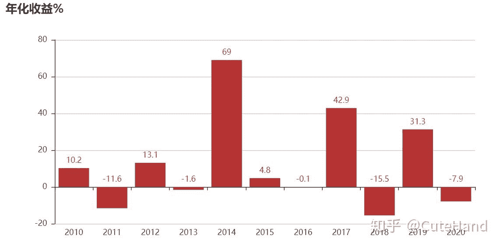

**04结语**

本文基于backtrader，构建了海龟交易法则的完整回测框架，并分别以上证综指和中国平安为例进行了回测。从回测实例看，海龟交易法则优于“买入持有”策略，（20,10）日线的参数选择可能只适合某些标的。当然这里只是简单举了两个例子，所以还无法将结论进一步推广。本文的目的主要在于为大家深入研究海龟交易法则的量化提供思路和分析框架，而不在于验证该策略是否适用于A股市场。上述回测过程给人的直观感受是回归交易法则更像是一个择时策略，即在价格触发某条件时买入\卖出。实际上择时和选股有时候是一个硬币的两面，没有本质上的区别。如果以所有A股为股票池（当然可以先剔除ST、业绩亏损、超大盘等），加入遍历循环，当某只股票满足突破上轨（如20日最高价）时买入构建投资组合，当跌破下轨（如10日最低价）或满足止损条件时从组合中剔除，这时候海龟交易法则兼有选股和择时，感兴趣的读者可以进一步去挖掘和分析。

**参考资料：**

1\. backtrader官方文档和安装包原生代码

[https://www.backtrader.com/docu/](https://link.zhihu.com/?target=https%3A//www.backtrader.com/docu/)

2.知乎：量化投资2：基于backtrader实现完整海龟法则量化回测

[https://zhuanlan.zhihu.com/p/114782214](https://zhuanlan.zhihu.com/p/114782214)