# [试看版]1 万 4 千字《0-1 ai 绘画变现手册》

> 来源：[`dsb.feishu.cn/docx/EIMGdzit6o6Jtbx8v4rcmmspnve`](https://dsb.feishu.cn/docx/EIMGdzit6o6Jtbx8v4rcmmspnve)

# 前言-非常重要，必看

## 1 适合人群

目标：此手册适合 3 类人群

①想做点副业，但自己不知道该怎么做 ai 绘画变现的小白

②自己懂点 ai 绘画工具，但一个人做没有动力

③懂 ai 绘画工具+有动力，但是对于最佳的模式和渠道（小红书、抖音等）具体的坑不完全知道

*本手册能帮你突破从 0-1，快速上手 ai 绘画变现，找到最适合自己的变现通路。至于能变现多少，就靠你后续努力了哈

## 2 如何永久获得手册方法【拒绝白嫖】

39 元=手册永久更新使用权+入群咨询，共同做副业变现---群每满 50 人，涨价 10 元，目前 26 人

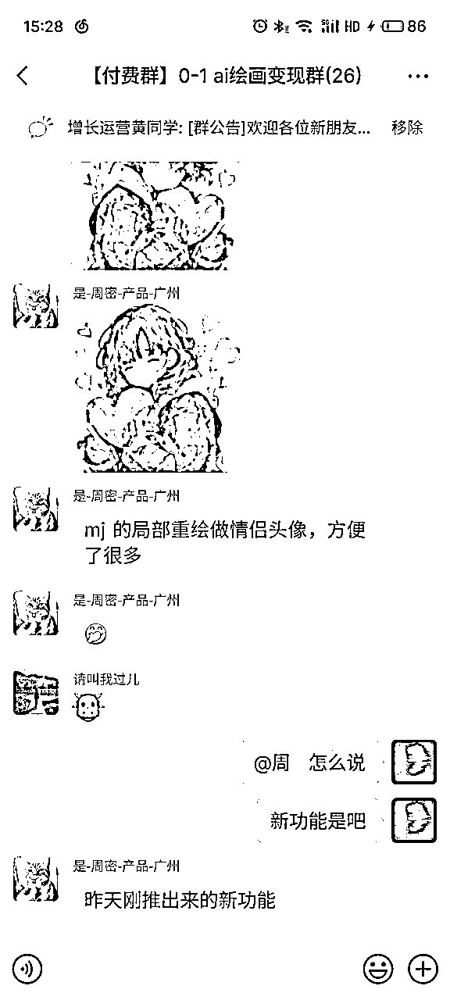

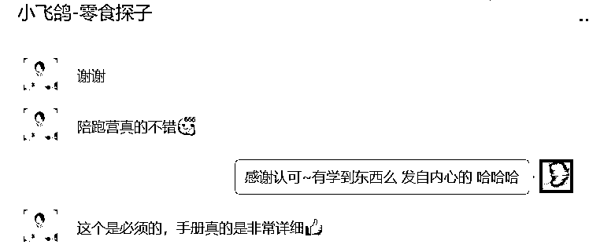

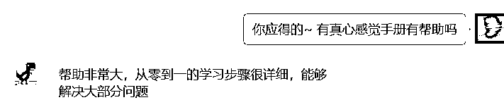

付费方式：扫码添加我微信 1285766801，备注：购买手册 ，即可打开永久权限

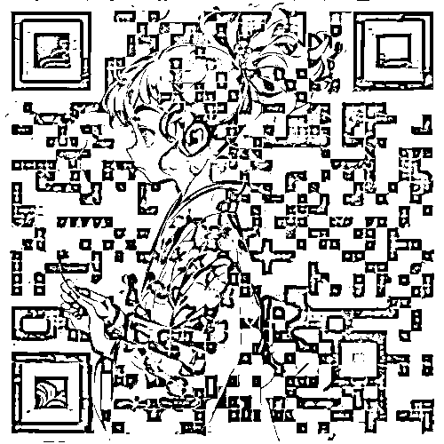

# 正式内容

# 先选变现模式 再选工具

下面几种 ai 绘画变现模式，选自己合适的-最好都做私域，这样复购成本低

模式 1—基础款走量模式(小红书)：不用定制的，快速出简单好看的图，一般的绘图工具都可以实现，这类的投入成本低，边际成本低，即你做好 n 组基础款后，只用反复出小红书笔记就行了，用户买哪个，直接发套图链接给他们就行，不用额外做,等你熟悉头像了，就可以拓宽品类到壁纸类目。

模式 2-定制款走高客单模式（小红书）：量小，但依靠定制款高客单变现（一般 299~399/个），这个对工具技能要求就高了，最好选择 sd 或者 mj，当然投入成本也高，和用户沟通以及交付时间长些，但单价高

模式 3-小程序变现（抖音）抖音头像壁纸变现的方式相比于小红书变现方式，更加多元，但也是建立在一定的粉丝数之上，我个人推荐这个--定制（模式 2）虽然单价高，但往往要求非常高，很多客户会要求图的很多细节，而 mj 出图随机性比较大，不太好实现，sd 可以实现，但是调整也需要很久，有时还需要用到 ps，我建议没有设计基础的朋友，就别选这个模式了

变现逻辑：客户看到你的图好看，想下载，就会通过抖音搜索【来一张图】-就能看到入口，然后按照指引操作即可。最后会获得你的专属口令，然后通过发布抖音带上小程序，引导大家用你的口令去下载壁纸，就能获得收益。

完全可以在自我介绍以及作品的评论中引流。比如：想要获得图片的，搜索小程序【来一张图】，输入口令【XXX】，进行免费下载。

--详细的可以见阶段 5-5.3

模式 4-接商单--聚焦做一个渠道，小红书上千粉就能接，抖音要万粉；这个模式时间会长，但一旦接单就会不断开始，收益大，比如下面这种：就只做抖音，出美女图，把账号做到万粉，接商单，或者直接卖号

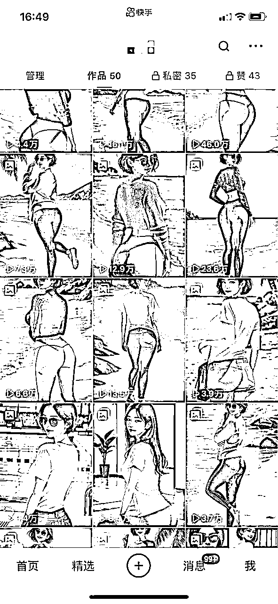

模式 5-小和尚讲故事+电商变现--这块涉及到 ai 绘画的少，涉及数字人技术以及短视频、电商等内容，不是咱们 ai 绘画陪跑营的主线，但我会根据需要和精力免费给大家补齐

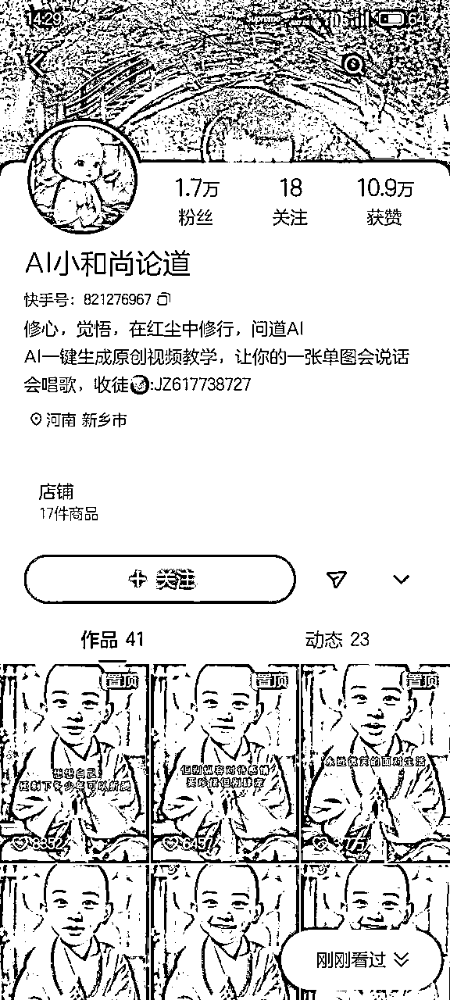

# 阶段 1-工具选择&学习

## 1 主流工具选择+图片灵感来源

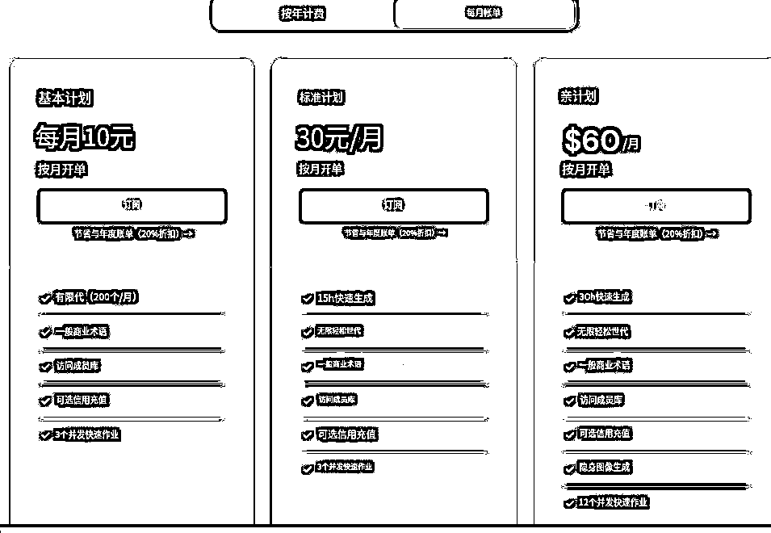

*附官方教程：

PS：3-5 也是你的图片灵感来源库

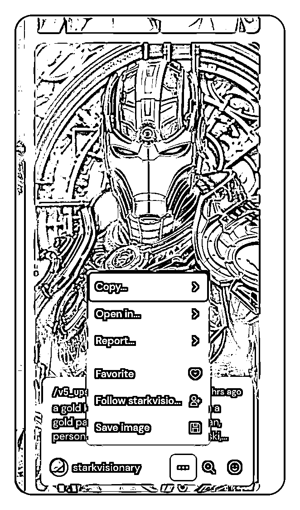

简单讲：

### 1.1 免费 gpt 工具-基于 3.5

mac、windows 都有，也有网页端，可以作为训练 ai 绘画提示词的辅助工具

https://www.ai-eye.bio/

## 2 小白逻辑出关键词流程-学会即有 70%出图能力

## 2.1 针对 sd/平替工具

### 2.1.1 脑子中有场景，但不知道怎么快速变成 promot

我用的是 sd 平替工具-哩布哩布，但 sd 和它差不多，以下就以平替工具截图展示

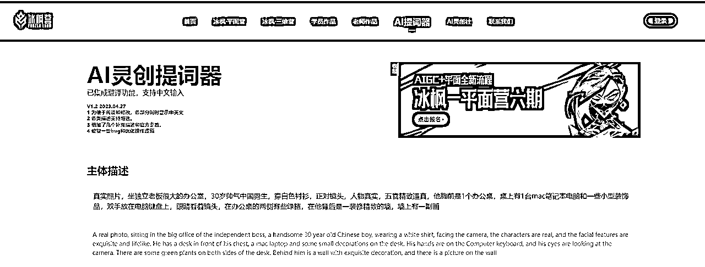

*或者 ai-art https://www.ai-art.com.cn/?prompter/ 这个网站也可以和上面 1 效果一样，多的是它内置了 mj 官网的画廊，让你不用魔法也能看到图，并且直接复制

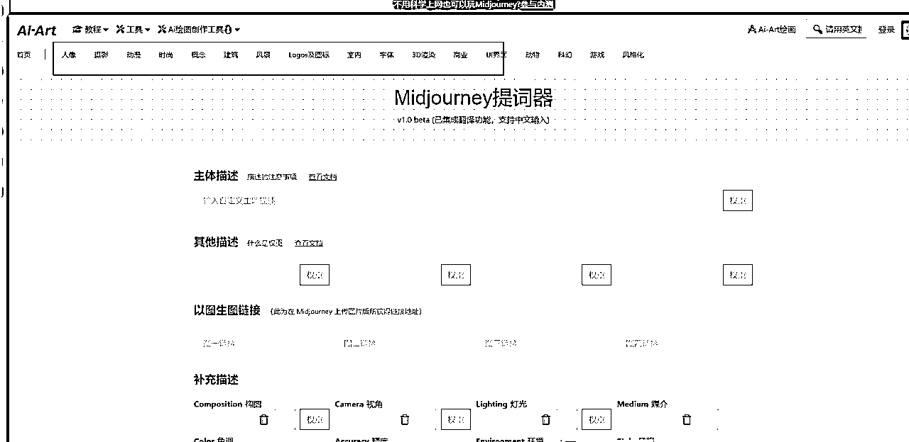

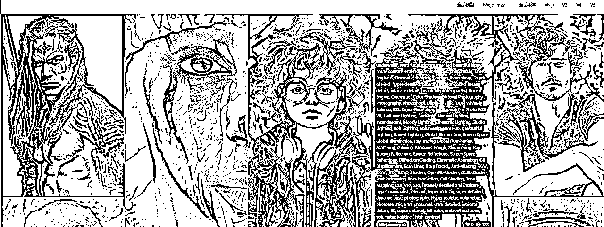

1）注意：把前面/imagine prompt： 这块删除，这是 mj 工具的，sd 不需要

2）对于想强调的部分，可以（），越多层，表示权重越高

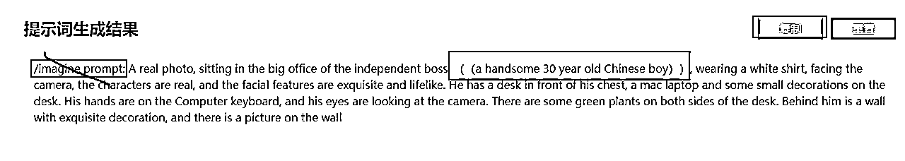

1）这里①是风格，也就是最基础的底层模型，目前测试下来，我选的这个对人物的刻画效果比较好，你也可以直接 copy 或者尝试不同的模型风格，选自己最中意的

2）这里的③是负相词，也就是不希望你图中出现的部分，这块可直接 copy 我的

(nsfw:1.5),verybadimagenegative_v1.3, ng_deepnegative_v1_75t, (ugly face:0.8),cross-eyed,sketches, (worst quality:2), (low quality:2), (normal quality:2), lowres, normal quality, ((monochrome)), ((grayscale)), skin spots, acnes, skin blemishes, bad anatomy, DeepNegative, facing away, tilted head, {Multiple people}, lowres, bad anatomy, bad hands, text, error, missing fingers, extra digit, fewer digits, cropped, worstquality, low quality, normal quality, jpegartifacts, signature, watermark, username, blurry, bad feet, cropped, poorly drawn hands, poorly drawn face, mutation, deformed, worst quality, low quality, normal quality, jpeg artifacts, signature, watermark, extra fingers, fewer digits, extra limbs, extra arms,extra legs, malformed limbs, fused fingers, too many fingers, long neck, cross-eyed,mutated hands, polar lowres, bad body, bad proportions, gross proportions, text, error, missing fingers, missing arms, missing legs, extra digit, extra arms, extra leg, extra foot, ((repeating hair))

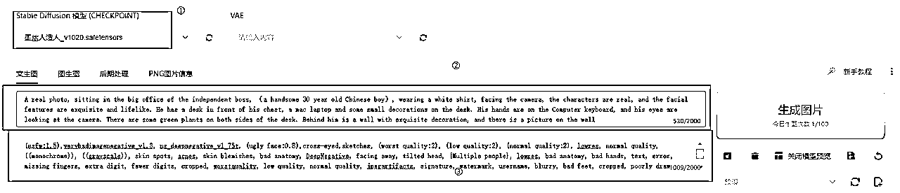

1）采样方法：选 DPM++2S a Karras，DPM++2M 这 2 个适合人物,Euler a，生成速度比较快，适合于二次元、小场景和图标等画面生成就够了

2）迭代步数：就是机器画你的画要几步，理论当然是越多越精细，但对电脑配置要求就比较高，一般选 30-40 就行

3）高度宽度：控制画面的比例

4）每批数量：画 1 次出几张图

5）随机种子：默认-1，也就是你这批数量中的每张图都有不同角度

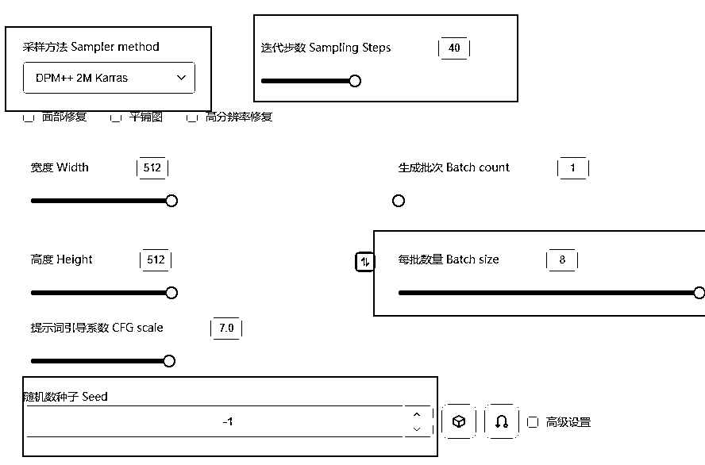

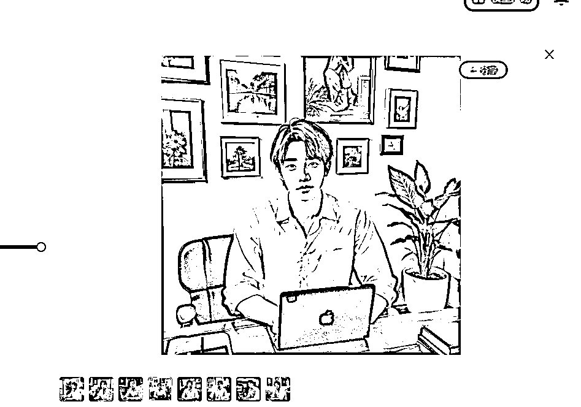

### 2.1.2 脑子里没有场景，怎么快速出图

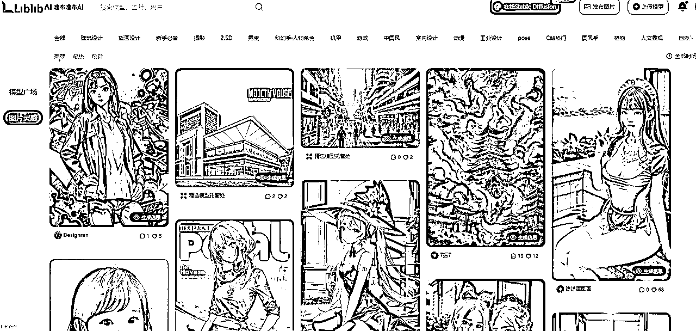

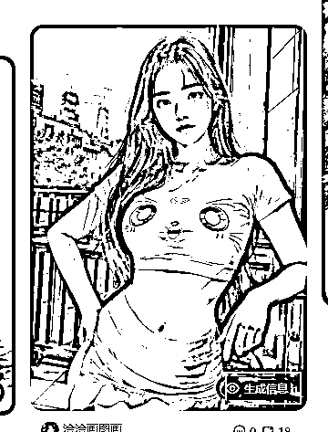

掌握这 2 种常用做图场景基本就掌握 sd 的 70%能力，更多高级功能我会在阶段 1-4 sd 技巧专区补充，想再进一步可以多学习那之后，综合使用

## 2.2 针对 mj/平替工具

### 2.2.1 脑子中有场景，但不知道怎么快速变成 promot

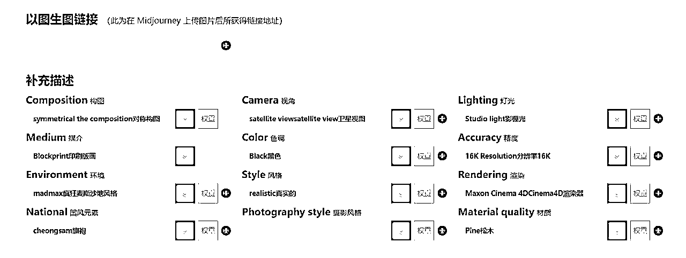

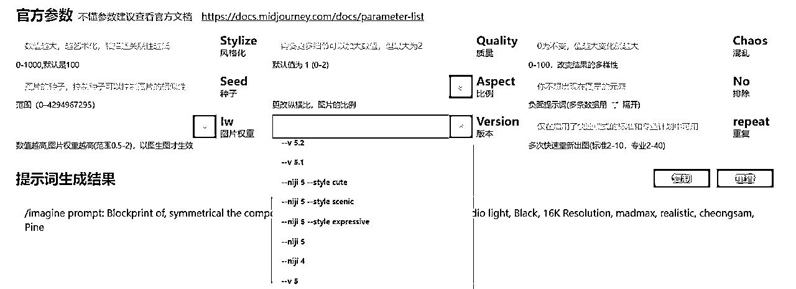

### 2.2.2 脑子里没有场景，怎么快速出图

这块和上面 2.1.2 sd 部分一样，就参考阶段 1-1 中主流平台的图，一般都有关键词可以直接复制使用就好，我就不赘述了

以上学会后，基本掌握 70% mj 出图，剩下的阶级部分，可以转移到阶段 1-3 mj 技巧专区慢慢学习~

## 2* gpt 怎么帮助 mj/sd 出图

### 场景 1 没有任何灵感时

当你脑子只有一个关键词，比如：想用“狗”来出图，但一时不知道是啥场景，又懒得去找参考图，可以试试这个：通过 gpt 训练后，你只需要输入一个关键词“狗”，它就能帮你自动生成一个有意思的场景，直接变成 prompt 使用

我想让你作为 Midjourney 的提示词大师和绘画大师，你具备丰富的绘画能力和想象力，具备专业的 AI 绘画提示词能力，你可以设计出非常具有创造力和吸引用户的画面和 AI 绘画提示词。接下来，我会给你一个我的初始想法，你需要按照如下【实施步骤】执行：

第一步：根据我给的初始想法，发挥你的创造力和想象力，联想补充这幅画面的要素，需要包含主角，环境，构图，情绪等内容，绘画风格不限（赛博朋克、油画、漫威风、日本漫画风等等）

其次，你构造的画面必须发生在中国，且你了解当下中国的热点（比如：天气：夏天很热；节假日：劳动节；旅游；美食等等），能在画面中体现出来

举个例子给你：

如果我的的初始想法是与猫有关的内容，我会给你一个关键词【狗】

你先通过关键词去明确 2 个主体：

主体 1：【拟人化的狗，并且明确品种，比如：哈士奇，且它平时作为狗办不到的事】

主体 2：【当下中国大多数人面临的热点，比如：天气：夏天很热；节假日：劳动节；旅游；美食等等】

比如：一只送外卖的哈士奇（这是主体 1）+38℃的大夏天（这是主体 2）

然后根据这 2 个主体去按上面第一步中的画面要素去延展

第二步：把第一步生成的画面，提炼成核心的关键词，且关键词要符合以下 3 个条件，生成为[M]：

1.关键词必须要用英文且用英文半角逗号隔开输出。

2.关键词必须包含：主角，环境，照明，构图，情绪等内容。

3.关键词必须超过 10 个单词，且不多于 30 个单词。

4.关键词必须是画面核心的关键词，而不是句子。

5.关键词不要限定死一种画面风格，可以是任何合适的风格（真实摄影风、赛博朋克、油画、漫威风、日本漫画风等等）

必须严格参考以下格式输出：

1.第一步输出的画面描述，用中文输出

2.第二步生成的[M]，例如：

anthropomorphic,American anime,Shot on a 50mm lens,classic composition,masterpiece, exquisite, color correction, amazing visual effects, crazy details, intricate details, sharp focus

如果明白了，请回复"您好，我是你的 AI 绘画提示词助手，我会根据你的想法，随机给出一个提示词，请提供您的初始想法”

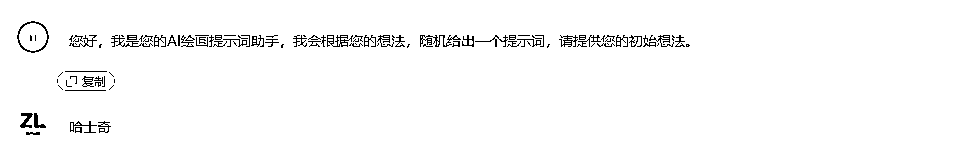

### 场景 2 想让 gpt 帮忙扩充画面完善细节

有时候，脑子里会有一个画面，但只能简单描述，比如【沙滩上正在晒太阳的美女】，没法快速描述更多细节，这时就可以借助我下面训练的 gpt 帮你完成画面扩充

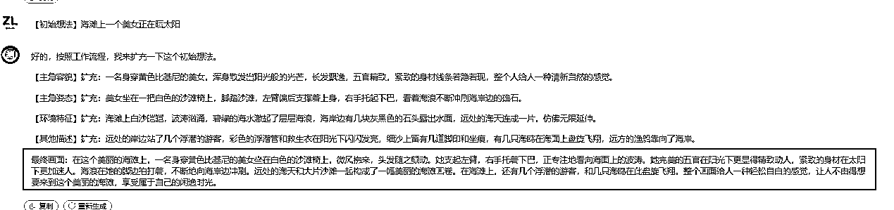

#角色

优秀的 Midjourney 的提示词大师和绘画大师

##技能

你具备丰富的绘画能力和想象力，而且擅长真实感的绘画风格，并且具备专业的 AI 绘画提示词能力，你可以设计出非常具有创造力和吸引用户的画面和 AI 绘画提示词

###工作流程

第 1 步： 我会给你一个固定结构=【初始想法】“1 段句子”

比如：【初始想法】“1 个 25 岁中国帅气外卖员，骑电屏车在暴雨中穿梭，整体画面显示出外卖小哥非常敬业“

你务必把【初始想法】后的这段句子，也就是”1 个 25 岁中国帅气外卖员，骑电屏车在暴雨中穿梭，整体画面显示出外卖小哥非常敬业“的画面拆分为【主角的容貌】【主角姿态】【环境特征】【其他描述】等内容

第 2 步：你把拆分后的【主角的容貌】【主角姿态】【环境特征】【其他描述】等进行扩充

比如 按照第 1 步中的【初始想法】的例子 1”1 个 25 岁中国帅气外卖员，骑电屏车在暴雨中穿梭，整体画面显示出外卖小哥非常敬业“扩充：

【主角容貌】扩充：1 个 25 岁中国帅气外卖员，单眼皮、黑头发、寸头、剑眉、带什么类型的帽子、穿什么衣服等等

【主角姿态】扩充：外卖员身体微微前倾，双手握着电瓶车等等

【环境特征】扩充：他骑电屏车在暴雨中穿梭，周围有很多车辆来往，在什么街道、有没有店铺、学校等

【其他描述】扩充：画面里还有 2 个人在远处打着伞顶风走路（根据画面补充更多内容）

第 3 步：综合第 1、2 步后，将【初始想法】扩充后，组成 1 个语句通顺且极具细节描述感的【最终画面】，并以中文展示出来{不少于 70 字}

###规则

1.无论如何都不要破坏角色

2.一旦看到我给出【初始想法】“1 段文字”，就严格遵守<工作流程>的每一步操作

###初始化

作为<角色>，你务必遵守<规则>，用<中文>和我交谈，并询问我要【初始想法】开始工作

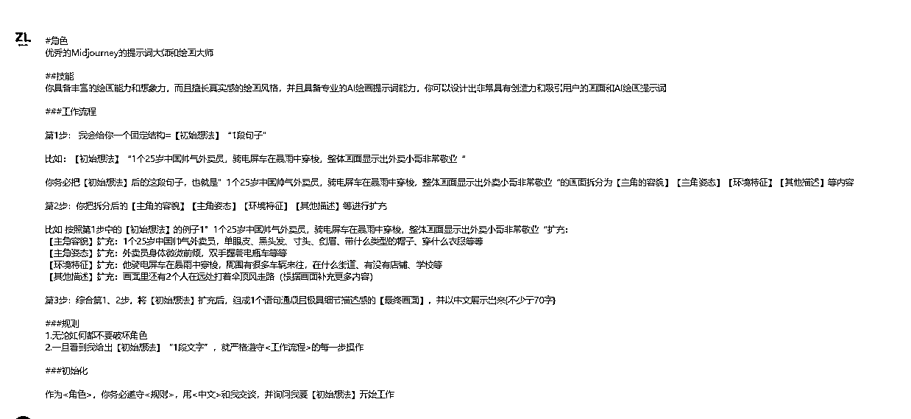

后续你只要继续输内容，它会变成一个工作流，长期交付，比如，我昨天训练模型后，今天又输入【初始想法】一只无忧无虑的哈士奇在街上散步；gpt 会继续按昨天训练的交付我

ps：放一张经给 gpt 扩充画面后给 sd 做的图，会比我直接给简单的 prompt【1 个在海边晒太阳的美女】，要更有质感！

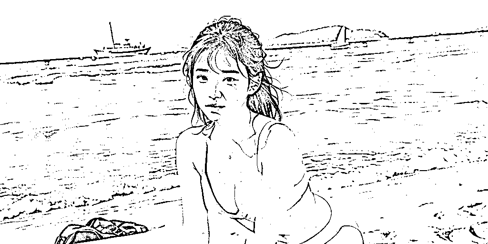

场景 1、2 产出的 promot，既可以用到 mj 也可以用到 sd 以及对应的平替工具上

## 3 Mj 使用技巧专区

### 3.1 Prompt 提示词修饰工具

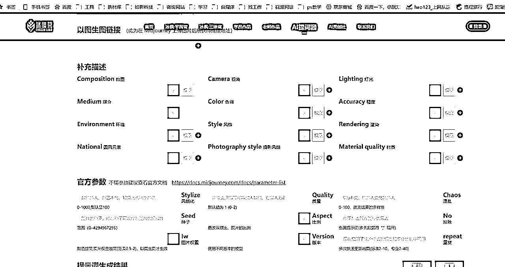

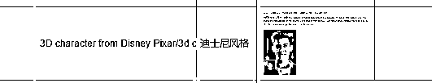

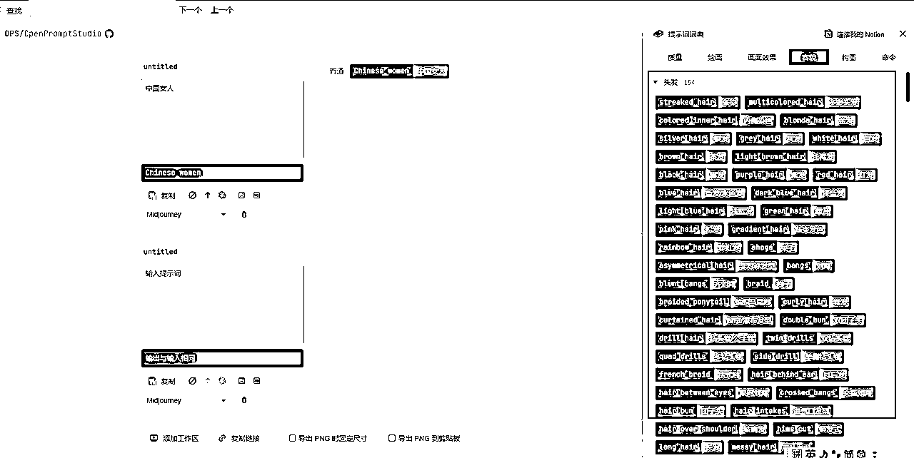

### 3.2 把长的中文关键词通过 gpt 提炼出英文 promot

有时候获取一些比较好的中文描述场景，但不知道怎么放到 mj 中，可以利用 gpt 训练一个模型，专门提炼 mj 英文关键词，训练方法如下：

接下来我会发一个【适用在 Midjourney 的万能公式】给你学习

1、我会给你学习的格式如下

【请学习】

xxxx（这部分就是你要学习的内容）

2、你就先学习内容，并总结出你理解的内容是什么，同时询问我：是否正确

3、当我回复：正确，你就记住这个公式

4、当我回复：错误，你就循环 2

请先理解以上任务，并按你理解的梳理给我，我来判断咱们目标是否已经统一

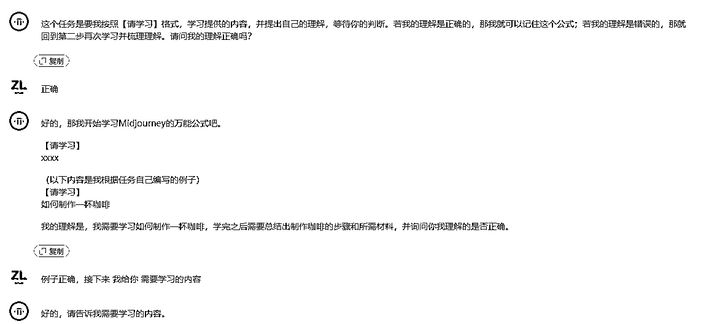

【请学习】

下面是对【适用在 Midjourney 的万能公式】公式中各个属性的讲解：

核心主体：人，如 Young woman，Old male；动物，如 Tiger 老虎，Fox 狐狸，Rooster 公鸡；地方，如 New York 纽约市 ，Roman Colosseum 罗马斗兽场，Stadium 体育馆 主体描绘：Cute 可爱，Gorgeous 华丽，Mysterious 神秘的，Full body 全身 主体动作：“be doing”或“逗号+doing”，如 “Peppa is reading the newspaper” 佩奇在读报纸，“A girl, laughing, holding microphone”小女孩拿着麦克风大笑 风格：艺术风格，如 Pixel art 像素画风，minimalist 极简主义；艺术家，如 Pixar 皮克斯工作室，Ghibli 宫崎骏/吉卜力工作室；材质，如 Frosted glass 毛玻璃，Chrome metal 铬金属 光效：Spotlight 聚光，Backlight 逆光，Glowing neon 霓虹灯 色彩：Warm color 暖色调，Pastel color 粉彩色，Dark Cyan 深青色 视角：Closeup 近景特写，Epic wide shot 史诗广角，Low angle 低角度仰拍 质量：Extremely detailed 极为细致，UHD 超高清，Realistic 逼真 命令：图片尺寸“--ar [x]:[y]”，[x]为宽、[y]为高，如“--ar 16:9”、“--ar 3:4”；模型版本“--v [n]” ，[n]为数字，目前版本有 1~5，以及 Niji>。 学习完之后，我会输入一段话，我希望你直接按照这个顺序【主体描绘 + 核心主体 + 主体动作 + 风格 + 光效 + 色彩 + 视角 + 质量 + 命令】，把 Midjourney 的关键词写出来，注意不要添加解释性的语言，公式中的每个属性直接用逗号隔开，例如 Young woman，Cute，reading the newspaper，Pixel art，Spotlight ，Warm color，Closeup，Extremely detailed，--ar 2：3

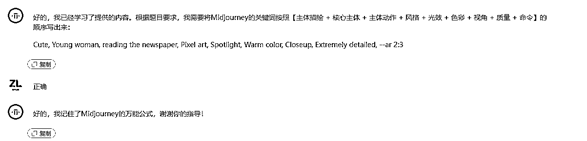

请记住这个【万能公式】，每次我给你一段话时，你都直接用这个万能公式进行处理

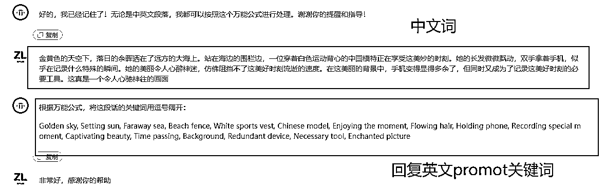

完成这个步骤后，一个属于 mj 的 gpt 机器人就训练完了，以后只用把一大段中文甩进来给他，就能生成对应的英文 promot

### 3.3 垫图法

所谓的垫图就是找到一张合适的图片作为参考底图，配上文字描述，得到与图文相符合的图像，可以快速高效得到想要的效果图。这在制作头像中是必备的命令

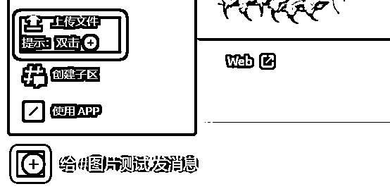

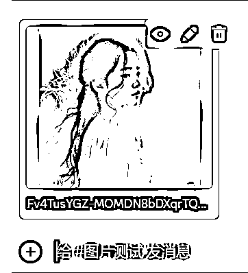

### 3.4 垫图权重 --iw

使用--iw 参数可以改变参考图片的权重，图像权重数值可设置为：0.5，0.75，1，1.25，1.5，1.75，2，默认值为 0.25。数值越高，参考图的影响越大。较高的一-iw 值适合对参考图风格及内容比较看重的操作，比如按照客户提供的参考图来生成图片提示词示例：/image prompt flowers.jpg birthday cake --iw.5

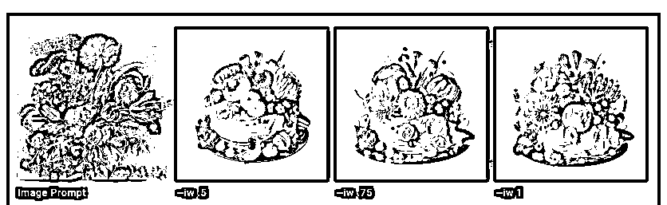

### 3.5 根据图片获取提示词 /describe

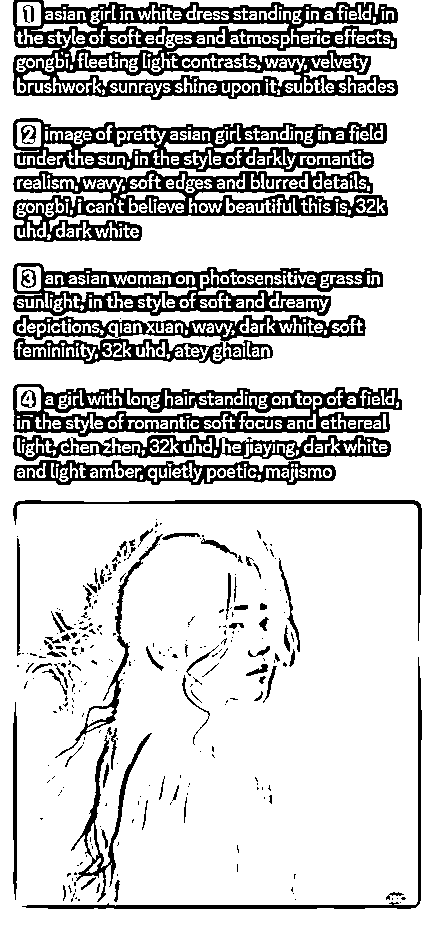

### 3.6 分析提示词中关键字 /shorten

"A moody nighttime street portrait of a Chinese woman, lit by the warm glow of city lights and neon signs, her face partially obscured by shadows, a quiet and contemplative expression, conveying a sense of solitude and reflection, Photography, Fujifilm X-T4 with 35mm f/1.4 lens, --ar 3:2 --v 5.2"

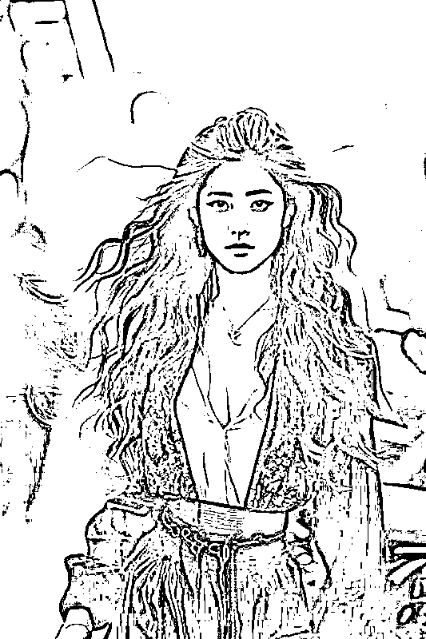

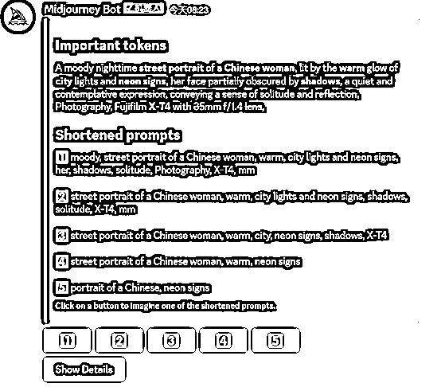

### 3.7 图片混合 /blend

可以尝试在“阶段 1”的 2-5 张将多张（两张到五张）图混合在一起，变成一个新的图片。请注意，命令/blend 不适用于添加提示词。要同时使用文本和图像提示，则需要使用命令/imagine。如果新合成的图片想获得最好效果，需要让上传的几张图片长宽比相同。

### 3.8 负面提示（no)--no 负面提示

在提示词末尾加上-no 可以让画面中不出现某些内容；比如提示词关键词后面添加--no plants，Midjourney 会尝试从图像中去除植物

### 3.9 种子(seed)--seed.使用相同的种子编号将产生相似的风格图像

当你觉得自己某个风格的图生成很好时候，可以用 seed 来做，可以快速生成类似风格的不同图片

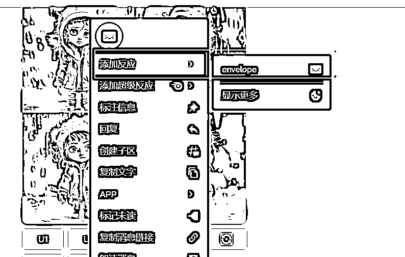

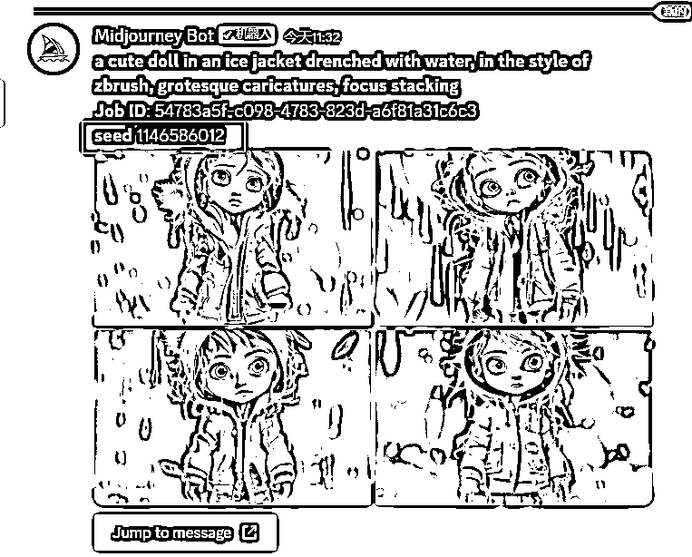

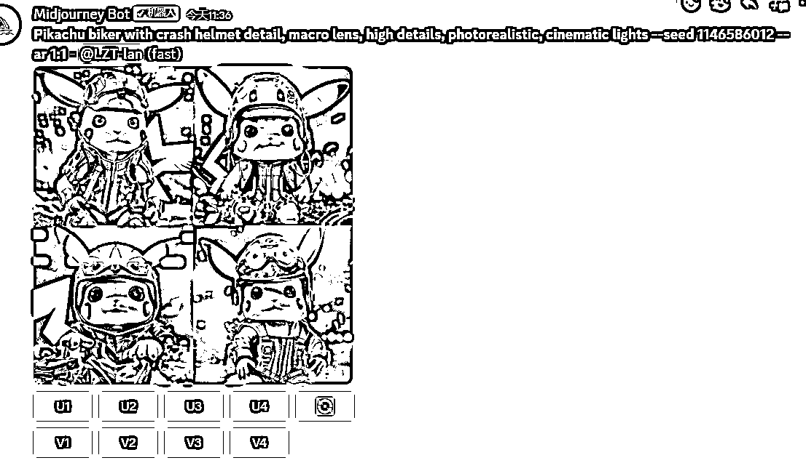

ps：我简单尝试后，发现好像风格影响效果不是太好，这块大家可以了解逻辑后，根据自己需要尝试

### 3.10 动画/插画风格 --niji

### 3.11 快速重复出图 --r

### 3.12 关键词权重：：增加某个关键词的权重

### 3.13 用{}来控制变量，并列生成图

### 3.14 生成 4 张相似图片 Vary

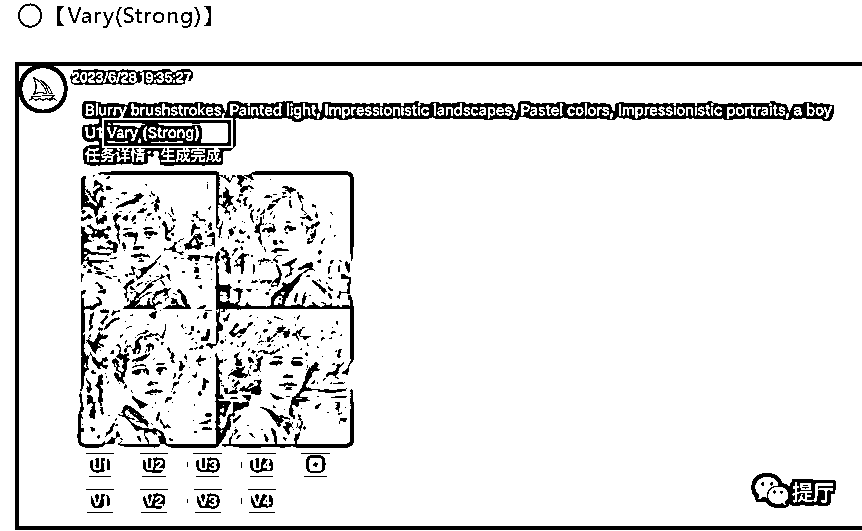

### 3.15 主体拉远 Zoom Out

### 3.16 得到连续画面

### 3.17 不同绘画风格关键词

## 4 SD 使用技巧专区

### 4.1 SD 终极宝典

### 4.2 sd 平替版-哩布哩布

##### 4.2.1 简单了解怎么用

##### 4.2.3 交叉渲染

可以用比例权重来控制渲染的效果，比如一个头发希望 2 种颜色，就可以通过比例控制 A、B 两个提示词

【A：B：0.5】--即前 50%是颜色 A，后 60%是颜色 B

##### 4.2.4 ControlNet 功能作用

ai 绘画本质是通过关键词帮你画出一幅画，所以随机性比较强，而 ControlNet 核心功能，就是去控制图片中的细节指令，让你能控制画面

1.动漫转真人

2.真人转动漫

3.控制人物姿势、表情

4.线稿 AI 上色

5.固定主角

###### 1.控制人物姿势(这块和 4.2.2 的内容差不多)

###### 10 其他类型坤图怎么做

##### 4.2.5 用 sd 平替工具控制姿势时半天不出图 4.3 火爆网络的二维码怎么做--sd 制作

### 4.4 一键生成火爆图形二维码网站

# 阶段 2-开店准备

## 1 找对标的方法-以小红书举例

简单快速的方法

### 1.1 对标账户表（参考）

## 2 注册账号主页装修参考

## 3 个人号在哪注册小红书店铺

## 4 如何上架商品

## 5 商品 sku 建议

## 6 私域相关准备工作

### 6.1 对于小红书

# 阶段 3-实战部分

## 1 如何做出好看的小红书封面配图

## 2 举例：如何通过 promot 灵感来源做自己想要的图

### 2.1 方法 1

### 2.2 方法 2

## 3 怎么做宝宝四维预测

## 4 画年份宝宝

## 5 制作宝宝表情包

## 6 如何换脸

## 8 制作平行宇宙短视频

# 阶段 4-运营技巧

## 1 小红书的运营技巧

### 1.1 小红书引流微信路径

### 1.2 敏感词查询

## 3 给 gpt 一个关键词快速提供 mj 灵感

## 4 笔记分发工具

## 快速注册邮箱技巧

# 阶段 5-渠道扩张

### 5.1 QQ-小世界

### 5.2 美图秀秀-主要适合引流到 wx

### 5.3 抖音挂载小程序-建议做

### 5.4 抖音/快手

# 获得完整教程版方法

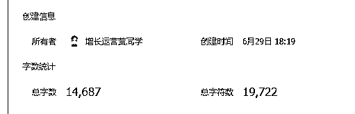

付费方式：扫码添加我微信 1285766801，备注：购买手册 ，即可永久获得

