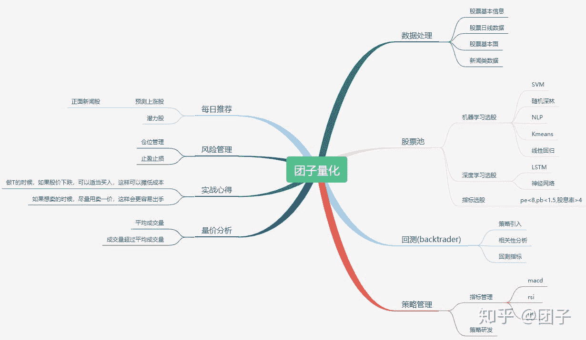

<!--yml
category: 交易
date: 2023-09-17 20:02:37
-->

# 0001-团子量化整体架构和计划 - 知乎

> 来源：[https://zhuanlan.zhihu.com/p/165369766](https://zhuanlan.zhihu.com/p/165369766)

团子量化按照领域驱动设计，分为以下几个领域，之后的时间，每个领域都会以月度为时间来开发、完善。

团子量化-整体结构

## 数据处理（2020-08）

## 股票池（2020-09）

## 回测（2020-10）

## 策略管理（2020-11）

## 量价分析（2020-12）

## 每日推荐（2020-01）

## 风险管理（2021-02）

这样规划是为了按避免东一块，西一块，最后什么也没开发出来，而且**坚持**才是最重要的，预计今年年底把整个系统研发完成。

在处理每个领域的时候可能涉及到的知识点特别多，因此研发的时候可能存在问题，希望各位在留言给我指出，谢谢。