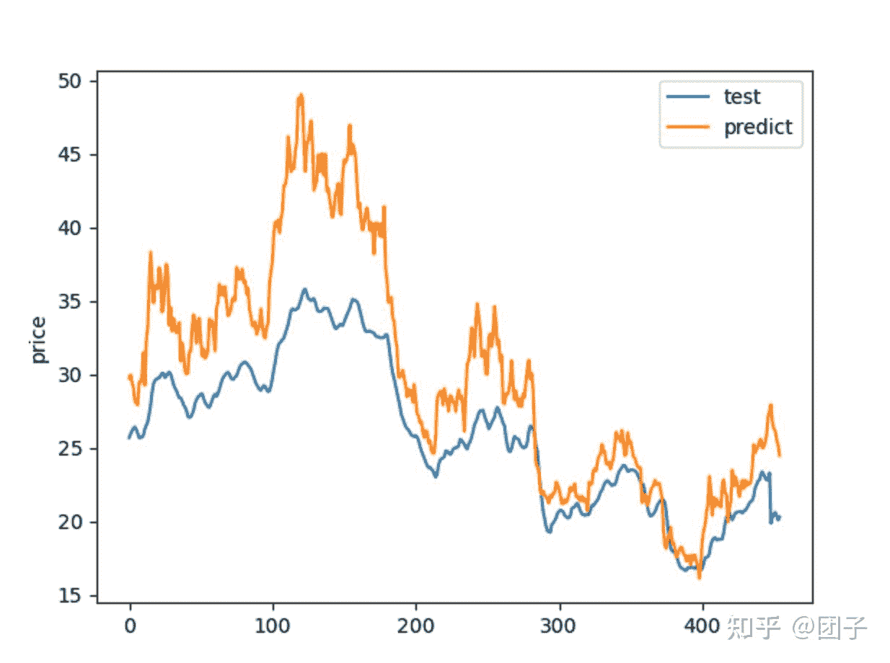

<!--yml
category: 交易
date: 2023-09-17 20:00:36
-->

# 00017-LSTM预测股票价格 - 知乎

> 来源：[https://zhuanlan.zhihu.com/p/439154629](https://zhuanlan.zhihu.com/p/439154629)

上一篇文章提到mac m1芯片如何安装tensorflow和keras。

本篇文章主要是对LSTM进行股票预测的实操，将不对LSTM进行介绍。

本文选取的股票是：三七互娱，股票代码是：002555

预测选取的维度主要包括：open, high, low, vol, pe，后续可以加入其他股票因子数据提高预测的准确度。

首先获取股票的日k数据，这里就不详细描述了，把数据存入本地保存成csv格式。**(后续将讲解数据的获取)**

**文章最后会附上全部代码:主要包括4个类【**lstm_service.py, config.py, train.py, test.py**】**

**最终的训练结果效果如下**

```
预测成功
RMSE为 5.142898328931932
MAE为 4.162291226397504
MAPE为 14.883169890342742
结束
```



## 1、读取数据

直接使用pandas读取csv

```
df = pd.read_csv("002555.csv")
data = df[['trade_date', 'close', 'open', 'high', 'low', 'vol', 'pe']]
```

## 2、数据归一化

由于成交量数据很大，因此对数据进行归一化操作

```
# 多维归一化
def normalize_mult(data):
    normalize = np.zeros((data.shape[1], 2), dtype='float64')
    for i in range(0, data.shape[1]):
        # 第i列
        list = data[:, i]
        listlow, listhigh = np.percentile(list, [0, 100])
        # print(i)
        normalize[i, :] = [listlow, listhigh]
        delta = listhigh - listlow
        if delta != 0:
            # 第j行
            for j in range(0, data.shape[0]):
                data[j, i] = (data[j, i] - listlow) / delta
    return data, normalize
```

## 3、构造训练数据

```
def create_dataset(dataset, n_predictions):
    '''
    对数据进行处理
    '''
    dataX, dataY = [], []
    # 这里的 -1 并不必要 但是可以避免某些状况下的bug
    for i in range(len(dataset) - n_predictions - 1):
        dataX.append(dataset[i:(i + n_predictions), :])
        dataY.append(dataset[i + n_predictions, :])
    train_x = np.array(dataX)
    train_y = np.array(dataY)
    return train_x, train_y
```

## 4、加载配置

```
# 使用类实现一个配置文件
class config:
    def __init__(self):
        self.path = './Model/'
        self.dimname = 'close'

        # 使用前n_predictions 步去预测下一步
        self.n_predictions = 10

        # 指定EarlyStopping  如果训练时单次val_loss值不能至少减少min_delta时，最多允许再训练patience次
        # 能够容忍多少个epoch内都没有improvement
        self.patience = 10
        self.min_delta = 0.00001

        # 指定LSTM两层的神经元个数
        self.lstm_layers = [80, 80]
        self.dropout = 0.2

        self.lstm_batch_size = 64
        self.optimizer = 'adam'
        self.loss_metric = 'mse'
        self.validation_split = 0.2
        self.verbose = 1
        self.epochs = 100

    ## 是一个数组 [64,64]
    def change_lstm_layers(self, layers):
        self.lstm_layers = layers 
```

## 5、构建模型

```
def lstm_model(train_x, train_y, config):
    model = Sequential()
    model.add(LSTM(config.lstm_layers[0], input_shape=(train_x.shape[1], train_x.shape[2]), return_sequences=True))
    model.add(Dropout(config.dropout))
    model.add(LSTM(config.lstm_layers[1], return_sequences=False))
    model.add(Dropout(config.dropout))
    model.add(Dense(train_y.shape[1]))
    model.add(Activation("relu"))
    model.summary()
    cbs = [History(), EarlyStopping(monitor='val_loss',
                                    patience=config.patience,
                                    min_delta=config.min_delta,
                                    verbose=0)]
    model.compile(loss=config.loss_metric, optimizer=config.optimizer)
    model.fit(train_x,
              train_y,
              batch_size=config.lstm_batch_size,
              epochs=config.epochs,
              validation_split=config.validation_split,
              callbacks=cbs,
              verbose=True)
    return model
```

## 6、训练模型，保存模型

```
# 拆分数据集，选取前80%数据作为训练集
data = data.iloc[:int(0.8 * data.shape[0]), :]
# 开始训练模型
model, normalize = start_train(data, config)
model.save(config.path + config.dimname + ".h5")
np.save(config.path + config.dimname + ".npy", normalize)
```

## 7、测试模型

```
df = pd.read_csv("002555.csv")
data = df[['trade_date', 'close', 'open', 'high', 'low', 'vol', 'pe']]
# 选取后20%
data = data.iloc[int(0.8 * data.shape[0]):, :]
print("长度为", data.shape[0])
normalize = np.load(config.path + config.dimname + ".npy")
model = load_model(config.path + config.dimname + ".h5")
hat_y, test_y = predict(data, model, normalize, config)
hat_y = np.array(hat_y, dtype='float64')
test_y = np.array(test_y, dtype='float64')

test = pd.DataFrame(data=test_y, columns=['test'])
predict = pd.DataFrame(data=hat_y, columns=['predict'])
dataframe = test.join(predict)
plt.figure(figsize=(12, 8))
dataframe.plot()
plt.ylabel('price')
plt.show()
print("RMSE为", RMSE(hat_y, test_y))
print("MAE为", MAE(hat_y, test_y))
print("MAPE为", MAPE_order(hat_y, test_y))
```

## 8、完整代码实例

lstm_service.py

```
import numpy as np
from tensorflow.keras import Sequential
from tensorflow.keras.callbacks import History, EarlyStopping
from tensorflow.keras.layers import LSTM, Dense, Activation, Dropout

def create_dataset(dataset, n_predictions):
    '''
    对数据进行处理
    '''
    dataX, dataY = [], []
    # 这里的 -1 并不必要 但是可以避免某些状况下的bug
    for i in range(len(dataset) - n_predictions - 1):
        dataX.append(dataset[i:(i + n_predictions), :])
        dataY.append(dataset[i + n_predictions, :])
    train_x = np.array(dataX)
    train_y = np.array(dataY)
    return train_x, train_y

# 多维归一化
def normalize_mult(data):
    normalize = np.zeros((data.shape[1], 2), dtype='float64')
    for i in range(0, data.shape[1]):
        # 第i列
        list = data[:, i]
        listlow, listhigh = np.percentile(list, [0, 100])
        # print(i)
        normalize[i, :] = [listlow, listhigh]
        delta = listhigh - listlow
        if delta != 0:
            # 第j行
            for j in range(0, data.shape[0]):
                data[j, i] = (data[j, i] - listlow) / delta
    return data, normalize

def lstm_model(train_x, train_y, config):
    model = Sequential()
    model.add(LSTM(config.lstm_layers[0], input_shape=(train_x.shape[1], train_x.shape[2]), return_sequences=True))
    model.add(Dropout(config.dropout))
    model.add(LSTM(config.lstm_layers[1], return_sequences=False))
    model.add(Dropout(config.dropout))
    model.add(Dense(train_y.shape[1]))
    model.add(Activation("relu"))
    model.summary()
    cbs = [History(), EarlyStopping(monitor='val_loss',
                                    patience=config.patience,
                                    min_delta=config.min_delta,
                                    verbose=0)]
    model.compile(loss=config.loss_metric, optimizer=config.optimizer)
    model.fit(train_x,
              train_y,
              batch_size=config.lstm_batch_size,
              epochs=config.epochs,
              validation_split=config.validation_split,
              callbacks=cbs,
              verbose=True)
    return model

def start_train(data, config):
    # 删去时间步
    data = data.iloc[:, 1:]
    print(data.columns)
    yindex = data.columns.get_loc(config.dimname)
    data = np.array(data, dtype='float64')
    if len(data.shape) == 1:
        data = data.reshape(-1, 1)
    # 数据归一化
    data, normalize = normalize_mult(data)
    data_y = data[:, yindex]
    if len(data_y.shape) == 1:
        data_y = data_y.reshape(data_y.shape[0], 1)
    # 构造训练数据
    train_x, _ = create_dataset(data, config.n_predictions)
    _, train_y = create_dataset(data_y, config.n_predictions)
    print("train_x y shape is:", train_x.shape, train_y.shape)
    # 进行训练
    model = lstm_model(train_x, train_y, config)
    return model, normalize

def normalize_back(data, norm):
    listlow, listhigh = norm[0], norm[1]
    delta = listhigh - listlow
    if delta != 0:
        for i in range(data.shape[0]):
            for j in range(data.shape[1]):
                data[i, j] = data[i, j] * delta + listlow
    return data

# 使用训练数据的归一化
def normalize_data(data, normalize):
    for i in range(0, data.shape[1]):
        # 第i列
        listlow = normalize[i, 0]
        listhigh = normalize[i, 1]
        delta = listhigh - listlow
        if delta != 0:
            # 第j行
            for j in range(0, data.shape[0]):
                data[j, i] = (data[j, i] - listlow) / delta
    return data

def predict(data, model, normalize, config):
    # 删去时间列
    data = data.iloc[:, 1:]
    yindex = data.columns.get_loc(config.dimname)
    data = np.array(data, dtype='float64')
    # 使用训练数据边界进行的归一化
    data = normalize_data(data, normalize)
    data_y = data[:, yindex]
    if len(data_y.shape) == 1:
        data_y = data_y.reshape(-1, 1)
    test_x, _ = create_dataset(data, config.n_predictions)
    _, test_y = create_dataset(data_y, config.n_predictions)
    print("test_x y shape is:", test_x.shape, test_y.shape)
    # 加载模型
    hat_y = model.predict(test_x)
    print('预测成功')
    # 反归一化
    # 命名规则?
    test_y = normalize_back(test_y, normalize[yindex,])
    hat_y = normalize_back(hat_y, normalize[yindex,])
    return test_y, hat_y 
```

config.py

```
# 使用类实现一个配置文件
class config:
    def __init__(self):
        self.path = './Model/'
        self.dimname = 'close'

        # 使用前n_predictions 步去预测下一步
        self.n_predictions = 10

        # 指定EarlyStopping  如果训练时单次val_loss值不能至少减少min_delta时，最多允许再训练patience次
        # 能够容忍多少个epoch内都没有improvement
        self.patience = 10
        self.min_delta = 0.00001

        # 指定LSTM两层的神经元个数
        self.lstm_layers = [80, 80]
        self.dropout = 0.2

        self.lstm_batch_size = 64
        self.optimizer = 'adam'
        self.loss_metric = 'mse'
        self.validation_split = 0.2
        self.verbose = 1
        self.epochs = 100

    ## 是一个数组 [64,64]
    def change_lstm_layers(self, layers):
        self.lstm_layers = layers
```

train.py

```
import os

import numpy as np
import pandas as pd

from config import config
from lstm.lstm_service import start_train

config = config()

if not os.path.exists(config.path):
    os.makedirs(config.path)

df = pd.read_csv("002555.csv")
data = df[['trade_date', 'close', 'open', 'high', 'low', 'vol', 'pe']]
# 拆分数据集，选取前80%数据作为训练集
data = data.iloc[:int(0.8 * data.shape[0]), :]
# 开始训练模型
model, normalize = start_train(data, config)
model.save(config.path + config.dimname + ".h5")
np.save(config.path + config.dimname + ".npy", normalize)
```

test.py

```
import matplotlib.pyplot as plt
import numpy as np
import pandas as pd
from keras.models import load_model
from sklearn import metrics

from config import config
from lstm.lstm_service import predict

def RMSE(y_hat, y_test):
    sum = np.sqrt(metrics.mean_squared_error(y_test, y_hat))
    return sum

def MAE(y_hat, y_test):
    sum = metrics.mean_absolute_error(y_test, y_hat)
    return sum

def MAPE(y_hat, y_test):
    sum = np.mean(np.abs((y_hat - y_test) / y_test)) * 100
    return sum

def MAPE_order(y_hat, y_test):
    # 删除test_y 为0元素
    zero_index = np.where(y_test == 0)
    y_hat = np.delete(y_hat, zero_index[0])
    y_test = np.delete(y_test, zero_index[0])
    sum = np.mean(np.abs((y_hat - y_test) / y_test)) * 100
    return sum

config = config()
df = pd.read_csv("002555.csv")
data = df[['trade_date', 'close', 'open', 'high', 'low', 'vol', 'pe']]
# 选取后20%
data = data.iloc[int(0.8 * data.shape[0]):, :]
print("长度为", data.shape[0])
normalize = np.load(config.path + config.dimname + ".npy")
model = load_model(config.path + config.dimname + ".h5")
hat_y, test_y = predict(data, model, normalize, config)
hat_y = np.array(hat_y, dtype='float64')
test_y = np.array(test_y, dtype='float64')

test = pd.DataFrame(data=test_y, columns=['test'])
predict = pd.DataFrame(data=hat_y, columns=['predict'])
dataframe = test.join(predict)
plt.figure(figsize=(12, 8))
dataframe.plot()
plt.ylabel('price')
plt.show()
print("RMSE为", RMSE(hat_y, test_y))
print("MAE为", MAE(hat_y, test_y))
print("MAPE为", MAPE_order(hat_y, test_y))

np.save(config.path + config.dimname + "-hat_y.npy", hat_y)
np.save(config.path + config.dimname + "-test_y.npy", test_y)
print("结束")

# from sklearn.metrics import mean_squared_error #均方误差
# from sklearn.metrics import mean_absolute_error #平方绝对误差
# from sklearn.metrics import r2_score#R square
# #调用
# print(mean_squared_error(test_y, hat_y))
# print(mean_absolute_error(test_y, hat_y))
# print(r2_score(test_y, hat_y))
```