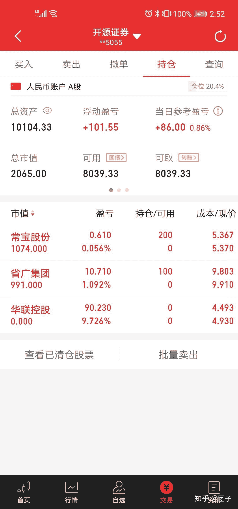

<!--yml
category: 交易
date: 2023-09-17 20:02:15
-->

# 0004-【数据处理】tusharefeed，上周复盘 - 知乎

> 来源：[https://zhuanlan.zhihu.com/p/166390320](https://zhuanlan.zhihu.com/p/166390320)

昨天看书去了，书名《经济学原理》。没有更新，今天更新两章，包括回测backtrader基本介绍，以及tushare财经数据介绍。并使用数据构建自定义指标。结合上周炒股结果进行复盘，回测。

上周通过pe，pb，以及股息率选出的股票中选出了000036这只股票。

买入的时候4.52，买了两手，期间跌了两天，但是我看macd快出金叉了，就继续补仓了1手。之后成本价是4.50，期间卖了一手。通过这周的实际操作，体会到了做T的好处，这样可以把你的价格摊低，这是之前没有体会的。最终盈利10%，最终成功退出。也算是第一次成功。这次盈利很大程度上是靠一个忍字。

心得就是选准股票，由基本面入手，看股票涨跌。后面的股票复盘应该包括每个阶段的心情，以及和大盘对比。

以后交易就是持仓两周，期间吃一个涨停就出手，或者跌了8%。

