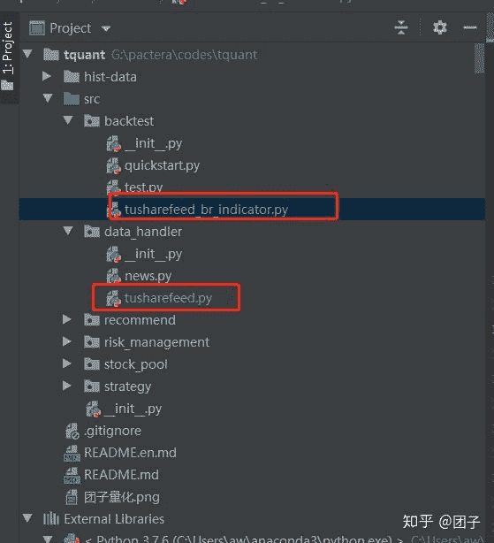
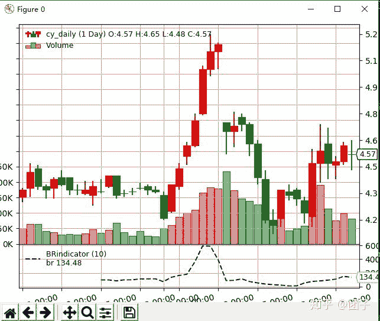

<!--yml
category: 交易
date: 2023-09-17 20:02:06
-->

# 0005-量化回测框架backtrader介绍，定义datafeed使用tushare数据 - 知乎

> 来源：[https://zhuanlan.zhihu.com/p/166421803](https://zhuanlan.zhihu.com/p/166421803)

首先介绍下backtrader,这是我用了2年的时间找到的我认为最好的回测框架，这个框架很多东西都是可以自定义的。而且操作起来十分方便，这里先介绍这里面的一些概念。

cerobro：西班牙语翻译是大脑的意思，backtrader想的就是通过大脑来进行操作。

strategy：这个就是我们经常说的策略的，这里是买卖策略。

indicator：指标，这里可以自定义指标等。

datafeed：这个就是我为什么选择backtrader的原因，它允许你自己定义数据源，

可以是csv的，可以是网络的，可以是mysql的，可以是mongodb，es，hive等等。

项目结构如下：



团子量化项目结构

自定义datafeed使用tushare:

```
import backtrader as bt
import tushare as ts
import datetime

pro = ts.pro_api('your tushare token')

class TushareData(bt.feed.DataBase):
    """
 TushareData base on pro.query('daily') interface,which is free for everyone """
    def __init__(self, **kwargs):
        super().__init__(**kwargs)
        # name of the table is indicated by dataname
        # data is fetch between fromdate and todate
        assert (self.p.fromdate is not None)
        assert (self.p.todate is not None)
        # iterator 4 data in the list
        self.iter = None
        self.data = None

    def start(self):
        if self.data is None:
            # query data from free interface
            self.data = pro.query('daily',
                                  ts_code=self.p.dataname,
                                  start_date=self.p.fromdate.strftime('%Y%m%d'),
                                  end_date=self.p.todate.strftime('%Y%m%d')
                                  )
            assert (self.data is not None)
        # set the iterator anyway
        self.iter = self.data.sort_index(ascending=False).iterrows()

    def stop(self):
        pass

    def _load(self):
        if self.iter is None:
            # if no data ... no parsing
            return False
        # try to get 1 row of data from iterator
        try:
            row = next(self.iter)
        except StopIteration:
            # end of the list
            return False
        # fill the lines
        self.lines.datetime[0] = self.date2num(datetime.datetime.strptime(row[1]['trade_date'], '%Y%m%d'))
        self.lines.open[0] = row[1]['open']
        self.lines.high[0] = row[1]['high']
        self.lines.low[0] = row[1]['low']
        self.lines.close[0] = row[1]['close']
        self.lines.volume[0] = row[1]['vol']
        self.lines.openinterest[0] = -1
        # Say success
        return True
```

自定义指标：

```
# %%
import sys
sys.path.append('..')
import backtrader as bt
import datetime
import numpy as np
from data_handler.tusharefeed import TushareData

class BRindicator(bt.Indicator):
    lines = ('br',)
    params = (('period', 26),)

    plotlines = dict(br=dict(ls='--', color='blue'))

    def __init__(self):
        self.addminperiod(self.params.period + 1)

    def next(self):
        th = np.array(self.data.high.get(ago=0, size=self.p.period))
        tl = np.array(self.data.low.get(ago=0, size=self.p.period))
        yc = np.array(self.data.close.get(ago=-1, size=self.p.period))
        self.lines.br[0] = np.sum(th - yc) / np.sum(yc - tl) * 100

# Create a Stratey
# Create a Stratey
class EmptyStrategy(bt.Strategy):
    '''
    Empty strategy is used to study indicators
    '''
    params = (
        ('none', 0),
    )

    def __init__(self):
        self.br = BRindicator(self.data0, period=10)
        pass

    def next(self):
        print('BR:{}'.format(self.br[0]))
        pass

    def stop(self):
        pass

cerebro = bt.Cerebro(oldtrades=False, stdstats=False)
feed = TushareData(
    dataname='000036.SZ',
    fromdate=datetime.date(2020, 6, 1),
    todate=datetime.date(2020, 7, 31),
)
cerebro.adddata(feed, name='cy_daily')
# cerebro.resampledata(feed, name='cy_weekly', timeframe=bt.TimeFrame.Weeks)

cerebro.addstrategy(EmptyStrategy)

# exp indicators
# cerebro.addindicator(bt.indicators.DirectionalMovementIndex)
# cerebro.addindicator(BRindicator, period=10)

# init cash
cerebro.broker.setcash(10000.0)

print('Starting Running')

result = cerebro.run()

print('Finish Running')

# 绘制蜡烛图
params = dict(
    style='candle',
    barup='red',
    bardown='green',
    volup='red',
    voldown='green',
)
cerebro.plot(
    **params
)
```



backtrader自定义指标