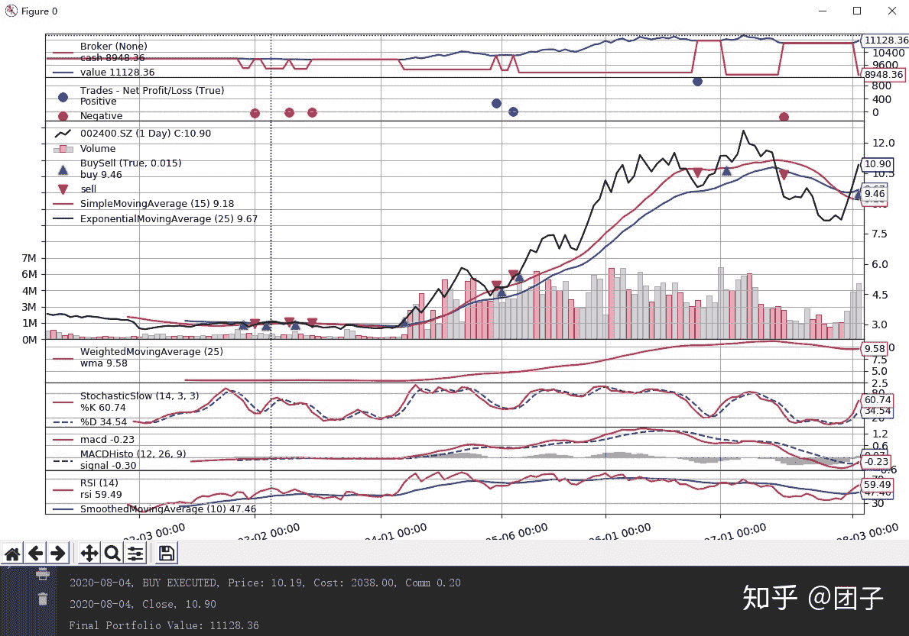
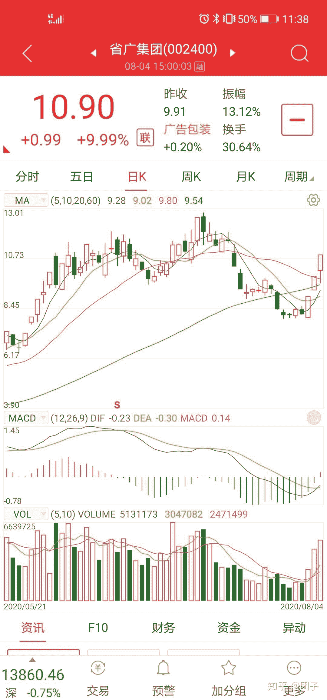
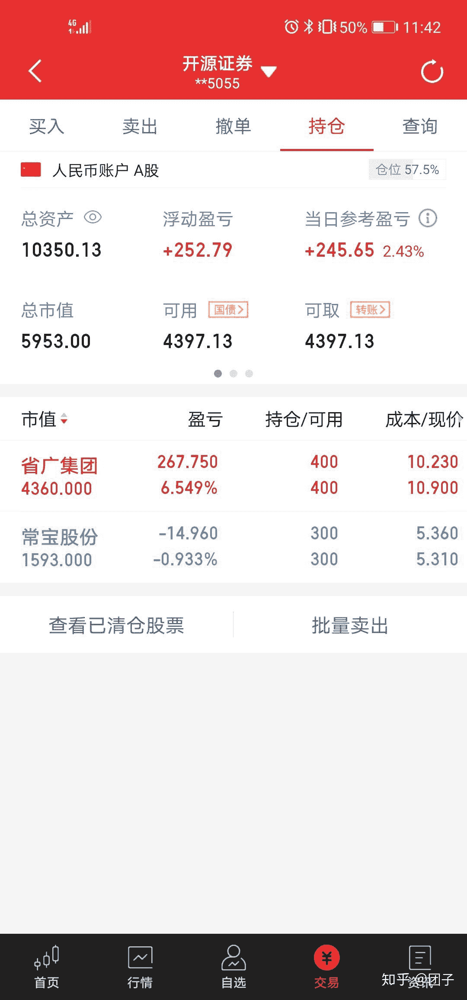

<!--yml
category: 交易
date: 2023-09-17 20:01:57
-->

# 0006-今天的大牛股【省广集团】回测，并附上我的分析。 - 知乎

> 来源：[https://zhuanlan.zhihu.com/p/166695071](https://zhuanlan.zhihu.com/p/166695071)

注：在文章末尾我会分析这个大牛股，002400。

今天介绍下backtrader的策略实现：做的是简单的移动平均策略。

**后期我会持续更新其他策略的实现**，请关注我的专栏：[团子量化](https://zhuanlan.zhihu.com/c_1267619319808573440)

要自定义策略首先需要继承bt.Strategy这个基类，然后覆写里面的方法，其中最主要的是next，和notify_order。

在next中我们可以获取每一天的数据包括：高开低收，注意这里回测是一条数据一条数据的获取，不会获取未来的数据，所以回测是有效果的，不像市面上有些回测框架是在已经知道未来数据来做的策略，这样策略的收益率肯定很高。在next中，如果日线数据上穿15日均线，我们就买入，下穿我们就执行卖出。

在notify_order中，notify_order(self,order):这里面可以获取订单状态，如果是Completed，如果订单是买入，就执行卖出。如果是卖出，就执行买入。

注意：出现交易信号之后都是用第二天的开盘价来买入的。

策略，具体代码实现如下：

```
# 创建策略
class SimpleMovingStrategy(bt.Strategy):
    params = (
        ('maperiod', 15),
    )

    def log(self, txt, dt=None):
        ''' 用于打印日志'''
        dt = dt or self.datas[0].datetime.date(0)
        print('%s, %s' % (dt.isoformat(), txt))

    def __init__(self):
        # 保存收盘价，用于后面策略使用
        self.dataclose = self.datas[0].close
        # 保存pending订单的卖价、卖价、手续费。
        self.order = None
        self.buyprice = None
        self.buycomm = None
        # 添加一个移动均线的指标
        self.sma = bt.indicators.SimpleMovingAverage(self.datas[0], period=self.params.maperiod)

    def notify_order(self, order):
        if order.status in [order.Submitted, order.Accepted]:
            # 如果订单是Submitted，Accepted就什么都不做。
            return
        # 检查一个订单是否提交
        # 注意：如果金额不够的话，broker会拒绝执行
        if order.status in [order.Completed]:
            if order.isbuy():
                self.log(
                    'BUY EXECUTED, Price: %.2f, Cost: %.2f, Comm %.2f' %
                    (order.executed.price,
                     order.executed.value,
                     order.executed.comm))
                self.buyprice = order.executed.price
                self.buycomm = order.executed.comm
            else:  # Sell
                self.log('SELL EXECUTED, Price: %.2f, Cost: %.2f, Comm %.2f' %
                         (order.executed.price,
                          order.executed.value,
                          order.executed.comm))
            self.bar_executed = len(self)
        elif order.status in [order.Canceled, order.Margin, order.Rejected]:
            self.log('Order Canceled/Margin/Rejected')
        # 清空当前订单。
        self.order = None

    def notify_trade(self, trade):
        if not trade.isclosed:
            return
        self.log('OPERATION PROFIT, GROSS %.2f, NET %.2f' %
                 (trade.pnl, trade.pnlcomm))

    def next(self):
        self.log('Close, %.2f' % self.dataclose[0])
        # 如果有订单在pengding中，我们就直接返回
        if self.order:
            return
        # 检测position，我们是否已经在市场中有持仓了。
        if not self.position:
            # 收盘价上穿均线
            if self.dataclose[0] > self.sma[0]:
                self.log('BUY CREATE, %.2f' % self.dataclose[0])
                self.order = self.buy()
        else:
            # 有持仓，如果均线下穿就卖出
            if self.dataclose[0] < self.sma[0]:
                self.log('SELL CREATE, %.2f' % self.dataclose[0])
                self.order = self.sell()
```

通过cerobro来执行策略：

```
 # 创建核心
    cerebro = bt.Cerebro()
    # 添加策略
    cerebro.addstrategy(SimpleMovingStrategy)
    # 创建数据datafeed
    from data_handler.tusharefeed import TushareData
    feed = TushareData(
        dataname='002400.SZ',
        fromdate=datetime.date(2020, 1, 1),
        todate=datetime.date(2020, 8, 4),
    )
    # 添加数据
    cerebro.adddata(feed)
    # 设置初始金额
    cerebro.broker.setcash(10000.0)
    # 添加每次买入的股票数
    cerebro.addsizer(bt.sizers.FixedSize, stake=200)
    # 设置手续费
    cerebro.broker.setcommission(commission=0.0001)
    print('Starting Portfolio Value: %.2f' % cerebro.broker.getvalue())
    # 运行回测
    cerebro.run()
    print('Final Portfolio Value: %.2f' % cerebro.broker.getvalue())
    # 画出图形
    cerebro.plot()
```

完整代码如下：

```
from __future__ import (absolute_import, division, print_function,
                        unicode_literals)

import datetime  # For datetime objects
import os.path  # To manage paths
import sys  # To find out the script name (in argv[0])

# Import the backtrader platform
import backtrader as bt

# 创建策略
class SimpleMovingStrategy(bt.Strategy):
    params = (
        ('maperiod', 15),
    )

    def log(self, txt, dt=None):
        ''' 用于打印日志'''
        dt = dt or self.datas[0].datetime.date(0)
        print('%s, %s' % (dt.isoformat(), txt))

    def __init__(self):
        # 保存收盘价，用于后面策略使用
        self.dataclose = self.datas[0].close
        # 保存pending订单的卖价、卖价、手续费。
        self.order = None
        self.buyprice = None
        self.buycomm = None
        # 添加一个移动均线的指标
        self.sma = bt.indicators.SimpleMovingAverage(self.datas[0], period=self.params.maperiod)

    def notify_order(self, order):
        if order.status in [order.Submitted, order.Accepted]:
            # 如果订单是Submitted，Accepted就什么都不做。
            return
        # 检查一个订单是否提交
        # 注意：如果金额不够的话，broker会拒绝执行
        if order.status in [order.Completed]:
            if order.isbuy():
                self.log(
                    'BUY EXECUTED, Price: %.2f, Cost: %.2f, Comm %.2f' %
                    (order.executed.price,
                     order.executed.value,
                     order.executed.comm))
                self.buyprice = order.executed.price
                self.buycomm = order.executed.comm
            else:  # Sell
                self.log('SELL EXECUTED, Price: %.2f, Cost: %.2f, Comm %.2f' %
                         (order.executed.price,
                          order.executed.value,
                          order.executed.comm))
            self.bar_executed = len(self)
        elif order.status in [order.Canceled, order.Margin, order.Rejected]:
            self.log('Order Canceled/Margin/Rejected')
        # 清空当前订单。
        self.order = None

    def notify_trade(self, trade):
        if not trade.isclosed:
            return
        self.log('OPERATION PROFIT, GROSS %.2f, NET %.2f' %
                 (trade.pnl, trade.pnlcomm))

    def next(self):
        self.log('Close, %.2f' % self.dataclose[0])
        # 如果有订单在pengding中，我们就直接返回
        if self.order:
            return
        # 检测position，我们是否已经在市场中有持仓了。
        if not self.position:
            # 收盘价上穿均线
            if self.dataclose[0] > self.sma[0]:
                self.log('BUY CREATE, %.2f' % self.dataclose[0])
                self.order = self.buy()
        else:
            # 有持仓，如果均线下穿就卖出
            if self.dataclose[0] < self.sma[0]:
                self.log('SELL CREATE, %.2f' % self.dataclose[0])
                self.order = self.sell()

if __name__ == '__main__':
    # 创建核心
    cerebro = bt.Cerebro()
    # 添加策略
    cerebro.addstrategy(SimpleMovingStrategy)
    # 创建数据datafeed
    from data_handler.tusharefeed import TushareData
    feed = TushareData(
        dataname='002400.SZ',
        fromdate=datetime.date(2020, 1, 1),
        todate=datetime.date(2020, 8, 4),
    )
    # 添加数据
    cerebro.adddata(feed)
    # 设置初始金额
    cerebro.broker.setcash(10000.0)
    # 添加每次买入的股票数
    cerebro.addsizer(bt.sizers.FixedSize, stake=200)
    # 设置手续费
    cerebro.broker.setcommission(commission=0.0001)
    print('Starting Portfolio Value: %.2f' % cerebro.broker.getvalue())
    # 运行回测
    cerebro.run()
    print('Final Portfolio Value: %.2f' % cerebro.broker.getvalue())
    # 画出图形
    cerebro.plot()
```

回测结果如下：在万一的费率下，每次买入2手：



注意这里要使用我上一篇文章中使用的tushare_datafeed。如果没有添加的请回去看我的上一篇文章。[0005-量化回测框架backtrader介绍，定义datafeed是用tushare](https://zhuanlan.zhihu.com/p/166421803)。

对于省广集团的分析如下:



首先该股票是**日线，macd，成交量都出现了金叉**。**而且今天还在头条上面露了一手**。所以无论是指标还是行情，这个股注定是大牛股。附上我今天的战绩



感兴趣的朋友可以关注下我，后面我会持续更新我的炒股历程。