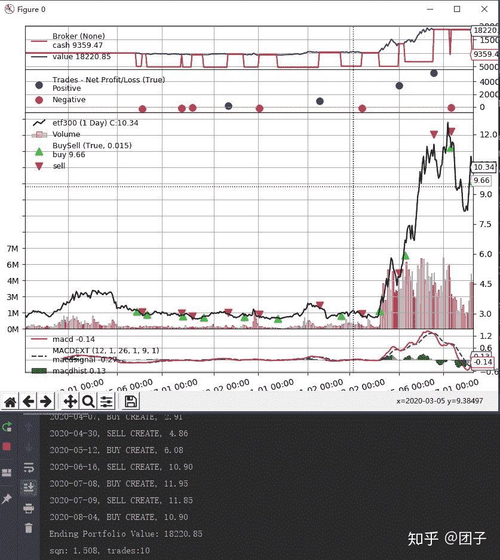

<!--yml
category: 交易
date: 2023-09-17 20:01:45
-->

# 0007-macd指标金叉，死叉策略 - 知乎

> 来源：[https://zhuanlan.zhihu.com/p/168762418](https://zhuanlan.zhihu.com/p/168762418)

**后期我会持续更新其他策略的实现**，请关注我的专栏：[团子量化](https://zhuanlan.zhihu.com/c_1267619319808573440)

首先介绍下macd指标，他是由三个指标组成:dif线和dea线，以及macd指标组成。dif表示了快线，dea表示慢线。

dif曲线是通过ema12-ema26

dea是表示dif曲线的移动平均ema(dif,9)

macd表示(dif-dea)*2。

一般软件里面灰线表示dif，黄线表示dea。如果灰线上穿黄线，表示金叉，下穿黄线表示死叉。

下面通过backtrader作为回测框架，tushare作为数据源，002400作为回测股票进行回测。

分析结果如下：

本金10000，费率万1，每次50%的仓位：



macd策略代码如下：

```
class MacdStrategy(bt.Strategy):
    params = (
        ('fastperiod', 12),
        ('slowperiod', 26),
        ('signalperiod', 9),
    )

    def __init__(self):

        kwargs = {
            'fastperiod': self.p.fastperiod,
            'fastmatype': bt.talib.MA_Type.EMA,
            'slowperiod': self.p.slowperiod,
            'slowmatype': bt.talib.MA_Type.EMA,
            'signalperiod': self.p.signalperiod,
            'signalmatype': bt.talib.MA_Type.EMA,
        }
        self.dataclose = self.datas[0].close
        # Add a Macd indicator
        self.macd = bt.talib.MACDEXT(
            self.data0.close, **kwargs)

        self.crossover = bt.indicators.CrossOver(self.macd.macd, self.macd.macdsignal, plot=False)
        self.above = bt.And(self.macd.macd > 0.0, self.macd.macdsignal > 0.0)

        # self.buy_signal = bt.And(self.above, self.crossover == 1)
        self.buy_signal = (self.crossover == 1)
        self.sell_signal = (self.crossover == -1)
        # To keep track of pending orders
        self.order = None

    def log(self, txt, dt=None):
        ''' 用于打印日志'''
        dt = dt or self.datas[0].datetime.date(0)
        print('%s, %s' % (dt.isoformat(), txt))

    def notify_order(self, order):
        if order.status in [order.Submitted, order.Accepted]:
            # Buy/Sell order submitted/accepted to/by broker - Nothing to do
            return

        if order.status in [order.Completed, order.Canceled, order.Margin, order.Rejected]:
            # Write down: no pending order
            self.order = None

    def next(self):
        # Check if an order is pending ... if yes, we cannot send a 2nd one
        if self.order:
            return

        # Check if we are in the market
        if not self.position:
            # Not yet ... we MIGHT BUY if ...
            if self.buy_signal[0]:
                self.log('BUY CREATE, %.2f' % self.dataclose[0])
                self.order = self.buy()
        else:
            # Already in the market ... we might sell
            if self.sell_signal[0]:
                self.log('SELL CREATE, %.2f' % self.dataclose[0])
                self.order = self.sell()
```

完整代码如下：

```
import backtrader as bt
import datetime
import pandas as pd

class MacdStrategy(bt.Strategy):
    params = (
        ('fastperiod', 12),
        ('slowperiod', 26),
        ('signalperiod', 9),
    )

    def __init__(self):

        kwargs = {
            'fastperiod': self.p.fastperiod,
            'fastmatype': bt.talib.MA_Type.EMA,
            'slowperiod': self.p.slowperiod,
            'slowmatype': bt.talib.MA_Type.EMA,
            'signalperiod': self.p.signalperiod,
            'signalmatype': bt.talib.MA_Type.EMA,
        }
        self.dataclose = self.datas[0].close
        # Add a Macd indicator
        self.macd = bt.talib.MACDEXT(
            self.data0.close, **kwargs)

        self.crossover = bt.indicators.CrossOver(self.macd.macd, self.macd.macdsignal, plot=False)
        self.above = bt.And(self.macd.macd > 0.0, self.macd.macdsignal > 0.0)

        # self.buy_signal = bt.And(self.above, self.crossover == 1)
        self.buy_signal = (self.crossover == 1)
        self.sell_signal = (self.crossover == -1)
        # To keep track of pending orders
        self.order = None

    def log(self, txt, dt=None):
        ''' 用于打印日志'''
        dt = dt or self.datas[0].datetime.date(0)
        print('%s, %s' % (dt.isoformat(), txt))

    def notify_order(self, order):
        if order.status in [order.Submitted, order.Accepted]:
            # Buy/Sell order submitted/accepted to/by broker - Nothing to do
            return

        if order.status in [order.Completed, order.Canceled, order.Margin, order.Rejected]:
            # Write down: no pending order
            self.order = None

    def next(self):
        # Check if an order is pending ... if yes, we cannot send a 2nd one
        if self.order:
            return

        # Check if we are in the market
        if not self.position:
            # Not yet ... we MIGHT BUY if ...
            if self.buy_signal[0]:
                self.log('BUY CREATE, %.2f' % self.dataclose[0])
                self.order = self.buy()
        else:
            # Already in the market ... we might sell
            if self.sell_signal[0]:
                self.log('SELL CREATE, %.2f' % self.dataclose[0])
                self.order = self.sell()

from data_handler.tusharefeed import TushareData
feed = TushareData(
    dataname='002400.SZ',
    fromdate=datetime.date(2019, 1, 1),
    todate=datetime.date(2020, 8, 5),
)

if __name__ == '__main__':
    cerebro = bt.Cerebro()
    cerebro.adddata(feed, name='etf300')
    cerebro.addstrategy(MacdStrategy)
    # 小场面1万起始资金
    cerebro.broker.setcash(10000.0)
    # 手续费万5
    cerebro.broker.setcommission(0.0001)
    # 以发出信号当日收盘价成交
    cerebro.broker.set_coc(True)
    # Add a FixedSize sizer according to the stake
    cerebro.addsizer(bt.sizers.AllInSizerInt, percents=50)
    # cerebro.addsizer(bt.sizers.FixedSize, stake=400)
    print('Starting Portfolio Value: {:.2f}'.format(cerebro.broker.getvalue()))
    cerebro.addanalyzer(bt.analyzers.SQN)
    result = cerebro.run()
    print('Ending Portfolio Value: {:.2f}'.format(cerebro.broker.getvalue()))
    ana = result[0].analyzers.sqn.get_analysis()
    print("sqn: {:.3f}, trades:{:d}".format(ana['sqn'], ana['trades']))
    cerebro.plot(iplot=True)
```

注意这里要使用我上一篇文章中使用的tushare_datafeed。如果没有添加的请回去看我之前的文章。[0005-量化回测框架backtrader介绍，定义datafeed是用tushare](https://zhuanlan.zhihu.com/p/166421803)。