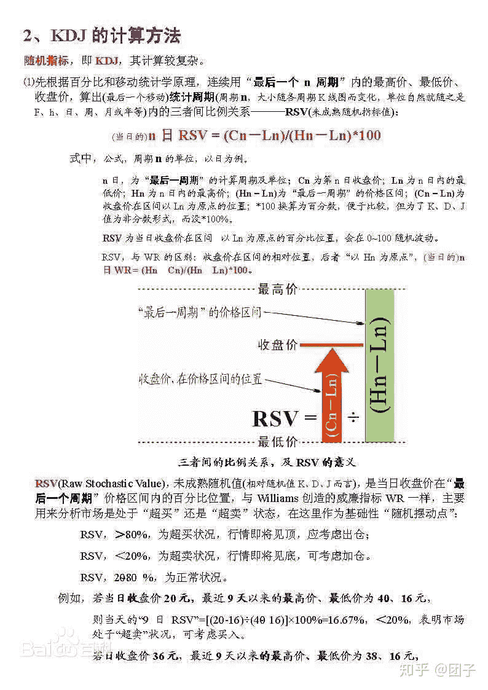

<!--yml
category: 交易
date: 2023-09-17 20:01:29
-->

# 0009-backtrader定制KDJ指标 - 知乎

> 来源：[https://zhuanlan.zhihu.com/p/172528841](https://zhuanlan.zhihu.com/p/172528841)

今天给大家分享一下KDJ指标：

## 简介

KDJ指标又叫随机指标，是一种相当新颖、实用的技术分析指标，它起先用于期货市场的分析，后被广泛用于股市的中短期趋势分析，是期货和股票市场上最常用的技术分析工具。

随机指标KDJ一般是用于股票分析的统计体系，根据统计学原理，通过一个特定的周期（常为9日、9周等）内出现过的最高价、最低价及最后一个计算周期的收盘价及这三者之间的比例关系，来计算最后一个计算周期的未成熟随机值RSV，然后根据平滑移动平均线的方法来计算K值、D值与J值，并绘成曲线图来研判股票价格走势。

## 起源

**KDJ指标的中文名称又叫随机指标**，最早起源于期货市场，由乔治·莱恩（George Lane）首创。随机指标KDJ最早是以KD指标的形式出现，而KD指标是在威廉指标的基础上发展起来的。不过KD指标只判断股票的超买超卖的现象，在KDJ指标中则融合了移动平均线速度上的观念，形成比较准确的买卖信号依据。在实践中，K线与D线配合J线组成KDJ指标来使用。KDJ指标在设计过程中主要是研究最高价、最低价和收盘价之间的关系，同时也融合了动量观念、强弱指标和移动平均线的一些优点。因此，能够比较迅速、快捷、直观地研判行情，被广泛用于股市的中短期趋势分析，是期货和股票市场上最常用的技术分析工具。

## 指标原理

指标原理KDJ是以最高价、最低价及收盘价为基本数据进行计算，得出的K值、D值和J值分别在指标的坐标上形成的一个点，连接无数个这样的点位，就形成一个完整的、能反映价格波动趋势的KDJ指标。它主要是利用价格波动的真实波幅来反映价格走势的强弱和超买超卖现象，在价格尚未上升或下降之前发出买卖信号的一种技术工具。它在设计过程中主要是研究最高价、最低价和收盘价之间的关系，同时也融合了动量观念、强弱指标和移动平均线的一些优点，因此，能够比较迅速、快捷、直观地研判行情。由于KDJ线本质上是一个随机波动的观念，故其对于掌握中短期行情走势比较准确。

## 计算方法

KDJ的计算比较复杂，首先要计算周期（n日、n周等）的RSV值，即未成熟随机指标值，然后再计算K值、D值、J值等。以n日KDJ数值的计算为例，其计算公式为

**n日RSV=（Cn－Ln）/（Hn－Ln）×100**

公式中，**Cn为第n日收盘价**；**Ln为n日内的最低价**；**Hn为n日内的最高价**。

其次，计算K值与D值：

**当日K值=2/3×前一日K值+1/3×当日RSV**

**当日D值=2/3×前一日D值+1/3×当日K值**

若无前一日K 值与D值，则可分别用50来代替。

**J值=3*当日K值-2*当日D值**

以9日为周期的KD线为例，即未成熟随机值，计算公式为

9日RSV=（C－L9）÷（H9－L9）×100%

公式中，C为第9日的[收盘价](https://link.zhihu.com/?target=https%3A//baike.baidu.com/item/%25E6%2594%25B6%25E7%259B%2598%25E4%25BB%25B7)；L9为9日内的[最低价](https://link.zhihu.com/?target=https%3A//baike.baidu.com/item/%25E6%259C%2580%25E4%25BD%258E%25E4%25BB%25B7)；H9为9日内的最高价。

K值=2/3×第8日K值+1/3×第9日RSV

D值=2/3×第8日D值+1/3×第9日K值

J值=3*第9日K值-2*第9日D值

若无前一日K值与D值，则可以分别用50代替。



使用backtrader自定指标代码如下：

```
class KDJ(bt.Indicator):
    lines = ('K', 'D', 'J')

    params = (
        ('period', 9),
        ('period_dfast', 3),
        ('period_dslow', 3),
    )

    plotlines = dict(
        J=dict(
            _fill_gt=('K', ('red', 0.50)),
            _fill_lt=('K', ('green', 0.50)),
        )
    )

    def __init__(self):
        # Add a KDJ indicator
        self.kd = bt.indicators.StochasticFull(
            self.data,
            period=self.p.period,
            period_dfast=self.p.period_dfast,
            period_dslow=self.p.period_dslow,
        )

        self.l.K = self.kd.percD
        self.l.D = self.kd.percDSlow
        self.l.J = self.K * 3 - self.D * 2
```