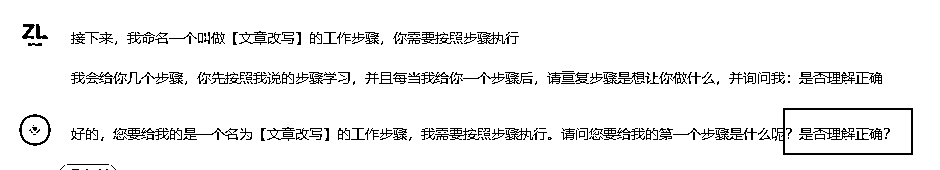
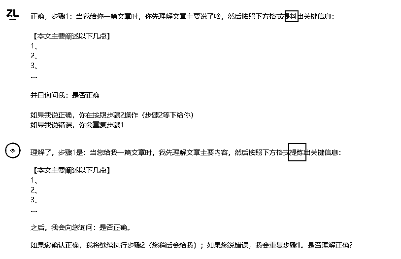
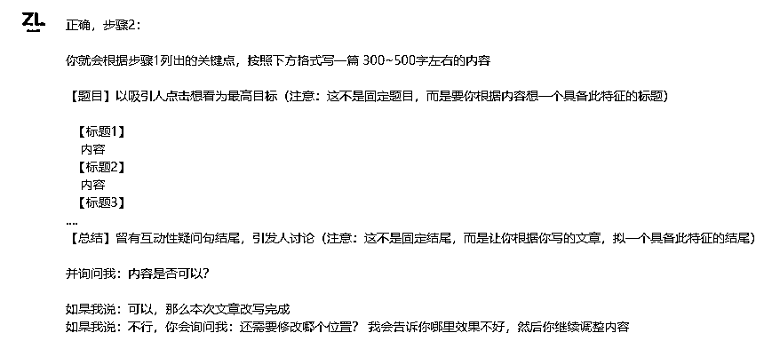
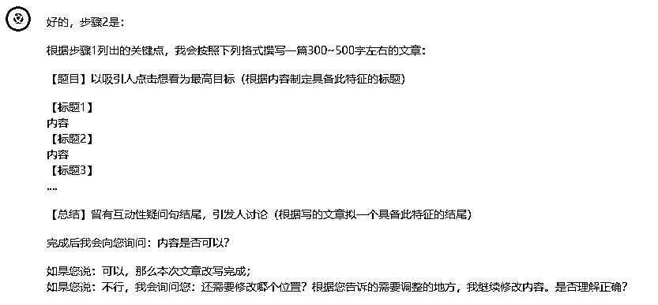
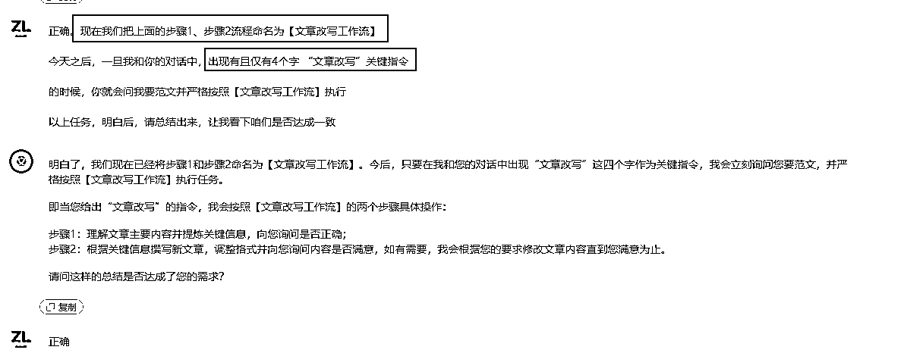
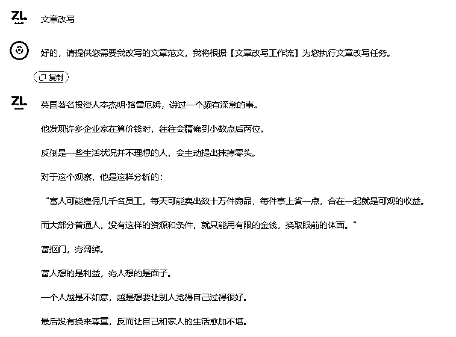
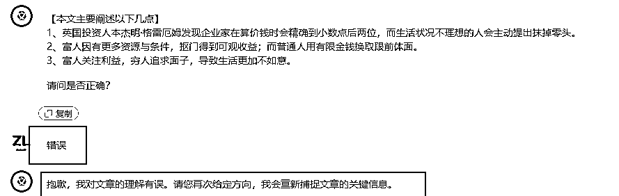
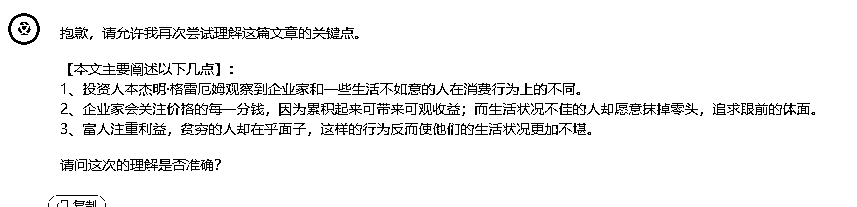
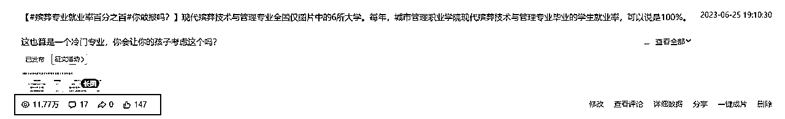
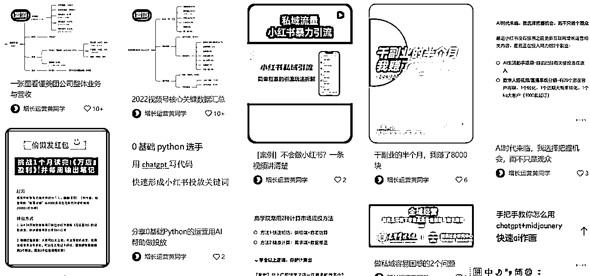

# 1 个案例搞定 gpt 底层角色定义逻辑

> 来源：[`dsb.feishu.cn/docx/XGMJdfQaro7csix8Ih7cmT4SnPc`](https://dsb.feishu.cn/docx/XGMJdfQaro7csix8Ih7cmT4SnPc)

# 背景

现在 chatgpt+自媒体变现的话题已经被炒的火热了，每个人可能都在想”我该怎么利用 ai 工具搞副业“

基于这个，我今天尝试了一个赛道：利用 gpt 写内容，分发到百家号、头条号等内容社区（这种社区都需要大量 ugc，所以也一定有针对这块的奖励，大家也应该都知道）

# 难点

整个流程非常通畅，总共耗时 2 小时，gpt 模型定义花费了 80%时间，但让我茅塞顿开，大概理解它的底层逻辑了

我相信很多朋友和我一样，看过并收藏非常多的关于怎么给 gpt 下 promot 的教程，以及一些现成的教程模板,比如：

市面上比较常见的训练 ai 对话的模型

```
你是一名世界顶级的小红书写手，我现在要撰写一篇能够达到 1000 赞的爆款文章，请你输出它
你懂得以下的技能：
--在小红书标题方面：xxxxx
--在小红书正文方面：xxxxx

结合我给你输入的信息，以及你掌握的标题和正文的技巧，产出内容。请按照以下格式输出内容：xxxx
```

但真到自己用的时候，可能还是会有比如 他的答案和我心里想的怎么差这么多啊，或者为啥它给出的结果不是我想要的甚至因为收藏的 promot 模板太多，都不知道该用哪个了

我也一样。所以这次通畅的训练出一个自己想要的角色，我大概知道 gpt 的底层逻辑是个啥了。





ps：这块有个小惊喜：我在给出步骤 1 指令时，手抖打错了字，但 gpt 却能很快意识到我的想法并给我修正。这其实就相当于你给自己实习生说话时，就算嘴瓢，但只要大致意思表达正确，他也能快速理解你想要啥，达成目标一致。














# 应用 gpt+百家号=分分钟 10w+阅读

按照上面模型，我尝试发布到百家号，结果就产生了 10w+阅读的内容



总的说：训练好自己需要某个场景下特定的 gpt 模型，把它变成你固定工作流的工具，才是我们应该去思考和实操的，改变生产关系的生产力工具，本质就是降本和提效。

# 其他好文

# 关于我

关于我

【我是谁】增长运营黄同学-真的懂运营，方案能落地

【所在城市】北京

【个人介绍】

①学而思出身，5 年互联网增长运营经验，一人半年私域增长 50w

②抖音投放 roi 行业 top20%；

③谈判能力强：免费置换到《流浪地球 2》资源，0 费用达成百万量级 kol 合作 30+

【可提供】

①数字人短视频/直播 saas 工具

https://sourl.cn/D3zYDL

②好课推荐-小红书从 0-1 系统学习

③chatgpt+私域客户管理系统

*我的小红书：https://sourl.cn/iNeSNp 长期更新互联网相关方法论，欢迎关注




也可加我微信共同交流：1285766801 我会持续输出内容发在朋友圈~