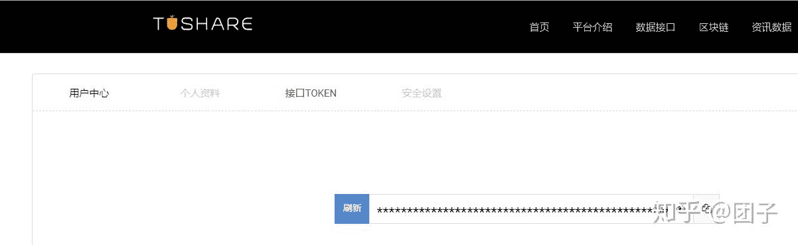

<!--yml
category: 交易
date: 2023-09-17 20:02:45
-->

# 1001-量化选股(PE,PB,股息率) - 知乎

> 来源：[https://zhuanlan.zhihu.com/p/163748198](https://zhuanlan.zhihu.com/p/163748198)

基于<给新手的股票交易极简课程>，其中有一章节课后题是选出股息率大于4%，pe小于8，pb小于1.5的5只股票。这里就通过python+tushare来实现。

思路是:

1，获取所有的股票代码信息。

2，通过股票代码获取每日的基本信息，这里就过去最近的一个交易日的信息。其中就包括股息率，pe，pb。

3，通过pandas来筛选出这些股票。

后记:通过筛选出的股票，选取出一只好的，下周实际操作下。

晚上附上代码。

代码如下：

```
# coding=utf-8
import tushare as ts
import pandas as pd
pro = ts.pro_api('你的token')
if __name__ == '__main__':
    code_df = pro.query('stock_basic', fields='ts_code,symbol,name,area,industry,list_date')
    print(code_df)
    all = pd.DataFrame()
    for i in code_df['ts_code']:
        df = pro.query('daily_basic', ts_code=i, trade_date='20200724', fields='ts_code,dv_ttm,pe_ttm,pb')
        all = pd.concat([all, df], ignore_index=True)
    print(all[(all['dv_ttm'] > 4) & (all['pe_ttm'] < 8) & (all['pb'] < 1.5)])
```

你的token。获取方式：[https://tushare.pro/register?reg=242065](https://link.zhihu.com/?target=https%3A//tushare.pro/register%3Freg%3D242065)



最后代码可能需要运行一段时间，请耐心等待。

运行最终结果选出了45只股票如下：