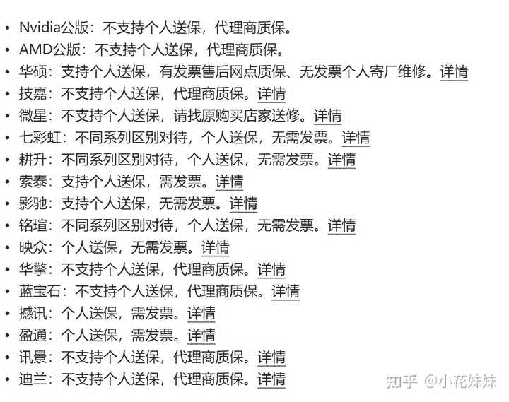
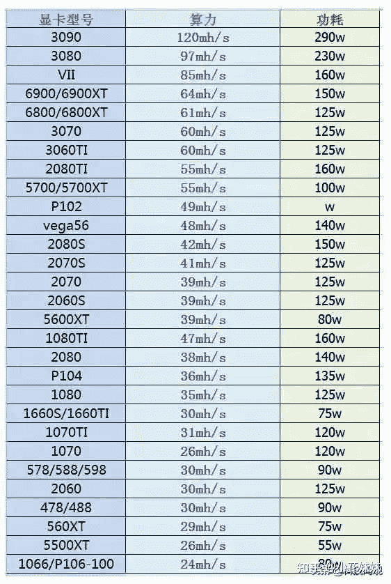
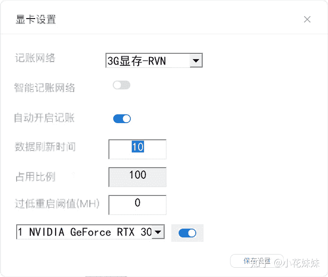
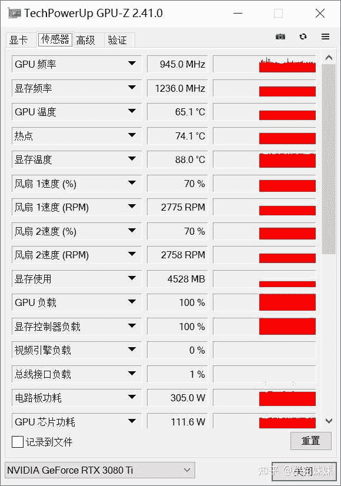

<!--yml
category: 挖矿
date: 2022-06-26 00:00:00
-->

# 2021年5月失业，想尝试在家挖矿，请教如何开始！?

> 原文：[https://www.zhihu.com/question/457875090/answer/2056249963](https://www.zhihu.com/question/457875090/answer/2056249963)

 ### 一、货源的选择

现在所有发布的显卡，都是锁算力版本的显卡。未锁算力显卡唯一的渠道就是黄鱼二手，所以**黄鱼只能选择支持个人送保的品牌。**

在选择显卡方面，各有优势。

### 二、未锁算力显卡：币稳定

需要的显卡要求是5G以上的显存。优先选择的是虚空神卡3060TI，拥有60算力和更低的功耗和散热。所以未锁算力显卡基本上没有到个人手里，都是直接进了矿场。

未锁算力显卡挖矿首选的是ETH，目前的价格基本维持在日收益每算力0.5元。也就是显卡算力的一半就是日收益。也就是3090每天60、3080每天48以此类推。

具体的详情教程可以参考这里：

### 三、锁算力显卡：小币不稳定

需要的显卡显存要求降低了不少：3G就可以。全新的锁算力显卡的价格是低与于二手锁算力显卡的。所以目前来说可以拥有更低的成本和更优秀的残值。但是锁算力显卡在ETH面前没有优势。作为虚拟货币的老二ETH是比较稳定的，其他的币种都更有可能出现断崖式的收割。目前来说锁算力显卡选择的币种是RVN。

截止到今年8月份左右，锁算力显卡挖RVN和未锁算力挖ETH的收入是差不多的，而且目前是前期，后期会不会长仁者见仁。至于各个显卡的算力是我个人统计的如下，目前的系数是1元左右。也就是3070TI每天37元左右以此类推。

教程参考可以看一下这里：

其实锁算力显卡和未锁算力显卡的区别比较简单，就是在程序中选择**不同的币种**就可以了。然后再有简单的**超频微调**就可以了。

### 怎么看显存温度

注意：只有部分显卡才有显存温度传感器。

相信大家对于显存温度都是很好奇的，毕竟自己的卡不便宜都想照顾着点。

下载这个版本的[GPU-Z 2.41.0](https://link.zhihu.com/?target=http%3A//www.pc6.com/softview/SoftView_16137.html) 就可以直接看到显存温度。

一定要拉到下面，找到“普通下载地址”，不然会被绑定软件全家桶。

然后点击软件“传感器”页面，就可以看到“显存温度”

### 四、成本：电费

目前一张下卡的平均功耗基本维持在100W左右，电费按照每度0.6元计算。每张卡每天的成本大约为0.1*24*0.6大约为1.44元。具体功耗和计算请参照程序显示的瓦数计算，每个人超频的程度不同，这里仅简单计算。

低程度的投入完全可以用台式机插两张3080-3090左右级别的显卡，这种投资就基本需要达到3-4万的投资水平。而单独做6-8卡的平台对于普通人来说完全没必要。

**挖矿专场**丨[挖矿教程](https://zhuanlan.zhihu.com/p/355955385)丨 [笔本挖矿](https://zhuanlan.zhihu.com/p/360451565)丨[挖矿毁显卡吗](https://zhuanlan.zhihu.com/p/358944242)丨[矿卡也质保](https://zhuanlan.zhihu.com/p/386391253)丨

**锁算专场**丨[锁算卡挖矿](https://zhuanlan.zhihu.com/p/398651881)丨[RVN和ERGO教程](https://zhuanlan.zhihu.com/p/402971584)丨[锁算卡挑选](https://zhuanlan.zhihu.com/p/374342633)丨[挖矿知识点合集](https://www.zhihu.com/question/461044682/answer/1994951468)

**笔记本专场**丨[满血版笔记本怎么挑](https://zhuanlan.zhihu.com/p/374748213)丨[买3060还是70本](https://www.zhihu.com/question/447817962/answer/1909204347)丨[蛟龙7测评](https://zhuanlan.zhihu.com/p/369226521)丨