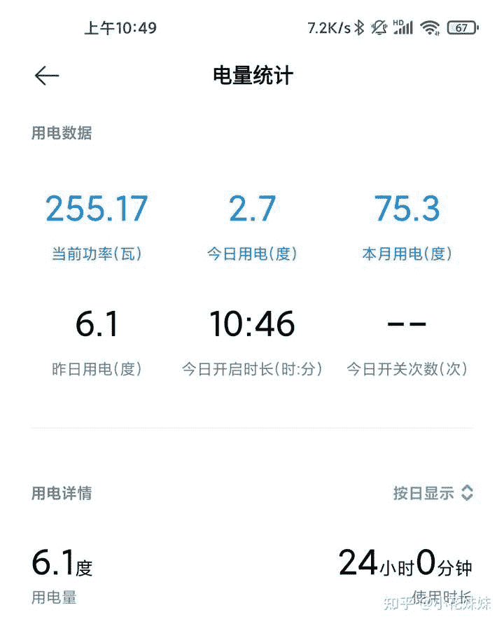

<!--yml
category: 挖矿
date: 2022-06-26 00:00:00
-->

# 2021年了，用个人电脑挖矿是否赚钱？

> 原文：[https://www.zhihu.com/question/436714097/answer/1781273495](https://www.zhihu.com/question/436714097/answer/1781273495)

 ## 赚不赚钱，只看显卡。

个人配置用的显卡：技嘉2070 OC

超频设置：显存频率+800，核显频率–150

已经稳定运行了3个月，只后悔知道的晚了。

具体收益参见下面链接。

基本上大部分显卡的年收益我做了表格。

下面科普。

目前的矿潮和今天的矿潮还是有区别的。

以前蜂拥而至的是比特币挖矿。主要需要的是核显的频率，经过这几年的发展，已经有专门的矿机占领了比特币的市场。显卡的算力只能算作九牛一毛。

以太坊抓住了这个时机，另辟蹊径的使用了显存频率来挖矿。哪怕是矿机在这方面也无法有值得突破。所以目前的矿潮其实并不是比特币，而是以太坊引起的“全民挖矿”。

不需要核显，只要显存5G或以上就可以参与其中。甚至很多人选择了“魔改”显卡，更换显存颗粒增加显存，让**旧时代显卡**重新发光发热。

至于电费问题，我甚至直接购买了可以测电量的小米智能插座来科普

每天24小时运行，电量大约在6度左右，完全可以接受，每天成本约4元电费，差价还是有的。

但是目前显卡的溢价大家也清楚。最具有性价比的3070和3080已经冲上了新高度。

个人建议，如果你本身拥有5G以上显存的显卡，可以用电费换一点零花钱。如果你准备入市，那么需要谨慎。

**挖矿专场**丨[锁算力卡挖矿](https://zhuanlan.zhihu.com/p/399409039)丨[未锁卡挖矿教程](https://zhuanlan.zhihu.com/p/355955385)丨[笔记本挖矿](https://zhuanlan.zhihu.com/p/360451565)丨[锁算显卡怎么挑](https://zhuanlan.zhihu.com/p/374342633)丨[挖矿毁显卡吗](https://zhuanlan.zhihu.com/p/358944242)丨

**猴山专场**丨[猴山解密3080TI](https://zhuanlan.zhihu.com/p/379179943)丨[猴山解密3070TI](https://zhuanlan.zhihu.com/p/379428935)丨[买70TI还是80TI](https://zhuanlan.zhihu.com/p/379846007)丨[猴山冲4K](https://zhuanlan.zhihu.com/p/380129626)丨

**笔记本专场**丨[满血版笔记本怎么挑](https://zhuanlan.zhihu.com/p/374748213)丨[买3060还是70本](https://www.zhihu.com/question/447817962/answer/1909204347)丨[3050本评价](https://www.zhihu.com/question/462045112/answer/1913547325)丨[蛟龙7测评](https://zhuanlan.zhihu.com/p/369226521)丨