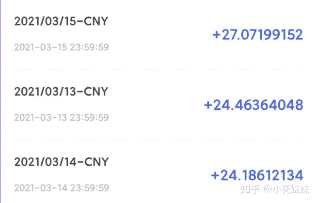

<!--yml
category: 挖矿
date: 2022-06-26 00:00:00
-->

# 2021年了，现在挖矿还赚钱吗，又应该挖什么币？

> 原文：[https://www.zhihu.com/question/439277333/answer/1791396479](https://www.zhihu.com/question/439277333/answer/1791396479)

 先上结论：稳赚不赔，省心省力，一键操作。

教程：[小花妹妹：以太坊，让十年老电脑依旧可以回血教程](https://zhuanlan.zhihu.com/p/355955385)

先科普。目前造成狂潮的主力是以太坊，太多人还停留在挖比特币不够电费的“旧时代”思想。

随着比特币已经无法被平民阶层使用显卡挖矿，非主流币采用了显存频率挖矿的方式，解决了显卡“黄屁股”的问题同时，还让挖矿进入了寻常百姓家。

如果是个人单一显卡操作，个人建议找一个简单易懂的软件就可以了。一个月差不了几块钱，而且方便简单省心。

如果是规模大的老板级别，也不用我多说了，肯定研究的比我透彻。

挖矿这个事情，当个零花钱还可以，如果想当饭碗，还是需要谨慎。

**挖矿专场**丨[锁算力卡挖矿](https://zhuanlan.zhihu.com/p/399409039)丨[未锁卡挖矿教程](https://zhuanlan.zhihu.com/p/355955385)丨[笔记本挖矿](https://zhuanlan.zhihu.com/p/360451565)丨[锁算显卡怎么挑](https://zhuanlan.zhihu.com/p/374342633)丨[挖矿毁显卡吗](https://zhuanlan.zhihu.com/p/358944242)丨

**猴山专场**丨[猴山解密3080TI](https://zhuanlan.zhihu.com/p/379179943)丨[猴山解密3070TI](https://zhuanlan.zhihu.com/p/379428935)丨[买70TI还是80TI](https://zhuanlan.zhihu.com/p/379846007)丨[猴山冲4K](https://zhuanlan.zhihu.com/p/380129626)丨

**笔记本专场**丨[满血版笔记本怎么挑](https://zhuanlan.zhihu.com/p/374748213)丨[买3060还是70本](https://www.zhihu.com/question/447817962/answer/1909204347)丨[3050本评价](https://www.zhihu.com/question/462045112/answer/1913547325)丨[蛟龙7测评](https://zhuanlan.zhihu.com/p/369226521)丨