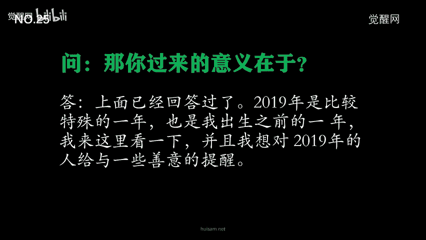
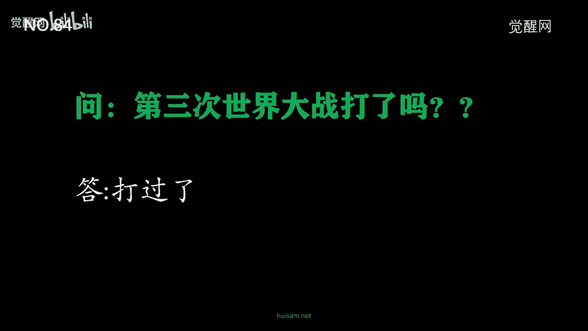
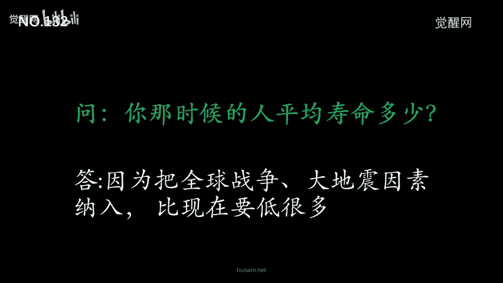
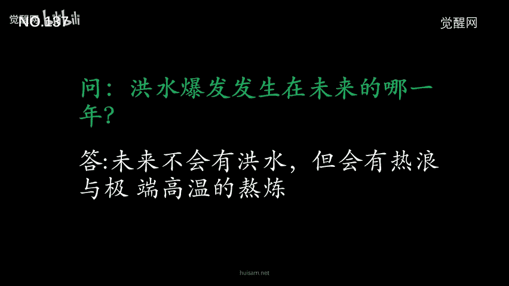
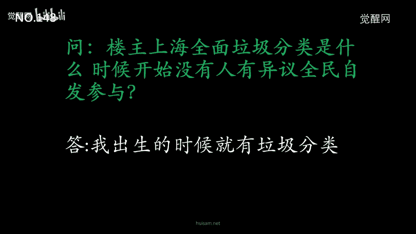
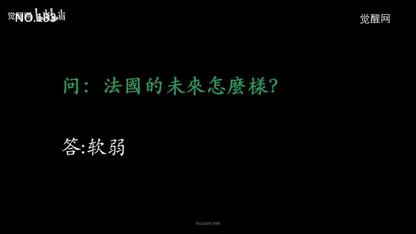
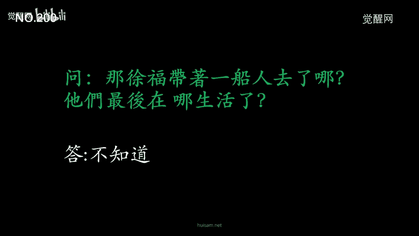
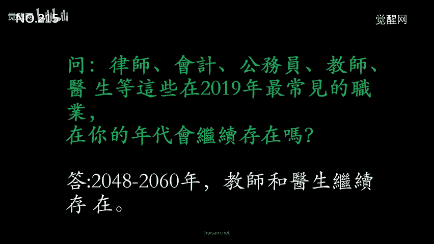

# 2060穿越者KFK在豆瓣回答网友255个问题汇总（2024回顾） - P1 - 觉醒网 - BV1Wr421M71e

好大家好，我是辉啊，那咱们今天呢给大家分享一下，2060穿越者KFK啊，的一个预言的一个汇总，那么这里呢总共涉及到他与网友的，255个问题的一个回答的一个汇总啊，以及我们2023年重新对他的一个解读呃。

那么首先注意啊，本视频呢可能颠覆你的认知啊，也许会给你一些启发，真假呢自行判断啊，那么这个资料呢2019年我整理过一次啊，额但是2023年我们过了两年多，接近3年的时候啊，我们重新来看KFK的预言。

那么你会惊掉下巴，因为他的预言实在是太准确了，里边的内容呢我会适当的做一些解读啊，那么仅供大家参考。

那么首先呢说下起因啊，有可能很多朋友不太了解KFK呃，那么是在2019年6月22日啊，一位自称来自2060年的一位华人穿越者啊，KFK啊，他的名字叫KFK，在豆瓣发帖并回复了网友啊，250多个啊。

接近260多个未来的关于未来的一个问题，涉及到政治，经济，历史科技林学，自然灾害预言等等问题，而随着这些问题的深入，KFK呢火了，后来他的帖子呢被删，庆幸的是，我们对所有的问题做了摘录，望大家呢参考。

那么现在呢已经是2023年了啊，KFK有很多预言呢都已经实现，这不得不让我们开始重新重视，重新审视他的预言，当然也有部分预言并不准确，那么就像KF给说的是善意的谎言，那么不管怎么说啊。

根据KFK所揭露的内容，以及我自身对灵修的认识，那么我认为啊，KFK给我们带来的寓言，是值得深思以及研究的，那么接下来呢我们重新解读一下KFK预言，额那么他首先呢说啊，我是从2060年过来的。

有什么问题呢，可以问我今天是来自2019年的第一天啊，从某种意义上说我是时间里的穷游者啊，这是KFK的一段自白啊，他首先阐明了他是从2060年来的，而且来到了2019年。

首先呢第一个网友就会就问了，未来人类出去旅游是乘坐什么交通工具啊，这个呃KFK就回答，科技发展并没有想象中的那么遥不可及，2048年以前，滤芯仍然靠飞机和磁悬浮列车啊，大家注意一下啊。

这是KFK第一次说这个2048，这么一个数字啊，啊在这里呢我给大家做一个解读啊，KF可以说2048年之前，人类的交通工具依旧是飞机以及磁悬浮列车，那么2048年之后呢，啊KFK后面会说。

2048年是人类的一个分水岭，那么2048年之后，人类将会出现新的超越现代科技的一个技术，出现啊，那时候人类会借助什么交通工具出行呢。

这里呢大家可以做一个思考啊，第二个问题就有网友问了，说你是人还是机器人啊，KFK回答说我是人，那么第三个问题啊，就有网友问了，你在2060年买得起房子吗啊KFK回答，2060年房屋不是贵重物质啊。

解读一下啊，其实从2022年开始，人类的房价已经开始走下坡路啊，相信在未来的房价下跌应该只是时间问题。

好第四个问题，有网友问了，100块钱可以买到什么呀，啊KFK回答说，2060年的货币没有快这个概念啊，在在这里呢给大家解读一下啊，KF可以说2060年没有块这个概念啊，那么那个时候人类将用什么货币呢。

啊其实后面KFK也有说到啊，后面额就是2060年是用的这个虚拟货币啊，我个人也猜测啊，那个时候人类应该用的是虚拟货币的，可能性非常大，随着区块链以及加密货币啊，去中心化的趋势应该是世界货币的走向。

而分水岭应该就是全球经济危机啊，甚至就是这个世界大战，关于这个全球经济危机啊，KFK也在后面说明了啊，距离我们现在应该并不算遥远，全球经济危机之后呢，人类对于政府货币的不信任。

让大家更多的去关注去中心化的一个货币，也就是虚拟币，所以给我们的启发，应该是让我们大家多关注一下虚拟货币啊，这个领域。

好第五个问题啊，有网友就问啊，国家开始分配对象了吗，啊KFK回答说没有好第六个问题啊，有网友问呃，地球各方面状态怎么样，人类找出清洁环保替代能源了吗，大家过得开不开心啊，更焦虑了还是更幸福了。

那么KFK就回答说啊，更焦虑，因为饥荒地震战争非常平荒，不少人怀念2000年到2030年之间，的一个美好时光啊，解读看来2030年以后，人类将遭遇前所未有的灾难啊，是什么导致灾难的呢。

大家也可以去交流一下，好第七个问题问呃，为啥要来2019年呢，KFK回答说，因为今年地球上有很多事情要发生，回头看，这是人类转折的一年，在2049年有一部智慧卡剧，你可以理解为2019年网络上的电视剧。

名字就叫2019，是一部怀旧片，在全球热播啊，在这里解读一下啊，2019年的确是人类的一个转折点啊，呃这个是KFK在2019年说的啊，那么在今天2023年来看啊，的确如此啊。

我们还是依旧呃是非常怀念2019年的啊，那个时候人类也是非常的幸福，那么我们现在呢再也回不去了，从今天来看啊，k f pk当年的预言是一点没错好，第八个问题，有朋友问啊啊沪深上证指数到了2万了吗。

啊回答说没有。

好第九个问题，有网友问美国还存在吗，但他将面临来自亲人和反对他的人，给予的巨大压力啊，解读一下啊，这个预言是KFK预言里没有实现的呃，2019年KFK预言，2020年美国大选，但事实并不是这样。

我们知道拜登总统当选从事呃，从事实角度看啊，KFK这个语言是错误的啊，这也是很多人不相信KFK的一个原因啊，但是我想说的是，KFK是来自2060年，那么他回答问题应该是一个跨时间角度上啊。

比较长的一个时间跨度上来回答我们的问题，也许他说的并不是2020年，这次啊总统的一个竞选啊，据我所知啊，呃那么特朗普呢，即将参参加2024年的一个总统竞选，或许啊这个问题我们应该留到2024年再看。

当然了，这也许啊是KFK的一个善意的谎言啊，因为这个问题的答案是非常具有啊，呃非常大的一个意义啊，如果你呃对当时2019年的人们啊，还是非常有影响的啊，所以说这个问题也许是一个善意的谎言啊。

那么第十个问题，那么有网友就问啊，请告诉我未来两期双色球的开奖号码，谢谢啊，KFK就回答说抱歉，我需要遵循时光旅行的拘束，所以不能回答这个问题好第11个问题啊。

有网友问啊。

南极还在吗啊，KFK回答说还在，第12个问题，有网友问人类可以去火星旅行吗啊回答说不能，但是卫星可以抵达并环绕四周，有一家美国的巨型公司，开发了可以体验火星降温的智慧视角工程。

有点类似你们现在使用的虚拟现实体验，但智慧视角工程更为身临其境。

好第13个问题啊，就有网友问了，结婚率多少，KFK回答，各个国家和民族的不太一样啊，但是大部分的国家的结婚率是偏低的。

好第14个问题啊，有网友问啊，房产会泡沫吗，KFK回答说啊，我在在我出生的时候，房子已经不是贵重物品，老人们聊天时说过。

从前的房子很贵，但我很难想象，好第15个问题就说呃有网友问啊，你带钱了吗，回答说没有，因为在2060年只是奢侈品，一切财富都将数字化，能够在这个世界上使用纸张，我感到很幸福啊，在这里呢也侧面印证了啊。

2060年，所有的财富将是一个数字的虚拟的啊。

好第16个问题，有网友问啊，明天彩票买多少啊，然后KFK就回答说我不会回答，可能微观改变个人命运的问题啊，夏同好，第17个问题呃，有网友问，那时那时候空气质量会好吗，我们是不是第一大强国啊。

回答说空气没有更好地大强国，在西方，好第18个问题，有网友问你是怎么知道豆瓣的KF可以回答说，时光里旅行中的一个数据探测啊，第19个问题，有网友问啊，你出生在哪一年，回答说啊2020年啊。

现在是2023年，KFK应该已经三岁了。

额那么第20个问题啊，有网友问啊，明年你就出生了啊，这个是2019年问的啊，所以啊所以说他就会问明年你就出生了，这个KFK回答说，旅行的法则是，就是必须进入自己尚未出生的年代。

我在2020年之前会离开这里。

好第20一个问题啊，就有网友问那个时候人的平均寿命是多少，人心里普遍更好还是更坏，KFK回答说，各个国家都不一样啊，平均寿命最高的是澳大利亚，人心好的会更好，坏的会更坏，善良的事儿，有恐怖的事更多好。

第22个问题，有网友问现在你父母在哪里，TF可以回答说，这属于我的隐私。

好第二三个问题，有网友问，那你回来做了些什么事情呢，每个人都能自由穷游所穿梭吗，几几年开始可以这样的操作，能不能找到亲人，然后让某些事呃发生变化，KFK回答说，只要我遵循法则，就不会被发现。

时间旅行是一种特权，我只是因为某种原因钻了这个空子，但我不会利用这个事从事非法行为，好第二四个问题，有网友问啊，你为什么要用繁体字，我们繁体字呃，我们简体字不能用了吗，啊，KFK回答说。

那是因为我一直使用繁体字，已经习惯了。

我也可以使用英文，好额，第25个问题啊，有网友问，那你过来的意义在于什么呢，KFK回答说，上面已经回答过了，2019年是比较特殊的一年，也是我出生之前的一年，我来这里看一下。

并且我想对2019的人给予一些善意的提醒。

好第26个问题啊，有网友就问移动通讯技术的进步改变了什么，以后会有6G7G8G这样吗，KF可以回答说7G以后啊，就不再以G命名，因为已经到了另外一个阶段，时间是2048年以后啊。

好这里是又一次提到2048，可见2048这个是非常重要的。

好第27个问题啊，有网友问，所以啊处在当下的时空的我们啊，怎样才能来一次时光旅行呢，KFK回答说没有办法，但是你可以围观的，通过改变你的生活节奏来体验时间的不同。

时间只是一个相对的概念，好第28个问题，有网友问额，那万一你在这里死亡怎么办呢，KFK回答说，我不会死亡啊，但我可能会被他们提前发现。

而被迫提早离开这里，好第29个问题，有网友问你出生的地是哪里，有和你一起旅行的人吗啊，KFC回答说，据我所知啊，目前除了我合法渠道的，只有两个曾经有过短暂的时光旅行，他们来自2075和2062的远东啊。

也就是日本。

那么第三个问题啊，啊有人啊，有朋友问啊，交通费贵吗，房价不高了，那呃那好那会儿什么是最贵的，人人都买得起房了吗，啊KFK回答说，2060年的公共交通是免费的，日常比较昂贵的消费品是水果与牛奶。

只有富有的人可以吃，房子是极速工具，降噪的，除非特别富有的人定制用木头作为材料，一般人都可以申请建造自己的房屋，成本都很廉价好第30几个问题啊，有网友就问了以后最新兴的行业是什么啊，KF可以回答说。

2030年以后，会是人工智能与跨行业的这么一个结合，就是精通人工智能开发与编程的各个行业，另外游戏从2035年进入另外一个阶段。

好第32个问题啊，啊有网友问我还活着吗，那KFK回答说这个我不知道，但是2019年下半年啊，要远离南方边境省份啊，解读啊，呃我不知道武汉算不算是呃，我知道武汉啊算是南方城市啊，但是是不是边境成人呢。

总的来说这个寓言不能说准确啊。

但是有一定的参考价值吧，二好第33个问题啊，网友接着问南方边境省份具体点是哪里呢，KVCV来说尽量离尼泊尔远一点啊，呃这里呢我在网上啊看一看地图啊，尼泊尔呢在这个西藏这边啊，呃他说离西西尼泊尔远一点。

而且是在南方的一个边境省份啊，大家可以看一下啊，呃离尼泊尔最远，应该是直接到了这个上海这边了吧，啊啊途经呢途经武汉啊，大家知道2019年武汉发生了什么，所以说啊呃从某种意义上来说。

KFK说的这个是不是很准确呢，大家可以去思考一下，好额第34个问题啊，有网友问啊，第一为什么会加入啊，苏苏珊米勒豆瓣小组啊，因为这个KFK当时是加入这个小组的，在豆瓣上，那么第二个问题。

人类可以和机器人结婚吗，第三个是否存在全息旅行和全息游戏，就是说身临其境，虚拟世界，视觉嗅觉味觉方全方位的一个体验啊，那么KFK就回答，首先第一个他之所以会加入豆瓣小组，是因为数据分析，第二个呃。

人类有些国家呢在2048年之后，先后通过了机器人结婚的一个法案，第三个就是2035年开始出现，第一款这样的游戏在中国。

好第35个问题啊，就是有人问，海平面升高会导致很多沿海城市消失吗，那么KFK回答说，除了这个额这个海平面上升啊，还有这个炎热地震导致的这个塌陷啊。

那么第36个问题啊，就是有网友问在未来哪些省份比较宜居，那么KFK回答说，2030年以后的云南，以及2048年以后的贵州。

那么第37个问题啊，有网友问人文科学的发展如何，性别平等问题是否有所改变，如果可以，请问您还可以用男性或者女性来称呼吗，未来有什么有多少种性别，那么KFK就回答说人文倾向呃。

在全球不同文明中找到了共同理论，但仍然失败，在某些国家和地区歧视女性仍然存在，在另一些地区，女性主义强盛，但也导致混乱，男性女性的称呼并没有改变，因为机器人婚姻化，而婚姻法案，机器人也有性别之分。

好第38个问题啊，有网友问机器人贵吗，可以制作的跟真人一样吗，或者定制成我们想要的样子吗，那么KF可以回答说，2035年起啊，机器人广泛应用于交互游戏，2038年啊，人工智能量化生产定制。

需要取得复杂的授权以及法律条文，在采购机器人中，少数人会这么做，大部分人大部分应用于家庭整理学习娱乐，安安全好，第39个问题啊，就是有网友问啊，今年目前来看还是还不是所谓的多事之秋啊。

能让今年特别到引起你的注意，难道集中在下半年吗，或者其实你的额是你的私人原因，那么KF可以回答说是下半年。

啊好第40个问题啊，有网友问呃，什么时候机器人可以广泛应用，就像手机一样，那么KFK回答说在2038年以后好。

有网友问啊，全球第一大品牌还是苹果吗，如果不是在什么领域呢，啊那么KFK回答说啊，苹果呢在他小时候呢就衰败了，房屋打印公司，交互游戏公司以及光学虚拟真实眼镜公司啊。

是四零到50年代的三大巨头，第42个问题啊，有网友问了，人类克服了癌症了吗，KF可回回答说，癌症大体被克服，但是超级细菌呢无法被克服，50年代呢给人类造成了严重的灾难。

第43个问题啊，有网友问啊，宗教还存在吗，人类是否确认的相信除科学以外，还存在其他的目前不被认可的科学，比如风水，占卜神学，那么KF回答说，宗教呢继续存在。

人们转向了研究自身与宇宙的关系，好第44个问题啊，有网友问深圳到时候适合生存吗，KF回答说，2030年以后越来越不适合，第45个问题啊，有网友问小康实现了吗，KFK回答说。

只停留于历史的一个词汇，第46个问题啊，有网友问呃，首先第一个啊是否可以穿越到更遥远的时代，比如封建社会，甚至是秦唐，第二个就是你所在的时代，最常见的犯罪行为是什么呃，那么KFK回答说。

第一数据信息太少的朝代不适合旅行啊，因为没有有效的这个交流机制，第二个就是最常见的犯罪行为是数字，货币的窃取以及诈骗，社会信用并没有在全球范围内啊，中心化有些在有些国家和地区啊，反而是去中心化了。

第三啊，基础编程呢在30年代会纳入初中，高中的一个基础教育，高高考继续存在啊，但是从32038年起不再是选拔手段，那么解读一下啊，如今呢啊大家还记得前面KFK说的，2060年的一个货币已经没有块的概念。

我猜应该是虚拟货币啊，那么从最常见的犯罪是数字虚拟窃取以及诈骗，侧面反映了人类即将迎来数字货币的一个时代，好第47个问题啊，有网友问人们那个时候可以活多久呢，有没有一种让人开心的药。

那个时候的人们是不是很孤独呢，KF可以回答说，人在精神深处啊，有一个更深的一个官能啊，是与时空之外的宇宙紧密联合的，这个是人类的第二次进步，但是发生在战争之后啊，那么这里呢解读一下。

我猜测啊和大脑中的松果体有关啊，也就是我们所说的第三只眼开启，会连接未来，连接诸神，连接高，我连接宇宙，好，第48个问题啊，有朋友问啊，那个是哪里的战争呢，KFK回答说，这牵扯到全球的两个世界文明啊。

地点是在三个大洲的一个交界处，我只能说这么多啊。

好第49个问题啊，就是有网友问区块链在哪些方面普及，使用了以后的货币体系，是基于比特币一样的体系吗，KFK回答说，最广泛应用于区块链呢是一些邪恶的国家啊，全球大国呢仍然尽量避免货币的去中心化。

好第50个问题啊，有网友问中国的房价是从什么时候开始，进入下行通道的，那么KF可以回答说，确切的年代呢他已经不记得了，在他记忆里呢没有很清晰啊，所以说应该是在20年代早期，那么这里解读一下啊。

按照KFK的说法，应该是在2025年之前，现在是2023年，很多地方房价已经开始下跌啊。

好第50一个问题啊，啊有网友问啊，看到您提到的战争疾病多次，这些邪恶国家指的是后面发生战争的国家吗，这次战争的规模有多大，是否使用大型的核武器带来破坏的后果，额后的最大的科技术进步在什么领域。

感谢回复呃，那么KF可以回答说全球性的战争啊，中心在三大洲的交界处啊。

应该是欧洲啊，比个别使用核武器更为恐怖，战争之后没有技术上的进步，但精神上的进化，否则我不会出现在这里，那么这里解读一下啊，按照KFK所说的，由于精神上的进化啊，KFK才能进行时光穿梭。

那么是不是可以说穿越呢，与人类的精神意识层次有很大的关系啊，我是一个修炼者啊，我明白其中的意义，这点呢很重要，好第52个问题啊，有网友问你是male还是female，意思是你是男的还是女的。

KFK回答说，在2060年，我是男性，进入时间旅行的时候，不再有性别，那么解读一下啊，时间旅行应该是意识在穿越，如果你是修炼者的话，你应该明白啊，意识是存在于更高维度的存在，而超越人类的第三维度。

因此呢意识是可以跨越时间以及空间维度的，如果KFK借助意识进行时间旅行，那么我不会有一脸的惊讶。

因为这个很正常好，第53个问题啊，有网友问，今年到2060年有外星人到访吗，人类会发展出超能力吗，你们那个年代还看电影吗，那个年代的超级英雄有什么超能力呢，KF回答说，不会发现外星人啊。

但会发现从前没有发现的生命特征啊，从地下海洋之下出现，比起电影，我们更喜欢交互游戏啊，在战争之前，战争之后呢，我们开始进入另外一个阶段啊，在这里解读一下啊，很多资料都表明，地理以及海洋底下有蜥蜴人啊。

他们有超强的科技，很多我们看到的UFO就是他们呃，他们的他们的一个飞行器啊，战争是一个分水岭，战争之后呢，人类即将进入一个灵性世界啊，大家可以开始修炼自己，修炼自己的一个意识好，第54个问题啊。

有网友问人类的幸福指数更高了吗，在哪个地区生活的人会比较快乐呢，KF可以回答说，如果单单是物质层面的幸福啊，30年代以前人们是幸福的，如果是精神层面的幸福，50年代开始，人类进入另外一个阶段。

那么在这里解读一下啊，50年代也就是2040年之后，人类的精神层面即将提高，修炼的意识即将提升，在这一切都发生在战争之后，战争应该是在三五到40年之间。

好第55个问题啊，有网友问，请问您最想对我们2019的人类说些什么呢，另外请问，未来父母，妻子子女这种传统的家庭伦理关系，是否还存在呢，现在学习各类外语在未来是否有用。

以后电影电视这种造梦的行业还存在吗，那么KF可以回答说，希望2019年的人们还能记得，上半年是你们最美好的一年，下半年进入了动荡，会是人类未来的一个常态，父母丈夫，妻子子女之间的关系呢。

会在动荡中显得弱不禁风，许多伦理的东西会因为灾难，饥荒战争而变得没有意义，语言的障碍会在2035年之后完全清除，第56个问题啊，有网友问，魔法有被科学证实或者证伪了吗，其他超自然现象。

比如说鬼红其他空间等等，你们怎么看，KFK回答说，2050年以后呢，这些都不算什么奥秘的事，那么解读一下啊，50年代以后，人类将进入灵性时代，人类即将意识到意识的存在，沟通高维了解生命真相。

这一点即将会被验证好。

第57个问题啊，有网友问，如果挑一部2019年之前上映的科幻电影，构想画面整体情况最像你现在的呃，那个年代会是哪一部呢，KFK回答说，几乎没有好。

第58个问题啊，有网友问你所在的年代，人们如何看待自己生活的年代，让人觉得这个社会在上扬发展还是下行后退，你们时代有哪些对未来可以预见性的判断，那么KFK回答说啊，这是个好问题。

我们是人类历史以来空前注重发展，内在文明的时代，因为很多东西呢在战争之后，如如同幕布般被揭开，对于真实宇宙的追求达到了鼎盛，人类因为苦难而转向真实意义，就我个人认为是进步。

未来我们会进入到另外一个全新的阶段，最终呢达到一种万有归一的阶段，那么在这里解读一下啊，我不知道大家有没有看过一的法则啊，KFK所说的万有归一的阶段啊，其实我们现在已经知晓，那就是一的法则。

大家可以去我的网站去了解一下一的法则啊，他的呃他呢最终就是万有归一的一个阶段啊，好第59个问题啊，有网友问，2048年是你的回答里，提到的很多的一个年份，请问那一年是很特殊的一年吗，KFK回答说是的。

不仅对中国，对全球都很特殊好第60个问题啊。

有网友问近几年会有战争吗，KFK回答说，2048年以前不会有全球性战争，但是局部战争没有停止过，那解读一下啊，2048年，我猜测应该是会发生一场全球性的战争，而且这个战争应该不仅仅是。

人类与人类之间的战争啊，而应该还有人类与地下种群，像新人这样的种族啊会参与战争，而这些种族拥有的科技以及超越人类的意识，精神武器将会在战争中，对人类不再是秘密，人类因此进入新的精神领域阶段。

人类将洞悉宇宙生命的奥秘。

好第60一个问题啊，有网友问旅行者，你们也需要睡眠吗，呃KFK回答说，阳光即将离去的地方是我们旅行的开始的地方，月光照射的地方是我停留的地方，我的旅行并不限于这里，解读时间，旅行其实就是意识旅行啊。

可以跨越时间以及地域，可以跨越宇宙，跨越星空，也可以进行传说中的遥视啊。

已经跨越了第三维度的限制，好第62个问题啊，有网友问你还有选择其他的沟通软件吗，哪些行业会消失，哪些行业会一直延续，信息高度发达的社会，工业发展如何，今年下半年会发生多少影响深远的大事，主要在几月。

KFK回答说，除了这里，我没有选择其他的沟通机制，有个人的原因，但这是我的隐私。

好第63个问题啊，KFK回答说，在我所处的时代啊，并未发生机器人自主攻击人类的想象，但lost组织一直僵持，危机的存在。

好第64个问题啊，有网友问好，想知道2030年后，我们还能自由的到其他的国家旅行吗，出国留学受到啊哪些影响，拜托回我，KFK回答说，2030年以后可以，但是2048年以后旅行和留学将没有意义啊。

这里解读一下啊，2048年大家可以进行时间旅行或者摇试，同时可以进行意识交流，但传统意义上的旅行自然就没有意义了。

好第65个问题啊，有网友问2060年什么最稀缺呢，KFK回答说，按照现在的物质衡量，2060年所有的物质都是稀缺的，那么在这里解读一下啊，2060年大家都在追寻精神上的升华啊，依靠一直就可以创造东西。

包括吃的用的，所以现在的物质就会变得很稀稀缺。

好第66个问题啊，有网友问那个时候网络的钱还存在吗，那么KF可以回答说，WIFI卫星全球普及后，钱就不存在了，在我少年的记忆里就没有钱了，这里解读一下啊，这里说的WIFI卫星。

应该说的就是马斯克的星链计划，而且在2023年已经快实现这个目标了。

好第67个问题啊，有网友问，那么到你的那个年代啊，还会有专门的老师来教育孩子吗，还有学校的存在吗。

回答说存在好，第68个问题啊。

有网友问，那我们现在做些什么预防或者注意些什么呢，累积一些什么呢，能够帮助到以后我们本身，那么KMK回答说，需要在广阔的内陆找到合适的居住的那地方，因为极端气候会导致许多城市无法生存的情况。

好第69个问题啊，有网友问你会爱上2019年的人吗，KFK回答说。

我的太太就是2019年出生的好，第七十一七十个问题啊，有网友问额，第一日本福岛呃，核辐射这些年带来了什么影响，第二做过近视眼手术的人，2060年还好吗，那么KLK回答说，首先第一个啊日本会有更大的地震。

不得不迁都啊，而且迁都到了感伤啊，第二个就是30年代智能眼镜植入眼球。

改变了人的生活，好第70一个问题啊，有网友问我想问豆瓣还存在吗，KFK回答说2060年不存在了，但数据还在，第72个问题呃，有网友问你是台湾人吗，用繁体字吗，KFK回答说我不是，第73个问题，有网友问。

请问中国什么时候能够同性恋合法啊，话那么KFC回答说全球战争的同一年啊，这里解读一下啊，这里说的全球战争应该是指2048年。

好第74个问题啊，有网友问第二次冷战，中国输了吗啊这里回答一下，KFK回答说持续了30年啊，那么解读一下啊，这里说的冷战啊，其实我不太清楚是什么时候开始的，有知道的大家可以去留言交流一下好。

第75个问题啊，有网友问精神病是怎么回事，KFK回答说，50年代以后，人们发现精神只是一个器具，容易受到各个律的影响，这是一大发现，那么这里解读一下啊，2048年战争以后呢，人类转向更加注重精神的提升。

这个时候呢人类发现了精神，也就是我们所说的意识，就是一个器具，会受到各个氯的影响，那么我们需要思考的是什么是器具，以及氯是什么好。

第76个问题啊，有网友问美国在那个时候居住生活环境还好吗，还是不是世界上第一大国，那么KF回答说，美国是战前最后一个帝国，欧盟是战争的决定因素，中国和印度将成为东方的另外一股势力。

好第77个问题啊，有网友问告诉我现在的行情适合炒股吗，KFK回答说，在我的青年时代，全球股市在一个小时里全部失去了意义，那么这里解读一下啊，这里说的7年时代应该是KFK18岁之前，也就是2038年之前。

具体哪一年有待商榷啊。

不不不太清楚，好，咱们来看一下第十七十八个问题啊，有网友问2060年，社会学这门学科在中国的发展怎么样，KFC回答说，社会学失去了意义。

第79个问题啊，有网友问未来哪个行业的发展更好，大家还是喝奶茶吗，火锅你们还吃吗，明星还受追捧吗，哪个城市发展最好，KFK回答说。

有些奶茶是奢侈品，火锅在2048年之前经常吃，二第80个问题呃，有网友问啊，你是台湾人吗，为什么打繁体字呢。

kept说我出生在上海，第80一个问题啊，有网友问，一边说2019年是自己出生前的一年，一边说自己出生的时候，房子不是贵重物品，也就是明年房子就便宜了吗，KFK回答说，我不太关心房子啊，只能说一个印象。

总之到了20年代啊，房子就开始不值钱了啊。

好第82个问题啊，有网友问最流行的全系游戏叫什么，是什么类型的游戏，KF可以回答说简称OS怀旧主题好。

第83个问题，有网友问未来还是用智能手机吗，不然你是从哪里找的一个智能手机啊，还有为啥要用繁体字呢，KB可以回答说，时间旅行的交流机制很难跟过去的，你解释繁体只是一个语言的勾选。

第八十四，有网友问第三次世界大战打了吗。

KF可以回答说打过了，第85个问题，有网友问以后还有婚姻制度吗，可以娶几个老婆，KFK回答说，中东地区仍然延续这一时啊这个政策啊，这里解读一下啊，这里说的中东地区仍然延续，那意味着。

有很多其他的地区已经取消了这个制度了，可以娶几个老婆啊，我认为啊当机器人婚姻法案出来以后，娶几个老婆已经不是什么问题了。

就看你的财力，可以买几个机器人，嗯第86个问题啊，有网友问，请问你说相对，你是你说想对2019年的人提出善意的提醒，但是我看完帖子也没有看到提醒我们什么了，只能说KB可以回答说，如果没有任何意外的话。

我会留在2019年12月31日，最后一天离去，与你们一同见证这些即将发生的事，127个问题啊，有网友问，2020年到2030年会过得很艰苦吗，KF可以回答说有的国家是好，第88个问题啊。

有网友问现在学小语种还有什么意义吗，呃KF可以回答说希腊文或者希伯来文啊，比较有意义，KF呃，这里解解读一下啊，有什么意义呢，个人觉得希腊文或者希伯来希伯来文啊，应该和地底文明有关啊，当然只是猜测好。

第89个问题啊，呃有网友问TFBOYS解散了吗，呃CAFKATE回答说无不散的宴席啊，意思就是解散了，那么这里解读一下啊，早在2022年12月，就传出了他们解散的消息啊，大家可以在网上去看一看。

好第90个问题啊，有网友问你的穿越已经改变了未来，所以我们拥有的不是同一个未来，对吗，KFK回答说，我的形态和你理解的穿越并不一样，所以我不会改变未来，而且不会有人真的相信我。

但我会在这里提醒我想提醒的那个人，直到几十年后对他造成的影响，好第90一个问题啊啊，有网友问你是来传教的吗。

cafe可以说不是，好第92个问题，有网友问全称叫什么，哪个公司生产的，ea还是还在吗，暴雪发展如何，难道程序员不知道OS代表啊，这个这个什么什么系统啊，是哪个PM通过的这个名字。

pm在哪个时候还需要考证上岗吗，KF给回答，说中国的巨头游戏公司开发的ea，暴雪都转型做交互游戏了，好第93个问题啊，有网友问你的穿越也是平行宇宙那一理论的吗，如果你说你说不会造成改变。

未来未来有平行宇宙吗，KFK回答说，并没有平行宇宙。

只有时间观察者，好第94个问题啊，有网友问楼主很高兴能和您相遇，在豆瓣，我相信从看见这个帖子，就相信这是不平凡的一天，很荣幸能和您一起见证不平凡的，2019年的下半年，有几个问题想和您一起探讨。

第12060年，物质匮乏，犬儒主义是否大行其道，第22060年，人类更注重内在的探索和人和宇宙的关系，这和很多宗教的内在哲学不约而同，这似乎意味着宗教的创建者，也有可能是实践的旅行者，第32060年。

人类已经能够可以在太空探索，那么是否有发展太空资源，以解决人类物资匮乏的局面，做一个宇宙资源的掠夺者的发展方向，该不KK回答说2060年人们人不累，人们变得充满敬畏啊，对眼看不见的世界有更多的探索。

物质在近1000年1000年来说啊，最被轻视，好第95个问题啊，有网友问中国在第三次世界大战处于什么位置，是否有战队KFK回答说与美国欧盟，以色列对抗。

第96个问题啊，有网友问，从5G到七，这用了29年，可不可以说是的在后的比在前的复杂，那么在这里解读一下啊，2019年4月3日呢，美国宣布啊5G超宽带网络，2019年6月呢，移动。

联通广电啊发放了5G牌照，中国呢正式进入了5G元年啊，也就是2019年进入5G元年，那么29年以后呢，那就是2048年，那么到时候啊就会进入7G好。

第97个问题啊，有网友问猫狗宠物和其他动物，你们那个年代还存在吗，k f cat回答说继续存在，但动物和人的关系有质的改变，这里解读一下人类精神提高以后，意识层面的交流，会与动物进行意识交流。

所以说关系自然会改变，那么第98个问题啊，有网友问游戏开源拿什么编程啊，语言写的，你们上学时候考的语言叫什么，是哪个公司开发的交互游戏，他们KAT可以回答说，交互游戏是以打印技术。

眼睛科学机器人定制为三大根基好。

第99个问题啊，有网友问2060年流行什么科学理论，现在2019年大行其道的是量子力学，在2060年还属于科学吗，还是已经被推翻了，KFK回答说，观察者问题在2049年就解决了，时间存在的意义被解决了。

这里解读一下啊，2049年是战争结束之后啊，有些问题应该是在战争中受到了启发，那么是谁给带来的启发呢，我猜测应该是地底文明啊，超强的科技，比如说意识，武器，意识能量这些给人类以启发。

或者这些知识直接从地底文明获取好。

第100个问题啊，有网友问最近一次大事件发生在几月呢，KFK回答说8月好，这里解读一下啊，我们知道亚马逊大火发生在2019年8月啊，啊那次大火持续了整整整好几个月啊，然后雨林破坏，生物多样性。

破坏氧气减少，全球变暖，水也会难以保存，森林遭受了破坏啊，水土严重流失，珍贵的野生生物啊，遭遇了很大的劫难啊。

这个这个大事这是一个大事啊，100一个问题啊。

有网友问时光旅行这么久，最喜欢哪个年代啊，KFK回答说就是2019年，这是最美好的一年。

好第102个问题啊，有网友问啊，想问一下台王何时回归啊，呃KFK回答说，在2022年到2023年啊，会有一次事件发生啊，那么今年是2023年啊，我们有什么事件呢，我们拭目以待啊。

第103个问题啊，有网友问，牛顿预言，2060年是世界末日，你来自2060，是否2060年发生了什么事情，让你以时间旅行者的身份穿越回来，2019年呢，KFK回答说，我的理解并不叫世界末日。

而是进入另外一个阶段。

好第104个问题啊，啊有网友问第一BTS活到哪一年，第二未来在加拿大和俄国的关系如何，想去留学，第三自动驾驶大概哪一年普及呢，是不是不用考驾照了，第四你们那个年代有什么新词儿，或者世贸的网络用词吗。

啊就是时髦的网络用词啊，感谢楼主解答，KFK回答说，呃两个第二个问题是两个不同的阵营啊，第三个问题是自动驾驶在中国，最终并不是成功的一个实验。

好第105个问题啊，有网友问楼主，楼主你好，欢迎来到2019，我想问问在你那个年代，心理学作为一门学科是否流行，就业怎么样呢，KFK回答说，2060年没有心理学，因为他不解决心理问题好第106个问题啊。

有网友问你是哪个国家的人呢，KKKFK回答说，我出生在中国上海，2048年以后移居澳洲，第107个问题，有网友问冷冻尸体然后复活是否成真，KFKFK回答说，没有听说过第108个问题，有网友问俄罗斯呢。

KFK回答说表面中立啊，就是说这个战争过程中啊。

那么109个问题啊，中东的宗教问题对中国有没有伤害，日韩啊，朝岳飞呢，KFC回答说超详不久会有变动啊。

好第110个问题，有网友问你移居之前的上海怎么样了，一如既往的全国经济中心吗，KFK回答说，一直是中国最好的城市。

第110一个问题啊，有网友问如何证明你不是恶作剧，还有最近四川地区地震频繁，有没有什么大的问题，KFK回答说，下半年地震会很频繁啊，这里给大家解读一下啊，我亲自呢在地震台查询了一下。

2019年下半年四川地震的发生的次数啊，大概有136次，而上半年呢发生了仅仅只有35次，那么从数据上来看啊，四川2019年下半年确实地震比较频繁好。

第112个问题啊，有网友问楼主，请问纸质书是否彻底消失，如果消失了，是什么年代呢，KFK回答说，纸质书没有彻底消失，但不再普及，是作为收藏品和拍卖品好。

第113个问题啊，啊有网友问楼主从2019年离开以后，你留下的一切痕迹，包括这个帖子会不会消失呢，KFK回答说，讯息不会消失，但我会消失啊，这里也解读一下啊，KFK发帖之后呢。

不久他的这个帖子就被删了啊，但是他留下的信息呢，已经被广大网友整理出来了啊，我们觉醒网呢就是整理者之一好。

第114个问题啊，有网友问，请问在20到30年代转行就业适宜，且能拿到最大的红利的行业是哪个，KFK回答说，20年代中后期从事生机农业，我印象中从事生机农业的生产者的亲戚啊，都很富有。

第115个问题啊，有网友问，可以不去上班，在家工作吗，只需要眼球进行植入，可以实现很多工作对吗，不需要坐在办公室对着电脑对吗，KFK回答说，在家办公在20年代就有很多行业都实现了，这里解读一下啊。

现在很多人已经开始网上办公，包括上网课。

尤其是最近这几年好第116个问题啊，有网友问上海在20年代还安全吗，KFK回答说，2048年以前都算安全，第117个问题。

有网友问，从2060年回望过去是什么样的体验，是会觉得像民国一样，还是觉得像原始人一样遥远，KFK回答说，你们在2019年开心的事，在将来都不会再开心，你们在2019年烦恼的事，在将来都不会再烦恼。

你们在2019年认为的事，在将来都不这么认为好。

第118个问题啊，KPK回答说我回答过了，我不会重复回答这个问题好。

第119个问题K不K呃，有网友问啊，中国女排东京奥运会夺冠了吗，KFK回答说没有，东京奥运会会有事故发生啊，这里解读一下啊，2020年东京奥运会的确由于疫情啊，推迟了一年举行，属于事故啊。

东京奥运会中国女排排名第九，非常遗憾没有进入八强，所以说并没有夺冠。

这个预言是准确的好，第120个问题啊，KFK回答说，如果你问的是国家元首并没有。

第120一个问题啊，有网友问，他们的高层是外星人吗，KFK回答说，我生活的年代。

第122个问题啊，有网友问日本还存在吗，KFK回答说存在，但失去了一半啊，这里解读一下啊，应该是由于地震海啸，海平面上升，日本大部分被海水淹没，甚至导致迁都赶上好，第123个问题啊。

有网友问下次经济危机是什么时候啊，KFK回答说中国的虎年啊，解读一下，那么虎年呢是2022年，2034年以及2046年，那么2022年没有发生，有可能发生在2034年啊。

那么我们拭目以待好第124个问题啊，有网友问楼主你好，我想问一下2048年以后，全球范围内的宗教是什么状态，KFK回答说圭一好，这里解读一下啊，宗教都是殊途同归啊，这一点我们现在其实很多人已经知晓了。

第125个问题啊，有网友问啊，楼主你好，问你几个问题，第12032年夏季奥运会是哪个国家举办的，第二台湾的下一届领导人是谁，第三今年下半年中国最火的电影是哪一部，回答第一个问题啊，雅加达，第二个。

如果你问2020年和上一届是同一个人，这里解读一下，国际奥委会于2021年7月宣布，2032年由的奥运会呢由澳大利亚啊，布里斯布里斯班举办啊，印度尼西亚的雅加达呢属于是备选城市，台湾领导人一直是菜。

这点没错，好第126个问题啊，有网友问你们探索了人死后的奥秘了吗，KFK回答说是的，好第128个问题啊，呃你试试能不能看懂以下的内容，啊下边网友呢给了一段英文啊，就是这个汉语拼音的一个啊拼音啊。

那么KFK回答说我可以看懂，那么第129个问题啊，有网友问战争都是因何而起的呢，KB可以回答说宗教与文明的冲突，第130个，有网友问，那请问心理学是转向何处，研究脑科学吗，还是意识。

KF可以回答说比心理学更啊更深层次的灵学，这里解读一下啊，人类开始研究林学，这一点毫不奇怪，2023年的，我们已经认识到林学的一个重要性。

好第130一个问题啊，有网友问，请问一下您现在是以数据的形态存在吗，KFK回答说，从某种意义上来说是的第132个问题啊，有网友问你那个时候的人平均寿命是多少，KFK回答说，因为把全球战争大地震因素纳入。

比现在要低很多，第133个问题啊，有网友问楼主，我看到有人说在未来30啊，30年啊，亚洲除了日本和台湾，其他城市会在一夜中消失，非洲也全部消失，地球上只剩下百中人来维持地球新秩序，所以听你这么说。

中国在未来还是会存在对吗，KF可以回答说存在第134个问题啊，有网友问，欧洲可能休息去了都不回都不回都不回复啊，没想到类似的数据存在的，楼主还需要休息，KFK回答说，对于暴戾之气的发文。

我会如同各自一样的非礼好。

第135个问题啊，有网友问楼主是台湾人吗，大陆一般会叫智能，KFK回答说我已经回答过了，我不会撒谎好第136个问题啊，有网友问，请问对精神层面的提升具体是指什么，KFK回答说俗称临界好。

第137个问题啊，有网友问洪水爆发发生在未来的哪一年，K普提回答说，未来不会有洪水，但会有热冷与极端高温的熬炼。

第138个问题，网友问认真的问，正在纠结北京上海还是新西兰，未来哪个城市会好一点，KFK啊回答说新西兰会有强证，上海好一点。

第139个问题啊，KB有网友问，请问阿兹海默症有了有了解吗，什么时候被攻克，KFK回答说，战争之后记忆并不会遗忘，而只是被封存了啊，这里解读一下啊，连休的人应该明白哎，人死后记忆是被封，总提交给了高武。

也许2048年以后，我们有办法可以获取我们的前世记忆。

好140个问题啊，KFK回答说不会，第140一个问题，有网友问你可知道你在发表这些言论，会直接影响到一些看帖子的人的前途和命运，造口业是会有报应的，你猜你这个帖子给你积攒了多少口业，放心吧。

全部都会记在你的名下，一个一个抱怨给你，KFK回答说，你的理论来自于佛教，在2049年人们会发现那些都是智慧的谎言，好第142个问题啊，有网友问，请问中国最近的一次大规模战争是什么时候，发生在沿海吗。

KFK回答说，不在中国本土，在三大洲的交界处。

好第143个问题啊，有网友问我妹妹今年刚刚出生，请从你的角度来对他们这一代人，提出一些成长有益的忠告，KFK回答说，保持善良在未来人的内心品质会决定命运，这里解读一下啊，在一的法则中讲啊。

爱与光是通往高位的必要条件，有爱的振动频率才会有未来。

好第144个问题，有网友问你喜欢作家卡夫卡吗，啊因为这个呃KFK啊，就是卡夫卡的一个首字母缩写，那么KFK回答说，在50年代，我们对3412星球的认识，超过了这个作家本身，那么这里解读一下啊。

1983年呢，为纪念啊这个卡夫卡这位独一无二的文学巨匠，大师呢，人们把发现的小行星3412命名为卡夫卡。

好第145个问题啊，有网友问，中国是从2019年开始明显走下坡路的吗，KFK回答说，会走民族主义道路，好第146个问题啊，有网友问你长的和我们一样吗，km可以回答说一样。

第147个问题，有网友问，能讲讲时空传送的原理吗，KFK回答说，在物质范围里无法领会，并不是肉身的传说，而是讯息意识啊，精神的一个传输。

好第148个问题啊，有网友说，楼主上海全面垃圾分类是什么时候开始的，有没有人啊，有没有人有异议，全民自发参与吗，KFK回答说我出生的时候就有垃圾分类好。

第149个问题啊，有网友问我有个问题啊，你目前状态需要睡觉进食吗，还是可以24小时在线那种状态，KFK回答说，我跟随两个星期的阴影行动好。

第150个问题啊，有网友问，那请问楼主全世界哪些地方适合定居呢，北欧挪威，丹麦，芬兰，瑞典哪一块合适呢，谢谢KFK回答说，欧洲将是战争的发源地。

好第150一个问题啊，有网友问，想问一下，如果按照你说的有造物主的话，那如何认识命运呢，命运是否真的是一定的，个人的努力到底起多大作用，KFK回答说，命运是过去的用词，我们叫定命。

个人的命运只是如浮沉漂浮，地面则是确定的结果，有定命个人努力可以加快地面的完成，也可以延迟，这就是时间的意义啊，这里解读一下啊，懂得连接高我那这些就会明白，每个人的人生就是剧本已经被注定。

你可以提前交卷，也可以延迟交卷，好第152个问题啊，有网友问你想提醒的，他在群游小组里吗，KFKFK回答说，同时存在于我关注的两个地方，好第153个问题啊，有网友问你的名字，KFK是你全名的一个缩写吗。

KFK回答说不是，30年代以后，中国四个字的名字开始盛行。

好第154个问题啊，有网友问，那在那再请问一下，全世界还有哪些地方适合生存呢，笑如何，我没什么大梦想，只想尽自己所能让家人，KFK回答说西奥相对稳定，那么第155个问题啊。

有网友问，假如我现在杀了你的父母，你还会在明年出生吗，纯粹是一个哲学问题，KFK回答说，你无法改变已经发生的事。

第156个问题啊，有网友问智慧的谎言，以及之前提到的万有归一精神物质，这跟这很本源的生命状态，期待这一天的到来，但从目前社会环境和精神环境来看，很难在2060年实现，除非有精神层面的大变革，有些好奇。

战争会怎么带来精神的变革，KFK回答说，极端环境使人谦卑好。

第157个问题啊，有网友问战争的形式是短兵相接，火炮风筝吗，还是说更前倾向于数据模拟的那一类，KFK回答说，尸首成堆，血流成河好。

第158个问题啊，有网友问额，也想问一下，我是否可以这样理解我们认定的文学，绘画，雕塑，电影游戏，这些以物质形式或者符号形式，交互系统形式存在的艺术形式，在你所来的年代。

成为了与内在的发展所关联的桥或者是通道，KFK回答说他们可以成为影子的影子好。

第159个问题啊，有网友问，那么内心的善良勇气爱美，他们是否可以被归纳进影子，KFK回答说，不是越不可见，越趋于实体，如善良的品格。

柔软的内心好，第160个问题啊，有网友问有读心术吗，KFK回答说，2060年以后人心赤露，无需解读，这里解读一下啊，一的法则里面说，这就是社会共享意识，你可以随意读取别人的意识，想法好。

第160一个问题啊，有网友问你现在用什么发豆瓣的手机的话，是什么软件，是什么款，KFK回答说，30年代手机会成为历史。

好第162个问题啊，有网友问你怎么用繁体字，是从台湾来的吗，KFK回答说，我和台湾没有关系，2020年到2048年，我生活在上海，其次是空商湖州宁波，2048年到2060年，我生活在澳洲。

使用繁体字只是一种旅行的一个选项，这样可以避免信息引起注意，被迫离开这里。

好第163个问题啊，有网友问手机成为历史，那楼主你们在未来替代手机功能的是什么呢，KFK回答说，最早称之为物流，后来是芯片植入，好第164个问题啊，有网友问楼主你是文科生吧，KFK回答说。

30年代不在文理。

第165个问题啊，有网友问，那你为什么会有台湾人的口癖啊，KFK回答说，未来人东亚文化上有高度融合，可能你们不习惯，但你们的啊后辈如果在大城市生活。

都会这样讲话，好第166个问题啊，有网友问不错，我也想问，从未来回看，对当下的年轻人的发展有什么建议，KF可以回答说，保持善良的品质和敬畏之心。

好第167个问题啊，有网友问啊，第一请问你是通过科技时空旅行，还是神秘学方法，第二造物主是被人类发现的还是自动现身的，他会与人类沟通吗啊KFK回答说。

第一二者都有，第二我还不能说好，第168个问题啊，有网友问，面对我们对你的质疑，你有什么想说的吗，KFK回答说没有。

第169个问题啊，有网友问楼主，你说你想提醒一个人，还说的那么玄乎，是不是想吸引一些人私信你，然后骗他们做不好的事儿，这样的骗局我见过不少，可能冒犯到你，但我觉得我还是提醒一下别人比较好，KFK回答说。

我只是在这里留下一些痕迹好。

第170个问题啊，有网友问你，现在这以数据的形形态是全知全能的吗，知道网络连接的每件事吗，KF给回答说，没有人可以全知全能，我们只是进入了另外一个感知的领域，人在物质束缚之下无法领会。

人脱离束缚就会明白一切，这里呢解读一下啊，2060年人类是如何啊，如何脱离物质束缚，然后实现意识交流的呢，是单纯的修炼还是修炼加科技。

这是暂时想不通的事情。

好第170一个问题啊，有网友问2060年还有新浪微博吗，KF可以回答说没有，第172个问题，有网友问日本迁都哪里呢，KF可以回答说港商173个问题啊。

有网友问楼主，我是今年呃高考的，明天就要出成绩了，我现在处于这一种看不到未来，很迷茫的状态，就是很丧，感觉生活都没有了，希望KFK回答说，好好生活，生活在20年，20世纪初会面临最特别的人生时间。

并非没有意义，好第174个问题啊，有网友问欧洲发展怎么样了，给OK回答说，因为中东宗教渗入，整个变得软弱无力，直到一个强盛的人出现战乱，因他而起，也到他为止，世界因此震动。

一切改变，好第175个问题啊，有网友问来自未来的，你能够看透我们的心吗，KF可以回答说，可以包括你们的焦虑忧伤，空洞烦躁愤怒怀疑无知悖逆，无奈无助和惊恐。

第176个问题啊，有网友问，中国会发生什么样的改变，或者按照您之前提到的二次冷战，日本和韩国会与中国呈现什么样的关系，KFK回答说。

日韩表面中立好，第177个问题啊，有网友问你说欧洲会有危机危险，请问2020到21年适合去英国留学吗，或者去日本留学有危险吗，KFK回答说，20年代的欧洲，特别是英国相对比较安全。

第178个问题啊，有网友问哇，那你怎么看我呢，我很好奇好奇，虽然感觉你这条啊不会被维护好，KFK回答呢，自卑的另外一面，对未知事物的不确定。

这个性格特质是美好的好，第179个问题啊，有网友问楼主，我想问一人口从80亿减到53亿，主要是因为疾病还是战争，你所身处的时代还会有会计这个职业吗，KF的回答说，第一都有。

第二个不会不再叫会计好，第180个问题啊，有网友问，既然不想回答中医怎么样了，那么请问你能从我身上看到了什么，cf可以回答说容易被骗，第180一个问题啊，有网友问，又说南方边境会出事，又说云南贵州宜居。

到底是什么意思，KFK回答说时间地点不同。

第182个问题啊，有网友问，有个说法是哆啦A梦的作者，事实上是未来人以自己的所见所闻，创造了哆啦A梦这个形象，作为自己的缩影，其中的道具都会在未来逐步实现，而且大雄等人则是十啊，几十年前人们的一个缩影。

这是否是事实呢，KFK回答说不是好。

第183个问题啊，有网友问法国的未来怎么样呢，KFK回答说软弱。

第184个问题啊，有网友问，其实想问楼主在30年代左右，小米这个公司发展如何，还存在吗，个人觉得他的产品不错，就是营销差劲，想知道摆脱了营销差劲的泥潭了吗，KF可以回答说，冷战是全面的。

没有一个科技公司能逃避好，第185个问题啊，有网友问我的问题，涉及到你的规则了吗，为啥不回答我，第一请问你在那个年代，人类有禅师把所有人都转为意识形态，存在一个数据库里面实现永生吗。

第二请问宗教最后皈依是否与科学有关，KEP回答说啊，和你问的都没有关系好第186个问题啊。

有网友问啊，准备去意大利留学，这个国家未来安全吗，从19年开始的56年，KFK回答说相对安全，但仍然会有事故发生。

好第187个问题啊，有网友问，也就是说冷战一直到2048年，然后同年发生了世界大战，这次战役改变了全世界，物质与精神上的很多东西，是这样吗，请问战争持续了多久，KFK回答说3年多。

好第188个问题啊，有网友问最近气候反常吗，以后的极端气候有多极端，目前的科技能克服吗，呃受影响最大的是人类生活的哪方面，KFK回答说无法克服，影响最大的是，人与人失去了彼此的信任和安全感。

好第189个问题啊，有网友问你好，我有一位很喜欢的偶像，但他现在被很多人讨厌，我虽然并不是很相信你是真的时空旅行者，抱歉啊，当我看完你的回复，认为你是一个相对理性的人，所以可以拜托回答一下我这个问题吗。

在2019年下半年开始，一个叫蔡徐坤的中国偶像，他会被更多人接受吗，或者说人们的思想可以不要那么偏激吗，谢谢KFK回答说我不记得有这个人好，第190个问题啊，有网友问八字数啊。

速算跟你说的地名是同一个范围吗，KF可以回答说不是第190一个问题啊，有网友问量子力学在将来会被解释吗，KFK说，有观察者问题解决第192个问题啊，有网友问，这是一个特别的时代吗。

KF可以说是的第193个问题啊，有网友问楼主不回答我的问题就刷屏咯，为什么逃避我的问题，还有一个多月，2019年的8月就要来了，就是在你你在楼里说的第一次实践发生的事件，中国南部边境靠近尼泊尔的地方啊。

远离尼泊尔地方应该是到底会发生什么事，你不是说一起见证吗，为什么不说清楚，KFK回答，说到时间自然就知道，不必追问第194个问题啊，有网友问未来的中国影视行业以及电影，电视剧的质量是什么情况。

KF可以说质量不好，第195个问题啊。

有网友问你好，请问同性婚姻在中国合法了吗，KFK说，据我所穿越的这一年啊，局部地区就已经合法了啊，这里KFK应该说的是台湾地区啊，那么截止2021年呢，大概全球有27个国家和地区呢。

已经啊这个承认同性恋啊。

好第196个问题啊，中国电影有进步吗，会更开放吗，KFK回答说不会，那么第197个问题啊，有网友问局部中国也也想美国那样吗，各个省份独立自发，KFC说我是指2019年，台湾第198个问题啊。

有网友问楼主，我想请教一下那个时候的大学教育，还会有思想教育这个模块吗，辅导员是不是一个啊会存在的行业，又是在大学教育中起到了一个什么样的作用呢，KF可以说2019年到2030年，辅导员尤为显得重要。

好第199个问题啊，有网友问日本人的祖先是徐福吗，徐福最后带着一床童男童女到底去了哪里，KFK回答说不是，那么第200个问题啊，有网友问，那徐福带着一船人去了哪，他们最后在哪生活呢。

KFK回答说不知道好第200一个问题啊。

有网友问语言通过什么方式变得无障碍的。

KF可以回答说物流同步感知。

第202个问题啊，有网友问，请问如果可以给2019年的中青年，三个最重要的建议是什么呢，KF可以回答说，停下像在如同驴子撞墨的生活方式，停下来思考一下思想，自己到人生走一遭的目的是什么好。

第203个问题啊，有网友问巴西未来会变得怎么样。

KFK5回答说混乱，第204个问题啊，有网友问，不管怎么样，都感谢你，我总是相信人的信念是有力量的，顺便问一句西班牙的情况好吗。

K也不可以回答说和整个欧洲通命运好，第205个问题啊，有网友问，第一生活在两个大文明之中的人，即使是隔着海峡的统一种族，对未来的预测在2019年亦是相反的，例如20年代某呃场东亚战争的胜负。

不知道你是否愿意描述经过，若希望拯救自己和自己的同胞，重新思考所处文明的意义，请问有何建议，第三应如何称呼你，但愿有缘相遇，感谢KFC回答说局部战争以和平的协议收场，第206个问题啊，有网友问。

请问可以说一下量子力学，推翻物理的一些相关内容吗，很感兴趣，KMK回答说。

观察者即创造者好，第207个问题啊，呃问KFK留给2019年众生的一个密码，KFK回答说240130034805啊，这里可能很多人不太清楚这是什么意思啊，这里呢我引用啊豆瓣上的一个解读，给大家讲解一下。

那么来自2066年6月22日的，KFK穿越来到了2019年6月22日，上海的原因可能是因为他要找的那个人啊，或他的母亲啊，就在上海静安区的4805军工造船厂，职工编号是3003啊。

厂里刚好有3000多职工，由于在豆瓣社交网站逗留一段时间，发现啊，他母亲看到他穿越的帖子，却不太相信啊，于是KFK用写诗来表达失落的心情，并留下对他重要的提醒，让他也包括2019年的众生啊。

应该放下追逐物质的生活，转向内在的灵性提升，这样对未来才有积极正面的意义，所以给了他两本与2060，灵性高度接近的书名，20413600啊，这个还有是2041以3600啊，另一本是2041啊。

2041年模拟对象啊，这两本书都是非常符合KFK所提到的，2060的时代背景，思想境界与高度。

好第208个问题啊，有网友问，请问未来的婚姻两性关系会变成什么样呢，KFK回答说，中国整体不变相对保守，第209个问题啊，有网友问楼主看过猫和老鼠吗，KF给回答说我的童年没有，但看过小猪佩奇好。

第210个问题啊，有网友问，可你刚刚不是说使用繁体是因为习惯吗，KFK回答说，30年代中国出现回归繁体字的，一个国学文化运动，好第210一个问题啊，有网友问，你为什么对每个时间点都记得这么清楚呢。

KFK回答说，有的是我经历过的，有的是交流机制里可以查阅的好，第212个问题啊，有网友问我问了好几个问题都没有回我，那我可以告诉我啊，那可以告诉我你怎么看我吗，KF就回答说不甘平凡的平凡人好。

第213个问题啊，有网友有网友问楼主什么时候男女平等，KFC回答说战争前从来没有达到好，第214个问题啊，有网友问中国的艺术朝着什么方向发展，KF可以回答说只是工具。

第215个问题啊，有网友问律师，会计，公务员，教师，医生等这些在2019年最常见的职业，在你们那个年代会继续存在吗，KFK回答说，2048~2060年。

教师和医生继续存在好，第216个问题啊，有网友问，那你移民澳洲的原因是，KEF回答说家人与安全，第217个问题啊，有网友问，在你的那个年代会出现一些，2019年还不存在的乐器吗，gap可以回答说。

虚拟吉他，虚拟萨克斯等等，他们不需要随身携带啊，第218个问题啊，有网友问蟑螂被灭绝了吗，KF可以回答说一直存在好，第219个问题啊，有网友问，真的很想知道中加关系是从哪一年开始紧张的，再问一次了。

KF给回答说2019年第220个问题啊，有网友问以后公务员还跟现在一样稳定吗，KFK回答说，2048年以后不再有公务员，第220一个问题啊，有网友问张艺兴还记得他吗，KF回答说演配角的老演员。

第222个问题啊，有网友问，你想影响谁呢，你想让谁看到那个帖子，既然你说你是2020年出生，那么你是要让你父母看到这个帖子，妈你父母年轻的时候玩豆瓣吗，而且是这个组的。

你怎么能肯定他们会知道你是他们的孩子呢，KFK回答说，她刚刚怀孕。

好第223个问题啊，有网友问红色10年还会再度发生吗，KFK回答说不会，但会有管制。

第224个问题啊，有问一问，楼主我问了好多遍了，有没有哪一种宗教更有先进性，更靠近2048后的认知，楼主有宗教信仰吗，KEP回答说，之后宗教不再存在，认知转到超越宗教之上的人类。

好第225个问题啊，中国在意识形态方面的管制会一直持续下去吗，作为一个普通人，怎样才能在未来立足，公务员，学校和企业，哪一种会得到更好的发展，KF回答说，不会会遵循内心。

第226个问题啊，有我有问，我快想不出问题了，但是我不放弃，我想知道未来金钱的意义还是很大吗，KFK会会说，一个小时内，全球金融系统崩溃后，人们将不在北京，转向对内在文明的追求。

第227个问题啊，有网友问你怎么说，张艺兴，黄子韬，蔡徐坤不说啊，UMI呢啊九个人分别都说说，可以FK说我不记得有这个组合好，第228个问题啊，有网友问楼主你要火了，知道吗，会有人发现你了。

KF可以说我会在此之前离开，好第229个问题啊，有网友问楼主怎么看我啊，我很好啊，很好奇，回复一下呗，KFC回答说外表的西向只是养钙，第230个问题啊，有网友问我这辈子能嫁出去吗。

KF可以回答说两次，第230一个问题，有人问这个这么多年建立起来的金融系统，怎么可能在一个小时内崩溃，KFK回答说崩溃强，当时有的人也不相信说了。

与你一模一样的话，第232个问题啊，TFQ回答说被打乱只有局部吻合，第233个问题啊，有网友问中国人与美国人的造物主是同一个吗，KFK说基因出自同一个源头。

第234个问题啊，有网友问楼主真诚的请教您，这也是我最关心的一个问题，从你的视角看，在这个时代修行能否让人存在啊，对未来的时候不那么措手不及，能否提升灵魂的深度，KF可以回答说修行的根据错了。

所以没有用处，第235个问题啊，有我又问为什么呢，求详解，KFK回答说生命腐烂之后再修仍是腐烂，最好的办法是埋葬，赋予新的生命。

结合修是错误的办法，第236个问题啊，有网友问你什么时候回去呢，KF可以回答说，随时可能第237个问题啊，有网友问只有一个问题，如果结婚率会降低，未来世界里独居至老的形式，以及社会对养老问题的处理。

是否也有了更多的答案，独居的人还能快乐而丰富吗，KF给回答说，大量老人自费中心啊，老人及股东，第238个问题啊，有网友问，既然你不能改变现代人的微命运，不能改变社会发展的历史规律。

那你所说的善意提醒有何意义，你所谓的穿越回来又希望起到什么样的作用，感觉你在逃避问题，危言耸听，你觉得呢KEP也回答说，我只陈述事实，第239个问题啊，有网友问中国什么时候安乐死可以合法。

KF可以回答说，一直没有，第240个问题啊，有网友问你们还读诗吗，未来女性自杀率是否有所下降，KF可以回答说，读另外一种是自杀率没有下降，第240一个问题啊啊有网友问楼主，楼主。

你说的来自2062以及2075的两位，是2CH上id，2062和推特上id yj这两位吗，YJ提过日本差点没了，后来迁都赶上2062的那位，还预言了好几场地呢，但是又说中国大陆被印度干掉了啊。

你们是同一个世界线吗，gave给回答说他们是合法进入的，他们的大部分答案是属实的，但对个别问的回答是不真实的，是善意的谎言，好第242个问题啊，有问问，请问楼主出生在上海哪个区，以后也会有学区房吗。

KFK回答说在静安，好第243个问题啊，有网友问楼主别人说2031年啊。

与死人通话是真的吗，KF给回答说不是第244个问题啊，有网友问呃，为什么现在出名的未来人基本上都是来自日本，是欧美国家不掌握穿梭时空的技术吗，KMK回答说距离入口比较近啊，这里解读一下啊。

与新人对话里面，莱瑟塔档案里面提到过这个入口。

地底入口应该更接近真相，第245个问题啊，有网友问你对既视感怎么看，在我的记忆中，我好像看过这个帖子了，KF可以回答说，那只是瞬间意识到观察者的存在好，第246个问题啊，有网友问楼主想问一下所有啊。

量子力学改变了世界吗，KFK回答说，后来不再叫量子力学了。

第247个问题啊，有网友问，改变基因编码，打造更完美的人类，实现了吗，阶级如何改变，意识形态能变成硬通货吗，欧洲的问题主要存在于哪里，西欧北欧还是南欧，东欧cafe，可回答说西欧啊，那么这里解读一下啊。

西欧地理上包括英国，爱尔兰，荷兰，比利时，卢森堡，法国以及摩洛哥七个国家啊，广义上的除了这七七国，还有包括德国，奥地利，瑞士啊，意大利啊，圣马利诺，梵梵蒂冈，西班牙，葡萄牙等等等等这些国家啊。

好第248个问题啊，有网友问我，想问一下豆瓣最后为啥停止的，是缺钱还是其他原因，不让啊，开豆瓣公司了，KFK回答是一次错误的决策。

过于文艺，好第250个问题啊，有网友问楼主，请问你知道这个帖子何时会被20404吗，我准备举报一下啊，以举报结果和您的回答对比，作为一个test测试啊，KFD回答说正合我意。

好第250一个问题啊，有网友问楼主，那你的IP地址是哪里呢，是虚拟的吗，那为什么有两个豆友说你IP在东北，你的E来东北溜一圈了吗，啊呀意识来东北溜一圈了吗，KFK回答说，不会有这个地址出现，一个在撒谎。

一个在传播谎言。

好第252个问题啊，有网友问联合国的存在还有意义吗，KF可以回答说逐渐失去了意义，因为不能联合好第253个问题啊，有朋友问我身边有信邪教的同龄人，正常心智成熟的人不会信。

但长期处于焦虑状态的人就比较容易钻进去，我只是处于好意提醒，没有具体阻拦任何一个人，KEFK回答说，不必担心，我随时会消失，K不K第254个问题啊，有网有关俄罗斯在世界大战中扮演在那个角色。

KF回答说表面中立，背后推动第255个问题啊。

有网友问哎，楼主我想问你一个呃清流问题，请问啊就是一连串的英文的一个呃一问题啊，意思就是红楼梦后40回啊，里面薛宝钗的结束是什么啊，请详细解释解释，KF可以回答说，原作者本意是婚后死于宝玉已先。

原因心灰意冷，任流小病累积为大病。

好啊，以上呢就是255个KFK回答，关于网友的一个提问啊，这里呢给我们一些忠告，如果能在2019年就学会把专注力从物质，转入精神信仰，到2048年到2060年的时候，那就不会那么痛苦啊。

好完结啊，谢谢啊大家啊，您的分享是我最大的一个动力啊，后面呢我会给大家分享更啊，更加好的一些啊，就是关于预言的一些啊资讯啊，啊大家呃持续更新好。

咱们今天就分享到这里。