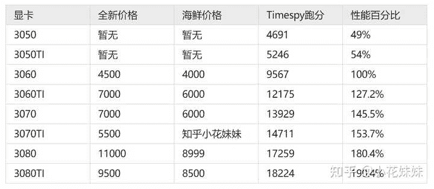

<!--yml
category: 挖矿
date: 2022-06-26 00:00:00
-->

# 21年下半年显卡什么时候能出矿难？

> 原文：[https://www.zhihu.com/question/474174711/answer/2034583783](https://www.zhihu.com/question/474174711/answer/2034583783)

 目前没有原价卡的原因想必大家也知道，因为挖矿。

拿我们的最大众3060来做举例。3060未锁算力版本的算力为48M，锁算力版本为24M。

以今天的价格计算，大约是日收益每算力5毛钱。也就是一张未锁算力每天产出24元，锁算力每天产出12元。

**未锁算力3060：价格4600元（黄鱼价格），每天产出24元，回本周期190天，160天后手里剩一张3060**

**锁算力的3060：价格3999（官方全新），每天产出12元，回本周期333天。**

### 而且最近又出了个RVN让锁算力显卡也能挖了，收益是ETH两倍。

### 3G显存起挖，锁算力显卡的价格估计又要炸了。

| 显卡不锁/锁 | 不锁黄鱼/锁新 | 算力 | 日收益 | 回本周期 |
| 3060 | 4600/3999 | 48/25 | 24/12 | 160/190 |
| 3060TI | 6500/4500 | 60/28 | 30/15 | 216/300 |
| 3070/TI | 7000/6000 | 60/40 | 30/20 | 233/300 |
| 3080 | 9500/8000 | 97/43 | 48/22 | 197/363 |
| 3080TI | 9500 | 61 | 30 | 316 |
| 3090 | 1.4/1.5 | 122 | 60 | 233 |

性能方面看下图就可以了，价格懒得更新

### 总体来说，单卡推荐锁算力3060TI，加卡的话推荐未锁算力3070

如果是纯粹的游戏玩家，纯网游玩家选择3060TI，跑满FPS类的射击游戏完全没有问题。如果想畅快的体验2K大型单机游戏，那么可以提高一点预算上3070TI，基本上属于2K的通吃天花板。但是8G的内存在4K方面略有短板，想怒站4K还是需要考虑目前9500元左右的3080TI。

**注意：非常不推荐不锁算力的3090显卡，因为30系列显卡不锁算力即为矿卡。**

* * *

**挖 矿 专 场**丨[挖矿教程](https://zhuanlan.zhihu.com/p/355955385)丨 [笔本挖矿](https://zhuanlan.zhihu.com/p/360451565)丨[挖矿毁显卡吗](https://zhuanlan.zhihu.com/p/358944242)丨[矿卡也质保](https://zhuanlan.zhihu.com/p/386391253)丨

**锁 算 专 场**丨[锁算卡挖矿](https://zhuanlan.zhihu.com/p/398651881)丨[RVN和ERGO教程](https://zhuanlan.zhihu.com/p/402971584)丨[锁算卡挑选](https://zhuanlan.zhihu.com/p/374342633)丨[挖矿知识点合集](https://www.zhihu.com/question/461044682/answer/1994951468)

**笔记本专场**丨[满血版笔记本怎么挑](https://zhuanlan.zhihu.com/p/374748213)丨[买3060还是70本](https://www.zhihu.com/question/447817962/answer/1909204347)丨[蛟龙7测评](https://zhuanlan.zhihu.com/p/369226521)丨