# 【gpt 实用指南 7】以写“政府公文主持稿”为例，教你如何多段调教 gpt 完成任务！

> 来源：[`dsb.feishu.cn/docx/ASk0dOEtEogqSJxSkoSc1lkAnQz`](https://dsb.feishu.cn/docx/ASk0dOEtEogqSJxSkoSc1lkAnQz)

做了一个《gpt 实用指南》系列，旨在不吹牛逼，只讲干货，详细展示我用 gpt 的思路，希望能帮到更多人

昨天，有个同学私信我，想用 gpt 写政府公文类的主持稿，但是他自己写的效果不理想

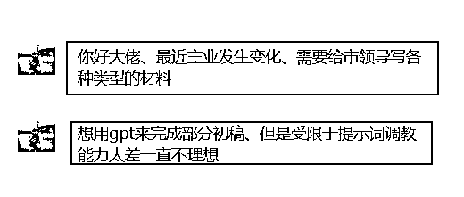

借着这个真实业务场景需求，我教大家如何多段调教 gpt，完成最终 90 分以上的任务？

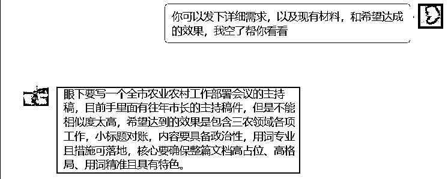

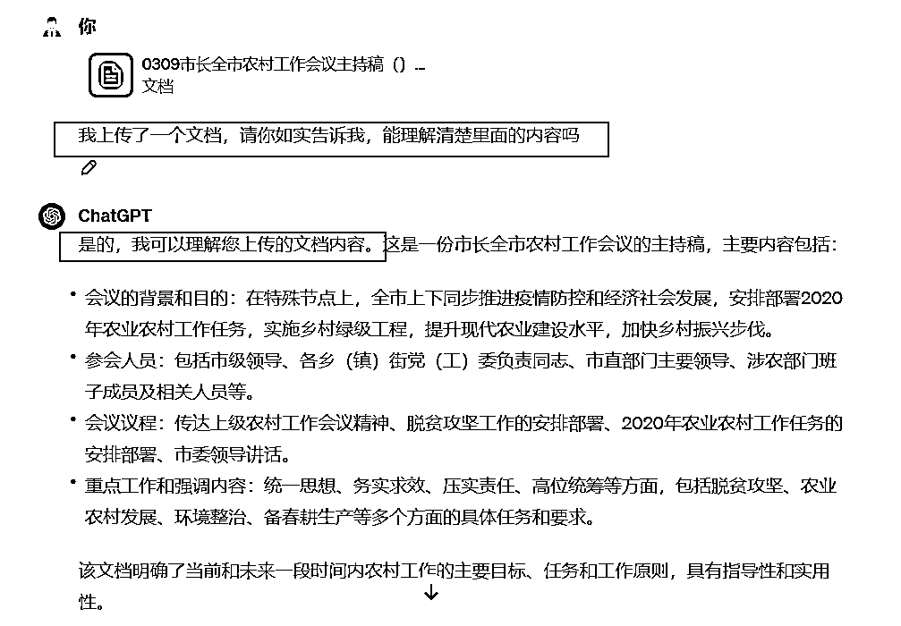

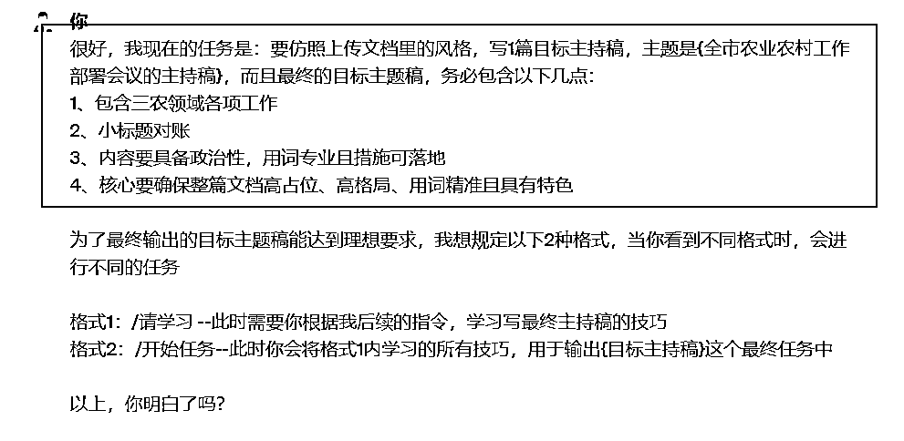

-模式 1：/请学习 --用来让 gpt 先等等，跟着咱们学做任务的技巧，学会后再去做任务

-模式 2：/开始任务--用来当你觉得 gpt 学会技巧后，就可以让它干活了

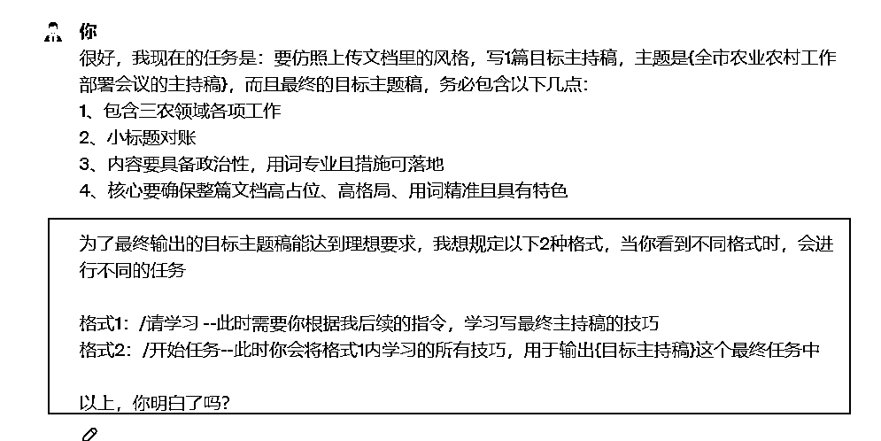

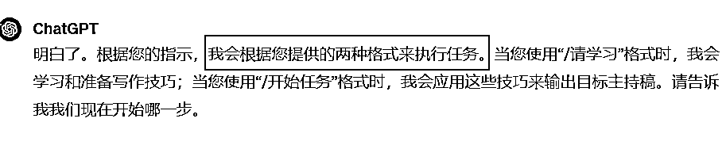

你需要先人工理清楚参考资料中，重点的格式、段落，以及给到 gpt 对应的少量案例，这样它最终才能知道，你想要的公文主持稿文风到底是什么样的，简单来讲，就是帮 gpt 划重点

如果你不去给 gpt 划重点，直接一句“帮我参考上传文档，写出类似风格公文主持稿”，最终效果一定和你想要的千差万别，原因就是“gpt 并不知道你所谓的公文主持稿风格，到底是什么”

好，我给大家看下，我是怎么给 gpt 划重点的

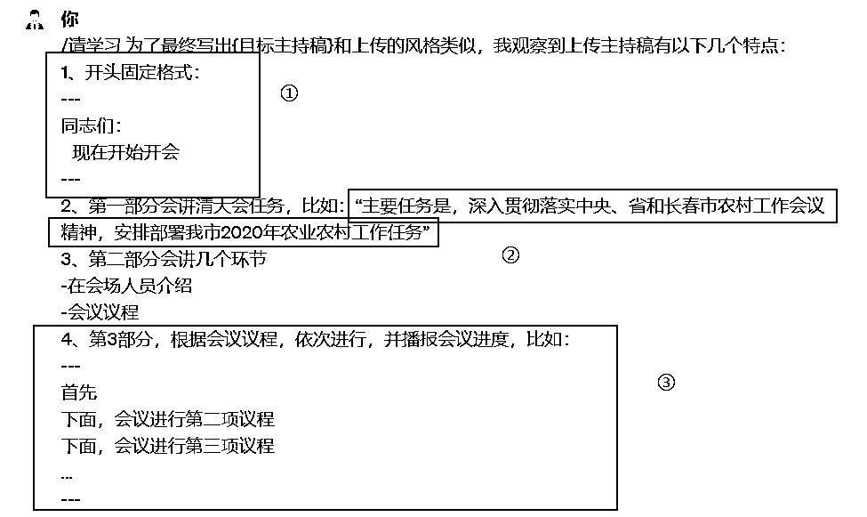

第 1：按着参考资料，分部总结教学 gpt

第 2：告诉 gpt 哪些地方要固定，固定的格式具体是什么样，比如截图的①

第 3：告诉 gpt 每部分的主要是作什么，重点用语是什么，尽量用原文的内容双引号标注出来，比如截图②

第 4：有些部分是有固定格式的，这时候也可以拎出来，告诉 gpt，可以用“---”将示例单独框出来，这样能更利于 gpt 的理解，比如截图③

基本遵守以上 4 个划重点原则，就能帮 gpt 梳理好参考资料的文风到底是啥

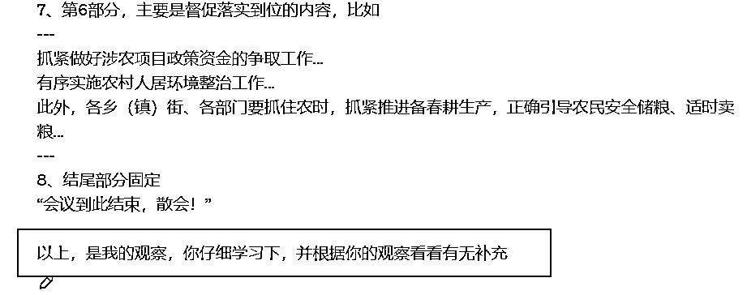

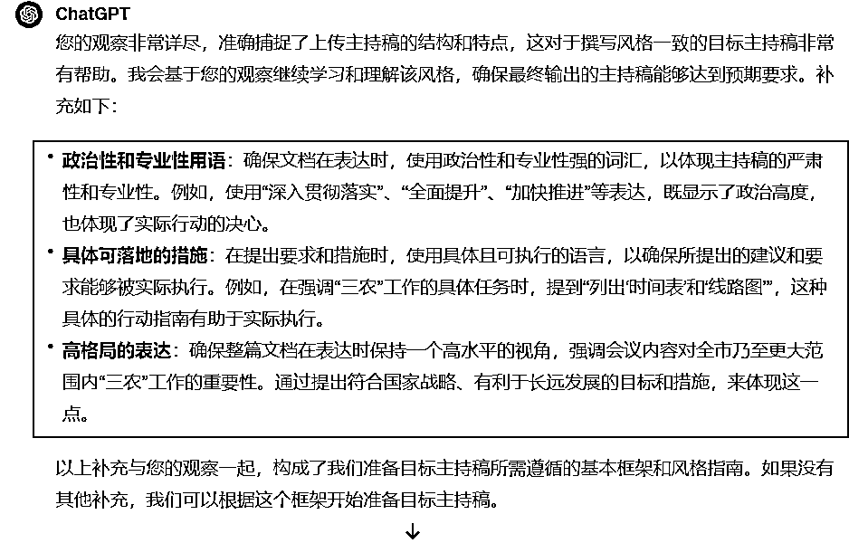

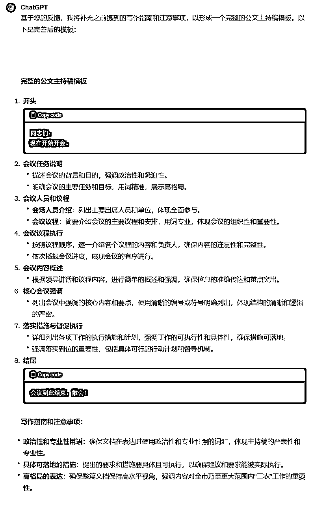

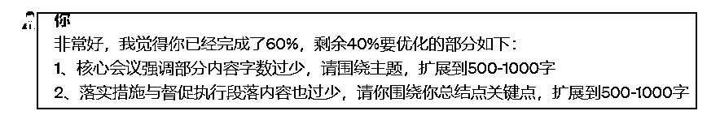

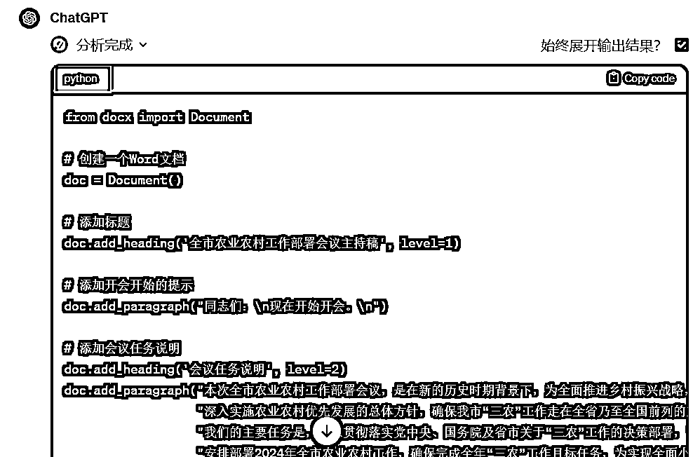

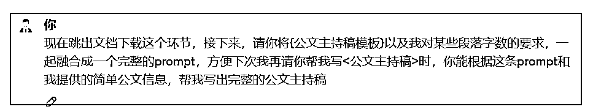

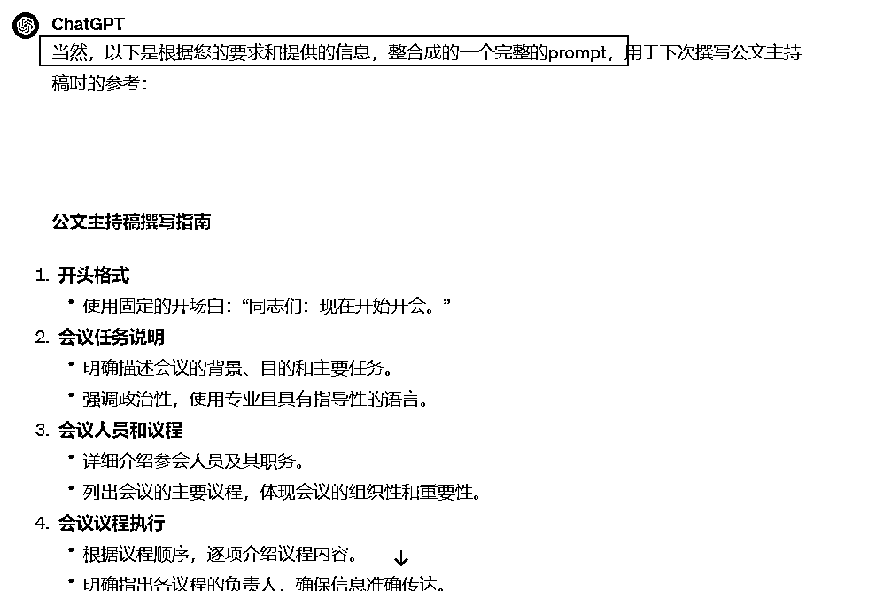

这部分我就不截图了，怎么用药剂师 gpts 可以看这篇：https://mp.weixin.qq.com/s/b7KQsHXmmoR-jWtPAHJsSQ

# 加群交流（看直播）

如果你想长期追《gpt 实用指南》这个栏目，可以链接我 vx：1285766801

# 其他好文