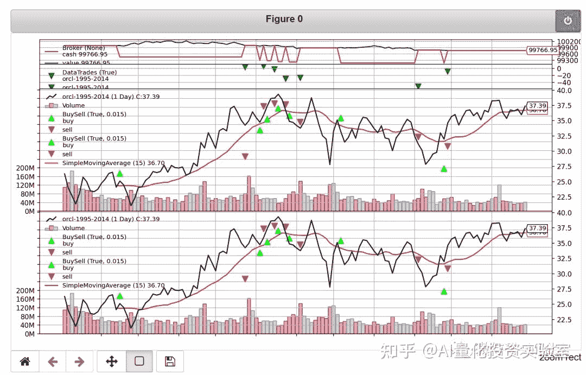
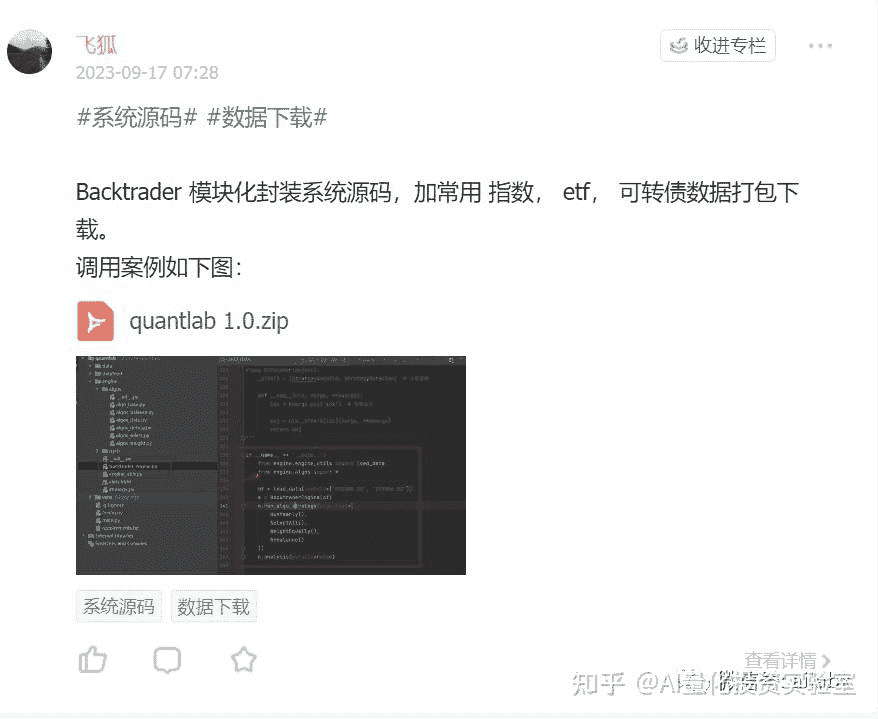
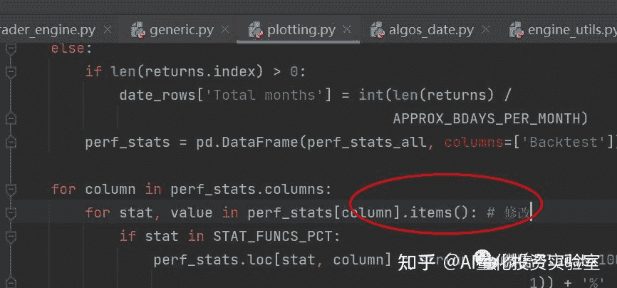
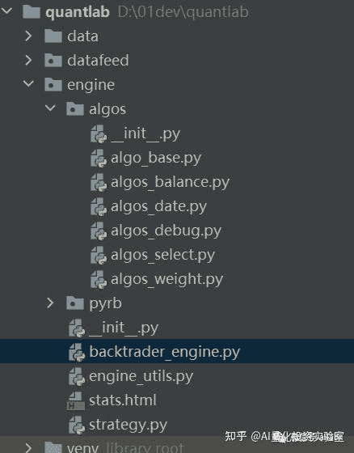

<!--yml
category: 交易
date: 2023-09-17 20:07:20
-->

# Backtrader版本“积木式”AI量化回测系统（全部源代码+数据下载） - 知乎

> 来源：[https://zhuanlan.zhihu.com/p/656717558](https://zhuanlan.zhihu.com/p/656717558)

原创文章第326篇，专注“个人成长与财富自由、世界运作的逻辑与投资"。

去年年底，还是疫情的时候，我们系统的底层引擎就是backtrader。

而且我还试图把**backtrader改造成适合机器学习和强化学习**。后觉得代码不好阅读，改成自己的引擎。

现在想来，越接近实盘，backtrader可以执行的精细化策略尤为重要。

止盈损，做多空等。

当然，经过一年的理解提升，要找回原来的代码，结合这一年的进展，挺容易的。

下面是backtrader的一个封装：



代码已经发布：[【优惠券】知识星球与开源项目：万物之中，希望至美](https://link.zhihu.com/?target=http%3A//mp.weixin.qq.com/s%3F__biz%3DMzIwNTU2ODMwNg%3D%3D%26mid%3D2247489069%26idx%3D2%26sn%3Da64c3ccf90949126c782d927f6b6512e%26chksm%3D972fb670a0583f66b29cbc96017e17f0ef17370263850120dc8d4a5380cfa5bde81a7fa6d1ed%26scene%3D21%23wechat_redirect)



```
# encoding:utf8
from datetime import datetime

import backtrader as bt
import pandas as pd

from datafeed.dataloader import Dataloader
from engine.strategy import StratgeyAlgo

class BacktraderEngine:
    def __init__(self, df_data, init_cash=1000000.0, benchmark='000300.SH', start=datetime(2010, 1, 1),
                 end=datetime.now().date()):
        self.init_cash = init_cash
        self.start = start
        self.end = end
        self.benchmark = benchmark
        cerebro = bt.Cerebro()
        cerebro.broker.setcash(init_cash)

        # 设置手续费
        cerebro.broker.setcommission(0.0001)
        # 滑点：双边各 0.0001
        cerebro.broker.set_slippage_perc(perc=0.0001)

        self.cerebro = cerebro
        self.cerebro.addanalyzer(bt.analyzers.PyFolio, _name='_PyFolio')

        self.df_data = df_data
        self.symbols = list(set(self.df_data['symbol']))
        self._add_symbols_data()

    def _init_analyzers(self):
        '''
        self.cerebro.addanalyzer(bt.analyzers.Returns, _name='_Returns')
        self.cerebro.addanalyzer(bt.analyzers.TradeAnalyzer, _name='_TradeAnalyzer')
        self.cerebro.addanalyzer(bt.analyzers.AnnualReturn, _name='_AnnualReturn')
        self.cerebro.addanalyzer(bt.analyzers.SharpeRatio, riskfreerate=0.0, annualize=True, _name='_SharpeRatio')
        self.cerebro.addanalyzer(bt.analyzers.DrawDown, _name='_DrawDown')
         '''
self.cerebro.addanalyzer(bt.analyzers.PyFolio, _name='_PyFolio')

    def _add_symbols_data(self):
        # 加载数据
        for s in self.symbols:
            df_symbol = self.df_data[self.df_data['symbol'] == s]
            df = to_backtrader_dataframe(df_symbol)
            data = bt.feeds.PandasData(dataname=df, name=s, fromdate=self.start, todate=self.end)

            self.cerebro.adddata(data)
            self.cerebro.addobserver(bt.observers.Benchmark,
                                     data=data)
            self.cerebro.addobserver(bt.observers.TimeReturn)

    def run_algo_strategy(self, algo_list):
        self.cerebro.addstrategy(StratgeyAlgo, algo_list=algo_list, engine=self)
        self.results = self.cerebro.run()

    def _bokeh_plot(self):
        from backtrader_plotting import Bokeh
        from backtrader_plotting.schemes import Tradimo
        plotconfig = {
            'id:ind#0': dict(
                subplot=True,
            ),
        }
        b = Bokeh(style='line', scheme=Tradimo(), plotconfig=plotconfig)
        self.cerebro.plot(b)

    def show_result_empyrical(self, returns):
        import empyrical

        print('累计收益：', round(empyrical.cum_returns_final(returns), 3))
        print('年化收益：', round(empyrical.annual_return(returns), 3))
        print('最大回撤：', round(empyrical.max_drawdown(returns), 3))
        print('夏普比', round(empyrical.sharpe_ratio(returns), 3))
        print('卡玛比', round(empyrical.calmar_ratio(returns), 3))
        print('omega', round(empyrical.omega_ratio(returns)), 3)

    def analysis(self, pyfolio=False):
        portfolio_stats = self.results[0].analyzers.getbyname('_PyFolio')
        returns, positions, transactions, _ = portfolio_stats.get_pf_items()
        returns.index = returns.index.tz_convert(None)
        self.show_result_empyrical(returns)

        if pyfolio:
            from pyfolio.tears import create_full_tear_sheet
            create_full_tear_sheet(returns, positions=positions, transactions=transactions)
        else:
            import quantstats
            # df = self.feed.get_df(self.benchmark)
            # df['rate'] = df['close'].pct_change()
            # df = df[['rate']]
            quantstats.reports.html(returns, download_filename='stats.html', output='stats.html',
                                    title='AI量化平台')
            import webbrowser
            webbrowser.open('stats.html')

        '''

        import pyfolio as pf
        pf.create_full_tear_sheet(
            returns,
            positions=positions,
            transactions=transactions)
        '''
        # self.cerebro.plot(volume=False)

def to_backtrader_dataframe(df):
    df.index = pd.to_datetime(df.index)
    df['openinterest'] = 0
    df = df[['open', 'high', 'low', 'close', 'volume', 'openinterest']]
    for c in ['open', 'high', 'low', 'close']:
        df.loc[:, c] = df[c] / df[c][0]
    return df 
```



根据提示回溯到了**pyfolio里的timeseries.py文件的893行**，将其修改为：

valley = underwater.index[np.argmin(underwater)-1] # end of the period

保存后关闭。

代码下载：[【优惠券】知识星球与开源项目：万物之中，希望至美](https://link.zhihu.com/?target=http%3A//mp.weixin.qq.com/s%3F__biz%3DMzIwNTU2ODMwNg%3D%3D%26mid%3D2247489069%26idx%3D2%26sn%3Da64c3ccf90949126c782d927f6b6512e%26chksm%3D972fb670a0583f66b29cbc96017e17f0ef17370263850120dc8d4a5380cfa5bde81a7fa6d1ed%26scene%3D21%23wechat_redirect)



**吾日三省吾省**

当前面对的都是小事，但是一个很好的提醒。

三体人面对黑暗森林威摄的那60多年里，一是真诚的满足对方；二是让自己随时离得开它。

自由就是选择的权利，努力的意义就是让自己有的选。

对小人对抗，会让自己陷于它的维度，进而变得一样不堪。

正确的做法，加快充实自己的实力，远离消耗你的人，多看一眼它都是你的不对。

你会发现，烂人烂事都会渐渐离你远去。

[年化27.5%：改进版本的趋势交易加RSRS择时](https://link.zhihu.com/?target=http%3A//mp.weixin.qq.com/s%3F__biz%3DMzIwNTU2ODMwNg%3D%3D%26mid%3D2247489069%26idx%3D3%26sn%3D3a7c37cf3158042526d6fe37484d6d78%26chksm%3D972fb670a0583f6655b4551f323a9389d6a78d44006f83f318e7a3118bc89f35b1b4d7951546%26scene%3D21%23wechat_redirect)

[【优惠券】知识星球与开源项目：万物之中，希望至美](https://link.zhihu.com/?target=http%3A//mp.weixin.qq.com/s%3F__biz%3DMzIwNTU2ODMwNg%3D%3D%26mid%3D2247489069%26idx%3D2%26sn%3Da64c3ccf90949126c782d927f6b6512e%26chksm%3D972fb670a0583f66b29cbc96017e17f0ef17370263850120dc8d4a5380cfa5bde81a7fa6d1ed%26scene%3D21%23wechat_redirect)