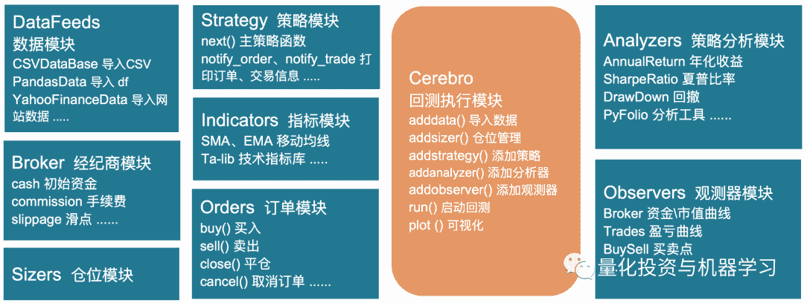
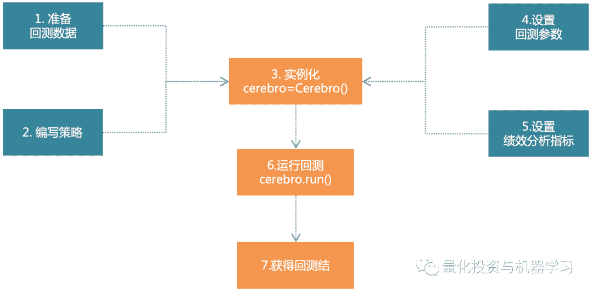
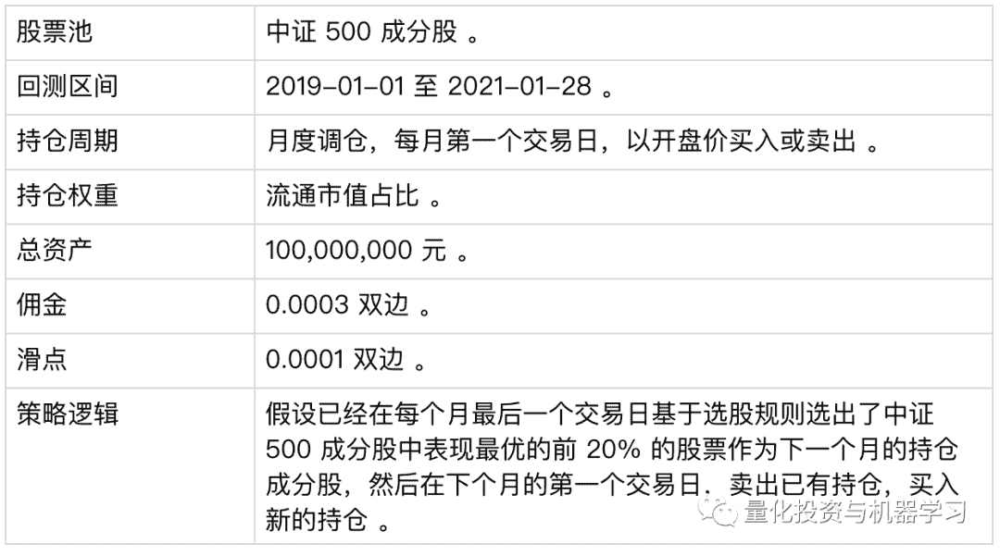

<!--yml
category: 交易
date: 2023-09-17 19:50:12
-->

# Backtrader系列教程①:Backtrader is coming

> 来源：[https://blog.csdn.net/qq_41578115/article/details/122525397](https://blog.csdn.net/qq_41578115/article/details/122525397)

# 

**就选它**

Backtrader 是 2015 年开源的 Python 量化回测框架（支持实盘交易），功能丰富，操作方便灵活：

*   品种多：股票、期货、期权、外汇、数字货币；

*   周期全：Ticks 级、秒级、分钟级、日度、周度、月度、年度；

*   速度快：pandas 矢量运算、多策略并行运算；

*   组件多：内置 Ta-lib 技术指标库、PyFlio 分析模块、plot 绘图模块、参数优化等；

*   超灵活：即可以随意搭配组件，又支持扩展自己开发的功能，想怎么玩就怎么玩；

*   社区活跃、帮助文档齐全，官网：https://www.backtrader.com/。

如果你想在本地通过 Python 尽可能“随心所欲”的进行策略回测和交易，选它！选它！选它！就选它！

Bcaktrader 的安装很简单，不依赖额外的库，除了绘图时依赖的 matplotlib 库（版本要求是 >=1.4.1）：

```
# 若已经安装了 matplotlib ，只需安装 backtrader
pip install backtrader

# 若没有安装 matplotlib，可将其与 backtrader 一起安装
pip install backtrader[plotting]
```

# 

**看图识 Backtrader**

下图是 Bcaktrader 的主要模块，Backtrader 以“大脑”cerebro 为统一的调度中心，数据、策略、回测条件等信息都会导入 cerebro 中，并由 cerebro 启动和完成回测，最后返回回测结果：



Backtrader各模块各司其职，对模块进行灵活的配置可满足绝大部分的回测需求。通常的回测流程如下：

**step 1：构建策略**

*   确定策略潜在的可调参数；

*   计算策略中用于生成交易信号的指标；

*   按需打印交易信息；

*   编写买入、卖出的交易逻辑。

**step 2：实例化策略引擎 cerebro，由 cerebro 来驱动回测**

*   由 DataFeeds 加载数据，再将加载的数据添加给 cerebro；

*   将上一步生成的策略添加给 cerebro；

*   按需添加策略分析指标或观测器；

*   通过运行 cerebro.run() 来启动回测；

*   回测完成后，按需运行 cerebro.plot() 进行回测结果可视化展示。

用一张图总结以上步骤：



 Backtrader 回测代码编写流程如下：

```
import backtrader as bt # 导入 Backtrader
import backtrader.indicators as btind # 导入策略分析模块
import backtrader.feeds as btfeeds # 导入数据模块

# 创建策略
class TestStrategy(bt.Strategy):
    # 可选，设置回测的可变参数：如移动均线的周期
    params = (
        (...,...), # 最后一个“,”最好别删！
    )
    def log(self, txt, dt=None):
        '''可选，构建策略打印日志的函数：可用于打印订单记录或交易记录等'''
        dt = dt or self.datas[0].datetime.date(0)
        print('%s, %s' % (dt.isoformat(), txt))

    def __init__(self):
        '''必选，初始化属性、计算指标等'''
        pass

    def notify_order(self, order):
        '''可选，打印订单信息'''
        pass

    def notify_trade(self, trade):
        '''可选，打印交易信息'''
        pass

    def next(self):
        '''必选，编写交易策略逻辑'''
        sma = btind.SimpleMovingAverage(...) # 计算均线
        pass

# 实例化 cerebro
cerebro = bt.Cerebro()
# 通过 feeds 读取数据
data = btfeeds.BacktraderCSVData(...)
# 将数据传递给 “大脑”
cerebro.adddata(data)
# 通过经纪商设置初始资金
cerebro.broker.setcash(...)
# 设置单笔交易的数量
cerebro.addsizer(...)
# 设置交易佣金
cerebro.broker.setcommission(...)
# 添加策略
cerebro.addstrategy(TestStrategy)
# 添加策略分析指标
cerebro.addanalyzer(...)
# 添加观测器
cerebro.addobserver(...)
# 启动回测
cerebro.run()
# 可视化回测结果
cerebro.plot()
```

# 

**牛刀小试**

**策略说明**

下面就参照上面的模板，一步步教大家如何用 Backtrader 进行选股回测 。本文省去了选股过程，直接提供最终的选股结果，然后对选股结果做回测，具体的回测条件如下：



## 

**数据说明**

测试用到 2 个数据集，一个是日度历史行情数据，另一个是最终的选股结果数据集 。

**1、日度行情数据集**

### 

测试用的数据集 daily_price.csv 对应的是 510 只股票各自从 2019-01-02 至 2021-01-28 的日度行情数据（后复权），共有 8 个字段，除 sec_code 字段外，其余 7 个字段是 Data Feeds 导入 DataFrame 数据时默认必须包含的字段：

```
daily_price = pd.read_csv("daily_price.csv", parse_dates=['datetime'])
daily_price
        datetime sec_code open high low close volume openinterest
0         2019-01-02    600466.SH 33.064891    33.496709  31.954503   32.386321   10629352    0
1         2019-01-02    603228.SH 50.660230    51.458513  50.394136   51.120778   426147  0
2         2019-01-02    600315.SH 148.258423 150.480132   148.258423 149.558935   2138556 0
3         2019-01-02    000750.SZ 49.512579    53.154883  48.715825   51.561375   227557612   0
...     ... ... ... ... ... ... ... ...
255968  2021-01-28  300558.SZ 134.155888 137.600704   130.700970  131.569750  5330301 0
255969  2021-01-28  600171.SH 39.774873    39.830040  38.864630   38.947380   12354183    0
255970  2021-01-28  600597.SH 47.190201    49.243025  46.250355   46.423484   32409940    0
255971  2021-01-28  600584.SH 204.725839 210.226650   199.225028  199.799026  68831481    0
255972 rows × 8 columns
```

### 

**2、月末调仓成分股数据集**

测试用的数据集 trade_info.csv 就是最终的选股结果，共包含 3 个字段：trade_date 调仓期（每月最后一个交易日）、sec_code 持仓成分股代码、weight 持仓权重 。

```
trade_info = pd.read_csv("trade_info.csv", parse_dates=['trade_date'])
trade_info
            trade_date sec_code weight
0           2019-01-31  000006.SZ 0.007282
1           2019-01-31  000008.SZ 0.009783
2           2019-01-31  000025.SZ 0.006928
3           2019-01-31  000090.SZ 0.007234
...     ... ... ...
2491    2021-01-28  603737.SH 0.019291
2492    2021-01-28  603816.SH 0.022646
2493    2021-01-28  603866.SH 0.018611
2494    2021-01-28  688088.SH 0.007600
2495 rows × 3 columns
```

## 

**3、导入 backtrader，构建“大脑”**

导入 backtrader 时，约定俗成的将其缩写为 bt 。由于回测用到的各种原材料都是需要被添加给“大脑” cerebro的，所以最开始可以先实例化大脑：

```
import backtrader as bt # 导入 Backtrader

# 实例化 cerebro
cerebro = bt.Cerebro()
```

如果没啥感觉，可以运行如下代码小试一下，若返回下面的结果，恭喜你！成功完成一个“空”回测 ~ 

```
import backtrader as bt # 导入 Backtrader

# 实例化 cerebro
cerebro = bt.Cerebro()
# 打印初始资金
print('Starting Portfolio Value: %.2f' % cerebro.broker.getvalue())
# 启动回测
cerebro.run()
# 打印回测完成后的资金
print('Final Portfolio Value: %.2f' % cerebro.broker.getvalue())
Starting Portfolio Value: 10000.00
Final Portfolio Value: 10000.00
```

**4、如何导入多只股票的历史行情数据？**

Backtrader 通过 DataFeeds 模块来导入各式各样的数据。由于读取 daily_price.csv 文件后就生成了 DataFrame 表格，所以选用 DataFeeds 的 PandasData() 方法来导入，导入的 DataFrame 有默认的格式要求：

*   以交易日 'datetime' 为 index

*   列为

    'open'、'high'、'low'、'close'、'volume'、'openinterest' 字段 

该如何导入本次回测用到的 510 只股票的数据，并让 Backtrader 知道这是哪只股票的数据？我们采用的是循环导入的方式，每次循环导入一只股票的数据并将数据名称命名为股票名，如下所示：

```
# 按股票代码，依次循环传入数据
for stock in daily_price['sec_code'].unique():
    # 日期对齐
    data = pd.DataFrame(index=daily_price.index.unique()) # 获取回测区间内所有交易日
    df = daily_price.query(f"sec_code=='{stock}'")[['open','high','low','close','volume','openinterest']]
    data_ = pd.merge(data, df, left_index=True, right_index=True, how='left')
    # 缺失值处理：日期对齐时会使得有些交易日的数据为空，所以需要对缺失数据进行填充
    data_.loc[:,['volume','openinterest']] = data_.loc[:,['volume','openinterest']].fillna(0)
    data_.loc[:,['open','high','low','close']] = data_.loc[:,['open','high','low','close']].fillna(method='pad')
    data_.loc[:,['open','high','low','close']] = data_.loc[:,['open','high','low','close']].fillna(0)
    # 导入数据
    datafeed = bt.feeds.PandasData(dataname=data_, fromdate=datetime.datetime(2019,1,2), todate=datetime.datetime(2021,1,28))
    cerebro.adddata(datafeed, name=stock) # 通过 name 实现数据集与股票的一一对应
    print(f"{stock} Done !")
```

在导入多只股票数据时需注意以下细节：

**▪ 各股交易日不统一**：上市日期不一致、退市日期不一致、回测区间内出现停牌等，都会使得不同股票各自的交易日数量不统一，所以要以回测区间内所有交易日为基础，对每只股票缺失的交易日进行补齐；

**▪ 行情数据缺失：**在补齐交易日过程中，会使得补充的交易日缺失行情数据，需对缺失数据进行填充。比如将缺失的 volume 填充为 0，表示股票无法交易的状态；将缺失的高开低收做前向填充；将上市前缺失的高开低收填充为 0 等；

**▪ 股票与行情数据的匹配：**通过设置 adddata() 方法中 name 参数，来实现数据集与股票的一 一对应关系。

## 

**5、如何配置回测条件？**

Backtrader 通过 Broker 模块来模拟证券交易中的“经纪商”角色（比如大家熟悉的证券公司），所以像初始资金、手续费等与经纪商相关的各种信息是通过 Broker 模块来配置的：

```
# 初始资金 100,000,000
cerebro.broker.setcash(100000000.0)
# 佣金，双边各 0.0003
cerebro.broker.setcommission(commission=0.0003)
# 滑点：双边各 0.0001
cerebro.broker.set_slippage_perc(perc=0.0001)
```

此外，还可以通过 analyzers 策略分析模块和 observers 观测器模块提前配置好要返回的回测结果，比如想要返回策略的收益率序列、常规的策略评价指标，就可以提前将指标添加给大脑：

```
cerebro.addanalyzer(bt.analyzers.TimeReturn, _name='pnl') # 返回收益率时序数据
cerebro.addanalyzer(bt.analyzers.AnnualReturn, _name='_AnnualReturn') # 年化收益率
cerebro.addanalyzer(bt.analyzers.SharpeRatio, _name='_SharpeRatio') # 夏普比率
cerebro.addanalyzer(bt.analyzers.DrawDown, _name='_DrawDown') # 回撤
```

**6、如何编写交易策略？**

所有的交易策略都是写在自定义的策略类里，如下面的 TestStrategy 类，自定义的策略类名称可以任意取，但必须继承 Backtrader 内置的 Strategy 类，即 bt.Strategy 。相当于是给大家提供了一个策略接口，大家只需调用这个接口，专心编写自己的策略，而无需关心接口的具体内容。

class TestStrategy(bt.Strategy):  # 类的名字可以随意取

那如何基于 trade_info.csv 的调仓信息在构建的 TestStrategy 里实现买卖操作呢？在TestStrategy 里至少需要定义 __init__() 和 next() 方法。其中， __init__() 用于初始化各类属性，next() 用于下单交易，如下所示：

```
# 通过继承 Strategy 基类，来构建自己的交易策略子类
class MyStrategy(bt.Strategy):
    # 定义我们自己写的这个 MyStrategy 类的专有属性
    def __init__(self):
        '''必选，策略中各类指标的批量计算或是批量生成交易信号都可以写在这里'''
        pass
    # 构建交易函数: 策略交易的主体部分
    def next(self):
        '''必选，在这里根据交易信号进行买卖下单操作'''
        pass
```

具体到选股策略：1\. trade_info.csv 里的调仓日和持仓列表就可以定义在 __init__() 里，方便 next() 函数调用；2\. 在 next() 里，判断每个交易日是否为调仓日，如果是调仓日就按调仓权重卖出旧股，买入新股。具体代码如下：

```
# 回测策略
class TestStrategy(bt.Strategy):
    '''选股策略'''
    def __init__(self):
        self.buy_stock = trade_info # 保留调仓列表
        # 读取调仓日期，即每月的最后一个交易日，回测时，会在这一天下单，然后在下一个交易日，以开盘价买入
        self.trade_dates = pd.to_datetime(self.buy_stock['trade_date'].unique()).tolist()
        self.order_list = [] # 记录以往订单，方便调仓日对未完成订单做处理
        self.buy_stocks_pre = [] # 记录上一期持仓
    def next(self):
        dt = self.datas[0].datetime.date(0) # 获取当前的回测时间点
        # 如果是调仓日，则进行调仓操作
        if dt in self.trade_dates:
            print("--------------{} 为调仓日----------".format(dt))
            # 在调仓之前，取消之前所下的没成交也未到期的订单
            if len(self.order_list) > 0:
                for od in self.order_list:
                    self.cancel(od) # 如果订单未完成，则撤销订单
                self.order_list = [] #重置订单列表
            # 提取当前调仓日的持仓列表
            buy_stocks_data = self.buy_stock.query(f"trade_date=='{dt}'")
            long_list = buy_stocks_data['sec_code'].tolist()
            print('long_list', long_list) # 打印持仓列表
            # 对现有持仓中，调仓后不再继续持有的股票进行卖出平仓
            sell_stock = [i for i in self.buy_stocks_pre if i not in long_list]
            print('sell_stock', sell_stock) # 打印平仓列表
            if len(sell_stock) > 0:
                print("-----------对不再持有的股票进行平仓--------------")
                for stock in sell_stock:
                    data = self.getdatabyname(stock)
                    if self.getposition(data).size > 0 :
                        od = self.close(data=data)
                        self.order_list.append(od) # 记录卖出订单
            # 买入此次调仓的股票：多退少补原则
            print("-----------买入此次调仓期的股票--------------")
            for stock in long_list:
                w = buy_stocks_data.query(f"sec_code=='{stock}'")['weight'].iloc[0] # 提取持仓权重
                data = self.getdatabyname(stock)
                order = self.order_target_percent(data=data, target=w*0.95) # 为减少可用资金不足的情况，留 5% 的现金做备用
                self.order_list.append(order)

            self.buy_stocks_pre = long_list # 保存此次调仓的股票列表

# 将编写的策略添加给大脑，别忘了 ！
cerebro.addstrategy(TestStrategy)
```

策略细节说明：

1、__init__() 函数在回测过程中只会在最开始的时候调用一次，而 next() 会每个交易日依次循环调用多次；

2、为了提高回测效率，对于策略用到的辅助数据、一次性就能计算完成的指标等，都建议在 __init__() 里生成或计算；对于复杂的选股策略，建议参考本文的方式，事先确定好调仓日期、成分、权重，再将结果导入 Backtrader 做回测；

3、Backtrader 默认情况下是：在 t 日运行下单函数，然后在  t+1 日以开盘价成交；

4、交易函数说明：

*   self.close() 平仓；

*   self.buy() 买入、做多；

*   self.sell() 卖出、做空；

*   self.cancel() 取消订单；

*   self.order_target_percent() 按持仓百分比下单，“多退少补”原则， 对于股票当前无持仓或持有的是多单（size>=0）的情况，若目标占比 target > 当前持仓占比，买入不够的部分；若目标占比 target < 当前持仓占比，卖出多余的部分。

## 

**7、如何打印回测日志？**

在 TestStrategy 里还可以定义许多打印日志的函数，常用的有 notify_order() 订单日志、notify_trade() 交易日志、notify_cashvalue() 资金信息、notify_store() 交易事件说明等等。比如再往上面的 TestStrategy 里添加 notify_order() ，用于打印具体的订单信息：

```
def notify_order(self, order):
    # 未被处理的订单
    if order.status in [order.Submitted, order.Accepted]:
        return
    # 已经处理的订单
    if order.status in [order.Completed, order.Canceled, order.Margin]:
        if order.isbuy():
            self.log(
                    'BUY EXECUTED, ref:%.0f，Price: %.2f, Cost: %.2f, Comm %.2f, Size: %.2f, Stock: %s' %
                    (order.ref, # 订单编号
                     order.executed.price, # 成交价
                     order.executed.value, # 成交额
                     order.executed.comm, # 佣金
                     order.executed.size, # 成交量
                     order.data._name)） # 股票名称
        else: # Sell
            self.log('SELL EXECUTED, ref:%.0f, Price: %.2f, Cost: %.2f, Comm %.2f, Size: %.2f, Stock: %s' %
                        (order.ref,
                         order.executed.price,
                         order.executed.value,
                         order.executed.comm,
                         order.executed.size,
                         order.data._name))
```

打印的部分日志信息如下：

```
2019-02-01, BUY EXECUTED, ref:1，Price: 177.31, Cost: 697180.74, Comm 209.15, Size: 3932.00, Stock: 000006.SZ
2019-02-01, BUY EXECUTED, ref:2，Price: 81.76, Cost: 937090.98, Comm 281.13, Size: 11462.00, Stock: 000008.SZ
2019-02-01, BUY EXECUTED, ref:3，Price: 46.15, Cost: 662750.37, Comm 198.83, Size: 14360.00, Stock: 000025.SZ
2019-02-01, BUY EXECUTED, ref:4，Price: 25.11, Cost: 691557.36, Comm 207.47, Size: 27536.00, Stock: 000090.SZ
2019-02-01, BUY EXECUTED, ref:5，Price: 6.13, Cost: 333978.23, Comm 100.19, Size: 54439.00, Stock: 000536.SZ
2019-02-01, BUY EXECUTED, ref:6，Price: 30.00, Cost: 286969.07, Comm 86.09, Size: 9567.00, Stock: 000587.SZ
2019-02-01, BUY EXECUTED, ref:7，Price: 103.05, Cost: 1263876.16, Comm 379.16, Size: 12265.00, Stock: 000598.SZ
2019-02-01, BUY EXECUTED, ref:8，Price: 36.84, Cost: 451202.22, Comm 135.36, Size: 12247.00, Stock: 000612.SZ
2019-02-01, BUY EXECUTED, ref:9，Price: 172.78, Cost: 891370.87, Comm 267.41, Size: 5159.00, Stock: 000636.SZ
```

**8、如何提取回测结果？**

想要提取回测结果，首先要确保已经启动并完成回测，然后再从返回的 result 中提取事先配置好的回测结果：

```
# 启动回测
result = cerebro.run()
# 从返回的 result 中提取回测结果
strat = result[0]
# 返回日度收益率序列
daily_return = pd.Series(strat.analyzers.pnl.get_analysis())
# 打印评价指标
print("--------------- AnnualReturn -----------------")
print(strat.analyzers._AnnualReturn.get_analysis())
print("--------------- SharpeRatio -----------------")
print(strat.analyzers._SharpeRatio.get_analysis())
print("--------------- DrawDown -----------------")
print(strat.analyzers._DrawDown.get_analysis())
```

最终打印出来的原始结果如下所示，也可以按需对结果的数据结果做进一步的处理：

```
--------------- AnnualReturn -----------------
OrderedDict([(2019, 0.2421668400755459), (2020, 0.21542275632539853), (2021, 0.017567210073598405)])
--------------- SharpeRatio -----------------
OrderedDict([('sharperatio', 1.5512121051534207)])
--------------- DrawDown -----------------
AutoOrderedDict([('len', 136), ('drawdown', 6.655064560818994), ('moneydown', 10952970.349310666), ('max', AutoOrderedDict([('len', 206), ('drawdown', 20.374812759676267), ('moneydown', 27705182.493407518)]))])
```

本文先是整体介绍了 Backtrader 的功能和主要模块，然后教大家用 Backtrader 实现了一个简单的选股回测流程：

**导入 Backtrader → 实例化大脑 → 导入数据 → 配置回测条件 → 编写交易逻辑 → 打印日志 → 运行回测 → 提取回测结果 **

其实 Backtrader 的功能远不止这些，还有很多功能没有提及，也有很多细节未做深入讲解。如何可视化回测结果？如何对各模块的配置做修改？Backtrader 的数据调用规则是什么？支持的订单类型有哪些？订单撮合逻辑是怎样的？如何实现多策略回测？如何进行参数调优？如何对接实盘交易？...... 想要熟练的使用 Backtrader，还有很多内容要学。

最后问问自己：**我打算放弃了么？放弃吧 ~ 不！放弃吧 ~ 不！放弃吧 ~ 不！**