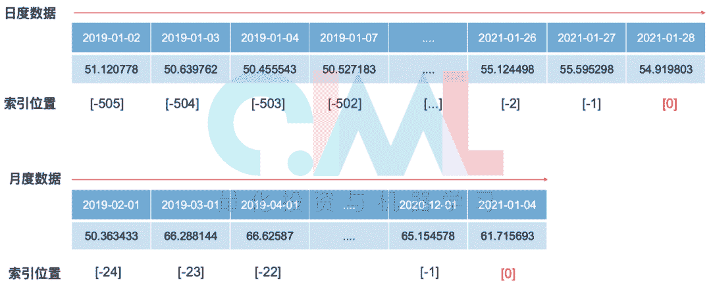
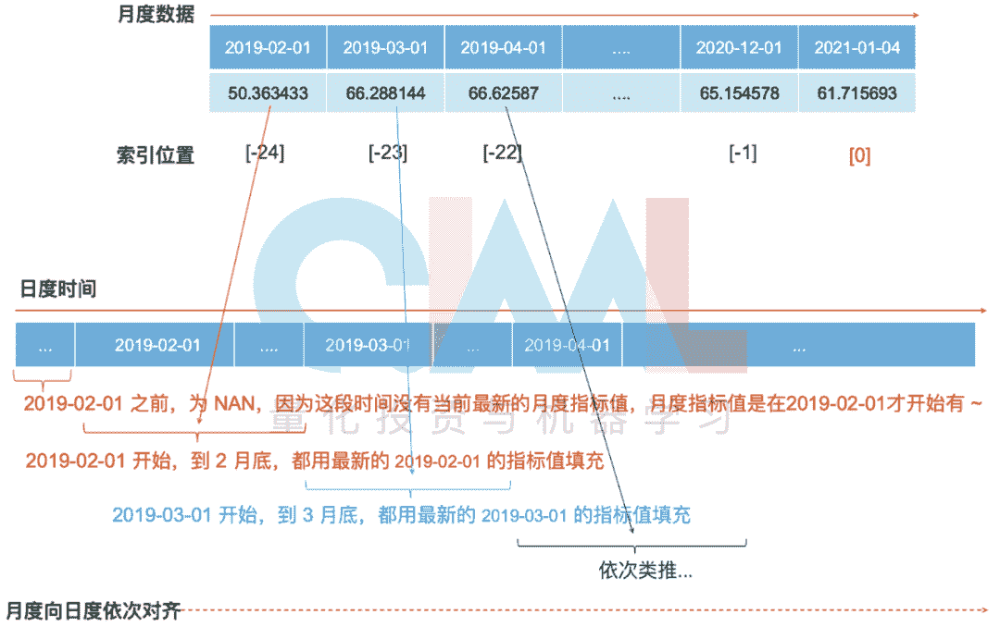

<!--yml
category: 交易
date: 2023-09-17 19:49:52
-->

# Backtrader系列教程③:指标篇

> 来源：[https://blog.csdn.net/qq_41578115/article/details/122529588](https://blog.csdn.net/qq_41578115/article/details/122529588)

**概述**

在编写策略时，除了常规的高开低收成交量等行情数据外，还会用到各式各样的指标（变量），比如宏观经济指标、基本面分析指标、技术分析指标、另类数据等等。Backtrader 大致有 2 种获取指标的方式：

1、直接通过 DataFeeds 模块导入**已经计算好**的指标，比如《数据篇》中的导入新增指标 PE、PB；

2、在编写策略时调用 Indicators 指标模块**临时计算**指标，比如 5 日均线、布林带等 。

对于第 1 种直接导入的方式，大家只需掌握[《数据篇》](http://mp.weixin.qq.com/s?__biz=MzAxNTc0Mjg0Mg==&mid=2653315933&idx=1&sn=0b3e71d4bf59da67d837907e05aef8cb&chksm=802da148b75a285e3aa180a23132873646bf356191befc88831639146c68027ae4ab740a5e18&scene=21#wechat_redirect "《数据篇》")中“DataFeeds 数据模块 ~ 新增指标”的内容即可；而今天的《指标篇》主要针对第 2 种临时计算指标的方式，重点介绍 Indicators 指标模块的用法。Indicators 也是一个技术分析指标模块，与大家熟悉的 TA-Lib 库类似 。

**写在最前面**

在展开介绍 Indicators 各式各样的技术分析指标之前，先提前说明指标计算和指标使用时会涉及到的几个注意点。因为重要，所以将这部分内容写在了最前面～ 

**哪些地方会用到指标 ？**

回顾一下 Backtrader 的主要功能模块和回测流程（见：[Backtrader 来了！](http://mp.weixin.qq.com/s?__biz=MzAxNTc0Mjg0Mg==&mid=2653315531&idx=1&sn=f003da3d862e1a13349a10e006c5e748&chksm=802da3deb75a2ac85f3c3a6164f96303b70c12d14293f59fddf9a38c39a89bf4927b90b9e9c6&scene=21#wechat_redirect "Backtrader 来了！")）可以发现，只有在编写策略Strategy 时才会涉及到指标的计算和使用，而且是 Strategy 中的 __init__() 和 next() 方法涉及的最多。

**建议在 __init__() 中提前计算指标**

Strategy 中的 __init__() 函数在回测过程中只会在最开始的时候调用一次，而 next() 会每个交易日依次循环调用多次，所以为了提高回测效率，建议先在 __init__() 中一次性计算好指标（甚至是交易信号），然后在 next() 中调用已经算好的指标，这样能有效避免指标的重复计算，提高回测运行速度。建议遵循“__init__() 负责指标计算，next() 负责指标调用”的原则。

```
import backtrader.indicators as btind # 导入策略分析模块

class MyStrategy(bt.Strategy):
  # 先在 __init__ 中提前算好指标
    def __init__(self):
        sma1 = btind.SimpleMovingAverage(self.data)
        ema1 = btind.ExponentialMovingAverage()
        close_over_sma = self.data.close > sma1
        close_over_ema = self.data.close > ema1
        sma_ema_diff = sma1 - ema1
        # 生成交易信号
        buy_sig = bt.And(close_over_sma, close_over_ema, sma_ema_diff > 0)
    # 在 next 中直接调用计算好的指标
    def next(self):
        if buy_sig:
            self.buy()
```

**关于 Indicators 返回的指标对象**

上一篇[《数据篇》](http://mp.weixin.qq.com/s?__biz=MzAxNTc0Mjg0Mg==&mid=2653315933&idx=1&sn=0b3e71d4bf59da67d837907e05aef8cb&chksm=802da148b75a285e3aa180a23132873646bf356191befc88831639146c68027ae4ab740a5e18&scene=21#wechat_redirect "《数据篇》")介绍 Data Feed 数据馈送对象和 Lines 线属性时有提到“Data Feed 对象无处不在，除了典型的 self.datas 外，Indicators 计算返回的指标对象也属于 Data Feed 对象，包含 Lines 线属性”，所以[《数据篇》](http://mp.weixin.qq.com/s?__biz=MzAxNTc0Mjg0Mg==&mid=2653315933&idx=1&sn=0b3e71d4bf59da67d837907e05aef8cb&chksm=802da148b75a285e3aa180a23132873646bf356191befc88831639146c68027ae4ab740a5e18&scene=21#wechat_redirect "《数据篇》")中提到的关于 Data Feed 对象和 Lines 线属性的操作规则同样适用于指标对象。对于上面的例子，计算得到的简单移动均线 sma1 和指数移动均线 ema1 都是含 lines 对象，指标与指标之间运算返回的新指标 close_over_sma、close_over_ema、sma_ema_diff 、buy_sig 也是含 lines 对象。

**计算指标时的各种简写形式**

调用 Indicators 模块的函数计算指标时，默认是对 self.datas 数据对象中的第一张表格中的第一条line （默认第一条line是 close line）计算相关指标。以计算 5 日均线为例，各种不同级别的简写方式都是默认基于收盘价 close 计算 5 日均线，所以返回的结果都是一致的：

```
class TestStrategy(bt.Strategy):
    def __init__(self):
        # 最简方式：直接省略指向的数据集
        self.sma1 = btind.SimpleMovingAverage(period=5)
        # 只指定第一个数据表格
        self.sma2 = btind.SMA(self.data, period=5)
        # 指定第一个数据表格的close 线
        self.sma3 = btind.SMA(self.data.close, period=5)
        # 完整写法
        self.sma4 = btind.SMA(self.datas[0].lines[0], period=5)
        # 指标函数也支持简写 SimpleMovingAverage → SMA

    def next(self):
        # 提取当前时间点
        print('datetime', self.datas[0].datetime.date(0))
        # 打印当日、昨日、前日的均线
        print('sma1',self.sma1.get(ago=0, size=3))
        print('sma2',self.sma2.get(ago=0, size=3))
        print('sma3',self.sma3.get(ago=0, size=3))
        print('sma4',self.sma4.get(ago=0, size=3))

cerebro = bt.Cerebro()
st_date = datetime.datetime(2019,1,2)
end_date = datetime.datetime(2021,1,28)
datafeed1 = bt.feeds.PandasData(dataname=data1, fromdate=st_date, todate=end_date)
cerebro.adddata(datafeed1, name='600466.SH')
datafeed2 = bt.feeds.PandasData(dataname=data2, fromdate=st_date, todate=end_date)
cerebro.adddata(datafeed2, name='603228.SH')
cerebro.addstrategy(TestStrategy)
rasult = cerebro.run()

datetime 2019-01-08
sma1 array('d', [nan, nan, 33.015540696])
sma2 array('d', [nan, nan, 33.015540696])
sma3 array('d', [nan, nan, 33.015540696])
sma4 array('d', [nan, nan, 33.015540696])
datetime 2019-01-09
sma1 array('d', [nan, 33.015540696, 33.286968908])
sma2 array('d', [nan, 33.015540696, 33.286968908])
sma3 array('d', [nan, 33.015540696, 33.286968908])
sma4 array('d', [nan, 33.015540696, 33.286968908])
datetime 2019-01-10
sma1 array('d', [33.015540696, 33.286968908, 33.62008535])
sma2 array('d', [33.015540696, 33.286968908, 33.62008535])
sma3 array('d', [33.015540696, 33.286968908, 33.62008535])
sma4 array('d', [33.015540696, 33.286968908, 33.62008535])
datetime 2019-01-11
sma1 array('d', [33.286968908, 33.62008535, 33.546059473999996])
sma2 array('d', [33.286968908, 33.62008535, 33.546059473999996])
sma3 array('d', [33.286968908, 33.62008535, 33.546059473999996])
sma4 array('d', [33.286968908, 33.62008535, 33.546059473999996])
......
```

所以当你遇到类似 ema1 = btind.ExponentialMovingAverage() 的语句时，就应该知道是对 self.datas 数据对象中的第一张表格的第一条 line 进行求均值。

**调用指标时的各种简写形式**

调用指标时会涉及 line 的索引和切片操作，为了使操作更加简便，在 next() 中调用当前时刻指标值时，可以省略索引 [0] ：即在 next() 中，self.sma5[0] ↔ self.sma5、self.data.close[0] ↔ self.data.close 等都是等价的，省略了 [0] 的简写形式 self.sma5 、 self.data.close 等都默认指向当前值，自动索引当前值。

```
class TestStrategy(bt.Strategy):

    def __init__(self):
        self.sma5 = btind.SimpleMovingAverage(period=5) # 5日均线
        self.sma10 = btind.SimpleMovingAverage(period=10) # 10日均线
        self.buy_sig = self.sma5 > self.sma10 # 5日均线上穿10日均线

    def next(self):
        # 提取当前时间点
        print('datetime', self.datas[0].datetime.date(0))
        # 打印当前值
        print('close', self.data.close[0], self.data.close)
        print('sma5', self.sma5[0], self.sma5)
        print('sma10', self.sma10[0], self.sma10)
        print('buy_sig', self.buy_sig[0], self.buy_sig)
        # 比较收盘价与均线的大小
        if self.data.close > self.sma5:
            print('------收盘价上穿5日均线------')
        if self.data.close[0] > self.sma10:
            print('------收盘价上穿10日均线------')
        if self.buy_sig:
            print('------ buy ------')

cerebro = bt.Cerebro()
st_date = datetime.datetime(2019,1,2)
end_date = datetime.datetime(2021,1,28)
datafeed1 = bt.feeds.PandasData(dataname=data1, fromdate=st_date, todate=end_date)
cerebro.adddata(datafeed1, name='600466.SH')
cerebro.addstrategy(TestStrategy)
rasult = cerebro.run()

datetime 2019-01-24
close 32.38632075 <backtrader.linebuffer.LineBuffer object at 0x7fa1676d0e10>
sma5 32.50969721 <backtrader.indicators.sma.SimpleMovingAverage object at 0x7fa1676c2c18>
sma10 32.596060732 <backtrader.indicators.sma.SimpleMovingAverage object at 0x7fa1676b3048>
buy_sig 0.0 <backtrader.linebuffer.LinesOperation object at 0x7fa1676b3400>
sma10-sma5 0.0863635219999992
datetime 2019-01-25
close 33.06489128 <backtrader.linebuffer.LineBuffer object at 0x7fa1676d0e10>
sma5 32.57138544 <backtrader.indicators.sma.SimpleMovingAverage object at 0x7fa1676c2c18>
sma10 32.589891909 <backtrader.indicators.sma.SimpleMovingAverage object at 0x7fa1676b3048>
buy_sig 0.0 <backtrader.linebuffer.LinesOperation object at 0x7fa1676b3400>
sma10-sma5 0.018506469000001857
------收盘价上穿5日均线------
------收盘价上穿10日均线------
datetime 2019-01-28
close 33.86683827 <backtrader.linebuffer.LineBuffer object at 0x7fa1676d0e10>
sma5 32.855151297999996 <backtrader.indicators.sma.SimpleMovingAverage object at 0x7fa1676c2c18>
sma10 32.725606015 <backtrader.indicators.sma.SimpleMovingAverage object at 0x7fa1676b3048>
buy_sig 1.0 <backtrader.linebuffer.LinesOperation object at 0x7fa1676b3400>
sma10-sma5 -0.1295452829999988
------收盘价上穿5日均线------
------收盘价上穿10日均线------
------ buy ------
```

从打印的结果可知，self.sma5 、 self.data.close  本质上还是含线对象，并不是具体的指标值，只不过在 next() 中会自动索引当前时刻的值，进而可以省略 [0]。由此可知，同样的 self.sma5 、 self.data.close 变量在 __init__() 和 next() 中的操作会有所差异，在 __init__() 中侧重于对整条 line 的操作，而在 next() 中侧重于站在当前回测时点，对单个数据点进行操作，所以对索引 [ ] 做了简化。

**好用的运算函数**

在计算指标或编写策略逻辑时，离不开算术运算、关系运算、逻辑运算、条件运算......，为了更好的适用于Backtrader 框架的语法规则，Backtrader 的开发者还对一些常用的运算符做了优化和改进，使用起来更简便高效：

```
class TestStrategy(bt.Strategy):

    def __init__(self):
        self.sma5 = btind.SimpleMovingAverage(period=5) # 5日均线
        self.sma10 = btind.SimpleMovingAverage(period=10) # 10日均线
        # bt.And 中所有条件都满足时返回 1；有一个条件不满足就返回 0
        self.And = bt.And(self.data>self.sma5, self.data>self.sma10, self.sma5>self.sma10)
        # bt.Or 中有一个条件满足时就返回 1；所有条件都不满足时返回 0
        self.Or = bt.Or(self.data>self.sma5, self.data>self.sma10, self.sma5>self.sma10)
        # bt.If(a, b, c) 如果满足条件 a，就返回 b，否则返回 c
        self.If = bt.If(self.data>self.sma5,1000, 5000)
        # bt.All,同 bt.And
        self.All = bt.All(self.data>self.sma5, self.data>self.sma10, self.sma5>self.sma10)
        # bt.Any，同 bt.Or
        self.Any = bt.Any(self.data>self.sma5, self.data>self.sma10, self.sma5>self.sma10)
        # bt.Max，返回同一时刻所有指标中的最大值
        self.Max = bt.Max(self.data, self.sma10, self.sma5)
        # bt.Min，返回同一时刻所有指标中的最小值
        self.Min = bt.Min(self.data, self.sma10, self.sma5)
        # bt.Sum，对同一时刻所有指标进行求和
        self.Sum = bt.Sum(self.data, self.sma10, self.sma5)
        # bt.Cmp(a,b), 如果 a>b ，返回 1；否则返回 -1
        self.Cmp = bt.Cmp(self.data, self.sma5)

    def next(self):
        print('---------- datetime',self.data.datetime.date(0), '------------------')
        print('close:', self.data[0], 'ma5:', self.sma5[0], 'ma10:', self.sma10[0])
        print('close>ma5',self.data>self.sma5, 'close>ma10',self.data>self.sma10, 'ma5>ma10', self.sma5>self.sma10)
        print('self.And', self.And[0], self.data>self.sma5 and self.data>self.sma10 and self.sma5>self.sma10)
        print('self.Or', self.Or[0], self.data>self.sma5 or self.data>self.sma10 or self.sma5>self.sma10)
        print('self.If', self.If[0], 1000 if self.data>self.sma5 else 5000)
        print('self.All',self.All[0], self.data>self.sma5 and self.data>self.sma10 and self.sma5>self.sma10)
        print('self.Any', self.Any[0], self.data>self.sma5 or self.data>self.sma10 or self.sma5>self.sma10)
        print('self.Max',self.Max[0], max([self.data[0], self.sma10[0], self.sma5[0]]))
        print('self.Min', self.Min[0], min([self.data[0], self.sma10[0], self.sma5[0]]))
        print('self.Sum', self.Sum[0], sum([self.data[0], self.sma10[0], self.sma5[0]]))
        print('self.Cmp', self.Cmp[0], 1 if self.data>self.sma5 else -1)

cerebro = bt.Cerebro()
st_date = datetime.datetime(2019,1,2)
ed_date = datetime.datetime(2021,1,28)
datafeed1 = bt.feeds.PandasData(dataname=data1, fromdate=st_date, todate=ed_date)
cerebro.adddata(datafeed1, name='600466.SH')
cerebro.addstrategy(TestStrategy)
rasult = cerebro.run()

---------- datetime 2019-01-15 ------------------
close: 33.06489128 ma5: 33.18826774 ma10: 33.101904218
close>ma5 False close>ma10 False ma5>ma10 True
self.And 0.0 False
self.Or 1.0 True
self.If 5000.0 5000
self.All 0.0 False
self.Any 1.0 True
self.Max 33.18826774 33.18826774
self.Min 33.06489128 33.06489128
self.Sum 99.355063238 99.355063238
self.Cmp -1.0 -1
---------- datetime 2019-01-16 ------------------
close: 32.63307367 ma5: 32.966190112 ma10: 33.12657951
close>ma5 False close>ma10 False ma5>ma10 False
self.And 0.0 False
self.Or 0.0 False
self.If 5000.0 5000
self.All 0.0 False
self.Any 0.0 False
self.Max 33.12657951 33.12657951
self.Min 32.63307367 32.63307367
self.Sum 98.72584329200001 98.72584329200001
self.Cmp -1.0 -1
---------- datetime 2019-01-17 ------------------
......
```

从返回结果可以看出，在 __init__ 中事先通过 bt.And、bt.Or、bt.If、bt.All、bt.Any、bt.Max、bt.Min、bt.Sum 计算返回的结果与在 next() 中对当前时点通过常规 python 运算语法返回的结果是一致的。 __init__ 中 这些函数是基于整条 line 进行运算，返回的结果也是 lines ，能在 next () 中循环调用。以 bt.Max(self.data, self.sma10, self.sma5) 为例，bt.Max 函数会站在 self.data、self.sma10、self.sma5 这 3 条 line 的相同时间节点上求出最大值（各个横截面上求最大值），返回的结果就是由各个时间节点上最大值组成的 line 。

**如何对齐不同周期的指标**

通常情况下，操作的都是相同周期的数据，比如日度行情数据计算返回各类日度指标、周度行情数据计算返回各类周度指标、......，行情数据和指标的周期是一致的，时间也是对齐的。但有时候也会遇到操作不同周期数据的情况，比如拿日度行情与月度指标作比较，日度行情每天都有数据，而月度指标每个月只有一个，2 条数据在时间上是没有对齐的，如下所示：



注：在 Backtrader 中，当前月计算的月度指标是存给下个月第一个交易日的，比如上图月度数据 2019-02-01 的指标值，就是用 1 月份数据计算出来的指标值；2019-03-01 的指标值对应的是 2 月份数据计算出来的指标值等。

可以使用“ ( ) ”语法操作来对齐不同周期的数据，对齐的方向是“大周期向小周期对齐”，可以选择指标对象中的某条 line 进行对齐，也可以对整个指标对象进行对齐。在使用该语法时，要将 cerebro.run() 中的 runonce 设置为 False，才能实现对齐操作：

```
# self.data0 是日度行情、self.data1 是月度行情
self.month = btind.xxx(self.data1) # 计算返回的 self.month 指标也是月度的
# 选择指标对象中的第一条 line 进行对齐
self.sellsignal = self.data0.close < self.month.lines[0]()
# 对齐整个指标对象
self.month_ = self.month()
self.signal = self.data0.close < self.month_.lines[0]

cerebro.run(runonce=False)
```

“ ( ) ”语法类似于线的切片操作 get (ago=-1, size=1)，然后在更细的时间点上始终取当前最新的指标值。比如对于月度指标，向日度对齐时，月中的那些时间点的数据取得是当前最新的数据（即：月初的指标值），直到下个月月初新的指标值计算出来为止：



** 丰富的内置指标**

Indicators 指标模块提供了 140 多个技术分析指标计算函数，大部分指标与 TA-Lib 库里的指标是一致的，各函数的用途、算法、参数、返回的结果等信息可以查阅官网的：*https://www.backtrader.com/docu/indautoref/*，文档对各函数介绍的内容大致分为如下几个部分：

*   Alias：函数别名，如果一个指标函数包含多个别名，那这些名称都可以作为这个函数的函数名，如简单移动均线函数  MovingAverageSimple，别名有 SMA,SimpleMovingAverage，那调用该函数时可以有 3 种写法：

    *   btind.MovingAverageSimple()；

    *   btind.SimpleMovingAverage()；

    *   btind.SMA()。

*   Formula：技术指标算法说明，如 MACD 函数的算法为：

    *   macd = ema(data, me1_period) - ema(data, me2_period)；

    *   signal = ema(macd, signal_period)。

*   Lines：说明函数返回的指标对象中包含哪些 lines，如 MACD 函数返回的指标对象就包含 2 条线：macd 线和 signal 线，可通过 xxxx.lines.macd ↔ xxxx.macd 、xxxx.lines.signal ↔ xxxx.signal 的形式调用具体的线，‘.lines’ 有时可以省略。

*   Params：指标函数可以设置的参数，如移动均线 MovingAverageSimple 包含一个参数：period (30)，括号里是该参数的默认值，默认情况下是计算 30 日均值。

*   PlotInfo：绘制指标时，支持设置的图形参数，常用绘图参数有：

    *   plot = True，是否显示这个指标值，True的显示，False不显示 ；       

    *   subplot = True，是否把指标显示到另一个窗口，True显示到另一个窗口，False显示在主图； 

    *   plotname = ""， 显示 line 的名称，默认是 class.__name__； 

    *   plotabove = False， 指标绘制的位置，False 指标画在主图下方，True 指标画在主图上方； 

    *   plotlinelabels = False，False 显示的是指标函数的名称，True 显示指标线的名称； 

    *   plotymargin=0.0，画图的时候距离顶部和底部的距离； 

    *   plotyticks=[ ]， y 轴刻度范围，取值为空列表时会自动计算；

    *   plothlines=[ ]，用于绘制水平线；

    *   plotyhlines=[ ]，用同一个参数，控制 plotyticks 和 plothlines 的取值；

    *   plotforce=False，如果该绘制的指标没有被绘制，就将 plotforce 设置为 True 进行 强制绘图。

    *   PlotLines：绘制的曲线样式 。

结合上述的解释，就可以通过官方帮助文档查阅各函数的用法了，后期的《可视化篇》会重点介绍如何绘制指标 。

**在 Backtrader 中调用 TA-Lib 库**

为了满足大家的使用习惯，Backtrader 还接入了 TA-Lib 技术指标库，具体信息可以查阅官方 document ：*https://www.backtrader.com/docu/talibindautoref/* ，文档中同样对各个函数的输入、输出，以及在 Backtrader 中特有的绘图参数、返回的 lines 属性等信息都做了介绍和说明。TA-Lib 指标函数的调用形式为 bt.talib.xxx ：

```
class TALibStrategy(bt.Strategy):
    def __init__(self):
        # 计算 5 日均线
        bt.talib.SMA(self.data.close, timeperiod=5)
        bt.indicators.SMA(self.data, period=5)
        # 计算布林带
        bt.talib.BBANDS(self.data, timeperiod=25)
        bt.indicators.BollingerBands(self.data, period=25)
```

**自定义新指标**

在 Backtrader 中，如果涉及到自定义操作，一般都是通过继承原始的父类，然后在新的子类里自定义属性，比如之前介绍的自定义数据读取函数 class My_CSVData (bt.feeds.GenericCSVData)，就是继承了原始GenericCSVData 类，自定义新指标也类似，需要继承原始的 bt.Indicator 类，然后在新的子类里构建指标。新的子类里通常可以设置如下属性：

*   lines = ('xxx', 'xxx', 'xxx',)：定义指标函数返回的 lines 名称，方便后面通过名称调用具体的指标，如 self.lines.xxx、self.l.xxx、self.xxx；

*   params = (('xxx', n),)：定义参数，方便在子类里全局调用，也方便在使用指标函数时修改参数取值；

*   __init__() 方法：同策略 Strategy 里的 __init__() 类似，对整条 line 进行运算，运算结果也以整条 line 的形式返回；

*   next() 方法：同策略 Strategy 里的 next() 类似，每个 bar 都会运行一次，在 next() 中是对数据点进行运算；

*   once() 方法：这个方法只运行一次，但是需要从头到尾循环计算指标；

*   指标绘图相关属性的设置：例如：plotinfo = dict() 通过字典形式修改绘图参数；plotlines = dict() 设置曲线样式 等等，指标绘制相关内容会在后期的《可视化篇》进行重点讲解。

    ```
    class MyInd(bt.Indicator):
        lines = (xxx,xxx, ) # 最后一个 “,” 别省略
        params = ((xxx, n),) # 最后一个 “,” 别省略

        def __init__(self):
            '''可选'''
            pass

        def next(self):
            '''可选'''
            pass

        def once(self):
            '''可选'''
            pass 

        plotinfo = dict(...)
        plotlines = dict(...)
    ```

    下面的伪例子，可以比较在 __init__()、next()、once() 中计算指标的区别：

*   __init__() 中是对 line 进行运算，最终也以 line 的形式返回，所以运算结果直接赋值给了 self.l.dummyline；

*   next() 中是对当前时刻的数据点进行运算（用了常规的 max() 函数），返回的运算结果也只是当前时刻的值，所以是将结果赋值给 dummyline 的当前时刻：self.l.dummyline[0]， 然后依次在每个 bar 都运算一次；

*   once() 也只运行一次，是更为纯粹的 python 运算，少了 Backtrader 味道，不是直接对指标 line 进行操作，而只是单纯的 python 运算和赋值；

*   自定义指标时，建议首选 __init__()，因为 __init__() 最智能，能自动实现 next() 和 once() 的功能，计算指标一气呵成 。

    ```
    class DummyInd(bt.Indicator):
        # 将计算的指标命名为 'dummyline'，后面调用这根 line 的方式有：
        # self.lines.dummyline ↔ self.l.dummyline ↔ self.dummyline
        lines = ('dummyline',)
        # 定义参数，后面调用这个参数的方式有：
        # self.params.xxx ↔ self.p.xxx
        params = (('value', 5),)

        def __init__(self):
            self.l.dummyline = bt.Max(0.0, self.p.value)

        def next(self):
            self.l.dummyline[0] = max(0.0, self.p.value)

        def once(self, start, end):
            dummy_array = self.l.dummyline.array
            for i in xrange(start, end):
                dummy_array[i] = max(0.0, self.p.value)
    ```

    下面是通过自定义指标复现 MACD 算法的例子，可以再具体的感受一下自定义指标的大致操作：

    ```
    class My_MACD(bt.Indicator):
        lines = ('macd', 'signal', 'histo')
        params = (('period_me1',12),
                  ('period_me2', 26),
                  ('period_signal', 9),)
        def __init__(self):
            me1 = EMA(self.data, period=self.p.period_me1)
            me2 = EMA(self.data, period=self.p.period_me2)
            self.l.macd = me1 - me2
            self.l.signal = EMA(self.l.macd, period=self.p.period_signal)
            self.l.histo = self.l.macd - self.l.signal
    ```

    **小结**

    Backtrader 的指标模块 Indicator 侧重的是技术分析，提供了各式各样的技术指标计算函数，考虑到大家技术指标的计算习惯，还内接了 TA-Lib 指标库，这些函数都带有浓厚的 Backtrder style，与 Backtrder 框架下的 DataFeeds 和 lines 属性，紧紧的捆绑在一起，使得指标运算更切合回测场景。计算指标和使用指标时都支持各种简写，说明 Backtrder 中的指标计算是非常智能的，无需显式的定义，就能知道读什么数据，算什么指标，调用哪个指标值，还能自动匹配时间 ，作者对 Indicator 的评价是：

    ***Indicators are smart dumb objects***

    嗯， 好用！