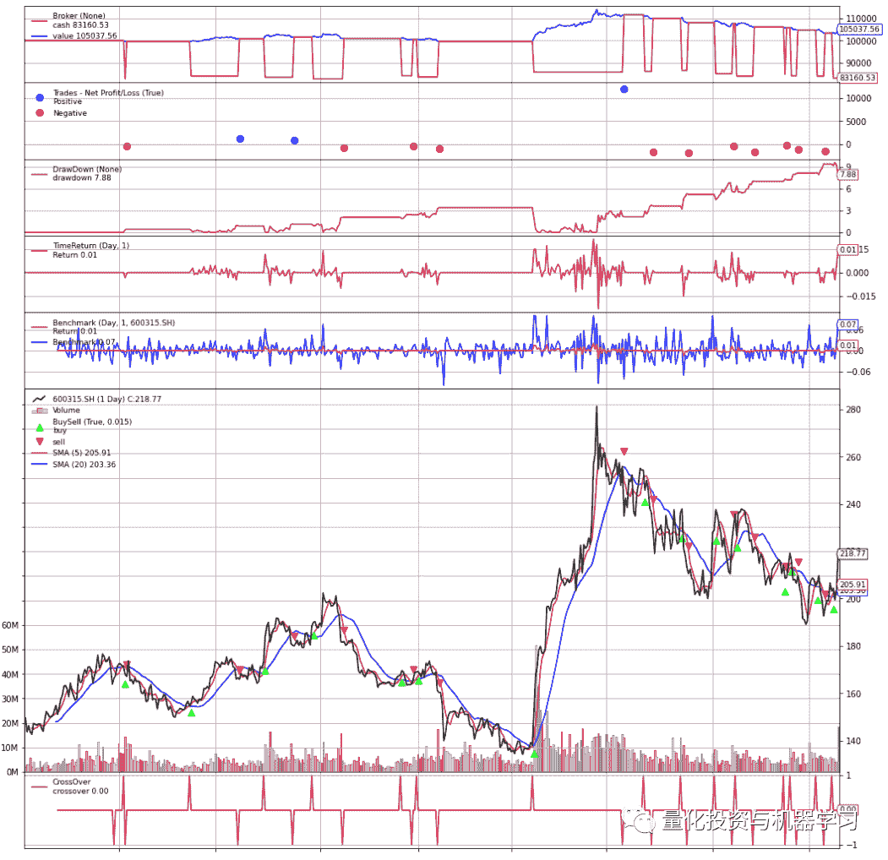
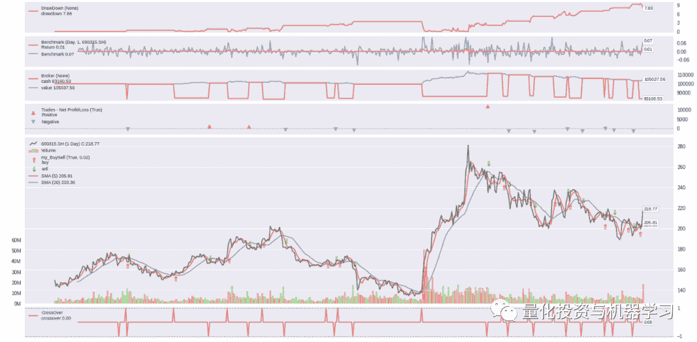
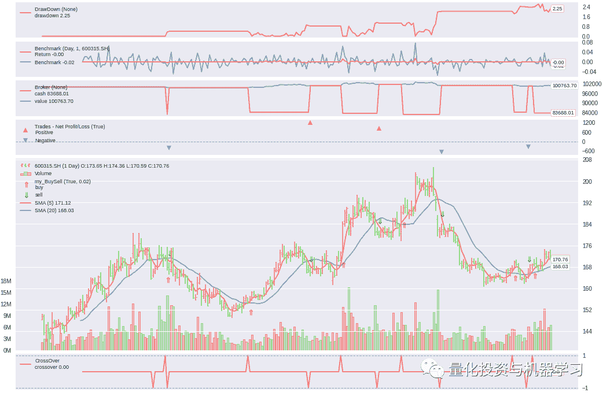
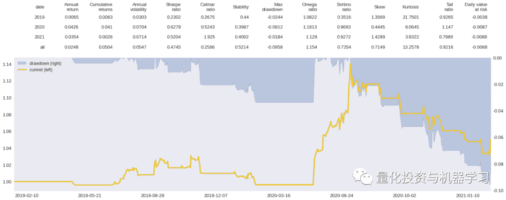
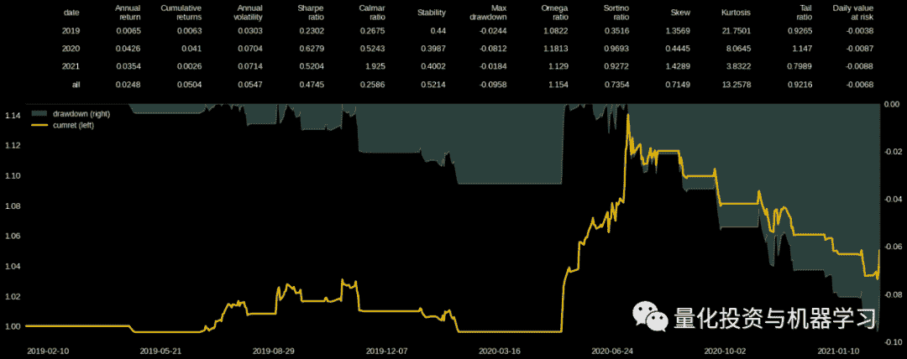
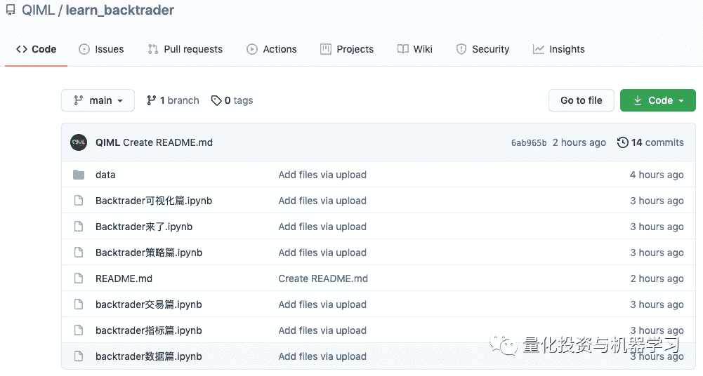

<!--yml
category: 交易
date: 2023-09-17 19:49:26
-->

# Backtrader系列教程⑦:可视化篇（重构）

> 来源：[https://blog.csdn.net/qq_41578115/article/details/122535202](https://blog.csdn.net/qq_41578115/article/details/122535202)

# 

**预定系列**

*   [Backtrader 来了](http://mp.weixin.qq.com/s?__biz=MzAxNTc0Mjg0Mg%3D%3D&chksm=802da3deb75a2ac85f3c3a6164f96303b70c12d14293f59fddf9a38c39a89bf4927b90b9e9c6&idx=1&mid=2653315531&scene=21&sn=f003da3d862e1a13349a10e006c5e748#wechat_redirect)

*   [Backtrader 数据篇](http://mp.weixin.qq.com/s?__biz=MzAxNTc0Mjg0Mg%3D%3D&chksm=802da148b75a285e3aa180a23132873646bf356191befc88831639146c68027ae4ab740a5e18&idx=1&mid=2653315933&scene=21&sn=0b3e71d4bf59da67d837907e05aef8cb#wechat_redirect)

*   [Backtrader 指标篇](http://mp.weixin.qq.com/s?__biz=MzAxNTc0Mjg0Mg%3D%3D&chksm=802da6d7b75a2fc1bc8614797e2c6f59b8196cfa78368175032575cbfdca825fc1031c74a61c&idx=1&mid=2653316290&scene=21&sn=ae9c9d548ccbbc7855bfc69d93182b8a#wechat_redirect)

*   [Backtrader 交易篇（上）](http://mp.weixin.qq.com/s?__biz=MzAxNTc0Mjg0Mg%3D%3D&chksm=802da7a5b75a2eb36a921917ece8f010c1f81032edaeced6a50525ca1fff0cdfa42c0f9310e8&idx=1&mid=2653316528&scene=21&sn=24f2c06b8f7da8dee6fe40f7c65b83a6#wechat_redirect)

*   [Backtrader 交易篇（下）](http://mp.weixin.qq.com/s?__biz=MzAxNTc0Mjg0Mg%3D%3D&chksm=802da50db75a2c1bc1e94490245292570aa82261e2d9d97705194ac41544af68d7d822e7e25b&idx=1&mid=2653316888&scene=21&sn=1e8343ced80444f2c125fb0dc6b587a1#wechat_redirect)

*   [Backtrader 策略篇](http://mp.weixin.qq.com/s?__biz=MzAxNTc0Mjg0Mg%3D%3D&chksm=802da817b75a2101c5812a6fc9daf0b2c08ce21d882bdd3059d2e9f391432b3ac9e950d5e151&idx=1&mid=2653317634&scene=21&sn=e92fec0b0b5fd5f62805e7c2be5830f8#wechat_redirect)

*   **Backtrader 可视化篇（重构）**

*   Backtrader 常见问题汇总

*   Backtrader 常见案例汇总

*   ······

**前言**

今天的《可视化篇》先会介绍与可视化相关的观测器模块 observers ，然后介绍 Backtrader 自带的绘图函数 [plot](https://so.csdn.net/so/search?q=plot&spm=1001.2101.3001.7020)() ，在介绍的过程中会指出如何修改图形的样式；**最后直接基于回测返回的收益序列 TimeReturn，结合****pyfolio和matplotlib****工具，自定义了一个可视化图形。**

**获取完整代码+数据，见文末链接**

**observers 观测器**

observers 是 Backtrader 的“观测器模块”，主要用于统计回测信息，并在 plot() 的帮助下实现信息的可视化展示，如下图所示：



**最常用的观测器**

下面是对最常用的观测器的介绍，其他观测器可以参考Backtrader 官方文档 ~ Observers - Reference：

*   backtrader.observers.Broker：记录了经纪商 broker 中各时间点的可用资金和总资产；可视化时，会同时展示 cash 和 values 曲线；如果想各自单独展示 cash 和 values，可以分别调用 backtrader.observers.Cash 和 backtrader.observers.Value；

*   backtrader.observers.BuySell：记录了回测过程中的买入和卖出信号；可视化时，会在价格曲线上标注买卖点；

*   backtrader.observers.Trades：记录了回测过程中每次交易的盈亏（从买入建仓到卖出清仓算一次交易）；可视化时，会绘制盈亏点；

*   backtrader.observers.TimeReturn：记录了回测过程中的收益序列；可视化时，会绘制 TimeReturn 收益曲线；

*   backtrader.observers.DrawDown：记录了回测过程的回撤序列；可视化时，绘制回撤曲线；

*   backtrader.observers.Benchmark：记录了业绩基准的收益序列，业绩基准的数据必须事先通过 adddata、resampledata、replaydata 等数据添加函数添加进大脑中 cerebro；可视化时，会同时绘制策略本身的收益序列（即：backtrader.observers.TimeReturn 绘制的收益曲线）和业绩基准的收益曲线。

**如何添加 observers**

observers 观测器是通过 addobserver() 添加给大脑 cerebro 的：addobserver(obscls, *args, **kwargs)，其中，参数 obscls 对应 observers 类下的观测器、*args, **kwargs 对应观测器支持设置的参数，具体如下所示：

```
 1.  import backtrader as bt

2.  ...

3.  cerebro = bt.Cerebro(stdstats=False) 

4.  cerebro.addobserver(bt.observers.Broker)

5.  cerebro.addobserver(bt.observers.Trades)

6.  cerebro.addobserver(bt.observers.BuySell)

7.  cerebro.addobserver(bt.observers.DrawDown)

8.  cerebro.addobserver(bt.observers.TimeReturn)

9.  # 添加业绩基准时，需要事先将业绩基准的数据添加给 cerebro

10.  banchdata = bt.feeds.PandasData(dataname=data, fromdate=st_date, todate=ed_date)

11.  cerebro.adddata(banchdata, name=

         'xxxx')

12.  cerebro.addobserver(bt.observers.Benchmark, data=banchdata)

对于 Broker、Trades、BuySell 3个观测器，默认是自动添加给 cerebro 的，可以在实例化大脑时，通过 stdstats 来控制：bt.Cerebro(stdstats=False) 表示可视化时，不展示 Broker、Trades、BuySell 观测器；反之，自动展示；默认情况下是自动展示。

**如何读取 observers 中的数据**

observers  中记录了各种回测数据，可以将其看作是一个支持可视化展示的数据存储器，所以 observers 属于 lines 对象。如果想在 Strategy 中读取 observers 中的数据，就会用到 line 的相关操作，具体可以参考《Backtrader 数据篇》的内容，observers 的数据通过 self.stats 对象 来连接：

```
 1.  class MyStrategy(bt.Strategy):

2.  def next(self):

3.  # 当前时点的前一天的可用现金

4.  self.stats.broker.cash[

         0]

5.  # 当前时点的前一天的总资产

6.  self.stats.broker.value[

         0]

7.  # 获取当前时刻前一天的收益

8.  self.stats.timereturn.line[

         0]

9.  # observers 取得[

         0]值，对应的 next 中 self.data.datetime[

         -1] 这一天的值

observers 是在所有指标被计算完之后、在执行 Strategy 的 next 方法之后才运行并统计数据的，所以读取的最新数据 [0] 相对与 next 的当前时刻是晚一天的。比如 2019-04-08 的总资产为 99653.196672，2019-04-09 的总资产为 99599.008652，2019-04-09 这一天的收益为 -0.0005437，如果在 next 通过 self.stats.timereturn.line[0] 提取，取值为 -0.0005437 时，对应的 next 的当前时间是  2019-04-10。

如果想要将 observers  中的数据保存到本地，可以通过 writer  写入本地文件，如下面的读写到本地 CSV 文件：

```
 1.  import csv

3.  class TestStrategy(bt.Strategy):

4.  ... 

5.  def start(self):

6.  self.mystats = csv.writer(open(

         "mystats.csv", 

         "w"))

7.  self.mystats.writerow([

         'datetime',

8.  'drawdown', 

         'maxdrawdown', 

9.  'timereturn',

10.  'value', 

         'cash'])

11.  def next(self): 

12.  self.mystats.writerow([self.data.datetime.date(

         -1).strftime(

         '%Y-%m-%d'),

13.  '%.4f' % self.stats.drawdown.drawdown[

         0],

14.  '%.4f' % self.stats.drawdown.maxdrawdown[

         0],

15.  '%.4f' % self.stats.timereturn.line[

         0],

16.  '%.4f' % self.stats.broker.value[

         0],

17.  '%.4f' % self.stats.broker.cash[

         0]]) 

18.  def stop(self):  

19.  self.mystats.writerow([self.data.datetime.date(

         0).strftime(

         '%Y-%m-%d'),

20.  '%.4f' % self.stats.drawdown.drawdown[

         0],

21.  '%.4f' % self.stats.drawdown.maxdrawdown[

         0],

22.  '%.4f' % self.stats.broker.value[

         0],

23.  '%.4f' % self.stats.broker.cash[

         0]])

25.  # 当运行到最后一根 bar 后， next 中记录的是上一根 bar 的收益

26.  # stop 是在 next 运行完后才运行的，此时 observers 已经计算完 最后一根 bar 的收益了

27.  # 所以可以在 stop 中获取最后一根 bar 的收益

**自定义 observers **

和之前各种自定义一致，自定义 observers 同样是在继承父类  bt.observer.Observer 的基础上，自定义新的的observers。下面是 Backtrader 官网提供的例子，用于统计已成功创建的订单的价格和到期订单的价格：

```
 1.  class OrderObserver(bt.observer.Observer):

2.  lines = (

         'created', 

         'expired',)

4.  plotinfo = dict(plot=True, subplot=True, plotlinelabels=True)

6.  plotlines = dict(

7.  created=dict(marker=

         '*', markersize=

         8.0, color=

         'lime', fillstyle=

         'full'),

8.  expired=dict(marker=

         's', markersize=

         8.0, color=

         'red', fillstyle=

         'full')

9.  )

11.  def next(self):

12.  for order in self._owner._orderspending:

13.  if order.data is not self.data:

14.  continue

16.  if not order.isbuy():

17.  continue

19.  # Only interested in 

         "buy" orders, because the sell orders

20.  # in the strategy are Market orders and will be immediately

21.  # executed

23.  if order.status in [bt.Order.Accepted, bt.Order.Submitted]:

24.  self.lines.created[

         0] = order.created.price

26.  elif order.status in [bt.Order.Expired]:

27.  self.lines.expired[

         0] = order.created.price

*   observers 本身是 Lines 对象，所以构建逻辑与自定义 Indicator 类似，将要统计的数据指定为相应的 line，然后随着回测的进行依次存入数据；

*   作为 Lines 对象的 Observers 和 Indicator ，类内部都有 plotinfo = dict(...)、plotlines = dict(...) 属性，用于回测结束后通过 cerebro.plot() 方法进行可视化展示；

*   有时候如果想修改 Backtrader 已有观测器的相关属性，可以直接继承该观测器，然后设置属性取值进行修改。如下面在原始 bt.observers.BuySell 的基础上，修改买卖点的样式。

```
 1.  class my_BuySell(bt.observers.BuySell):

2.  params = ((

         'barplot', True), (

         'bardist', 

         0.02))

3.  plotlines = dict(

4.  buy=dict(marker=r

         '$\Uparrow$', markersize=

         10.0, color=

         '#d62728' ),

5.  sell=dict(marker=r

         '$\Downarrow$', markersize=

         10.0, color=

         '#2ca02c'))

6.  # 将 三角形改为箭头

8.  # 突然感受到了继承的强大！

**plot() 图形绘制**

cerebro.plot() 写在 cerebro.run() 后面，用于回测的可视化。总的来说，cerebro.plot() 支持回测如下 3 大内容：

*   Data Feeds：即在回测开始前，通过 adddata、replaydata、resampledata 等方法导入大脑的原始数据；

*   Indicators ：即回测时构建的各类指标，比如在 strategy 中构建的指标、通过 addindicator 添加的；

*   Observers ：即上文介绍的观测器对象；

*   在绘制图形时，默认是将 Data Feeds 绘制在主图上；Indicators 有的与 Data Feeds 一起绘制在主图上，比如均线，有的以子图形式绘制；Observers 通常绘制在子图上。

**plot() 中的参数**

plot() 中的参数主要用于系统性的配置图形，具体参数如下所示：

```
 1.  plot(plotter=None, # 包含各种绘图属性的对象或类，如果为None，默认取 PlotScheme 类，如下所示

2.  numfigs=

         1, # 是否将图形拆分成多幅图展示，如果时间区间比较长，建议分多幅展示

3.  iplot=True, # 在 Jupyter Notebook 上绘图时是否自动 plot inline

4.  **kwargs) # 对应 PlotScheme 中的各个参数

6.  # PlotScheme 中的参数如下所示

7.  class PlotScheme(object):

8.  def __init__(self):

9.  # to have a tight packing on the chart wether only the x axis or also

10.  # the y axis have (see matplotlib)

11.  self.ytight = False

13.  # y-margin (top/bottom) 

         for the subcharts. This will not overrule the

14.  # option plotinfo.plotymargin

15.  self.yadjust = 

         0.0

16.  # Each 

         new line is in z-order below the previous one. change it False

17.  # to have lines paint above the previous line

18.  self.zdown = True

19.  # Rotation of the date labes on the x axis

20.  self.tickrotation = 

         15

22.  # How many 

         "subparts" takes a major chart (datas) in the overall chart

23.  # This is proportional to the total number of subcharts

24.  self.rowsmajor = 

         5

26.  # How many 

         "subparts" takes a minor chart (indicators/observers) in the

27.  # overall chart. This is proportional to the total number of subcharts

28.  # Together with rowsmajor, this defines a proportion ratio betwen data

29.  # charts and indicators/observers charts

30.  self.rowsminor = 

         1

32.  # Distance in between subcharts

33.  self.plotdist = 

         0.0

35.  # Have a grid in the background of all charts

36.  self.grid = True

38.  # Default plotstyle 

         for the OHLC bars which (line -> line on 

         close)

39.  # Other options: 

         'bar' and 

         'candle'

40.  self.style = 

         'line'

42.  # Default color 

         for the 

         'line on close' plot

43.  self.loc = 

         'black'

44.  # Default color 

         for a bullish bar/candle (

         0.75 -> intensity of gray)

45.  self.barup = 

         '0.75'

46.  # Default color 

         for a bearish bar/candle

47.  self.bardown = 

         'red'

48.  # Level of transparency to apply to bars/cancles (NOT USED)

49.  self.bartrans = 

         1.0

51.  # Wether the candlesticks have to be filled or be transparent

52.  self.barupfill = True

53.  self.bardownfill = True

55.  # Wether the candlesticks have to be filled or be transparent

56.  self.fillalpha = 

         0.20

58.  # Wether to plot volume or not. Note: 

         if the data in question has no

59.  # volume values, volume plotting will be skipped even 

         if this is True

60.  self.volume = True

62.  # Wether to overlay the volume on the data or use a separate subchart

63.  self.voloverlay = True

64.  # Scaling of the volume to the data when plotting as overlay

65.  self.volscaling = 

         0.33

66.  # Pushing overlay volume up 

         for better visibiliy. Experimentation

67.  # needed 

         if the volume and data overlap too much

68.  self.volpushup = 

         0.00

70.  # Default colour 

         for the volume of a bullish day

71.  self.volup = 

         '#aaaaaa'  # 

         0.66 of gray

72.  # Default colour 

         for the volume of a bearish day

73.  self.voldown = 

         '#cc6073'  # (

         204, 

         96, 

         115)

74.  # Transparency to apply to the volume when overlaying

75.  self.voltrans = 

         0.50

77.  # Transparency 

         for text labels (NOT USED CURRENTLY)

78.  self.subtxttrans = 

         0.66

79.  # Default font text size 

         for labels on the chart

80.  self.subtxtsize = 

         9

82.  # Transparency 

         for the legend (NOT USED CURRENTLY)

83.  self.legendtrans = 

         0.25

84.  # Wether indicators have a leged displaey in their charts

85.  self.legendind = True

86.  # Location of the legend 

         for indicators (see matplotlib)

87.  self.legendindloc = 

         'upper left'

89.  # Plot the last value of a line after the Object name

90.  self.linevalues = True

92.  # Plot a tag at the end of each line with the last value

93.  self.valuetags = True

95.  # Default color 

         for horizontal lines (see plotinfo.plothlines)

96.  self.hlinescolor = 

         '0.66'  # shade of gray

97.  # Default style 

         for horizontal lines

98.  self.hlinesstyle = 

         '--'

99.  # Default width 

         for horizontal lines

100.  self.hlineswidth = 

         1.0

102.  # Default color scheme: Tableau 

         10

103.  self.lcolors = tableau10

105.  # strftime Format 

         string 

         for the display of ticks on the x axis

106.  self.fmt_x_ticks = None

108.  # strftime Format 

         string 

         for the display of data points values

109.  self.fmt_x_data = None

如果想要系统性修改图形样式，可以重新定义 PlotScheme 类，然后修改里面用到的参数；也可以直接在plot() 中修改：

```
 1.  # 通过参数形式来设置

2.  cerebro.plot(iplot=False, 

3.  style=

         'candel', # 设置主图行情数据的样式为蜡烛图

4.  lcolors=colors , # 重新设置主题颜色

5.  plotdist=

         0.1, # 设置图形之间的间距

6.  barup = 

         '#ff9896', bardown=

         '#98df8a', # 设置蜡烛图上涨和下跌的颜色

7.  volup=

         '#ff9896', voldown=

         '#98df8a', # 设置成交量在行情上涨和下跌情况下的颜色

8.  ....)

关于主题颜色，Backtrader 提供了Tableau 10 、Tableau 10 Light、Tableau 20 3种主题色，默认是以 Tableau 10 为主题色。但是看源代码，不知道如何修改 lcolors，源码 scheme.py 文件中的 tableau10 只一个变量，直接赋值给 self.lcolors = tableau10，如果在我们在自己的的 notebook上运行 lcolors=tableau10 会报错，提示 tableau10 变量不存在。所以，如果想修改主题色，需要重新定义 tableau10 变量：

```
 1.  # 定义主题色变量：直接从源码 scheme.py 中复制的

2.  tableau20 = [

3.  'steelblue', # 

         0

4.  'lightsteelblue', # 

         1

5.  'darkorange', # 

         2

6.  'peachpuff', # 

         3

7.  'green', # 

         4

8.  'lightgreen', # 

         5

9.  'crimson', # 

         6

10.  'lightcoral', # 

         7

11.  'mediumpurple', # 

         8

12.  'thistle', # 

         9

13.  'saddlebrown', # 

         10

14.  'rosybrown', # 

         11

15.  'orchid', # 

         12

16.  'lightpink', # 

         13

17.  'gray', # 

         14

18.  'lightgray', # 

         15

19.  'olive', # 

         16

20.  'palegoldenrod', # 

         17

21.  'mediumturquoise', # 

         18

22.  'paleturquoise', # 

         19

23.  ]

25.  tableau10 = [

26.  'blue', # 

         'steelblue', # 

         0

27.  'darkorange', # 

         1

28.  'green', # 

         2

29.  'crimson', # 

         3

30.  'mediumpurple', # 

         4

31.  'saddlebrown', # 

         5

32.  'orchid', # 

         6

33.  'gray', # 

         7

34.  'olive', # 

         8

35.  'mediumturquoise', # 

         9

36.  ]

38.  tableau10_light = [

39.  'lightsteelblue', # 

         0

40.  'peachpuff', # 

         1

41.  'lightgreen', # 

         2

42.  'lightcoral', # 

         3

43.  'thistle', # 

         4

44.  'rosybrown', # 

         5

45.  'lightpink', # 

         6

46.  'lightgray', # 

         7

47.  'palegoldenrod', # 

         8

48.  'paleturquoise', # 

         9

49.  ]

51.  # 选一个主题色做修改

52.  cerebro.plot(lcolors=tableau10)

55.  # 当然也可以选自己喜欢的主题色

56.  mycolors = [

         '#729ece', 

         '#ff9e4a', 

         '#67bf5c', 

57.  '#ed665d', 

         '#ad8bc9', 

         '#a8786e', 

58.  '#ed97ca', 

         '#a2a2a2', 

         '#cdcc5d', 

         '#6dccda']

60.  cerebro.plot(lcolors=mycolors)

大家可以发现，从源码中复制的主题色，后面都注释了索引号，而 Backtrader 在绘制图形时，选择颜色的顺序依次是这样的：

*   tab10_index = [3, 0, 2, 1, 2, 4, 5, 6, 7, 8, 9]；

*   tab10_index 中的序号对应的是 主题色 的索引号；

*   每一幅图，依次取 tab10_index 中的序号对应的颜色来绘制，比如 MACD 有 3 条 line，line0 的颜色为 tab10_index[0] = 3，也就是 lcolors=tableau10 中的索引号为 3 对应的颜色 'crimson'；line1 的颜色为 tab10_index[1] = 0，也就是 lcolors=tableau10 中的索引号为 0 对应的颜色 'blue'；

*   所以在设置颜色时，需要与 tab10_index  中的序号结合起来看。

**局部绘图参数设置**

对于 Indicators  和 Observers 的可视化设置，通过类内部的 plotinfo = dict(...)、plotlines = dict(...) 属性来控制，其中 plotinfo 主要对图形整体布局进行设置，plotlines 主要对具体 line 的样式进行设置：

```
 1.  plotinfo = dict(plot=True, # 是否绘制

2.  subplot=True, # 是否绘制成子图

3.  plotname=

         '', # 图形名称

4.  plotabove=False, # 子图是否绘制在主图的上方

5.  plotlinelabels=False, # 主图上曲线的名称

6.  plotlinevalues=True, # 是否展示曲线最后一个时间点上的取值

7.  plotvaluetags=True, # 是否以卡片的形式在曲线末尾展示最后一个时间点上的取值

8.  plotymargin=

         0.0, # 用于设置子图 y 轴的边界

9.  plothlines=[a,b,...], # 用于绘制取值为 a,b,... 的水平线

10.  plotyticks=[], # 用于绘制取值为 a,b,... y轴刻度

11.  plotyhlines=[a,b,...], # 优先级高于plothlines、plotyticks，是这两者的结合

12.  plotforce=False, # 是否强制绘图

13.  plotmaster=None, # 用于指定主图绘制的主数据

14.  plotylimited=True, 

15.  # 用于设置主图的 y 轴边界，

16.  # 如果True，边界只由主数据 data feeds决定，无法完整显示超出界限的辅助指标；

17.  # 如果False, 边界由主数据 data feeds和指标共同决定，能确保所有数据都能完整展示

18.  )

20.  # 修改交易观测器的样式

21.  class my_Trades(bt.observers.Trades):

22.  plotlines = dict(

23.  pnlplus=dict(_name=

         'Positive',

24.  marker=

         '^', color=

         '#ed665d',

25.  markersize=

         8.0, fillstyle=

         'full'),

26.  pnlminus=dict(_name=

         'Negative',

27.  marker=

         'v', color=

         '#729ece',

28.  markersize=

         8.0, fillstyle=

         'full'))

30.  # 修改买卖点样式

31.  class my_BuySell(bt.observers.BuySell):

32.  params = ((

         'barplot', True), (

         'bardist', 

         0.02)) # bardist 控制买卖点与行情线之间的距离

33.  plotlines = dict(

34.  buy=dict(marker=r

         '$\Uparrow$', markersize=

         10.0, color=

         '#d62728' ),

35.  sell=dict(marker=r

         '$\Downarrow$', markersize=

         10.0, color=

         '#2ca02c'))

**部分修改效果**

一般主图的样式通过 plot() 中的参数来设置；Indicators  和 Observers 的样式通过继承原始类，然后通过修改plotinfo 和 plotlines 属性来设置；部分修改效果如下所示：

蜡烛图样式：

```
 1.  plt.style.use(

         'seaborn') # 使用 seaborn 主题

2.  plt.rcParams[

         'figure.figsize'] = 

         20, 

         10  # 全局修改图大小

4.  # 修改 Trades 观测器的样式

5.  class my_Trades(bt.observers.Trades):

6.  plotlines = dict(

7.  pnlplus=dict(_name=

         'Positive',

8.  marker=

         '^', color=

         '#ed665d',

9.  markersize=

         8.0, fillstyle=

         'full'),

10.  pnlminus=dict(_name=

         'Negative',

11.  marker=

         'v', color=

         '#729ece',

12.  markersize=

         8.0, fillstyle=

         'full'))

14.  # 修改 BuySell 的样式

15.  class my_BuySell(bt.observers.BuySell):

17.  params = ((

         'barplot', True), (

         'bardist', 

         0.02))

19.  plotlines = dict(

20.  buy=dict(marker=r

         '$\Uparrow$', markersize=

         10.0, color=

         '#d62728' ),

21.  sell=dict(marker=r

         '$\Downarrow$', markersize=

         10.0, color=

         '#2ca02c'))

24.  # 简单均线策略

25.  class TestStrategy(bt.Strategy):

26.  ......

28.  # 绘制图形

29.  cerebro1 = bt.Cerebro(stdstats=False)

30.  ......

31.  # 添加观测器

32.  cerebro1.addobserver(bt.observers.DrawDown)

33.  cerebro1.addobserver(bt.observers.Benchmark, data=datafeed1)

34.  cerebro1.addobserver(bt.observers.Broker)

35.  cerebro1.addobserver(my_Trades)

36.  cerebro1.addobserver(my_BuySell)

37.  #先运行策略

38.  rasult = cerebro1.run()

39.  #策略运行完后，绘制图形

40.  colors = [

         '#729ece', 

         '#ff9e4a', 

         '#67bf5c', 

         '#ed665d', 

         '#ad8bc9', 

         '#a8786e', 

         '#ed97ca', 

         '#a2a2a2', 

         '#cdcc5d', 

         '#6dccda']

41.  tab10_index = [

         3, 

         0, 

         2, 

         1, 

         2, 

         4, 

         5, 

         6, 

         7, 

         8, 

         9]

42.  cerebro1.plot(iplot=False, 

43.  style=

         'line', # 绘制线型价格走势，可改为 

         'candel' 样式

44.  lcolors=colors,

45.  plotdist=

         0.1, 

46.  bartrans=

         0.2, 

47.  volup=

         '#ff9896', 

48.  voldown=

         '#98df8a', 

49.  loc=

         '#5f5a41',

50.  grid=False) # 删除水平网格



蜡烛图样式：

绘制蜡烛图时，蜡烛之间会比较拥挤，可以通过设置 numfigs=2，分 2 部分绘制。下图只展示了后半部分的内容。



**基于收益序列进行可视化**

Backtrader 自带的绘图工具方便好用，不过平时在汇报策略回测结果时，可能更关注的是策略的累计收益曲线和业绩评价指标等结果，而这些回测统计信息只需基于回测返回的 TimeReturn 收益序列做简单计算即可得到。下面是基于 Backtrader 回测返回的分析器 TimeReturn、pyfolio、matplotlib 得到的可视化图形：

```
 1.  .....

2.  # 回测时需要添加 TimeReturn 分析器

3.  cerebro1.addanalyzer(bt.analyzers.TimeReturn, _name=

         '_TimeReturn')

4.  result = cerebro1.run()

6.  # 提取收益序列

7.  pnl = pd.Series(result[

         0].analyzers._TimeReturn.get_analysis())

8.  # 计算累计收益

9.  cumulative = (pnl + 

         1).cumprod()

10.  # 计算回撤序列

11.  max_return = cumulative.cummax()

12.  drawdown = (cumulative - max_return) / max_return

13.  # 计算收益评价指标

14.  import pyfolio as pf

15.  # 按年统计收益指标

16.  perf_stats_year = (pnl).groupby(pnl.index.to_period(

         'y')).apply(lambda data: pf.timeseries.perf_stats(data)).unstack()

17.  # 统计所有时间段的收益指标

18.  perf_stats_all = pf.timeseries.perf_stats((pnl)).to_frame(name=

         'all')

19.  perf_stats = pd.concat([perf_stats_year, perf_stats_all.T], axis=

         0)

20.  perf_stats_ = round(perf_stats,

         4).reset_index()

23.  # 绘制图形

24.  import matplotlib.pyplot as plt

25.  plt.rcParams[

         'axes.unicode_minus'] = False  # 用来正常显示负号

26.  import matplotlib.ticker as ticker # 导入设置坐标轴的模块

27.  plt.style.use(

         'seaborn') # plt.style.use(

         'dark_background')

29.  fig, (ax0, ax1) = plt.subplots(

         2,

         1, gridspec_kw = {

         'height_ratios':[

         1.5, 

         4]}, figsize=(

         20,

         8))

30.  cols_names = [

         'date', 

         'Annual\nreturn', 

         'Cumulative\nreturns', 

         'Annual\nvolatility',

31.  'Sharpe\nratio', 

         'Calmar\nratio', 

         'Stability', 

         'Max\ndrawdown',

32.  'Omega\nratio', 

         'Sortino\nratio', 

         'Skew', 

         'Kurtosis', 

         'Tail\nratio',

33.  'Daily value\nat risk']

35.  # 绘制表格

36.  ax0.set_axis_off() # 除去坐标轴

37.  table = ax0.table(cellText = perf_stats_.values, 

38.  bbox=(

         0,

         0,

         1,

         1), # 设置表格位置， (x0, y0, width, height)

39.  rowLoc = 

         'right', # 行标题居中

40.  cellLoc=

         'right' ,

41.  colLabels = cols_names, # 设置列标题

42.  colLoc = 

         'right', # 列标题居中

43.  edges = 

         'open' # 不显示表格边框

44.  )

45.  table.set_fontsize(

         13)

47.  # 绘制累计收益曲线

48.  ax2 = ax1.twinx()

49.  ax1.yaxis.set_ticks_position(

         'right') # 将回撤曲线的 y 轴移至右侧

50.  ax2.yaxis.set_ticks_position(

         'left') # 将累计收益曲线的 y 轴移至左侧

51.  # 绘制回撤曲线

52.  drawdown.plot.area(ax=ax1, label=

         'drawdown (right)', rot=

         0, alpha=

         0.3, fontsize=

         13, grid=False)

53.  # 绘制累计收益曲线

54.  (cumulative).plot(ax=ax2, color=

         '#F1C40F' , lw=

         3.0, label=

         'cumret (left)', rot=

         0, fontsize=

         13, grid=False)

55.  # 不然 x 轴留有空白

56.  ax2.set_xbound(lower=cumulative.index.min(), upper=cumulative.index.max())

57.  # 主轴定位器：每 

         5 个月显示一个日期：根据具体天数来做排版

58.  ax2.xaxis.set_major_locator(ticker.MultipleLocator(

         100)) 

59.  # 同时绘制双轴的图例

60.  h1,l1 = ax1.get_legend_handles_labels()

61.  h2,l2 = ax2.get_legend_handles_labels()

62.  plt.legend(h1+h2,l1+l2, fontsize=

         12, loc=

         'upper left', ncol=

         1)

64.  fig.tight_layout() # 规整排版

65.  plt.show()

'seaborn' 主题下的绘制效果：



'dark_background' 主题下的绘制效果：



**总结**

关于回测结果的可视化，不同的需求对应不同的可视化内容。Backtrader 回测框架本身就对原始数据集 Data Feeds、回测指标 Indicators 、回测结果观测器 Observers 提供了对用户非常友好的绘图接口。对于一些额外的数据，也可以结合 Backtrader 分析器 Analyzers 返回的指标，选用自己熟悉的 Python 绘图工具 Matplotlib、Seaborn、Plotly 等来进行可视化展示。

**代码+数据获取**

**复制下方链接**至浏览器或点击**阅读原文**，进行下载：

***https://github.com/QIML/learn_backtrader***

 
``` 
``` 
``` 
``` 
``` 
``` 
``` 
``` 
``` 
``` 
```