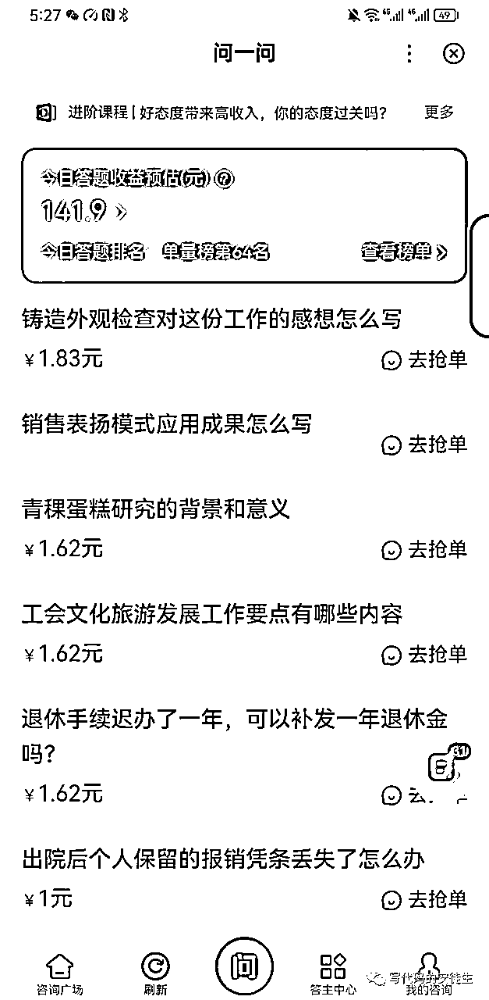
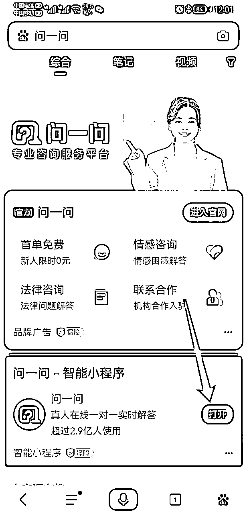
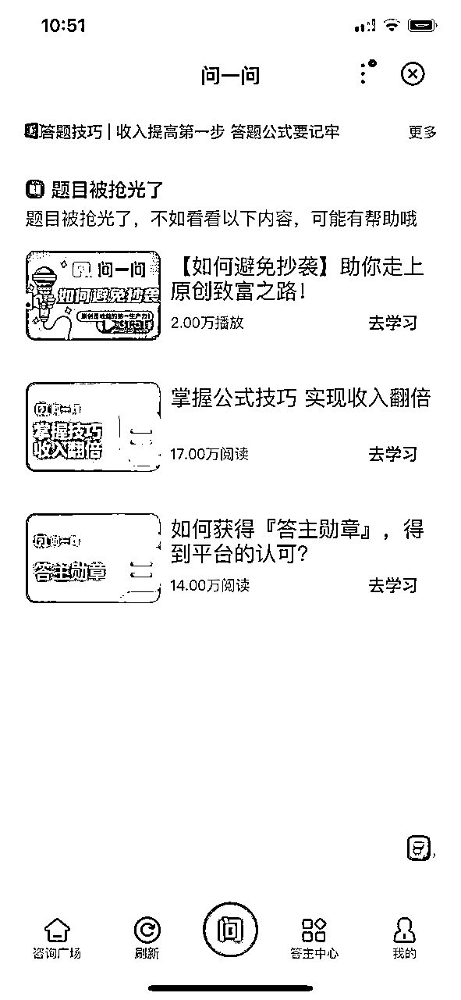

# ChatGPT 撸问一问教程

> 来源：[`rbs5bhtawn.feishu.cn/docx/DO2TdnL22oQwZuxxS3zcVCsUnKe`](https://rbs5bhtawn.feishu.cn/docx/DO2TdnL22oQwZuxxS3zcVCsUnKe)

收益：

## 问一问经验交流群：

本群主要提供一个交流平台、分享踩坑经验、分享工具、避免封号等，让大家少走弯路。

## 涉及哪些资源？

百度问一问 PC 端：https://zhidao.baidu.com/pages/consult/index/consult-management

百度问一问手机端：打开【百度 APP】-->【我的】-->【答主中心】

ChatGPT 国内版：https://c.ai6.top/

## 步骤零：注册上面的账号

百度问一问：【答主中心】-->【我的主页】修改个人资料

## 步骤一：完成新手任务

新号一般不会有题目，接下来要经常上来看看，如果过了 24 小时都还没题目，继续做第 2 节的【新手入门】。

## 步骤二：抢题

重要提醒：查询号码，查询地址，查询的问题千万不要做。不然提现的时候会违规！！！！！

日常事项：

## 步骤三：用 ChatGPT 答题

进入网址：https://c.ai6.top/

粘贴问题，并追加字数限制，比如：请介绍下长城的历史？最少 100 字。

## 查看收益

注意：需要进入【问一问（开发版）】查看自己收益！

注意 2：平时抢题不要在开发版，有 bug。

步骤：