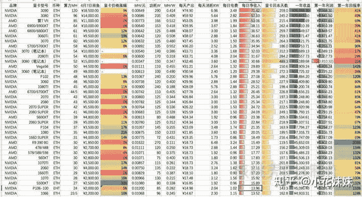
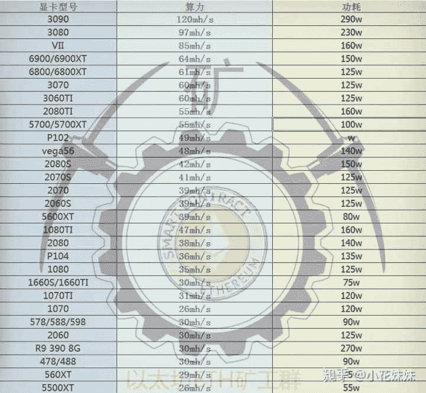

<!--yml
category: 挖矿
date: 2022-06-26 00:00:00
-->

# ETH挖矿现在进场晚吗？

> 原文：[https://www.zhihu.com/question/454230940/answer/1917113535](https://www.zhihu.com/question/454230940/answer/1917113535)

 晚不晚取决的因素有很多。首先是你的显卡来源。如果是某鱼扫货，尤其是大批量打包出售的那种价格会非常的便宜。并且目前30系列基本都带有质保，所以只能说如果选择扫货可能后续会有部分麻烦的问题，但是相对于大量入手新卡仍旧是有性价比的选择。

### 而且最近又出了个RVN让锁算力显卡也能挖了，收益是ETH两倍。

### 3G显存起挖，锁算力显卡的价格估计又要炸了。

## 回本周期

以3060为例，目前来说新卡价格仍旧可以维持在6000左右的价格。某鱼价格基本可以压价到4500左右。期间大差价就相当于提前了两个月的回本周期。

BTC在经历五月中旬触底2.9万USDT以后，目前已经趋于平稳，所以是否能保持稳定的算力收入还会要靠各位看官自己分辨。

正常的计算“回本周期”的时间，都是按照总投资的价格计算的，并不计算残值。而越高端的显卡残值越高，例如3060TI和3090的残值就肯定不在一个级别上。**回本周期还是需要根据显卡型号来计算，并且除去预估残值会更为精准。**

## 什么是算力

算力即代表显卡算数的能力，目前的主流币是ETH，又名以太坊。他主要是依靠显存不断的读取和写入来进行计算，所以影响算力的依据基本是依靠显卡显存的频率。图中可以看出3060TI和3070的算力同时都是60mh/s但是3060TI的功耗更小，这也是为什么3060TI基本上没有流入到玩家手中的原因。

算力的定义目前来说都是以日收益计算。每算力收益的意思就是每算力运行一天的价格。

比如我们使用3070算力为60Mh/s，那么日收益就是0.41*60=24.6元。当然这是截取瞬时币价的价格，一般在夜间收益都会高出30%-50%。

电费成本可以计算为0.125*24=3度电，即成本为每天1.77元电费。当然这只是显卡功耗，并不能代表整机功耗。

## 程序的选择

很多人纠结程序的选择，我认为首先能来这里学习的基本都是单卡或者批量不过几万块的个体户级别。这种情况下直接选择入门门槛极低的傻瓜式程序就可以了，直接转换成现金打到某宝账户中。这种程序当然也有很多人诟病，其实他的本质就是借用你的算力来抽取提成，对于个体户或者单卡来说，每天几分钱几毛钱的收入，我认为还是比较有性价比的。

介绍可以看一下这里。

而其他的原始程序，操作流程比较麻烦：

### 提币到钱包 → 钱包币提到交易所 → 交易所中卖出 → 转换成USDT → CN到账

其中的每一步都是有一定的手续费，所以总数算下来并不一定谁比谁更便捷。

现在我们再绕回来，讨论晚不晚的问题。唯一的核心就是：**看币价**

这种方式的收入，只能算作是投机取巧的一种，切勿抱有太大的梦想。

### 入市有风险，需谨慎考虑。

**挖 矿 专 场**丨[挖矿教程](https://zhuanlan.zhihu.com/p/355955385)丨 [笔本挖矿](https://zhuanlan.zhihu.com/p/360451565)丨[挖矿毁显卡吗](https://zhuanlan.zhihu.com/p/358944242)丨[矿卡也质保](https://zhuanlan.zhihu.com/p/386391253)丨

**锁 算 专 场**丨[锁算卡挖矿](https://zhuanlan.zhihu.com/p/398651881)丨[RVN和ERGO教程](https://zhuanlan.zhihu.com/p/402971584)丨[锁算卡挑选](https://zhuanlan.zhihu.com/p/374342633)丨[挖矿知识点合集](https://www.zhihu.com/question/461044682/answer/1994951468)

**笔记本专场**丨[满血版笔记本怎么挑](https://zhuanlan.zhihu.com/p/374748213)丨[买3060还是70本](https://www.zhihu.com/question/447817962/answer/1909204347)丨[蛟龙7测评](https://zhuanlan.zhihu.com/p/369226521)丨