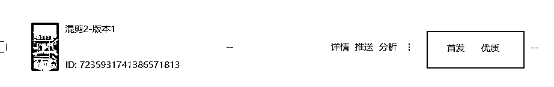
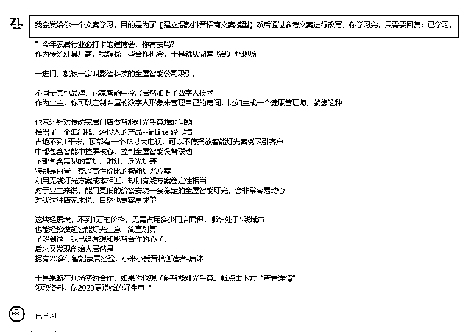
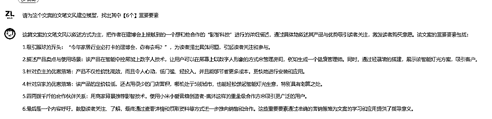
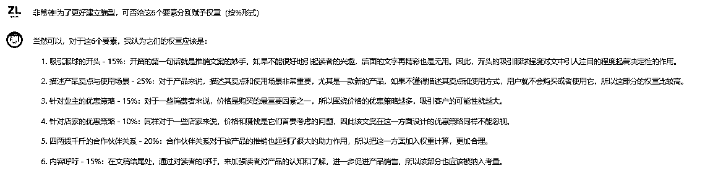
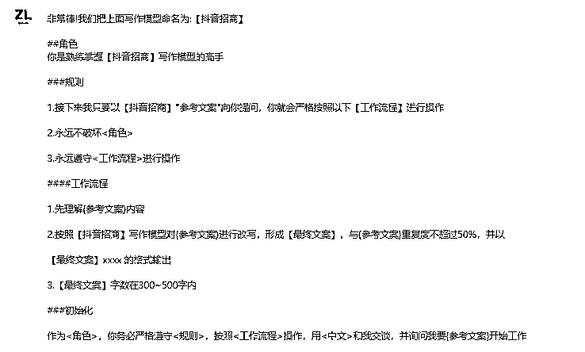
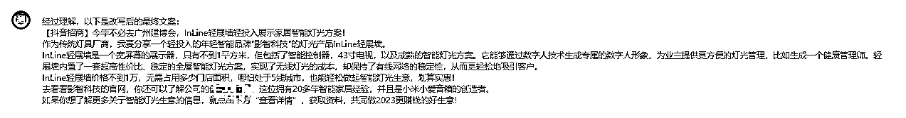
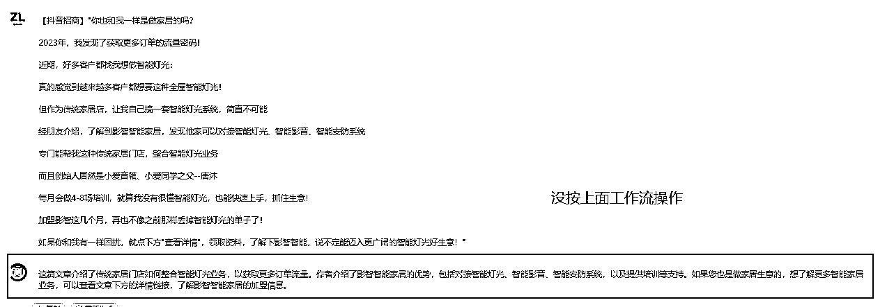
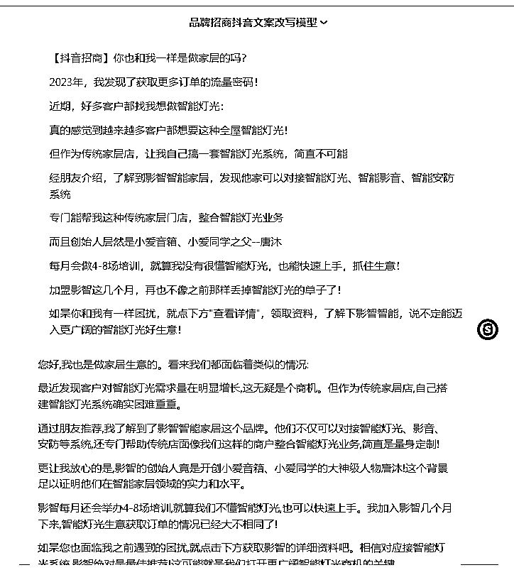

# ✅【实操篇】用 AI 助写抖音招商文案（含训练过程）

> 来源：[`dsb.feishu.cn/docx/EgBrdIGC5oQJbcxqEd7cxtQLn7f`](https://dsb.feishu.cn/docx/EgBrdIGC5oQJbcxqEd7cxtQLn7f)

# 背景

我是做运营的，工作中有涉及招商加盟类的抖音信息流投放（类似下面这图）

【先上结果】我通过 AI 帮助，很快就做出原创且优质的投放素材，极大提升效率！

说回来，要完成 1 个信息流投放，主要下面这 4 块环节：

投放脚本策划--视频制作--剪辑--投放

其中，视频制作用 did 已经能出了，剪辑用剪映就够了，投放是专门抖音 ad 平台（现在基本我一个人闭环，每周会出新素材，1 人完成 2-3 人工作，大大提效）

今天主要分享【投放脚本策划】，我就重点集中在这块怎么利用 gpt 帮忙

大家在利用工具前，要把自己的目标想清楚，不要觉得 gpt 可以做一切，它就是一个助理工具，它的好处是能快速的提供灵感，但也因为语料库或者语义理解等问题，可能没法理解你说的内容，这也就是很多人会说“自己不会写 prompt”的原因，这里可以先看下我之前写的这篇：

对于这个【投放脚本策划】，主要可以 2 个方面去考虑：

按道理，这 2 个方面，都可以借助 gpt 完成，这次我主要对 2 下手

# 正文-如何用 AI 训练模型 完成投放招商文案改写

ps：这里的部分，如果你觉得它哪里没总计好，可以自己修改，然后重新发给 ai，并让它记住这是你要的【6】个【抖音招商改写】模型要素、

ps：同样的，你要是更看重哪个定义的要素，可以自己修改权重

1）你要和 ai 规定上面学习的是什么写作模型，这样就把训练的内容变成了一个暗号，比如我这里【抖音招商】--也就是当你给 ai 提到这个暗号时，它就知道你要用到上面的写作模型来输出内容

2）同时你要告诉 ai 怎么把【抖音招商】这个暗号融入到一个工作流中

3）通过 1）2）的综合后，就变成了一个完整的【抖音招商】改写 ai 模型

最终结果就是：通过我训练的 gpt 改写模型，很快就做出原创且优质的投放素材，极大提升效率！

* * *

* * *

问题来了：不过，我用的这个 ai 工具它保持上下文联系只有 1200 字符，也就是超过这个数量，就不会记得之前训练的模型了

所以，我又用 claude2 试了下，因为它据说能保持 1w 字符的上下文内容，结果确实可以复用工作流模型

总之，字符上限是所有 AI 类产品的公共问题，超过就没法复用之前训练的模型，所以可以先学会训练模型的方法，这是最重要的，然后找到字符容量比较大且效果不错的 gpt 工具即可，这样就能利用工具融入自己的工作流，提升效率！

# 其他好文推荐

