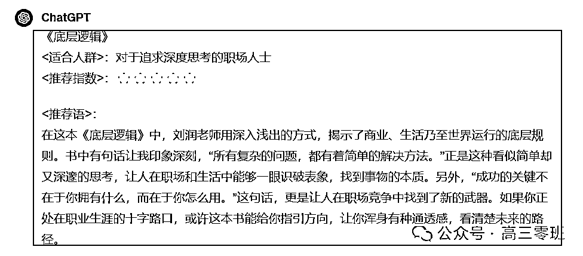

# 【gpt 实用指南 6】手把手教小白如何写出 80 分提示词？

> 来源：[`dsb.feishu.cn/docx/FXCndhCJJoU8U1xIuECcOVUYnZe`](https://dsb.feishu.cn/docx/FXCndhCJJoU8U1xIuECcOVUYnZe)

做了一个《gpt 实用指南》系列，旨在不吹牛逼，只讲干货，详细展示我用 gpt 的思路，希望能帮到更多人

我最近听到最多的问题就是“我不会写提示词阿”，那你跟着我这篇的步骤，就能快速 0-1 写 1 条 80 分以上的 prompt

2.把你想要 gpt 帮你干的活，用说人话的方式填写到模板里，不会写，就以“我希望 xxx”开头去写

-比如，我想最终让 gpt 帮我产出这种书单推荐的文案，这样就能快速的做一个书单推荐小红书 ip 号举例

3.复制 1 中结构化提示词模板，并用 2 中的技巧，填写得到初版提示词如下：

4.有了初版提示词之后，接下来就是优化提示词，直接用之前我介绍的李继刚大佬写的药剂师 gpts 就好了

*补充：不知道药剂师 gpts 是啥的同学，看这篇【gpt 实用指南 5】如何快速优化自己的提示词？(抽送 gpt4 账号)

5.药剂师 gpts 就能帮你优化提示词，效果如下图

6.最终会给你它修改后的提示词，部分截图如下

7.此时，你让它以 markdown 格式（不明白是啥没关系，就按我下面的提示词发给 gpt）输出给你，就可以直接复制使用了

8.然后直接点击截图中右上角红框的部分，复制完整 prompt

9.然后重新开启一个 gpt 对话窗口，把复制的提示词粘贴进去即可，最终效果如下：

以上，就是作为小白能快速写 1 条 80 分提示词的流程，希望能对你有帮助

# 欢迎交流

如果你想长期追《gpt 实用指南》这个栏目，可以链接我 vx：1285766801

# 其他好文