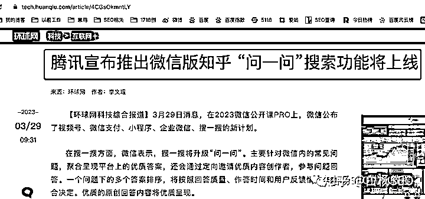
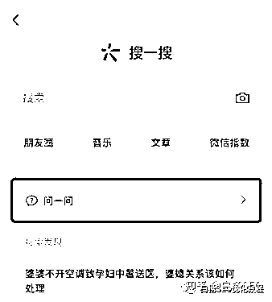
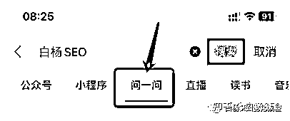
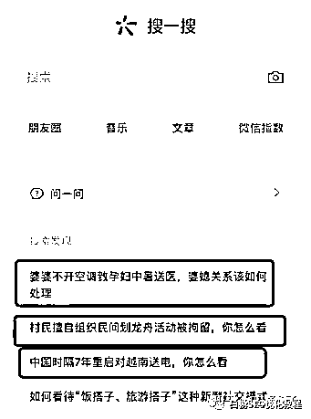
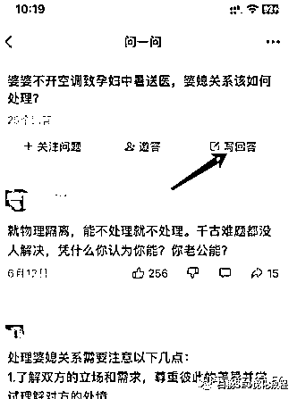
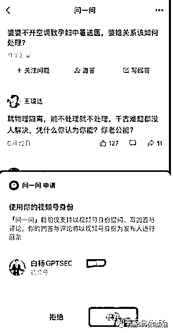
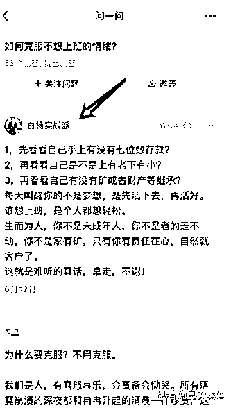
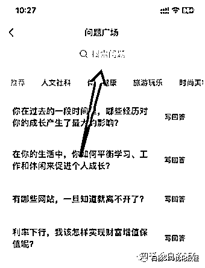
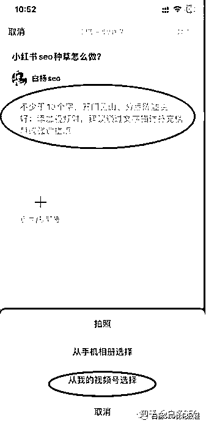

# 干货分享|微信问一问来了，如何结合 GPT 搞搜一搜 SEO 做流量？【实操举例】

> 来源：[`dsb.feishu.cn/docx/HCY4dty2ToxU0wx6KX6cugNGnnb`](https://dsb.feishu.cn/docx/HCY4dty2ToxU0wx6KX6cugNGnnb)

# 文章大纲

1、微信问一问是什么？入口在哪?

2、做微信问一问有什么好处？

3、微信问一问怎么开通入驻?

4、微信问一问结合搜一搜 SEO 怎么玩?

5、怎么从微信问一问引流与注意事项

## 微信问一问是什么？

微信问一问是微信公开课 2023 年 3 月 28 日晚上直播上开始说出来的，3 月 29 日正式对外开启内测的一个问答类产品，被媒体称作说是“微信版知乎”。如图：

## 微信问一问入口在哪里?

微信问一问入口目前是在微信 APP 的”发现“一”搜一搜“下面有一个【问一问】，如下图。

PS：微信 PC 版暂时还没上线，目前微信问一问仅支持视频号身份提问、写回答和评论，如图。如果你没有视频号，也是用不了的哈。（后续大概微信号身份也行）

## 微信问一问有什么好处?

1、微信问一问在搜一搜位置很重要，流量巨大！微信现在月活 10 亿+，搜一搜的月活也是 7 亿+，而问一问就在搜一搜下面的一级入口。同时，在微信 APP 上关键词搜一搜全部导航上给了问一问口子，搜索结果只要问答类一般排名前三，如图：

2、微信问一问可给视频号账号及视频更多曝光流量因为上面有说到，现在问一问主要是视频号作者参与，所以不管你是提问，还是回答还是评论，只要你的内容有价值，别人就会点进去了解你，是你不是给你带去曝光流量

3、微信问一问可以结合 SEO 搞更多精准自然搜索流量其实除了上面 2 个点外，只要这个产品一直存在，后续最大的机会在搜一搜 SEO 上。为什么这么说？你们知道百度吧，百度在 PC 时代的流量王者，除了有 MP3，百度贴吧，百度百科以外，百度知道给他带去很多流量。

【干货好文】《白杨 SEO 七年实战经验：网络推广之百度系引流如何做到极致？》这篇里当时做了个对比，感兴趣可以去看。用户的问答流量，就是最精准的流量。我们做 SEO 就是做用户的主动搜索流量是不是？具体怎么结合参与，往下看哈。

## 微信问一问怎么开通入驻?

很多人说，我没有问一问怎么搞，这里就分享最快入驻的方法，具体方法如下：

第一步，你可以找有问一问的人发一个问题你，或者你在搜一搜下面的有问题的随便点一个进去，如图：

第二步，点进去以后再去点写回答，如图：

这里说明一下，如果你的账号垂直的话，不要随便答不相关的，上面只是举例，比如这个我不会回答，所以你可以找有的朋友给你发相关的给你哈。

第三步，当你填写回答时，就会弹出如下图，让你用视频号身份选择，然后你点好后回答即可。

第四步，当你写好回答，然后提交，一般只要提交了，你再打开搜一搜就有了，如图我另一个实战回答，还在审核中就有了。

## 微信问一问结合搜一搜 SEO 怎么玩?

直接上干货，上实战流程步骤，懂的人直接抄作业。

1、首先要有自己的视频号账号，至于发几个视频在这里不做要求，有时间就多发，没时间少点也没关系，这里是搞问一问的流量，这是第一步基础。

2、确定自己问一问回答的行业，因为这个取决于你的流量精不精准。

3、确定你所在行业的关键词，如果不会关键词挖掘，可以看我的这篇：《白杨 SEO 第 1 课：SEO 是什么与关键词分析》，找到你的核心流量关键词，因为这个是拿来搜索问题用的。

4、打开微信 APP-搜一搜-问一问，然后点问题广场，再去去后顶上有一个搜索框，如图：输入你找到的流量关键词搜索，找到问题。

5、找到你想要回答的问题，去回答问题即可了。至于你说我不知答什么，GPT 工具不就可以用上了，懂得人懂。你可能会问，我这个回答问题跟 SEO 有什么关系?你找准关键词，这就是 SEO 最最基础的一课。至于回答怎么靠前的规则，这个其实也是可以研究的，懂得人懂。还有，怎么会进入微信搜一搜全部里呢，这个还用你担心？这个产品是微信产品经理思考的，只要你的内容有价值，自然会出现在搜索用户那里。

## 微信问一问怎么引流及注意事项

1、转变引流思维，先要有用户思维。我知道，很多 SEO 或者做流量的首先想到就是怎么批量发布，怎么放微信号，公众号，等联系方式引流。错了，大错特错！首先思考，你的回答对用户有不有帮助？欲取先予，这也是平台想要的！

2、如果你是新账号，不要看到别人发了视频号视频直接可以导流，你也兴冲冲来发，个人建议先发文字，不要直接引流，等发布一些量再发视频号视频，除非你视频号视频真的有很干货。

3、发布回答注意下，不要直接说你的公众号名字，更别说留你的微信号，QQ 号，手机号等直接联系方式，也不能发第三方平台账号名字，如小红书，抖音账号 XXX。你自己的品牌名字也先不要发，很容易被打上营销。

那微信问一问具体要怎么引流呢？比如你的问一问账号是不是可以设置全网同名 IP，比如白杨 SEO，真感兴趣的人会去搜索了解你。比如问一问上面是支持可以直接回答视频号视频的，如图

比如看到上面有从相册选择，可以是照片，图片，所以有些人可能想到从图片入手了，自己去试。比如等以后你的回答权重足够高了，或者微信以后支持问一问账号设置了，不管是账号设置类似知乎可留，或者回答带品牌应该都是可以的。行动起来，不要天天抱怨没有流量，没有新渠道，没有商机。即使有，你动也不动，跟你有半毛关系吗？不要说你看不见，看不起，看不懂，找在做的人一起交流啊，就这样。

以上，希望对你有帮助。

# 其他好文

# 关于我

【我是谁】增长运营黄同学-真的懂运营，方案能落地

【个人简介】

①学而思出身，5 年互联网增长运营经验，一人半年私域增长 100w

②抖音投放 roi 行业 top20%；

③谈判能力强：免费置换到《流浪地球 2》资源，0 费用达成百万量级 kol 合作 30+

【可合作】

①

②好课选品-小红书、抖音、电商直播课程（有此类型课程的品牌方可联系我👇）

【目前已有好课】-有想学习的伙伴可联系我

①小红书从 0-1 系统学习训练营

*我的小红书：https://sourl.cn/iNeSNp 长期更新互联网相关方法论，欢迎关注

也可加我微信共同交流：1285766801 我会持续输出内容发在朋友圈~

本文作者介绍：白杨 SEO，专注 SEO 研究十年，全网 SEO 流量实战派，对互联网精准流量有深入研究。前某跨境平台运营总监，现企业顾问和自媒体。公众号：白杨 SEO 优化教程，感兴趣可以关注。