# 亦仁问答手册

> 来源：[`mrjx7dftbb.feishu.cn/docx/Ivbvdm5jnohrPnxdb9acFhAqnDh`](https://mrjx7dftbb.feishu.cn/docx/Ivbvdm5jnohrPnxdb9acFhAqnDh)

### 亦仁问答手册

整理内容为亦仁老大的从最初的 2017 年开始到最新的 2024 年的所有提问+回答 记录

我觉得看亦仁老大的回答是一种享受，有一种维度拔高后学习的感觉，我希望把这种感觉传递给所有的圈友,所以整理本文，希望对大家有帮助

收集问题的标准:

是否对大多数人有用+是否现在还有价值(更多是指时效性上的)+未必每个问答都有价值,但是其一定在部分上有价值

初期是看看大佬对问题的见解，越看越惊为天人

亦仁老大的认知，视野，格局，放到几年后的今天，依然让人收获颇丰

在学习的过程中，发现很多东西对我的认知提升有很大的帮助，全文 11w+字，陆续连载更新中

除了时效性的极少部分内容，其他部分都没有把时间放进去，但是整个目录是从上到下日期顺序排序（上为 2024）

不放时间是因为我整理的内容，能够经得起时间的考量，同时去除了少部分已经失效的时效性内容，但是严格来讲，亦仁老大的内容，在时间的沉淀下，反而愈发珍贵

整理了问答目录，方便随时根据目录查看（如果有修正建议，感谢评论区/直接划线给我修改意见）

感谢亦仁老大辛苦回答的问题！感谢生财有术！感谢知识星球(内容的沉淀太重要了)！

注：本文所有内容版权归生财有术亦仁老大一人所有

# 2024

## 赚钱过程意外不到心理预期怎么办

赚钱过程中不如预期之事，十之八九。

淡定接受就好，然后接着干。

如果还不能淡定，说明经历的毒打还不够。

## 如何获得对自己项目的绝对信任感

没有，要确定性别出来赚钱。

到现在，我做很多事，仍然经常觉得自己干不成，要鼓足勇气向前不断尝试，何况你们。

要绝对的确定性，回家躺着去。赚钱，永远是勇敢者的游戏。

# 2023

## 信任你的人怎么开始收费

这个时候，我肯定：

先把钱收进来再说。

我知道外面有比我更好的产品和服务，但是当下我让他了解到目前这种解决方案，这本身就提供了信息价值，有价值就可以收钱，不要有太多的心理不安。

进一步讲，生意本质就是低买高卖，无非是有一些做了深加工，有些是直接倒手，有差别，但没那么大。

那些靠广告变现的平台，抖音、小红书，还不是注意力的低买高卖吗？

逐步的形成产品或服务差异化。

最好让你的客户无法再将你的产品和别人对比，或者对比也能形成贵有贵的道理的结论。

不要怕用户失望。

就算你做的再好，我们也会注定会让很多客户失望，何况你还有很多提升空间。要有被讨厌和失望的勇气，生财有术每年也让很多人失望，很正常，按照自己的节奏走就好。

你赚到钱，努力提升品质，未来才能让更多人满意。

## 引流多年 现在不太行了

不是你放松努力，而是势不在了。

赚钱靠势，平台就是势，找准平台比努力要重要。

以前的平台被新的平台超越，大家都在寻找新的平台如何引流，老的平台引流方法自然没人关注。

比如现在热门的抖音引流，小红书引流，视频号引流等，你教 SEO 引流，知乎引流，公众号引流等，肯定没多少人学。

流量获取是所有公司永远的难题，没有公司不缺流量，所以行业永远有大机会，只是看你能不能跟上当下最新的玩法。

## 人到中年 不知从何开始

“我也明白我自己其实是想找一个长期可以做的事，又想短期能看到点收益，自己毕竟 all in ，也是人在中年，同时又给自己设置了希望项目自己是擅长的，喜欢的，问题可能在这。”

你自己找到了问题。

在逼到绝路上的时候，人是没有选择权的。

人到中年，背后是各种上有老下有小带来的压力，这个时候再想去做很多尝试，选择空间已经非常少。不会幸好你现在已经开始，再往后，选择空间会更小。

所以现在你一定要做好取舍，不能又要短期有反馈，又要长期有价值，还要自己擅长，还要自己喜欢。

只选一个维度，然后往猛的干。

具体项目建议的话，既然你小红书店铺已经拿到结果，那就轻易不要放弃，供应链的问题，看上去是危机，但其实也是巨大机会，你能处理掉，新的赚钱空间才会打开。

自己实在不乐意干，把赚的钱分一部分给别人，找别人合作处理供应链。

## 选择熟门槛低还是陌生门槛高的项目

如果你是新手，没怎么赚到过钱，那优先选择门槛低长期空间不大的项目去拿正反馈，建立起信心很重要。

如果你有经验，赚到过钱，有心力扛过长期不赚钱的阶段，那可以选择长期空间大但起步比较难门槛较高的事情。

有没有壁垒不是你现阶段最核心要考虑的，长期能赚多少钱是需要优先考虑的，这个问题想清楚之后，下一个阶段才是构建壁垒。

对应赚钱的三个阶段：

如何赚钱？

如何赚大钱？

如何持续赚大钱？

绝大多数人应该聚焦在跑通赚钱闭环获得正反馈上，少部分人应该聚焦在找长期一点的项目，绝少部分人应该开始思考构建壁垒护城河，保持住自己的利润。

## 拆迁户如何调配这个突来的财富

哪个城市的？

买房没啥经验，我也是个韭菜，高位套着。

突然有一笔财富，我给你的建议呢，就是按兵不动，该干嘛干嘛去，不要突然改变自己的生活方式。

装修租出去或者卖了存银行都还行，吃喝玩乐花点钱也可以，花不了多少，但不要想着去理财或者投资，有多少亏多少，就算靠运气短期赚到点，后面还是会亏回去的。

反正短期先放弃要投资的想法吧，在我看来，投资是比创业还要高阶的游戏。

## 擅长从 0 到 1 有点儿资源后面怎么走

特别擅长从 0 到 1，特别擅长复制，但对项目的判断视野和能力不够，经常选取一些偏短期的项目，导致经常在从 0 到 1，而没有从 1 到 10。

另外看着生财社群做的很好，总想着也搞个社群、圈子，好像是一个很好的方向？

这是症状，对吧？

有解。

从 0 到 1 能力很稀缺，恭喜，但主要问题是格局和视野不够，没见过什么大世面好项目，缺乏长期判断力。

找个像我这样的大哥带带，让大哥帮你判断下，选择一个长期一点的项目，深耕下去，扎几年，然后赚的盆满钵溢。

## 如何判断那条赛道挣钱

youtube 被封原因是什么？如何规避？

tiktok 已跑通流程，什么问题阻止了放大？如何解决？

你记住我的一句话，任何生财有术提到的项目，100% 都能一年赚到 100 万以上，我说的，100%，不接受反驳，除非你比我钱多。所有的原因都从自己的身上找，不要去质疑项目选的对不对，项目没问题，在具体碰到的问题上想办法，碰到一个解决一个，封号就想办法不被封号，放不大就想办法怎么放大。

## 先看书打开认知还是先做项目赚钱

先下场实干做项目赚钱，还是先看书提升认知？这个问题就好像我学习走路，是先迈左脚，还是先迈右脚？

答案是都可以，你喜欢怎么样就怎么样。

真正的要持续成长，肯定是既要看书（看帖也可以）提升认知，也要实干积累经验，先做什么都可以。

不要觉得自己的认知不够，赚到钱会被亏光，你要相信自己，认知跟不上来，你根本不会赚到大钱，那么点亏了也就无所谓了。

## 做项目不成功要不要放弃

你有没有在那个项目里看见那些“不过如此”的人也赚到钱了？

如果有，那就不要轻易换项目，项目闭环没问题，说明还不足的是自己解决问题的经验和能力。

虽说要鼓励大家要发挥优势、发挥天赋，但跑通从 0 到 1 赚到第一桶金这个事情，拼执行力就够，不需要天赋。

但是感觉自己确实在某个问题上被卡住了怎么办？

红包大法好。

在生财，找人发 200 块钱的红包提问，就能解决大部分问题。

当然，过程中很多红包发出去也未必能解决问题，但发的多了，一些核心卡点就会找到关键解法，跨过去，就是一片新的天地。

## 如何从 0-1

随手干起来，没有高预期

生财有术是长出来的，不是规划出来的。

17 年，我根本不知道它会长成这样，也根本没有预期，无所谓，反正我也在做其他事情，生财有术就是那时候我的一个随手的副业，搞砸就搞砸，被骂就被骂，反正也没人认识我。

如果那个时候知道是现在这么复杂，打死我也不敢干。

就像你们现在很多人看自己干的副业，lowlow 的，自己都看不上，我那时候看生财有术也是这感觉。

所以，一个经验就是，如果你现在创业或者做的副业产品，不是那种说出来自己觉得有点不好意思，甚至感觉有点配不上自己，那说明你起步的已经有点太晚了。更快的把自己推出去，带着一点尴尬的状态下。

对自己提供的价值非常坚定

虽然我生财有术是收费的，但我内心里面非常坚定的觉得我做的事情很有价值。

成甲老师说过：我们如何成功？短期靠策略，中期靠战略，长期靠做个好人。

我的理解是，如果你觉得自己做的事情对别人非常有价值，心怀真诚利他之心，那么就说明路大概对了，坚持走下去就行，中间会有各种问题，但大方向“做个好人”没问题，那就没问题。

生财有术这几年，老实讲也遇到很多困难，我有时候也遇到不小压力甚至想放弃，但支撑我往前走的是：上哪去找这么真心想带着大家赚更多钱的地方。

这就是生财有术的“初心”和“好心”：带着大家赚更多钱。有这个坚持在，我就觉得管特么的什么困难，都会扛过去。

商业认知在当时算成熟

从来不会觉得赚别人钱不好意思。

赚钱=提供价值，提供价值=赚钱，在赚钱这件事上我没有拧巴过。

我提供价值，你给我钱，天经地义。我提供更多价值，你给我更多钱，天经地义。

我提供了价值却不赚你的钱，我怎么能更好的提供价值？我不再提供价值这对你来说就是巨大损失。

所以，从一开始，生财有术就开了一个很好的头，付费社群，且价格不低。我好好做事，你多给我钱，双向本分，谁也别欠谁的。

定位上要下足功夫

17 年，社会上的隐形共识是， 普通人想要赚钱但不得法，要么是高大上的创投圈，动不动几个亿独角兽，要么是 low 到爆的网赚圈，不是薅羊毛，就是灰黑产。

生财有术在这个背景下推出来，普通人，赚 100 万，1000 万，完全可以有方法，生财可以有术。

加上我自己的优势，前面 10 年，做过非常多的各种项目，完全从 0 到 1，自己赚了第一个 10 万，第一个 100 万，第一个 1000 万，所以，我有很多东西可以分享。社群的核心是内容，而我，可以给社群的内容兜底，没人分享我自己上，轻轻松松。

社会上的隐形共识+我独特优势，定位成了生财有术。

之前积极开放的对外展示

生财有术的第一贵人是@Caoz 曹大，在做生财有术之前，我是先开始写公众号，写一篇就去曹大的星球发一篇，之后链接上曹大，才有了公众号文章被曹大转载的机会，才有了后面生财有术的故事。

所以，我也算是拿到了表达者的红利。对外讲，对外分享，不断这么做，就会获得无数意外的好运。

不积极主动的对外展示，再小的好事也不会跟你有一点关系。

先写这么多吧，后面有时间在补充。

## 普通大学生如何翻身

别付费提问了，钱退给你，晚上给自己加点餐。

从你的表达，我感觉你还是不错的。只是目前有一些着急，学习赚钱这件事，越是着急，越是想着短期有结果，越是容易掉坑，病急乱投医终被割韭菜。

所以，调整心态，降低预期，先找一个能养活自己的工作，我相信这个不难，在此基础上，如果自己没判断力，就跟着航海来做项目，逐步积累经验和认知。

如果参与航海，我提醒一点，在过程中切忌“假装在航海”。我知道有些人参与航海，也跟着打卡，但实际上根本就没真正的下场实干，航海摸鱼，不去解决真实的具体问题，糊弄自己。 这种呢，对于装睡的人，我也不会去叫醒他，也没必要叫醒他，命运会叫醒他。人教人教不会，事教人一次就够了。

每一个今天，都是由无数的昨天决定的，今天找不到工作，大概率是由无数之前你在大学的“无效努力”导致的，嗯，我说的是“无效努力”，听你描述了很多，做了很多，但没抓住根本，看着很努力，实际上没有用，和身边的同学没什么太大差别，认知还是典型的学生思维，自以为努力，感动自己。既然来到生财，就要完全的把自己的学生思维摒弃掉。

而未来的每一天，又是由之前每一个今天决定的，多看一些我加精的精华帖，这些精华帖里面的赚钱认知和经验，是你往上跨越的关键，看不懂没关系，重要的是去相信，你才能慢慢看见。

我说的这一些，真实而残酷，希望未来你能走好自己的路。

## 怎么分销定价

一般这种知识付费类型产品，流量分成比例 30% - 50% 左右，如果产品品牌强，流量分成就少一点，品牌弱，流量分成就多一点。

考虑到你刚开始，比例要求上可以低一些，可以在 30% - 40% 区间报一个，按照成交给你分成就行。

## 怎么月入几 k

有没有前景和你每个月赚几千块钱有毛关系。

再没前景的项目每个月都能赚几千块钱。

## 怎么时间管理

我不太管理时间了，主打一个随心所欲，时间管理越管越累，后面基本就不管了，挑最重要的事做，能做多少做多少，其他随缘。

工作、家庭、自我提升从体验角度来讲，都是一件事，我尝试过，平衡不好，想做什么就多做什么，不去追求那么多，目标低一点，别定太高，就都还好。

最近这一年，我自己感觉在沟通能力上有比较大的进步，对自我的情绪和感受也有了更深的理解。

自我提升的话，目前主要是对于一些认可的人，系统的看他的内容，分享、读过的书、各个地方的发言等，加上我会有自己的教练，及时的给我一些反馈。

新的目标，主要是带着大家更上一个台阶赚到更多钱，生财有术和团队也能跟着赚到更多钱。同时保持身体健康，心情愉悦，照顾好家人，交一些同频的朋友，能经常出去转转。目前也在学习做一些投资，培养一些新的兴趣爱好，基本就这样吧。

## 曾经做灰产飘了 现在如何实习

不管怎么样，去大公司看一下，提升下你的格局和视野，对你未来有帮助。

也不要呆太久，差不多两三年够了，然后就可以自己折腾赚钱了，有之前的经历和基础，加上在生财这个圈子，赚钱的概率还是比较大的。

也不用担心去大厂呆两三年错过什么赚钱机会，虽说钱一年比一年难赚，但每年都会有新的适合自己的赚钱机会。

这几年，这个圈子里还是有非常多的聪明年轻人，赚到了越来越多的钱。

## 视频人群口味演变逻辑

我不太懂短视频。

但我自己对用户运营的理解：迎合加引领。

一直迎合用户，最后会被流量反噬。

一直更高姿态，根本就没人搭理你。

形式没那么重要，不管文字、图片还是视频，任何形式都会有一堆人喜欢，核心要表达的东西才是内核。

## 关于短期项目的困惑和如何长期

恭喜你，正反馈来的很快。

其实你要换个视角，这不叫“薅平台羊毛”，平台远远比我们聪明，怎么可能会被我们薅羊毛。

相反，任何电商平台初期，都需要有一个商品填充期，这个阶段平台会释放流量和转化红利，也就是你目前碰到的一测就出单、一出单就爆的阶段，目的就是为了鼓励大家加油快速的把商品基本填充完，让平台的用户先有东西可以买，我们只是为平台做事而已。

这个时候，你不要想着长期主义，不要想着精细化运营，在风口起来的时候，精细化的努力意义不是特别大，规模、矩阵、大力出奇迹、花钱买时间才是你该考虑的

当平台觉得商品填充的差不多，或者平台有新的政策时，咱们的第一个阶段使命也基本结束，限流的限流，封号的封号，少部分被招安进一步扩大，进入第二阶段。

同时进入第二阶段的，还有那些在外面排队等待的品牌商家，有实力的人民币玩家。

那从第一阶段如何向第二阶段过渡？

第一阶段先加油赚到钱，把钱赚到手，这是你下一次尝试的本钱；

通过第一阶段的实践，提升认知，总结经验，多付费出去学习和交流；

一个人积累了多个第一阶段之后，才有可能直接跨入第二阶段，否则第二阶段所需要的各种能力、资源、认知也不足，还是会跌下来。

所以我的建议是，还处在第一阶段的人，做好第一阶段的事，赚好第一阶段的钱，当认知提升时，你会自动觉得看不上第一阶段的钱，转而等待第二阶段的到来。

## 关于冥想赛道

正好在之前的高客单航海中，教练@黄小刀🔪

有一篇她们团队做冥想赛道的分享 12 月 5 日《如何通过抖音冥想类高客单，月入 7 位数》@黄小刀

## 信息整理问题

知识管理推荐@少楠 老师的 flomo 和官方的个人知识管理课程。

🗄 个人知识管理 | flomo 101

信息源目前我也非常多且杂，虽然其中包括了很多付费信息渠道，但我目前没有太多的信息管理经验可以给你分享，全靠信息输入量大了之后形成的快速理解和消化能力，无法复制。

我希望时间空闲一点之后，可以找人开发一个工具，加上多人协作，通过半自动化的方式，把散落在各个渠道的这些信息汇总，然后再邀请很多圈友和我一起分工，按照特定的结构整理输出，类似于风向标这样的模式，但更系统更一手更深度。

这个搞出来应该是非常强的一个赚钱情报系统，可以值很多很多钱，我也有信心能搞出来，不过等我时间再宽裕一点吧。

这个情报系统应该是风向标演化多次后的版本了，一起期待。

## HRD 如何开启第二曲线

职场新人升职加薪赛道，我个人不看好，因为绝大多数公司在走下坡路，职场机会变少，“势”不在了。

目前的“势”我判断，在职场人转型做自由职业，做副业，做个体创业，小工作室，小老板，结合你的经验和技能，可以为他们服务，这个赛道是在持续扩大的。

比如，这群人的一些需求，并没有很好的被满足：

如何招聘和管理线上兼职

利润型项目如何找合伙人

个体创业的财税知识与服务

自由职业低成本注册公司的注意事项

如何寻找低成本的办公室

如何合理分配利润

如何避免项目赚钱团队分裂

职场人如何转型做个体经营

。。。

以上这些，抓住机会，比卷之前的赛道更好。

对了，你想想，你自己是不是其实就是这些需求的目标用户？

生财有术星球有很多这样的人，可以想想如何服务链接好他们，比自己单单自媒体更容易出成绩，毕竟自媒体得做成什么样，才能顶得上在生财有术 2 万优质付费用户的近距离曝光和分享？

祝一切顺利。

# 2022

## 年轻人想赚 1000 万，应该怎么做

学习、成长、破局、进化、认知提升、赚钱，这些都是大而空的概念。

对，当你想着怎么赚钱时，你是赚不到钱的，除非你开始解决具体的问题。

不要把你的注意力放在上面这些词上。

将你的每天的注意力放在解决一个非常具体的与赚钱相关的问题上，比如小红书的封面怎么优化能提高点击率，文案怎么修改能提高私域转化率。

当你持续在解决一个又一个具体问题时，一切都慢慢的会获得，包括认知和赚到钱。

为什么航海的航海日志的记录方式是：

你今天解决了什么问题？

因为我希望船员把注意力放到具体的问题上。

谨慎的按照别人设计好的路线行走，特别是大量普通人走的路线，一方面意味着超级内卷，另外一方面意味着低收益，而长期来看又是一个高风险的事情，风险收益极其不对等。

可以参考“中年危机”。

我不是说不学习，学习是一辈子的事情，但是按照学校的课程规划，一步一步学习就需要你特别谨慎认真的考虑了。

独立的面向市场的赚钱能力才是一个人真正的底气，大学不教，却是拉开差距非常关键的能力。

面对新东西，特别是面对很多人已经拿到结果的新东西产生焦虑很正常，需要像一个成年人一样慢慢去克服和适应，一旦适应后你就会发现一个新天地。

## 程序员 30 岁应该老实工作还是离职

我可能说的不是大多数人想听的，但却是我想告诉你的大实话。

转到什么岗位不是关键，对应岗位的专业知识的学习也不是关键，关键是思维的转换。

如果你想赚钱，赚大钱，你要很聪明的去识别你目前所在的组织，或者你看到的市场，对应的真正核心需求有哪些？努力找到你擅长且有能力去满足的这个需求。

不是运营或者程序员，而是一个需求满足者，一个市场交易者。

当你切换成这个思维，不管是在公司上班，还是出去创业，空间和机会都会完全不一样。

你会说，我哪能识别出需求啊？我没这个能力。

那么，获取到识别需求的能力，就是当下最重要的事情，比乱七八糟的运营或者程序知识要重要百倍。

其实，在大多数公司里面，老板或者 leader 都非常明确的有力的在告诉你他的需求了，聪明的去听去聊去满足。

很多人，只是在表演式工作，根本不知道老板的真正需求是啥，即使老板非常清晰的说了，他们也常常装作看不见看不懂，这样的人几乎难有大发展。

## 怎么介绍/推生财

不感兴趣很正常，真正对赚钱感兴趣的只是少部分人；

“这是一个有很多赚钱信息的地方”，如果这句话不能让对方感兴趣，说再多也没有太多作用；

对方不是不理解，只是不符合对方的信念和逻辑；

圈子要升级，尽量远离对信息不够开放的人，特别与钱相关的信息，长期来看，这些人没什么太大的好运气；

我如何看待开放？本质上是连接。让外界的各种信息可以连接到你，让你的信息可以被外部连接到；

连接越多，发生质变的可能性就越大，越容易有意外的超级好运发生；

一个人封闭在自己的小圈子，既不去了解和接受外部信息，特别是离钱近的信息，也不对外表达和分享，特别是开放空间的表达和分享，基本上可以预测，他的收入变化很小，可能通过勤奋努力能够从月薪几千到几万；

但很难真正的产生财富质变，从几十万到几百万到几千万，这种事情在封闭的人身上很低很低的概率发生；

你可以环顾下，你注意到的那些财富跃迁的人，是不是很开放、乐于分享的人？

开放与乐于分享增加了成事的概率，努力和执行也需要，但从长期来看，产生本质区别的，往往是前者。

再往前看一步，为什么连接带来价值？

我们赚来的钱，基本上是因为我们给这个世界创造了价值增量，被分配了一部分；

从经济学角度来说，交易产生价值。而对于交易来说，本质上是交换；

大规模交换的前提是大规模的连接，之后才产生了交易的可能；

所以，让外部的信息和自己连接上，让自己的信息更大规模外部显现，开放出去接口，可以让更多信息更快的连接上，从而产生了价值创造的可能，从而产生财富跃迁的可能；

我的意外好运来自哪里？2017 年初，有两件事很重要：加入了曹大的星球，开始写公众号，之后突然生长出了生财有术；

所以，对于离钱近的信息极度开放，增加公开表达分享，此两点，将大大增加我们财富跃迁到下一个数量级的可能。

## 拉新如何解释生财的优势

与哪些人在一起，比去哪里更重要，如果是我，当然是与能付高价愿付高价的人在一起；

重要的不是有多少资讯和信息，而是消化吸收了多少，然后带来的真正改变是什么，最后体现在财富上面的增加是多少，以及这个社群是不是也是这个思考逻辑和做事方式，并以此作为团队的目标；

生财有术今年重点不是堆内容，而是实干，帮助每个人找到自己的实战路线，抱团行动，下场去干，知行合一，避免眼高手低，目前的实战体系的积累：大航海、小航海、mini 航海、实战日、志愿者团队、船长、实战氛围、高手教练、项目选择和判断、情报源；

市面上大部分项目和信息的源头，可能是从几个圈子流出去的，生财有术是其中比较重要的一个；

生财有术社群里面圈友真诚、空杯、开放、利他、平等、实干的价值观，短期影响可能看不见，长期影响对赚钱的帮助会很大，坚定的相信并践行这些价值观，赚钱的事情会越来越稳，而在这个圈子，因为看见就有机会相信；

星主对于项目、信息、实战方向的判断，起着不小的作用，今年我向上看向内聊，出去特别是出海看更多机会，并以项目如何做的形式分享出来；

被动接受信息的人，都被锁在了信息茧房里，学习与赚钱都需要主动获取信息，当你想主动获取信息时，生财有术是一个 1 亿 3000 万字的赚钱词典；

## 生财的长期目标是普通人还是老板

问题质量非常高，可以可以。

结合生财有术自己的优势，以及对方对自己的改变欲望，生财有术交付侧重会在这类人身上：

有强烈赚钱欲望的普通人。

这些人像干柴，一点就能成为烈火，还能燎原带动更多人。

## 如何提高认知

见多就可以识广，分享一个硅谷王川的微博。

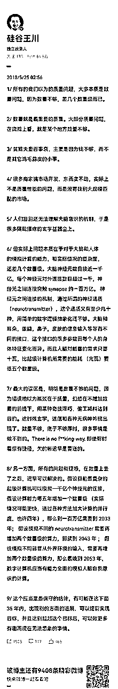

## 选苏州还是池州

这两个城市的话，我选苏州。

以后赚到钱也能有不少消费的地方，小城市你想花钱都不一定能花掉；

自由职业存在做大后需要组建团队的可能，但在池州团队基本组不起来；

很强的内求型的人，给他一个手机一本书，可能基本就够了，但如果不是一个很强的内求型的人，还是需要外部的一个城市环境给他很多新的信息输入渠道；

为自己的孩子考虑也应该在大城市留着，不然你的孩子可能还会重新经历你的向上之路，你经历过的走进大城市困难他还要再经历一遍，以前你可以靠高考，未来不确定性很高，高考这条路都未必通了；

副业和互联网项目不稳定，今天有明天无，还是留在大城市，留一条退路，实在不行，回去上班；

最重要的，还是你自己内心的想法，想过什么样的生活。

## 都是镰刀韭菜够用吗

人是很容易逻辑自洽的。

你想找镰刀，认为自己是韭菜，带着受害者思维，那么你会看到生财有术到处都是镰刀，每一个分享者都没怀好意，生财有术是一个锋利的镰刀架，感觉到处都要被割。

星球里面的分享是一部分，这部分的帖子我会从帖子本身的价值去做出判断，有价值就留，没有价值就删除，你看到的是引流帖，我看到的是项目和帖子本身的价值。

另外一部分是你通过各种隐秘的方式挖掘到别人的微信，加过去，别人要收钱培训或者答疑，然后哭哭啼啼你来找我说，生财有术有镰刀，是我让你去加别人微信的？

另外，我想说，放弃掉「白嫖」心态，对于任何人的私下答疑和指导都有要付费的预期，加一个人去问一些问题，你自己默认是要给别人钱的，要么就别去加别人，别人也没用义务免费答疑，这样你还能遇到一些惊喜，真的有人免费给你回答疑问了。

## 生财项目都失效了？

如果你能找到比生财有术更快分享更真诚分享的地方，也可以告诉我。

从来没有人无缘无故的把自己的赚钱方法分享出来，因为生财有术有一些氛围和机制，大家可以相对开放和真诚的聊一些自己赚钱的东西，仅此而已，不要抱太高的赚钱救命稻草的预期。

看分享的时候，重点看逻辑，看项目是否能跑通，看机会和空间，然后自己去组合出新的玩法出来，不看具体的方法。

## 一个小白，如何在最快时间内做到月入上万？

答案总结：流量吧，然后矩阵。做能做的，然后加能加的杠杆。

这得看多小白了，有些太小白，什么都不会，我也无回天之力。

假设这个小白是一个刚毕业的大学生吧，没在互联网上赚过钱，但有基础的计算机技能。我会在短期内给他挑什么项目？

先说说我的逻辑：

产品和变现一定是不需要他来考虑了，小白搞不定这些事，他只要也只能去搞定流量，直接帮别人卖或者推广已经成熟的产品。

付费流量他肯定也搞不定，太复杂，只能去搞免费流量。

他也肯定做不出优质内容去和平台交换免费流量，所以只能制造一些低质非 IP 内容从平台捞流量。

现在流量大一点的平台也就抖音吧，要想实现月入一万，不算很低的目标，那就是要大力出奇迹，投入时间要多，每天工作八小时以上，做很多很多视频，很多很多账号。

问题具体为：

每天工作八小时以上，做短视频流水线工人，每天套模板做大量短视频，传到抖音上去，靠数量博概率流量，然后推广一些别人的成熟产品 cps 或者引流到微信卖流量给别人。

进一步具体为两个问题：

什么类型的模板？

推广谁的产品？

你想到什么项目？

书单号，文案号，情感号，表情包号，抖音小程序推广，抖音图文号，抖音卖资料包，一些垂直领域的视频带货，抖音剪辑号推本地团购，。。。

还有哪些类似的项目？

卸载抖音，重新安装，不要登陆，顺着抖音刷一天，记录并点赞所有的没有真人露脸但挂着商品链接或者在引流的视频。

这些视频背后的项目，就是适合短视频流水线工人靠拼时间堆数量有机会能赚到 10000 元的项目。

小白也研究不出用什么模板，以及那些正在被推广的商品是从哪里找来的，所以需要帮他们找项目的人，替他们把模板提炼好，内容源头找好，商品推广链接申请好，甚至多个抖音账号注册好，前几个视频跑起来，然后交给他们。

想想就觉得累。

而且这样的项目不会很多，也不会很长久，因为平台不喜欢这样的内容，不值得作为长期项目来考虑。

## 赚长期的钱还是短期快钱

先说一句，所有的回答，都是我现阶段的想法，不代表是最优答案，也不代表经过了我的深思熟虑，我也会过一段时间就推翻我之前的想法。

很久之前，我和同事们开会我会有压力，我觉得没花时间提前看他们准备好的方案，没有思考清楚他们提出的问题，所以，我经常找理由延期或者拖着不开会。

直到有一天，我想清楚了开会的目的：

通过开会（沟通），我了解他们的想法，并把我当下最直接的想法和判断，清晰的告诉他们，这就够了，对他们的工作推进就已经有很大帮助。

在这之后，我对于开会和沟通就没有了压力，随时可以找我沟通。

说这个点，想表达的意思是，我回答大家的提问，不是觉得我要给你一个好答案，也不是觉得我自己牛逼非得分享点啥，如果那样想，我会有压力，会对自己有很高的期待，会拖延沟通和分享。

社群和公司有点像，都是组织，核心都是人，咱们互相多维度的交换想法，这是增强理解的第一步，有了互相理解，才有一些共识的可能，有了共识，社群才有凝聚力。

另外，我能把我当下的想法表达出来，可能就已经对一部分人有一些价值了，那就够了。

言归正传，回到钱大的问题。

对于我来说，短期赚快钱还是通过团队和商业模式设计来赚长期的钱？

雷·达里奥说：做小事和做大事的难度是一样的，所以要做大事。

我想说的是，做小事和大事的快乐是一样的，做大事还是做小事，都可以，重要的能够长期沉浸其中。

因为我觉得人的长期快乐来源，是沉浸在一些事情上，进入心流状态，也就是常说的能够活在当下，有点像寿司之神的活法。

而挑战大事，必然需要大团队，对于我来说，会进入到很多我很性格上不那么舒服的领域：与很多人沟通（可以干但不喜欢），做项目管理和推进，激励他人，提供情绪价值等等，在这个过程中，我会不断的「出戏」，无法沉浸在一些喜欢做的事情上。

所以，我倾向于根据性格特点，扬长避短的做一些规划，思考一些战略和机制设计，以能够让我以及团队，可以长期专注的做一些各自擅长的事情，哪怕是小事，而不是补短板去做大事。

不是以赚钱最大化作为目标，而是长期沉浸作为目标。当然，我相信，我的商业能力还是可以带着团队赚到一些钱的。

所以，短期赚快钱无法长期沉浸，构建组织能力和商业模式的匹配，以达到长期沉浸（长期活着）赚长久的钱，可能是我的选择。

也期待钱大分享对这个问题的看法。

## 财富的意义

马斯克说，金钱本质上是信息，是资源分配的数据库，是跨越时间和空间的资源配置。

那么拥有财富就是一定范围内配置资源的权力，财富越多的人配置资源的权力越大。

而很多学者认为幸福的本源主要是两个：基因的传承和影响力。

通过财富这种权力来配置资源，进而提升影响力，获得持续的幸福，这可能是我理解财富最终的意义。

## 生财有数的大道是什么

大道至简，这些大道理我们小学的时候就都听过，只是我们听的太多，习以为常而忽略了，反而被一些标新立异的概念和逻辑所吸引。

在我眼里，真正的大道都是如下面这样的：

诚信，本分，物美价廉，对用户好，对团队好，对合作伙伴好，赚取合理利润，多让利，注重产品，持续创新，保持长期健康。

## 重新开始不做生财亦仁要做什么

我可能会选择去做一个海外工具网站吧，闷声发财那种。

依据是：

海外竞争要小很多，国内太卷了，政策风险也大，做大了有不安全感。

回归我的老本行，做海外工具，我知道怎么挖掘需求，怎么和客户沟通，怎么做产品，怎么设计收费模式，怎么引流，怎么投放等，在我的舒适区。

海外工具站有一定的壁垒，不是小个体或者小团队可以轻易复制的，能活的比较滋润，做的好的工具站，一年也能有上亿利润，而且进可攻融资成为 SaaS 独角兽，退可守赚钱闷声发财。

海外还是非常依赖谷歌的搜索流量，短期没什么大的危机，做好了工具站，能力可以迁移到下一个工具需求再来一遍。

## 生财的危机有哪些

危机可能有几个：政策、破圈、人员筛选、信息和链接质量、内容产品化、方法论沉淀、团队培养、我、组织分配等。

现在对我来说，最难而正确的决定恐怕就是第六期能不能大胆提价，将人数规模控制下来，进一步做好筛选，来提升信息和链接质量，进而提升成功案例率，风险是人数和收入会大幅下滑。

很多事情知道容易，难的是知行合一。

## 如何看待生财遍地是成功案例

如果把赚到钱定义为成功案例，那么生财有术的成功案例率，确实比一般群体要高很多（但也不是遍地都是），我认为高很多的原因是：

生财有术付费社群的机制，把更容易成功的人筛选了出来，就像清华北大，通过高考机制，筛出来的都是最容易成事的人；

垂直付费社群内的人与项目、人与资源、人与人的连接效率更高，更容易产生成功案例；

成功案例会催生更多的成功案例，就像学霸会影响更多身边人成为学霸一样；

生财有术的运营会帮助一部分人更快的拿到结果，比如大航海小航海，可以规模化的帮一些赚到钱；

大家的注意力在知识星球这种产品形态里会被聚焦在在信息流里面，会让人感觉成功案例遍地都是；

成功案例如果有可复制性，那么就不算一剂春药，大部分生财有术的成功案例，都具有可复制性，听话照做，大概率能产生差不多的效果。

不必仰望也不必俯视成功案例，平视即可，取长补短，拿来有价值的为我所用，最终让自己变成一个成功案例。

## 价值观金钱冲突如何权衡

算账思维。

来，说个数，你觉得价值观值多少钱？

比如说，诚实对你很重要，现在报个数，多少钱可以让你欺骗一次你的朋友，就欺骗一下明白吧？

什么，不可能？1 万？10 万？100 万？1000 万？1 个亿？10 个亿？100 个亿？估计有一个值你会松口的，我也是。

当然，很多价值观是最底层的，比如对亲人好，生命健康，这些都是价值无穷大的，任何金钱利益和这些产生冲突，都是金钱利益靠边站。

通过这种算账方式，你能想清楚什么是最重要的，以及平衡价值观和利益的边界在哪里，不是在任何适合，好像违背价值观就是错误一样。

## 过去多少钱愿意买你现在的认知

能力不重要，但认知要倾家荡产借遍所有能借的钱买。

我深信一个观点，从统计结果上来看，一个人越有钱，他的认知越高，一个人认知越高，他能赚到越多钱。

这个认知是与真实世界的贴合度。

所以，为什么很多小商小贩比一些专家学者所谓大师更有钱，因为这些小商小贩通过摸爬滚打形成的认知，贴合了这个真实世界的运行规律。

当然，要排除掉那些不想赚钱的大学问家，那是另外一个维度了。

与那些有钱人在一起，就能更大概率的提升认知，察其言观其色，耳濡目染，天天和他们混在一起。

此处无意间给生财有术打了个广告，就不收你钱@亦仁 了。

## 赚多少钱够？

赚到多少钱才够完全是看自己的欲望，而人是能控制自己欲望的。

这个世界上绝大多数消费都是「骗局」，是被虚构出来的各种概念，包括奢侈品、豪车、大房子、好的化妆品、传承、家族、美丽容颜、青春、高级感、阶层、好的教育、使命等。

如果能意识到这些都是「骗局」，你不需要成为这个骗局的「受害者」，那可能就觉得现在赚到的钱已经远远够了，你自由了。

不仅物质自由，还精神自由。

我现在的消费欲非常非常低，除了 19 年买了辆特斯拉，最近这几年，没买过什么贵的东西。

但作为男人，我觉得照顾好自己的家庭是必须的，不管出现什么问题，妻儿父母的生活不能受影响，所以这个层面，多赚一点钱是有帮助的，与此同时，我又深刻的接受每个人都有每个人的命运，你安排的好未必是好，你没有安排也未必是坏，所以不会无止境。

这个点上，我逻辑自洽了。

那我有什么硬核需求吗？

当然，我需要寻找一个使命感「骗自己」，让自己不要浑浑噩噩的过完这一生，对，使命其实也是「骗局」，但自己好好的把自己骗过去吧，毕竟还有好几十年要活呢，对吧。

现在这个使命感就是生财有术吧，和大家一起多赚点钱，我还能发挥点自己的特长，这样就挺好。

## 项目失败如何调整心态

心态上要对自己诚实，有错就要认，挨打要立正。

项目进展不顺利，不管是别人引起的，还是自己引起的，归根到底，还是自己能力不够，既无法做到预防，也无法做到快速调整，才会陷入到不顺利的状态。

充分的归因到自己身上，才能把事情往好的一方面推动。

但很多人归因到自己身上，却没有形成逻辑自洽，最后变抑郁了，觉得自己哪哪都不行。

充分归因到自己身上，然后积极改变能改变的（积极主动），接受不能改变的（我是普通人，很多事情改变不了，改变不了是我能力不够，能力短期也提升不了，那就不必焦虑了吧），这才形成逻辑自洽，坦然面对一切不如意。

## 为什么表达欲下降

最近这半年，我的表达欲下滑严重，你如果加过我微信，可能都没看过我发朋友圈，不是你加了个假仁，确实是没有发，作为一个社群的星主，也挺奇葩的。

不想表达，一方面，是见的越多越觉得自己的浅薄，还是多听多想少说，另外一方面，很多问题已经感觉反复聊过很多次，没什么大的新想法，而且现在一些在思考的问题，好像说出来需要比较多的背景铺垫才能被理解，觉得很累干脆就偷懒不说了，我也不想为了去打造人设 IP 而表达，那些对我不重要，所以说的就更少了。

当然，理性上我可以说服自己，公开表达是一个很好的大家沟通增进理解的方式，感性上也能从大家的反馈中获得快乐。

## 找不到项目

不直接回答你的问题，但我想给所有圈友提个醒：

不要被别人整出来的项目概念框住你的思维。

很多人找项目，张嘴就问，现在有哪些项目啊？

然后别人会告诉你：淘宝蓝海，外卖 cps，tiktok 带货，抖音直播，抖音知识 IP，抖音同城号。。。

我就想问，这和那些五六线人想到项目，就是想到去开个店有什么区别？

你都在生财有术了，难道还只是看到这几个项目？

将生财有术精华帖里面涉及到的需求流量产品变现模式进行充分组合，可以产生上万个项目出来，且很可能是你的独立赛道。

上万个项目，还不够你挑？

再次提醒，请所有人独立思考，不要再被别人定义出来的「项目名」框住你的思维，生财有术里面有 10000 个可以赚钱的项目，仔细去寻找。

## 金融赌徒怎么解

还想什么，赶紧找个项目赚钱去吧。

只要不下赌桌，唯一的结局就是本金输光

## 两类群体，赚谁的钱

显然是老板群体，一定要做有钱人的生意，赚有钱人的钱，帮别人赚更多钱的生意。

老板有钱能花钱，程序员太聪明大多数问题都可以自己解决，舍不得花钱。

## 合伙人懒散怎么解

散吧，做自己的号；

把账号给对方，让对方给你发钱请你。

## 优生差生为什么有差别

同一个班，有人上清华，有人可能本科也上不了，为什么？

因为人是不一样的，起点、环境、能力、投入都不一样，必然会产生不一样的结果。

如果盯着那些人产生的结果，而忽略了他甚至他父辈之前的积累，就会产生焦虑和自我怀疑。

更积极的视角是，我这一次参加航海，我自己的成长和突破是怎么样的，我学到了什么，我相比之前变化是什么，关注自己的变化，心态会更好。

同时，我们应该庆幸与那些做的好的人是同一条船上的战友，因为我们可以更近距离的学习他们如何做到的。

日拱一卒，加上时间的复利，成长会很快，说不定有一天，我们在别人眼里就是榜样。

## 负债 100 万如何快速项目获得反馈

分享给你一个消息，距离我丢掉所有的 btc，今天，大概是整整一周年了。

其实都可以走出来的，只是会慢一点。

降低预期，慢慢来，先定一个项目跑通赚到 100 块钱的目标，然后是 1000 块钱，然后是 10000 块钱，问题会一点点都被解决的，搞 IT 的人，很聪明，多点耐心，不懂的多去请圈友，大多数圈友都很热情，也是愿意帮你的，和一些圈友说明你的情况，他们可能会更愿意帮你了。

正常情况下，可能需要多试几个项目，才能摸索一点感觉，那就多试几个吧。

都来生财了，还愁 100 万赚不回来吗，早晚的事。

## 上班抑郁咋办

可以先从生财有术找一个副业，干到副业收入和工资差不多就可以撤了。

人生开心最重要，实在不开心就别憋屈着了，人生就短短几十年而已。

## 怎么拍第一条抖音

第一条视频怎么可能会满意，不满意很正常，继续干。

不要完美主义，先鲁莽的干起来，闷头拍个几十条视频发出去，获得一些数据上的反馈，再回头琢磨别人的经验，心得和坑，才能感受更深。

学会游泳，不是因为读了好多游泳相关的精华帖，而是跳下泳池呛了不少水之后才学会的。

## 传统企业该不该 如何做抖音

如果只是企业管理培训，我可能会建议你抄博商的模式。

但是农牧企业的管理培训，我不知道这样的群体有多少，如果群体本身不多，没太必要专门通过短视频去获客了，我会把短视频团队替换成一个强销售团队，用强激励去驱动他们获取 leads，带到线下听体验课，然后通过会销转化到高阶课程。

还有，培训视频的切片别忘了分发到抖音，说不定会有惊喜。

如果只是企业管理培训，我可能会建议你抄博商的模式。

但是农牧企业的管理培训，我不知道这样的群体有多少，如果群体本身不多，没太必要专门通过短视频去获客了，我会把短视频团队替换成一个强销售团队，用强激励去驱动他们获取 leads，带到线下听体验课，然后通过会销转化到高阶课程。

还有，培训视频的切片别忘了分发到抖音，说不定会有惊喜。

## 现在买卢布合适吗

谢谢你体贴的给我备注了卢布是俄罗斯币，但我真不知道是不是好时机。

我的一个投资原则：不懂不买。

另外我常说的一句话送给你：

好机会天天在错过，也不差多错过这一个。

## 直播人数多但是不精准不出单

这个问题问我肯定回答不了，花钱或者花龙珠去付费咨询高手，才是最快的路径。

在线峰值 3000 人，你就算卖空气也不止卖一两单了，要啥精准，赶紧找专业的高手请教吧，也可以找这一期大航海的船长@高欣 付费咨询下。

## 如何运营免费群

你要解决的最关键问题，不是如何把这个群运营好，再考虑如何转化他们，而是：

如何直接转化一部分人，然后服务好这部分人，吸引更多的人。

顺序不要乱。

先设计付费产品，然后再引流转化，简单直接，不浪费时间做那么多烘托。

只要你敢收钱，你发现就能收到钱，收钱后你能超预期交付，就能收到更多钱，进入正向循环。

把所有的时间花在你的付费客户上，而不是没有花钱的人身上。

## 利润被疯狂抢占如何解

这个问题，我帮你请教了一下龙珠俱乐部，收集了一些回答。

核心的几个观点转给你（另外，我觉得你尽快搞到龙珠进龙珠俱乐部才是正经事，一年内可以随时和一帮高手深度请教交流）

以下转自龙珠俱乐部成员：

既然不能避免竞争，这样每个月有钱赚也挺好

要问问他有没有更好的选择，时间成本怎么样

可能同行也在纠结要不要干

他了解这个同行的情况么，分析自己和同行的优劣势，在这个项目里他的相对优势和时间成本

这里面交代的信息不全吧 广告是 5 万，是几个人做，有没有一些其他的成本，感觉停下来，利润应该没有 15

最后都变成了给广告平台打工，领一份微薄的工资

估计利润很少了，但是不甘心，因为退出同行也不用广告了，直接全垄断

能否把对手变盟友

小众项目，可以一起垄断的

招个人和对手接着干，然后自己空出来去找更大的机会。

细分行业没有护城河的产品，最后可能都会遇到类似的情况。

来了个时间成本更低的主，对于利润要求更低，愿意投入更多时间，原来的人被挤出去或者看不上这块小市场还要去竞争

如果招的人交付出去不用太多时间精力成本，挺理想的

把招的人培养起来了可能又多了一个同行 这种怎么办

那可能会多出一个问题，这个人会了后走出去单飞，多一个对手[破涕为笑]

既然同行有一些手段，说明这是有方法可循的，优化广告多好

看这位老哥描述，目测现在应该利润不多，既然是副业，看时间成本和优势会好一点，和我当时做老年知识付费挺像的，当时我的获客成本公众号 10-20 块一个进群，也就大半年利润不错，后来出来不少公司，广告成本三倍了起码，对手团队人还多，他们估计也不赚钱，我就在外地找了个远程办公，自运行了，主要老用户也几千人不能放弃，反正每个月就一点点利润，但是不焦虑也不累，竞争对手后面也都倒闭了，加上流量形式也变了，大家更倾向个人 IP 类的老师，后来总结，有的时候不好做，不一定是竞争环境的问题，看不到的市场环境可能关系也很大

1 开辟新的流量渠道，2 拉拢上游供给资源，3 派个人去对手摸底

只要不亏钱，肯定接着干啊！

没有护城河的产品，单靠广告购买流量的话优优利润，这种模式比较简单，很难阻止别人进入，可以在广告渠道+客户转化率 上多下点功夫！ 以百度推广来说，单次点击的成本其实大家都是一样的，但是网站的转化率，客户咨询的转化率却可以差很多！

熬死对方是一种策略

做点实业，，我们都客户基数又又又裂变了一次 出纳离职了

但是要保证自己活着

以我们产品经验看，需要增加增值服务，提升 arpu 值，然后赚到的钱再反哺流量采买

产品门槛低，靠广告购买流量，广告也占自己的大部分成本的，这种生意模式本身容易模仿没有护城河，但是可以多花点时间研究转化率上， 让推广+成交率变成自己的护城河！

我是做落户的，也是没什么门槛，但是转化率高的可以 8-10%，低的 3-4%，确实差很多！

双寡头垄断，通常可以沟通合作一下。电商的经常这样

继续干啊，能找到一个只有俩人竞争的行业，多幸福

我知道的每个项目都几百人竞争

慢慢降低时间投入，再看一个其他项目就行了

## 公司招人吗

最近正在策划下一个会员日（2.18）的活动，主题可能是：

生财有术春季项目与人才连麦会。

生财有术团队也会作为其中参与方之一，期望招募优秀人才。

还在策划中，有兴趣的点个赞，人多就搞。

## 超市三年亏损，怎么搞

战略主要有三种：总成本领先战略、差异化战略和集中战略。

目前看上去，竞争对手的综合实力比较强，规模比你大，你很难在总成本上领先他们。

集中战略是服务特定买方、产品类别或地域市场，两家都是超市，卖的基本都是百货，很难有大的区别。

唯一可以尝试的是差异化战略。

关掉一个生意是容易的，但失去这么多年的积累是困难的，别急着关闭，再在生财有术看看，找找机会，甚至可以考虑把超市作为一个线下拉新的地点。

我给你三个建议：

停止价格战，选取差异化战略，考虑追求服务的差异化；

生财有术组织的门店私域小航海计划一定要争取上船，预计 3 月初开始；

出门找圈友交流学习，可以定向的做一些咨询。

## 亦仁工作日休息吗，怎么休

您工作日会主动休息吗，如果会，一般是什么时候，休息多久呢？

休息或者周末的时候应该如何克服这种觉得休息就是浪费时间的愧疚感？

休息是工作的一部分，或者说工作是休息的一部分，都可以，看你怎么理解，人生就一件事，为了休息或者为了工作都是 OK 的。

对我来说，工作日我白天用脑比较多，晚上回来后休息为主，陪娃、看书、看剧、刷抖音。

工作、创业或者赚钱，它不是一场有限游戏，以争夺某一场战役的胜利为结局，而是一场无限游戏，无限游戏以留在游戏中为核心原则。

休息是为了让你更好的恢复精力，以继续在游戏中存活，所以休息非常重要。

另外，实际上在工作、创业或赚钱中，起决定性作用的，不是你有多拼多努力，而是你在关键阶段做出了正确的关键决策，这依赖于你保持清醒和深入的思考，进一步依赖于你有足够多的放松、深度的休息。

所以，好好休息，不必自责。

另外，为什么生财有术周末两天都要禁言，也是因为你们要休息、生财有术团队要休息、我也要休息，既然是无限游戏，那就不争一朝一夕。

## 生财营销话术怎么设计-7 点干货

其实这不是一个营销话术的话题，而是一套产品如何从 0 到 1 的话题，涉及的面很广，很难三言两语立刻让你理解。

我给你 7 个方向，方便你学习和思考，也是借题发挥和所有生财有术圈友分享了。

换位思考洞察用户需求

充分沟通，站在客户的立场和角度，理解用户的需求，这是他购买的最真实的理由。

需求不对，靠冲动和新鲜感带来的消费都不长久，总有一天客户会醒悟，大骂一句被忽悠了。

基于用户需求设计话术/产品

什么叫产品？

万物皆产品，只要能满足需求。

一套话术，一段文案，一个眼神，一个电话，一篇文章，一个课程，一个商品，一个咨询，一个关心，一套方法论，一本书，一次交谈，一个回答，一个社群，一本日历，一套方案等等。

以上皆是产品，只要能解决对方的问题。

从这个角度，我们说创业要有自己的产品，是不是感觉创业容易多了？

给客户完整解法不让用户思考

客户的所有顾虑和疑问你都已经考虑到，并提前体现在产品上，或者提前告诉他。

把客户想成是一个脾气暴躁的、没有耐心的、智商不高的、贪心虚荣的一个人。

在这个客户说之前，你就满足了他的需求，你的成交转化率自然就上去了。

产品专业性稳定性便捷性的介绍

产品本身好之外，还需要专业的呈现，也就是价值包装，让用户能清晰的感知到，这产品太好了，这特么就是我想要的，众里寻她千百度，快说，多少钱？

用自己的短期利益让出换取客户的长期价值

你以为上面你想到的别人想不到做不到吗？太天真。

让出一部分你的利润，以让人舒服的方式转让给客户，满足客户被照顾、专属待遇、占了便宜、有面子等感受，最终成为你的铁杆客户。

想想豪车毒老纪的例子。

真实真诚不以成交为目的，而以帮助用户解决问题为目的，恰好你的产品非常精准的满足了用户需求

如果你定位做一个销售，那客户永远是你的对立面，客户和你的利益之间的博弈永远存在，要么你多花要么我少赚。

换个视角，定位成这个问题的解决专家，这个问题分为四大类三十六小类，每类最好的解法是这样这样，你的这个问题属于哪一类，我推荐你去买隔壁的什么，我的这个产品对于后面三类的，如果你有需要来找我。

你听了感觉怎么样？

客户是不断成长的，未来他有需求第一时间会想到你。

就像有一些老板要加生财有术，我说的很明白：老板，生财有术主要是讲赚钱方法，定位就是术，讲的是如何找项目、做项目，如何赚到十万、百万、千万，你现在的体量建议听混沌的课，我也在听，帮助挺大。你不差钱，那也买生财有术，就当随便看看了解大家目前在玩啥。

整个成交体验中，让客户充分的超预期，给出部分利益和合适的体面的理由让客户转介绍

记住一个点，没有几个人是为了赚一点分销费用帮你转介绍。

所有转介绍的前提是，你的产品过硬且超预期。在此前提下，给出用户帮你介绍的利益和思路。

这里面的思维要从「用户思维」转成「用户的用户思维」，这可以帮你更快的达成转介绍。

没有人想当一个赚朋友钱的人，但我们都想当一个帮朋友忙的人。

说了这么多，你会觉得这事不简单，甚至有点难，但是难却正确，才是你的核心竞争力，对不对？加油吧。

## 宝妈怎么合伙做抖音

既然之前没做过，那不如借着这个机会一起去干吧，不然不知道又到什么时候才能行动起来。

先约定一个分配比例和如何分工约定，白纸黑字写下来，可以的话最好注册公司，然后做好最后她自己去单干的心理准备，反正也亏不了啥，你赚的都是实战经验。

换个视角，你就当帮一个朋友做抖音，她开始做了你才可以真实的摸摸水温如何，最后发现她还给你分了些钱，当惊喜了。

这个事，你要主动推进，哪怕不赚钱也要干。

## 视频怎么转换无损格式

前段时间，听小小包麻麻 CEO @贾万兴 老师分享，他说了一个点，我印象很深刻，他说：「我们这些所谓老板啊，无非是信息获取能力比别人强一点，所以认知提升的快」。

你说的这个问题，我不知道具体答案，但是我可以告诉你，遇到这样一个具体的我不会的问题，我会怎么办？

充分用搜索引擎， 百度、搜一搜、微博、知乎、Google、Twitter、Youtube 等；

特别是 Google，搞定 Google 搜索，对于效率和信息获取质量的提升，不是一点点，花多少钱都值得，这是生产力工具。

切换不同的关键词去搜索；

99.99%的问题，都在搜索引擎中能找到答案。

找不到，只有一个原因，搜索的关键词不对，需要不断的换关键词，然后从搜索结果页里面，寻找到更贴近想要结果的关键词去搜索。

多尝试几次，保持耐心，就能找到结果。

要保持一个好习惯：能搜索到的，不去问人。 不断的锻炼自己使用搜索引擎的能力，越往后，很多东西搜索一次就能找到答案。

只有这样，你才会不断的敢提出更多的问题，不管是好问题还是蠢问题，搜索引擎都是超级耐心，问题牵引着咱们开挂成长。

没有问题，没有成长。

付费问人；

这里面要有一个习惯，为提问付费，钱多钱少是另外一回事，但是只要向别人提问，就记得先发个红包，这个习惯会帮助你以后越来越高效的获取到高质量的答案。

对了，谁帮忙回一下上面的问题。

## 如何理解“保持真实”

在我眼里，人和人的竞争，本质上是对于世界运行规律认知的竞争。

在商业上而言，商业上的竞争，本质是对于商业世界运行规律的认知竞争。

而世界，自有其样，不因人的意志而改变。

保持真实，对我而言，就是让自己的认知，尽量的去贴合世界本来的样子，越贴合，就是「真」，越不贴合，就是「假」。

那世界是什么样的？

无数大科学家穷尽一生的研究给我们展现出来了精彩的世界观。

对我而言，我的底层世界观是「自然选择」：物竞天择，适者生存。

## 创新电路板如何海外建立供应链

技术壁垒如果不强，那其实就是个信息差。

信息差迟早要被同行看到并抄袭抹平，如果有信息差，那就趁着同行还没反应过来，尽可能多的快的去赚钱。

或者能力允许的话，继续增加研发投入，扩大技术壁垒到同行难以复制。

在海外注册公司授权，隐藏供应链，只是短线操作，低估了同行挖掘供应链的决心和能力。

以上，我不成熟不专业的看法，欢迎专业人士拍砖。

“技术壁垒不强就要利用信息差。但是信息差很快就会被摸透。最关键的还是提高技术门槛。”

“当你的技术在行业不足以形成绝对壁垒，很容易被复制抄袭时，就要采取以价换量的策略，在你的信息差，技术优势还在时，在保证利润的前提下，用绝对的价格优势，尽可能最快的最多的占领市场，用空间换时间，时间上形成一定的壁垒，然后再用利润投入到研发形成更大的壁垒保证利润，如果产品可复制性强，专利保护不够，那就一轮接一轮的信息差赚钱，通过技术更迭不断保证市场领先地位，直到技术无法再突破。说白了就是用低价占领市场，让竞争对手不值得入局”

## 该不该买一个吾悦交通不便捷的店面

不懂不买，能力圈里面做事比较好。

如果非要做，就先算一笔账，预期成本和收益怎么样，回报率是否符合预期，记得要把机会成本算进去。

如果算不清楚，就别买了，节省时间少操心。

## 内卷想搞副业

所有的副业，都没有长久发展的可能。

你想想，作为副业都能赚到钱，能有啥壁垒？

但，这不影响选择一个并立刻开始。

绝大多数好项目，起点是一个别人根本看不上的垃圾项目，在做的过程中，经过仔细专研和迭代，不断突破边界，并经历反复横跳和回退，最终，打开了新世界。

问我选哪个副业，我都只有一个回答：

随便选哪一个，开始就行，反正终点都不是你一开始选的那个。

## 疫情怎么搞线下流量

这个真没啥思路。

但是提醒你，要提前储备私域流量，把用户添加到微信号，定期做一些抽奖免单活动。

接下来要做的最重要的事情，如何把工业园区的人都加到你个人微信上？

## 比特币被钓了怎么办

报警，找关系推动警方重视立案，拿协查函找平台要具体信息，找第三方区块链网络安全帮助调查。

然后做好找不回的心理准备。

如果能定位到是国内的人，那么还有一丝机会，找警方或者一些朋友帮助进一步定位。

心情不要太紧张，也不要过于自责，放松一点，天没塌，你看我，还好好的对吧。

## 职场怎么送礼 对大客户紧张怎么办

第一个问题，参考（脱不花送礼清单）

https://dedao.feishu.cn/docs/doccnnRJyL5FUxyfYMyloSJDUZy

第二个问题，

紧张是正常的，我有时候遇到很重要的人物，也会紧张，所以，紧张不要怕，没事；

能成为重要人物其实不看一些细小的点，相反，你要抓住他最关注的点，在那个点上，做到超出他预期。

其余的点，能做好更好，做不好也不要自责。如果这位重要人物因为在无关细节上反复吹毛求疵，不如放弃，没什么重要人物是离不开的。

## 播客行不行

有不少相关内容，搜索结果页多等几秒，再试试。

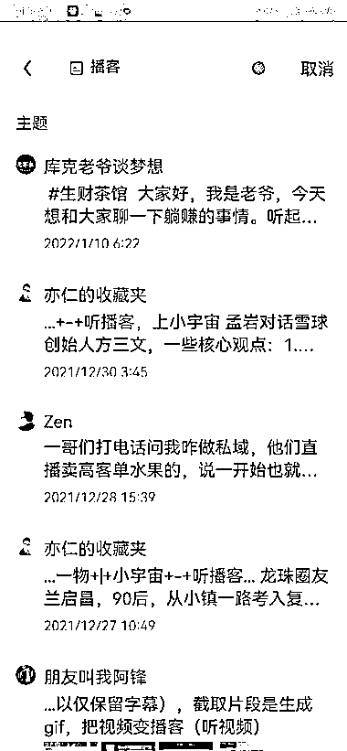

## 主业忙不好找副业

要么有类似需求的人搞个众筹？

20 个人一组，每个人花 100 块钱，邀请一个圈友，每周给你们直播一次，讲讲这周的项目和机会。

圈友帮你们看文章、看项目甚至做测试，删繁就简，过滤掉无关信息，每周花一个小时，给你们讲讲现在有什么赚钱机会。

你觉得如何？

## 有一个船舶公司怎么用起来

这么大的生意，我就不乱建议了，有专业的圈友可以说说。

“行业事行业决，你公司和行业里有什么结算模式？这些模式有什么痛点可以切？金融无非主体信用、抵押信用、交易信用三类。主体信用够强估计就不会在这里讨论；朋友你公司做的挂靠，所以抵押信用也无关；构造交易信用要基于已经有的和可以构建的交易模式来设计，例如你帮挂靠船舶收单，交易数据积累够能论证回款的确定性，这些应收款就可以拿去融资。具体情况具体分析。”

## 航海的产品思维--2000 字很干

第一、关于理念与价值观：

做正确的事情，而不是容易的事情，先考虑正不正确，再看难不难，难有难的解法，简单有简单的解法，但不正确就是不正确；

共创思维和参与感思维，生财有术其实是一个超大规模超长期的真人秀节目，我们所有人都是这场真人秀的参与者；

生财有术的运营应该有的姿态：不俯视，不仰视，而是平视，双向选择，双向奔赴；

做有复利的事情，用平台运营的逻辑，而非品类运营的逻辑，来考虑航海运营；

小白思维与不主动思维：默认用户没基础懂的很少不主动不利他不真诚，在此基础上去思考产品如何设计；

没有稀缺，没有重视，没有重视，都是白忙，如何通过机制流程的设计来实现用户的重视；

与认可我们的人玩，而不是去讨好迎合不认可我们的人；

少人多 SKU 原则，不能因为增加更多航海选项生财就要往团队持续扩张的方向走，而是要不断的设计机制流程，来实现团队的人数更精简。

第二、关于思考与决策：

要全局思考，在生财有术整体的框架下考虑航海的相关问题，航海的很多问题往往依赖更上一级的生财有术社群的某一些问题被解决掉；

要事优先，反复思考什么是重要的事情，而且要压倒性的投入时间思考什么是重要的事情，无法判断什么是重要的事情，根本上是思考的太少；

我们如何做决策：应该真正的了解发生了什么，然后清晰冷静独立的思考，做决定的人一定要去看大量的细节，才会有做出正确决策的可能性，不然都是抓瞎撞大运；

我们认为应该是怎么样的，对事情的发生应该有预期，有判断，有基础的数据预估，而不是结果发生了，我们跟着这个结果去适应；

想不清楚问题就会被别人带着走，别人说啥你都觉得对，本质上是对于什么是重要的问题缺少思考，缺少自己的思考基本盘；

任何问题都有解，只是成本问题，我们要投入多少成本，取决于战略关联性及长期价值判断，其实也是算账思维。

第三、关于产品和运营：

业务负责人要花更多的时间去做流程设计，减少团队人员在能力外的思考和决策；

不能将我们确定要拿到的核心成果放在产出不确定的人身上，要通过前置工作将随机性变成确定性，80%的概率本身也是一种确定性；

要提前制定规则，让规则唱黑脸，这样我们就可以唱红脸，否则很容易得罪人；

运营先行，产品跟上，要逐步实现运营机制与流程的产品化；

无运营不发生，互相帮助是一系列运营动作之后的结果，而不是要告知用户的一个理念；

要有掌控感就要了解每一个细节，需要更关注细节，不仅关注统计数据，统计数据中的每一个数字从哪里来都要十分清楚的知道；

不看数据不做运营，没有量化就没有发生。

第四、关于团队协作与管理：

给出更清晰的指令，让团队基础成员尽量专注在把事情做的更好上，而不是想怎么做事；

团队沟通要朝着极致坦诚的方向走，做到达成一致，信息传递，重要的是能不能做到把我不理解的、不赞成、不认同的全部说出来，极致坦诚；

不用特别在乎信息损耗了怎么办，不停讲，反复讲，他会拼凑出一个更完整的信息；

团队 Leader 的一个核心价值就是要把信息同步出去，让团队成员看到全局。做决策本身不是这个人有多聪明，而是看到的信息更多，做出的决策就更准确；

要明确责任人，让别人知道这个事情是他负责的。

第五、关于沟通和信任：

出了问题不可怕，犯错也不可怕，但一定要把问题和负面情绪暴露出来并放在明面上，而不是遮遮掩掩；

如果发现对于合作方要求高，从而导致无法更好的发挥价值或者发挥受限，就需要将对方的职责分而化之；

运营不讲大道理，有些大道理只适合特定资历的人来说；

航海的过程展示，完整的展示过程可以更好的帮助我们和圈友建立信任，双向奔赴，一起达成成目标；

暴露问题本身就是在解决问题，极致坦诚的沟通，适用于生财有术团队，也适用于生财有术团队和圈友。

第六、关于活动运营：

喊口号的节奏感，把航海想作一场拔河比赛，我们是旁边的指挥，需要通过喊出口号的形式，让大家感知当下什么在发生，组织者呈现出来的感觉，不是悄无声息开始悄无声息结束，而是有节奏的要有声音喊出来，让所有人知道节奏是什么；

非常重要的事情，得多次反复强调，才能让大家有一点点感受。如果真的认为这个事重要，做成表情包、案例传播、不同形式反复说；

要及时的同步预期，在开船之前，明确的知道我们能做成什么样，不断的同步给大家我们能做成什么样，将要做成什么样，否则达不到期待就会迎来失望；

有奖才有惩，没有奖励就不惩罚，不能不奖励只惩罚。没有定量就无法奖惩，事后奖励没有效果，要形成更好的管理和协作，要事先说清楚要什么给什么；

你想鼓励什么，你就要告诉大家什么样的动作和行为是被奖励的；

奖励不一定适用于所有场景，有些场景你给奖励是减分的，可能会导致失去内在的动机。

## 生财有术背后的运营逻辑--4000+很干

这篇文章，是我上周末在生财有术私董会上做的分享，同样分享给大家，希望与大家更好的同步想法，增进了解。

以下为分享全文。

做人就是做公司

每个公司都是创始人世界观的一个映射。创始人有什么样的性格和理念，大概率就会将公司打造成什么样。

开放的人和封闭的人，乐观的人和悲观的人，长期主义的人和短期主义的人，打造出来的公司注定是完全不一样，甚至是相反的。

在准备分享的这篇过程中，我才发现，生财有术社群和这家公司，被我的性格和理念深度影响着。

每个人的世界观都是不一样的，也是主观的，底层逻辑也有很多差别，我的决策背后的逻辑，也是很主观性，提炼出来分享给大家，一方面是我的自我输出和总结，把自己的想法表达出来，这样能和大家有更多碰撞的机会；另外一方面，生财有术私董会的很多老板都是生财有术的深度参与者，长期支持和帮助生财有术发展，将很多运营动作背后的想法分享出来，能更好的让大家理解达成更强的共识。

不以做大做强为目标

上大学的时候，我挺穷的，学费是借的，所以大二开始，就开始找各种赚钱的方法， 尝试过各种路子，最后真正算赚到一点钱的是倒卖 u 盘，从淘宝低价买，在学校高价卖，高峰期一天能赚几百块钱。但也有很多烦恼，客户的压力，货源不稳的压力，资金周转的压力，当然就在想，还是做的太小了，什么时候我赚到 100 万，我可能就没这么多烦恼了。

后来读研的时候，我继续尝试各种项目，终于赚到了 100 万那一天，但是那个时候的我，压力和烦恼比之前更多了。

我觉得可能还是我钱赚太少了，也许当我的收入到 500 万、1000 万的时候，我的烦恼和痛苦就会减少，但事实上每次都相反，我发现我的烦恼越来越多，我的时间越来越少，要解决的问题越来越难。

我可以预料到，我以为的赚到更多钱，做更大的事情，让自己变的更强，自己就会更快乐，但大概率烦恼和痛苦只会增加而不会减少。

意识到这点后，我就不再以做更大更强为目标了，我将我的目标改成为长期深入的做有一件有价值有意义且我擅长的事情。

从有限游戏模式调整成了无限游戏模式，不管定什么赚钱目标，赚到那么多钱的时候就会陷入到迷茫，但如果选择长期深入的有一件事情做，这个目标永远无法达成，那么这个游戏就永远无法结束。

我发现我自洽了。

意外的惊喜是，当我不再追求高速增长做大做强的时候，我发现业务反而在增长。

我把注意力专注到解决具体问题，解决难题，而赚钱的本质是创造价值，创造的价值越多，赚钱的越多，短期可能有波动，长期一定会回归均值。

优先做难的事情

最近几个月，生财有术的变化挺大，主动在 418 的时候将价格提的更高控制下会员人数，之前已经跑的很成熟的航海机制在 6 月份的实战中也基本推翻重来了，将现在的用户运营重心放在了那些更不太容易出成绩的人身上。

这背后我的思考是，简单的问题解决只是时间问题，但是难题的解决却是需要团队集中大量精力和资源不断试错才可能有一点进展的地方，通过目标拆解路径，分析其中最难解决的核心问题是什么，优先解决这个问题，这个问题解决了，其他问题的解决更快，所以生财有术整体上大多数时间会优先考虑解决那些看起来更难的题。

相比于拉新，把人留住更难，所以提高价格降低人数，先去把留存和续费真正的做好再去进一步扩大；

相比于建立活动的势能和口碑，大规模带动人下场实战出成绩更难，所以航海机制进行了大幅优化；

相比于很活跃很主动的用户，那些不活跃不主动的人赚到钱更难，所以优先想办法出对应产品带动大家下场实战。

创业赚钱与考试都是在做题，不一样的是，考试是限定时间，谁拿的分越高，谁胜出，一般的策略是先尽可能把简单题做完，剩下的时间解决难题。

但创业赚钱是时间无限，难题解决的分数可能是简单题的上百倍，这个时候，优先解决难题，从投资回报率的角度来看，是赔率更高的决定。

所以，一件事情中的难的部分和简单的部分，我会优先选择先去做难的部分，这是生财有术很多决策背后的逻辑。

认识并接纳自己能力有限

高中有一段时间，我非常痛苦。我是以全校第一的成绩考进高中，当时老师和身边的同学，包括我自己，都对自己有很高的期待。

但是自我良好的感觉没多久，我就发现我的物理考不好，在很多重要的考试当中都比别人差很多，为此我可能成为了全班学习时间最多的人之一，最后还是结果很差。

因为这个事情，我陷入了长期的深度的自我怀疑，并且最终经过多次挣扎后接受了：我是一个物理学渣，我能力有限，真的是一个普通人。

现在回头看，这个认识对我的帮助其实非常非常大。

如果能在人生很早期认识到自己是一个普通人，是一件非常幸运的事情。

认识并接纳自己的能力有限，我可以集中精力做自己想做的事情，不再想去迎合其他人；

也没有任何的 IP 包袱，生财有术的任何人都可以随时吐槽我我也不会觉得生气；

因为能力有限所以注定我只能聚焦在一件事上；

也因为知道自己能力有限，我在生财有术一开始的时候，就觉得将来过多的将亦仁在其中，对生财有术的发展并不利，所以很多决策背后都是将我弱化，能不需要我的时候，就不需要我。

认识并接纳自己能力有限后，也就放过了自己，不会太苛责自己，也经常很容易和自己达成和解，另外带来的一个非常棒的好处是，我很容易理解大多数和我一样的普通人，因为我和他们一样。

生财有术的很多决策会感觉生财有术和大家是一个平等的姿态，背后是真正的认为，我们大家都是能力有限的普通人，同是天涯沦落人。

做擅长的事情

创业的魅力，就在于有无数种方式去回答同一个问题。而大多数人解题方式非常单一，就是学校教的，或者大多数人正在做的。

很早就认识并接纳自己是一个普通人后，我觉得和大多数人竞争，我可能不一定竞争的过他们。所以一定要不一样，一定要差异化，是刻在我骨子里面的。

每次选择都选一些和大众不一样的选择，慢慢的就会形成一些自己的独特能力和独特优势，这种独特的能力和独特优势又会产出不一样的成绩，就形成了一种正向飞轮。

有一天我看到一句话，战略就是扬长避短，我发现我好像歪打正着做对了一些选择。

我对术很理解，没有系统理论，所以产生了生财有术；

我喜欢研究产品，我不擅长管理团队，不喜欢和太多人打交道，就把公司像一个产品一样拆解生财有术的战略和业务拆解，我变成了流程中的一环，而不是围绕我。

回头看，这些都是扬长避短。成年后，真正的去改变自己的性格是非常难的，与其天天和自己过不去，不如顺应着自己，做一些自己擅长的事情，也能获得不错的回报。

计算开心指数

如果让你每天发朋友圈，一年可以多赚 100 万，你干不干？

如果让你直播几天，就可以多赚几百万，你干不干？

以上这些，都是我的团队的人用来忽悠我的，特别是 418 前几天，他们就差拿着刀架在我脖子上让我直播了。

我自己有一个开心指数，做决策用开心来衡量，比如做一个事情，必然有开心的部分，也有不开心的部分，比如赚 100 万，我的开心指数是 100，但为此需要消耗的开心指数是 110，比如牺牲了我的休息时间，牺牲了我阅读的时间，如果开心指数是负的，那我就不会做。

总开心指数是正的，那就值得做，总开心指数是负的，那就不值得做，非常简单好用的一个判断公式。

有一些特别不开心的事情，这个开心指数就会下降的特别厉害，除非带来的回报特别特别大，才可能考虑。

越是去追寻生命的意义后，越是发现生命没有意义，所以在这短短的几十年，没有什么事比让自己活得开心一点更重要了。

想要什么，先让自己配得上

很多时候，作为老板，聚在一起时我们也会私下吐槽员工，一些很简单的事情都做不好，包括我也是这样。我们也会吐槽大环境不行，吐槽赚钱难，吐槽各种。

直到有一天我看到一句话，我印象非常深刻，他这么说的：

你现在的团队，就是你能找到的最好团队。

我的团队还不够优秀，归根到底是我配不上。

我可能缺少战略规划能力，缺少商业设计能力，缺少不断寻找人的耐心，缺少说服牛人的能力，缺少培养团队的能力，等等。

所以，我后面形成了一个思维：所有的问题都是我的问题，如果我想要什么东西，就一定先要让自己配的上他。

如果觉得想要什么求而不得痛苦，本质上是自己配不上，那就好好的提升自己，直到配得上。赚钱困难，本质上创造的价值还不够，配不上更多财富。

生财有术整体打分我现在只能 65 分左右，很多资源配不上，包括有一些合作找上来，包括一些看起来非常好的机会，我知道生财有术配不上，配不上那就先好好努力，直到有一天能配得上。

互相本分

我在星球说过一句话， 生财有术和用户的关系是：我们是一座桥的两端，我们各自往中间走，各自出力，你不想走，我也无所谓。赚钱是你自己的事情。

大概处于这种，我把帮别人赚钱当成我的本分，但又不会被其他个体的情绪所缠住。

我不会把生财有术帮助别人赚到钱当作多么了不起的事情，也不会因此就希望别人感谢我，这是我的本分，没有什么值得多感谢的。

但与此同时，做社群会遇到大量的不本分的人，觉得交了会员费你就得怎么怎么样的，甚至帮他把钱赚到直接转给他他还会抱怨几句，对于这样不本分的人，也要不断的让他们清晰意识到自己的本分是什么，赚钱是他自己的事情。

互相本分，是我认为的最好的关系模式，任何一方不本分，这段关系就会出问题。

立刻开始干

我最近瘦了十几斤，不知道大家看出来没？

开始减肥的源头在哪呢？ 有一天我对着镜子，觉得自己太胖了，大家都知道减肥很困难，我也知道。

但我有一个方法论很好用，分享给大家。

我先问大家一个问题，你觉得什么事情比困难的事情更困难？

我的答案是：立刻开始干困难的事情比困难的事情更难。

当我觉得一个事情特别困难的时候，复杂的事情简单化，立刻开始去干这个事情。

所以我就立刻开始走完当天的 10000 步，并不再吃晚晚饭，大多部分情况下，这两个习惯也坚持了下来。

当我有畏难情绪不想坚持的时候，我就立刻开始干。

困难是有能量的，你在气场上弱了，它就会显得能量更强，这种能量会长期消耗很多心力，所以，立刻开始干困难的事情，就可以很好的打击困难事情的嚣张气焰。

同样的，去年 3 月份，当我决定戒烟的时候，我没有什么挣扎，就是立刻把烟和火机都扔了，不再吸烟。

而当真的立刻开始干的时候，就会发现，一切困难，都没想象中的那么难，而我们这样的人，大概率都是解题高手，只要行动起来，遇到的各种问题，对于大家来说，都是小问题。

好，以上就是我今天的分享，谢谢大家。

很多逻辑偏个人主观，但确实是支撑我做出生财有术很多关键决策背后的思考。希望能和大家互相激发。

另外，知道和做到永远存在着鸿沟，知行合一是我在飞书上面的签名，在我看来，永远只有更知行合一，而不是到了哪个点，说我们知行合一了，说不定到明年的这个时间，我就会发一篇分享说：那个时候，我可真的是屁都不懂啊，装什么知行合一呢。

与诸位共勉。

## 从 0-1 航海亦仁的建议

航海中选到的项目，路一定是通的，都有大量在平台赚到钱的人，不需要我们去颠覆创新，我们需要去做的是找到合适的对象抄作业，挤进去分一杯羹，所以不要怀疑犹豫，坚定执行；

在新的领域，大量的坑还是会重新踩一遍，哪怕你在自己的行业和领域是高手，早点通过行动踩完所有的坑早点赚到大钱；

如果大多数新手选择了 A，你最好绕道而行或者有不一样的做法，如果你已经有了一些经验的话；

最好的下场时间不是航海开船之后，而是现在立刻马上，完成账号的注册，看一篇定位相关的文章，拍一个视频或者去选一个品；

没有适合自己的项目，只有你想调整自己适合哪个项目，如果你不知道，那就随便选一个开始，积累的赚钱能力是通用的；

什么项目都不容易，都比想象的更难一点，还好我们有一群一起突破的人，会让我们不会那么孤单，而且这其中有学霸，可以让我们抄作业；

赚钱是一个复杂能力，从不会到赚到钱应该放在半年到一年比较合理，好消息是一旦突破后，之后这个能力就永远长在你身上了；

照着做就能赚到钱的项目，大多数时候是个坏项目，你需要加一点东西进去才行；

我们都不是高手，但将每天遇到的问题和怎么解决的方法分享出来，就可以帮助到很多同行人；

重要的不是每天投入很长时间，能投入当然更好但那不太现实，而是每天都投入一点时间，保持我们的注意力在解决具体的问题上，做具体赚钱的事情上；

完成航海作业只是底线，你肯定有更高的标准和要求，如果你有一颗想赚大钱的心；

能在一条船上同时航海的人，都是巨大的缘分，尽所能去帮助彼此，航海结束后，会收获比赚到钱更有价值的东西；

任何问题，问之前至少先搜索十分钟，实在没找到答案再提问。

## 亦仁关于项目行不行的 10 点总结

勇敢收钱，超预期交付

很多人做服务或产品不敢收钱，更不敢收高价，担心要是服务不好怎么办？

自己给自己定一个要求：如果我服务不好，很多人不满意，那么所有的钱都完整退回。

即使这样，大家免费享受了我的服务，我验证了我的产品和服务，知道如何更好的去满足需求，大家不亏，我也不亏。

有了这条底线后，勇敢收钱，全力交付，超预期交付。

最后，结果往往比你担心的要好非常多。

从朋友圈起步

起步阶段，验证「真的有人愿意买」大于一切，朋友圈是最低成本最快的验证方式。

相比于我的内心的各种扭捏尴尬犹豫不决，验证「真的有人愿意买」更重要，发条朋友圈没什么大不了的。

通过问具体清晰的问题来理清赚钱路径

不要问宏观的问题：

怎么选品？

视频号视频怎么剪辑？

抖音怎么赚钱？

社群怎么做？

。。。

提问的水平代表你思考的水平，提问越宏观，层次越是低，越是赚不到钱。

通过层层追问倒逼自己问更具体的问题，来找到赚钱的路径。

视频号怎么赚钱？大家在视频号上怎么赚钱的？大家在视频号上怎么带货赚钱？视频从哪里来的？视频怎么剪辑的？有什么工具？大家在怎么做？带的什么货？哪些货更受欢迎？赚的谁的钱？大概赚多少？投入时间怎么样？我要是做的话第一步是什么？

向谁提问？

向谁提问都不会有足够强的耐心，除了搜索引擎。所有的问题，搜索引擎几乎都有答案，而且不会嫌弃你的白痴问题。

一定要用好生财有术这个 1 亿字的无广告高质量信息搜索引擎。

完整的阅读生财有术相关帖

你能想象一个新手，不做任何攻略，就去荒野求生了？

大概率会死的很惨吧？

那为什么有那么多新手，连最基本的几篇相关内容都不阅读，就开始下场，到处踩坑打击自己，然后找地方交钱求带？

做一个项目，将相关内容完整看一遍是最基础的要求，做项目也是要考「驾照」。

每天制定计划推进就是最快的赚钱方式

日拱一卒，慢就是快。

只要在行动的路上，可能会走弯路，可能大幅偏离航线，甚至会掉头，但只要在路上，在行动，在实战，就大概率能到达终点。

何况，还有生财有术这张地图。

但不下场，停在路边，谁也没办法。

不要成为学习高手，要成为实战高手

不要问自己今天学了什么赚钱知识，而是问自己今天为了赚钱做了什么行动。

不要说自己今天看了几篇精华帖，而是说：

我今天开通了小店，选了两个品，传了两个视频；

我今天设计好了详情页，发了两条朋友圈，私聊了 30 个好友；

我今天开通了广告账户，做了一条投放计划，找高手请教了素材怎么剪；

。。。

从 0 到 1，切记不要成为学习高手，而是要成为实战高手。

不要在短期的事情上想长期的意义

短期的事情不是没有意义，但在短期的事情上去想竞争力、护城河、战略就没什么意义了。

什么是短期的事情？

搬运，套利，无货源，无人直播，垃圾内容，薅羊毛，平台漏洞，对抗规则。

如果你将整个商业模式架构在短期的事情上，总有一天会塌陷。

简单复制就可以有收入的已经被高手干完了，只有要动点脑的项目

简单可复制可赚钱，交钱跟着学习就行。

这样的项目，只会出现在招商割韭菜的文案中。

剩下的，都是需要动脑的项目，正是因为有一些问题需要动脑解决，才留下了赚钱的机会。

否则钱早就被资金更多、团队更强、执行力更强的人赚完了。

任何赛道，不管竞争多激烈，都不多一个能赚几十万的人

赛道与我们无关。

竞争激烈，也不多一个一年目标想多赚几十万的人。

赛道分析，那是讲给要去做行业头部的人说的，和我们没关系。

不要再把自己套进高大上的创业方法论，那是讲给想改变世界的创业者听的，我们的目标是先赚钱，再谈其他。

想赚钱，就得先接地气，接地气，就要踏踏实实的看生财有术内容。

你的时间成本相比于未来你要赚到的钱，不值一提

很多人还没开始，就担心自己时间投入，外一做不成岂不是浪费时间了？

请问你的时间值多少钱？

你所谓的沉没成本有多高？

从 0 到 1 起步，相比于一个项目做成你能赚到的钱，相比于下场行动获取到的认知和经验，你的时间成本根本不值一提。

任何你想尝试的新事情，我都是这句话：

试试看，成本不大。

## 快问快答--50+问题

亦仁 回复：那多了去了，物流是个大业务，如果新人入场，最重要的是去研究场里有哪些老「老人」，以及他们存在哪些不足。

亦仁 回复：我觉得独立思考最重要的首先是独立，推荐你看《思考的艺术》这本书，然后对于外界的任何观点，先怀疑就对了，这能充分锻炼你的独立思考能力，包括对于本答案的怀疑。

做背调：通过各个渠道了解同龄人现状，同行业人 5、10、20…50 年后的情况；

定标准：结合行业需要、同行核心竞争力，定义哪些是你认为的在行业内进一步成长所需的能力、因素；

自我分析：围绕标准评估你现在做得怎么样？是什么水平，是高于平均水平，还是持平或低于？

立目标：预设自己 xx 年分别达到什么进度，为了达成目标陆续要做些什么？

做复盘：在拿自己的过去、现在进行对比的同时，和业内专家、同行的发展进度进行对比。

如果这一套你跑熟练了，未来也可跨行业进行对比分析。

亦仁 回复：围绕最重要的目标的进展和问题来写，以及 2022 年最重要的目标，我应该如何去实现。

除此之外，可能也会写自己做了很多事情，但那些事情，没什么价值，写不写都无所谓。

只有最重要的目标相关的，去做复盘和计划才最有价值。

亦仁 回复：小而精，能够深度的带动一定比例的圈友赚到远超生财有术门票的钱

亦仁 回复：当然能做，需求没有变，变的是平台的规则，那么顺应平台的规则继续去做相关引流视频就行。

人们对于壁纸的需求没有变，就永远存在机会，不以平台的规则和意志为转移。

亦仁 回复：生财不是主播平台，可能存在一些人能够链接上不少快手主播，但问题是你能给这些核心链接人什么利益？目前看，应该是没有的。

所以，应该的做法是大力出奇迹，自己去快手批量联系主播，总能找到一些还没有被「转化」过愿意和你配合的主播。

这也值得，走过一遍之后，你就成为了我上面说的核心链接人。

亦仁 回复：普通人就别说大概念。

你问我普通人能不能通过 nft 赚到钱，我觉得是有戏的，这块的信息，你要到 twitter、discord 等海外媒体工具上去找，国内是看不到的。

亦仁 回复：当你遇到合适和喜欢的人之后，你会发现什么一个人习惯不习惯的，万事都可以改。

亦仁 回复：普通人，那就做好普通人的本分，别挑头，做好「抄作业」的本分，别创新，别想着第一个吃螃蟹，等着别人吃到螃蟹了，你跟着去吃一些就行。

亦仁 回复：在问这个问题之前，你需要先去搜索相关课程，理解课程设计的框架和方法论，之后去找到很多好课程，进行详细的拆解。

做任何事，拆解成功案例都是最快的学习方法。

亦仁 回复：是啊，你们那呢

亦仁 回复：认识自己确实非常非常难。

我教你一招，以后什么事情，都先去找自己的茬，比如和别人产生冲突了，先去复盘自己可能哪些地方存在问题，以及这些问题背后的原因是什么，保持这样的思考习惯，你对自己的了解会越来越深入。

另外，李松蔚的课程，值得买来都听听，对于认识自己很有帮助。

亦仁 回复：我的下一年规划还没做。

我现在每一年的规划都会比上一年更简单，因为追求的更少了，以前会定十几个目标，到七八个目标，到几个目标，我希望未来有一天，我能够足够强大到只定一个目标，那我就算真的活明白了。

我不太关注行业发展或者投资机会，我只关注我手里有哪些事情能做的更好，以及我怎么能帮助更多生财有术圈友赚到更多钱。

做大事和做小事的难度是一样的，精彩程度，从某个维度上来讲，也是一样的。

把一些小事做明白，做透，也算是一种很有意思的修炼吧。

亦仁 回复：不违规，在国内的某些地区确实会因为使用一些代理工具而被告诫，这个需要你去一些案情公告网站上去搜本地的信息，如果有前期类似案例，那建议谨慎。

你说的那个项目，属于 affiliate，并不违规。

亦仁 回复：和你一样，下了删，下了删。

但是呢，人要活的自在，看抖音没啥问题，别给自己整不自在，刷完之后觉得空虚什么的，要有一种「老子今天就是刷半天抖音怎么了」的正义感。

偶尔堕落下，不是什么事。

亦仁 回复 无题：现在不怎么整理。

我以前因为整理资料陷入一段时间的焦虑，之后释然了，之后就不整理，反而整理了我也不会再看第二次，干脆用好搜索引擎就好。

能快速的查找到需要的信息就行，整理不是目的，吸收消化知识和需要的时候快速找到才是目的。

亦仁 回复 蔓延：首先你不能觉得给用户做服务是在受气。

以及如果你真的受气了，你要把气发出来，要有底气，有一部分不合适的用户，我是可以不服务的。

这样，你服务的用户就都是你喜欢的。

有一句话说，你只能领导你喜欢的下属，同样的，你只能服务你喜欢的用户。

亦仁 回复 一只小虾米东东：一般情况下，我会觉得没什么捷径。

但是这里，如果真的要有什么破局法，我的建议是做好内容。

内容可能是弯道超车的方法

亦仁 回复 阿西 Ash：真实对我很重要，我希望能够越来越真实。

亦仁 回复 辛未元丨上海：看到做成这件事的好处。

比如想提升赚钱的欲望，那么就去感受下有钱有多么爽。

有钱比较难，但是要感受到有钱有多少爽还是相对容易的。

亦仁 回复 邱某某：然后问题是什么？

亦仁 回复 K 哥说美国：有一句话，团队刚开始的时候，分钱要能够分到让自己心痛，那可能是分的刚刚好的时候。

看你是不是想做大事，以及是否特别依赖团队，如果是，就按照上面的方法去分。

如果团队对你没那么重要，那就自己辛苦一点，多干点活，对于团队预期也一点。

很难做到又少发钱又多干活的，换是你，你干吗？

亦仁 回复 熙熙：我更愿意说是目标管理。

当你目标清晰的时候，时间怎么管理都不会差。

当你目标不清晰的时候，时间怎么管理都不对。

亦仁 回复 一瞬成空：除非你觉得自己能够副业一炮走红不再需要出去找工作，否则第一份工作将影响未来 10 年面试你的人对你的第一印象。

好好找第一份工作，非常重要，职场的第一印象。

亦仁 回复 思思在传承高维商业：重大选择，跟随感性走。

人生的非常重要的选择，选择让自己感性上舒服的，而非理性上特别正确的。

因为人这一辈子，归根到底，还是要活的开心。

亦仁 回复 方糖呐：我不迎合趋势，我只把自己该干的事情干好。

亦仁 回复 卡卡西：相比于沟通能力或者社交能力，我更倾向于你为别人着想的能力，你处处为别人着想的时候，你的沟通和社交都不会有任何问题。

如何更多的为别人着想，就是把自己看的低一点。

亦仁 回复 王马扎：没有办法抄作业的时候，就要开始自己思考作业怎么写了。

亦仁 回复 勇泉：tob 的销售策略，还是稳打稳扎找线索，挨个 bd，慢就是快了。

亦仁 回复 东兴：别想着逆袭，先把这两件事干到平均水平，再比平均水平高一点，再高一点，然后回头看，你已经逆袭了。

亦仁 回复 Simula：这个问题，你应该问他们，问你的客户，而不是问我。

亦仁 回复 一 一：免费提供价值，证明自己可以在其中提供一部分价值，再逐步证明可以提供一部分稀缺的价值，那就具备了不可替代性。

亦仁 回复 奈斯儿：那就先去找专长。

亦仁 回复 肉串：为什么要关注新项目，老项目不够你做？老项目的钱都被赚完了？

亦仁 回复 韵韵：刻意练习，是刻意+练习。 什么叫刻意？ 什么叫练习？

比如写作，每一句话甚至每一个人都拆出来不断的反复重新写，直到达到好的标准，这叫刻意练习。

亦仁 回复 贾飞：找个已经赚到钱的高手，给你把把脉，或者花点钱，做个咨询。

需要高手持续的给你一些反馈，这对于成长非常重要。

亦仁 回复 一盘唐僧肉：坚持本身就是意义。 这个主题值得一写。

亦仁 回复 虚无的吴：接受「人生是痛苦的」这个观点。

亦仁 回复 阿利：这三言两语回不完。

亦仁 回复 奈斯儿：你和你 leader 以及老板之间的差距是什么？还需要多长时间才能学会他们的能力？

亦仁 回复 青竹：你不缺成长的社群，成长也不是目的。

你缺目标，先多想想或者多看看，找到自己的目标是什么。

Mark 回复 陈钦勇：卸载或关掉那个入口，一个人说卸载你可能没放在心上，但多次重复看到很多人说卸载，自然就有了多层背书，我经常看头条，也会长时间看没营养的东西，果断卸载

亦仁 回复 陈钦勇：找到自己的目标，围绕目标做事情。 很多时候刷抖音浪费几个小时，是因为即使不刷抖音，好像也没有其他很重要紧急的事情要去做。

亦仁 回复 吴刻奇：建议开诚布公的聊聊，充分沟通后，你再决定是他执行你的指令更重要还是他负责老业务更重要。

亦仁 回复 琴歌剑舞：要理解人为什么需要信息？

进化出来的本能，会让对于外部信息更敏锐的人活下来，而对于外部信息不敏锐的人，在原始人时代，可能已经被野兽吃掉而灭绝了。

但是到了现在这个时代，其实已经不需要如此的高度敏锐，比如以天的频率收集外部的信息，就已经足够了，以前是时时警惕，现在以天的频率对于信息敏感，已经远远足够了，甚至以周为频次，也远远足够。

试想一下，以周为频率，对外界做出反应，那是什么成就？

亦仁 回复 Mortal：事实充分证明，定期指数基金是普通人最好的投资方法。

可以找几本相关的书籍看看，就知道想自己研究明白股票怎么涨跌规律都多么搞笑了。

亦仁 回复 语纯：《邓 小 平 时 代》

亦仁 回复 l3af：相关性比较好，更容易有相对优势。

不要发散，要去调研，调研哪些做的好。

亦仁 回复 Dreamland：需要具体项目具体分析。

一般而言，可能不是项目需要放大，而是格局需要放大，格局大了，项目就大了。

格局如何打开？与格局更高的人在一起，一般比你赚钱多的人，格局是比你大的。

亦仁 回复 Zzx：将赚到 100 万的方法继续复制 10 倍，就能赚到 1000 万。 看上去是一句废话，但这个确实是最快的。

亦仁 回复 陈钦勇：第一套还是投资？

刚需的话，建议买。

投资的话，我不做建议。

亦仁 回复 123：那还是留在大城市好，小城市的资源和机会是越来越少的。

亦仁 回复 秋海：哪些事情你一做就比别人做的好一点的事情？

亦仁 回复 语纯：建议就是不要幻想财富自由，脚踏实地的赚到第一个十万块钱。

亦仁 回复 新晨：签到抽奖的功能我没印象，你可以组合一下，找两个免费的，叠加一下。

亦仁 回复 Star lau：我会去研究哪些人在闷声赚抖音小店的钱，已经他们怎么赚到的，大概还能赚多久，我进去的话会遇到什么困难，这些困难我能不能克服。

抖音小店训练营暂时没有规划。

亦仁 回复 你是我的眼：大和内容质量并不必然冲突，生财有术不是一个可以随意发帖的平台。

帮助圈友赚到更多的钱，首先要做的是，把那些真正想赚钱的人筛选出来。

圈友如何更好的利用生财去成长，就是通过生财有术赚到钱，分享赚到钱的案例，拿到龙珠，进入龙珠俱乐部。

亦仁 回复 长安：错就错了，错了认就行。

祸福相依，好事未必是好事，坏事未必是坏事。

所以，大胆的做决定，接受发生的一切，最坏的决定其实是停在那边什么决定也不做。

亦仁 回复 Fam：非常看好 tiktok 未来的发展，已经赚钱的话那就不要分心去做别的事情，持续投入。

一年后，你一定会感谢一年专注在 tiktok 上。

遇到问题，解决问题，变强大，继续遇到更难的问题，再解决问题，变得更强大。相应的，赚的钱也会越来越多。

白一喵 回复 李春辉：需要培养的不是专注，是闭环出结果习惯。靠什么驱动？要么靠痛，要么靠爱/积极的欲望。

亦仁 回复 李春辉：专注于什么，比专注本身更重要。

亦仁 回复 权宇凡：复盘，持续复盘。

写作，公开写作。

分享，真诚分享。

亦仁 回复 马小威：等待未来的到来。

亦仁 回复 丁邱洁律师团队：

很多事情做不到，是因为没看到别人做到过，归根到底，见识不够

演讲本身是一场表演，台上 10 分钟，台下一个月

演讲，是讲+演，讲在于拉近距离，演在于升华价值

本质是一场说服

亦仁 回复 王小蒙：在生财有术找一个项目，把相关文章都看一遍，做好笔记，然后立刻开始干，一边干，一边记录思考，遇到搞不定的问题，大胆的去请教，甚至付费请教，干出成绩来，来生财有术分享成绩，争取拿到龙珠，进龙珠俱乐部。

在更高的数量级上，重复上面的动作，花 7 龙珠找亦仁深度聊一次，寻找针对性的建议。

长长长庚 回复 语纯：蹲一个答案

周先生 回复 语纯：走出去，去其他地方或者其他城市找同行，你会发现总有不一样的玩法，信息差永远存在

亦仁 回复 语纯：要么是优化到更强把同行的市场都抢过来；

要么是同样做蓝海的方法复制到更多的蓝海领域；

要么是跳到更大市场的红海中去拼杀；

选一个你最有信心的。

亦仁 回复 小花生：希望如此吧。

亦仁 回复 佳丽：问题需要再具体一点才能回答。

亦仁 回复 小行家：不太建议。

亦仁 回复 风云：找个本地人作为合伙人。

亦仁 回复 Chor 君：产品经理这条赛道肯定不是好选择了。

具体选择那个赛道，还需要看你有什么擅长点。

创造并维持想象共同体。

亦仁 回复 尺走：可以再细化一下，社群运营（。。。）的核心是什么？

白一喵 回复 长长长庚：先对齐讨论框架。在同一框架里互相反驳。

亦仁 回复 白一喵：对

亦仁 回复 语纯：很难，这种细分行业最后都会进入打价格战，拼的是谁的时间最不值钱。

趁早换方向。

亦仁 回复 控心：不看好，客单价太低，没什么利润空间做店群。

亦仁 回复 青霜：多动手。

亦仁 回复 张旭：都不是好选择。

销售的发展空间，从长期来讲，会更大。

一般的程序员，会在年龄大了之后，遇到中年危机的问题。

亦仁 回复 腻家 de 小呆呆呀：前期不需要选择自己喜欢和擅长的，选一个差不多的先去干。

选项目不是选老公，项目干一段时间发现不喜欢不合适，直接换就行。

判断力是在不断做事和总结过程中逐渐提高的。

亦仁 回复 kyrie11：每天规划做一件最重要的事情，做完这一件事情，其他时间就随他去吧。

亦仁 回复 学习者：多赚点钱，从做一个项目开始。

逻辑思维提升，从公开写作开始。

子不语 回复 小燕子🙈🙉🙊：shein

亦仁 回复 小燕子🙈🙉🙊：这个真不知道

亦仁 回复 流量玩家/付国辉：本质都是相通的，平台一定程度上接受的增加平台商品 sku 的方式。

一个是单个店群能赚到的钱，一个是铺店的难度。

亦仁 回复 三林：经营贷？

亦仁 回复 朱海涛：不正常，建议改善，尽量更努力的融入对方圈子，增加共同语言。

亦仁 回复 Sky 老思：看人，有些人喜欢算的清清楚楚，有些人喜欢称兄道弟。

商业其实也不冰冷了，你多让几步出来，对方就感觉到是温暖的商业。

亦仁 回复 小白：你老婆和父母的焦虑也需要被理解，本质上，是你为了自己的利益要去牺牲他们的利益。

如果你坚定的先做这个选择，那就尽量帮他们把顾虑打消，做好准备工作，比如帮你老婆在大城市找到工作，帮你父母在大城市买一套小房子等。

亦仁 回复 徐蒙徐大爷：选择合适的对象。

亦仁 回复 温馨妮：我尽量不去评价人，如果与我有关联，我就在关联的角度上做判断。

亦仁 回复 金多多：去抖音中医中药博主的视频的评论区看评论。

亦仁 回复 寒竹：主要还是这些项目可以想象到的赚钱空间不够诱惑。

勇敢点，找个难度高的大项目。

亦仁 回复 夕远：最近也在研究这个。

根据收入水平不同，比例会有很大的差距，不好给意见。

亦仁 回复 朱珠：千万别，读完研究生出来，你会发现更卷

亦仁 回复 流量玩家/付国辉：节哀吧，淘宝也不是我开的。

亦仁 回复 官敏：可以说是「爱的争夺」吧。

我之前听说，对于小孩的前 3 岁特别重要，这段时间建立起来的亲密关系和爱，可以在关键时候，用爱来引导 ta 回归正途。

对于父母，可能也是类似的？

亦仁 回复 文叔：别了，这个问题散发着韭菜的味道。

亦仁 回复 Yichen：短期看好，因为出现了新渠道带来的新用户，长期知识付费都要走用户疲倦的老路。

亦仁 回复 单先生：微信 SEO。

亦仁 回复 花天卓：亦仁: 短期看好，因为出现了新渠道带来的新用户，长期知识付费都要走用户疲倦的老路。

花天卓 回复 亦仁：谢谢老大

亦仁 回复 阿亮：干了再说，不想那么多。

阿亮 回复 亦仁：确实 ，

亦仁 回复 阿亮：不坚持，有正反馈就接着干，没正反馈就换。

亦仁 回复 杰里米：确实比较难，时间段过去了。

建议不要局限在知乎好物上，而是围绕知乎回答延伸出来的变现方式去思考。

亦仁 回复 程波万：地推拉新。

亦仁 回复 风帆：公开写作。

# 2021

## 生财如何在众多社群中特别

每个社群都要有自己的特色。

说实话，现在很多社群都在抄生财有术作业，从发售到内容到活动到实战到线下到组织形式，甚至文案、配色、规则都直接抄，最后卷的我只想放弃生财有术很多独创的有意思的玩法。

简单的抄作业，真的没意思。

不一样，对我很重要。

但生财有术终究还是会很不一样，它会有自己一条独特的路要走。

## 好坏的定义

在法律框架内，效率更高的就是“好”的。 正好分享一张，我昨天收藏的图。

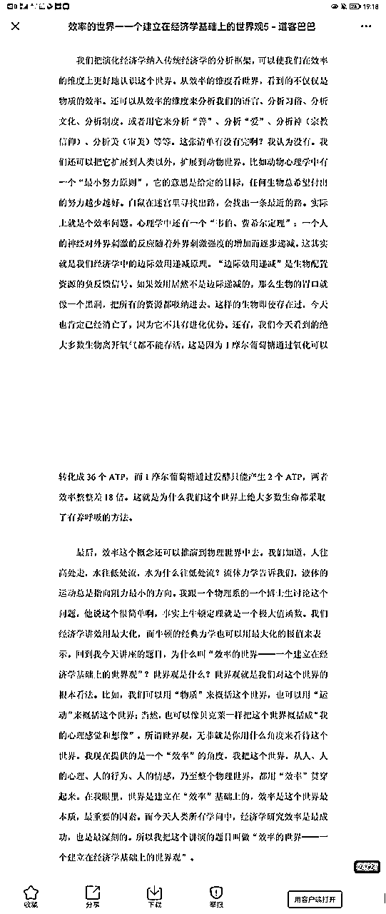

## 如何解决 35 岁危机

要学会聪明的算长期总账。

以 5 到 10 年为期，算总账，而且这个账，不仅仅是钱的账，还要加上个人实现的账。

很多事情存在不确定性，估一个概率，用概率去算。

接着，把你算总账的逻辑，给不同的人讲，听他们的视角，补充你的算账逻辑。

想清楚了做决策，就开始干，干的过程中阶段性的再复盘算账。

最后，认赌服输，就算输了，心里也认。

## 公司战略不行

先不用看其他问题，你考虑 3 个问题：

产品好不好？用户认不认？老板牛不牛？

如果是好、认、牛，那么你做一件事：

把自己定位成合伙人去思考和解决问题。

用户模型不清楚、社群运营没人管、资源分配不合理、产品迭代速度慢、商业模式不清楚等，都是你可以去想办法要去解决的问题，也都是你的机会。

问题发现了，找不到解法？你来生财有术不就有很多解法了。

当你慢慢的把你看到的问题都解决掉，你肯定真的就成为了合伙人。

换个视角来看，老板是帮你成为他合伙人的一个资源而已，当你帮他把你看到的问题都解决掉，他会求着你要股份、加工资、并成为他合伙人。

那会不会干太多吃亏？

你是在为自己干活，干的越多学的越多，涨的经验都在自己身上，亏不了，越干越赚。

## 一千万融资难还是赚钱难

无法评价谁更难，都很难，对于不同的人，有些人觉得融 1000 万更难，有些人觉得赚 1000 万更难。

简单理解，融资就是卖股份。

一个赚 1000 万的公司，可能融不到 1000 万，一个融 1000 万的公司，也可能赚不到 1000 万，不好比较。

在现在整体的经济和投资环境下，对于生财有术圈友来说，可能赚 1000 万会相对更容易一点，资本的勇气在不断变小，不轻易投。

## 快问快答

亦仁 回复 单先生：我认为，机会很大，需求真实且持续，难点在于引流一定体量之后，如何创新性的设计产品出来。

亦仁 回复 廉博：非常重要且稀缺的思维能力，把任何事物看成产品并设计出边际成本递减的方案出来。可以看梁宁的产品思维课。

亦仁 回复 艾琛：抖音吧，反馈最快。

亦仁 回复 阿里阿里：应该是 菜好吃?

重庆-羊羊羊 回复 亦仁：好吃这个太主观，不好统一定义。其实更多人所谓“好吃”是指的口感。例如牛肉好嫩，

亦仁 回复 重庆-羊羊羊：但面向目标受众，还是有统一认知的。

亦仁 回复 卜夫：好好睡觉，多休息，睡到够为止。

同时，设定更清晰的目标，目标会牵引精力。

亦仁 回复 陈钦勇：不好说，看你产品的热点。 找找同类有没有爆的产品。

亦仁 回复 泡利：adsense 广告。

新人起步在于找 niche，也就是竞争不那么强的需求，且你能用英文内容去解决这个需求。

亦仁 回复 该用户已注销：运气占很大的成分，很难复制。 要说复制生财有术，也很难，切入点可以从视频版的生财有术切入，具体什么形式我还没想清楚。

亦仁 回复 心理平衡：建议就是 定投指数， 增强场外赚钱能力。

亦仁 回复 魏无羡：先看完抖音商业 IP 航海课，找准定位，做抖音账号。

亦仁 回复 周末：做抖音商业 IP 引流

亦仁 回复 林深：换行业吧。

亦仁 回复 风动云烟：当初怎么选数码方向的？我不太看好这个方向，产品利润不会分太多给渠道。

青鸟：做项目的时候 什么时候该合伙 什么时候该一个人

亦仁 回复 青鸟：你的能力是不是能撑起项目的每一个重要方面，如果可以就不需要合伙人，如果不行，找合伙人补齐。

刘小排 回复 青鸟：直到不得不招人的时候再招

亦仁 回复 一辰：低转高。 哪怕只是 9.9 的用户，价值远远大于不付费的用户。

亦仁 回复 K 哥说美国：先找到第一个员工。

刘小排 回复 K 哥说美国：先从信任的人里找一个

2021-12-11 21:06

亦仁 回复 慈溪小阿泽：还是抖音，tiktok，直播。

2021-12-11 21:06

亦仁 回复 ye 未央：不要与平台对抗，换方向，或者换内容思路。

2021-12-11 21:06

亦仁 回复 大 c：想想看，如何能不冲突的并行两件事，应该有思路的。

2021-12-11 21:07

亦仁 回复 一米七大个：几乎没有，小程序的几乎所有场景都被做过了，换其他的吧，比如抖音小程序的开发。

2021-12-11 21:07

亦仁 回复 了枝：想要的太多，断舍离，知足常乐。 每天做一个冥想，问问自己有什么，要什么，放弃什么。

2021-12-11 21:07

亦仁 回复 阿西 Ash：先把这个店的客户都沉淀到微信号上，增加复购。

刘小排 回复 阿西 Ash：抖音直播

2021-12-11 21:07

亦仁 回复 宋老师：不大，太垂直，客户少。

2021-12-11 21:07

亦仁 回复 外卖运营：不需要控制自己，引导自己，顺着自己，放大优点。

亦仁 回复 龙星：可以，没问题。

注意北京地区是否有政策要求，做好合规。

2021-12-11 21:07

亦仁 回复 陆甲第：这种离政策近的生意，建议放弃，不要火中取栗。

2021-12-11 21:07

亦仁 回复 奥利姆.荷：想太多了，这些人跟普通人都没关系。

2021-12-11 21:08

亦仁 回复 爱学习的蓝老师：国家说不要做这些，那么要听话，不要想着打打擦边找机会，果断一点找其他事情。

2021-12-11 21:08

亦仁 回复 笑颜：你手里有别人需要的东西。

亦仁 回复 一条狗：拿龙珠进龙珠俱乐部吧。

2021-12-11 21:09

亦仁 回复 徐蒙徐大爷：人生充满着很多随机性，对于城市，一线就行，我无所谓。

2021-12-11 21:09

亦仁 回复 徐蒙徐大爷：人生充满着很多随机性，对于城市，一线就行，我无所谓。

刘小排 回复 徐蒙徐大爷：深圳

2021-12-11 21:09

亦仁 回复 新龙：利润越高，未来越小。

把赚到的利润分一部分放到团队或者客户身上去，利润会小，但未来会远。

刘小排 回复 新龙：利润越高，生意持续性越弱

2021-12-11 21:10

亦仁 回复 WWF：既然是转型，是谋生，谋生咱先不挑，喜欢不喜欢不重要。 建议仍然是抖音上找机会。

刘小排 回复 WWF：先挑能跑通小闭环的。正反馈最重要

2021-12-11 21:10

亦仁 回复 西昂：有，找准细分需求，仍然可以闷声赚到让自己自由的钱，特别多的钱就难了。

2021-12-11 21:10

亦仁 回复 西昂：有，找准细分需求，仍然可以闷声赚到让自己自由的钱，特别多的钱就难了。

刘小排 回复 西昂：有啊，saas

2021-12-11 21:10

亦仁 回复 万迎春：个人认为不值得，在抖音搜索的需求太小，基本盘不够。

2021-12-11 21:10

亦仁 回复 阿狸：端茶倒水有服务员了

2021-12-11 21:10

亦仁 回复 予轩：工作和感情冲突吗？ 找到合适的人，工作和感情不需要平衡，一体的。

2021-12-11 21:10

亦仁 回复 晋四喜：这几个平台操作好就够了，其他的我不清楚。

刘小排 回复 晋四喜：平台有限制，不太能在网上做

游心✨：亦仁老师觉得迄今为止对自己影响/帮助最大的三本书是什么？如果能简单分享一下原因的话最好啦，感谢老师。

亦仁 回复 赵承纬：思考的艺术

把时间当作朋友

人生的智慧

## 做了很多项目能否做 ip

我直接一点，你别生气。

如果自己都没靠副业赚过多少钱，我们如何做副业类 IP？

IP，至少你得是这个领域的专家吧，实战专家，结果专家。

## 经验丰富 如何写好职场经验

很棒的经历。

客服团队人多的老板，应该不在乎花个一两千块钱买个客服培训手册吧，特别是一线实战出来的人写出来的东西，更值得信赖。

如果课程做出来了，我可以介绍你认识一些做客服类 saas 工具的朋友，也许可以跟他们合作上一起分发。

## 付费社群的人都想一夜暴富咋运营

放弃社群，转成付费训练营。

社群交付两种东西：社交和内容。

纯小白没有提供价值给别人的能力，也就无法发生有价值的社交场景；他们也无法生产有价值的内容，只能消费内容。

但进了一个社群，他们天然的对社交和持续的内容有期待，组织者无法交付社交，内容无法 ugc 只能组织者自己生产，要持续一年生产内容，那不如转成时间更短的训练营，用户预期更低，获得感更强。

社群最重要的是筛选，不对的人进来，只会害了社群。

顺便说一下，这次杭州见面会的报名，劝退了十几个把生财活动当「流量池」且有先例的人，这些人已经上了生财的黑名单榜，具体就先不点名了，但是也警告那些把生财当「流量池」的人，在这里真诚比什么都重要，来生财交朋友可以，总想到处捞着点流量走，可能会得不偿失。

## 执行差低欲望怎么办

根本原因在于没那么想赚钱，解法是换更上进的线下圈子，找到一个图中的人。

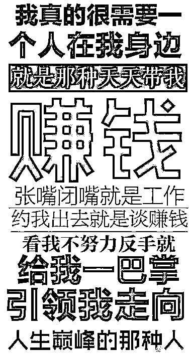

## 经营公司踩雷-小舅子争夺权力

建议花钱找专业律师咨询，我不太懂，不好乱给建议。

发生了这种事情肯定不好受，但还是要平复心情，冷静处理，改变能改变的，接受不能改变的，未来还很长，你还会赚到非常多的钱。

长远一点看，很多亏越早吃越好，甚至鼓励年轻人早期多吃点亏，多踩点坑，这个时候的代价都还是我们能够接受的。

如果有律师圈友，愿意提供帮助的，也可以评论区留言。

## 百万年薪遭受 35 岁危机

小项目确实不值得你研究，投入产出比太低。

假设公司按照你创造的价值*20%给你发工资，年薪 100 万，大概需要你创造出 500 万的价值。假设每天有效工作时间是 8 小时，一个月工作 20 天，那么一年有效工作时间 1920 小时，按 2000 小时算。

500 万/2000 小时= 2500 元/小时。

这个，就是你的价值锚点，低于这个价格太多的项目，没必要做。

正常来说，要达到这个价格，必须要加杠杆了：个人品牌、产品、团队、公司、内容、影响力、社群，这些给你个人价值加杠杆的地方。

更详细的回答需要你提供更具体的情况。

## 糟心的经历然后想创业 之后咋办

你写这么多，但我只想劝你一句：

找家公司，好好上班，被老板“折磨”几年，练就一些真本事，再出来创业不迟。

不是所有人都适合创业。

什么时候适合出来创业？

兼职收入是你工资收入的十倍以上，这个时候比较稳。

## 创业多年没结果 以后咋办

现在遇到的问题，都是过去埋的坑。现在忙于去填坑，未来仍然要继续填坑。

所以，先稳住，别慌，进了生财有术，我们还是能赢的。

做好吃一年苦的心理准备，为之前的不坚持、不深入、不周全买单，犯了错，我们认。

接着，需要你再仔细梳理一下你现在手里的资源和项目，哪个项目现在还在产生收入，且对于现在的你来说，是投入产出比最高的，然后，盯死这个项目，解决遇到的各种问题，放大，再解决遇到的各种问题，再继续放大。

一年内，不用动换方向的心思。

另外，出去找个工作，好好打工，给老板提供更多价值，以上说的那些，作为你的副业来进行，同时进行主业和副业虽然辛苦，扛过去，就是晴天了。

加油。

## 亦仁想影响那些人 想达到什么结果

好问题，我就不长篇大论，简单说一下。

1.在你心目中，你最主要想影响到的圈友是哪部分？哪类人?你期望对这些人达到的具体的影响效果是怎样的？

主要想帮助 80%的还没赚到第一个一百万的圈友。

希望帮助他们：建立信心，开始行动，获得正反馈，持续扩大收益，成为榜样，继续向下传递。

2.哪些人能出来影响？如何让这些人的影响力持续的输出？

生财团队，志愿者团队，生财有术嘉宾，龙珠圈友，各种榜样，普通圈友等，共同出力。

这些人影响力持续输出的关键点，不在于激励他们输出影响力，而在于持续的有新的榜样成长出来，这些人继续带动更多人。

看到别人在努力利他，会有更多人加入进来，哪怕中途有一些人离开。

3.这些人的影响方式和内容如何最有效的到达到目标群体？以及这些内容和方式的价值如何再更多的转化？

如何最有效在我看来，根源在内容和项目，以及组织的设计能够推动这些内容和项目被吸收、被尝试，进而真正帮助到大部分人「改变」并「赚到钱」。

组织设计的源头在于组织的激励机制，因为这是一个使命愿景价值观都足够清晰的事情，激励机制考验的是格局和心力，我也正在慢慢修炼和突破。

## 算法工程师如何做相关企业咨询服务

个人做咨询首先得有 IP，IP 靠专业知识树立起来，所以，先分享你的专业知识让更多人看到。

如何最快开始？

每天发两条专业知识的朋友圈，先坚持一周，看看你的朋友有没有感兴趣的？

什么？圈子太小没感兴趣的朋友？

那先加入一个相关的社群，在这个社群分享出真正的干货。

什么？行业社群也没？

那先找一个相关的、搭边的吧。

什么？这有没有？

那算了吧，你的专业知识太小众，转换成一个更大众的专业知识，然后把上面的流程来一遍。

你不懂怎么将特别专业的知识拓宽受众？

我举个栗子。

如何赚钱>程序员如何赚钱>>程序员如何靠接外包赚钱。

最前面的就是最广泛的需求，但也是竞争最激烈的需求，退而求其次，可以选择中间的受众面不那么小，然后竞争也没那么激烈的中间地带。

对了，咨询很考验「忽悠」能力，可能并不适合程序员，不过，总归试试看，万一可以突破。

尝试起来，比啥都强。

先这样，祝你成功。

有问题评论区再提。

## 回收亚马逊礼品卡

淘宝上找礼品卡卖家，低价批发给他们最快。

## 认知类视频变现少咋办

首先恭喜你，从小航海出发，视频号做到 12 万粉丝，很不错的成绩，超过了大部分同行的人。

其次，我们不能单纯看单位流量的产出，而要看单位时间投入的产出。

也就是你投入了一个小时，这个号可以获得 100 个粉丝，而其他领域的号只能获得 1 个粉丝，即使前者的粉丝值 1 毛钱，后者的粉丝值 1 块钱，单位时间的产出仍然是前者大于后者。

而你选择的主题，商业认知和名人名言，具有天然的内容优势，流量上比较容易爆，换个领域我猜测大概率做不起来。

现在我给你的建议：

第一，坚持做，不要停，已经行走到这里，放弃比较可惜；

第二，尝试多种办法沉淀流量和变现，找一点正反馈，虽然现在变现效率很低，但是流量红利和变现红利期都是错开的；

第三，调研相关主题的公众号和抖音号的变现方式，不要说没有，一定有，只是你没找到；

第四，逐步的在这个号上加一点 IP 的内容，方便以后做转化。

我仍然坚定的看好，这个号有年赚 100 万的机会。

## 在公司没有话语权咋办

我的职场经验不多，给几个我的思路，不一定适合，供你参考：

通过内部和外部输出，建立行业影响力，积累行业资源，这些资源可能几年后会给你带来巨大帮助；

链接更多外部资源给到公司内部，帮助解决一些你分外的问题；

尝试站在比你高两个级别的人的立场，思考并解决具体业务问题；

进入跨界圈子，输入不同的信息打开视野，比如龙珠俱乐部；

多花点钱投资自己，管理、投资、认知思维、运营、流量、表达、健康等；

兼职做海外 APP 产品，并尝试获取流量和变现，能赚多少没那么重要，重要的站在总负责人的视角看整个事情。

## 职场如何搞懂人情世故

做自己就好了。

没人会在意你是否自在，大家也不缺一个在饭桌上可以更自在的人，大家身边缺的是一个独特的人。

如果不自在让你不舒服，以后就别参加各种饭局，不会有什么影响。

我就很少参加饭局，前期拒绝双方都会有点不舒服，坚持拒绝，坚定拒绝，所有人就都习惯了。

坚持做自己之后，说不定你反而会自在了。

## @杨涛：生财的模式是你拍脑袋做出来的吗

涛哥提到生财有术很多有意思有价值的想法和玩法，看似好像都是我脑袋一拍，然后就出来了，没有非常体系的规划，缺少计划性，团队没那么适应，涛哥问我是不是这样。

我说是，也不是。

从形式上来看，很多事情看起来都是这样的。

但实际上，不是。

我思考问题，几乎所有的时间都在思考最不确定的部分。

因为长期思考商业模式、产品、运营、机制等，我凭经验和直觉基本可以非常快速定位到哪个点，是当下确定性最低而又非常影响全局的部分，然后在那个点上反复琢磨和思考，不断推翻和重建。

甚至有时候，在团队来看，亦仁有拖延症。

但是关键不确定的点一旦想通了，整个事情的推进就会势如破竹，感觉特别顺，没遇到什么门槛一样。

确定性高的部分，哪怕我自己团队搞不定，只要愿意付出的成本足够高，也都能找到合适的解决方案，那就不需要把非常宝贵的时间资源投入去思考这些确定性高的。

比如，最近有圈友找我反馈，说感觉最近生财有术内容质量有点不如从前，我回复收到了，也感谢反馈，但我并不会因此立刻就去解决这个问题，因为短期内容质量提升在我的眼里，是一个确定性很高的事情，我有很强的经验和信心来提升这块，那反而不急。

反而是，长期内容的心智建立、生产机制设计、激励模式、利益共同体、内容商品化、内容分发模式等等，这些不确定性的模块，没有人会代替你去想，要更早的想清楚。

做社群，还是要多想少做。

## 广告投放

这种模式是否还机会通过公众号积累到国内的跨境电商人的流量。

有可能，优质的差异化内容永远有巨大机会，不过要先问问，内容是不是足够优质？

是否还有其他的平台可以做？

公众号和抖音，公众号优先，抖音其次，其他不用考虑。

从变现角度来讲，公众号变现效率最高。

如果可以做，积累到流量后关于变现的问题目前还没有头绪，有何建议？

先建立影响力再说，变现是和创造的价值强关联，方法多的是。

社群，课程，培训，广告代理，供应链，服务商等。

目前有看到一些做案例分析的公众号，但他们都没有更新了，是不是这块已经没有市场了？

这不是一条容易走的路，甚至很难，不信？你先在生财写 1 篇能够到精华质量的帖试试。

## 跨境如何低成本验证

很好的问题，推荐你一本书，《精益创业方法论》，龚焱的，在产品圈比较流行。

这本书完成了我精益思维的启蒙，不管之前做产品，搞流量，还是现在做社群，管理公司，我都在用这套方法论，节约了很多试错成本。

## 我付费进了生财还需要仰视你？

你好，不需要付费提问，我回答一下你提的几个问题。

问题一：为什么不设计简单的社群承接？

你应该说的是为什么不拉微信群吧。

第一个原因，我没承诺提供该服务。

第二个原因，因为我能力不够，如果建立全员微信群，大概会有四五十个群，我们肯定服务不好，会收到更多的吐槽，既然知道自己做不好，做了还会带来全员更差的体验，那就不要做。

一个微信群能持续产出有价值的讨论，最关键的角色是群主，群主需要对相关内容有较高的判断力，并根据对群成员的了解在群内穿针引线，而内容判断力不是可以快速规模化复制的能力，背后都是认知。

我的精力让我能关注的群数量是非常有限的。

第三个原因，对于绝大多数人，微信群对于他们的价值非常有限，只会产生更多的信息噪音。

但是具体的活动，都会有相关的微信群，比如小航海交流群，线下见面会交流群等。

问题二：“是不是没有主动分享的圈友只能像孤魂野鬼一样在星球游荡”

我很能理解你的感受，感觉没有融入组织，别着急，慢慢来，毕竟加入生财有术还不到一个月，价值是慢慢被感知和释放的。

各项活动需要一点时间，生财的活动可能跟大部分社群都不太一样，每一个活动都力求给到参与者足够大的价值。

这个月的活动，包括同城见面会第一站（南京场），生财夜话，小航海，生财 CP，资源对接日，问答日，会员日，二期龙珠俱乐部开放，都在接下来的一两周推出来，参与其中一两个活动后，你可能感受就会不一样了。

但最根本的一点，我们每个人得知道我们来生财有术是干什么的，看内容？找项目？找组织？认识人？参与实战？学习玩法？或者就是随便看看。

赚钱是我们自己的事情，不是别人的事情，不是父母，不是朋友，不是老板，不是同事，也不是一个我们交了钱的群主，如果认识不到这一点，很难真正的激发赚钱这件事情的能量。

我会尽我的本分，提供对赚钱有帮助的内容和信息（精华、项目库、风向标等），组建场景让同频的人认识和交流（这两天会开放本月的同城见面会南京站和生财夜话报名），创造活动提高解决问题的效率（下周会开放资源日和问答日，方便大家更高效解决问题和匹配资源），本月会开放新一期小航海（九条船）的报名，等等。

以上这些，是我的本分，应该要做的事情，也不必感谢我提供的这些服务。

问题三：是不是交了钱之后还需要仰视生财有术？

完全没必要仰视，你交钱来享受服务，觉得服务不错，明年接着续费，觉得服务不行，用脚投票，明年不续费。

但生财有术不同的一点，我们不会把会员当上帝，你不仰视我，我也不仰视你，我尽我的本分，做好我应该做的事情，我不会去推着拉着说，你快点看内容吧，你快点参与活动吧，你快点报名小航海吧，我做好提醒和体验，其余都是你自己的事情。

所以，我们最好的关系是平视，平等交流和对话，包括平等的互相吐槽，完全没问题。

你认可我，叫我一声亦大神，或者亦仁大大，亦仁大哥，亦仁大佬，那是你情商高，但我知道我几斤几两，这些称呼，和亦仁，亦仁小弟，亦仁老弟，亦仁老板，亦总，亦哥，在我这边，权重都是一样的，我并不介意任何称呼。

问题四上面也回答过了，不专门回答了。

只有真正的深刻认识到，赚钱是我们每一个人自己的事情，无关其他人，不去抱怨任何人，我们才能真正的去改变自己，而改变了自己，赚钱这件事就开始了。

## 如何借助朋友的工厂助力自己赚钱

建议你换个角度，仔细想想，你到底能做哪些事情，帮助他赚更多钱。

给予与索取相比，是一种更重要的能力，赚钱是因为创造价值，创造价值就是一个给予的过程。

他通过你能赚到更多钱，自然愿意分给你一点，就算不分钱，他能做这么大，一定有很多异于常人的能力，除了钱，能分享给你的会更多，那些才是更值钱的，比如需求挖掘，产品打造，市场开拓，团队管理。

## 如何快速通过有邀请码机制的网站迅速扩展势能

如何在没有资源的情况下，增长势能，变成核心节点。

clubhouse 大火，三种需求：这是啥？有没有邀请码？哪里有交流群？

围绕这三个需求创造内容，各个平台分发，做各个渠道 SEO，底部留钩子：加微信领邀请码，进交流群。

如此操作，会有很多很多人加你，这里面有一些人已经有了邀请码，一部分人没有邀请码；

加上后，记得发自我介绍，先和他们认识下，有邀请码就给他们，没有邀请码也真诚的告诉他们，邀请码暂时缺，先排队，有库存的会优先免费给他们。

同时，筛出一部分有邀请码的人，第一批免费邀请他们进入 clubhouse 交流群，每天分享最新相关信息，同时别忘了传播群的价值。

群运营起来后，第二批要进交流群的，需要捐一个邀请码出来。已经注册的人，都会有两个邀请码，请他们拿一个出来，这不过分。

把这些整合出来的邀请码资源，分发给来找你要邀请码的人，同时要求，他注册完之后，必须再拿一个邀请码出来。

如此一顿操作，邀请码供应链搞定，每天继续分发内容不要停，到处送邀请码，且是真实的送，大家都被你帮到，第一次信任建立起来。

对他们说，如果他们有朋友需要邀请码，可以推荐加你好友。

有人问怎么变现？ 势能不够大时候，不要考虑变现，也赚不了多少钱，先交朋友，10 个群，有 5000 个被你帮助过的朋友，比你赚几万块钱要有价值的多。

且第一批愿意去尝鲜体验 clubhouse 的人，多少还都是有点影响力的。

7.实操后，把这个案例完整的复盘发到生财有术，说不定就是一个精华帖。

亦仁老大这波操作确实 6：价值设计，流程清晰，资源整合，需求匹配，激励贯穿，积累信任，交个朋友

## 日更没有意义，好的反馈更重要

最近看到很多圈友开始日更公众号、视频号，这件事情非常有价值，不过为了让大家的投入产出更高，动作不变形，我给点建议：

日更不是目的，表达也不是（如果单纯的表达可以让你开心，那也没问题），需要想清楚日更对你意味着什么。

如果希望通过输出来促进自己的思考，那么日更并不是必须的，对外发布也不是必须的，对外发布的日更甚至有时候会影响你思考的质量，有些东西，其实不太对外分享的时候，可以更真实的面对。

以促进自己思考为目的的输出，最关键的是能获得更高质量的反馈，也就是别人可以点破你，分享你看不到的视角，不了解的信息等，以此来加深你对某一个问题的理解。

所以日更文章发布后，我认为这不是结束，而是第一步，更重要的是找到更厉害的人，请他给出反馈，且，最好是批评。对于一个心理足够健全且强大的人，获取到批评的价值要远高于获取到的鼓励的价值。

如果不是这样，坚持日更就是低水平重复，且不断加深自己的低水平，这也是我为什么不建议没太多实践经验的人去日更写文章。

如果是希望通过写文章或者视频号建立自己的 IP，那么我也不建议日更，没有谁有本事天天写出高水平文章，在高水平文章产量有限的情况下，不建议通过日更稀释势能，而是应该把一篇文章当成一个产品来打磨，请专业的人帮你改，打磨成一个业内的人都忍不住想转发的干货，这样的文章是有穿透力的，配合上一些投放（比如别的群发红包，到各个平台请转载），这样的文章，几篇就基本够了，足以建立起来一个 IP。

## 如果做的越大风险越大，一开始就停止

当你想做一件事情的时候，一定要先想，这件事情有没有放大 10 倍甚至 100 倍的机会。如果没有，或者如果这件事情做得越大，你越担心风险，那一定从一开始就不要做。

前几年，我自己有一个很强的需求，希望把公众号文章导出来，变成一本电子书，这样我可以集中去学习，于是我让团队的技术开发了一个工具，将一个公众号变成一本 PDF 电子书，工具开发出来之后挺好用，就开放出来给更多的人用了，可能你们其中一些人也用过这个工具，叫做“P 大叔”。

这个工具开放出来后挺受用户欢迎，但严格来讲，它其实侵犯了公众号博主的文章版权，我心里面知道这个点不对，但另外一方面，这个工具又确实解决了我以及很多类似我这样的人的需求，很快就传播开了。

那个时候，我的运营能力还可以，我知道，如果我设计一场运营裂变活动，这个工具会快速的破圈爆发，但是我心里也知道，这个工具没有那么“阳光”，做的越大问题越大风险也越大，所以一直就这么内耗着。

在用户传播的过程中，“P 大叔”有一个相关的公众号被投诉封了，这突然警醒了我，在一个错误的方向上，无论你怎么努力，都永远没办法达到正确的终点，你跑的越快，偏的越远，最终无法回头。

于是，和团队的小伙伴商量了一下，很快将整个网站和服务全部关闭了。

有一些圈友说我三观正，从我的角度来说，如果你真的想做长期有价值的事情，且当这个事情你想真正的用力去帮助它长大的时候，你不会担心各种各样莫名其妙的问题和风险，你就必须让所有的成长都在阳光下，接受所有人的监督和质疑，这可能就是三观正吧。

也希望通过这个帖子来解释一下，为什么最近我删除了很多关于薅羊毛的帖子。

## 不想走捷径，反而走的更快

技术角度来讲，强排肯定有可能实现的，与短期快速获得 SEO 排名是一个道理，但是所有的操作都会记录在你的账号上，而且未来大概率会被知乎秋后算账，所以，要么不做，要么实在想试拿个小号试试。

具体怎么实现的我不太了解，只要规则是人定的，那么对规则的反复试探就能找到漏洞。

另外，我建议尽量避免想找一些捷径，下苦功夫呆功夫，比如靠内容质量和数量来获得流量，虽然慢，但足够稳。

有人会说，啊，亦仁，你忘了自己当初走了那么多捷径野路子，现在站着说话不腰疼，也许正是因为之前想走捷径而走了很多弯路，确实，偶而走捷径成功，但大概率走捷径等于走弯路。

不想走捷径，反而走的更快。

## 面试 COO，回答米相关的问题

看上去，是想测试你的讲故事写作文的能力，而不是出方案的能力，不过作为 COO，讲故事能力也是必须的了，如何包装并卖给别人这个故事。

归根到底，米能值多少钱，值钱的大部分都是虚拟的东西，比如故事。

如何超出他预期？

讲一个比他的框架更大的故事试试？从时间和空间上覆盖他的框架，并用多种内容形式呈现给他看，比如短视频。

另外，我建议，用户心理再研究研究，比如关于“米”的一些独特用户认知，比如

这家店靠卖大米赚了 1 亿

【米】小米粒成就大中国

专题丨少吃糖，更健康

## 2021 年让生财收入翻一倍

结论：先解决系统性风险，收入翻倍知识时间问题

做哪三件最重要的事情，可以让生财有术 2021 年的收入翻一倍？

这个问题我也想过，脑海里也有清晰的思路和明确的打法，不过说实话，这不是我最近考虑的主要问题，只要生财团队踏实做事，把握好节奏和心态，收入翻倍是迟早的事情，即使今年做不到，明年、后年也有机会（凡尔赛仁）。

查理.芒格说：“如果我知道我会死在哪儿，那我一辈子都不会去那里。”

上次也有人问我，生财有术面临的最大风险是什么？以及应对方案是什么？

这个问题比生财有术如何赚到翻倍的收入更有价值，我花点时间在此帖来慢慢更新下，先点赞吧。

第一个风险：政策风险。

只要是与内容相关的产品，特别是涉及到 UGC，很容易踩雷，包括生财有术社群本身和知识星球 APP，考虑到有两次这样的先例，再来一次也是有概率的。

说下我的应对思路：

将大部分会员同时备份到微信好友上，包括鼓励添加鱼丸好友，以及我的个人号，目前生财有术的 CRM 也在开发中，也希望大家及时将微信与星球账号绑定，关键时刻，可以联系到大家。

对于涉灰涉黑等内容，绝不留情，第一次删帖警告，第二次直接踢出，这不仅仅是价值观问题，而是生死线问题。

也成立了线上小分队，现在有上百人的规模，有问题的内容，可以非常快的发现和处理。

对于星球历史内容做了一些备份，以防不时之需，希望这一刻不要到来。

想办法与政府做一些接触，解释清楚我们社群在做的事情，在大的方向上，比如创业、副业等，是与政策一致的，同时邀请政府的一些官员（如果可能的话），来星球和线下活动，了解我们在做的事情，不求政府政策倾斜，只求努力沟通不被误解。

更多的赋能给一些认真做事的圈友小伙伴，在能力范围内，且认真做事的圈友需要一些冷启动流量和支持的时候，我们可以没有利益诉求的去帮他们。即使未来生财有术出了政策问题，在那些小伙伴的帮助下，还有机会再次起来。

认真踏实的经营好生财有术这个品牌，爱惜自己的羽毛，赚该赚的钱，不赚不该赚的钱，让品牌的势能足够强，同时低调做事，不让名气超过自己的实力。即使有一天，载体出问题，需求在，信任在，杀不死的只会使它更强大。

与@wulujia 吴老师进行更多的沟通，特别是风控上请求更多的指导。

第二个风险：社群人数增加带来的各种问题。

（待更新）

第三个风险：由我带来的各种风险。

（待更新）

第四个风险：价值提供出问题。

（待更新）

## 2021 年创业感悟

## 泛流量过来怎么变现

泛流量变现很难，如果非要变现往淘客上靠试试。

不如趁机，把这些人免费拉一个群，好好维护，让他们认识你，给出超预期的服务

“呀，免费领东西，还送这么多资源，这人靠谱”，如果你能积累几千个这样的铁杆粉丝，慢慢带着一些人做点事，可能，你就是下一个紫菜。

感悟：积累信任的第一步就是机制的利他

## 日历裂变群的多个提问

沐文¹:

1、非常想了解一下：亦仁老板创业四年多以来，是如何让自己和团队始终“保持初心”

有没有每天都坚持在做事情呢？一些小事情，但是在你看来非常好，也非常值得坚持下来的~

亦仁:

初心是想带着大家赚钱，在这个过程中，我的目标和大家的目标是一致的，我带大家赚到钱，短期和长期我都可以赚到更多的钱。所以保持初心对我来说并不是一件困难的事情，也不用说告诫自己去不要忘记初心。

我很少坚持去做一件事情，我觉得一件事情如果说要去坚持，是很难真正的长期做下去的，而是应该选一件最顺应自己心意的事情来做，充分的了解自己的长处和优处，规避短处，然后选一件自己最擅长最喜欢的做的事，就一直做下去了。

我从大学开始就很喜欢赚钱，也喜欢研究赚钱，然后分享赚钱的事情对我来说是一件乐趣，所以就一直做下来了。

沐文¹:

2、亦仁老板可以说对很多行业的认知都非常高，没有做过一个行业，但是会对这个行业的信息格外敏感，例如：抖音、快手、视频号等等，看你在星球发的帖子都非常“有信息时效”也很贴近“项目热点”，是如何刻意练习成的？还是有一个信息筛选库

亦仁:

底层逻辑都是相通的，当建立起自己的思维模型之后，不断的去追寻更本质的模型是什么，这些更本质的模型可以帮助你更好地理解这个世界，类似马斯克说的第一性原理。

所以在思考一个问题的时候，要不断的往上去抽象，抽到最本质的层面，这个层面可以帮助你更好的去理解很多事情。

沐文¹:

3、“收藏夹”已经上线一个月的时间，内容已经非常充实了，我非常想了解一下这个“收藏夹”的相关数据，打开率之类的，想看一下短平快的碎化信息，大家的使用程度

亦仁:

收藏夹是我非常喜欢的栏目，但是目前的数据不太好，每一个帖子大概只有几百个人看，我觉得主要是知识星球产品和这个栏目不太匹配，继续运营一段时间后，可能会换一种形式。

沐文¹:

4、2020 年 4 月到现在，生财可以说发送了非常大的一个改变，无论线上还是线下

例如大航海之后的小航海计划，例如线下见面会后的同城夜话，都是一个模块的迭代和递进

这是原计划在内的，还是在执行中获得思路及时迭代进去的？

亦仁老板是如何看待：以使命驱动的执行路径本身的迭代的？（就是如何及时把路径上的关节去迭代、优化）

亦仁:

很多东西是在一边做的过程中一边想到去迭代的，并不是一开始就规划出了很多清晰的玩法和活动。但是对于要解决的问题，我倒是十分清晰的，并且一直在想更本质的问题是什么，不要被一些表面的问题遮住双眼，找到最本质的问题，然后去不断的设计，更贴合用户体验的方案，收集反馈，再迭代再去设计。

如何能够持续不断的去迭代？我觉得归根到底，是你对这件事情的热爱。

如果没有那么热爱，那至少要给自己不断的正反馈，让自己赚到钱，让自己获得影响力。

做一件事应之前一定要想清楚这件事情在长期你想要获得什么。

自己的开心才是真正的长期动力。

沐文¹:

5、亦仁老板喜欢玩游戏吗？现在生财“游戏化”非常重，很有趣，感觉是一个爱玩游戏的人设计的社群。

亦仁:

不太会玩游戏，主要是觉得玩游戏很浪费时间。

确实融入了很多游戏化的设计，我觉得与人打交道，一定要顺应人性，不要去与人性对抗。

同时要能够充分的理解和接受人的贪嗔痴，并且站在一个更高的视角去想，如何让人更好的成长和发展，以顺着他们能够接受的方式去帮助他们。

# 2020

## 声音好听在校主播如何变现

这个广告最近在公众号和抖音投放比较多，可以去研究下他们是什么模式，适不适合你。

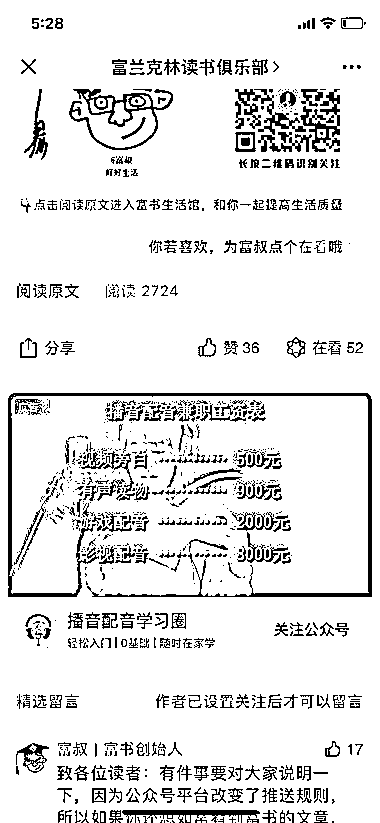

## 如何快速找到高校周变快递员手机号

如果这个信息对你们很有价值的话，不如每个城市派一个人，花一周时间去跑一跑，与这些快递员见个面聊一聊，也许合作更快。

另外，可以找到有高校资源的圈友，发布任务找他们合作，比如 30 块钱获取一个快递员手机号码。

一笑：我有个主意，把需要搜集快递员手机号码的高校地址整理出来，然后安排给每个高校发一批快递，收件人随便写，手件号码就写自己的，快递每个快递公司发一件。这样，物流信息里面就会有快递员手机号了，后续可以直接电话联系快递小哥聊就行了

至于寄什么，随便什么都行，空包都没关系，快递批量发货，价格也是可以谈到很低的

亦仁 回复 一笑：这个思路妙

## 社群运营中，嘉宾和合伙人的区别是什么

嘉宾大多数是各个行业我熟悉的做的比较好的大佬，他们不参与社群运营，偶尔会回答圈友的提问。

我给对生财有术有贡献的人发龙珠，把有龙珠的圈友定位成生财有术的合伙人，通过赋能龙珠，让这些人得到回报。

但得有一个预期，所有其他人的帮助都是外力和杠杆，真正起决定作用的是社群创始人的心力、脑力、体力的持续投入。

“把社群成员运营起来这样我就可以轻松了”，作为社群发起人，这是一个很危险的想法。

## 啤酒代理传统模式如何破局

看你有没有强势的资本，比如某款刚需的酒只有你有资源，比如你联合了其他供应商一起与下游要账期。

冰冻三尺非一日之寒，行业格局也不是一两天形成的，很多时候是由双方各自对对方的需求程度决定。

要么狠，要求全部预付，不然不供货，看他们是不是找到别的供应商，要么忍，这是赚这个钱必须要付出的代价。

就像很多广告公司，最后都变成了垫资公司，赚 10-20%点的返点，你不想垫？一堆人在后面准备补上。

很多时候，从你进入一个行业开始，基本就能预料到最后的结局是什么样的。

## 做了一个壁纸小程序，没人用

自己先做出成功的变现案例，拿着成功案例找别人。

“高中生通过壁纸小程序 7 天赚 20 万” ，有这样的案例找到别人，大多愿意尝试一下。

没有人愿意拿着自己的资源去做你的小白鼠。

## 小白有没有机会卖陨石

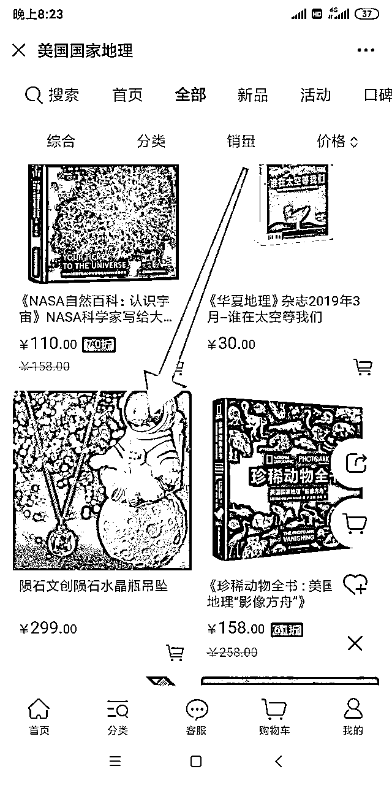

你认为它有价值，它就有价值，你认为它没价值，它就是一块普通的石头而已。

从营销的角度来讲，看你会不会讲故事，故事讲的好，肯定有愿意买单的人。

## 为什么都用语雀现在

@一条枸杞 来回答下。

枸杞：哈哈，这个工具是我在大力推广的神器之一。

语雀以前是阿里内部的资料库管理工具，迭代速度很快，而且因为商业化方面没有特别重的包袱，使用体验相对较好。

我们团队在工具选择上比较多元化，内部做文档管理也在用石墨，但因为分享文档的体验上，语雀比石墨好一些（文档有目录，表格有搜索），所以近期都在用语雀来为圈友呈现资料。

工具没有王道，只有功能点的细节差异、和用户风格的偏好，选择适合自己的就最好了。

## 比较好的信息渠道

生财有术的信息量还不够？能把生财有术全部看完，每篇帖子和每条评论，你的信息量就已经超过 99.99%的人了。

我每天看帖看的都上头。

## 做多媒体 3 年但是仅有 10w 粉丝，怎么调整

先榨干帮你赚到最多钱的平台。

## 抖音数据不正常帮忙分析下

初步判断是 PPT 幻灯片 格式不行。

换成实拍，如果继续用 PPT 幻灯片，文案要一下子勾住看视频的人，坚持再传一段时间。

可以直接开直播，抖加也可以投一点找感觉。

调低预期，没那么容易转化，不要投入太多时间。

## 抖音火了搞不搞连锁

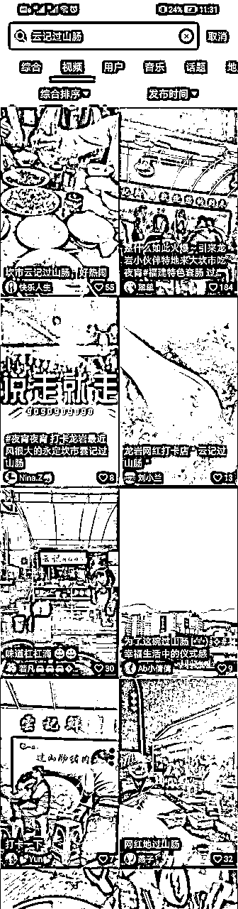

感觉可以尝试，但要看团队落地能力。

我帮你邀请一个专业做餐饮的老板@闫寒来判断下。

超级菜单-王超：

1，正常情况下，门店规模没有 20 家以上基本都会被中央工厂拖死。如果你是搞一个“加工坊”那可以考虑。

2，连锁加盟的核心基础是产品标准化，越是标准化程度高越容易放加盟但同时会失去特色，没有竞争力。

3，加盟的水很深，没有团队几乎很难做起来。而且涉及到的法律法规很多很多，一不小心就会踩雷。

4，技术好不是餐饮复制的优势，越是技术好大概率会越慢，越应该走匠心发展的路。说实话你的技术再好，对于专业团队来说逆向研究一下 1 周就挖出来了，所以不是优势。

5，给个建议，开班做培训每个人收 3000，随后从前学员里面培养潜在合作伙伴。

6，再退一步讲，你目前不是门店，门店的法律法规和管理应该会更多，没开过门店的话还是需要自己先开一家门店去试错，否则不好。

**闫寒 13286294：**目前抖音上火起来的品牌里面，比如答案茶，泡面小食堂，摔碗酒等等，基本上已经死的七七八八了。原因特别简单，就是在抖音上火的要素和实际经营能否成功一毛钱关系都没有。

抖音是个纯拼视觉刺激的地方，只要你的东西新奇，好看，有趣，就有火的潜质。线下店要想经营好那要素可就太多了，产品是否适合店面附近顾客的口味，这是根基。定价是否合理，这是技术。运营效率是否足够高，这是利润关键点。没有一条视觉要素。

如果想加盟扩张到全国的话，那么就需要扩大化的考虑产品是否适合全国人民的口味，定价在全国多少地方可以接受，这种运营效率是不是在全国范围内都能算的过来房租和人工的这笔账。如果这个适应范围足够宽，才值得做全国扩张。

不过说来说去，既然火了，那么至少推起来比不温不火的项目容易太多了。确保前几条可行，尽最大努力保护加盟商的利益和成功概率，可以考虑搞一波。

更好的办法如上面王超老师所说：收徒比加盟风险小，门槛低，盈利确定性高 OK

## 推荐书单

龙珠俱乐部给你推荐的赚钱书单。

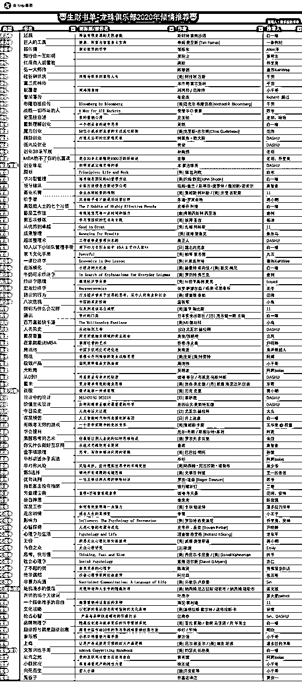

## 手里不少资源怎么用起来

目前手里有 30 多个俄罗斯圣彼得堡的微信群，是之前读研时候来回飞，做人肉带物积累的，比如带化妆品，鞋包，之类的。

因为本身从事电商行业，恰好遇到 618，手里有一些 JD 内购群，以及一些优惠券会优先拿到，想请教下，这部分资源可以如何利用起来引流或者变现 ？ 因为知乎之前一直没怎么投入玩，现在还在 1 级，如果也按照知乎带物玩法可能玩不起来。

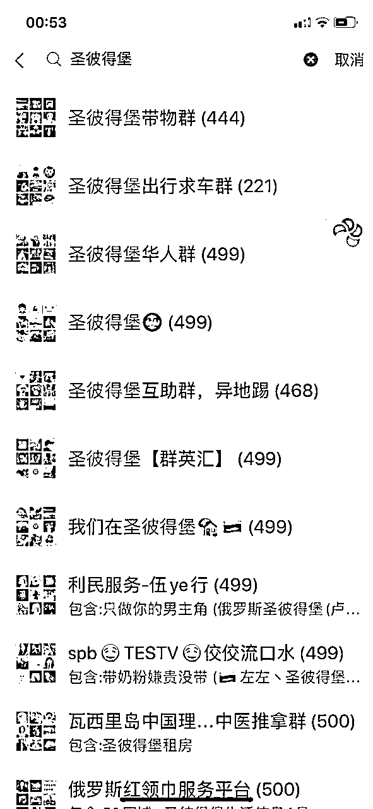

没想出来你的资源怎么高效利用，实在利用不起来就算了吧，也不是什么大资源，不能手里有锤子就去找钉子，试试看能不能换个视角，去找一把刀。

## 如何提升自控力和执行力

穷，强烈的赚钱欲望，是最大的执行力。

## 搞信用卡有没有好的分销渠道

建议你们重点学习 “卡银家”的模式，发动起人民群众的力量，负成本搭建自己的销售网络。

## 微小宝违法

好，放出来。

## 知识管理的方法

## 想提升社群底层逻辑思考

条形马的这个讲社群的课程值得听一下。

易灵微课（测试该链接已经失效）

另外你把生财有术所有“社群”这个关键词相关的文章，全部找出来，看至少三遍，搞懂每一个点，然后输出一篇完整总结，你对社群的理解就会比一般人深刻了。

## 澳洲商业机会

澳洲我不了解，请了解的圈友分享下。

不过你分享的这个案例确实是一个非常棒的细分市场细分定位的模式。

Zafina😽🐾🍓：

在澳 7 年，来分享一下个人感受。

澳洲是个多元化的移民国家，经济发展稳定但很缓慢，尤其是科技方面，经常被人嘲笑为“土澳”，澳洲人大部分还保持着去商场购物的习惯，首先是因为社会节奏比较慢，其次是本地的娱乐项目实在缺乏，所以周末全家人一起逛个街，算是消遣之一。有关电商方面，当地华人的消费习惯和鬼佬差异很大，近几年淘宝的澳洲本地普及，整体也是不尽人意。原因有以下几点：1\. 澳洲人少地大，人工成本出名的高；2.物流不靠谱且效率低。很多快递小哥都是印度人，不打电话不发短信，随便按个门铃人不在就提货点自取，或者货品门口一丢，这也是极大限制本地电商发展的元素之一；3.传播成本高。多元文化的因素，使传媒渠道变得复杂且影响力有限。4.整个市场太小。一共三千多万人，使得澳洲整体的经济规模都不大。

身边做得好的，基本都是借壳返销的。澳洲的特点就是生产资料好，例如奶制品、肉类以及保健品，有机、纯天然，所以大家都是借一个澳洲的品牌，带回国通过电商渠道销售，有一定基数后，然后再返回澳洲市场。

当然，如果是不差钱的土豪，那可以随便砸钱开渠道偷笑。只是单纯把澳洲作为销售主战场，ROI 不太高。

谭 lucky 回复 Zafina😽🐾🍓：

谢谢圈友分享玫瑰但据我说知，点 2 提到的，美帝也基本是这样派送。相比我朝，确实相差很大。

Zafina😽🐾🍓 回复 谭 lucky：

中国普遍是效率优先，这是其他国家难以比拟的。但是，同样的问题，在人口基数比较大、经济发达的美帝，和在人口基础较小的土澳来讲，影响可就差很多了

James 回复 Zafina😽🐾🍓：

您的观点我基本认同，但是否可以换一种思维，国内卖家在美国亚马逊厮杀的已经红海一片，个人卖家很难发展，澳洲虽然只有 2000 多万人，但是人均购买力比美国要高，同时澳洲的商品种类还是很少的，竞争比美国小的多，弱水三千，只取一瓢，把这 2000 万人的市场做好就够吃的了，之后再做打算，前面提到的婴儿枕巾就是澳洲起步现在拓展到美国，欧洲。您前面提到的淘宝还是没脱离一种华人思维，海外市场还是亚马逊，Ebay，独立站，淘宝不仅在澳洲不行，在美国也不行，速卖通在美国都干不过亚马逊。澳洲的好处我个人认为很多品类只要发力很快就能做到澳洲前三，举例我有个朋友的商业模式很简单就是澳洲租个仓库国内进台球桌，乒乓球桌，Ebay 卖，包送货。不到销量三年做到了澳洲前三。对了，澳洲还有个好处，土地虽大但是人口集中，不必考虑其他地方，先把悉尼墨尔本布里斯班这 1000 多万人搞定 我觉得就够吃了。个人经历，希望大家多多交流

James 回复 Zafina😽🐾🍓：

我个人认为澳洲老外还是比较认品牌的，因此树立品牌很重要，所以我不是很喜欢淘宝或者亚马逊的低价路线，比较看好 前面的枕巾模式，其实那位创始人前面已经成功一次了，做的是沙滩巾。因此我觉得她的模式是可以复制并且容易成功的。简单总结一下模式：

1.选取有一定受众群体的单品（避开大品牌）

2.社交媒体品牌营销

3.注重品质做成可以作为 Gift 的精品

4.提高单品利润。（前面枕巾成本 30 人民币，售价 69 澳元）

5.可以把品牌当儿子养给自己赚钱，也可以当女儿养（1.被澳洲大牌看上直接收了，前面的沙滩巾就被收了，卖了 500 万澳元，几乎一个人就可以把它运作起来。2\. 被国内有上市需求的大公司收购

## tiktok 如何向 ebay 引流

上次大航海 TikTok 船长@嘉伟 配合阿里速卖通做主页链接的测试，一天流量 687 次，有成交 25 单。

ebay 与 tiktok 的合作肯定会比速卖通与 tiktok 的合作要慢一点吧，毕竟后者都是自己人，好沟通。

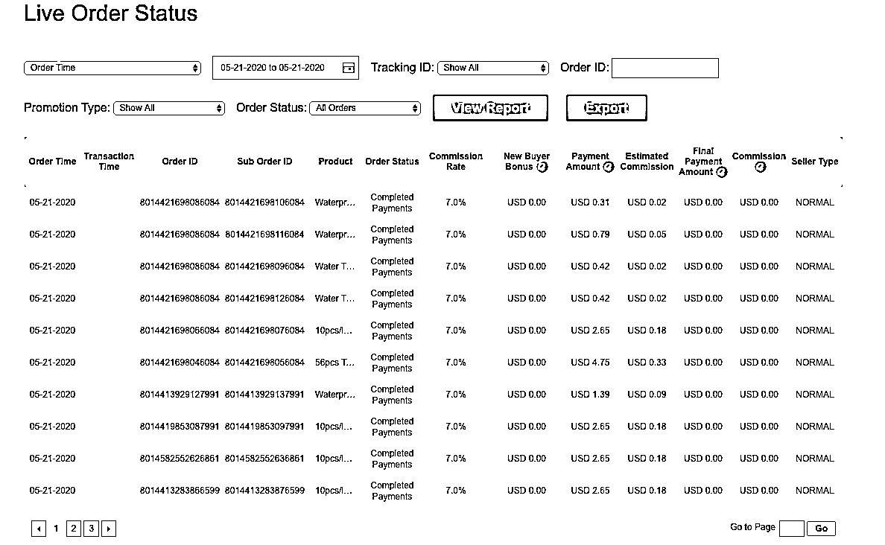

## 微信风控有渠道吗

有办法与内部的人对话，但我目前不能帮你，因为我不了解你，抱歉。

## 做什么类型的视频号

于你而言，哪种变现更容易、更多、更有经验，就做哪种。

简单来讲，哪个事情短期能赚到钱，就做哪个。都不能？ 那就都不做。

先把变现的事情理顺、跑通。

## 分享没拿到好处

不要怕吃亏，吃点亏不是什么大问题；

提高识人能力，不要对什么人都掏心掏肺；

碰到有一次别人的贪婪和无情，就赶紧远离他们；

换圈子。

## 团队业务量小如何营销

营销自己并不是业务量少的出路。

你们团队定位与别的团队有什么区别？ 活好钱少质量优？ 架构强？速度快？有人背书？大厂成员？价格便宜？

找到一个明显与竞争对手不一样的点，做出成绩与案例，然后拼命去传播这个成功案例，总会有人被吸引到的。

先有成功案例，再去营销。

## 微信支付被风控

我遇到过几次，一次生财日历，一次 418，微信风控策略是个黑箱，不太好解释。

可能的问题是你的支付主体是新的，被风控到了，或者是你售卖的物品存在一些问题，一般按照提示提交材料，等待解封。

如果涉及资金项足够大，情况比较紧急，可以找微信支付内部的同学帮助解释和沟通下，这个就看之前的人脉积累了。

## 删帖标准

回答下为什么经常删你的帖。

涉及个股投资的帖子，特别是经验分享，绝大多数是事后诸葛亮，没什么价值；

主题带有明显标题党倾向的词，比如“暴赚”；

你的股票投资分析我觉得过于简单，没法说服我。

## 努力但是没成绩的员工要离职

我的建议是让他走，每个人都要为自己的不成熟承担后果，无需开导，再招成年人吧。

## 是深挖爆款产品，还是挖背后的需求

先模仿爆款产品，即使不赚钱，也能慢慢靠近赚钱的路径，至少方向是正确的，赚不到钱主要是自己的问题。

等有足够经验后，再去找新的机会和方向，否则你都没法判断是自己方向选择错误还是执行错误。

## 传统景观企业如何触达客户

2B 的业务，很难靠内容出奇招，当然本身的内容体系也要搭建，但这个内容体系承担的角色不是为了引流获客，而是别人来了通过看这些内容建立信任，提高转化率。

我建议还是老老实实搭建销售团队，设定销售提成，定好 KPI，监督拿结果，更长期可持续

## 地方性公众号如何导流到抖音快手

先看下这篇帖子 https://t.zsxq.com/ZNZJA2v

然后给几个建议

变现方式准备靠什么？ 做大抖音号卖广告？ 那真的要仔细思考下，能跑通这个模式的人不多，在接到广告之前，你需要能憋着劲孵化出一个真正有能量的抖音号，有粉丝还不够，还得足够差异化，足够让人产生信任。

要先考虑清楚怎么赚钱？并谨慎靠短视频接广告的赚钱模式。

既然想做短视频，建议往抖音、快手的直播走，以及视频号走，这几个目前看来，长期价值更高一点，可能有一些复利；

你的公众号粉丝如何往抖音、快手上导流，直接发文推广是肯定不行的，我们假设公众号每一篇发文都是有机会成本的，相当于一篇广告的钱，你把这篇广告的钱去买抖加，可能流量是你从公众号导过去的几十倍甚至上百倍。 换句话说，不要这么导流，抖音、快手流量的价值远不如公众号。

建议的方式，你建一个公众号铁杆粉丝群，每次直播或者视频号发布的时候，把信息丢到群里面，同时做一些活动去激励大家观看直播并互动。

地方公众号的一个特点是粉丝地域属性强，在公众号打开率不高的情况下，地方抖音号可以作为以为接本地广告的一个筹码，也是可以考虑的，公众号+抖音号，双向推广，可选套餐。

## 软件著作认证，找不到客户

想办法找到谁最近注册了商标、软著、高新，应该有办法找到，去政府网站上翻翻，我每天收到一堆他们的电话。

## 大三，感觉美团比较拉怎么自己做

不太可能存在一个可盈利的新的外卖商业模式而美团、饿了么没有考虑到，你要相信，这些大公司里面的几千、几万员工，都是聪明人在干外卖这一件事。如果你小范围测试盈利，放大看看，情况就不一样了；

不要想着从巨头身上啃下来一块市场，如果巨头有一个很明显的问题，我们大部分人都能看的出来，但他们不去解决，那背后一定是他们不解决的合理原因，解决这些问题的成本可能远远大于带来的收益；

你要想着去做巨头看不上、看不起的市场，那才是你我的机会所在，更好的机会是在几个巨头之间的缝隙，比如淘宝和微信的不互通，成就了一批曾经的微信里面的淘客。

## 床上用品-如何提供差异化的价值

问题是个好问题，如何提供差异化的价值。

但对于床上用品这种低频、低客单价的品类，别费心搞什么社群、人设、价值输出了，从投入产出比来看，不划算。

好好卖货是王道。

## 视频号怎么看

我的建议，不要做第一批吃螃蟹的人。

市场足够大，让那些着急的先去试错。

你在后面慢慢观察，看有哪些玩法和案例，平台的尺度在哪里，视频号对于你是流量价值（你已有变现端产品）？

还是要靠视频号打造一个全新 IP？如果是后者，建议再观察。

## 刚加入生财，怎么看精华文

点击右上方搜索，选择日期，可以选择日期找精华。

另外，正好给一些处于焦虑期的新圈友精华阅读建议。

不要有强迫症一定从第一篇开始看，也不要有强迫症一定要看完所有精华，看的太多会焦虑和迷茫，从最近的几篇开始看，信息价值可能更高。

看到一些思路后，开始自己去尝试，一边尝试一遍搜索解决问题，然后逐步输出你的尝试过程到星球，只要你执行力强，愿意总结，这个星球的高手们是很愿意指点与帮助的，这样可以更高效的去尝试，进入一个正循环。

尝试方向错了怎么办？

没有关系，经验是相通的，在一件事上收获的赚钱经验对另外一件事也有帮助，何况赚钱这件事也没那么复杂，犯了几次错后，就会进入到一个赚钱的新境界。

什么新境界？

赚钱无非就是产品、流量、变现而已。

卖什么产品？

流量怎么来？

怎么卖给他们？

有了这些框架，再抓大放小，查漏补缺，找到适合自己的赚钱事情，离赚钱就真的不远了。

## 想教想做网课的人做网课可不可行

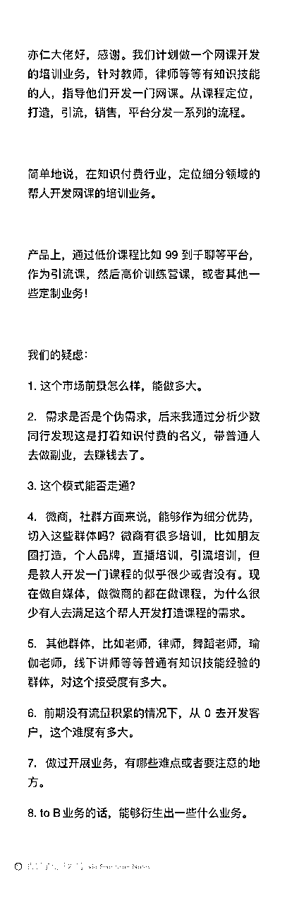

你希望，

开发一个课程，面向讲师（微商群体为主），教他们开课程；

变现通过 99 元的低价（其实 99 不低了，大多数是 9.9 ）引流课，后端做高价训练营赚钱；

模式上没问题：找到一个具体问题，用课程的方式来解决此问题，低价转高价，靠高价变现。

在回答这个问题之前，我先问你几个问题

你们在开发课程上有多少经验，有什么别人认可的品牌？是否知道开发一个课程的成本是多少？

你们初始的流量池有多大？有哪些擅长的引流渠道？

是否了解一个 99 元课程的付费用户成本是多少？99 元的低价课转化到 几千元的高价课转化率是多少？有没有很强的后端私域转化团队？

你对这件事的收益有多大预期？愿意投入多少时间和成本？

如果以上问题你都不了解，没有经验，那这个钱为什么是你来赚？

你在流量上有很强的获取手段，比如 SEO、比如裂变、比如低成本付费投放，可以大幅降低成本；

你在课程开发上有很强的 IP，有信任在，可以大大提升转化率；

你有非常强的私域转化团队，来一个转化一个；

目前来看，一个都没有。

一般来说，我会鼓励为主，但偶尔，我也要打击一下，免得浪费时间和资源投入。从你提的问题，我就知道这个事情不适合你，不要碰。

一个付费 99 元的付费课程买家，你大概会花几百块钱甚至几千块钱的引流成本，更不用说，你面对的是潜在的讲师群体，难上加难。

听我一句劝，想其他更适合自己的业务吧。

## 大三怎么开始赚钱

好好学习，趁着在学校有时间多读点书，毕业后赚钱机会多的是。

非计算机专业的话学点编程，对以后闯荡互联网大有帮助。

## 5 人团队做大了怎么分利润

平分利润也就是平分股权，创业公司典型死法之平分股权。

调整方向是没错的，把人、钱、事的权力集中到一人身上，也就是说必须要有大哥站出来。

调整必然是痛苦的，特别是当没有实际大哥的时候，但没办法，跟大家说清楚，长痛不如短痛，这是为了公司长久利益。

不过换个角度想，其他几位参与者也会很难受，谁也不愿意自己被削弱。

看是否可以这样，其他几位股份往少调一点，但是短期分红可以多给他们一点，用于弥补他们的让步。

## 每天 100+剪辑粉，怎么转化

卖短视频剪辑课程，再拉他们成为你的代理，继续引流卖短视频剪辑课程。

抖音这样的案例非常多，而且剪辑类视频比较容易爆。

## 公众号文章 10 倍阅读量增长如何实现

要么出爆款，持续写干货文章、撩拨情绪的文章、蹭热点的文章，比较难

要么做活动，送书、任务宝、抽奖，不精准，来的快去的也快

要么互推，得有人认你，而且不可持续

要么认命，接受这事不现实，都是一步步走过来的，大辉老师阅读量高，人家也写了好多好多年了。

想到这，我的 10 倍增长的野心收回来。

胖子也是一口一口吃出来的，加油，总有一天会胖的。

## 外行做小程序的一些问题

选品逻辑？ 是指做什么样的小程序赚钱？

首先要相信，没有一个外行进来就能轻松赚钱的事情，除非你有外行不具备的资源，比如，你有很牛逼的老照片恢复算法，你有很牛逼的去除背景算法，这个牛逼是指比各种云平台的算法优秀很多的牛逼，用户感知不到的差别也不算，那么，你来做小程序是降维打击，不仅仅是小程序，做其他事情也是。

所以问题来了，你们公司的核心优势是什么？

小程序圈子我有个 500 人的群，应该算是目前最牛逼的小程序开发者交流群了，但热闹是 18、19 年，现在不怎么热闹，大家也没觉得小程序怎么样，只是一个载体而已，核心还是你的业务。

短视频也是一样，现在热闹，再过一两年，几乎会变成所有业务的标配，跟所有的业务都得有个公众号一样。

我的建议，去做短视频吧，跟着风口更容易飞，逆风难受。

## 生财组织主阵地在哪儿

主要阵地就在星球。

唯一官方群是龙珠俱乐部，邀请制，会逐步邀请有龙珠的圈友进群交流。

## 引流买资源会员值不值得做

问某项目值不值得做， 只要算清楚两个值。

第一个值， 你现在的单位时间价值是多少？是 100 块，是 1000 块，还是 10000 块？

第二个值，这个事情你投入后给你带来的单位时间价值是多少，比如你花了 2 个小时做视频，2 个小时做转化，1 个小时做答疑，最后赚了 500 块钱，后续也没有复购，那么单位时间价值就是 100 块。

理论上，只要单位时间的回报大于你现在的单位时间价值，这个事情就是可以做。

但是，还要考虑成长性，考虑长期复利，一年后你的单位时间价值肯定要变大，所以尽可能多做那些单位时间回报大的事情，尽可能多做有长期复利的事情。

有些人会说，永远不要去做没有复利的事情，这个得看情况，要不要投机，取决于投机带来的收益，投机收益非常大，风险很小，没有复利，要不要做？ 当然要做。

把时间拉长后，很多问题都很简单。

## 考研做公众号，亦仁老师怎么看

放弃做公众号吧，改成加微信好友，改行做培训，收高客单价。

## 开发的兼职平台如何对接上下游

先找上游，再找下游，上游不要直接去找直客，先成为别人的代理，等你的下游足够多有议价权再找直客；

上游信任得靠案例，所以先做别人代理积累案例；

日活不应该作为核心考察指标，核心是任务完成率，发布的任务能快速有下游完成；

这种任务小程序在微信上，违背微信价值观，做好被封的心理预期，越大被封的可能性越大； 有任务需求的广告主比较少，得有专门的销售去做这个事情；

当然，市场上是有固定的任务主的，这个时候是拼渠道，也就是你说的下游，能搞定大渠道，就能赚钱。这种渠道并不依赖你的平台去获取单子，所以你得有除了平台外的资源或者利益去绑定这种大渠道。

# 2019 年

## 本地微商垫资是否有风险

合作之前先想想淘集集的那批供应商，再算算你的预期利润有多少和潜在风险有多大，能不垫资就不垫资。

## 在校大学生 BP 如何展示盈利的可行性

收入-成本=利润

根据你设定的业务目标，分别估算收入和成本，在同一坐标轴上体现，横轴时间，当收入曲线与成本曲线交叉的时候，就意味着开始盈利。

曲线怎么画取决于你对业务理解的深度，在什么阶段花多少钱，带来多少收入，收入分别是哪几个指标构成，比如客单价，转化率，复购次数，成本分别由哪些指标构成，比如人员成本，办公成本，营销费用，服务费等，每个指标你的估算值是多少，估算逻辑或者对标的是什么，等等，这些是微观层面的分析，再加一些宏观判断，基本上逻辑会比较完整。

我个人觉得这种分析对于大学生不会要求太高，只要逻辑完整，基本就差不多了。

祝好运。

## 竞品营销推广分析

之前回答过，既然你付费提问，我再发一遍。

流量相关

a.平台/素材/文案/素材重点/投放周期/成本/流量大小

b.着陆页/转化率/加载速度/页面重点/页面风格

c.对抗策略/点击率/用户群体/cloak/防封策略

转化率策略

a.logo/应用市场截图/演示视频/标题/副标题/短描述/评论/评分/分类排名/内购推广

b.版本更新文案/长描述/官推评论/安装包大小/顶部 banner/开发商

c.可信度/品牌/风格化

d.搜索联想词/关键词指数/官方推荐

产品相关

a.闪屏/引导页/新手引导/核心路径/页面重点/获取授权/异常处理/裂变机制

b.技术实现/核心壁垒/商业解决方案/相关论文/成本/迭代周期

c.交互/差异化/亮点/aha 时刻/引导评分评论/push

d.研发周期/mvp 版本

变现方案

a.定价策略/付费点曝光/召回机制/付费时间点

b.收入预估/ARPU 值/回本周期/投放 ROI 预估

c.可持续性/营销活动

d. 广告策略/广告平台/广告曝光点

关联

a.官网/同主体产品/团队背景/团队配比/目前重心

b.蒲公英平台/招聘广告/域名/邮箱/电话/用户名/google/facebook/youtube/twitter

c.马甲包/同类产品/分类排名/top10

## 想做老外的邮票网站，是否可行

在垂直流量竞争上，最终都会是数据的竞争，稀缺的数据就是流量，就是核心竞争力，独创的文章内容，也属于数据的一种。 从这个角度来看，你的邮票数据是有价值的，如果还是独家的数据，那这些数据理论上可以变成钱。

但稀缺数据只是一把剑，最终还要看用这把剑的人，配合的好才能发挥真正的威力。

所以，你得看谁最愿意为这些数据掏钱，老外对中国邮票信息了解需求强不强？他们拿到这些数据用在什么场景上？（最好是赚钱场景），如果他们只是简单的了解中国文化的需求，实际上我不看好。 漏斗的基数很小，再怎么往下漏也漏不出多少付费。

所以，去看看竞品的商业模式， 看看哪些人想靠这些数据赚钱，比如炒邮票，然后赚他们的钱。

如果找到了一个场景，大家愿意付费买你的数据，或者解锁你的功能，那么基于你这些数据最好的玩法是铺你的独家数据吸引 SEO 流量，圈子里面有很多这样的高手，比如 @夜息，可以向他们请教，我就不班门弄斧了。

最后一点，就是你想通过这些数据赚多少钱，付出多少精力，比如只是自己兼职随便做做，预期一个月多个一两千美金的收入，要求不高，那你提到的场景就有机会实现这个收入水平。

## 债务(诈骗)我妈 100w 如何追回

建议找专业的律师咨询，听下来情况并不复杂。另外私下里面查查看对方有没钱或者房产，如果是个人借款且对方有资产的话，可以申请强制执行。如果对方是以公司名义借款的话，且公司是个皮包公司，可能会比较麻烦，懂的人说说。

## 加入星球，兴奋又迷茫

绝大多数人过的生活、做的工作，其实都不是自己想要的，如果还没找到方向，不如先把手头的事情做到不可替代，做到老板要主动给你涨工资发奖金，这个时候你的选择会多很多，方向也会更明确。

具体几条建议

站在老板的角度考虑问题，用老板的心态来做事，不计较付出与回报，该加班加班，该主动主动。

站在客户的角度考虑问题，把每一个你服务的客户都能做到对你很满意，让客户离不开你，换其他人都不行。

站在业务的角度考虑问题，而不仅仅是 AE 角度，销售在做什么？媒介在做什么？渠道在做什么？产品在做什么？ 都去了解下，多拓宽自己的工作边界，甚至帮他们做点事情。

多思考多总结多写下来，慢慢来，对未来有信心，对现在有耐心。

## 如何拓展思维

有好奇心，对赚钱套路看的多，搜的多，聊的多。

不给自己设限，有些技术类的东西我也会去了解下，不一定搞得懂，看多了思路会拓展开。

尝试的多，没什么思想包袱，很多事情自己亲手做过。

分享没套路，跟我当面聊，如果对方想听，我都讲最有用的信息，形成正循环，别人也这么和我聊。

## 大型线下超市，是否导流私域

您是大佬，这问题我来回答班门弄斧了，不过还是尝试回答下，抛砖引玉，仅供参考。

第一个问题，面包在线上销售，非得选一个交易载体的话，一定是小程序，而不是 app。 App 的开发、运营、拉新成本远高于小程序，没有开发 app 经验，一定不要跳这个坑。

第二个问题，考虑面包在线上促销活动卖出去，要核算物流成本和包装成本，面包降的价格与物流成本增加的价格相比，有无明显差别，没有降价明显，不会有转化率，也就是卖不出去。

第三个问题，关于沉淀私域流量，个人认为，所谓的私域流量，在高客单、高复购、高依赖社交裂变等维度才成立，更不用说高昂的养号和运营号成本。卖面包在私域流量没有意义，但做面包店加盟有意义。

第四个问题，财富管理的问题，我的思路 是一千万以内买房，1000-5000 万以内买房、买币、买股结合着来，5000 万以上的话考虑一些生意类型项目的财务投资。

## 想做一个知识付费界的豆瓣

试试看先搞 5000 个有知识付费需求的好友，或者先写一篇阅读量上 1000 的知识付费排行榜的文章。

## 想搞一个同行群

其它都不是问题，就一个问题：

作为社群组织者，你们能不能从这个社群中赚到足够多的钱？ 不管是收社群费还是搭建平台做中间方，或者通过这个社群积累足够的影响力，可以直接帮助到你的业务。

投入产出比算清楚。

原始动力是第一，方向是其次，具体方法是最后。

## 小职员想要婴幼儿产品正品货源

给你几条建议

根据描述的经验和技能来看，还不到看方向的层面，不要说“看准什么市场”，直接去学习别人的模式，学习别人的“术”，别人一个月赚 10 万，你 100%照着“学习”，赚 5000 就行，绝大多时候，照着抄，也只能抄到 50%。

不要去找合作，合作要对等，没足够资源之前先去积累。

降低赚钱预期，小白没办法快速赚到钱，新的机会来了快速赚到钱都是有足够积累大佬的事情，以要“渡过难关”的心态来找项目，大概率最后被别人以“卖项目”的方式割完韭菜出场。

从圈子里面找一个别人分享过的“赚钱案例”，仔细研究最近的情况，还有没有人在赚钱，他们怎么做的，照着做。

## 想要国外工具网站推广思路

需要更多的信息才可以回答。

是什么下载工具？

用户群体是哪些人？

主打推广点是什么？

目前竞品如何推广？

产品留存和变现优化到哪一步？

希望达成什么推广目标？

在多长时间内达成？

有多少推广预算？

团队有多少人？

负责推广的有多少人？

能否接受不那么体面的推广方式？

## 没有执行力怎么办

目标不要定成看完全部精华文章，看完全部精华文章并不能让你收入增加一块钱，把生财有术当成你的杠杆和智囊团，当你找到适合自己赚一块钱的办法后，通过生财有术来放大这一块钱变成十块钱、一百块钱、一万块钱。

不要被别人的年入百万、年入千万吓到，每个人的背景不一样、能力不一样、性格不一样，所能做的事情也不一样，不如实际一点，想办法通过副业赚到的钱把房贷给还上，这样已经挺好；

接地气接地气再接地气一点，任何通过合法合规的办法，赚到收入之外的钱的人都值得你高看一眼，并想想“这钱我是不是也可以赚”；

动力会有周期，不会一直有动力，也不会一直没有动力，短期没动力很正常，接受这种状态，放松一下，再回到具体的执行中；

找几个圈友线上一起互相激励，当你看到几个常联系的人，都在不断的有赚钱进展，你会慌，动力就来了，尽量减少与身边太安逸的人社交；

感受金钱的善意，赚到一些钱之后去买自己之前很想要的东西，真切的感觉到“有钱真好”，这样才会有不断赚钱的欲望，有欲望才有执行力；

实操不行的时候，不要轻易放弃，坚定一个信念：这钱他可以赚，我也可以赚。 没有钱会在地上等着捡，几乎所有赚到钱的人，都是在别人遇到一点困难放弃后，他们继续钻研下去，才终于赚到钱。

## 想把自己的内容打印免费送的法律风险

没出版资质不要做书，做不大，想其他非出版品类：地图、扑克、日历、笔记本、茶杯等

田宝 ₁₈₅ ₀₃₀₉ ₈₉₀₉：

我是考虑，不公开对外卖，而是做为高端收费社群的赠品。 类似我们生财有术，赠送扑克 比如说，整理一个 100-200 页的精彩分享合集，免费送给交费参加的成员 这样操作，应该还好吧。 算作高端收费社群的内部学习资料，是免费赠送的。 分享合集，不直接对外销售

亦仁 回复 田宝 ₁₈₅ ₀₃₀₉ ₈₉₀₉：这样没事的，搞吧

## 学校不让送外卖想自己做用什么载体

微信个人号，找一个人盯着这个号做客服实时响应接外卖单，把这些愿意接单的学生拉到一个微信群，有单发到微信群，每天赚不到 1000 块钱别去想做产品的事。

## 互联网产品如何收费

大多数情况下，产品一出生，就基本决定了其合理的定价模式，更远一点，基本决定了其商业模式。

很多投资人问，你的终局是什么，其实是有意义的，产品基因决定了你能赚多少钱。

比如微信克制，龙哥的价值观确实深度影响了产品设计，但我认为这是由其社交产品的属性决定的。

回到具体问题，如何定价取决于你的产品，我倾向于：

低频刚需产品，定高客单价年会员，卡住核心的收费点，要么拉人要么付费，比如

高频刚需产品，恭喜你发财了，怎么定都赚钱；

低频非刚需，能让用户付费是你本事，靠广告赚点小钱吧，不要有太高预期，卖人头比较好；

高频非刚需，养大基数，靠广告平台赚大钱。

这么定跟我的价值观没关系，思考的出发点是如何在产品生命周期内赚到最多的钱。

至于具体定什么价格，建议多测几波。

## 一元夺宝为啥没人做了

一定是政策原因，政策放开的话，一堆就起来了。

而且也不是没人做，只是有人偷偷摸摸换个场景做，之前有朋友做了个早起打卡对赌的事情，做的挺不错，流水很高，上次去看他的时候，改造的不错，应该快放出来了。

## 菜鸟创业者如何控制成本

我的态度是不做计划，成本尽可能少，收入尽可能多。

与家庭生活的态度不一样，对于家庭内的物品添置，我的态度是能力范围内买最好的，但对于创业，特别是初期一些设施的添置，我提倡只买最必要的，把钱更多的花在刀刃上，比如团队成员的能力和效率提升上。

跟合伙人沟通看看吧，他坚持想买也别拦着，有时候可能就是想通过一些动作来找点存在感。

## 星球适合什么人以及技术人的一些问题

我的关注点在于做一个持续产生被动收入的产品，所以本星球可能讨论产品、软件多一些，但这不是重点，不做产品，也可以持续稳定的产生很多很多收入，最近这一期很多人发的介绍和经历已经证明了这一点。

我不建议你做自媒体，也不建议你去找人开发程序，不太适合你。

给你一个小建议，将每个人的自我介绍都看一遍，然后找一个已经赚到钱并且 TA 的方法在你的能力范围之内，主动去勾搭请教，发红包、请吃饭。

被拒绝没事，很正常，真诚的主动是法宝，给别人发消息没收到回复也非常正常，大佬都很忙，再多发几遍，总是能逮到大佬空的时间。

## 到期不续费，之前的内容还能看吗

前面的内容都可以看。

## 高中生周边服务的推广和盈利?

没有仔细研究过这个行业。

如果是我的话，可能会这么做：

变现靠 低价会员引流，高价个性化方案做收入，以及与高校合作，按 lead 收费。 主要会看两端谁更需要谁，为被需要的那端提供免费服务。

线下地推 我会尝试代理制，与学校里面的相关人比如与老师谈佣金分成。

会销可能是一种方案，通过各种手段让焦虑的家长立即转化，没试过。

# 2018 年

## 微信号被封

模仿一个正常人来使用，养一段时间，比如一个月，再去满足营销的需求。 注册完就加人、发广告，必封无疑。

## 抑郁工作给点儿建议

降低预期，接纳自我，找一个喜欢做但要求不高的事情先开始，或者没有太大的生活压力的话，做一段时间自由职业者看看。

方便的话私信下之前的文章作品，另外英语怎么样？

## 少儿推拿招不到人

招人我没太多经验，从现有的客户里面转化员工如何？ 欢迎其他有经验的圈友们分享。

火苗🔥：个人感觉可以参考理发鼻祖，文峰的模式。

1.三四线城市招收学生，培训收费

2.学完门店低工资实习

3.实习之后，合格者留下，不合格回炉再造

不太了解少儿推拿，供参考。

亦仁：@黑少爷 @Davy 有经验么

黑少爷：创业者的噩梦 - 为什么没人能帮忙。

曹老师这篇文章建议好好看看

## 竞对小程序流量怎么看

正常回答：这个数据机密数据，除了竞争对手和微信官方，其他人都看不到，或者如果他们嵌入了第三方统计插件，统计平台可以看到。

非正常回答：搞定一个微信的人，请他吃饭聊天，旁敲侧击，大概能了解点信息。

## 公众号如何裂变阅读量

虽然我想说考核阅读量不是一个合理的指标，不过既然确定下来这个 KPI，那就想办法去实现了。

想短期突破平衡点，粉丝数还没有大的变化的话，只能在文章内容上想办法。

也许可以试试：标题党（“恭喜发财，现金红包”，效果真的好）、鸡汤易传播的文章（比如最近的“成年人不轻易崩溃”）、红包海报、抽奖、锦鲤、转发有奖、各种模版消息、互推、广点通投放等等。

参考别的银行类公众号有哪些好的思路，照着学习，与微信规则对抗可以短期突破，但同时也意味着一些风险。

## 我的人生不该这样

你愿意花高价进这个圈子，愿意主动提问，愿意讲自己的出身，不满足现状，都能说明很多问题。

你在哪里呢？ 如果在杭州附近的话，可以来找我，我找几个朋友跟你一起聊聊。

亦仁：给几条建议

人生不是规划出来的，是干出来的，不用规划，先把别人安排的事情每次都干到超预期；

穷和出身会影响人的思维，但好消息是，穷让人有更大的拼劲，草根逆袭的故事太多了，就怕穷且没有赚钱欲望；

不要急着去找大佬、找人脉、找资源，所有的关系本质上都是利益交换，在自身价值还比较弱的情况下，不如先积累一段时间；

开始兼职开始在互联网上赚钱，并定个目标在互联网上赚到第一个 1000 块钱，别小看这 1000 块钱，质变的意义；

调整观念，所有通过正当的、不坑人赚到钱的办法，都是值得鼓励和点赞的， 赚钱这个事情没有 low 不 low，觉得 low 的人是站着说话不腰疼；

赚钱分阶段，早期在没有一点原始资本的情况下，一些不那么体面的事情大家都可以理解。

我当不了什么人生导师，每个人都身陷自己的认知牢笼，说了这么多废话，还是指几条具体的路：

从淘宝客开始，在双 11 赚到第一个 1000 块钱。

开始做一个抖音账号，研究别人怎么玩的，照着抄并学习；

做一个公众号，什么内容热门发什么，积累粉丝赚广告收入；

将本圈所有的内容看一遍，然后找我聊聊。

## 微信课堂服务如何获客

产品方便的话发出来看看，大家一起帮你出谋划策。

如果本身有非常大的产品个性化需求以及销售量，10%的技术服务费也是很大数额的话，以下的话当我没说。

我估计你们团队技术出身，技术强，技术思维也比较重，如果你们产品还没做出来，我真的会极力劝阻你们不要去开发这样一套系统，不值得，更不用说是为了省 10%的服务费。

这半年，我最深的一个体验就是：做产品，从研发上线到真正用户嘴中的好用，还有若干鸿沟，没有几个月的细致打磨，产品到不了爆发的临界点。

不过既然已经做了，说太多也没用，那么我分享一下关于获客的观点。

首先要想办法将微信课堂差异化，小鹅通一年 15 亿的流水，足以证明他们在微信生态做知识付费的技术和服务有多强，如果仍然在定位上与小鹅通一致，做知识付费课程的技术提供商，难度会非常大。

差异化可以从类目上开始，比如女性知识付费、创业知识付费等等，最好能在整个 UI 层面体现出来这种差异化，用户一进来就能强烈的感受到不一样。

或者某一种特性服务开始，比如易灵微课打的未听课退款的点；或者商业模式上做一些差异化，比如深度与某类目下头部的 KOL 绑定（股份层面），从一个小类目开始逐步各个击破。

多混一些可能使用你们课程系统的用户群体的圈子，但我估计，你能想到的大部分用户，特别是微信生态最头部的大 V，已经被反复 BD 过。

百度广告可以尝试找一些新的关键词投放，毕竟做系统的人没那么多，关键词未被挖掘完毕，可能还有一些机会。

直接花钱去买断一些课程，做成一个垂直品类的课堂，如静雅课堂，然后用广告投放与分销裂变的方式来运营。

或者类似于一修读书，用比较通用一点的课程，比如赚钱、读书、打扮、母婴等，测算好 ROI，直接找大 V 投放。

最直接的建议，趁着还没掉坑太深，放弃做深微信课堂的想法。

不过，以上说的可能都不对，具体得你结合实际情况来考虑，供你参考。

## 想用长处打短处可看别到赚钱机会心痒

你说的对，拿自己的长处去竞争。

小程序、抖音这些都是载体，如果你无一技之长，那么做一个抖音帐号，什么题材热做什么，做一个鸡汤抖音号、做一个书单抖音号，但同时也意味着竞争异常激烈。

而你有一技之长，你很懂金融，那么你要做的是大家一直在讲的“互联网+”， 抖音+金融， 小程序+金融，公众号+金融。。。将你的长处通过这些渠道去放大。

比如，开一个抖音号，将金融的若干概念深入浅出的讲清楚，能做到，坚持一段时间，看反馈。有认可则继续，没认可则换其他方向。

开课程、开 live 只是变现的一种方式，可以先不考虑如何变现，积累一堆信任你的人，给他们提供价值，然后，他们会主动给你钱。

## 需要大量手机号怎么弄

百度搜索验证码平台，可以找到一堆。

同理，找国外手机号码的验证码平台，也可以找到一堆。

## 关于微信号运营的的很多问题

1、多微信号可以用在哪些场景上，为什么要很多微信号

微信号可以用到那些场景上，这个是根据自己的需求的。多微信是为了更方便的精细化管理。一个微信号类似于一个标签和 ip

2、我看到的是很多很多个个人号目的之一是朋友圈卖课，那么朋友圈卖课的转化率怎么样？有没有一些数据分享

很多的朋友圈卖课是因为他们经常进入很多的免费学习群（微课）。然后加群内的好友卖课。卖课的转化率是根据自己加的粉丝质量和自己朋友圈的质量来决定的，如果单纯的只是加人，没有互动，朋友圈对自己也没有很好的包装，也会卖不好。

3、朋友圈人设怎么做，有咩用一些学习案例

你试想一下，你看到什么样的朋友圈时，会认定对方是某种类型的人？

是不是经常做同类内容信息分享的人？比如经常发糕点制作图片的人，你就会觉得她在做糕点上非常厉害。

多梳理自己朋友圈的信息，不要乱，要专。

4、求推荐一些多个微信号管理和运营的工具

运营的工具：建群宝（目前在修复）、爆汁、Wetool

多个微信号管理：一号一机器或者是买多开手机（具体手机某宝搜）

5、常用的有两个微信号感觉精力就很兼顾了，那些用各种自动化工具管理的营销号很容易就看出来了，估计信任度不行。如何花更少的精力维护好高质量的微信号，或者如何在投入的精力和信任度之间取得好的平衡？

微信主要互动的地方有 2 个，聊天消息和朋友圈，如果有时间和精力，可以用聊天的方式协助别人去解决问题，这种是一对一的互动，信任度是最高的。

如果没有精力做维护和互动，就要善用朋友圈，这是一对多的互动。

多用朋友圈去塑造自己的生活状态，别人会觉得你个活生生的人。如果你没有内容，有一个词叫搬砖，利用信息的差异化，搬对应 ip 的朋友圈的内容。

同时，也可以进行互动活动，比如建群交流，通过朋友圈拉人进群，在朋友圈提问回答等。

6、微信号的风控规则，比如每天主动加人各渠道相对准确的数据，比如什么样的用户行为可能导致被封？

1）现在每天加人是 40 人到 80 人，一般不怎么活动的微信号加不了那么多。建议是有自己的一套引流被动加人方式。16 年的时候，我们一天的被动加人是 800 人到 1000 人。3 天可以满 5 个 5000 人的好友。

2）比如什么样的用户行为可能导致被封？—-附上很久没更新的文档。

7、每个微信号从注册到养号的成本是多少？成本构成是哪些？

成本就是手机卡的钱，如果号不多的话，可以用卡。例如一个月租 10 元，300 个号，就是每月 3000 的成本。如果想做营销号的话，市场微信号的价格是 30 到 300 不等。

8.实名号一张证件 3 个运营商 15 个号，算上亲人的证件也就四五张证 70 来个号，证件的资源是有限的，如何突破上百个号？是否涉及到买号？看到有人说企业营业执照可以办 50-100 张卡，但是这些卡如何实名？

3 个运营商的上线是 15 个号，用公司企业营业执照去开的话，个人也是可以开开多 5 个（例如联通，自己去营业营是 5 个，用公司企业营业执照去开自己的实名还可以 5 个，是两个不一样的系统）。

9.为什么一个微信号一个手机，在一个手机来回切换不同微信号会有什么影响吗？

不回有影响的，建议还是去买台多开的手机，小米的可以开 3 个，某手机能开 8 个。稳定

10.多个微信号，绑定银行卡这件事怎么解决？目前是每个人最多绑 5 个微信号的银行卡，如果管理几十上百个微信号，还想限制少点要绑银行卡的话，该怎么办呢？

目前只能绑定 5 个，上百个的话需要找人实名。17 年 5 月份的时候，微信出了 bug。直接扫码到 ipad 上登录，把微信的版本退档，可以突破 5 个实名的限制。（当时用这个方式实名了很多好，坏笑：）现在不行了

11.如何在有多个微信号的时候有效查看朋友圈？

这个就要看自己的时间分配了，重要的朋友圈先看

12.微信分类使用，分类管理是怎么做的？毕竟超过几十个号的话很难全部绑卡的，那么使用者就会根据功能或者说定位不同，去用不同认证级别的微信号，大佬们是如何对各个微信号的使用做出规划，想听听大佬们的最佳实践

分类管理一个号一个标签，不冲突。最佳的实践方式是。把别人觉得有苦有累的活自己做到极致！

额外补充：

可以自己弄一个 h5 的页面，然后放几个动态的二维码，开完课在群里面发群公告，需要老师的 ppt 和关于这几课的资料包，加小助手审核领取，做的细一点的话，领取的时候在叫他们发朋友圈，然后这个朋友圈是加个人号的，这样的话个人号就会有很多人加。

【附上封号和养号知识】

被封号的 20 种原因

1、 频繁的切换微信账号 频繁转账 群控 微信多开软件 10 个微信或者 10 个群控手机 频繁切换 商业交易频繁转账

2、 频繁使用敏感词汇，支付宝 转账 股票 炒股等 尤其是新号的时候

3、 在微信多开上面注册的微信号，所注册的微信号很容易被封，改写了微信的源代码，很容易被查封

4、 经常使用集赞

5、 自动抢红包软件 虚拟定位软件

6、 安装多开数量比较多

7、 被封的微信 之前封过 就好比现在的话 14 年的时候 微信外挂软件 被封了 解封过的微信很容易再被腾讯追踪 这一点要谨记 解封的微信要及时导出微信好友

8、 使用多开去开定位功能，比如说使用多开 附近的人加好友这个功能 明明在天河 却定位到北京 也会被腾讯检测到 不一致的地理位置会被腾讯监控到

9、 新注册的微信号直接就用多开去登陆

10、 买别人的号或者在软件上生成的号 会被检测到时非法注册的

11、 同一台手机批量注册微信号 一天注册了 20 个微信 被封了十多个

12、 注册新号立即添加大量好友并且发信息

13、 注册新号立即切换到别的微信号去登陆，不允许

14、 大批量微信绑定 QQ，所有绑定的 QQ 昵称 头像都雷同

15、 170 171 130 开头的手机号不要买 虚拟的运营商缺少线下的网点 实名制做得不到位

16、 曾经注册过解绑的手机号再去注册微信号 也很容易被封

17、 我们不能大量微信号同时转发同一条 H5 几百上千即大量微信号

18、 同一个手机号最多注册三个微信，周期为一个月 三个月 一年

封号一定要满足两个原则：

1、 系统检测到异常操作，就是上述 18 种

2、 被用户投诉举报

被封怎么安全解封：

1、 系统会追封一次，前提是不要让腾讯检测到我们的操作有异常，操作批量的微信号要模拟人工操作，腾讯觉得你是一个真人在操作才不会怀疑你

2、 解封前先卸载原客户端，在解封，然后不要加好友 正常使用两三天后再营销操作

3、 通过软件解封的追封几率很高，很有可能被永久性封号。解封要手机号或者老微信用户帮你验证

4、 每个手机号一个月可以解封一次，半年两次，一年三次

怎么避免被腾讯判定为账号异常呢？

真实 信用 活跃三个维度判断是不是真实用户在使用

微信注册后要添加三到五个好友 互动

信用：绑定银行卡 开通微信支付

活跃：关注公众号，收藏，下载表情包等等

怎么养号：15 点

1、 新的微信号 两周内静止营销操作

2、 绑定手机号 QQ 邮箱 多登陆 QQ 邮箱

3、 发朋友圈，但不发硬广告

4、 微信名不加 A、O 等等

5、 加公众号

6、 购买理财产品 两块就可以

7、 进行腾讯公益每月一捐

8、 加点微信群，如果微信没有绑定银行卡 超过 100 人的群是进不去的

9、 不要在同个 wifi 下申请微信号

10、 新微信号五天内不点附近的人

11、 信息资料要尽量完整 模拟真人操作

12、 绑定银行卡 充值到微信钱包 有资金的账号有效防止被封号

13、 腾讯 QQ 同一家 QQ 上面付年费可以增加不被封号的概率

14、 头像 个性签名 昵称新号不要频繁换 三个月更换一次

15、 时常留意有没有风险操作的提醒 加群 有互动 加老号

通讯录加好友 10 个小时内只能加 25 个好友

查找微信号 10 个小时内只能加 15 个好友

扫一扫 一次只能 15

摇一摇 一次只能 10

面对面建群 100 以内

被动添加 一天 260

主动添加 一天不能超过 30 人

不提倡暴力加粉 好友上线 5046 最好是 3000 人粉

## 被“云连惠”骗得倾家荡产

一开始大家都不信，然而看到了身边的财富案例，体验到了小额的甜头，就开始倾家荡产，幻想一夜暴富。

显然不能信。说教赚大钱的都是骗子。

## 有 1 百万加盟号码怎么利用

思路同上面两条，加个人号，养 IP。

补充一个点，如果这些人你只是有联系方式而没有之前与他们建立过联系，比如从某个渠道获取到这些联系方式，那么不妨你真的去从网上找一些比较有价值的加盟信息，然后提供给他们，先建立信任，让他们知道你真的是在帮助他们。

然后，如果你有能力，做一个自己的加盟品牌最好，如果还缺经验，找一些做品牌的合作，比如我们圈子里面就有大佬做加盟品牌做的很大的了。

## 有一批宝妈的电话

与上面的答案思路一样：导流到个人号，在个人号上建立个人 IP，从主动回答问题，到 2 元的 live，到几十元的课程，到几百元的线上俱乐部，到几千元的线下活动，到几万元的超级 VIP。

不过，你要真的在减脂这个事情真的比大多数人要专业，而你又善于将这种专业通过一些手段让他们知道，最好的传递专业的方式我认为就是憋一篇干货文章，逐步的传递价值，建立信任，可以用一些套路，但脱离不开给他们提供真正有用的东西。

需求没问题，找到一个合适的解决方案，1000 个铁杆粉丝养活一个小团队应该很容易。

## 网站一天 500 访问如何变现

我的小小建议供参考，看看玩微视频的人下载视频的目的是什么，在哪些场景下最高频最刚需，一方面在他的这个场景下提供更深度的服务以便榨取更高的价值，一方面在他的场景下，顺藤摸瓜找到相似场景下的客户，毕竟愿意出来主动找解决方案的都是少数人。

举例来说，你可能会发现，很多人下载抖音视频并上传到微视，一部分人在做搬砖的事情，一部分人在转移自己之前的视频，也许可以考虑提供一个一揽子打包上传的方案，收个高价。

500IP 每天虽然不多，但也最好留个个人微信号沉淀下来这些人，沉淀了几万人之后，说不定微视就会来找你合作，以后有相关的产品也可以再次销售。

## 推荐电影电视剧

不知道你的偏好，随便推荐几部美剧吧，大家应该都看过：硅谷、黑镜、绝命毒师。

## 高端车车主资源怎么用

肯定是找围绕汽车相关的痛点和需求，因为不是特别懂这个群体。所以给不出具体可执行的意见。

也许可以尝试付费社群，建议向本圈特斯拉社群群主@小特叔叔取取经。

另外有一个小程序叫 汽车大师问答，做汽车相关的知识付费，看文章说他们的数据很好，可以参考看看。

想搞大一些呢，可以把这些人做为种子用户，联系@鉴锋 或者 @王六六 合作搞点相关群体的裂变， 比如“冬日汽车保养你必须知道的十点”，然后有了这些群体沉淀下来，进一步去接广告或者其他变现方式。

还是得跟他们多聊，了解他们的通用需求和痛点。

## 如何介绍区块链的重要性

我并不知道... --亦仁

**Caoz：**第一，先要知道你们用户是谁。

第二，要知道他们最感兴趣的，或者最苦恼的是什么

重要的不是新颖，而是让受众有代入感，一下子被你带入场景

# 2017

## 小程序制作成本

看不同的项目，有些项目很简单几千块钱就可以搞定了，有些项目复杂的话十几万也不一定搞得定。

主要成本就是开发成本吧，按照程序员的工作天数*1000 简单可以估算。

## 入门区块链

白话区块链

Caoz：这个电子书我觉得很好，强烈推荐。 blockchain_guide.pdf

## 有价格优势如何做好

如果是价格优势的话，就找已经在消费这个商品的人好了，不需要说服过程。

裂变不会有效果，因为你并不能通过价格低来说服一个对你的商品没有认识的人产生购买行为。

## 如何进竞品的微信群

提供几个思路供你参考

搜狗上搜索微信文章，关键词“扫码入群 棋牌” 等，设定搜索时间是一天内，能搜索到一些竞争对手的微信群，亲测有效。

找到竞争对手的品牌名称，在所有的搜索引擎搜索， 如百度、QQ 群搜索、淘宝、豆瓣、微信等，设定搜索结果为最近一周或者一天，跟踪对方的踪迹，找到对方的群；

找到棋牌用户的聚集地，比如百度贴吧、游戏大厅、直播平台等，你的竞争对手一定会到这些地方拉人，顺势混进去。

找到棋牌用户，直接付费让他拉你进这样的群，拉一个给多少钱，并让他推荐其他人拉你进群，这个可能是最精准、效果最好的方式。

## 做美剧公众号如何避免侵权

只提供信息和资讯，不提供版权内容存储，提供聚合与导航的价值，最终视频导到别的网站，类似 readhub。

## 本地公众号如何做

因为没做过本地公众号，可能不对，供你参考。

首先，有没有机会看你怎么定位这个事情。 如果说，你希望通过一个三四线本地公众号融资上市走上人生巅峰，我觉得机会比较渺茫。 如果说你只是希望通过这个公众号赚点小钱，比如说一个月几千到几万，那么我觉得机会非常大。

我认为精准垂直的本地号，一定有机会。特别是在你的竞争对手都急于变现，内容都乏善可陈的情况下。 做一个差异化的公众号，通过优质内容来形成竞争力。 换位思考下，如果你发现一个写你身边真实发生的有意思的事情，写的还特别真诚靠谱，你会惊喜嘛？

比如，杭州这个区域，围绕杭州这个写本地号可能比较难，因为已经有行周末、杭州佬等非常会写内容的大号，但如果我切一个更细分的区域，比如城西、未来科技城等，机会可能还不错。

## 姓氏资源如何利用起来

没有什么好的思路，6 月 1 日“网络安全法”实施后，建议尤其谨慎对待个人信息的处理。

## 为运输安全企业提供安全系统

这个产品很有意思，典型的内容转工具的思路。我对这个行业不了解，没什么思路，瞎 YY 一些

除去正常的功能性收费，既然有这么多大巴接入，有没有可能做广告的发布平台？

或者有没有可能组织一些收费的安全培训？

或者组织一些大巴司机俱乐部？

或者做一个常错题的收费导出功能，类似于猿题库？

Alan：个人浅见：既然这么多客车都部署了这个系统，可以以这个系统为入口来绑定其它系统，例如行车记录仪，例如车载音响，例如车载 wifi，可以跟其它相关系统公司合作，再从这些业务里找变现机会。另外既然是做安全系统，必然有很多违规操作数据，把数据变成模拟器，然后跟驾校合作

## 美食公众号如何变现

所有的美食类公众号，它们的变现方式梳理一下，排一下你觉得可能效果最好的，试试看。

不太需要创新，只需要寻找

## 创业公司做"共享"

建议 36kr 上搜索一下“共享”，可能可以找到所有目前可以共享的创意。

思路:在比较优质的搜索引擎进行搜索,这里的 36kr 我理解也可以类比为生财有术索引站

## 传统茶叶如何销售

年轻人一般不太爱喝传统茶叶。

想结合微商来卖茶叶，真没啥思路。 我喝茶少，圈子里面也没什么微商。 有思路的来回一下，好答案我也赞赏！

这根葱：懂点微商，但是不懂茶，试回答一下：传统微商靠的是刷朋友圈，开发布会，讲发财梦等主要手段。这一整套围绕的都是发展下线这个核心。有了下线，一层往一层批发下去。到了底层没办法动销了，要么出新品要么品牌垮了。这也是微商被诟病很重要的原因。回到你的问题，你个人用微信这个渠道做茶叶。“微信上懂茶叶的朋友”的定位，可以按照引流➡️成朋友➡️成交➡️分享引流的思路去执行。引流方面那就是 n 种渠道引流到你的微信号上，可以是粉丝通的广告投放，可以是送给生财有术的朋友茶叶的形式，也可以是微信派单形式等等；成朋友方面核心是你的朋友圈打造，朋友圈不是你的广告圈，个人生活+广告+茶叶相关+互动+节日的活动促销；成交与分享引流方面，成交的顾客利用感情，利益等各种方法让他分享到朋友圈，再引一波意向顾客

产品方面个人建议按照：与其更好,不如不同的思路。茶叶➕茶点做成你的特色。外包装上比如十二生肖茶包装等等，你的茶故事上（商品附上你手写的茶故事单页）也可以下点功夫。这一段主要是让你更好推广，顾客更好拍照发朋友圈。只有一个有与众不同产品大家才会分享。

另外自己要学的话，进入这个圈子学更快，微商上有农特产品的圈子，加上 100 个这种微商微信，总结整合优化，基本上也够用。如果需要信息的话，私信我吧，不提名称，不给他们打广告。

## 日本苹果 id 渠道推荐

淘宝，我之前买过。

陈俊强：安排个人，去注册吧，当年哥发 imessage 也是，几个客服负责注册账号

## 如何快速推广问卷

我得先了解一些背景才能回答你， 是什么类型的调查问卷？ 目前基数有多大？目标是多少？ 自己目前有什么渠道？期望在什么渠道传播？ 填完问卷后对填问卷的人有什么好处？

马玉爽 :我是姚佳佳的同事，我们这是一个旅游类的调查问卷，一个小时之前在朋友圈发布目前有 120 个样本，目标是 1000 个样本，目前的渠道只有朋友圈，想不出来还有什么渠道所以想咨询一下，看看有什么更好的办法，暂时没有好处，遇到瓶颈时可以使用抢红包的方式

亦仁:基于现在的情况，只能主动去推了， 找一些微信群或者 QQ 群去找人填，然后发点红包。

如果希望引起被动传播的话，有两个问题

填的人会有什么好处？

是不是填完之后有抽奖？填完之后可不可以看到现在的问卷数据？是不是填完后就有红包？或者是不是填完之后能够有一种优越感？

帮你传播的人会有什么好处？

是否有红包给到帮你传播的人？是否让帮你传播的人觉得分享这个问卷让他觉得一种优越感？ 比如说 问卷名设计为： 在一些城市 CBD 工作的体验调查，这种可能会有一些人在帮你传播了。

## 运营书籍/圈子推荐

运营更多的是实践找用户感。

最好把自己打造成一个同时懂产品和运营的人，这样才会有一种力量释放出来，也许是目前流行说的“全栈运营”？

如果推荐书的话，推荐看看《运营之光》、《增长黑客》

最好学运营的方式是 挖掘。

## 有个自认为很好的 idea 团队支不起来

或者找技术外包，或者用这个想法试试看能不能打动靠谱技术同学或者同事，看看是否有合作的可能。 但我的真实想法是，如果只有想法，而没有匹配的团队，可能这个想法并不能产生多大的价值，想法不值钱。

## 大佬如何构建自己的知识体系

圈子里面到是有几个这方面的大牛，我帮你圈出来，回不回答就不知道了 @易仁永澄 @V 先生 @Scalers @秀燕 求分享。

榴莲哥：https://www.zhihu.com/question/31154592/answer/514...

易仁永澄：这个问题很高级，被 luke 提到，我来交流下我的思考。

我从 2002 年开始到今天，每天保持书写，少则 300 字，多则 20000 字，基本上没有中断过。目前，我在公众号：永澄老师（id：YCmentor）保持日更中。

我信奉芒格主义，我相信任何复杂的系统背后一定有其基本规律，并且以基本规律展开形成整个系统。我认为知识体系的关键词有 5 个：概念、模型、结构、认知逻辑、表征。

概念是整个知识体系中最最最重要的部分，概念是对事物的抽象描述，比如熵增、自洽、定价错误、品味等等，它们可以快速搭建出知识体系的核心点。

模型是对套路的描述，比如 port，rsqc，smart 等，一个模型搞定一个套路。但是模型中的每个点都是概念，如果概念不清，模型也不见得用的好。结构是更高级的模型用法，本质也是模型，比如说 grow 成长模型，它可以反复进行自我嵌套，比如说黄金思维圈模型，也是模型，也是结构，可以用来将其他概念和模型嵌套的模型，就是结构。

关于认知逻辑，是新知识和旧知识之间的打通方式，元认知学习法中提到，人只能用原有认知来认知新事物，也就是说，如果新认知没有被理解，就无法扩张自己原有知识体系。有个非常简单的方式可以训练，那就是问问自己：我新学习的东西跟我有什么关系，就可以了。

关于表征，通常对应于认知一词，简单来说，只有实践的认知才是表征。没有表征不可能形成知识体系。

总而言之，概念、模型、结构是对思维抽象的描述，认知逻辑是对新旧认知关联的描述，表征是对实践的描述。

至于别人如何愿意看。套路有二：产品经理思维和营销。

胡克 回复 易仁永澄：大佬机高度就是不一样，看来牛叉的人看法都差不多，如何做就就够我们学一辈子了

亦仁 回复 胡克：推荐永澄老师的一篇文章永澄：目标管理从入门到精通

## 做每日一首单曲循环小程序版权问题

我感觉在做出日活几万之前，应该没人会在乎你？

如果你放的是链接，而不是直接上传，没有版权问题的。

## 看信息用什么好

既然是获取信息，而不是深度阅读，就没必要做推荐和筛选，我把这个 app 里面几乎所有的还相对靠谱的源都订阅了。

如果要精选，直接用大辉老师的

Readhub 吧

注:该网站截至本文撰稿结束还在,稳定运营 7 年+

## 对擦边软件怎么看

我不看啊。

这付费提问的钱太好赚了。

亦仁：正经一点，我不了解那个行业，所以也没法回答。 不过我希望提供价值赚钱，而不是骗人赚钱。

## 公众号除了粉丝怎么变现

因为不知道你的公众号类型、用户类型，如果方便的话，可以将公众号放出来，看完具体情况才能给出具体建议。

如果不方便，我建议仔细分析下，你的用户关注你的公众号的目的是什么，或者需求是什么，然后针对这些需求设计出一款付费产品。 可以是一堂美妆课，可以是一个付费交流社群，可以是一些整理好的付费资料。

还是要看用户需求，对症下药。

如果要接广告的话，如果不能做到像咪蒙那种软文，而是赤裸裸的硬广，我个人不推荐，钱少，也伤用户。

注:核心是这块儿的思路,根据用户需求挣的钱,更持久

## 国外网站视频下载如何规避版权

个人觉得，对于小团队或者小创业者，工具属性的产品前期不需要太过于考虑版权问题。

## 如何查看竞品流量

一个思路： 在各种可能的搜索引擎上搜索对方的网址、slogan、CEO、网站名称、产品名称、品牌等，在哪里曝光多，就说明哪里给他带来了流量。