# 最新 AI 工具动态

> 来源：[`longalong.feishu.cn/docx/C9N3dIvHnoZloHx7MVPcIN9nnJb`](https://longalong.feishu.cn/docx/C9N3dIvHnoZloHx7MVPcIN9nnJb)

## 9 月 18 日～24 日

ProPainter：一键移除视频内的移动物体，一键移除视频水印。基于 E2FGVI 实现。之前的视频版 SAM：Track-Anything 也实现了类似的效果。

ProPainter：

项目：https://shangchenzhou.com/projects/ProPainter/…

Github：https://github.com/sczhou/ProPainter…

Track-Anything：https://github.com/gaomingqi/Track-Anything…

E2FGVI：https://github.com/MCG-NKU/E2FGVI

examor

复习考试、准备面试的好帮手。

另类文档对话工具：借助 AI 把你的学习资料、学习笔记生成考试问题，然后你可以基于这些问题进行回复对话，AI 对你的回复进行打分和点评。

https://github.com/codeacme17/examor

搭建 AI 对话机器人，一行 JS 嵌入自己网站

https://kbasebot.com

功能：

1\. 多种数据源支持：文本（2w 字符）、文件（最大 20M，支持 pdf、txt、Json、csv、docx）、网站（自动爬网站、单网址、Sitemap 读取）

2\. AI Bot 样式自定义：定义 Logo、名字、欢迎语、颜色、网页位置等。

产品思路没太多新意，但解决方案相对简单。

只需添加一些文件和网址，把生成的 bot 嵌入自己的网站，就能对外提供 AI 对话服务。

缺点：功能相对通用，定制性不强，如果做相对复杂的企业网站客服工具，可能还是用相比 http://Voiceflow.com 和 Intercom 的 Fin 会好些。

LifeReloaded

一个有趣的开源项目：人生重来模拟器。

由 GPT4 的 Advanced Data Analysis 功能驱动的人生重来模拟器，给您人生第二春。

“人生如梦，万事皆空；不过，'空'中便有万事万物。” 如果你曾对人生有过无数的“如果”和“要是”，人生重来模拟器 LifeReloaded 给你一个重开的机会，焕发人生第二春！

https://github.com/hamutama/LifeReloaded

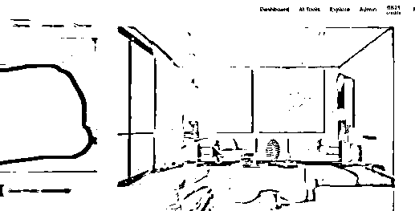

c：一个专为建筑和室内设计提供 AI 渲染工具的平台

他们提供了一些列的 AI 工具，覆盖室内室外设计、草图转设计图、景观设计、概念设计等。

可以帮助设计师和建筑师快速地将他们的设计草图转化为真实的、高质量的渲染图像。

不仅如此，还可以帮助设计师快速地尝试不同的设计风格和元素，从而为他们的项目提供更多的选择和灵感。

https://github.com/CorentinJ/Real-Time-Voice-Cloning

利用他人的声音生成他的声音

Google Bard 更新，推出新的模型，并与 Google 的应用和服务进行了集成。

Google Bard 称他们发布了一个新的、更加先进和强大的 AI 模型。并且可以与其他 Google 的应用和服务集成和进行交互。

Google 称他们还优化了“Google it”功能，以便对 Bard 的回答进行复查，并将功能扩展到了更多地方。

主要更新内容：

连接到 Google 应用和服务：Bard 现在可以与您日常使用的 Google 工具（如 Gmail、Docs、Drive、Google Maps、YouTube 等）进行交互，并为您显示相关信息。

轻松核实回应：现在，可以使用 Bard 的“Google it”按钮更容易地核实其答案。当您点击“G”图标时，Bard 会读取回应并评估是否有网上的内容可以证实它。

在更多地方访问功能：正在扩展对现有英语功能的访问，如使用 Lens 上传图片、在回应中获取搜索图片和修改 Bard 的回应，这些功能现在支持 40 多种语言。

PaLM 2 模型更新：所有这些新功能之所以成为可能，是因为对 PaLM 2 模型进行了更新。

详细：https://blog.google/products/bard/google-bard-new-features-update-sept-2023/

@OpenAI

的微调用户界面现已上线! 🔥

现在可以直接看到你的微调效果，并且在接下来的几个月里，你将能够通过用户界面来创建它们！

我们还将同时训练的上限从 1 提高到了 3，所以你现在可以微调更多的模型！

这是一个具有深远意义的更新。首先，用户界面的直接微调功能将大大提高用户的便利性和效率。过去，用户可能需要复杂的编程或间接的方法来实现模型的微调，但现在，这一切都变得直观和简单。

这一更新标志着 GenAI 技术不断降低门槛，普通用户无需深入学习复杂的编程知识，也能够更容易地利用 OpenAI 的强大能力，进行模型的微调和创新。

另外，同时训练的上限提高显示了 OpenAI 的技术进步和云计算能力的提高。这意味着用户可以在相同的时间内进行更多的实验，加速创新和研发。

整体上，这一更新不仅仅是一个技术进步，它象征着 GenAI 技术正逐渐成为每个人都可以轻易接触和使用的工具，开创了一个新的 GenAI 技术普及的时代。

大型语言模型 (LLM) 具有在多智能体系统中执行复杂调度的能力，并且可以协调这些智能体完成需要广泛协作的复杂任务。然而，尽管引入了许多游戏框架，社区在构建涵盖 LLM 和人类与 NPC 协作的通用多智能体协作基础设施方面还没有足够的基准。在这项工作中，我们提出了一种新颖的基础设施 - MindAgent - 来评估游戏交互的规划和协调紧急能力。特别是，我们的基础设施利用现有的游戏框架，i）需要了解多代理系统的协调员，ii）通过未微调的正确指令与人类玩家协作，以及 iii）建立关于少数人的上下文学习拍摄带有反馈的提示。此外，我们还引入了 CUISINEWORLD，一种新的游戏场景和相关基准，可调度多智能体协作效率并监督多个智能体同时玩游戏。我们使用新的自动度量 CoS 进行综合评估，以计算协作效率。最后，我们的基础设施可以部署到 CUISINEWORLD 的定制 VR 版本中的现实游戏场景中，并适应现有更广泛的 Minecraft 游戏领域。我们希望我们对法学硕士以及通用调度和协调的新基础设施的研究结果能够帮助阐明如何通过学习大型语言语料库来获得这些技能。

Stable Diffusion has a competitor & it's 3x faster!

Introducing DeciDiffusion!

An open-source, text-to-image latent diffusion model that works at blazing fast speed.

Here's what makes it special:

Superior Computational Efficiency:

DeciDiffusion achieves the same quality as Stable Diffusion in 40% fewer iterations.

But wait, there's more!

When combined with Deci's state-of-art inference SDK (aka Infery), DeciDiffusion generates images in under a second, 3x faster than Stable Diffusion.

Check the image below!

DeciDiffusion + Infery SDK =

Deci’s Infery supercharges DeciDiffusion’s already impressive efficiency,

purposely built for generative AI.

Infery incorporates advance techniques like selective quantisation, hybrid compilation, and optimised CUDA kernels.

A Pioneering Architecture::

DeciDiffusion introduces the U-Net-NAS, a leaner, faster U-Net, generated using Deci’s specialised Neural Architecture Search (NAS) tool, AutoNAC.

AutoNAC crucially determined the best combination of ResNet and Attention blocks for each U-Net segment, to achieve the best overall model performance using the fewest computations.

Substantial cost benefits:

DeciDiffusion’s architectural advancements, training techniques, and the integration of Infery results in massive cost reduction.

When benchmarked on identical hardware, DeciDiffusion cost 66% less than Stable Diffusion for every 10,000 images generated.

The model is now available on HuggingFace

!

Find all the details & Starter Notebook in next tweet!

最近这些海外大厂有点杀疯了，轮番 AI 轰炸😂

YouTube 将发布一整套为创作者提供的 AI 工具！涉及 AI 视频编辑、AI 语言配音、AI 生成视频构思、AI 换背景、AI 配乐…👀

1、AI Video with Dream Screen - 通过键入提示，将自己在视觉上传送到任何地方。这个新的 Shorts 功能在图像和视频形式中生成奇妙的背景。

2、Free Editing App YouTube Create - 一个免费的移动应用程序，提供简单的专业编辑工具，可以在几分钟内制作高质量的视频。非常适合初学者。

3、Personalized AI Insights - 根据您的频道和当前趋势，在 YouTube Studio 中获取定制的视频想法和大纲。超过 70% 的人发现它有助于产生创意想法。迫不及待地想试试这个！

4、Auto-Dubbing with Aloud - 使用 AI 配音功能，一键自动将您的视频本地化为其他语言。扩大您的全球受众。

5、Assistive Music Search - 通过描述您的视频，即刻找到完美的免费配乐。AI 推荐最适合您的音乐的歌曲和节奏。

http://insou.ai ，AI 辅助 PPT 制作，基于 Rust + WebAssembly ，大伙可以试试

Intel 公司宣布，将于 12 月发布一款新的芯片，该芯片能够在笔记本电脑上运行生成式 AI 聊天机器人，而无需连接到云数据中心获取计算能力。

Intel 展示了可以在与互联网断开连接的情况下生成 Taylor Swift 风格的歌曲并以对话风格回答问题的笔记本电脑。

这一功能在硅谷的一个软件开发者大会上被展示出来，它可以让企业和消费者在不让敏感数据离开自己的计算机的情况下运行类似 ChatGPT 的生成式人工智能。

微软的"Copilot" AI 助手也将能够在基于 Intel 的 PC 上运行。

首席执行官 Pat Gelsinger 表示：“我们认为 AI PC 是技术创新的一个重大变革时刻。”

此外，Intel 表示，开发人员将能够通过名为 OpenVINO 的新版本软件在笔记本电脑上运行大型语言模型，这是像 ChatGPT 这样的产品背后的技术类别。这将使聊天机器人的响应更快，并意味着数据不会离开设备。

## 9 月 11 日～17 日

小米一开源项目被批“三无”，项目导师回应；Ruby on Rails 之父将 TypeScript 从 Turbo 框架中移除，引起社区不满 | Q 资讯

https://www.infoq.cn/article/guCLBuhyqTlq1NPppRSo

top10

https://runwayml.com

https://d-id.com

https://heygen.com

https://synthesia.io

https://pictory.ai

https://fliki.ai

https://app.heygen.com

https://kaiber.ai

https://steve.ai

刚刚发布了一个新的运动模块 mm_sd_v15_v2.ckpt，它接受了更大分辨率和批量大小的训练，并获得了显着的质量改进（右）。

请在 GitHub 存储库🥳上查看：

https://github.com/guoyww/AnimateDiff

http://Meshy.ai 一个用于 3D 创意的 AI 生成工具箱。它可以轻松地从文本或图像生成 3D 模型，从而加速你的 3D 工作流程。

网站提供了多种 AI 工具，包括：

2D 图像转 3D 纹理：只需输入一个图像，AI 会在不到 15 分钟内自动将 2D 转换为 3D。

文本提示到纹理：即使没有任何 3D 经验的创作者也可以使用文本输入来生成 3D 游戏资产，所有这些都在 2 分钟内完成。

AI 3D 纹理工具：允许选择文本提示或 2D 概念艺术，以及一个未纹理的模型作为输入。AI 将在不到 3 分钟内为你的模型进行自动纹理。

CodeFuse：蚂蚁推出的一个开源代码大模型

能够根据开发者的输入，提供智能建议和实时支持，包括自动生成代码、添加注释、生成测试用例以及修复和优化代码等功能。

CodeFuse 基于蚂蚁集团的基础大模型开发而成，该模型在最近的代码补全评测中表现优异，得分达到了 74.4%，超过了 GPT-4 和 WizardCoder-34B。

项目地址：https://huggingface.co/codefuse-ai#chinese…

github.com/Yifan-Song793/RestGPT

RestGPT

RestGPT 是基于大型语言模型的自主代理的代码实现，通过 RESTful API 控制现实世界的应用程序。

它旨在将语言模型与 API 连接起来，解决与规划、API 调用和响应解析相关的挑战。

使用名为 RestBench 的高质量测试集对 RestGPT 的性能进行评估，该测试集包括真实场景和人工注释的指令。

评论中讨论了 RestGPT 与其他类似模型的差异，语言模型在理解上下文方面的局限性，提示和微调的必要性，以及语言模型自己创造上下文和记忆的潜力。

一些评论者认为 RestGPT 在特定任务中很有用，并且调用 API 的能力可以在上下文中进行学习和正确的行动。

RestGPT

RestGPT 是基于大型语言模型的自主代理的代码实现，通过 RESTful API 控制现实世界的应用程序。

它旨在将语言模型与 API 连接起来，解决与规划、API 调用和响应解析相关的挑战。

使用名为 RestBench 的高质量测试集对 RestGPT 的性能进行评估，该测试集包括真实场景和人工注释的指令。

评论中讨论了 RestGPT 与其他类似模型的差异，语言模型在理解上下文方面的局限性，提示和微调的必要性，以及语言模型自己创造上下文和记忆的潜力。

一些评论者认为 RestGPT 在特定任务中很有用，并且调用 API 的能力可以在上下文中进行学习和正确的行动。

DiffBIR: Towards Blind Image Restoration with Generative Diffusion Prior with

@Gradio

demo

demo: https://github.com/XPixelGroup/DiffBIR/blob/main/gradio_diffbir.py

github: https://github.com/xpixelgroup/diffbir

colab: https://colab.research.google.com/github/camenduru/DiffBIR-colab/blob/main/DiffBIR_colab.ipynb

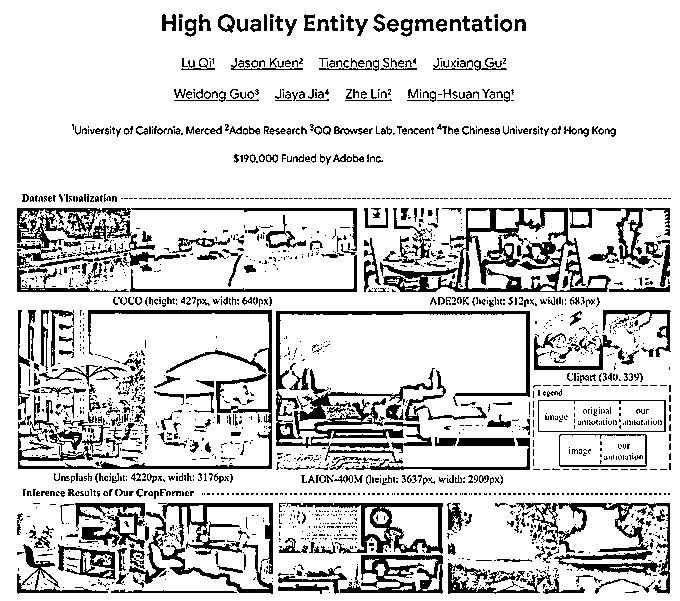

High-Quality Entity Segmentation

Shows that using high-quality data of only 33k images leads to better performance than SAM, which uses 1B images.

proj: http://luqi.info/entityv2.github.io/…

abs: https://arxiv.org/abs/2211.05776

Medusa：使用多个解码头部使 LLM 的生成速度提升 2 倍。

相比使用小模型生成选项+大模型验证的形式，多解码头部的方式没有额外的模型，与大模型同时训练和使用，适用于分布式部署。

博客：https://together.ai/blog/medusa

Github：https://github.com/FasterDecoding/Medusa…

也有评论认为这种方式仅对小内存批次有效，对 ChatGPT 无效

C 站 发布了一个新功能：Civitai 图像生成器

可以使用站内的数百种模型和 LoRA 来生成图片。不用再配置昂贵的电脑了...🙂

重点：可以生【成人内容】🔞

注册后再网站右下角有个：Create 按钮，点击即可弹出生图页面，选择模型、设置、输入 Prompt，即可排队生成。一次最多可输出 10 张图，默认 4。

传送门：https://civitai.com

https://huggingface.co/spaces/TencentARC/T2I-Adapter-SDXL

https://huggingface.co/spaces/artificialguybr/qwen-vl

在线游戏设计开发平台

@Roblox

在其 2023 开发者大会上宣布了其新的人工智能生成式工具：Roblox Assistant。

Assistant 它可以帮助创作者通过输入文本提示来构建虚拟世界。并在未来拥有自我学习和游戏编码能力！

该工具预计将于 2023 年底/2024 年初推出。

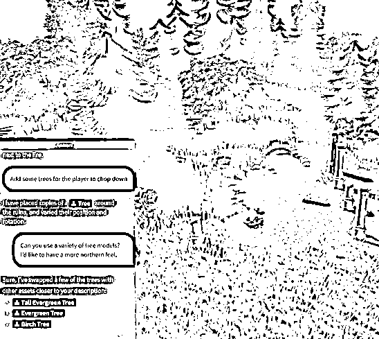

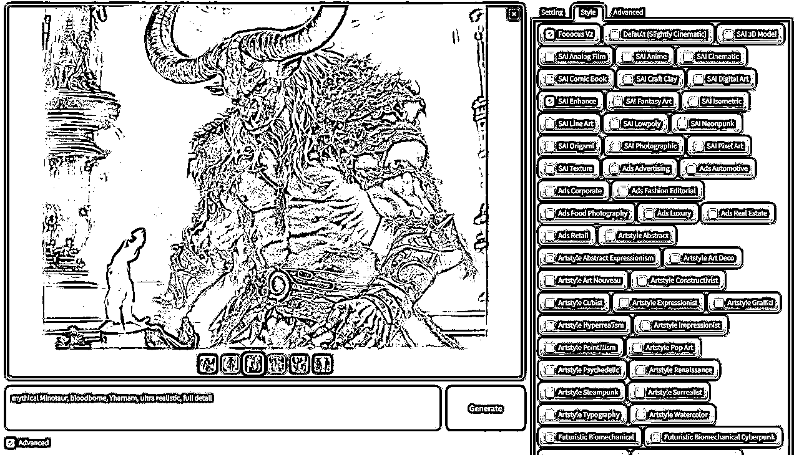

https://github.com/lllyasviel/Fooocus/discussions/347

Fooocus V2 is released several hours ago with improved quality, prompt processing, and multi-style. And it is pretty good at some dark fantasy like this

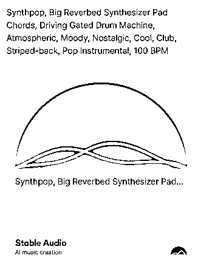

Stability AI 推出 AI 生成音乐平台：Stable Audio

用户只需要输入描述性文本提示以及所需的音频长度即可生成高质量的音乐和音效。

免费版本，可以生成并下载长达 20 秒的音乐，Pro 付费用户可生成和下载 90 秒的音乐。本的音乐家，但创作者的机会是无限的。

网站：http://stableaudio.com

详细介绍：https://stability.ai/blog/stable-audio-using-ai-to-generate-music

InstaFlow：资源消耗更小、速度更快的文生图模型。

使用 Rectified Flow 技术，无需多步采样， 通过直接映射噪点生成图像，比 SD 节省了 90%的时间，宣称生成的图像质量与 SD 1.5 接近（我看着不咋样）。

论文：https://arxiv.org/abs/2309.06380

Github：https://github.com/gnobitab/InstaFlow

YouTube 总结工具是今年最早的一批 AI 工具，发展到现在产品做的最完整好用的依然是 http://eightify.app/o

- 10 秒钟总结一小时的内容，并生成 8 个分段总结

- 时点可以点击跳转，也可以展开总结看更详细的总结

- 特色功能「洞见」，与总结不同，洞见是从整个视频中选取精华的 8 个要点，比总结更佳实用

magickimg 刚刚推出全新的「Face2Famous」功能，利用 AI 一键让你瞬间化身为超人、钢铁侠、蒙娜丽莎。

快来试试吧！

https://magickimg.com/face2famous

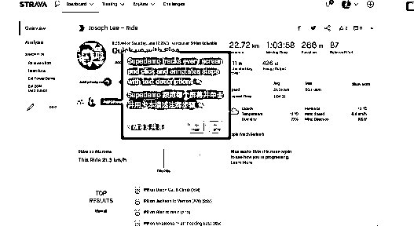

Supademo：在几秒钟内创建产品交互演示和指南

无需任何编码和设计，只需要点点鼠标就能为你的产品、支持文档、销售演示等创建一个交互式的演示和指南。

同时你可以随心所欲地调整这个展示，比如加上你的公司标志、选择你喜欢的颜色和样式，甚至设置自己的网址。

完成后，你可以把这个展示分享给任何人，或者放到你的网站、帮助手册里，就像插入一个 YouTube 视频那样简单。

还有个 AI 功能，你不需要自己写文字或录制视频，Supademo 会自动为你生成文字说明，甚至可以为你读出来。

Supademo 的免费计划包括五个演示、无限的步骤、访问 AI 功能以及在网站、支持文档等嵌入能力。

传送门：http://supademo.com

Here are all the relevant links!

Starter Notebook 👇

https://colab.research.google.com/drive/1LugJCifOv0L426ukRHjOblBRWwUImAit?usp=drive_link

Infery LLM (Fast inference SDK) 👇

https://deci.ai/blog/Infery-LLM-inference-SDK-for-LLM-deployment-redefining-state-of-the-art-in-LLM-inference?utm_campaign=Gen%20AI%20Sept%2023%20Launch&utm_source=twitter&utm_medium=social&utm_term=IM&utm_content=Infery-llm-blog

HugginFace model 👇

https://huggingface.co/Deci/DeciLM-6b

https://huggingface.co/spaces/Deci/DeciLM-6b-instruct

DeciLM-6B：比 LLaMa 2 快 15 倍的开源 LLM。使用了 AutoNAC 和 Infery LLM，所以速度快。

模型地址：https://huggingface.co/Deci/DeciLM-6b

在线体验：https://huggingface.co/spaces/Deci/DeciLM-6b-instruct…

在线 colab：https://colab.research.google.com/drive/1LugJCifOv0L426ukRHjOblBRWwUImAit?usp=drive_link…

关于 Infery LLM：https://deci.ai/blog/Infery-LLM-inference-SDK-for-LLM-deployment-redefining-state-of-the-art-in-LLM-inference

我确实没想到有人用 Whisper 和 ChatGPT 来面试作弊……

这个开源项目是专门用来面试作弊的，Whisper 用来识别语音成文字，ChatGPT 根据识别出来的文字为你提供参考答案！

慎用！！被面试官发现后果很严重！

https://github.com/leetcode-mafia/cheetah

一天没上 Vercel 居然发布了这么牛逼的东西，通过语言描述生成界面代码，你直接预览和调整生成的代码，完成后可以复制或者在 Vercel 上面部署。

比如下图这个界面就是由提示词“a weather app looks like the iOS weather app”生成的。看起来美观度是在线的，看了下生成的代码结构也还好。以后可能简单的界面或者模块确实没必要直接设计再开发了。

这里加入等待列表：http://v0.dev

https://github.com/coqui-ai/tts 今天 Coqui AI 开源了他们的文生音基座模型：

XTTS （🐸TTS)

- 只需三秒即可进行声音复刻

- 无需微调即可支持 13 种语言，包括中文

- 24khz 的声音质量

虽然预训练还是不太够直接用，但对于开发者来说是个非常不错的基座。

声音复刻体验 https://huggingface.co/spaces/coqui/xtts

GitHub

Multimodal Garment Designer：多模态服装设计师

该模型通过使用文本描述、人体姿势和服装草图这三种输入来生成一个与给定人体姿势相匹配的时尚图像。

而且生成的时尚图像是围绕人的形象和姿势来设计的。也就是说，生成的服装图像将与给定的人体姿势相匹配，确保服装看起来是在那个特定的人身上。

与传统的虚拟试穿技术不同，这个框架使用潜在扩散模型，并首次在时尚领域中应用。

GitHub：https://github.com/aimagelab/multimodal-garment-designer…

论文：http://arxiv.org/abs/2304.02051

Prompt flow：微软发布的开源 LLM 开发工具

特点是通过拖拽把 LLM 、提示词、python 代码和其他工具组成工作流，提升开发和调试速度。

项目地址：https://microsoft.github.io/promptflow/

Github：https://github.com/microsoft/promptflow

Instagraph：根据文本或链接，总结出可视化的知识图谱

如果提供的是文本，LLM 生成内容后总结成知识图谱。

如果提供的链接，根据链接内容总结成知识图谱。

Github：https://github.com/yoheinakajima/instagraph

Memo 现已支持 M 芯片 GPU 模式，测试 M1 Max 一小时播客、YouTube 视频，只需要 5 分钟！

和云端转换速度没什么差别了，还省掉了上传时间。

Now we can clone voices into different languages using just a 3-second audio clip.

Thanks to the @coqui_ai Team

How about combining it with #wav2lip

?

code: https://github.com/coqui-ai/TTS

colab: please try it

https://github.com/camenduru/coqui-XTTS-colab…

wav2lip: https://github.com/camenduru/wav2lip-colab

## 9 月 4 日～9 月 10 日

AWPortrait 1.2 ： 一个高度专业的人像模型，专注于提供极其真实的照片效果。

该模型在最新的 1.2 版本中对棚拍和外景的光源模拟进行了升级，并对人物面容进行了修正，媲美专业摄影师拍摄的照片。

通过使用 t2i 直出和 ADetailer 插件，用户可以获得非常接近真实照片的效果。https://civitai.com/models/61170/awportrait

https://redd.it/168e1gg

这篇 Reddit 文章讨论了如何使用 Midjourney 制作矢量插图。

作者介绍了一个简单的技巧，使用特定的命令和工具可以将图像转换为矢量文件。

文章下面的评论中，有人表示对这个技巧很感兴趣，也有人提到了其他相关的命令和工具。

还有人提到使用 Inkscape 也可以实现相同的效果。

总的来说，这篇文章介绍了一种简单的方法来制作矢量插图，并引起了读者的兴趣和讨论。

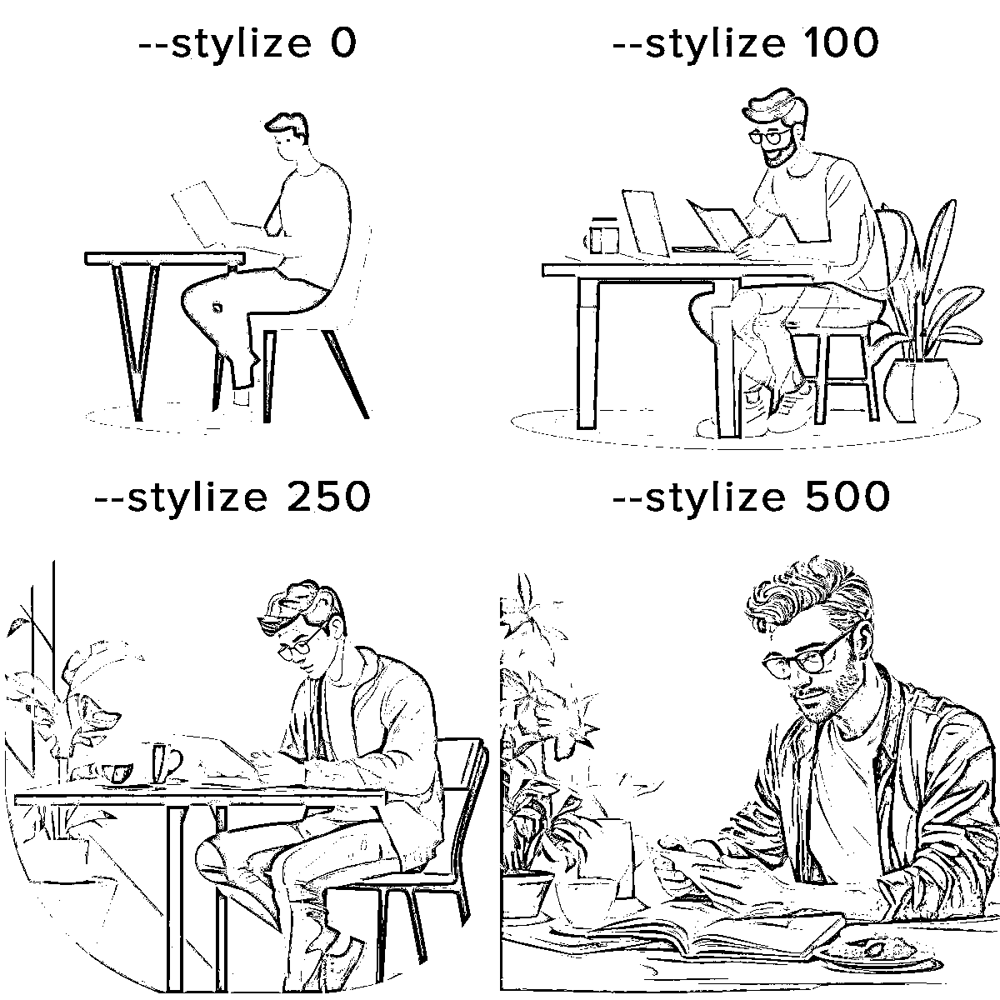

一键在电脑上运行 ModelScope Video2Video。

Image2Video 很酷，但你知道什么更酷吗？就是 "Video to Video"。

我从

@fffiloni

那里分叉了 Image2Video Gradio Web UI，以支持 video2video。

继续阅读，了解它的功能以及如何在电脑上运行。

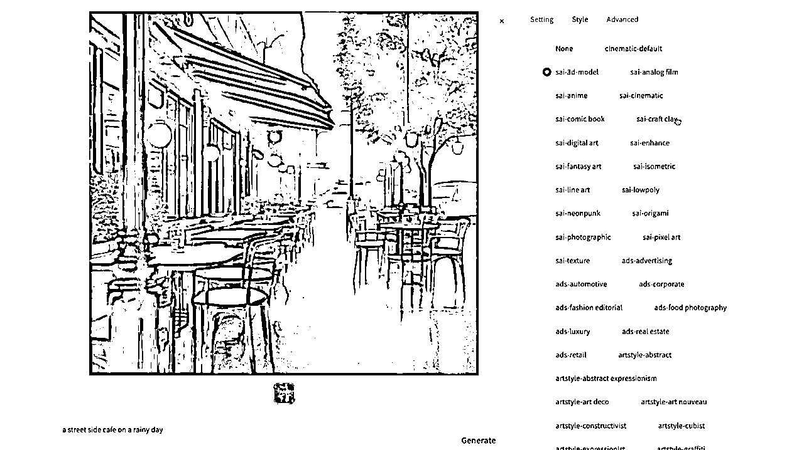

Fooocus 是一款新的 Stable Diffusion 应用，由 ControlNet 的创建者开发。它重新思考了 Stable Diffusion 和 Midjourney 的设计。

让用户只需关注提示和图像，无需手动调整复杂的技术参数。从下载到生成第一张图像，所需的鼠标点击次数严格限制在 3 次以内。

工作原理：

通常，稳定扩散应用都有复杂的用户界面，因为它们具有很多功能。Fooocus 采取了不同的方法，它追求极简，同时在需要的时候提供灵活性。它就像是稳定扩散的 Instagram，只需选择一个滤镜并生成图像。你可以在电脑上免费使用它，只需一键即可安装和运行。

因为 Fooocus 已经集成了一系列用于提高性能和用户体验的优化措施，并且这些优化是自动进行的。换句话说，用户不需要手动进行设置或调整，应用会自动执行这些优化任务。

例如，如果 Fooocus 用于图像处理，它可能已经内置了一些算法来自动调整图像的亮度、对比度或锐度，以便输出更高质量的图像。这些都是在后台自动完成的，用户只需要点击一个按钮或选择一个选项。

这样的自动化优化和质量改进通常会让应用更加用户友好，同时也能提供更高质量的输出结果。

性能：

而且 Fooocus 最低 GPU 内存要求只有 4GB（Nvidia）。在一台相对低端的笔记本电脑上（16GB 系统 RAM 和 6GB VRAM（Nvidia 3060 笔记本））的速度约为每次迭代 1.35 秒。

GitHub：https://github.com/lllyasviel/Fooocus?ref=aiartweekly…

Colab：https://colab.research.google.com/github/lllyasviel/Fooocus/blob/main/colab.ipynb…

Fooocus 还开发了 Advanced Features 高级功能，以便高级用户获得完美的结果。https://github.com/lllyasviel/Fooocus/discussions/117

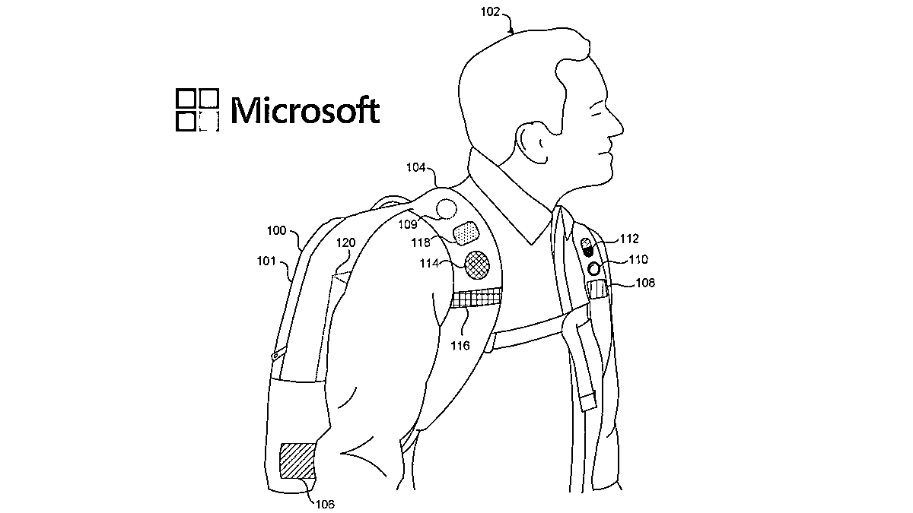

Laughing Matters:：能够根据人的静态照片生成包含笑声的笑脸视频

该模型能够将静态人脸图像和笑声音频合成为一个动态的笑脸视频。

为了实现这一目标，研究者采用了 U-Net 架构，这是一种在图像处理领域广泛应用的深度学习模型。他们对这个架构进行了一系列的优化，以适应笑声生成的特殊需求。

结果显示模型的性能不仅在传统的图像和视频质量指标上表现优异，还在专为笑声生成设计的新评估指标上表现出色。

这应该是目前第一个：从单个参考帧和原始音频剪辑生成自然笑声视频模型！

项目及演示：https://sites.google.com/view/laughing-matters…

论文：https://arxiv.org/abs/2305.08854

GitHub：https://github.com/antonibigata/Laughing-Matters

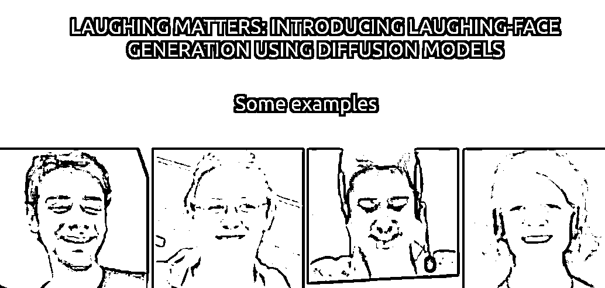

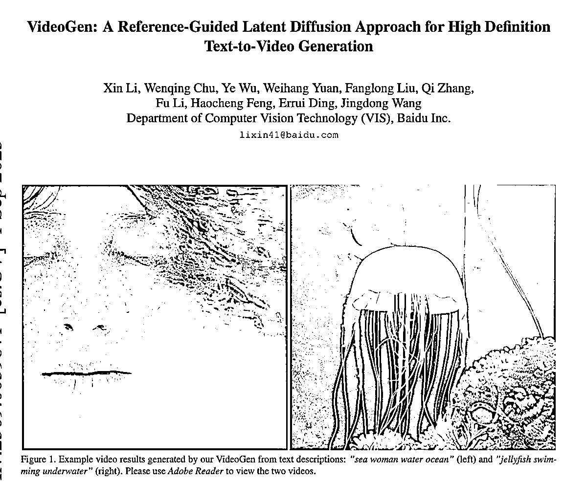

VideoGen：一种用于生成高清文本到视频的参考引导潜在扩散方法

纸页： https://huggingface.co/papers/2309.00398

VideoGen 是一种文本到视频的生成方法，它可以使用参考引导的潜在扩散生成具有高帧保真度和强时间一致性的高清视频。我们利用现成的文本到图像生成模型（例如稳定扩散）从文本提示生成具有高内容质量的图像，作为指导视频生成的参考图像。然后，我们引入了一个以参考图像和文本提示为条件的高效级联潜在扩散模块，用于生成潜在视频表示，然后是基于流的时间上采样步骤以提高时间分辨率。最后，我们通过增强型视频解码器将潜在视频表示映射为高清视频。在训练过程中，我们使用真实视频的第一帧作为参考图像来训练级联潜在扩散模块。我们的方法的主要特点包括：由文本到图像模型生成的参考图像提高了视觉保真度；以它为条件使得扩散模型更加专注于视频动态的学习；视频解码器是在未标记的视频数据上进行训练的，从而受益于易于获得的高质量视频。 VideoGen 在定性和定量评估方面树立了文本到视频生成的最新技术。

V7 Labs：一个 AI 训练数据平台，该平台能够自动化视频和图像标注，提供前所未有的速度和效率，从而训练更好的模型。

他们有一个医学影像 AI 训练数据平台，广泛应用于 CT 和 MRI 扫描分析、牙科图像分析、皮肤科图像分析、乳腺 X 光分析、超声波分析等多个医疗用例。

V7 Labs 的 "Workflows" 功能会引导你完成从准备数据到最终得到一个可用的 AI 模型的整个过程，而且速度非常快，只需要几小时即可完成。

该平台的优势包括：

1、安全性：符合 GDPR、ISO 27001、SOC2、FDA Part 11 和 HIPAA 等多项安全标准。

2、自定义工作流程：V7 的工作流程可以帮助您结构化您的 ML 管道，从上传数据、标注和审查，到几小时内训练准确的 AI 模型。

3、多种标注类型：包括对象检测、实例分割、全景分割、图像分类等。

网站：https://v7labs.com/industry/healthcare

Pulse 是一款利用 AI 还原低分辨率图像细节的工具，https://github.com/adamian98/pulse，严格来说，不能叫做还原，而是扩充，对于图像缺失的信息，AI 是无法做到准确还原的，它的用途在于探索图像中缺失信息的可能性，然后逐一还原成清晰图像，例如，用户输入一张 16x16 分辨率的图像，利用 Pulse 可以输出一组 1024x1024 分辨率的图像

相关论文在这里：https://arxiv.org/pdf/2003.03808.pdf…，背后用到的是 StyleGan 这个图像生成模型，https://github.com/NVlabs/stylegan，可以想象一下，应用场景还是蛮丰富的。

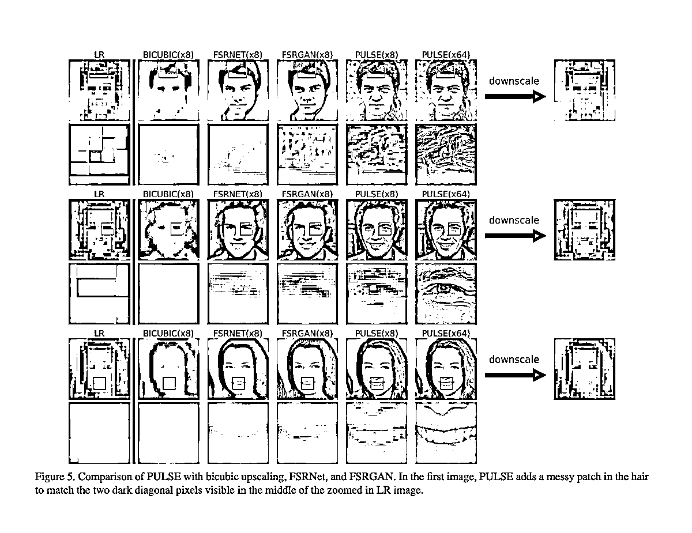

Depix 是一个针对文字的马赛克还原工具，https://github.com/spipm/Depix，文本类打码最安全的方式还是纯色全覆盖，马赛克被还原的概率很高。

本地跑了一下这个项目，M1 电脑，十几个字符的解码需要长达 10min+ 的计算，效率还是比较低的。它的算法思路是：

1）加载模具图片，最好是相同底色、相同字体、相同字号的文字列表截图，识别时会以模具为参考对照进行文字还原

2）将马赛克内容进行方形切割以分离单个子块，然后在模具中匹配每个子块，找出与之最匹配的矩形，并记录它们在搜索图像中的位置

3）核心算法在于子块匹配，通过对比矩形块的颜色差异，找到最小差异的矩形块作为匹配结果

这个库的实现并没有用到 AI 的能力，属于较为暴力的相似度对比策略，所以效率低是可以理解了，源码中用到的模具都是英文，如要支持中文字符的识别，就需要把所有的中文都放进去，那么效率就会更低了。

看到几篇利用 AI 来实现马赛克还原的论文，主要依靠生成式内容来补充像素，对于像素本就很丰富的图片而言会比较有效，例如老照片还原；针对这种程度的文字类马赛克还原，效果要差很多，不知道市面上是否已经有成熟的工具。

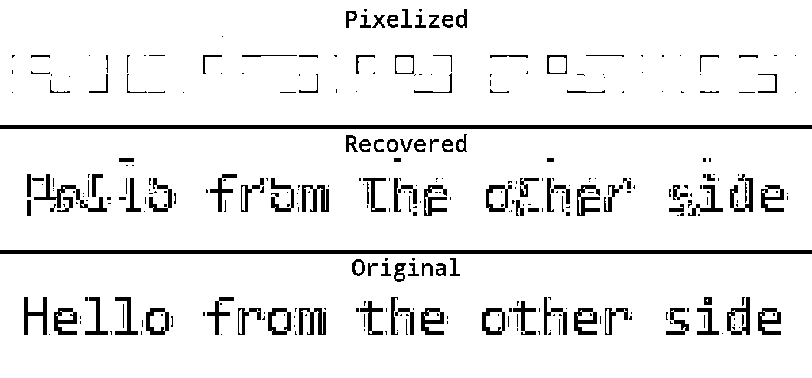

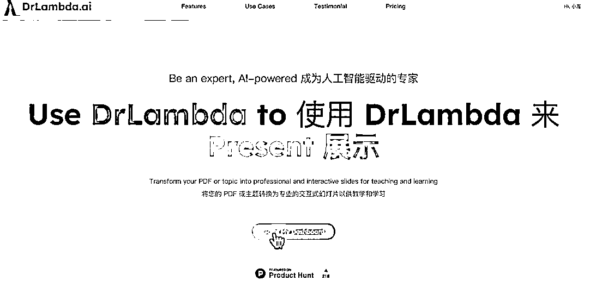

http://DrLambda.ai ：从 YouTube 视频中读取信息，然后一键转换生成 PDF 文件、PPT、音视频脚本、播客、甚至新的视频...

同时它还可以将 PDF 文件、YouTube 视频、网页等一键转换为专业教学学习幻灯片。

它还有一个方程式、公式提取和生成引擎，这个引擎可以快速高效地添加复杂方程到幻灯片中。这不仅提高了幻灯片的清晰度，还避免了复制粘贴和格式化的麻烦。

是一个强大的内容整理和组织工具，可以大幅度提高你的工作效率。适合研究人员、教师、学生、顾问和办公室工作人员。

目前内测还是免费的！

我用

@dotey

老师的视频进行了测试，基本上很流畅，但是在语言转换上出了点小问题，导出的 PDF 乱码了，估计是文字编码问题。换成英语没有任何问题。

文字转语音功能好像有点问题，回头我再试试，生成新视频功能还没有开放！

https://twitter.com/i/status/1698266308176163289

由于 SDXL 现在支持 attention couple 和 regional LoRA，我们可以将其与 fake scribble 的 ControlNet-LLLite 结合起来，制作出类似立绘的效果。

只需更改提示，seed 固定不变。

如果不将 ratios 设为 0.2，multipliers 设为 0.5~0.6 左右，对图像风格的影响将会很大。

PMC-LLaMA：一个开源的医学领域语言模型，可提供高性能的医学问答和信息检索服务。

使用 LLaMA 架构，在大约 480 万篇生物医学学术论文上进行了微调。

其主要版本包括 MedLLaMA_13B 和 PMC_LLaMA_13B，其中 MedLLaMA_13B 是在医学文献和书籍上预训练的，而 PMC_LLaMA_13B 是在此基础上进一步微调的。

PMC_LLaMA_13B：

1、模型规模扩大到了 130 亿（13B）参数。

2、在知识注入阶段，添加了 3 万本医学书籍。

3、在一个包含 2.02 亿（202M）标记的大规模数据集上进行了指令调优。

通过在三个生物医学问答数据集（包括 PubMedQA、MedMCQA 和 USMLE）上的初步评估，研究人员发现 PMC-LLaMA 在问答基准测试上表现出更好的理解和高性能。

该模型的微调过程使用了 AdamW 优化器和特定的学习率，以及一种名为全分片数据并行（FSDP）的加速策略。模型在大约 7 天内完成了 5 个周期的训练。

通过与原始的 LLaMA 模型的比较，研究证明了 PMC-LLaMA 在医学领域具有更高的适用性，尤其是在医学相关句子完成任务上。

论文：https://arxiv.org/abs/2304.14454

GitHub：https://github.com/chaoyi-wu/PMC-LLaMA/…

Huggingface：https://huggingface.co/axiong/PMC_LLaMA_13B…

数据集：https://huggingface.co/datasets/axiong/pmc_llama_instructions

CityDreamer：通过学习 Google Earth 和 OpenStreetMap 的图像数据，能够生成逼真的 3D 城市。

你可以用它来生成一个整个城市的 3D 图像，就像你在 Google 地球上看到的那样。它不仅可以生成各种各样的建筑物，还可以添加道路、公园和湖泊等。使得生成的城市看起来非常逼真。

CityDreamer 模型不仅能生成一个小区域或单个建筑物的 3D 模型，而是能生成一个完整、连续、无边界的城市环境。换句话说，它可以生成一个整个城市的 3D 模型，包括各种建筑物、道路、公园等，而不仅仅是一个局部区域。

工作原理：

CityDreamer 基于组合生成模型，它使用两个主要的数据集：OSM（OpenStreetMap）和 Google Earth。模型首先从这些数据集中学习建筑物和其他城市元素（如道路、绿地和水域）的特性。

然后，它将这些元素分成两个不同的模块进行处理：

1、建筑实例生成模块：这一部分专门负责生成各种类型和样式的建筑物。

2、背景对象生成模块：这一部分负责生成其他城市元素，如道路、绿地和水域。

这两个模块共同工作，生成一个完整、逼真的 3D 城市模型。模型还进行了大量的实验验证，以确保生成的城市在多个评估指标上都具有高度的真实性。

视频介绍：https://youtu.be/te4zinLTYz0

项目及演示：https://infinitescript.com/project/city-dreamer…

论文：https://arxiv.org/abs/2309.00610

Share Your Best Ai Generated Image of the Day Here . Day 88/100.

- http://hayo.com/draw/img2img

Montaigne，https://montaigne.io，是一个可以将你的本地 Apple Notes 文件夹直接变成一个在线网站的工具，这比 Github Pages 发布个人博客更快、更酷。你需要做的就是在本地创建一个包含子域名的文件夹，例如 http://barretlee.montaigne.io 作为文件夹名，然后把文件夹的权限分享给工具作者，后续该文件夹下的所有内容的发布都会被同步到这个子域名下。

作者并没有介绍他是如何实现的，Apple 也没有开放官方的 API 可以直接获取 Notes 的数据，我想到两个方案可以完成这个工作。

1\. 抓取 iCloud 数据

通过类似爬虫的方式，使用 iCloud 的 Web 接口，可以获取到 Apple Notes 的数据，有一个开源库 iCloud-API 可以参考：https://github.com/MauriceConrad/iCloud-API…，这种方式的适配成本比较高，苹果稍稍改版，就需要进行一次适配，另外也存在一定的风险，通过这种方式获取 Apple 的数据是违反使用协议的，一旦被感知可能会面临账号处罚的风险。

2\. 使用 AppleScript 抓取

Apple 提供了一门 AppleScript 语言，它可以像按键精灵一样，操作 Apple 系统上的所有程序，而且针对系统内置的程序，还提供了原生访问指令，例如读取 Notes 中有多少条笔记，可以直接在你的命令行执行：

osascript -e '

tell application "Notes"

set noteCount to count of notes

end tell

log noteCount

'

有人就使用 AppleScript 封装了一个工具，可以将 Apple Notes 导出到 SQLite 里头，https://github.com/dogsheep/apple-notes-to-sqlite…，有了数据，实现一个自动发布到线上的程序就不是什么难事儿了。

方案一有风险，方案二需要有一个长期在线的 Mac 环境（AWS 提供了类似的服务），不知道还有没有更加环保、高效的方案，可以更轻便地拿到数据。

I've put together a new emoji SDXL fine-tune.

Try it with this:

"A TOK emoji of [subject]"

https://replicate.com/fofr/sdxl-emoji

Works great with famous people.

搞电商的推友可以关注下，使用手机拍摄产品，结合 AI 来给产品换背景（秒出宣传图）、修图速度可提高 10 倍，具体效果见视频，最后它是收费的，好用版差不多 15 美金/月。先收藏备用！

https://imgcreator.zmo.ai/

TinyLlama：1.1B 参数，小但强大的 LLM，4 比特版本仅需 550M 内存即可运行。

9 月 1 日启动训练，目前正在训练过程中，在 Github 上可以查看当前的进展。仅用 16 块 A100-40G 的 GPU，在 90 天内完成 3 万亿 tokens 的训练。

Github：https://github.com/jzhang38/TinyLlama/blob/main/README_zh-CN.md

开源 EvalGPT

https://github.com/index-labs/evalgpt…

EvalGPT 是一个使用 Go 语言实现的 Code Interpreter & Agent 框架，借鉴了 Google Borg 的实现思路，可以运行在开源的模型 CodeLlama 上。

框架主要分成 2 个部分：

- EvalGPT Master Node：主节点作为调度器，用来做 planning、scheduling、管理 memory

- EvalAgent Cluster：每一个子 task 都会 spawn 一个新的 EvalAgent 节点来运行，每个节点会有自己的 Runtime 环境。

前端支持通过 Command Line 或者 REST API 的形式来访问。

项目目前还处在早期阶段，大部分的代码还耦合在 Copilot Hub 的代码库中，未来会慢慢抽离出来到该项目中。

欢迎大家贡献想法 & 提 PR。

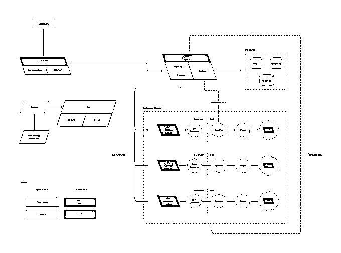

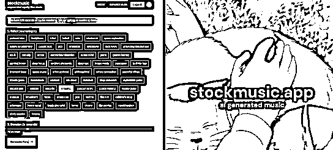

StockMusic ：人工智能音乐生成工具，可以生成 50 多种流派的歌曲。

选择类别，然后选择生成的长度，最长 120 秒。即可开始生成音乐，也没个提示词要输入，感觉还在测试阶段。

不过生成的听起来还可以。

http://stockmusic.app

AI 图像修复工具、模型大全

收集了一些图像修复工具，整理成一个主题帖，方便大家收藏查找。

包括工具+模型，可以说非常全面，记得转推+收藏😀：🧵

1、ai.nero.com/enhance ：图像修复放大

支持多种文件格式，包括 jpg、png、bmp 和 webp。可选择不同的 AI 模型。

每天 5 次免费额度，基本够用！

2、restorephotos.io 开源免费的老照片修复工具

专门用于使用 AI 技术恢复旧照片，尤其是面部照片。完全免费且开源。获得超过 30 万用户的好评。

GitHub： github.com/Nutlope/restorePhotos

3、SwinIR：图像恢复，对图片进行无损放大

SwinIR 可以处理多种图像恢复任务，包括图像超分辨率、图像去噪（包括灰度和彩色图像去噪）以及 JPEG 压缩伪影减少。

GitHub： github.com/JingyunLiang/SwinIR

体验地址：replicate.com/jingyunliang/swinir

之前发的介绍：x.com/xiaohuggg/status/1662382702077841408?s=46&t=gFalWSRz7qXti6VQaGDFbg

4、FaceHD：人像照片智能修复与增强

专门用于修复和增强人像照片。该平台可以处理各种低质量的照片，包括模糊、像素化、损坏的、低分辨率或者老照片，并将其修复为高品质、清晰、锐利的照片。

用户可以通过电脑或手机上传照片进行修复。picup.shop/faceHD.html

5、jpghd.com 支持老照片修复、老照片上色和魔法动态照片

使用最新的 2023 年 AI 模型进行老照片的无损恢复。该平台支持老照片、刮痕照片的恢复、上色以及“魔法照片”（Magic Photo）。

除了网页版，jpgHD 还提供 iOS、Android、Mac OS 和 Windows 版本的应用程序。

6、Upscale：可让您提高图像的分辨率。您可以将其升级 2、4 或 8 倍。

官网：alpacaml.com 申请内测，内测期间免费

介绍：alpacaml.com/blog/hello-world

文档以及安装：docs.alpacaml.com/home/welcome

7、Inst-Inpaint：是一种图像修复替换技术，可以通过文字描述轻松的移除或者替换图像中的指定对象。

Inst-Inpaint：是一种图像修复替换技术，可以通过文字描述轻松的移除或者替换图像中的指定对象。

与传统的图像修复方法不同，传统方法通常需要用户定义要删除的像素的二进制掩码，这可能既耗时又容易出错。Inst-Inpaint 则可以根据文本提示来自动识别并删除图像中的对象。

当然，以下是所需的链接：

论文：arxiv.org/abs/2304.03246

GitHub： github.com/abyildirim/inst-inpaint

官方网站：instinpaint.abyildirim.com

演示：huggingface.co/spaces/abyildirim/inst-inpaint-inpaint

8.StableSR：提高任何大小图像的分辨率

该项目使用了一个预训练的扩散模型，这个模型已经学习了如何生成高分辨率的图像。

通过这种方式，他们的方法可以从一个低分辨率图像生成一个高分辨率图像，而不需要任何关于图像内容的先验知识。

这使得他们的方法非常适合用于真实世界的图像超分辨率任务。

9.GigaGAN：一种用于文本到图像合成任务的 10 亿参数大规模 GAN。其规模比 StyleGAN 大 36 倍。

与 Stable Diffusion v1.5、DALL·E 2 和 Parti-750M 等模型相比，GigaGAN 实现了更低的 FID，0.13 秒生成 512px 图像，3.66 秒生成 4K 图像，比扩散和自回归模型快得多。

它还可以用于提高图像的分辨率，甚至可以将低分辨率的图像转换为 4K 高清图像。

GigaGAN 还支持一系列高级编辑功能，如潜在插值、样式混合和向量算术运算。这些功能允许用户在潜在空间（即样式参数的空间）中进行复杂的操作，从而实现对生成图像的精细控制。

例如，你可以描述一个“泰迪熊在桌子上”，然后 GigaGAN 会生成一个与描述匹配的图像。你甚至可以改变泰迪熊的纹理，例如“泰迪熊的羊毛纹理”，GigaGAN 会相应地调整图像。

项目地址：mingukkang.github.io/GigaGAN/

论文：mingukkang.github.io/GigaGAN/static/paper/gigagan_cvpr2023_original1.pdf

10.、图像超清化+老照片修复技术，拯救你所有的模糊、破损照片

微软亚洲研究院研究的项目，基于纹理 Transformer 模型的图像超分辨率技术，和以三元域图像翻译为思路的老照片修复技术，将能让这些照片奇迹般地恢复如初。

项目及演示：raywzy.com/Old_Photo/

GitHub： github.com/microsoft/Bringing-Old-Photos-Back-to-Life

11.CodeFormer：基于 Transformer 的预测网络，专门用于人脸恢复。

它使用了一种离散的代码簿和解码器来存储高质量的人脸图像部分。这些代码簿实际上是一组预先定义的图像片段或特征，用于重建高质量的人脸图像。

然后，该网络使用一个 Transformer 模块来预测这些代码的序列，从而模拟低质量输入图像的全局人脸组成。

此外，该算法还引入了一个可控的特征转换模块，这使得算法能在图像的保真度和质量之间进行灵活的权衡。这种方法在多个数据集上都表现出色，超过了现有的最先进方法。

项目及演示：shangchenzhou.com/projects/CodeFormer/

GitHub： github.com/sczhou/CodeFormer

12.GFPGAN：腾讯开发的一个开源的面部修复项目

利用生成对抗网络（GANs）进行面部修复。具体来说，该算法使用了预训练的 StyleGAN2 模型作为其基础，以便利用该模型中的先验知识进行更有效的面部修复。

GitHub：github.com/TencentARC/GFPGAN

演示体验：huggingface.co/spaces/Xintao/GFPGAN

Colab：colab.research.google.com/drive/1sVsoBd9AjckIXThgtZhGrHRfFI6UUYOo

文本引导视频编辑工具 - MagicEdit

想象一下，能够在视频中轻松改变风格、场景，甚至替换对象、添加元素，却又保持原始视频的动作和外观一致！这就是 MagicEdit 带给你的魔法！

项目地址及演示：https://magic-edit.github.io

泰裤辣，一键生成你的专属 Emoji 表情

https://magickimg.com/face2emoji

快来试试吧

快速生成 AI 对话式表单，像真人对话一样收集用户信息

https://talkform.ai

比生硬填表单体验好一些，更有人味，不知道填写率会不会因此而剔骨。

TIIuae 发布 Falcon 180B 猎鹰大语言模型 性能超越 LLaMA 2，逼近 GPT4

Falcon 180B 是一个拥有 1800 亿参数的超强大语言模型，它在 3.5 万亿个标记上进行了训练。该模型在 Hugging Face 的预训练大型语言模型排行榜上位列首位，

官方称 Falcon 180B 在各种任务，如推理、编码、熟练度和知识测试方面，表现得非常出色，甚至超过了 Meta 的 LLaMA 2。

在闭源模型中，它仅次于 OpenAI 的 GPT 4，并与 Google 的 PaLM 2 Large（即 Bard 的动力来源）表现相当，尽管模型大小只有后者的一半。

Falcon 180B 可用于研究和商业用途。

官网：https://falconllm.tii.ae

HuggingFace 演示：https://huggingface.co/spaces/tiiuae/falcon-180b-demo

https://www.infoq.cn/article/HXQtZJxYy5SeK9OH3Xzi

全面拥抱大模型！腾讯正式开放全自研通用大模型：参数规模超千亿、预训练语料超 2 万亿 tokens

TIIuae 发布 Falcon 180B 猎鹰大语言模型 性能超越 LLaMA 2，逼近 GPT4

Falcon 180B 是一个拥有 1800 亿参数的超强大语言模型，它在 3.5 万亿个标记上进行了训练。该模型在 Hugging Face 的预训练大型语言模型排行榜上位列首位，

官方称 Falcon 180B 在各种任务，如推理、编码、熟练度和知识测试方面，表现得非常出色，甚至超过了 Meta 的 LLaMA 2。

在闭源模型中，它仅次于 OpenAI 的 GPT 4，并与 Google 的 PaLM 2 Large（即 Bard 的动力来源）表现相当，尽管模型大小只有后者的一半。

Falcon 180B 可用于研究和商业用途。

官网：https://falconllm.tii.ae

HuggingFace 演示：https://huggingface.co/spaces/tiiuae/falcon-180b-demo

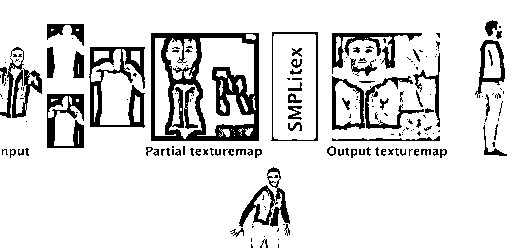

SMPLitex：从单张图片中生成一个完整的 3D 人体外观

即使你只有一个人的部分照片（比如脸部或上半身），也能生成一个完整和逼真的 3D 人体模型。

它使用了一种名为潜在扩散模型（LDM）的技术来生成逼真的 SMPL（一个流行的 3D 人体模型）头像的纹理图。就是先根据照片画出这个人的全身，然后再把这个全身照片变成一个 3D 模型。

项目及演示：https://dancasas.github.io/projects/SMPLitex/index.html

论文：https://dancasas.github.io/projects/SMPLitex/contents/casas_BMVC2023.pdf

工作原理：

LDM 的工作原理是通过一系列计算步骤来生成逼真的全身纹理图。首先，它会接收一张人物的照片作为输入。这张照片可以是全身照，也可以是部分照片，比如脸部或上半身。

1、特征提取: 模型首先会从输入照片中提取关键特征，这些特征可能包括颜色、纹理、轮廓等。

潜在空间映射: 提取出的特征会被映射到一个潜在空间中。在这个潜在空间里，相似的特征会被聚集在一起。

2、纹理生成: 在潜在空间中，模型会生成一个全身纹理图。这个纹理图是通过潜在空间中的特征来生成的，因此它会非常逼真。

3、应用到 SMPL 模型: 生成的全身纹理图然后会被应用到 SMPL 模型上。SMPL 是一个标准的 3D 人体模型，广泛应用于各种 3D 建模和动画制作。

4、优化和微调: 最后，模型可能会进行一些优化和微调，以确保生成的 3D 模型与输入照片尽可能相似。

通过这一系列步骤，潜在扩散模型（LDM）能够从单张照片中生成逼真的 3D 人体模型。这种方法在 3D 建模、游戏开发、电影制作等多个领域都有潜在的应用价值。

Rokoko Vision: 全面的动作捕捉解决方案，包括全身、手指和面部动作的捕捉。

最近推出了其双摄像头跟踪技术，增强了深度感知和最小化了盲点，可以使用任何类型的两个摄像头来获得更高的动作捕捉保真度。

你还可以将从 Rokoko 捕获的动作动画导出为 .FBX 或 .BVH 格式，包括与行业兼容的骨骼预设选项。这些数据可以在 Blender、3ds Max、Cinema 4D、Maya、Unity 或 Unreal Engine 中使用，

Rokoko Vision 在浏览器中易于使用，如果您使用一个摄像头，它是免费的。双摄像头功能、BVH 导出和流式传输到 Blender、Cinema 4D、Unreal Engine 和其他 DCC 应用需要付费订阅，费用为每月 20 美元。

网站：https://rokoko.com

FaceFusion ： 一款面部交换和面部增强的开源软件

可以在本地运行的一款换脸软件，不仅可以将源图像中的面部与目标图像或视频中的面部进行交换，还提供了多种面部和帧处理器以改进或定制面部特征。

FaceFusion 1.1.0 更新，增加了摄像头功能，可以进行实时换脸和面部改造。

FaceFusion 有多种选项和参数，允许用户根据需要进行定制。还内置了一些检查机制，以防止软件被用于不道德或非法的用途。

GitHub：https://github.com/facefusion/facefusion…

Prompt Engineer 刚入职即失业？

Google DeepMind 刚刚发表了一篇新的论文，介绍了如何使用 LLM 来优化 prompt，优化过的 prompt 在 PaLm 2-L / GPT-3.5 / GPT-4 模型中测试，benchmark 的指标都提升了。

优化的方法：

1\. 创建一个 meta prompt（如何创建 meta prompt 可以参考论文）

2\. 在每一个优化的步骤生成新的 prompt

3\. 评估 & 迭代

当然，并不是所有的 prompt 都可以用这种方法来优化，在某些场景上（例如 high-dimensional and complex problems）这种方法的效果还不是特别好。

从长期上来看，让 LLM 来写 & 优化 prompt 应该是一个必然的过程。

详细的论文分析

https://app.copilothub.ai/read/s/1hxkweg1ukj5s

Pika Labs 最近火了，能在 discord 生成比 runway 还好质量的视频

Claude 开始收钱了！一个月 20 美金😨

## 8 月 28 日～3 日

Text2Listen：让大语言模型能听懂人话，并做出合适的面部表情和动作。

简单来说，就是当你和聊天机器人聊天时，它能根据你说的话来做出相应的笑脸、皱眉等反应，让对话更加自然和真实。

工作原理：

该项目提出了一个框架，用于根据说话者的话生成适当的面部反应。它使用一系列听众的面部手势，通过 VQ-VAE 进行量化，并将这些手势作为额外的语言标记输入到基于变换器的大型语言模型中。生成的听众动作是流畅的，并反映了语言语义。

比如，如果说话者说了一些开心的事，模型就会让虚拟听众笑；如果说了一些让人不舒服的事，模型就会让虚拟听众皱眉。

这样做的好处是，生成的面部动作不仅自然，而且能准确地反映说话者的意图和情感，让聊天机器人更像一个真实的听众。

项目意义：

该项目的意义在于证明了手势可以被分解成更小的、基础的元素（他们称之为“原子元素”），并且可以像语言中的词汇（或“标记”）那样来处理。简单来说，就是他们找到了一种方法，可以把复杂的手势分解成更简单的部分，并用这些简单的部分来生成更自然、更有意义的听众反应。这样做的好处是，模型能更准确地理解说话者的意图，并据此生成更自然的反应。

这个技术有很多潜在的应用场景，比如在视频游戏、虚拟现实、或者其他需要自然对话的地方都能用得上。

项目演示：https://people.eecs.berkeley.edu/~evonne_ng/projects/text2listen/…

论文：https://arxiv.org/abs/2308.10897

GitHub：https://github.com/sanjayss34/lm-listener

WizardLM 推出基于 Code Llama 微调的最新 WizardCoder 34B。（Code Llama 是 Meta 推出的一款主要用于代码生成和代码理解的模型）

WizardLM 宣称 WizardCoder-34B 在 HumanEval 上以 73.2% 的通过率超越 GPT-4、ChatGPT-3.5 ...

看来 Code Llama 还是很能打的...

同时他们也指出的，GPT4 和 ChatGPT-3.5 有两个 HumanEval 结果：

1\. 67.0 和 48.1 是 OpenAI 官方 GPT4 报告（2023/03/15）报告的结果。

2\. 82.0 和 72.5 是他们自己用最新的 API（2023/08/26）测试的。

两组测试结果有所不同，是由于测试时间、API 版本或其他因素导致的。

Github：https://github.com/nlpxucan/WizardLM/tree/main/WizardCoder…

模型下载：https://huggingface.co/WizardLM/WizardCoder-Python-34B-V1.0…

在线体验：http://47.103.63.15:50085/

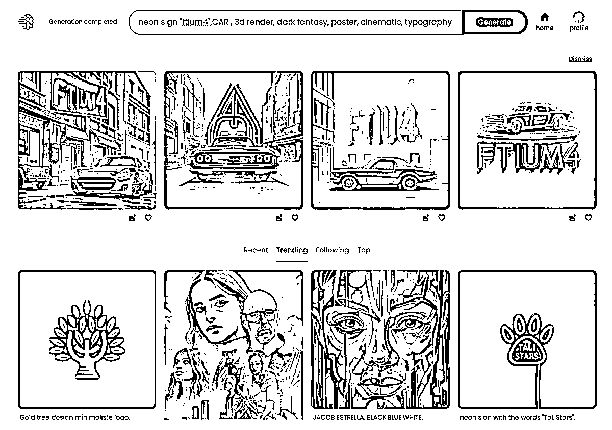

Ideogram AI —— 可在图像中生成文字图形的 AI

链接：https://ideogram.ai

由 Google 前员工创立，相比于其他图像生成 AI，Ideogram 能在图片中生成文字图形，而且能对文字进行颜色、字体等样式定制。

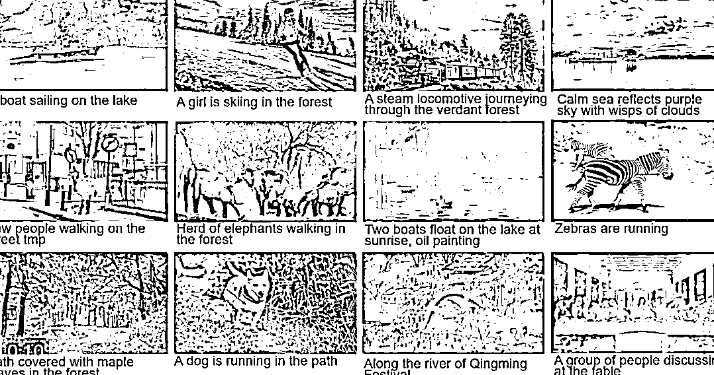

你可以通过文本指令控制视频中的人物或物体按照特定轨迹移动。例如：可以让清明上河图动起来...

除此之外，你还可以改变原有视频的拍摄角度、高度，甚至可以调整相机的移动路径。这样，你不仅能改变拍摄的背景，还能从不同角度展示场景或对象。

工作原理：

DragNUWA 是由微软研究开发的一个视频生成模型。它使用文本、图像和轨迹作为三个主要的控制因素，以实现高度可控的视频生成。

该模型允许用户直接操纵图像中的背景或对象。这些操纵然后无缝地转化为相机移动或对象动作，从而生成相应的视频。

文本控制：模型接受文本输入，这些文本描述了期望在视频中看到的场景或动作。

图像控制：除了文本，模型还可以接受图像输入，以更精确地控制视频中的视觉元素。

轨迹控制：这是该模型的一个创新点。它使用轨迹数据来控制视频中对象的运动路径。

通过这三个方面的整合，DragNUWA 能够生成更自然、更符合用户需求的视频。这种整合解决了现有模型在视频生成方面的一些局限性，例如，难以实现精细控制或者只能依赖单一类型的输入（如仅文本或仅图像）。

项目演示：https://microsoft.com/en-us/research/project/dragnuwa/…

论文：https://arxiv.org/abs/2308.08089

天工 AI 搜索

链接：https://search.tiangong.cn

由中国昆仑万维出品，和国外的 http://Perplexity.ai 类似，可以联网搜索网上的内容，再由 AI 总结得到答案，适合搜索时效性比较强的信息。

我尝试了人工智能人类生成器！

https://generated.photos/human-generator/…

插入 SD-kun 生成的孩子后，感觉就像根据他们的脸来选择姿势、服装、体型、发型、发色、肤色、背景等等！

在跟随脸部的同时，使用设定的参数 w 再次生成图像

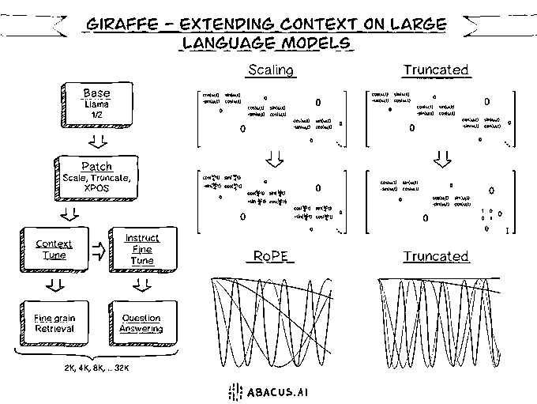

http://Abacus.AI 发布首个 32K 上下文的开源 LLM：Giraffe，底座是 LLaMa 1 和 LLaMa 2。开源 LLM 上下文高于 32K 的，目前只有 MPT-7B（能够达到 84K）

官方新闻：https://blog.abacus.ai/blog/2023/08/22/giraffe-long-context-llms/…

如果你想追踪有哪些开源 LLM，可以看这个 Github：https://github.com/eugeneyan/open-llms

Qwen-VL：阿里云通义千问的多模态 LLM，支持以图像、文本、检测框作为输入，并以文本和检测框作为输出。

Github：https://github.com/QwenLM/Qwen-VL

Scenimefy：把视频处理成新海诚动漫风格。另外作者提供了如何获取新海诚图片数据集的操作方法。

项目地址：https://yuxinn-j.github.io/projects/Scenimefy.html…

在线体验：https://huggingface.co/spaces/YuxinJ/Scenimefy…

Github：https://github.com/Yuxinn-J/Scenimefy

Pebblely ：又一个专为电商设计的 AI 产品创意图生成工具。该平台可以一键生成针对产品的精美场景图，这些图可以直接用于淘宝、亚马逊、小红书等电商和社交媒体平台。

最主要的平台很良心，每月可以免费 40 生成张图，用户可以上传产品照片， Pebblely 自动生成的带有完美打光、映射和阴影和背景的照片。

自带 20 种默认主题，也可以通过文本提示语来控制。

该平台还提供了一系列高级功能，如场景图大小调整、多媒体创意素材转换等。

传送门：https://pebblely.com/zh/

OpenAI 推出 ChatGPT 企业版！ 它提供：

- 企业级安全和隐私保护，经认证符合 SOC 2 标准，客户的 Prompt 和公司数据不用于训练 OpenAI 模型。

- 无限制访问 GPT-4（无使用上限）

- GPT-4 的更高速性能（速度提高 2 倍）

- 无限制地访问高级数据分析（以前称为代码解释器）

- 处理更长输入的更长上下文窗口（32 K）

- 高级数据分析功能

- 可共享 Prompt 模板

- 自定义选项等。

VALL-E X: Multilingual Text-to-Speech Synthesis and Voice Cloning

github: https://github.com/Plachtaa/VALL-E-X…

web demo: https://github.com/Plachtaa/VALL-E-X/blob/master/launch-ui.py

Clipdrop： 使用相机把现实中的物体复制粘贴到电脑里

一个使用增强现实（AR）和机器学习（ML）技术的应用，允许用户将周围环境复制并粘贴到笔记本电脑上打开的任何软件中。

产品仍在测试阶段

排队：https://arcopypaste.app

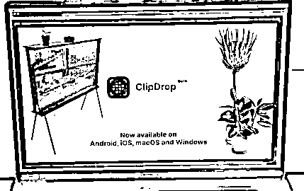

字节的两个 AI 视频项目，团队是同一拨人。

MagicEdit：输入文字即可编辑视频，包括修改风格、修改局部画面、视频混合、视频扩展。

项目地址： magic-edit.github.io

MagicAvatar：输入文本、视频、音频，生成带动作的虚拟角色。

项目地址： magic-avatar.github.io

Meta AI 出了一个 OCR 神器：Nougat！

可以轻松将学术 PDF 文档转换为 MultiMarkdown。尤其擅长复杂数学公式。

扫描版的 PDF 也能转换，基于 Transformer 模型训练而成。

MultiMarkdown

输出格式是 MultiMarkdown，适合于学术文档写作。但我平时在 Obsidian 中使用 Markdown，诸如公式等格式细节，需要手动调整后才能在 Markdown 中正确展示。

公式

能将公式转换成正确的 LaTeX，特别强大！！！学术党喜极而泣有木有！！太幸福了。

表格

能识别表格，但输出的是 LaTeX 格式的表格，在 Markdown 中没法渲染。

图片

生成的文档中不包含图片。图片可以自行从 PDF 中提取。或者手动截图也不失为一个简单办法。

原文见：

https://maeiee-garden.vercel.app/000.wiki/Neural%20Optical%20Understanding%20for%20Academic%20Documents/

Text-to-Sing

@Gradio

demo.

Results are unbelievably melodious! [attached]

Upload a melody of your choice, enter your own lyrics, and have the computer sing back your lyrics in the given melody!

Demo on

@huggingface

Spaces - https://huggingface.co/spaces/Voicemod/Text-to-Sing

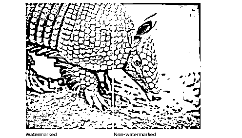

Google Deepmind 推出一种新型 AI 图像水印工具：𝗦𝘆𝗻𝘁𝗵𝗜𝗗

这是一种专门用于为人工智能生成的图像添加水印和识别的数字工具。

SynthID 可以将数字水印直接嵌入到人工智能生成的图像的像素中，使其无法被人眼察觉。

同时它不会影响图像质量，并且可以承受常见的编辑技术，例如在裁剪或添加滤镜后任然可以检测到水印。

工作原理介绍：

https://deepmind.com/blog/identifying-ai-generated-images-with-synthid

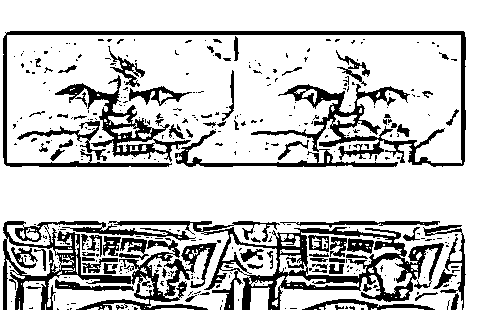

MS-Vid2Vid-XL

型号： https://huggingface.co/damo-vilab/MS-Vid2Vid-XL…

MS-Vid2Vid 项目由达摩院开发和训练，主要用于增强文本生成视频和图像生成视频的分辨率和时空连续性。训练数据由大量精选的高清视频和图像数据（最小短边长度为 720）组成，可以将低分辨率（16:9）视频升级到更高分辨率（1280 * 720）。它可用于任意低分辨率超分辨率任务。在此页面上，我们将其称为 MS-Vid2Vid-XL。

令人兴奋的消息！

隆重介绍我们的新成员：WizardCoder-Python-7B-V1.0 🚀

🔗演示：http://47.103.63.15:50088/

✨该紧凑版本的性能可与著名的 WizardCoder-15B-V1.0 相媲美，非常适合计算资源有限的用户。毫不妥协地释放您的编码魔力！

HumanEval Pass@1：

WizardCoder-Python-7B-V1.0 = 55.5

WizardCoder-15B-V1.0 = 59.8

MBPP 通行证@1：

WizardCoder-Python-7B-V1.0 = 51.6

WizardCoder-15B-V1.0 = 50.6

您可以尝试演示并立即下载。

huggingface.co/WizardLM/WizardCoder-Python-7B-V1.0

来自 CoT、Self-Consistency 作者的 Least-to-Most Prompting 框架可以了解下，主要用来解决复杂问题 https://breezedeus.com/article/llm-prompt-l2m

10 个仅供娱乐的 AI 工具：

1\. 向过去问好

https://hellohistory.ai

2\. 伪装自己

https://fakeyou.com

3\. 虚幻餐

https://unrealmeal.ai

4\. 重塑人工智能

https://hey.reface.ai

5.变声器

https://voicemod.net

6\. 纹身师

https://tattoosai.com

7\. 与书交谈

https://books.google.com/talktobooks/

8\. 复古头像

https://myheritage.com/ai-time-machine

9\. 播放列表人工智能

https://playlistai.app

10.角色 AI

https://beta.character.ai

BrightMarker：麻省理工学院的研究人员研究出一种可以在物体中嵌入“隐形标签”并追踪它们的技术。

他们使用一种荧光丝，通过 3D 打印将可追踪的标记嵌入到彩色对象中。

这种荧光材料具有在特定近红外波长下发光的特性，并在红外线相机上以高对比度显示。所以可以使用与其荧光特性匹配的光源和相机滤镜来进行定位。

研究人员开发了两种可安装的硬件模块，分别用于能检测 BrightMarker 的智能手机和 AR/VR 头戴式设备。

应用场景：

1、虚拟现实（VR）: 可以在 VR 环境中用于追踪用户的手或其他物体。

例如，可以将嵌入荧光标签的手环佩戴在四肢上，以实现 VR 环境中的运动跟踪

2、物体检测: 可以用于物流和仓储，追踪货物的准确位置。

3、防伪: 可以用于高价值商品的防伪标签。

论文：https://groups.csail.mit.edu/hcie/files/research-projects/brightmarker/2023-UIST-BrightMarker-paper.pdf

许多 GenAI 初创公司的起点都在 GitHub

以下是位列前茅的+融资金额：

Langchain ($10M) AI 开发库

60k - https://github.com/langchain-ai/langchain…

Nomic AI ($17M) CPU 本地运行的 LLM

51k - https://github.com/nomic-ai/gpt4all…

MindsDB ($54.4M) 将 AI/ML 模型连接到任何数据源

18k - https://github.com/mindsdb/mindsdb

Cursor ($0.4M)为 AI 编程而设计的编辑器

8k - https://github.com/getcursor/cursor…

TabNine ($32.1M) AI 代码交付

10k - https://github.com/codota/TabNine

Fig ($2.4M) 更高效的命令行

22k - https://github.com/withfig/autocomplete…

Warp ($73M) 基于 Rust 的超快现代 GPU 加速终端

15k - https://github.com/warpdotdev/Warp

Llamaindex ($17M)LLM 应用的数据框架

21k - https://github.com/jerryjliu/llama_index…

Lightning AI ($58.6M) 用于快速训练的深度学习框架

25k - https://github.com/Lightning-AI/lightning…

Deepset ($45.2M) 端到端 NLP 框架

10k - https://github.com/deepset-ai/haystack…

原作者：

@chiefaioffice

https://openai.com/blog/introducing-chatgpt-enterprise

企业版介绍

长视频 AI 剪辑成短视频，用于营销使用

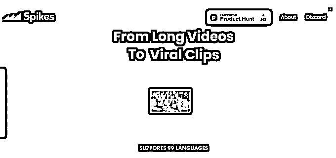

https://spikes.studio

之前介绍的专注于模仿动漫影视角色人物对话，让用户可以和这些动漫影视角色聊天对话的模型 ChatHaruhi 放出了一些演示。

感觉还是很有意思的，尤其是转换成语音后，也保留了语气。

OpenAI 版演示：https://huggingface.co/spaces/chenxiYan/haruhi…

OpenAI 版 Colab：https://colab.research.google.com/github/LC1332/Haruhi-2-Dev/blob/main/notebook/ChatHaruhi2_demo.ipynb…

更多演示见项目地址：

ChatHaruhi：通过大语言模型在现实中复活动漫角色

ChatHaruhi 从电视、电影、小说等中尽可能多地提取特定人物的对话的方式，形成该人物的记忆数据库。

数据被有效地组织成三个要素：角色的背景（世界观）、个性（一致性）和语言习惯（言语风格）。

从而可以模仿凉宫春日等一系列动漫人物，使用近似语气、个性和剧情聊天。

GitHub：https://github.com/LC1332/Chat-Haruhi-Suzumiya#readme…

论文：https://github.com/LC1332/Chat-Haruhi-Suzumiya/blob/main/notebook/arxiv_paper.md

Youtube Dubbing：可以将 YouTube 视频翻译成其他语言并用语音读出来。

我测试了下，主要原理是根据字幕来进行翻译然后再转成语音读出来，如果没有字幕就不行了！

可以选择男声和女声的多种角色声音，发音还比较自然。

总体感觉就是能用，我同时开启了字幕翻译插件，它翻译的内容和字幕翻译相比准确度比较差。

支持英语、德语、日语、法语、西班牙语等多种常见语种。

感觉还有很大优化空间，应该对视力障碍的人来说很有用。希望作者加大优化造福盲人！

想体验的可以试试：https://chrome.google.com/webstore/detail/youtube%E4%B8%AD%E6%96%87%E9%85%8D%E9%9F%B3/oglffgiaiekgeicdgkdlnlkhliajdlja

发个正式版：

2023 年 8 月 31 日，百川智能通过《生成式人工智能服务管理暂行办法》备案，现已具备向公众提供生成式人工智能服务的资质，即日起面向广大用户开放服务。http://baichuan-ai.com

https://mp.weixin.qq.com/s/CT6rbvof6XGFEGiu1oPLgA…

Runway GEN-2 推出新功能，支持设置视频的运动幅度

可以清晰地画出你要的文字，包括艺术字。 注册即用，完全免费，绘图效果也算不错。

官网：https://ideogram.ai/

抖音（云雀）、百度（文心一言）、百川（王小川）、清华（智谱华章）、中科院（紫东太初）几家大模型备案已经获批，可以正式上线。

ai-silicon-valley.fly.dev

RealChar + AI 小镇 + Llama2

将您的 RealChar 角色放入任何虚拟世界中，并在其中进行有趣的对话！

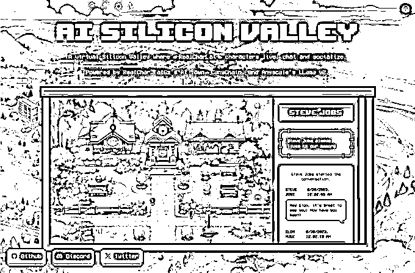

上传图片，可以生成视频。基于 VideoComposer 实现。

模型地址：https://huggingface.co/damo-vilab/MS-Image2Video

魔搭在线体验：https://modelscope.cn/studios/damo/I2VGen-XL-Demo/summary

colab 在线体验： github.com/camenduru/I2VGen-XL-colab

RUNWAY 刚刚添加了两个新的视频控件！

1/ 现在您可以使用初始化映像+提示符，而无需“擦除”映像。

2/ 运动滑块：更改视频中的运动强度。值越高，运动越多。

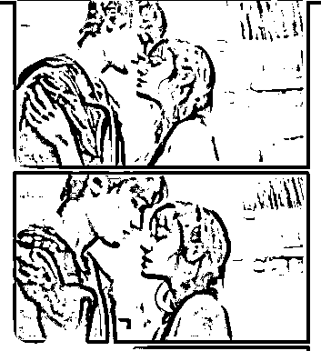

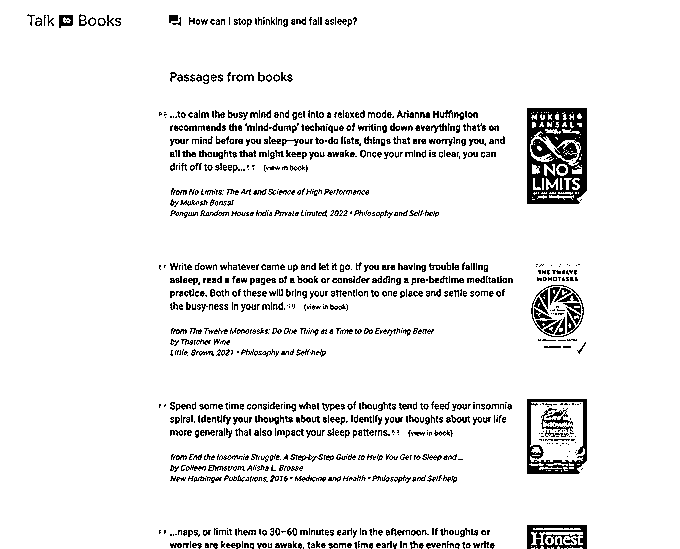

与书对话，开启智慧之旅！

Google 的“Talk to Books”。这是一个实验性的 AI 工具，让你能够与大量的书籍进行对话

。想象一下，你问书一个问题，书就会回答你！

但无论你是学者

、商人

还是日常用户

，这都是一个探索知识的好方法！

希望你们喜欢这个分享！

https://books.google.com/talktobooks/

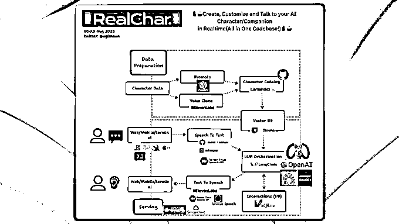

在 Github 上看到一个不错的 AI 角色扮演解决方案「RealChar. - Your Realtime AI Character」，可以实时创建、定制并与您的 AI 角色/伴侣进行对话，可以定制您的 AI 角色的个性、背景，甚至声音，想玩的小伙伴可以去试试看。

https://github.com/Shaunwei/RealChar

A new ModelScope Image2Video is out on

@huggingface

we love it !

It generates a short video from init image while keeping style consistency and try to restitute the general composition idea from source

Share your results with the Community

—

https://huggingface.co/spaces/fffiloni/MS-Image2Video

告别耗时且昂贵的照相馆！

到 2023 年，我们不再需要它们了。

介绍 http://Imgcreator.ai - ChatGPT 摄影

这就是它改变游戏规则的原因：

• 为您的产品获取超现实的背景

• 通过“人工智能拍摄”将您最疯狂的梦想变为现实

• 自动调整所有社交媒体平台的内容大小

With 3 photos, we can fine-tune text-to-image models. #FaceChain uses 10 different pipelines to achieve the best results.

Now on Colab

Thanks to https://modelscope.cn

and FaceChain Team

code: https://github.com/modelscope/facechain…

colab: please try it

https://github.com/camenduru/facechain-colab

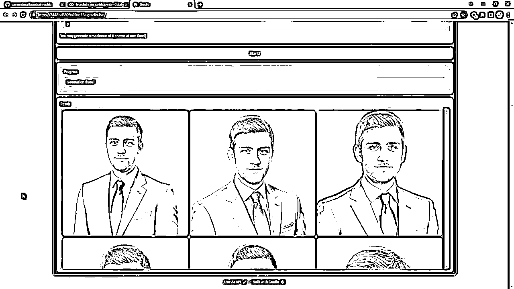

Introducing TextEnvironments in TRL 0.7.0!

https://github.com/huggingface/trl

With TextEnvironments you can teach your language models to use tools to solve tasks more reliably.

We trained models to use Wiki search and Python to answer trivia and math questions!

Let's have a look how

LIDA：由微软研究院开发的工具，使用 LLMs 将数据可视化和生成信息图表

如果你有一堆数据，但不知道如何用图表或图像来解释它，LIDA 就是一个可以帮你自动做这些事情的工具。它不仅可以帮你理解数据，还可以根据你的数据生成各种图表和图像。

详细介绍：https://microsoft.github.io/lida/

论文：https://aclanthology.org/2023.acl-demo.11/

GitHub：https://github.com/microsoft/lida

工作原理：

LIDA 不局限于使用某一种特定的编程语言或可视化库来生成图表或信息图。（例如 matplotlib、seaborn、altair、d3 等）

它通过理解数据的语义、列举相关的可视化目标，并生成可视化规范来自动化可视化创建过程。

意味着它可以与多种编程语言和可视化库兼容。这种灵活性使得 LIDA 能够更广泛地应用于不同的数据可视化场景。

这就像一个“万能工具”，不管你用什么编程语言或图表样式，它都能帮你自动地创建出你需要的图表或信息图。

同时它与多个大型语言模型（如 OpenAI、PaLM、Cohere、Huggingface）兼容。

LIDA 提供了一系列功能，包括数据摘要、目标生成、可视化生成、可视化编辑、可视化解释、可视化评估和修复，以及可视化推荐。此外，它还有一个实验性的信息图表生成功能。

由

@JeffSynthesized

制作，花费了大约 10 天时间，但是他并没有透露使用了哪些工具！

高清画质，情节也很完整，唇型也对的相当好。

有 4K 高清版本原版：https://youtu.be/oyiALFG_0iU?si=rS-wVgafy7pVDNnt…

https://huggingface.co/spaces/hf-accelerate/model-memory-usage

00 AI Tools to Start your Profitable Online Business in 2023:

Tinywow

今天，我们宣布了计算机视觉工作的两项新更新——我们的 DINOv2 模型的新的扩展许可证以及 FACET 的发布，FACET 是一个全面的新基准数据集，可帮助评估和提高视觉模型的公平性。

更多细节➡️ https://bit.ly/3L35E1U

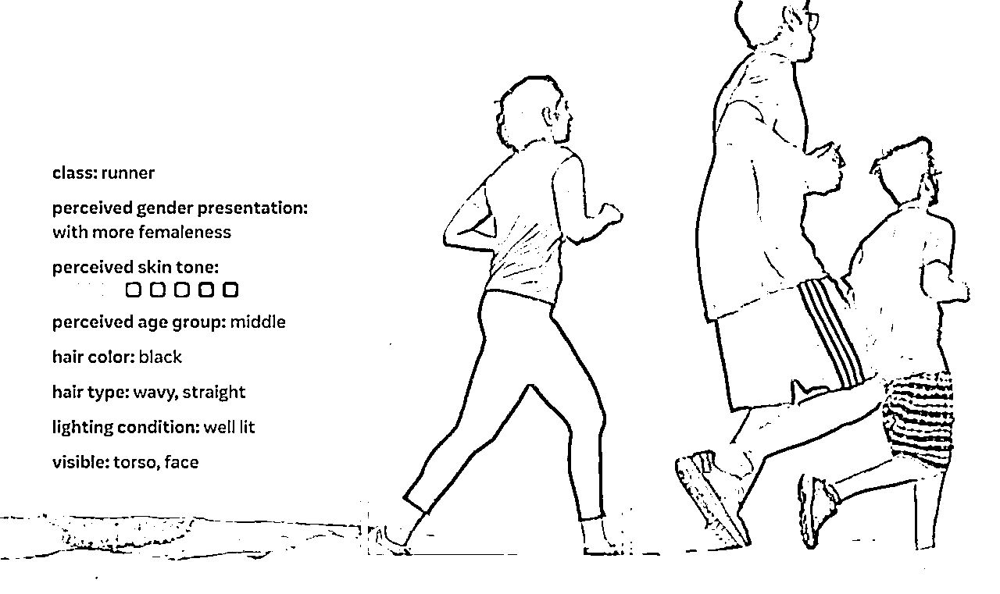

This is amazing. PanoHead is a new model that generates 3D textured models from a single image.

Github: https://sizhean.github.io/panohead

Paper: https://openaccess.thecvf.com/content/CVPR2023/papers/An_PanoHead_Geometry-Aware_3D_Full-Head_Synthesis_in_360deg_CVPR_2023_paper.pdf

详见推文：https://twitter.com/fofrAI/status/1691108135749156864

中文版视频教程：https://www.youtube.com/watch?v=s0XJOGfUxkE

只需最低一张图片就能训练出效果不错的个人 AI 形象，

Face Chain 一个可以用来打造个人数字形象的深度学习模型工具，由 ModelScope 魔搭开源模型社区推出。目前可以在魔搭社区和 Hugging face 在线体验，也可以通过 Colab notebook 运行，详情请看👇🏻

中文项目介绍：https://github.com/modelscope/facechain/blob/main/README_ZH.md

OpenAI 发布了一份针对教师在课堂上如何使用 ChatGPT 的指南。

内容包括如何使用 ChatGPT 来加速学生学习，以及一些教育者可以使用的 Prompt 提示。

文章还讨论了 ChatGPT 的工作原理、局限性、AI 检测器的有效性以及偏见问题。https://openai.com/blog/teaching-with-ai…

最后还给出了一份详细的 Educator FAQ：为教育者提供关于如何负责任地使用 ChatGPT 的指导和资源。

页面包括一系列文章，涵盖了从如何应对学生提交 AI 生成内容到 ChatGPT 是否适合所有年龄段等多个方面。

Educator FAQ：https://help.openai.com/en/collections/5929286-educator-faq

Simulating a software company with LLMs!

Remember the 25 agents living in a simulation? This does the same but for a software company

ChatDev asks the questions around effectively getting Large Language Model agents collaborate on writing entire code bases:

- Writing a function using ChatGPT is easy

- Writing an entire Python file is also feasible

- An entire codebase though needs work

- How do we do make an entire repository from a prompt?

- ChatDev creates individual agents representing different roles in a company

- The user prompt is iteratively discussed

- CTO, Software Engineers and Designers collaborate to write code

- This is then tested by more agents

- Finally documented by another team

- Remember every person is an instance of GPT-3.5 Turbo

But, what are the tricks?

- LLMs hallucinate and can lose track of thoughts. This is minimised by injecting thoughts into prompts

- A single agent can lose track at autocomplete, hence every stage is a conversation

- To minimise repetitions, the conversations are summarised at a few steps

The codebase is very approachable and nicely documented. I invite you to test it out, it’s really cheap since it relies on GPT-3.5-turbo

Video credit

: Derived from the original repository

https://github.com/OpenBMB/ChatDev

## 8 月 21 日～27 日

由来自北航、中山大学、浙大和华东师范的团队合作开发的国产 AI 小镇来了

论文：https://arxiv.org/abs/2308.04026

项目：https://github.com/py499372727/AgentSims/

很需要这样的工具，它能把低像素（模糊）图片生成 4K 图像，可以在 3.66 秒内合成 4k 分辨率的超高清图像。直达地址：https://mingukkang.github.io/GigaGAN/

前 Machine Zone 首席执行官创建了一款名为 BeFake 的新社交媒体应用程序。

它允许用户使用内置的 AI 生成器将自己置于任何他们想象的场景中。用户可以尽情发挥创意。

也就是将装 X 进行到底！哈哈哈哈... 但是所有都是假的！

你每天都可以成为一个全新的自己。不是真实的你，而是你想成为的任何人或任何地方的你。

你可以告诉它你想在火箭上开生日派对，或者在办公楼里和熊搏斗...

BeFake 主要功能：

📸 每天随机时间拍照：应用会提示你拍照，然后你可以用 AI 生成器将自己放入任何场景。

💡 预设与自定义提示：应用提供预设提示，也允许你输入自己的想法。

⏰ 20 分钟创作时间：有 20 分钟的时间创建并发布你的场景，期间可以不断修改。

💵 付费功能：有一些付费功能，如隐藏原始图像、无限 AI 生成等，价格为每周 $2.99 或每月 $9.99。

下载链接：https://befakeai.com

Adobe Express 进行了重大更新，内置了 Adobe Firefly 生成式 AI，并提供了超多丰富实用的功能。

现在已经是一个强大的在线工具箱了：

AI 生成功能：借助由 Adobe Firefly 提供支持的 AI 生成功能，仅提供文字描述便可立即生成出色的文字效果和图片。支持 100 多种语言的文本提示。

全新一体化编辑器：使用这款一体化应用程序可以轻松快捷地制作 Instagram Reels 和 TikTok 视频，以及传单、简历、横幅、徽标等。

丰富的免费资源：提供近 2 亿素材资产，包括视频和设计模板、免版税的 Adobe Stock 图像、视频和音频资产、近 22,000 种字体，以及更多图标、背景和形状。

轻松制作视频：合并视频片段、图片、动画和音乐，只需拖放即可轻松制作视频。

一键操作：轻轻一点即可完成各种任务，例如一键删除图像视频背景、调整内容大小、转换为 GIF，或导入和增强 PDF。

新的动画效果：如淡入、弹出、闪烁、蹦床等，以新方式赋予文本、照片、视频和资产生命。 通过 Adobe Character Animator 提供的“从音频动画化”功能，观看角色随着录制的对话同步唇部和手势活跃起来。

团队协作：与您的团队实时协作处理文件并发表评论。这增加了创作过程的速度。轻松访问、编辑和使用 Photoshop 和 Illustrator 中的创意资产，或添加始终在应用程序之间保持同步的链接文件。

免费体验：https://adobe.com/express/

更新内容详细介绍：https://adobe.com/express/learn/blog/desktop-announcement

著名 AI Podcast 工具 Snipd，提供 AI 转写、片段裁切，是非常好的英语学习素材工具。

官网提供有 Top Podcast Lists，每个播客点进去都能看到 AI 转写文本。

https://share.snipd.com/top-podcasts

刚让 GPT4 分析给了 Top 10 播客值得听的理由，附带直达链接如下：

1\. The Tim Ferriss Show

由畅销作家 Tim Ferriss 主持，通过深入访谈揭示成功人士的日常习惯和思维模式。

https://share.snipd.com/show/58c6e181-d2ff-4da6-a7ee-39414fb72dba…

2\. Lex Fridman Podcast

专注于人工智能、深度学习和科学哲学，为技术爱好者提供了丰富的前沿视野。

https://share.snipd.com/show/85d6570c-a7b2-4cec-9d57-bbd4b725e6aa…

3\. Invest Like the Best with Patrick O'Shaughnessy

结合实际投资经验，分享业内专家的投资策略和市场分析。

https://share.snipd.com/show/e708faea-b008-4239-a8f7-302cbe73ebd4…

4\. Deep Questions with Cal Newport

通过探讨深刻的人生和工作问题，引导听众反思生活方式和职业道路。

https://share.snipd.com/show/37ffa429-6ed7-4316-9f82-b616c1afc9c0…

5\. TED Talks Daily

每天精选一场 TED 演讲，帮助听众跟上全球最新的科技和文化潮流。

https://share.snipd.com/show/44b15017-7938-4c22-aa95-fa4a7801a9fa…

6\. Huberman Lab

针对科学和健康爱好者，介绍最新的科学研究和健康生活指导。

https://share.snipd.com/show/a7002921-2fb5-4ee4-8faa-41d1e967f05e…

7\. The Knowledge Project with Shane Parrish

通过与各领域专家的对话，提供了一种全新的学习和思考的方式。

https://share.snipd.com/show/82276930-d446-4ee1-b204-84198acb5bfc…

8\. The Daily

为时事追踪者每天提供全球重要新闻的深度分析和背后透视。

https://share.snipd.com/show/d7988675-10e3-48d5-88a0-48a1a11749ec…

9\. The Peter Attia Drive

由医生 Peter Attia 主持，关注人体健康和长寿，提供实用的健康建议。

https://share.snipd.com/show/aca6b50f-6409-4bfc-914c-8fc585e330ba…

10\. Planet Money

以轻松幽默的方式解读复杂的经济现象，使经济学变得生动有趣。

https://share.snipd.com/show/0d664d9a-72ad-49c5-aa9e-9d20862717ae…

个人最喜欢 Lex Fridman Podcast、Huberman Lab。

抽空听听其他播客，说不定有意外惊喜。

看了一堆 MJ 课程，发现大多是改的官方教程，还不如直接看官方的，更新、更准确、更好理解

官方手册直达链接：http://docs.midjourney.com/docs/quick-start…

如果英文版对你有障碍，推荐浏览器插件【沉浸式翻译】看英文网站无压力

识别“洗碗机里的盘子”或“桌子上的杯子”等符号可以实现

任务规划

但是我们如何获取数据来训练识别符号的模型呢？

引入“Grounding Predicates through Actions”来自动标记人类视频数据集

https://sites.google.com/stanford.edu/groundingpredicates

经过实验，我们训练了一个针对动画图像的 ControlNet-LLLite 深度模型，并公开了其权重。

该模型仅有 11MB，但效果相当不错。

其中，cond_emb_dim 为 8，network_dim 为 16。

https://huggingface.co/kohya-ss/controlnet-lllite/tree/main

https://huggingface.co/spaces/fffiloni/Music-To-Zeroscope

music to zeroscope

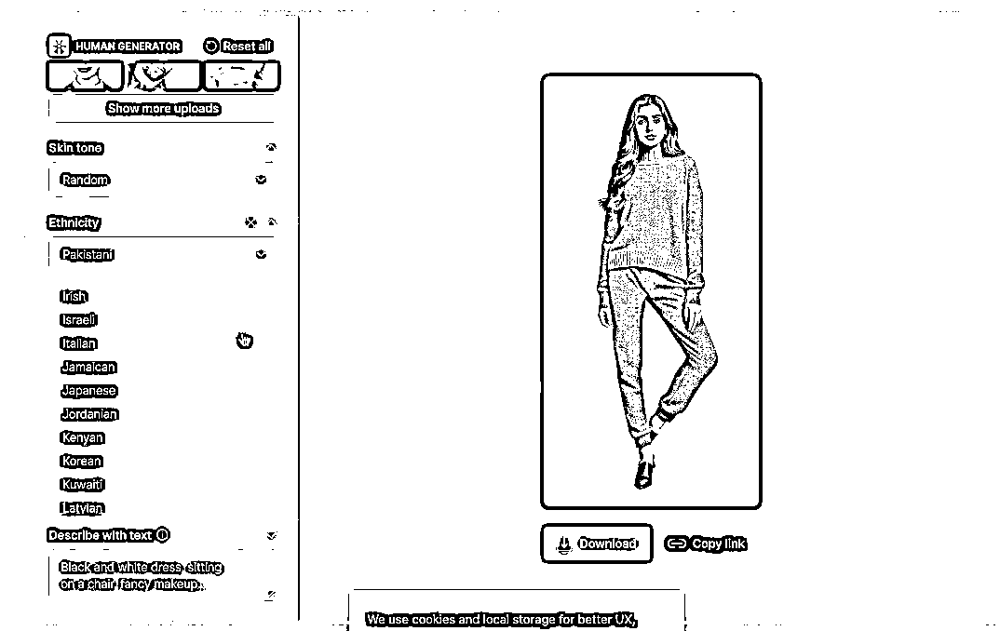

https://generated.photos/human-generator

很有趣，能换衣服人脸动作，场景支持 prompt

哈哈哈哈哈，自建 LLM2 Server， 刚把自己的笔记本升级到 64GB，玩起来 !!

https://github.com/getumbrel/llama-gpt…

docker 在自己电脑上部署羊驼

https://github.com/getumbrel/llama-gpt

https://github.com/openchatai/OpenCopilot…

OpenCopilot – AI 副驾驶（助手）为你的 SaaS 产品

OpenCopilot 是一个开源的 SaaS 产品 AI 副驾驶，可以与 API 集成，并根据用户请求执行 API 调用。

目前它存在一些限制，比如不支持同时调用多个终端点、处理大型或复杂的 API，或者记住聊天历史。

OpenCopilot 的许可证与「面向所有人的开源 AI 助手」这个标语不兼容，因为它限制了未经明确书面许可的分发。

一些评论者对误导性的开源声明和修改后的许可证表示失望。

其他人讨论了 AI 取代复杂 UI 和需要 Alexa 接口的潜力。

一位评论者建议使用开源而不是等待公司推出解决方案。

还有一个关于制作视频演示的工具的问题，以及一个用户报告机器人存在问题。

另一位评论者幽默地表示后端是由 AI 编写的。

Note: The above translation has been embellished to enhance the typographical layout and make the language expression more natural while preserving the original meaning. The summarized content is within the 50-word limit.

腾讯开源的 AI 模型 GFPGAN，能帮助恢复老照片

项目地址：https://github.com/TencentARC/GFPGAN…

在线测试地址：https://replicate.com/tencentarc/gfpgan

宝玉

twitter.com/i/status/1693476354040418456…

新推出了一种名为「ChatHaruhi」的框架，专注于模仿现有角色的个性。

该框架是由香港企业 SenseTime 的研究人员开发的。

○ Cheng Li 等人的论文《ChatHaruhi: 通过大型语言模型在现实中复活动漫角色》

具体方法如下：

■从动漫剧本等数据中提取信息，创建内存数据库

（数据包括角色特有的说话方式等）

■在对话过程中，语言模型参考内存数据库

■根据情绪、知识等方面进行模仿表演

■用户和系统对语言模型与角色的相似程度进行反馈

研究人员还提供了 32 种角色的内存数据库，称为「ChatHaruhi-54k 数据集」。

此外，他们还发布了使用 gradio 创建的演示。

公开的数据和演示支持英语和中文（不支持日语），可视为展示「模仿角色」的研究方法的示例。

谷歌在线 Slides（可转换成 PPT 文件）的 AI 插件 MagicSlides 加入了新功能，可以直接从 YouTube 视频生成 PPT，效果还可以（暂时只支持英文）

MagicSlides 另外支持主题生成 PPT、总结文字生成 PPT、url 生成 PPT。

官方教程：https://magicslides.app/get-started

看过很多文章说现在 NPC 可以接入 ChatGPT，让 NPC 可以跟人聊天而不是说车轱辘话，不过没有体验过，这次是有人发布了上古卷轴 5 的 Mod，可以用 VR 直接体验。

其中 AI 对话是基于 ChatGPT 的 API，语音识别是用的 Whisper，文本转语音（TTS）用的是 xVASynth。

Mod 首页：https://nexusmods.com/skyrimspecialedition/mods/98631…

Reddit 帖子：https://reddit.com/r/singularity/comments/15vgk38/mantella_mod_bring_skyrim_npcs_to_life_using_ai/

宝玉

快手大模型 快意

https://github.com/kwai/KwaiYii

Rip Video Creator?

Create Text-to-Video Using AI

➵ http://flexclip.com

➵ http://invideo.io

➵ http://wave.video

➵ http://veed.io

➵ http://rawshorts.com

➵ http://synthesia.io

➵ http://kapwing.com

➵ http://pictory.ai

纯文本构建好玩的东西

❯ 文本 ➝ 代码

http://codeium.com

❯ 文字 ➝ 图片

http://leonardo.ai

❯ 文字 ➝ 视频

http://steve.ai

❯ 会议 ➝ 文本（摘要）

http://tldv.io

❯ 文本 ➝ 简历

http://kickresume.com

❯ 文字 ➝ 博客

http://longshot.ai

❯ 文字 ➝ 演示

http://beautiful.ai

❯ 文字 ➝ 游戏

http://ludo.ai

Meta 发布 SeamlessM4T AI 模型，可翻译和转录近百种语言

SeamlessM4T 支持近 100 种语言的自动语音识别、语音到文本翻译、语音到语音翻译、文本到文本翻译和文本到语音翻译的多任务支持。

他们的目标是建立一个通用语言翻译器，就像《银河系漫游指南》中的虚构的巴别鱼一样。

SeamlessM4T 支持：

•近 100 种语言的自动语音识别

•近 100 种输入和输出语言的语音到文本翻译

•语音到语音翻译，支持近 100 种输入语言和 35 种（+英语）输出语言

•近 100 种语言的文本到文本翻译

•文本到语音翻译，支持近 100 种输入语言和 35 种（+英语）输出语言

Meta 表示，它将以研究许可证的形式公开发布 SeamlessM4T，以便研究人员和开发人员在此基础上开展工作。此外，Meta 还发布了 SeamlessAlign 的元数据，这是迄今为止最大的开放式多模态翻译数据集之一，共挖掘了 27 万小时的语音和文本对齐。

该模型采用了多任务 UnitY 模型架构，能够直接生成翻译后的文本和语音。

SeamlessM4T 模型的开发是为了实现一个通用的语言翻译器，能够覆盖世界上的大部分语言。

详细：https://ai.meta.com/blog/seamless-m4t/…

在线演示：https://seamless.metademolab.com

Hugging Face 演示：https://huggingface.co/spaces/facebook/seamless_m4t

https://github.com/facefusion/facefusion

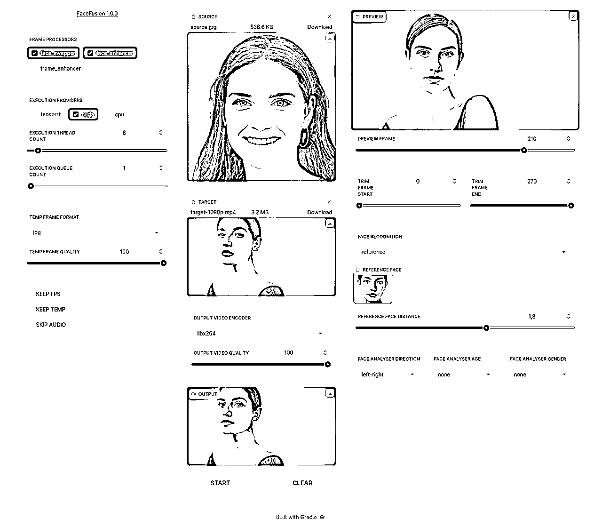

好未来发布 千亿级 数学大模型 MathGPT

https://mp.weixin.qq.com/s/Atm0RtifVdbZVkt4FE7rOg

Image2Video & Video2Video Colab

Thanks to https://damo.alibaba.com

https://modelscope.cn

paper: https://arxiv.org/abs/2306.02018

https://modelscope.cn/models/damo/Image-to-Video/summary…

https://modelscope.cn/models/damo/Video-to-Video/summary…

demo: https://modelscope.cn/studios/damo/I2VGen-XL-Demo/summary…

colab pro

: please try it

https://github.com/camenduru/I2VGen-XL-colab

StableVideo：仅通过文字编辑视频。

仅通过输入文字，描述想修改视频的什么地方，即可完成视频编辑。

Github：https://github.com/rese1f/stablevideo…

论文：https://arxiv.org/abs/2308.09592

Meta's CodeLlama is here!

https://ai.meta.com/blog/code-llama-large-language-model-coding/…

7B, 7B-Instruct, 7B-Python, 13B, 13B-Instruct, 13B-Python, 34B, 34B-Instruct, 34B-Python

First time we've seen the 34B model

I've got a couple of fp16s up:

https://huggingface.co/TheBloke/CodeLlama-13B-Instruct-fp16…

https://huggingface.co/TheBloke/CodeLlama-13B-fp16…

More coming soon obvs

AI 动画 Text2Video（仅通过文本生成）

通过在 AnimateDiff prompt travel 中间更改应用的提示，控制视频内容

在本地环境构建后，生成速度提高了大约 3 倍，可以一次生成相对较长的视频

CSF 和 UC Berkeley 的研究人员开发了一种可植入的 AI 驱动设备，首次将大脑信号转化为语音和面部表情。

一位由于中风失去说话能力的女士借助该技术，能够通过一个数字化虚拟形象来说话和传达情感。

该研究已在《自然》杂志上发表。

30 岁的 Ann 因脑干中风失去了身体所有肌肉的控制能力，甚至无法呼吸。经过多年的物理治疗，她的面部肌肉得到了一定的恢复，但仍无法说话。

OpenAI 创始人：超级人工智能一个月可以攻克癌症

一位中东创投圈知情人士向腾讯新闻《深网》透露，OpenAI 首席执行官山姆·奥特曼下半年奔赴阿联酋首都阿布扎比等地寻求融资，此次融资的规模巨大，不低于 1000 亿美元。

如何打动中东财团？山姆奥特曼讲的故事不仅仅是 AGI 通用人工智能，他描述 OpenAI 的目标是要实现 Super intelligence（超级智能），比人类智能要更高级。

在阿布扎比，有投资人问山姆奥特曼，“如果 Super intelligence（超级智能）实现了，你觉得人类可以多久治愈癌症？”山姆奥特曼的回答是，可能只需要一个月的时间就可以。

Dynamic 3D Gaussians 动态 3D 场景扫描，在这个有趣的示例中，研究人员把扫描的动态 3D 对象植入到另外一个 3D 场景中，营造出一个小人国的效果

网站： https://dynamic3dgaussians.github.io

论文： https://dynamic3dgaussians.github.io/paper.pdf

微软和中国科学院的研究人员发布一种增强数学推理能力的模型：WizardMath。

其性能超越 GPT3.5 和 Google 的 PaLM-2 等模型。

他们通过一种名为“Reinforcement Learning from Evol-Instruct Feedback”（RLEIF）的新方法进行微调，提高了 Llama-2 的数学推理能力。

在两个数学推理基准测试 GSM8k 和 MATH 上，WizardMath 展示了远超所有开源 LLM 的性能，分别提高了+24.8 和+9.2。值得注意的是，WizardMath 还大大超过了 OpenAI 的 ChatGPT-3.5、Anthropic 的 Claude Instant-1、Google 的 PaLM-2 等模型。

WizardMath 的详细信息和模型权重已在 GitHub 和 Hugging Face 上公开。

论文：https://arxiv.org/abs/2308.09583v1…

GitHub：https://github.com/nlpxucan/WizardLM…

Hugging Face：https://huggingface.co/WizardLM

小互

https://discord.com/invite/pika

text-to-video

StableVideo- New research by

@re5e1f

et al. A groundbreaking text-driven diffusion model for video editing.

Achieves seamless, consistent edits by adding a temporal dependency feature! Models-

@huggingface

@Gradio

demo https://github.com/rese1f/StableVideo/blob/master/app.py…

When do we get it on Spaces?

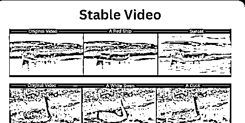

## 8 月 14 日～20 日

每天读的东西不少，但读了也就读了，收获很少，怎么办？

再次推荐 AI 社会化书签 glasp 提供的阅读辅助插件：https://chrome.google.com/webstore/detail/blillmbchncajnhkjfdnincfndboieik…

安装插件后配置：

① AI model 选择：建议选 Claude（Anthropic），免费且支持长文。如有 Plus 账号，可选 GPT4 或 GPT4 interpreter，唯一缺点，长文会截断。

② 开启键盘快捷键：个人用 Command+X+X，就是先按住 Command，再按两次 X。

③ Prompt for Summary：摘要 Prompt 如下

Your output should use the following template: ### Summary ### Highlights - [Emoji] Bulletpoint Use up to 10 brief bullet points to summarize the content below in Chinese, Choose an appropriate emoji for each bullet point. and summarize a short highlight:

好文章一定要自己先读完，否则提不出精准问题。然后按刚设置好的快捷键 Command+X+X

这时会自动跳转 http://Claude.ai 总结概要（要求美国或英国 IP 地址）

一般优秀文章会引发思考，甚至指引行动，可用以下 Prompt 追问。

“请一步步仔细思考，基于文章观点给我几个行动建议，请不要遗漏任何一条，不要担心回复太长，回复要求有逻辑、结构化，用 Markdown 展示。”

优秀的文章信息熵高，可以让 AI 列出更有价值的信息，Prompt：

“请一步步仔细思考，提炼文章中的反常识观点和高信息熵内容，请不要遗漏任何一条，先给结论，再给论据，尽量在原文基础上提炼，不要省略数字和年份等关键信息，不要担心回复太长，回复要求有逻辑、结构化，用 Markdown 展示。”

当给出反常识或高信息熵内容后，可追问论据，Prompt：

“以上信息的案例和论据都是什么？请一步步仔细思考回答，引用原文案例和论据，每个案例和论据都用一句话总结，直到找出文章中所有案例和论据，你不会出错，不会漏掉任何小的案例和论据。数字和年份都是关键信息，总结时请不要概括，直接引用。不要担心回复太长，回复要求有逻辑、结构化，可以用 Markdown 展示。”

除此之外，还可以让 AI 基于文章给你提几个问题，再让 AI 引用原文回答这些问题。

Fooocus

一款基于 Automatic1111 与 ComfyUI 的开源 AI 绘图软件。简单易用，无需任何设置，从下载软件到生成图像仅需 3 次点击，完美为非技术用户打造无门槛体验。采用 SDXL 模型，由 controlnet 的作者

@lvminzhang

打造。https://github.com/lllyasviel/Fooocus

DoctorGPT 模型 ：为每个人提供一个私人医生

通过训练和优化，该模型能够理解和回答医学问题，甚至可以与专业医生的知识相媲美

通过了美国医学执照考试，可离线使用，支持 iOS 和 Android 平台，还是开源的

http://github.com/llSourcell/DoctorGPT

https://github.com/leejet/stable-diffusion.cpp

Stable diffusion cpp 版本

ControlNet "OpenPose" XL is released:

https://huggingface.co/thibaud/controlnet-openpose-sdxl-1.0

https://twitter.com/xiaohuggg/status/1691005634777694210

机器人踢球，感觉以后可以办比赛了

一款面向 SEO 的 AI 自动化写作工具，BlogSEO，https://blogseo.ai，以后做市场营销推广都不用手写水文了，AI 直接帮你从标题到提纲到全文一口气生成……

未来我们在互联网冲浪，将会看到两种奇怪的现象：有人利用 AI 扩充内容制造文章 vs 有人利用 AI 提取概要消费文章

小镇模拟过程回放：https://reverie.herokuapp.com/arXiv_Demo/#

【#京东方公开脑机接口专利# ，专利将用于智能假肢方向】

据爱企查显示，近日，北京京东方技术开发有限公司、京东方科技集团股份有限公司公开“控制方法、装置、训练方法、电子设备及存储介质”专利。摘要信息显示，控制方法包括：获取用户控制目标对象的脑电信号，并利用神经网络模型对脑电信号进行处理得到控制信息。

其中，神经网络模型由脑电训练信号和肌电训练信号训练得到，以及根据控制信息对目标对象进行控制。如此，提高了整体脑机接口的性能，使假肢能灵活自由的完成大脑下达的指令动作，而且还有利于残肢患者能够进行日常的生活交流合作，恢复部分的生活自理和工作交流能力。

ControlNet "OpenPose" XL is released:

https://huggingface.co/thibaud/controlnet-openpose-sdxl-1.0

3D-VisTA：具备 3D 世界识别能力的 LLM，能够基于 3D 世界模型回答问题。项目团队同时发布了 ScanScribe dataset，3D 模型-文本的数据集。

项目地址：https://3d-vista.github.io

Github：https://github.com/3d-vista/3D-VisTA

AI 创作工具结合图形编辑器，开源图形编辑器助力 AI 创作工具

http://github.com/nihaojob/vue-fabric-editor

MuAViC: A Multilingual Audio-Visual Corpus for Robust Speech Recognition and Robust Speech-to-Text Translation

@Gradio

demo is out

github: https://github.com/facebookresearch/muavic…

introduce MuAViC, a multilingual audio-visual corpus for robust speech recognition and robust speech-to-text translation providing 1200 hours of audio-visual speech in 9 languages. It is fully transcribed and covers 6 English-to-X translation as well as 6 X-to-English translation directions. To the best of our knowledge, this is the first open benchmark for audio-visual speech-to-text translation and the largest open benchmark for multilingual audio-visual speech recognition. Our baseline results show that MuAViC is effective for building noise-robust speech recognition and translation models.

New ML gem on the hub: LDM3D by

@intel

. This diffusion model generates image & depth from text prompts. Using a custom

@gradio

6dof three.js component you can generate immersive 360-degree views from prompts

demo: https://huggingface.co/spaces/Intel/ldm3d…

model: https://huggingface.co/Intel/ldm3d-pano

Inst-Inpaint: Instructing to Remove Objects with Diffusion Models.

Led by Ahmet and Vedat, great collaboration with

@aykuterdemml

and

@erkuterdem

Paper: https://arxiv.org/abs/2304.03246

GitHub: https://github.com/abyildirim/inst-inpaint…

Website: http://instinpaint.abyildirim.com

Demo: https://huggingface.co/spaces/abyildirim/inst-inpaint

Abacus AI ：一套整套解决方案，允许用户只需提供文档和评估数据集，就能自动创建出效果最佳的 AI 聊天机器人。

他们采用了 AutoML（自动机器学习）技术，通过自动化的过程选择最佳的模型、参数和训练策略，从而简化了传统的机器学习流程。

这样的解决方案可以使非专家用户更容易地开发和部署复杂的 AI 系统，同时还能确保性能和效果。

详细介绍：https://blog.abacus.ai/blog/2023/08/10/create-your-custom-chatgpt-pick-the-best-llm-that-works-for-you/…

例如：假设有一家医疗保健公司，希望创建一个聊天机器人来回答客户关于保险政策和医疗服务的问题。由于这个领域的复杂性和专业性，通用的 LLM 可能无法准确回答特定的问题。

http://Abacus.AI 的方法通过结合微调、RAG 技术和自动化评估，为企业提供了一种灵活、高效且可扩展的方式来创建和维护定制的聊天机器人。

Abacus AI 的解决方案

1.选择合适的 LLM：Abacus AI 提供了多种 LLM 选项，如 GPT3.5、GPT4 等。医疗保健公司可以选择一个与其数据集和需求最匹配的模型。

2.微调 LLM：通过使用公司的专业知识库和文档，http://Abacus.AI 可以微调所选的 LLM，使其更好地理解医疗保险的特定术语和概念。

3.使用检索增强生成（RAG）：Abacus AI 可以将公司的文档分块，并使用 RAG 技术仅检索与客户查询相关的块。这样可以提高效率并减少错误。

4.自动化评估和选择：Abacus AI 使用 AutoML 能力迭代不同的组合，并使用公司提供的评估数据集来比较响应。通过多种评估指标，如 BLEU Score 和 BERT Score，公司可以选择最佳组合。

5.持续优化：随着时间的推移，Abacus AI 可以继续监控聊天机器人的性能，并根据实际反馈进行调整和优化。

通过这种方法，医疗保健公司能够获得一个能够准确回答复杂问题的聊天机器人，同时减少了手动微调和评估的努力。http://Abacus.AI 的灵活性和自动化能力使公司能够快速适应变化，并确保聊天机器人始终与其业务目标和客户需求保持一致。

怎么用 ChatGPT 筛选禁书

ChatGPT 新用途：帮美国中小学图书馆下架禁书（注）

爱荷华州梅森市首次尝试就筛选并下架了 19 本禁书，包括国内观众也熟悉的“使女的故事”

具体筛选方法是：先人工列一个可疑书籍清单，再问 ChatGPT：这些书籍里是否包含对性行为的描述或描绘

https://popsci.com/technology/iowa-chatgpt-book-ban/

#设计 AI

注：

补充一下禁书的背景信息

最近两年美国学区图书馆和公共图书馆的禁书运动愈演愈烈，你没有看错，不是伊朗、沙特或者某国，禁书的就是美国

考虑到美国的高度地方自治，这些禁书行为的标准、尺度都很含糊，家长和老师会以各种理由要求图书馆下架他们认定的“禁书”

纽约时报有一篇华人作者的文章，介绍美国的禁书运动：

https://nytimes.com/zh-hans/2023/05/25/world/asia/us-book-bans.html

AI 绘画工具

文生图

图生图

内置各种免费的指令和模型

选择就行，不用自己写

降低出好看的图的门槛

高效便捷

可选各种尺寸

https://aijiaolian.chat/midjourney

LDM3D Colab

Thanks to Gabriela Ben Melech Stan

Diana Wofk

Scottie Fox

Alex Redden

Will Saxton

Jean Yu

Estelle Aflalo

Shao-Yen Tseng

Fabio Nonato

Matthias Muller

Vasudev Lal

https://arxiv.org/abs/2305.10853

please try it

https://github.com/camenduru/ldm3d-colab

LDM3D 在线 colab，可以生成天空盒（带景深的 2D 图片），类似 BlockadeLabs 的效果。

LLM as DBA

https://arxiv.org/pdf/2308.05481.pdf

由 a16z 支持的 AI Town，AI Town 是一個虛擬城鎮，AI 角色在這裡生活、聊天和社交。

https://github.com/a16z-infra/ai-town…

該專案是一個可部署的入門工具包，用於輕鬆構建和自定義您自己的 AI 城鎮版本。靈感來自史丹佛研究論文《生成代理：人類行為的互動式類比》。

Game engine & Database: Convex

VectorDB: Pinecone

Auth: Clerk

Text model: OpenAI

Deployment: Fly

Pixel Art Generation: Replicate, http://Fal.ai

MuAViC：能读懂唇语的多语言视听模型

支持 9 种语言，提供 1200 小时的经转录的视听语音。

Github：https://github.com/facebookresearch/muavic

Introducing FastViT, fast, super-small, general purposes vision transformers running at ~ 1ms on mobile. Code and pre-trained models are live.

https://github.com/apple/ml-fastvit…

#ICCV2023

FastVit 开源了，80 MB 的大小，极低的处理时长。iphone 12 pro 上，分类任务最高准确度能达到 85 但只有 10ms。2080ti 上，分割任务能达到夸张的 218 FPS。

三年没接触 CV 领域，把我直接干懵了。。。

https://arxiv.org/pdf/2303.14189.pdf…

https://github.com/apple/ml-fastvit

https://finbarr.ca/how-is-llama-cpp-possible/…

如何实现 LLaMa.cpp？

本文讨论了在各种硬件上使用原始 C++ 运行 LLaMa 推理代码的可能性。

文章解释了大型模型通常需要昂贵的 GPU，但通过优化和权重量化，可以在不同设备上本地运行 LLaMa。

文章深入探讨了推理需求背后的数学原理，强调了内存带宽和计算能力的重要性。

文章还解释了量化在减少内存需求方面的优势。

文章得出结论，内存带宽是从 Transformer 中进行抽样的限制因素，并强调通过量化等技术减少内存需求的重要性。

评论中讨论了使用量化模型的惩罚，一些用户要求提供量化和非量化模型之间的差异示例。

还有关于单个服务器机架上 GPT3 的性能和 A100 GPU 的可用性的讨论。

其他评论提到了评估和比较模型的困难，量化可能降低准确性，以及在各种项目中使用 LLaMa 的情况。

还有关于内存带宽限制、使用 APU 和具有更大 VRAM 的 GPU 的可用性的讨论。

MediSearch.io 一个医疗搜索引擎，从可靠的来源提供健康问题的答案。可以在几秒钟内找到任何医疗问题的准确答案。

该网站旨在为用户提供可信赖的医学信息。所有回答都引用自权威信源。能回答各种关于健康和生物科学方面的问题。

问题答案都有引用来源！

推友提供的这个在线工具，完成油管视频转录，效率奇高，还免费。太赞了 !!

https://huggingface.co/spaces/sanchit-gandhi/whisper-jax…

果然还是要多搜下，AI 工具不知不觉已经渗透每个应用角落了

HuggingFace 果然也是个大宝藏 !!

官方 openai 的 npm 包更新了

-支持 ESM、Vercel Edge 功能、Cloudflare worker 和 Deno

-通过自动重试和错误类改进了错误处理

-通过 TCP 连接重用提高性能

在移动设备上实现更高效、更精准的图片检测、分类、分割。

之前发布的论文：https://arxiv.org/abs/2303.14189

Github：https://github.com/apple/ml-fastvit

与 ControlNet 相比，Sketch-a-Sketch 的特点是会先帮你把简笔画补充地更丰富，然后再生成图片，所以生成的图片细节更丰富。（ControlNet 是完全按照简笔画生成）

项目地址：https://vsanimator.github.io/sketchasketch/

Github：https://github.com/VSAnimator/Sketch-a-Sketch

使用 OpenAI 的 API，现在可以用于互联网内容审核了。

官方介绍：https://openai.com/blog/using-gpt-4-for-content-moderation

Open AI 全资收购了 Global Illumination，这个团队参与过 Instagram 和 Facebook 早期产品的开发，同时他们最近主要的工作内容是 Biomes 一款基于网络的开源 MMORPG 游戏类似于我的世界但是是可以通过浏览器运行的。

从做过的事情来看他们的产品能力是 Open AI 非常需要的，但是结合前几天的斯坦福 AI 小镇来看这种高自由都运行成本低的沙盒游戏结合 AI 会有无限可能，所以 OpenAI 可能是看重了他们成员的产品能力，也可能纯粹的看上了这个高自由度的游戏。

下面是他们这个游戏的预告片。

https://twitter.com/op7418/status/1691865962499514505

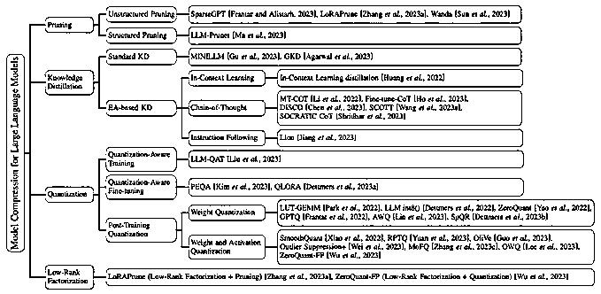

Model Compression for LLMs

Nice short survey on the recent model compression techniques for LLMs.

A quick way to get a high-level overview of topics such as quantization, pruning, knowledge distillation, and more. It also provides an overview of benchmark strategies and evaluation metrics for measuring the effectiveness of compressed LLMs.

Great resources for both researchers and practitioners.

https://arxiv.org/abs/2308.07633

https://huggingface.co/spaces/fffiloni/Music-To-Zeroscope

Music 转成视频

https://huggingface.co/spaces/fffiloni/Image-to-Story

图片转故事

https://huggingface.co/spaces/mattthew/SDXL-artists-browser

能通过美国医师执业考试的 LLM，现在可以在 colab 里体验了。

DoctorGPT 的 Github：https://github.com/llSourcell/DoctorGPT

在线 colab：https://github.com/camenduru/DoctorGPT-colab

姜文变猩猩。

蚂蚁集团、香港科技大学、浙江大学发布的视频生成视频的 AI 模型，效果好，稳定不跳帧。

效果视频是基于 RTX A6000 48GB 生成的，不确定对显卡的最低要求是多少。

项目地址：https://qiuyu96.github.io/CoDeF/

Github：https://github.com/qiuyu96/CoDeF

字节的 AI 聊天，抖音登录就能用，地址：https://doubao.com

敏感词检测方面，准确度很到位。

让任何人都能微调（Fine Tune）LLM 的项目，带有完整且比较简单的 UI 界面，上传训练数据就能在线训练（按 GPU 类型和时长收费）

抱抱脸复制模板：https://huggingface.co/new-space?template=autotrain-projects/autotrain-advanced…

Github 开源地址：https://github.com/huggingface/autotrain-advanced

http://metaphor.systems 是专门为 LLM 设计的搜索引擎，LlamaIndex 新增了使用这个搜索引擎的能力，官方宣称效果比 Google/Bing 更好。

metaphor 原理：https://platform.metaphor.systems/blog/building-search-for-the-post-chatgpt-world…

LlamaIndex+metaphor 地址：https://llamahub.ai/l/tools-metaphor…

在线 colab：https://colab.research.google.com/drive/1PTnJTVmLAI-V8JJu8GsbUvbk8vs203kA?usp=sharing…

GIthub：https://github.com/emptycrown/llama-hub/blob/main/llama_hub/tools/notebooks/metaphor.ipynb

推荐日本的一款 AI 工具：http://fotographer.ai 轻松创建高质量的产品照片

只需三个简单的步骤，就可以轻松创建高质量的产品照片

MATLABER：上海 AI 实验室发布的文字生成 3D 模型。

项目地址：https://sheldontsui.github.io/projects/Matlaber…

论文：https://arxiv.org/abs/2308.09278

Github（代码暂未发布）：https://github.com/SheldonTsui/Matlaber

Meta 发布 SeamlessM4T AI 模型，可翻译和转录近百种语言

SeamlessM4T 支持近 100 种语言的自动语音识别、语音到文本翻译、语音到语音翻译、文本到文本翻译和文本到语音翻译的多任务支持。

他们的目标是建立一个通用语言翻译器，就像《银河系漫游指南》中的虚构的巴别鱼一样。

SeamlessM4T 支持：

•近 100 种语言的自动语音识别

•近 100 种输入和输出语言的语音到文本翻译

•语音到语音翻译，支持近 100 种输入语言和 35 种（+英语）输出语言

•近 100 种语言的文本到文本翻译

•文本到语音翻译，支持近 100 种输入语言和 35 种（+英语）输出语言

Meta 表示，它将以研究许可证的形式公开发布 SeamlessM4T，以便研究人员和开发人员在此基础上开展工作。此外，Meta 还发布了 SeamlessAlign 的元数据，这是迄今为止最大的开放式多模态翻译数据集之一，共挖掘了 27 万小时的语音和文本对齐。

该模型采用了多任务 UnitY 模型架构，能够直接生成翻译后的文本和语音。

SeamlessM4T 模型的开发是为了实现一个通用的语言翻译器，能够覆盖世界上的大部分语言。

详细：https://ai.meta.com/blog/seamless-m4t/…

在线演示：https://seamless.metademolab.com

Hugging Face 演示：https://huggingface.co/spaces/facebook/seamless_m4t

ElevenLabs 推出一款新的多语言语音生成模型：Eleven Multilingual v2

能够准确地生成 28 种语言中的“情感丰富”的 AI 音频，包括中文！

无论使用合成声音还是克隆声音，说话者的独特声音特征都会在所有语言中保持不变。这意味着同一种声音可以用于在 28 种不同的语言中呈现内容。

详细：https://elevenlabs.io/blog/multilingualv2/

As

@OpenAI

announced last month, GPT3.5 finetuning now available! https://openai.com/blog/gpt-3-5-turbo-fine-tuning-and-api-updates… (we discuss this in today's

@latentspacepod

with

@amanrsanger

)

the API is exactly what you'd expect - demonstrate the style of answer you'd like, and it remembers it. It's VERY data efficient - 10 examples required, 50-100 recommended.

But the cost has always been the dealbreaker - the tuning is cheap but the post tuning models incur 6-8x markup on regular GPT3.5 if i get my numbers right

Key question: will people invest significant effort finetuning models if they cost a lot more than just doing better prompting or chaining? and will all that work get destroyed when the model gets deprecated?

StoryGames AI ：可以在几分钟内创建一个交互式和引人入胜的视觉小说游戏

只需输入关于主角、故事走向相关描述，它就能在几分钟内生成一个完整的十章视觉小说游戏，包含引人入胜的故事情节、互动选择和精美的视觉效果。

首先在 http://storygames.buildbox.com 上输入故事提示，它会生成一个 Project file。

发现全新的 http://Artefacts.ai！

使用我们更新的 A³ 图像转 3D 模型工具，将你的图像转化为 3D 模型，只需不到 10 分钟。

前往 https://artefacts.ai，亲自试试吧！

ElevenLabs 今天推出了一个全新的多语言语音生成模型 - Eleven Multilingual v2

https://elevenlabs.io/speech-synthesis…

它能够准确地在近 30 种语言中产生“情感丰富”的人工智能音频。【中文也可以生成了】自动识别近 30 种书面语言，并以前所未有的真实度生成这些语音。

目前支持的语言列表：中文、韩文、荷兰文、土耳其文、瑞典文、印度尼西亚文、菲律宾文、日文、乌克兰文、希腊文、捷克文、芬兰文、罗马尼亚文、丹麦文、保加利亚文、马来文、斯洛伐克文、克罗地亚文、经典阿拉伯文和泰米尔文。

加入了之前已提供的语言，包括英文、波兰文、德文、西班牙文、法文、意大利文、印地文和葡萄牙文。

—————————

对于【独立游戏开发者和发行商】来说，多语言语音生成工具为他们提供了将游戏体验和音频内容翻译成国际受众所需语言的新机会，与玩家和听众用他们自己的语言联系在一起，而不会影响口语音频的质量或准确性。

同样，【教育机构】现在可以立即为学习者提供目标语言的准确音频内容，增强语言理解。

—————————

经过测试后，我发现有两个点值得一提。

第一个是问题，模型产出的中文发音还不够准确。例如，会把"引人入胜"读得不太准确，听起来像川普。另外，翘舌的感觉太重。

在音调上也存在问题。如果音频文件本身比较平淡，那么我转录出来的语音也可能会显得平淡无奇。但是，可以通过调整参数来模拟出更加生动的语调。然而，我觉得这方面还有待改进。

第二个是速度，依旧是能够快速地复制声音，无需等待太久。即使你上传了七八个文件，总时长可能达到几十分钟，也能在十秒钟内完成声音复制。而且和我只上传 1 分钟内录音在音色上没有太大区别。

之前的英语克隆测试：https://m.okjike.com/originalPosts/63e12103ec78a2f368b23a2f?s=ewoidSI6ICI2MjA2M2EyZWVlODFiYjAwMTAyNmIwZWMiCn0=

日本东京一家火车站推出 AI 实时“翻译墙”，这个特殊的屏幕可以实时将售票员和游客之间的对话翻译成多种语言，并展示在屏幕上！

该屏幕支持实时翻译多种语言！

新闻报道：https://skynews.com.au/world-news/global-affairs/ai-translation-tools-helps-tourist-in-tokyo/video/9c3503cf2825b7a03fcd7a6ead627850…

KeenTools Blender Pack 2023.2.1\. is out!

Native Metal support for MacOS in FaceBuilder and GeoTracker, new shader system, and other fixes and improvements for our Blender add-ons.

Download: https://link.keentools.io/2023-2-1-tw #b3d

Introducing SeamlessM4T, the first all-in-one, multilingual multimodal translation model.

This single model can perform tasks across speech-to-text, speech-to-speech, text-to-text translation & speech recognition for up to 100 languages depending on the task.

Details ⬇️

https://twitter.com/MetaAI/status/1694020437532151820

https://twitter.com/LinusEkenstam/status/1694121273964589368

Simulon：一款新的 iOS 应用程序，可以轻松制作看起来非常逼真的 VFX 视频。

创始人

@diveshnaidoo

称该方法无需摄像机解决方案，没有 HDRI 捕获，也不需要手动合成设置。

拍摄过程可实时预览，自动曝光匹配！

这将改变电影制作、视觉特效和虚拟制作的游戏规则！

目前还在内测阶段！

CoDeF might be the most impressive video-editing model since Gen-2.

It reached 2000 stars on Github in 24 hours.

The open-source model allows you to do:

▸ Realistic video style editing

▸ Point/segmentation-based tracking

▸ Video super-resolution

https://qiuyu96.github.io/CoDeF/

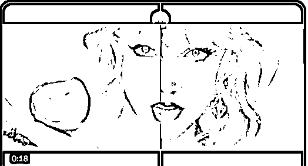

Stable Diffusion API 的 Python、Javascript 和 Golang sdk，降低接入成本

可以快速生成高质量图片的 API ，有 10000+模型

Python SDK: https://github.com/omniinfer/python-sdk

Golang-SDK: https://github.com/omniinfer/golang-sdk

Javascript-SDK: https://github.com/omniinfer/javascript-sdk

Metaphor：一种基于大语言模型的搜索引擎

允许用户使用完整的句子和自然语言搜索，还可以模拟人们在互联网上分享和谈论链接的方式进行查询内容。

Metaphor 同时还能与 LLMs 结合使用，允许 LLMs 连接互联网，查询自己知识库外部的内容。

测试了下，只支持英文，效果还行，类似和 ChatGPT 聊天的感觉，但是输出结果是一下输出很多内容，感觉还是很方便的！

工作原理：

Metaphor 的 AI 模型经过训练，可以进行链接预测。这意味着给定一些文本提示，它会尝试预测最有可能跟随该提示的链接。

这种方法模拟了人们在互联网上谈论链接的方式，作为衡量链接内容和质量的指标。

例如，用户可以使用提示：“除了 Terry Tao 的博客，这是我最喜欢的数学博客：”。而不是搜索“最好的数学博客”。

使用提示：“这个人会是关于摩托车的好人选（个人网站在这里：”模拟了人们在分享链接时的自然说话方式。

体验：http://metaphor.systems

介绍：https://platform.metaphor.systems/blog/building-search-for-the-post-chatgpt-world…

指南：https://metaphor.systems/promptingGuide

GIthub：https://github.com/emptycrown/llama-hub/blob/main/llama_hub/tools/notebooks/metaphor.ipynb…

Metaphor Tool：https://llamahub.ai/l/tools-metaphor…

主要功能：

1\. 使用特定的描述词或“氛围”进行搜索：

•用户可以使用具体的词汇或表达来描述他们想要找到的内容的感觉或氛围。

•例如，如果用户想要找到一些轻松、浪漫的音乐，他们可以使用“轻松的爵士乐”或“浪漫的晚餐音乐”等描述词进行搜索。

•这种方法允许用户更精确地表达他们的意图，并找到与他们的情感和氛围更匹配的结果。

2\. 只搜索他们想要的实体类型：

•用户可以指定他们想要的搜索结果的具体类型或类别。

•例如，如果用户只对学术文章感兴趣，他们可以指定只搜索学术文章，而不是博客帖子、新闻报道或其他类型的内容。

•这可以帮助用户更快地找到他们想要的特定类型的内容，并过滤掉不相关的结果。

3\. 找到传统搜索引擎未能展示的内容：

•Metaphor 可以找到可能因关键字不合适或其他原因而未被传统搜索引擎很好地展示的内容。

4\. 通过链接本身搜索：

•用户可以通过提供一个链接来找到与之最相似的其他链接。

•这可以帮助用户找到与特定主题或内容相关的更多资源。

5\. 与大型语言模型（LLMs）的集成：

•Metaphor 可以与 LLMs 结合使用，允许 LLMs 查询外部世界并消费互联网上的内容。

•这有助于克服 LLMs 的局限性，如产生错误信息、知识陈旧等。

6\. Metaphor API：

•Metaphor 提供了一个 API，允许开发人员将其搜索功能集成到自己的应用程序或服务中。

•API 还提供了干净、解析的 HTML 内容，无需进行网络抓取。

•对于个人开发者，Metaphor API 每月提供 1000 次免费请求。

IDEFICS：可能是目前为止最先进的多模态模型，基于谷歌的 Flamingo 多模态模型研发，80B 参数。

在线体验：https://huggingface.co/spaces/HuggingFaceM4/idefics_playground

详细介绍：https://huggingface.co/blog/idefics

模型细节及训练过程：https://huggingface.co/HuggingFaceM4/idefics-80b-instruct

基于大语言模型（LLM）的 AI Agent 利用 LLM 进行记忆检索、决策推理和行动顺序选择等，把 Agent 的智能程度提升到了新的高度。LLM 驱动的 Agent 具体是怎么做的呢？接下来的系列分享会介绍 AI Agent 当前最新的技术进展。

视频版：https://youtu.be/3fg3As-Y2M0

文字版：https://breezedeus.com/article/ai-agent-part1

https://github.com/opencopilotdev/opencopilot…

OpenCopilot – 构建并嵌入开源 AI 副驾驶员到你的产品中

OpenCopilot 是一个开源框架，允许开发者构建并嵌入 AI 副驾驶员到他们的产品中。

它简化了创建 AI 副驾驶员的过程，并支持各种用例。

该项目目前使用 OpenAI API，但计划在未来发布开源 LLM。

关于 AI 技术的安全风险和限制进行了讨论。

一些用户表达了对可以在本地训练的开源模型的兴趣。

该项目收到了积极的反馈和对未来改进的建议。

还有关于 OpenCopilot 与另一个类似项目之间关系的讨论。

OpenCopilot 团队分享了他们的背景和之前的项目。

有关 RAG 的可用性和具体使用的 LLM 的问题被提出。

#MapChart 是一个功能强大的在线地图制作工具，它支持制作各种类型的地图，包括地区地图、国家地图等。

无论你需要制作一张空白的世界地图，或是特定区域（如亚洲、美洲、欧洲等）的地图，它都能满足你的需求，让你轻松地填满不同颜色的色块。

用来做一些区域性的数据分析， 和国家、地区分布演示非常方便，好用推荐；

直达传送门：https://mapchart.net/index.html

演示视频我放评论区

1.Follow me

@MooenyChu

for more

2\. Like + Retweet the tweet below to share

https://app.qrcode-ai.com/

艺术二维码生成

据报道，Meta 准备推出自己的代码生成人工智能模型，名为 Code LLaMa，作为 OpenAI、谷歌和其他公司专有软件的开源替代品。据称，新模型可与 OpenAI 的 Codex 模型相媲美，并建立在 Meta 最近发布的 LLaMa 2 之上，LLaMa 2 是一种能够理解和生成会话文本的大型语言模型。

https://the-decoder.com/metas-open-source-code-llama-set-to-rival-openais-codex/

非常高兴我添加了一种疯狂简单的方法，可以使用#PHP

中的#LLPhant ) 使

@OpenAI

调用代码库中的任何函数

这是#GPT4 中我最喜欢的功能之一，因为它带来了巨大的可能性。

如果您不知道，OpenAI 已经改进了其模型来确定是否应该调用某个函数。要利用此功能，只需将功能的描述发送给 OpenAI，无论是作为单个提示还是在更广泛的对话中。作为响应，如果模型认为应该调用该函数，则该模型将提供函数名称以及参数值。

一种潜在的应用是检查用户在支持交互期间是否有其他查询。更令人印象深刻的是，它可以根据用户查询自动执行操作，例如发送电子邮件或执行更复杂的任务。

LLPhant 带来的价值是：

- 在一行中自动定义您的函数

- 当 OpenAI 在响应中这样说时执行该函数

您可以使用文档中提供的 6 行代码自行测试。

函数调用是创建更高级的人工智能代理的基础。

您可以在 doc:中查看这一点 github.com/theodo-group/llphant

https://twitter.com/maxthoon/status/1694337788999561486

## 8 月 7 日～13 日

AI 图片生成：https://ai.feilianyun.cn/ 飞链云版图

一字一画，云绘心中所想

微信小程序：飞链云版图

在线文字转语音的工具

TTSMaker

提供语音合成服务，支持多种语言以及各种风格，可以用它朗读文本或者合成视频声音。

免费用于商业场景，弄好后直接下载文件，普通用户每周限制 20000 个字符使用，基本够用。

https://ttsmaker.com/zh-cn

AI 一键生成 Excel 公式：HellAI

把你需要的描述出来就能生成

👉https://box123.io/sites/2148.html

这里有 10 个免费的 AI 动画工具,可以让图片和照片转换为动画。效果见视频，AI 生产力工具好用推荐！

#图片转视频工具合集 #midjourney

制作方法：上传一张（或多张）图片即可

第一个.LeiaPix

convert.leiapix.com

第二个：CapCut

www.capcut.com

第三个：Pika Labs

pika.art

第四个：InstaVerse

ilumineai.github.io/instaverse/

第五个：Animated Drawings

sketch.metademolab.com

第六个：GenMo

genmo.ai

第七个：D-ID

d-id.com

第八个：HeyGen

heygen.com

第九个：Kaiber

kaiber.ai

第十个：RunwayML

https://runwayml.com

作者还没传完

OpenAI 刚刚推出了 GPTBot，这是一个自动从整个互联网抓取数据的网络爬虫。

这些数据将被用来训练像 GPT-4 和 GPT-5 这样的未来 AI 模型！

GPTBot 会确保不包括违反隐私的来源和那些需要付费的内容。

GPTBot 是 OpenAI 开发的一个网络爬虫，它用于在网络上收集信息，帮助改进 AI 模型。如果你是网站所有者，你可以选择是否允许它访问你的网站或某些部分。同时，OpenAI 确保了在使用 GPTBot 时，不会访问或使用任何敏感或付费内容。简单说，它就是一个用来学习和改进的小助手，但网站所有者可以自由选择是否和它互动。

以下 AI 可以改变你的工作方式

将文本转化为幻灯片

http://prezo.ai

将文本转化为网站

http://10web.io

将文本转化为视频

http://Deepbrain.io/aistudios

将文本转化为音频

http://VoiceMaker.in

将文本转化为设计

http://Stockimg.ai

将文字转换为代码

http://Chat2code.dev

http://Kaiber.ai 宣布结束内测，开放注册了，现在可以直接体验了！

Kaiber AI 是一种 AI 生成引擎，它可以帮助你生成各种艺术风格的美学动画。它提供了以下几种功能：

1.音频反应性：用户可以上传一首歌曲，添加一点自己的艺术风格，然后让 Kaiber 将为你生成跟随音乐节拍的动画。

推荐

日本的一款 AI 工具，轻松创建高质量的产品照片

只需三个简单的步骤，就可以轻松创建高质量的产品照片

https://fotographer.ai

AudioLDM 2：文字生成音乐和语音

论文是今年 2 月发布的，这几天放出了代码。

Github：https://github.com/haoheliu/AudioLDM2

在线体验：https://huggingface.co/spaces/haoheliu/audioldm2-text2audio-text2music

支持流式传输 LLM 生成的文字，并在 1 秒内实时生成音频。

Github：https://github.com/elevenlabs/elevenlabs-python

按访问量看 AI 网站 https://www.toolify.ai/zh/?month_visited_count_start=1000001

Google 又放大招了，Project IDX：一个基于 AI 的浏览器开发环境（集成 AI，支持全栈编程语言，跨平台真机预览，一键部署）。

申请链接：https://idx.dev

了解更多：https://mp.weixin.qq.com/s/uzbxt2HkNz4zvw151Gx6_A

https://chat.baichuan-ai.com/home#introduce

百川申请界面

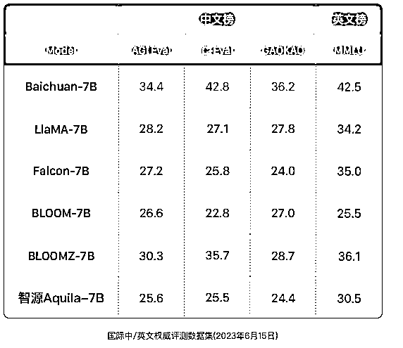

著名的《斯坦福 AI 小镇》正式开源！

这是 2023 年最鼓舞人心的人工智能代理实验之一。

25 个人工智能代理居住在数字西部世界中，却没有意识到自己生活在模拟中。他们去工作、闲聊、组织社交活动、结交新朋友，甚至坠入爱河。每个人都有独特的个性和背景故事。

GitHub： https://github.com/joonspk-research/generative_agents

英伟达提供了一个 AI PlayGround ，免费使用，速度很快。支持 4 种 AI 工具：

NeVA：具备视觉的 LLM，能根据图片聊天。

SD XL：免费使用 SD XL 进行绘画，默认种子是 1，手动改成-1。

CLIP：图片识别和物体检测。

LLaMa 2：在线使用 LLaMa 2 聊天。

地址：https://catalog.ngc.nvidia.com

昨天 Google 发布了 http://idx.dev，一款支持全栈框架、多平台应用程序的云端集成开发工具，并且内置了由 PaLM 2 驱动的 Codey，帮你实现代码转换、修改和撰写！很明显这是对标 VS Code + Github Copilot，在智能时代能否挑战它们的统治地位，让我们试目以待

#Claude 推出最新版 Claude Instant 1.2 版模型，可以直接通过 API 获得使用…

Claude Instant1.2 速度更快、价格更低，功能也足够强大，它可以处理一系列任务，包括对话、分析、摘要和文档理解。

Claude Instant 1.2 结合了 #Claude2 在实际用例中的优势，并在数学、编码和推理等关键领域显示出明显的进步。

它会生成更长、更结构化的响应，并更好地遵循格式说明。https://docs.anthropic.com/claude/reference/selecting-a-model

Introducing the newest WizardLM-70B V1.0 model !

1\. WizardLM-70B V1.0 achieves a substantial and comprehensive improvement on coding, mathematical reasoning and open-domain conversation capacities.

2\. This model is license friendly, and follows the same license with Meta Llama-2.

3\. Next version is in training and will be public together with our new paper soon.

For more details, please refer to:

Model weight: https://huggingface.co/WizardLM/WizardLM-70B-V1.0…

Demo and Github: https://github.com/nlpxucan/WizardLM…

Discord: https://discord.gg/VZjjHtWrKs

https://github.com/jamesmurdza/awesome-ai-devtools

AudioSep ：可以使用简单的自然语言指令从混合音频中分离出特定的声音。

而且不需要事先训练声音样本，无论是音乐、人声还是其他声音，它可以根据你的描述，即使是第一次遇到这种声音，AudioSep 也能识别和准确分离它。

样本演示：https://audio-agi.github.io/Separate-Anything-You-Describe/…

论文：https://arxiv.org/abs/2308.05037

GitHub：https://github.com/Audio-AGI/AudioSep…（即将更新）

论文概要：

1.模型结构：AudioSep 使用了 30 层的 ResUNet 结构，包括 6 个编码器和 6 个解码器块，具有特定的输出特征图数量和内核大小。

2.训练数据和方法：AudioSep 通过随机采样和混合音频片段进行训练，并使用了混合监督方法。训练涉及多个数据集，如 AudioSet、VGGSound 等。

3.零射击性能：AudioSep 具有强大的零射击分离性能，即使在未见过的数据集上也能实现声音分离。

4.与基线系统的比较：与现有的声音分离模型相比，AudioSep 在分离性能和泛化能力方面表现更优。

5.潜在应用：AudioSep 的概念和技术可以广泛应用于音乐制作、语音增强、噪声消除等音频处理任务。

如何使用 Stable Diffusion 实现文字生成视频：https://stable-diffusion-art.com/text-to-video

stable-diffusion-art 出的一套教程，分别讲解了 AnimateDiff、ModelScope、Deforum 的安装流程和用法。

Runway 更新：GEN-2 可以生成 18 秒视频（之前是 4 秒）

音频识别用 Whisper 就可以，但是如果还想识别 Speaker（发言人），那么就要借助其他模型配合，好在有一个开源工具叫 WhisperX，可以将 Whisper 和 Speaker 识别结合起来直接使用。

https://github.com/m-bain/whisperX

上半年极客时间推出了 2 期 AIGC 行动营，下半年根据大家的反馈，正在策划另外三个行动营。 为了更好地为你提供学习服务，我们计划先后推出，现诚邀你为自己最想看的课程投票，先学什么你来定！📍投票地址：https://jinshuju.net/f/iq0sH6

一个有意思的模型

Music-To-Image：通过使用深度学习技术，能够从音乐中提取特征，并将这些特征转换为图像。

工作原理：

1.音频字幕生成：首先，音频被发送到 “LP-Music-Caps” 模型，该模型生成音频的字幕。这些字幕可以描述音频的内容、情感和主题。

2.图像描述生成：然后，这些字幕通过 “Llama2” 被翻译成插图图像描述。这个描述可以是对音频内容的视觉解释，为下一步的图像生成提供指导。

3.图像生成：最后，这个图像描述通过 “Stable Diffusion XL” 生成与音频相应的图像。这个图像可以是音频的抽象或具体的视觉表示。

作者

@fffiloni

项目演示：https://huggingface.co/spaces/fffiloni/Music-To-Image

https://github.com/m-bain/whisperX

语音识别，角色识别

宝玉

## 8 月 1 日～4 日

一首歌 转成视频

https://twitter.com/notiansans/status/1685738546219663360

还没公开具体

https://food-discovery.qdrant.tech/#/

Qdrant 向量库图像检索的一个 demo

https://blog.jetbrains.com/idea/2023/06/ai-assistant-in-jetbrains-ides/

jetbrain 开始支持 AI 辅助

Pixellab.ai 这个 AI 生成像素画的看着不错，让草图、线稿都可以轻松变成像素插画。很多功能都是为像素游戏量身定制的。

https://pixellab.ai

We introduce UniControl, a new generative foundation model that unifies language prompts for context control and 9 many-shot + 3 zero-shot conditions for pixel-level structure control.

Web: https://shorturl.at/lmMX6

ArXiv: https://arxiv.org/abs/2305.11147

Code: https://github.com/salesforce/UniControl

Anthropic 最近发布了 Claude API 的最新版本，其中包括了 Python 和 TypeScript SDK 的更新。新功能提高了性能，使解析代码变得更容易，并增加了 SDK 之间的兼容性

GitHub Copilot 辅助编程的开源替代品：

https://github.com/continuedev/continue

AI 助手，以 AI 驱动，满足您的所有医疗需求。

它利用 AI 根据您的过去健康状况和其他重要健康信息，为您提供健康建议。

🔗 http://docus.ai

将 ChatGPT 转变为您强大的 AI 助手。

ChatGPT 的最佳扩展，可为任何用例生成精确内容，如：

🔗 http://alicent.ai

AI 建立您的网站。

您只需几秒钟，就可以利用 AI 创建一个完整的网站，包括图像、图形和引人入胜的文案。

🔗 https://bit.ly/3ruVRe2

立即将任何流程转化为逐步指南。

这个简单的 AI 工具用于在几分钟内创建逐步指南、教程、SOP 和演示。

🔗 http://getscribe.how/chrome

ChatGPT 和 Bard 有其局限性，但这些 AI 工具值得探索：

1.一键 AI Photoshop： http://imgcreator.ai

2\. 人工智能建站工具： http://Durable.co

3\. AI 会议总结器： http://Tldv.io

4\. 最佳研究工具： http://Paperpal.com

5\. AI 编码助手： http://Dora.run/ai

6\. 日历： http://mayday.am

7\. 演讲： http://Sendsteps.com

8\. 内容创作： http://Stockimg.ai

9\. 音频工具： http://Speechify.com

10\. 音乐：maroofy.com

SargeZT 发布了第一批支持 SDXL 的 ControlNet 模型，包括 Depth Vidit、Depth Faid Vidit、Depth、Zeed、Seg、Segmentation、Scribble。

但从他的示例图片来看效果不是很理想，可以下下来玩玩，但是跟现在的质量比还是差一些。

链接：https://huggingface.co/SargeZT

http://r.ftqq.com/one-person-businesses-methodology-v2/

方糖做的 ，人工智能生成的，用脑图生成，图片是 SDXL

方糖 2A1B 实验 @easychen

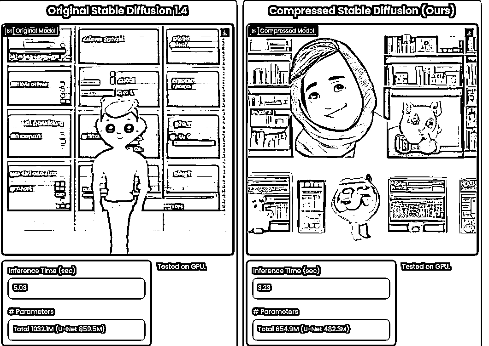

Lightweight Text-to-Image Generation Demo

https://huggingface.co/spaces/nota-ai/compressed-stable-diffusion

压缩的 stable diffusion，目测生成时间少一半效果没有打折

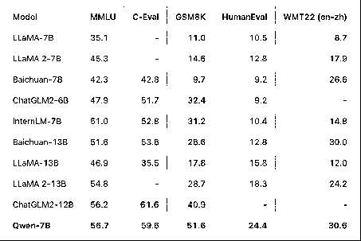

通义千问

https://modelscope.cn/models/qwen/Qwen-7B-Chat/summary

https://github.com/QwenLM/Qwen-7B

声音克隆

音转换系统

将目标演讲者的声音风格转换到源演讲者上

https://hiervst.github.io

I'd like to share with you a project I've been working on for some time now, and which is very close to my heart.

I hope you'll enjoy watching it as much as I enjoyed creating it!

Thank you very much!

Images: Midjourney

Video: Runway

Music: Pavel Epic Trailer

Edit: Capcut

https://twitter.com/i/status/1687127183045574656

合成 ufo 视频

https://auto-seo.ai/

自动 seo

https://skillai.io/

辅助生成学习路线

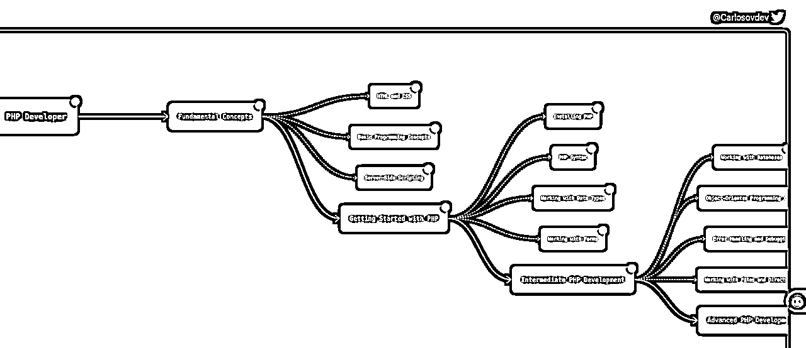

ControlNet Canny for SDXL 1.0 is out!

https://huggingface.co/diffusers/controlnet-canny-sdxl-1.0?ref=aiartweekly

Microsoft presented Azure ChatGPT.

The code is open-sourced under MIT Licence.

Benefits:

Awesome 生成式 AI 工具 Github 列表

https://github.com/steven2358/awesome-generative-ai

分门别类整理了很多 AI 工具，点击链接直达网站。

不少工具以前竟没体验过，对个人来说，还是有些信息熵。

Llama-2-Onnx

github: https://github.com/microsoft/Llama-2-Onnx

an optimized version of the Llama 2 model

Thanks for your attention of WizardMath!

We share you two online demos of WizardMath 7B V1.0 model.

7B D-1: http://777957f.r10.cpolar.top

7B D-2: http://2be2671b.r10.cpolar.top

🚫For the simple math questions, we do NOT recommend to use the CoT prompt.

We will update more demos of 70B and 13B tomorrow and please refer to (https://github.com/nlpxucan/WizardLM/tree/main/WizardMath) for the latest URLs.

We welcome everyone to use your professional and difficult instructions to evaluate WizardMath, and show us examples of poor performance and your suggestions with our Discord (https://discord.gg/VZjjHtWrKs) or Twitter comments.

Note: Please use the same systems prompts with us, and we do not guarantee the accuracy of the quantified version.

作者写了他在微调 LLaMa 2 时的经验和结果，非结构化文本和写 SQL 方面，微调后的结果好于 GPT-4，但数学方面微调后也比不上 GPT-4（GPT-4 真的强）

文章地址：https://www.anyscale.com/blog/fine-tuning-llama-2-a-comprehensive-case-study-for-tailoring-models-to-unique-applications

开源版妙鸭相机

阿里达摩院旗下的魔搭社区推出了酷蛙 FaceChain，还原了妙鸭相机的流程，开源。

实现流程：用户上传 3 张照片，AI 训练脸部 LoRA，然后输出写真照片。

魔搭官方文章：https://mp.weixin.qq.com/s/4oTjOEW_C4dMfylUXq-39A

Github：https://github.com/modelscope/facechain

魔搭在线运行：https://modelscope.cn/studios/CVstudio/cv_human_portrait/summary

BeeBee AI 是一个用对话来看美股财报的网站。相当于财报版的 ChatPDF。

财报冗长，直接通过 GPT 来抽取关键信息，写成回答。

网站汇集了美国主流大公司的财报，省去了自己搜索和导入的繁琐流程。

本来想和他们聊一聊他们的后续计划，但是 7 月太忙没顾上。

有需要记得收藏：

https://beebee.ai

主播宝：国产虚拟人视频生成软件

名字有点土，效果非常好，足以以假乱真，堪比 Heygen。

详见 B 站主播演示：https://www.bilibili.com/video/BV1vm4y1x7nm/

Fooocus：简洁版 Stable Diffusion

结合了 SD 和 Midjourney 各自的优点，界面更简洁，更多点选而非输入功能。

Github：https://github.com/lllyasviel/Fooocus

Colab 在线运行：https://github.com/camenduru/Fooocus-colab

DoctorGPT：您随时的私人医生！

DoctorGPT：不仅是一个 AI 模型，它集成了医学专家的知识，使其能够准确地回答各种医学问题。

亮点特性：

技术细节：

该模型是在 Meta 的 Llama2 基础上进行微调的，拥有高达 70 亿个参数，并经过专业医学对话的训练和优化。

开始使用：

立即访问 [GitHub 链接](http://github.com/llSourcell/DoctorGPT) 下载并体验！

让 DoctorGPT 成为您的私人医生，随时随地为您提供医学咨询。

## 7 月 24 日~27 日

FABRIC plugin for SD WebUI is now available in alpha for testing. Check it out and let us know what you think!

https://github.com/dvruette/sd-webui-fabric…

Also make sure to share your creations! We're excited to see what you talented folks out there can create with it

推荐阅读《向量数据库》，这篇文章很长，但是很详细，无论是入门还是进阶，都有知识点可以学习到。

主要介绍了向量数据库的原理和实现，包括向量数据库的基本概念、相似性搜索算法、相似性测量算法、过滤算法和向量数据库的选型等等。

https://guangzhengli.com/blog/zh/vector-database/…

宝玉

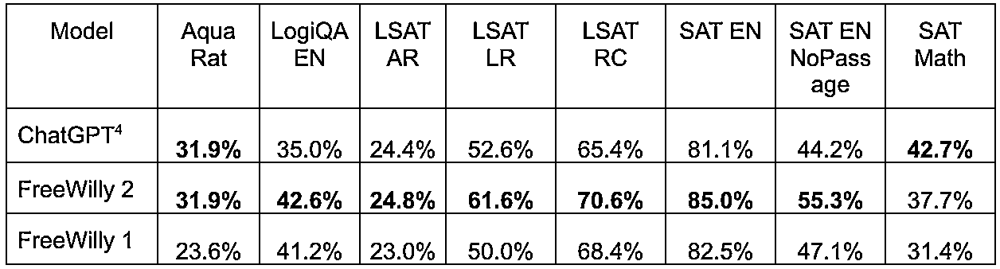

Stability AI 刚刚基于 #Llama2 + #Orca 递进式学习 推出了两个开源的模型

Freewilly 1：在 Llama65B 模型上进行了微调

Freewilly 2：在 Llama-v2 70B 模型上进行了微调

尽管它们相对较小，但在多个基准测试任务中超过了 ChatGPT，尤其是推理方面！

非常值得关注

https://twitter.com/StabilityAI/status/1682474968393609216

My fun weekend hack: llama2.c

https://github.com/karpathy/llama2.c…

Lets you train a baby Llama 2 model in PyTorch, then inference it with one 500-line file with no dependencies, in pure C. My pretrained model (on TinyStories) samples stories in fp32 at 18 tok/s on my MacBook Air M1 CPU.

Now you can make entire 3D worlds in a matter of minutes with these AI tools!! Watch this quick tutorial using

@BlockadeLabs

@UnrealEngine

@KaiberAI

Credit: Sir.Unreal via Youtube

FABRIC：将人类反馈融入到图像生成过程中

当我们使用 StableDiffusion 生成图像时，这个过程通常是自动进行的，模型并不知道生成的图像是否符合人类期望。

FABRIC 改变了这一点。它允许人类在每一步迭代中提供反馈，告诉模型哪些部分做得好，哪些需要改进。模型会根据这些反馈来调整下一步的生成过程。

哇，好期待！将机器人和 GPT 整合，相当于让机器人有了大脑！

VIMA 是一款连接了机器人臂的语言模型（LLM）🦾。它可以接收多模态的指令：文字、图片、视频，或者任何组合。

你可以告诉它"把桌子布置成的样子"，或者"模仿这个的动作"。

你甚至可以在上下文中教给它新的视觉概念："这是一个 wug ，这是一个 blicket 。现在把红色的 wug 放在绿色的 blicket 上。"

https://twitter.com/DrJimFan/status/1683517085731913729

ShortGPT：一个强大的自动化视频制作工具，自动采集素材、编辑视频、配音、生成字幕，一气呵成

它会根据你的脚本自动从网上采集素材。还会自动合成语音，将脚本转化为口头表达。最后会将这些素材和语音合成一个完整视频。

同时你输入任意 Youtube 链接或上传 mp4 文件， 它不仅会翻译内容 还会自动配音！

整个工具还是比较粗糙的，但是思路很不错，可以借鉴一下，优化空间还是很大的。

Run ShortGPT on Google Colab：https://colab.research.google.com/drive/1_2UKdpF6lqxCqWaAcZb3rwMVQqtbisdE?usp=sharing

作者：

@RayVenturaHQ

https://github.com/RayVentura/ShortGPT

今日开源库推荐， Continue

https://github.com/continuedev/continue

一款开源的 VSCode 插件，可以将 ChatGPT 和 VSCode 结合起来，提供更强大的功能。

有下列这些功能，看截图挺好用的样子：

* 回答编程的问题

“how can I communicate between these iframes？“

* 高亮部分代码要求 ChatGPT 进行重构。

“/edit rewrite this function to be async“

* 使用 ChatGPT 直接新建并且生成文件

“/edit here is a connector for postgres, now write one for kafka”

可以考虑用 AutoChain 替代 LangChain，相比后者，AutoChain 更为轻量，而且融合了 AutoGPT 的部分灵感，可以实现自动化操作过程，例如递归循环拆解任务然后执行任务。

项目地址：https://github.com/Forethought-Technologies/AutoChain…，它的理念是：Build lightweight, extensible, and testable LLM Agents，概念少了一大堆，玩起来愉快多了。

## 7 月 18 日～21 日

一篇文章讲清楚如何利用 Stable Diffusion 和 Control net 来生成二维码或者把文本藏在图片中，作者不仅教你如何运用，还给出了一大批有用的工具和资源

https://antfu.me/posts/ai-qrcode-101#extra-hidden-text-in-image

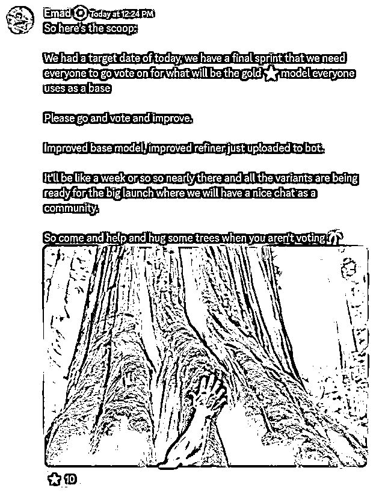

https://weibo.com/tv/show/1034:4918727745929237?from=old_pc_videoshow

m2 cpu 和内存在一起的设计优势

AI 可以创造出令人惊叹的图像

不过，Midjourney 的最低费用为每月 10 美元

以下是生成图像的最佳免费 AI 工具

1.Bing 图像创建者

→生成无限的免费图像

→仅使用 Microsoft 帐户

访问 http://bing.com/images/ 创建

→创建高质量的图像

→更改格式或样式的可能性

http://Firefly.Adobe.com/Generate/Images

→ 提供多个 AI 模型可供选择

→ 可以添加负面提示

🔗 http://leonardo.ai

→与 Bing 相同的技术

→用文本，形状编辑设计...

🔗 http://designer.microsoft.com

官方教程】ChatGLM 的 Prompt 工程实践，真实案例详解

https://www.bilibili.com/video/BV1ic411c7gE

另附昨天上传视频的 ppt 文件下载：

链接： https://pan.baidu.com/s/1T5vBCAPG2ahrI_H2jKnihw?pwd=mwmr 提取码： mwmr

苹果即将推出自己的大语言模型和 Apple GPT‼️

果然所有的巨头都要下场了⚠️

苹果股票在周三的一份报告中短暂上涨，该报告称该公司正在内部开发自己的大型语言模型 AI。据报道，苹果拥有一个名为 Ajax 的内部 AI 基础设施，一个小型工程师团队已经构建了一个被某些人称为“Apple GPT”的聊天机器人。在过去的一年中，技术人员和投资者一直对大型语言模型着迷，这是一种 AI 技术，可以产生看起来像人写的文本或代码。

这则新闻报道了苹果正在内部开发自己的大型语言模型，类似于 ChatGPT。他们已经建立了一个名为 Ajax 的内部 AI 基础设施，由一小组工程师运作，并已经创建了一个聊天机器人，被部分人称为“Apple GPT”。这个新闻使得苹果的股票价格短暂上涨。

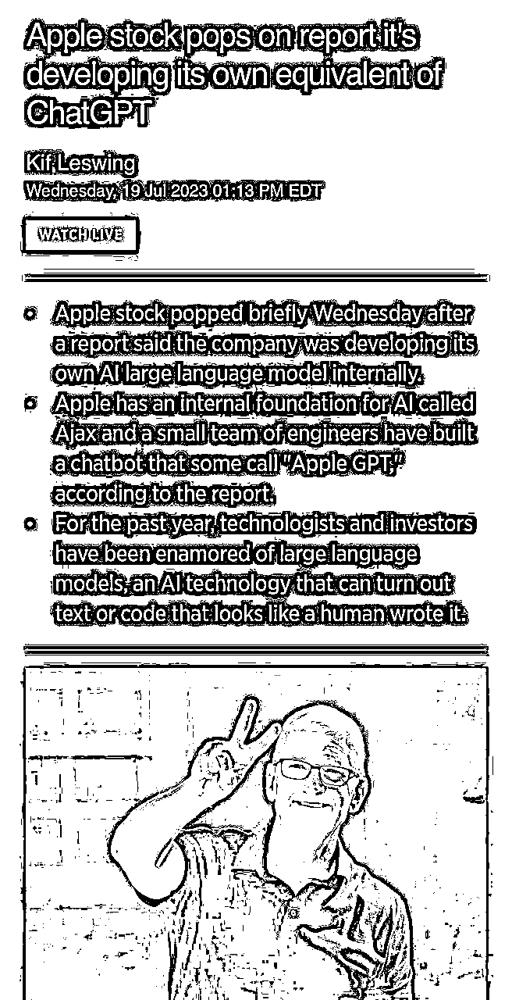

https://www.reddit.com/r/StableDiffusion/comments/1541xrf/another_anime_dancing_girl_aka_my_first_attempt/

https://www.reddit.com/r/StableDiffusion/comments/153wxza/concept_and_style_conversion_with_video/

平滑动画

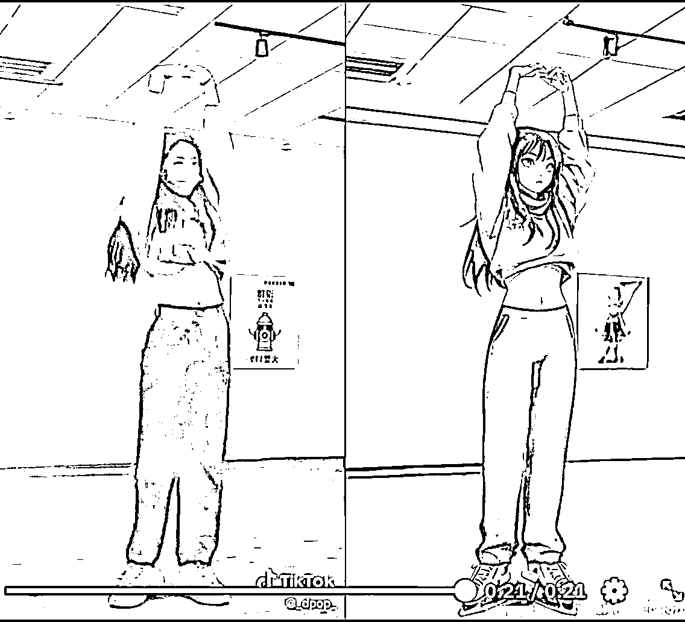

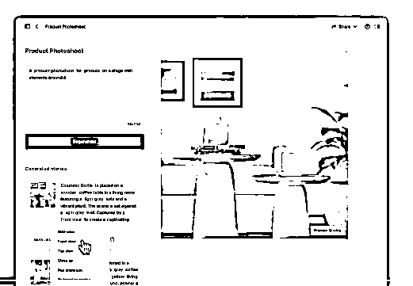

KartivAI： 将 #webgi 3D 渲染和 AI 结合，高效批量产出广告营销素材

你只需上传素材，如你的标志或产品图片，然后描述想要的创意，Kartiv 就会使用你的描述和素材来创建吸引人的视觉效果。

这些都是自动化的，实时的，并在浏览器内部运行。

KartivAI 还实现了多种图形效果，同时还能生成复杂的 3D 场景。

ChatGPT 又有新功能了，你可以设置里面的 Beta 功能里面启用 Custom instructions，然后在菜单就会多一个 Custom instructions 选项，你可以设置你自己的背景信息，以及期望的 ChatGPT 输出格式。这样就不需要一遍又一遍的重复你的背景和喜好了！https://openai.com/blog/custom-instructions-for-chatgpt

TokenFlow：视频生成视频

项目地址：https://diffusion-tokenflow.github.io

Github（代码还未发布）：https://github.com/omerbt/TokenFlow

效果还可以，但是感觉不如之前的 Render A Video：https://anonymous-31415926.github.io

Render A Video 支持 colab 运行：https://github.com/camenduru/Rerender-colab

VideoDoodles：由 Adobe 等研究人员开发的是一种编辑技术，可将动态涂鸦融入视频中。

这种技术可在视频中的对象上添加动态涂鸦。同时绘制的涂鸦能够跟随对象的移动，并以适当的透视和遮挡（对象被其他物体遮挡的现象）进行表达。

因此无需专业技能或大量时间，就能够创建出独特且令人印象深刻的视频。

Artbreeder Mixer ：将多个图像神奇地混合在一起

它允许用户通过将多个图像和文本利用 AI 混合在一起来创建新图像。

用户可以在这个平台上尝试将不同的图像和文本混合在一起，以生成新的、独特的图像。可以产生出人们无法预见的创新和独特的视觉效果。

神奇的想法！

http://artbreeder.com/create/mixer

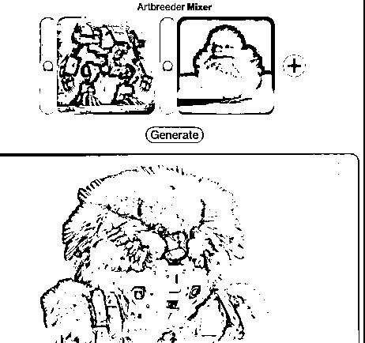

Magically blend together images with Mixer

a new tool from Artbreeder! 🪄🎉

Try it now with any image ⬇️

https://artbreeder.com/create/mixer

github.com/jmorganca/ollama

🎉 Ollama – 在你的 Mac 上运行 LLMs

HackerNews 发布了一篇文章介绍了 Ollama 项目，它允许用户在 macOS 上运行和打包大型语言模型（LLMs）。

它提供了基础层、特定配置和模型嵌入等功能。

Ollama 目前仍处于早期开发阶段，为用户提供了一系列开源模型供下载和使用。

评论中讨论了用户对 Ollama 的体验，包括设置的简易性、创建 AI 角色的潜力以及 LLMs 的限制和挑战。

一些用户还将 Ollama 与其他类似项目进行比较，并讨论了软件的技术方面。

文字生成歌曲的 AI 产品：Suno，未来的明星产品！

加入 Discord 频道：https://discord.gg/q3wB79XGmM

在 bot-sing-alpha 输入/sing 回车，会出现弹窗输入歌词，也可以选择弹窗下方的由 ChatGPT 生成歌词。

点击提交后系统会生成 2 段歌曲的视频，根据关键词画了配图，由你评估哪个效果更好。目前不支持中文，最大 30 秒。

🚨📜 宣布 FABRIC，一种无需训练的方法，通过迭代反馈来改进任何 Stable Diffusion 模型的结果。

不再需要花费数小时来寻找合适的提示，只需点击👍/👎，告诉模型你想要的具体内容。

🤗 演示链接：https://huggingface.co/spaces/dvruette/fabric

https://twitter.com/dvruette/status/1681942402582425600

Check out the website of Joon Moon https://joonmoon.net

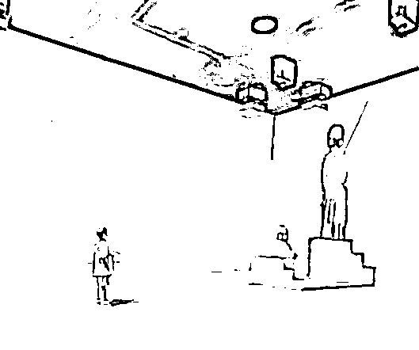

Story telling magic:

In this immersive room you and your AI-adjusted shadow become part of a story of shadows.

Whole space interacts with your movements and the light you carry.

A project by artist Joon Moon (🔗 in next tweet)

https://twitter.com/LinusEkenstam/status/1682152586688753666

浅试了下 Tome，一个 AI 生成 PPT 的工具，第一感觉是设计和排版很舒服，看了下官方其它的模版都很漂亮，会是想接着用下去的产品，最近准备深度体验下发一个评测

→ https://tome.app

We are excited to announce the first major release of the Chatbot Arena conversation dataset!

Blog: https://lmsys.org/blog/2023-07-20-dataset/

Download: https://huggingface.co/datasets/lmsys/chatbot_arena_conversations

https://huggingface.co/datasets/lmsys/mt_bench_human_judgments

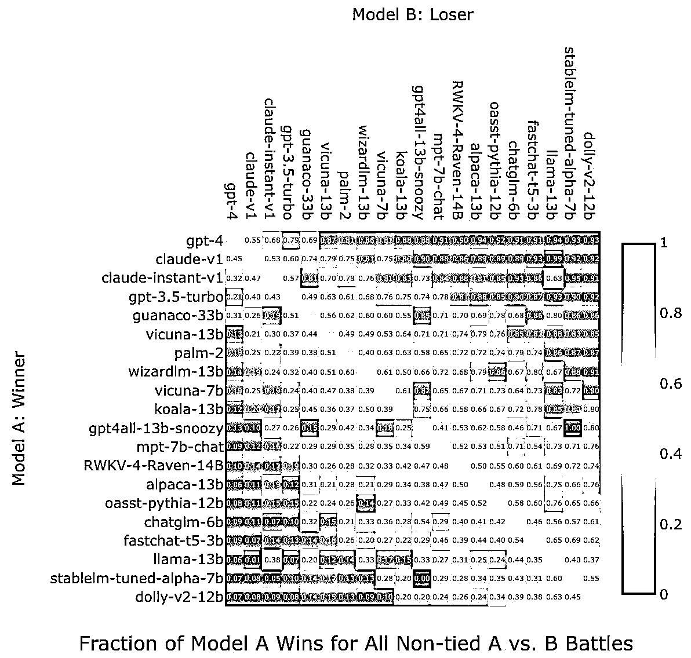

## 7 月 14 日/7 月 17 日

一个开源宝库：

https://github.com/mozilla/DeepSpeech…

正在做视频总结的小工具，视频转音频，没问题。但音频的语音识别，问题大了

1/ 切割无声，非人声，背景乐

2/ 若不割，如图中显示，1.48h 只被压成 1.2h， API 成本过高

3/ 只能选择开源的语音识别，就找到 DeepSpeech

没想，是基于百度论文设计的，牛逼了

@huangyun_122

Google Labs 推出一款名为 NotebookLM 的 AI 笔记本产品，这是一种全新的笔记工具。

这个产品旨在通过总结信息、解释复杂的想法和头脑风暴新的联系，帮助用户更快地获得洞见。使用人工智能技术来帮助用户处理和理解信息。

算了不折腾 #GPT4 了，直接用 #gptgod 吧，非常丝滑，还支持 claude-2-100k，还对齐了 #OpenAI 官方的 API，可以直接放进套壳 GPT 应用中使用。

你们可以直接用我的邀请链接注册：https://gptgod.site/#/register?invite_code=46rrqz6qzscsey1jci7sdjw95…

昨天这种将文字或者符号融合生成图片的效果很火，我这个教程会非常详细，主要内容包括：

- 相关内容的下载

- Stable Diffusion 的安装

- ControlNet 插件的安装和模型的使用

- 图片详细的生成过程和参数解释

这里是精简版的教程，如果你看这个不理解可以去看这个完整版：https://mp.weixin.qq.com/s/rvpU4XhToldoec_bABeXJw

## 7 月 12 日

Claude 2 在逻辑推理能力的多项测试与 GPT-4 不相上下。

GRE 综合得分 76.5（Claude） vs 75.7

HumanEval 编码：71.2%（Claude） vs 67%

GSM-8K 小学数学：88%（Claude） 与 92% 。

重要的是它支持 100K 上下文，而且价格比 GPT-4 便宜的非常多，还有它知道 22 年和 23 年发生的事情。

来看看 Code Interpreter 的 Prompt 是什么：

https://chat.openai.com/share/06de4ec3-8889-4e35-bcf5-f4519f9c77ed

宝玉

Anthropic 公司的 ChatGPT 竞争者 Claude-2 刚刚发布

它更便宜，性能更强，速度更快，可以处理 PDF 文件，并支持更长的对话。

亮点：

1。 Claude 比 GPT-4 便宜 5 倍。

2\. 它有更新的数据。这些数据是网站、第三方授权的数据集以及 2023 年初用户自愿提供的数据的混合。

3\. 它在 GRE 写作和 HumanEval 编程基准测试上表现优于 GPT4。

4\. 它的上下文窗口有 100,000 个令牌，是所有商业模型中最大的。

5\. 它可以分析大约 75,000 个单词，大约相当于“了不起的盖茨比"的长度。

6\. 它可以轻松处理任何与代码相关的任务。

GPTDAOCN

即刻出的 Prompt 调试工具，非常实用。

https://promptknit.com

1\. 支持 Chat 和 Text Completion 两种模式

如 Chat 模式，支持 Model 设置：gpt-3.5-turbo、gpt-3.5-turbo-0613、gpt-3.5-turbo-16k，Max Tokens 设置：50～4000，Temperature 设置：0～2、Top P：0.1～1，Frequency Penalty：-2～2

2。 支持 function calling、模版变量，历史版本结果对比。

3\. 支持 OpenAI、Anthropic 、Azure API 填写。

4\. 支持添加管理成员，协同 Prompt 调试。

基本上能想到的功能都有了，Prompt Engineering 工程师必备，推荐收藏。

向阳乔木

AI Companion App：创建和训练属于你的 AI 伴侣

它提供了一套框架和工具，你可以根据自己的需求和想象，设定 AI 伴侣的个性、背景故事和能力，然后使用这个框架进行训练和部署。

这样，每个人都可以拥有一个定制的 AI 伴侣，满足他们特定的需求和期望。

你可以在浏览器上或通过 SMS 与你的 AI 伴侣进行聊天。

Anthropic 公司发布 Claude 2，同时上线了基于该模型的对话服务 https://claude.ai/login：

- 英国和美国地区的用户可直接使用，无需绑定信用卡；

- 支持上传文档，最高可上传 50 MB 的文档；

- 对话上下文最高支持 100K Token；

处理速度依然非常快。

Thrilled to see Vicuna-33B top on the AlpacaEval leaderboard!

Nonetheless, it's crucial to recognize that open models are still lagging behind in some areas, such as math, coding, and extraction as per our latest MT-bench study [2, 3]. Plus, GPT-4 may occasionally misjudge, particularly without proper prompting.

Our study is an early attempt to explore a better LLM eval and we encourage the community to join this effort. It’s the key to ensure we’re making real progress.

[1] AlpacaEval https://tatsu-lab.github.io/alpaca_eval

[2] MT-bench blog post https://lmsys.org/blog/2023-06-22-leaderboard/…

[3] MT-bench paper https://arxiv.org/abs/2306.05685

再也不用担心 Open AI 封号了，Claude 2 发布免费使用了，能力直逼 GPT-4 ！

你可以直接上传文件让 Claude 帮你分析，最大支持 200K 上下文，使用也非常简单，只需打开官网，输入相关 Prompt 即可交谈

我刚刚使用了一下，效果确实不错，没有 ChatGPT 4 的小伙伴赶紧冲

地址：http://claude.ai

如果你好奇 code interpreter 如何实现的🧐 可以查看下面的开源实现方案窥探一二：

https://ricklamers.io/posts/gpt-code/

或者你可以直接开始使用它，哈哈

https://github.com/k8sgpt-ai/k8sgpt

k8s 命令行接入 gpt

【报告】ChatGLM 的路径探索

https://www.bilibili.com/video/BV1cm4y1E7uV

【报告】WebGLM: 检索增强的大规模预训练模型

https://www.bilibili.com/video/BV1f94y1q7pU/

7 月 10 日

RobustL2S 是一个唇语合成模型，它可以将视频中的嘴唇动作转化为音频

如果这个代码被发布出来，我迫不及待地想试试将其应用在文本到视频的输出上。

https://neha-sherin.github.io/RobustL2S/?ref=aiartweekly

## 7 月 7 日

免费版 Midjourney - http://fusionbrain.ai 真是太好用了

网址打开就能用，有多种绘画风格，并且支持无限画布，最重要的是，功能完全免费，免注册免登录！

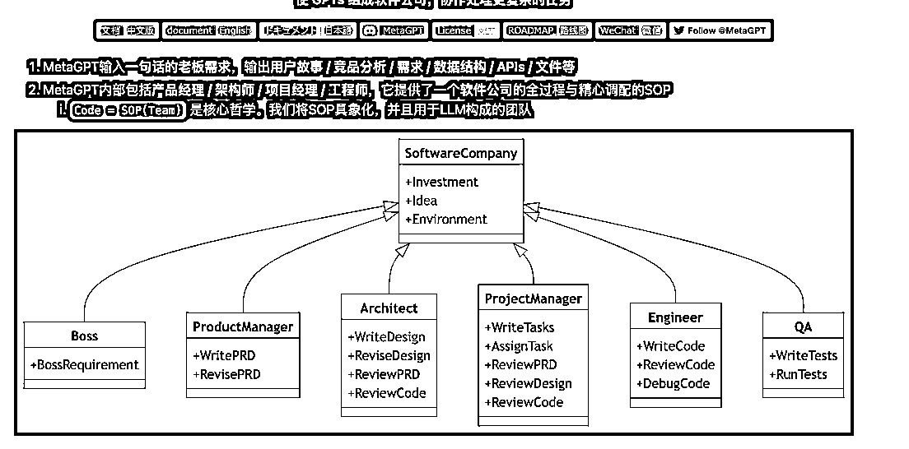

https://github.com/geekan/MetaGPT/blob/main/docs/README_CN.md

一个需求生成产品需求，数据结构，用户故事，竞品分析，最后写出程序

https://github.com/0xpayne/gpt-migrate

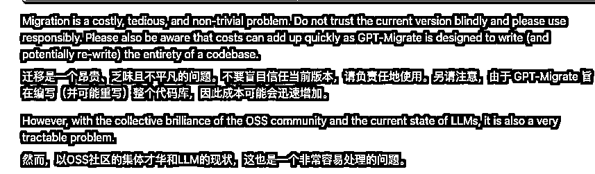

将一个项目迁移到另外一个项目的自动 GPT 工具

Releasing 🚀 CodeGen2.5 🚀, a small but mighty LLM for code.

Blog: https://blog.salesforceairesearch.com/codegen25

Paper: https://arxiv.org/abs/2305.02309

Code: https://github.com/salesforce/CodeGen

Model: https://huggingface.co/Salesforce/codegen25-7B-multi

AI GIRL Generator ：打造属你自己的梦想女孩

起初我是不想发的，但是我感觉应该会有宅男喜欢，这个工具可以自己根据自己喜好来生成一个自己心目中的梦想动漫女孩。从脸型到身材款式已经风格，每一个细节都可以量身打造。

平台提供广泛的动作、身体、服装和面部定制选项，可探索各种风格和主题。

http://Aigirl.gg

## 7 月 6 日

AI has revolutionized Excel.

Say goodbye to complex formulas and endless tutorials.

Say hello to Rows, the ultimate AI-powered Excel tool! 💯🆓👇

Try out http://rows.com for free!

【 AI 開發的革命！? 】

現在市場上出現了一個上限 500 萬 token 的語言模型「LTM-1」，真的是 500 萬...

由新創公司 Magic （A 輪融資 2300 萬美）所開發一種名為長期記憶網絡（LTM Net）的新方法。

相比 GPT-4 的 3.2 萬 token，足足是 50 倍。

相當於 50 萬行代碼和 5000 個檔案，能完全覆蓋大部分的程式庫。

而且能夠批量進行重構，讓錯誤修復和維護工作瞬間完成，還能在不同檔案之間重新使用和合成資訊。

雖然目前還需要排 Waitlist，不知道效果如何，但既然出現了這樣的產品，市場也確實有這樣的需求。

那透過 AI 改變未來的開發模式就是必然的趨勢。

Waitlist: https://magic.dev

利用 ChatGPT 改造 Hacker News

Hacker News 是一个面向全球的技术类新闻聚合社区。但这个网站整体 UI 很古朴，并且一页密密麻麻的 30 条新闻标题，让人看起来非常费劲。

有人做了一个增强版：Hacker News Summary，利用 ChatGPT 的总结能力，直接将每条新闻用一两句话总结出来，大大节约了每天看新闻的时间。

演示地址：http://hackernews.betacat.io

项目地址：

https://github.com/polyrabbit/hacker-news-digest

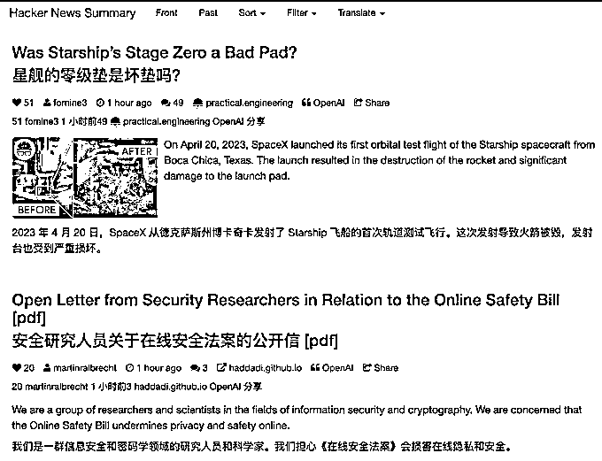

人工智能现在可以在几秒钟内编辑您的视频...

告别数小时的视频编辑。

隆重推出 Keyframes Studio，您唯一需要的 AI 编辑工具：

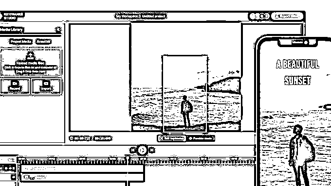

https://keyframes.studio

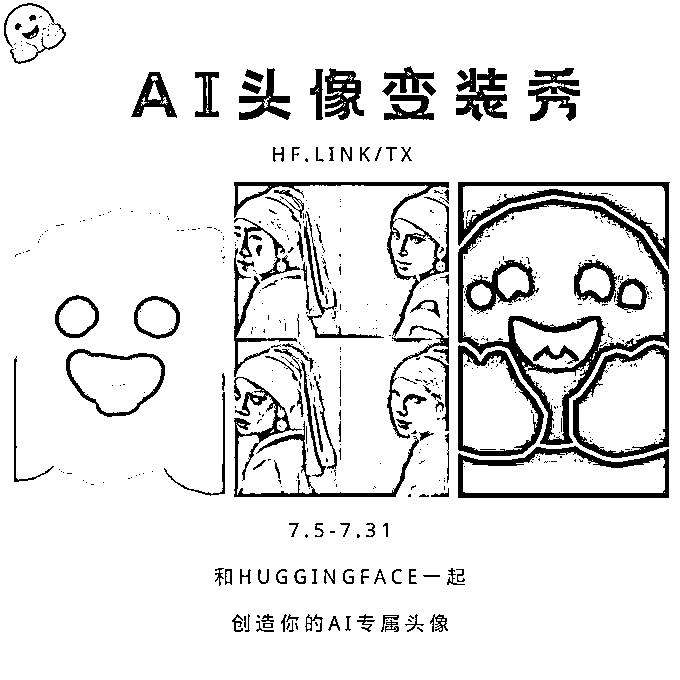

Hugging Face is on RED（小红书）🎉

Check out our first online event👇

https://xiaohongshu.com/explore/64a55f510000000016026bdf

LongNet: Scaling Transformers to 1,000,000,000 Tokens

Presents LONGNET, a Transformer variant that can scale sequence length to more than 1 billion tokens, without sacrificing the performance on shorter sequences

abs: https://arxiv.org/abs/2307.02486

repo: https://github.com/microsoft/torchscale

mage-to-3D is getting good. Two examples.

One-2-3-45 is a method that is a able to generate full 360-degree 3D textured mesh in 45 seconds.

https://one-2-3-45.github.io/?ref=aiartweekly

OpenAI 正在引入“超级对齐”这个概念。我们需要科学和技术的突破来引导和控制那些比我们更聪明的 AI 系统。为了在四年内解决这个问题，正在组建一个新的团队，由⁦⁦

@ilyasut

⁩ ⁩和

@Jan

Leike 共同领导，并且 OpenAI 迄今为止获得的 20%的计算力投入到这个工作中

https://openai.com/blog/introducing-superalignment

30 疯狂有用的 AI 工具：

碉堡您的生活、节省您的时间：

音频工具：

网站搭建工具：

视频工具：

AI 搜索工具：

代码工具：

撸 PPT 工具：

做内容工具：

试一试，工作效率快 10 倍

Introducing the AI Web TV

A live stream of generative AI videos, all made using Zeroscope V2 576w

Looking great on the new compact design of Hugging Face Spaces

https://huggingface.co/spaces/jbilcke-hf/AI-WebTV…

For the best experience, watch it from your computer, tablet or smart TV

https://medium.com/art-interrupted/so-long-prompt-engineering-we-hardly-knew-ya-a77d871e00e9…

告别「提示工程」，我们几乎不了解你

由于人工智能（AI）系统能够自行开发提示、需要定制化提示以及问题表述的重要性，提示工程这一过程正逐渐过时。

为了在 AI 世界中保持领先地位，我们需要更好的问题表述，这可以通过诊断、分解、重构和约束设计来实现。

关于提示工程是否是一门合法的工程领域的争论仍在继续，一些人认为它只是输入文本，而其他人则认为它是将 AI 整合到更大系统中所必需的技能。

未来，AI 模型和架构的演变可能会改变提示工程的性质。

大型语言模型（LLM）在跨各个领域的单代理具体任务中表现出了令人印象深刻的规划能力。然而，它们在多智能体合作中的规划和通信能力仍不清楚，尽管这些是智能实体的关键技能。在本文中，我们提出了一种利用 LLM 进行多智能体合作的新颖框架，并在各种具体环境中对其进行了测试。我们的框架使实体代理能够与其他实体代理或人类进行计划、沟通和合作，以有效地完成长期任务。我们证明，最近的法学硕士（例如 GPT-4）可以超越强大的基于规划的方法，并使用我们的框架展示紧急有效的沟通，而无需微调或几次提示。我们还发现，以自然语言进行交流的基于法学硕士的代理可以赢得更多信任并与人类更有效地合作。我们的研究强调了法学硕士在具体人工智能方面的潜力，并为未来多智能体合作的研究奠定了基础。

使用大型语言模型模块化构建协作具体代理

纸页：https://huggingface.co/papers/2307.02485

初步掌握了 AI 二维码的生成方法，效果图如下，开个🧵简单介绍一下工作流。

软件环境：

2.二维码神器 QR Toolkit 插件

3.修脸神器 ADetailer 插件

4.二维码 controlnet 模型 QR Code Monster

1.一个容易和图片融合的二维码是基础的基础，可以参考以下设置生成一个二维码。二维码里所包含的信息越少，图案就越简单，如果想要生成的 url 太长，可以用短网址压缩一下。

QR Toolkit 安装地址 https://github.com/antfu/sd-webui-qrcode-toolkit.git

2.在文生图里填写一些容易和二维码融合的提示词，比如森林、树木、花朵，这样才能生成出来比较自然的融合效果。采样步数开高一点，我设置了 52 步，高清修复可以打开。

3.如果提示词里有人，最好加上 full body，让人全身入画，这样人脸会变小，不容易被斑点覆盖。人脸变小之后容易崩坏，修脸神器可以解决崩坏的问题。

ADetailer 下载地址 https://github.com/Bing-su/adetailer.git

4.接下来就是 controlnet 了，目前效果比较好的是 QR Code Monster v1.0，预处理器选 none，control weight 可以设置为 1.4。

QR Code Monster 下载地址 https://huggingface.co/monster-labs/control_v1p_sd15_qrcode_monster/tree/main

5.点击生成按钮

模型，提示词，采样步数，采样器，二维码控制图，都可以随心调，我也没有画特别多时间搞的特别精细。😅

https://twitter.com/Datou/status/1676763811360157696

我目前看到的 AI 绘画资料最全版本

一个 GitHub 仓库，8900 星

保存这一个，其他 AI 绘画都可不保存

https://github.com/hua1995116/awesome-ai-painting

## 7 月 5 日

https://openart.ai/apps/ai_qrcode

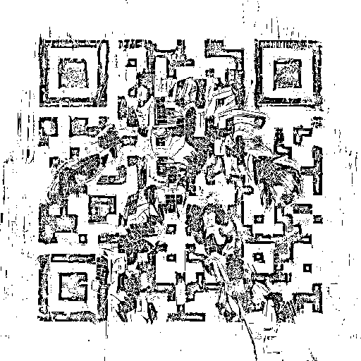

另外一种

https://antfu.me/posts/ai-qrcode

https://antfu.me/posts/ai-qrcode-refine

https://github.com/antfu/sd-webui-qrcode-toolkit

比较费劲，但是效果更好

## 7 月 4 日

ChatGPT：很酷但有限。

利用这 10 个人工智能工具在 2023 年保持领先地位。 👇

9.Twitter 增长助手→ https://tweethunter.io

AI Game Creator：你只需要输入文字描述即可帮你开发出你需要的游戏

通俗的说就是它集合了各种 AI 工具，可以帮你生成各种游戏资源：如角色、背景和物体、创建动画、制作智能角色、定制角色、生成故事和视觉效果，以及设计角色扮演游戏。

无需编程或设计经验，它会根据你的描述和指示来创建游戏。

该平台主要特性：

1、构建沉浸式世界：使用集成的游戏生成工具，包括背景移除、重新缩放和多样化的输出变化。

2、轻松动画：使用 AI 驱动的工具简化精灵动画的创建，使角色的动作自然且响应灵敏。

3、用 AI 赋能 NPC：实现 AI 驱动的 NPC，它们能够智能地对玩家和环境做出反应，增强沉浸感和参与度。

4、定制角色：通过 AI 生成的外观、特性和行为，提供高级角色定制选项。

5、视觉小说的新篇章：使用 AI 生成的叙事和惊人的视觉效果，创建丰富、互动的视觉小说体验。

6、动态 RPG 设计：通过 AI 驱动的功能，如自适应难度、动态世界建设和角色进步，增强角色扮演游戏。

如果感兴趣的可以去 AI Game Creator 官网 Rosebud AI 排队，进入内测。

https://www.rosebud.ai/ai-game-creator

## 6 月 30 日

imgly/background-removal-js

background-removal 是一个强大的 npm 包，直接在浏览器就可以离线运行的抠图脚本。

背后的模型是 ONNX https://onnx.ai ，然后利用 WASM 运行在浏览器上。

项目地址：https://github.com/imgly/background-removal-js…

在线演示：https://img.ly/showcases/cesdk/web/background-removal/web

Webcam Motion Capture：通过你的电脑或智能手机的摄像头即可完全控制和制作你专属的 3D 虚拟形象。

只需要网络摄像头，无需购买 Leap Motion 或任何特殊设备。它就可对你进行头部追踪、眼球追踪、眨眼检测、唇形同步和上半身追踪，用来制作动态的虚拟形象！

还可以将捕捉到的运动数据保存为 FBX 文件。

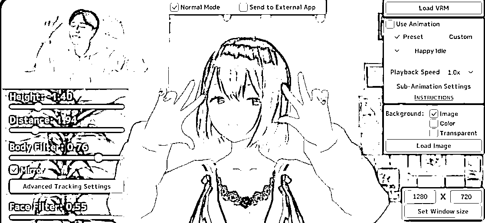

We've updated the Zeroscope model on Replicate to allow upscaling with an init_video.

- Generate a video at 576x320 with 576w model

- Upscale to 1024x576 with XL model

(Plus added potat1 model)

https://replicate.com/anotherjesse/zeroscope-v2-xl

Faster Segment Anything (MobileSAM)

@Gradio

demo is out

demo: https://huggingface.co/spaces/dhkim2810/MobileSAM…

Segment anything model (SAM) is a prompt-guided vision foundation model for cutting out the object of interest from its background. Since Meta research team released the SA project, SAM has attracted significant attention due to its impressive zero-shot transfer performance and high versatility of being compatible with other models for advanced vision applications like image editing with fine-grained control. Many of such use cases need to be run on resource-constraint edge devices, like mobile Apps. In this work, we aim to make SAM mobile-friendly by replacing the heavyweight image encoder with a lightweight one. A naive way to train such a new SAM as in the original SAM paper leads to unsatisfactory performance, especially when limited training sources are available. We find that this is mainly caused by the coupled optimization of the image encoder and mask decoder, motivated by which we propose decoupled distillation. Concretely, we distill the knowledge from the image encoder ViT-H in the original SAM to a lightweight image encoder, which can be automatically compatible with the mask decoder in the original SAM. The training can be completed on a single GPU within less than one day, and the resulting lightweight SAM is termed MobileSAM which is more than 60 times smaller yet performs on par with the original SAM. For inference speed, MobileSAM runs around 10ms per image: 8ms on the image encoder and 2ms on the mask decoder. With superior performance and a higher versatility, our MobileSAM is 7 times smaller and 4 times faster than the concurrent FastSAM, making it more suitable for mobile applications.

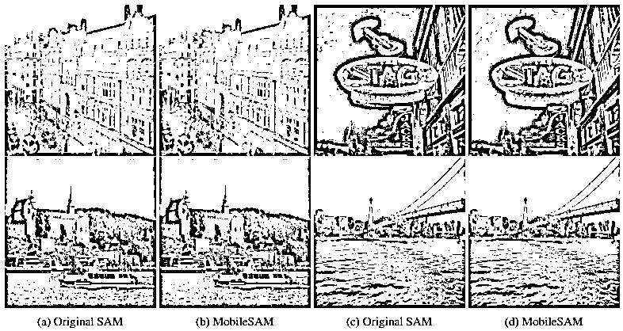

《Google 的免费课程》

谷歌良心，免费课程还发文凭：

1。数字营销的基础

http://learndigital.withgoogle.com/digitalgarage/course/digital-marketing…

2.Python 的数据科学

http://learndigital.withgoogle.com/digitalunlocked/course/data-science-with-python…

3。使用 JavaScript 学习编程

http://learndigital.withgoogle.com/digitalgarage/course/learn-programming-with-javascript……

4。 Google 云计算基础

http://cloudskillsboost.google/course_templates/153…

5。 Google 的 Python 课程

http://developers.google.com/edu/python

6。机器学习速成课程

http://learndigital.withgoogle.com/digitalunlocked/course/machine-learning-crash-course…

7。介绍 Google Cloud Essentials

http://cloudskillsboost.google/quests/23

8。简介：数据，ML，AI

http://cloudskillsboost.google/quests/34

Generative AI for Programming Education: Benchmarking ChatGPT, GPT-4, and Human Tutors

paper page: https://huggingface.co/papers/2306.17156…

Generative AI and large language models hold great promise in enhancing computing education by powering next-generation educational technologies for introductory programming. Recent works have studied these models for different scenarios relevant to programming education; however, these works are limited for several reasons, as they typically consider already outdated models or only specific scenario(s). Consequently, there is a lack of a systematic study that benchmarks state-of-the-art models for a comprehensive set of programming education scenarios. In our work, we systematically evaluate two models, ChatGPT (based on GPT-3.5) and GPT-4, and compare their performance with human tutors for a variety of scenarios. We evaluate using five introductory Python programming problems and real-world buggy programs from an online platform, and assess performance using expert-based annotations. Our results show that GPT-4 drastically outperforms ChatGPT (based on GPT-3.5) and comes close to human tutors' performance for several scenarios. These results also highlight settings where GPT-4 still struggles, providing exciting future directions on developing techniques to improve the performance of these models.

https://langtale.ai/playground

LangTale 发布了一个名为 LangTale Playground 的新工具，允许用户在不编写代码的情况下尝试 OpenAI 函数调用。

该工具是 LangTale 平台的一部分，旨在解决使用语言学习模型（LLM）时常见的开发者挑战。

技术栈包括 Next.js by Vercel、Tailwind CSS、OpenAI、PlanetScale 的 Vitess 数据库以及 Radix UI 和 Shadcn 的组件库。

鼓励用户尝试并提供反馈。

一些用户要求开源 UI，还有人指出该应用在移动设备上的使用体验不佳。

Wonder Studio 结束内测，向所有人开放了

Wonder Studio 可以自动化将现实场景中的人物转换替代成 CG 角色，还可以进行动画、灯光和合成。

使用该工具不需要复杂的 3D 软件和昂贵硬件，只需要一台相机拍摄视频，然后使用该工具即可将人物替换成 CG 角色。

传送门：http://wonderdynamics.com

airoboros 65b 1.4 is finally ready:

https://huggingface.co/jondurbin/airoboros-65b-gpt4-1.4…

I haven't done any benchmarks yet, just a few one-off tests.

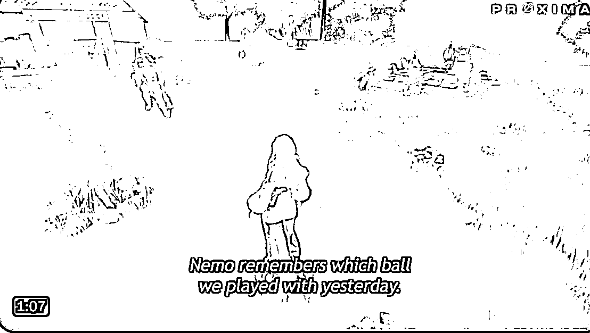

Beyond the virtual dollhouse: simulating life in games

Nemo AI is capable of 3D environment awareness, long-term memory, and real-time learning

blog: https://ranmo.me/blog/title-digital-companionship

猫咪疼痛检测器的网址

https://cpd.carelogy-japan.com/en

怎么知道喵星人是否疼痛？当然还是要用 AI

日本某公司与日本大学合作，用 6000 张猫咪照片建立了猫脸数据库，通过耳朵、鼻子、胡须和眼睑位置，来判断猫咪是否处于疼痛状态

然后拿用户上传的 60 万张猫照改进检测准确度，据说现在检测准确度已达到 90%😼

我来测试一下，结果是阴性/不疼💪

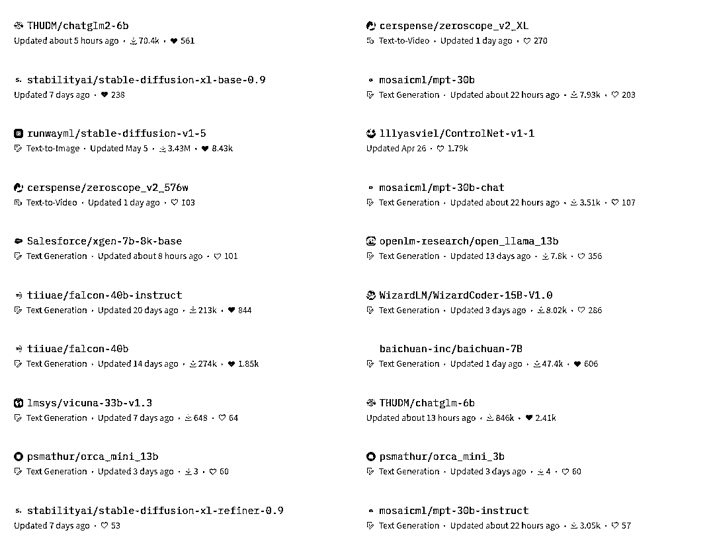

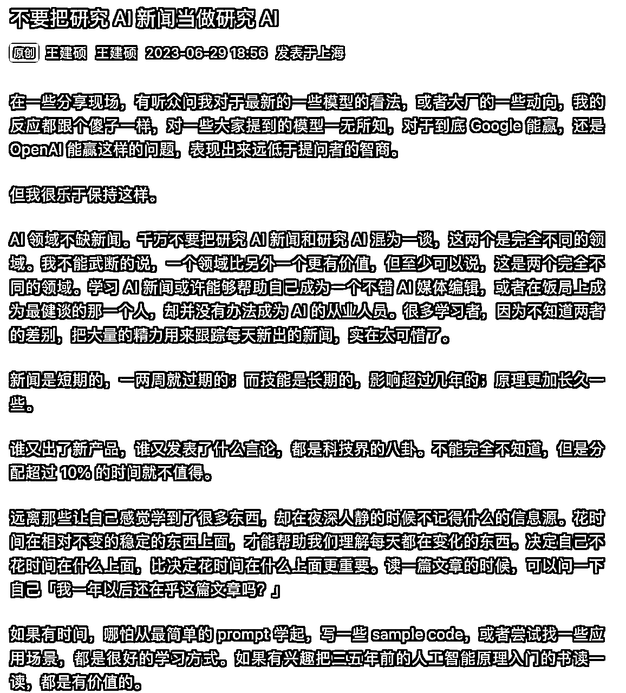

不再需要花费数小时进行视频编辑。

ChatGPT 现在只需两个提示即可创建包含脚本、画外音、音乐和所有内容的视频广告。

我将通过 4 个简单步骤向您展示如何操作👇

步骤 1 ：

安装 Visla 插件

进入 ChatGPT 插件并安装 Visla。

然后启用它！

第 2 步：

获取 ChatGPT 来规划视频

使用此提示。根据需要更改视频主题。

“我想使用 Visla 插件为我的咖啡店“Drip Drop”创建一个讲故事的视频。集思广益关于 Visla 插件作为输入的视频的其他内容，并在下面概述它们。”

步骤 3：

创建视频

如果您同意详细信息，请告诉 ChatGPT 创建视频。

现在，它会生成带有画外音、音乐和其他所有内容的视频，然后为您提供链接和其他详细信息。

提示：“看起来不错。使用上面的详细信息创建视频。”

步骤 4：

下载或编辑

单击 ChatGPT 为您提供的链接以转至视频页面。

您可以根据需要从那里下载或编辑视频。

感谢

@rezkhere

原地址：https://twitter.com/Bitturing/status/1674631544089235456

我本来是想做前面 2 秒是真人，后面开始变 CG 动画，讲几秒再切换这样的，不知道是哪里没设置好。另外完成后导出的视频没有那么高清，感觉被压缩过了。熟练了以后应该会挺好玩的。大家感兴趣的可以体验起来了。还可以 DIY 做其他人物角色，不过要学下。直达地址：https://app.wonderdynamics.com

Reimagining the iconic Mickey Mouse with different styles in 3D.

AI-generated style consistent images -> 3D

Generate your own: https://discord.com/invite/NhJJwmk8gT

Download meshes:

https://3d.csm.ai/demo/fierce-range

https://3d.csm.ai/demo/faulty-turmeric

https://3d.csm.ai/demo/imaginary-tomorrow

最近跟不少一线做 AI 产品研发的朋友聊，都提到微软 Build2023 开发者大会 Andrej Karpathy 的分享启发最大。

Andrej Karpathy 是 OpenAI 的创始成员、前特斯拉高级 AI 总监。

@dotey

之前做过这个视频的字幕，也多次提炼分享过核心内容。

公众号搜到个文字总结版，存成飞书文档阅读一起学。

笔记版地址：

视频地址：

https://youtube.com/watch?v=YrBJiy-V8MY

## 6 月 29 日

Introducing Playground with Mixed Image Editing.

A new way to combine real and synthetic images to create stunning works of art & photorealistic images bound only by your imagination.

Try now: http://playgroundai.com

我宣布推出 OpenOrca - 一个受 Microsoft Orca 论文启发的数据集。我们正在为各种目标模型寻找计算赞助商（请参阅博客文章）。感谢赞助商 https://chirper.ai 和 https://preemo.io 和 https://latitude.sh 。

https://erichartford.com/openorca

@winglian

@TheBlokeAI

@Teknium1

怎么在 Figma 里使用 AI 直接分析设计稿，得到虚拟热力图

这个插件使用 Attention Insight 的技术，不需要召集真实用户做测试，就能获取热力图，据说准确率可达 96%

背后的技术实现原理：用眼动追踪搜集用户观看网页的行为数据，用 70K 个数据集生成这套分析系统

https://attentioninsight.com/technology/

https://mp.weixin.qq.com/s/nhB7Hsjz_aLkSrUT0mqHWw

给想玩 AI 的新手｜Stable Diffusion 保姆级入门手册

AI 智能视频换脸工具：Swapface

可以连接你的电脑摄像头进行实时直播换脸

例如与明星、角色、动漫人物、动物等换脸

https://swapface.org/#/home

ntroducing XGen-7B, a new 7B LLM trained on 8K seq. length for 1.5T tokens. Better or comparable results with MPT, Falcon, LLaMA, OpenLLaMA in text & code tasks.

Blog: http://blog.salesforceairesearch.com/xgen/

Code: https://github.com/salesforce/xgen

Training cost ~$150K for 1T token

MosaicML 发布了 MPT-308，一个开源模型，可免费用于商业用途，并且性能优于 GPT-3！ 🎉

MPT-30B 是商业 Apache 2.0 许可的开源基础模型，其质量超过了 GPT-3，并且与 LLaMa-30B 和 Falcon-408 等其他开源模型具有竞争力。 💪

它是 MosaicML 基础系列的一部分，比其前身 MPT-7B 更强大。 ⚡️

MosaicML 还发布了 MPT-30B 的两个微调变体，称为 MPT-30B-Instruct 和 MPT-30B-Chat，它们在单轮指令跟踪和多轮对话方面表现出色。 💬

MPT-30B 在训练期间具有 8k 令牌上下文窗口，并通过 ALiBi 支持更长的上下文。它是在 NVIDIA H100 上进行训练的，据称这是第一个在 H100 上训练的法学硕士。 💻

选择 MPT-30B 的尺寸是为了使其易于在单个 GPU 上部署。其他类似的 LLM（例如 LLaMa-30B 和 Falcon-40B）具有更大的参数数量，并且无法在单个 GPU 上提供服务。 🖥️

MPT-30B 使用 8k 标记的长上下文窗口进行训练。最初，它使用 2k token 长的序列对 1 万亿个 token 进行预训练，然后使用 8k token 长的序列继续训练另外 500 亿个 token。 📚

MPT-30B 根据 Apache 2.0 许可证获得商业许可。

Apache 2.0 许可证的实际含义是什么？

Apache License 2.0 是一个免费的开源软件许可证，允许用户使用、修改和分发该软件，包括用于商业目的。它是宽松的，这意味着它对您可以使用该软件执行的操作设置了最少的限制。但是，如果您重新分发该软件，则必须包含一份许可证副本并提供一份通知文件（如果存在）。该许可证还包括贡献者向用户授予专利权。该许可证因其允许商业使用的灵活性和宽松性而受到企业和开发商的欢迎。 📄💼

我们没有看到太多在 Apache 2.0 许可证下发布的真正开源的 LLM 模型，因此，对于我们作为一个社区来说，拥抱和鼓励此类进步非常重要！ 🌟🤝

🔗链接-

拥抱空间 - https://huggingface.co/mosaicml/mpt-30b

博客 - https://mosaicml.com/blog/mpt-30b

存储库-

AI coding assistants that will save you 100+ hours:

1\. Bito: Code Optimization

http://bito.ai

2.Safurai: Code Security

http://safurai.com

3\. Codesquire: Code Search

http://codesquire.ai

4\. Blackbox: Code Generation

http://useblackbox.io

5\. Sourceai: Code Suggestions

http://sourceai.dev

6\. AI-code-reviewer: Code Review

http://ai-code-reviewer.com

7\. Supabase: Database Management

http://supabase.com

8\. Google Colab Copilot: Code Generation

http://copilot.naklecha.com

9\. Programming-helper: Programming Assistance

http://programming-helper.com

Use AI to get more done with less effort!

The Midjourney Cheat Sheet （V5.2）

从提示到参数、设置和权重，全部集中在一处 。

可以打印出来放在工作区，帮助你更好地理解和使用 Midjourney 项目的各种功能和参数。

涵盖了所有的基本设置和提示参数，甚至还指出了一些高级概念。

作者：

@tristwolff

文字版：https://tristwolff.medium.com/the-midjourney-cheat-sheet-v5-2-34b65cb90ea3

欺骗 AI 图片检测工具，到底有多简单？

AI 图片普及后，在铺天盖地的照片里检测出 AI 图片也变成硬需求

纽约时报测试了 5 款不同的 AI 图片检测工具，看看成功率，还特地测试看看能否欺骗这些检测工具

结果很糟糕，随便给 AI 图片增加一些噪点，就蒙混过关了

https://nytimes.com/interactive/2023/06/28/technology/ai-detection-midjourney-stable-diffusion-dalle.html

New sheriff in town! Our model UltraLM-13B, which is trained upon UltraChat, just ranks #1

among opensource models (ranks #4 among all models) on Stanford's AlpacaEval Leaderboard.

https://github.com/thunlp/UltraChat…

It's the only 80+ opensource model, more powerful ones will come.

https://generalrobots.substack.com/p/dimension-hopper-part-1

2D Platformer using Stable Diffusion for live level art creation

New open-source LLMs! 🔔

@salesforce

released XGen 7B, a new LLM with an 8k context under Apache 2.0🔓

XGen has the same architecture as

@MetaAI

LLaMa ca be used 1-to-1 replacement for commercial use! 🔥

👉 https://huggingface.co/Salesforce/xgen-7b-8k-base?ref=blog.salesforceairesearch.com

New sheriff in town! Our model UltraLM-13B, which is trained upon UltraChat, just ranks #1🏆 among opensource models (ranks #4 among all models) on Stanford's AlpacaEval Leaderboard.

https://github.com/thunlp/UltraChat

It's the only 80+ opensource model, more powerful ones will come.

https://technologyreview.com/2023/06/26/1075504/junk-websites-filled-with-ai-generated-text-are-pulling-in-money-from-programmatic-ads/

垃圾网站充斥着 AI 生成的文字，通过程序化广告赚取利润。

根据 NewsGuard 的报告，超过 140 个知名品牌无意中为不可靠的 AI 写作网站付费广告。

尽管谷歌禁止在「垃圾自动生成内容」的页面上放置广告，但这些 AI 生成的新闻网站上的大多数广告都是由谷歌提供的。

这种做法浪费了大量广告费用，威胁着垃圾内容充斥的 AI 生成互联网的到来。

https://www.reddit.com/r/StableDiffusion/comments/14ll30t/new_controlnet_qr_code_model_is_amazing/

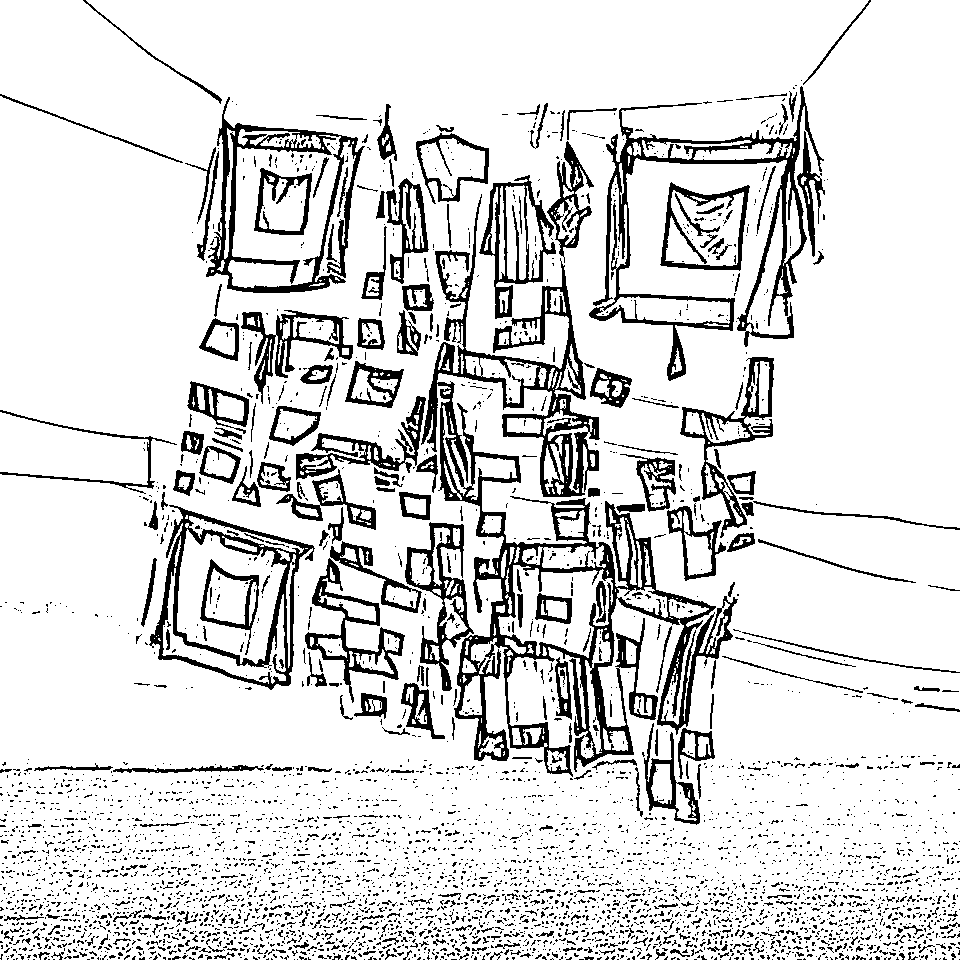

Scan the QR code from a short distance from the screen

demo: https://huggingface.co/monster-labs/control_v1p_sd15_qrcode_monster

model: https://huggingface.co/spaces/monster-labs/Controlnet-QRCode-Monster-V1

https://www.reddit.com/r/StableDiffusion/comments/14lt6v2/from_unscannable_to_scannable_more_qr_nonsense/

## 6 月 28 日

NVIDIA H100 GPUs Set Standard for Generative AI in Debut MLPerf Benchmark

blog: https://blogs.nvidia.com/blog/2023/06/27/generative-ai-debut-mlperf/…

a cluster of 3,584 H100 GPUs at cloud service provider CoreWeave completed a massive GPT-3-based benchmark in just 11 minutes.

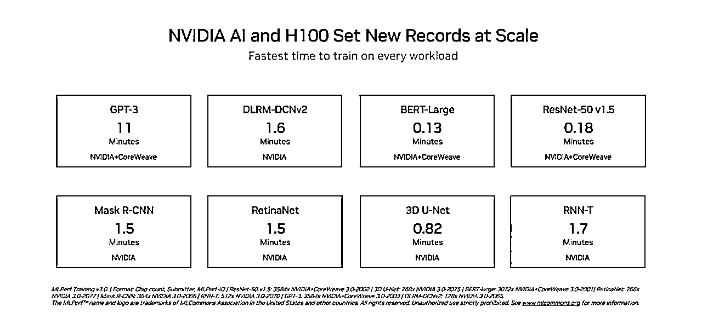

Google 的"Generative AI learning path"系列全部翻译完了

虽然有不少 Google 自家产品的广告，但是质量还是相当可以的。

YouTube 播放列表：https://youtube.com/watch?v=tbLOQ533Up8&list=PLiuLMb-dLdWJPpybrCYNhi6D9Vd4vz16i…

B 站播放列表：https://space.bilibili.com/589397373/channel/collectiondetail?sid=1468916

宝玉

https://cobusgreyling.medium.com/openai-multi-functions-agent-4bf8c88c4b6e

function 支持多次调用的方式，这个思路很好，后续可以更灵活做思维链

OpenAI Multi-Functions Agent

https://lilianweng.github.io/posts/2023-06-23-agent/

经典文章，OpenAI 主管做的类似 LLM 周边工具技术大全目录

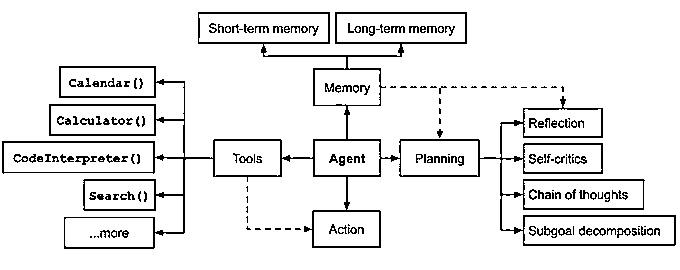

https://twitter.com/i/status/1673825814906048512

Zeroscope 最近杀疯了，盖了生成图的新闻

FableForge

Description

Generate a picture book from a single prompt using OpenAI's new function calling and Replicate's API for Stable Diffusion. Store all your generated images and corresponding prompts in Deep Lake. Check example.pdf or watch the video below for a peek at the output.

Built with LangChain, Deep Lake, and Replicate.

重发一次

https://github.com/e-johnstonn/FableForge

儿童绘本生成器

过程

https://www.activeloop.ai/resources/ai-story-generator-open-ai-function-calling-lang-chain-stable-diffusion/

## 6 月 27 日

ElevenLabs 新出声音库。

一键生成随机的真人感声音，遇到喜欢的就存下来，还可以在社区里分享，支持商业使用。

彻底解决了版权问题。

https://beta.elevenlabs.io/voice-library

CloneCleaner - a new extension for AUTO1111 to work around the "same-face problem" - high image quality without sacrificing variability

https://github.com/artyfacialintelagent/CloneCleaner.git

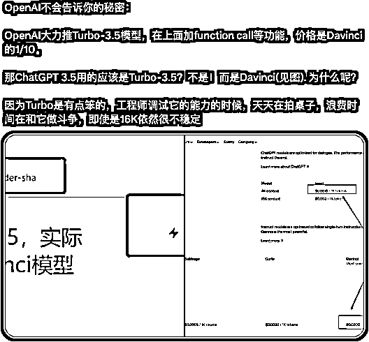

DreamBox AI

@DreamBoxAI

是一个专注于将 AI 设计转化为实体产品的平台，支持玩偶、毛绒玩具、珠宝等产品。目前少量个性化产品的生产成本还是很高的，在 AI 时代应该会出现一种新的个性化产品生产体系，将这个成本降下来。

这需要大量的备料以及自动化打版和生产系统，在技术上是可以实现的，期待有实力的供应链和生产企业或者创业公司能早日将此变为现实

https://www.dreambox.ai/

RealityScan ：仅用手机或平板电脑拍摄照片即可创建高保真 3D 模型。

RealityScan 是一款强大、免费的摄影测量应用，你只需用手机对着物体全方位的拍摄多张图片，它就会帮你自动创建出高保真度的 3D 模型。

你还可以将这些模型导出到 Sketchfab，或下载到其他应用中使用，如 Unreal Engine 或 Twinmotion。

https://www.unrealengine.com/zh-CN/blog/realityscan-is-now-available-for-android-devices

## 6 月 26 日

https://github.com/THUDM/ChatGLM2-6B

ChatGLM2-6B 是开源中英双语对话模型 ChatGLM-6B 的第二代版本，在保留了初代模型对话流畅、部署门槛较低等众多优秀特性的基础之上，ChatGLM2-6B 引入了如下新特性：

更强大的性能：基于 ChatGLM 初代模型的开发经验，我们全面升级了 ChatGLM2-6B 的基座模型。ChatGLM2-6B 使用了 GLM 的混合目标函数，经过了 1.4T 中英标识符的预训练与人类偏好对齐训练，评测结果显示，相比于初代模型，ChatGLM2-6B 在 MMLU（+23%）、CEval（+33%）、GSM8K（+571%） 、BBH（+60%）等数据集上的性能取得了大幅度的提升，在同尺寸开源模型中具有较强的竞争力。

更长的上下文：基于 FlashAttention 技术，我们将基座模型的上下文长度（Context Length）由 ChatGLM-6B 的 2K 扩展到了 32K，并在对话阶段使用 8K 的上下文长度训练，允许更多轮次的对话。但当前版本的 ChatGLM2-6B 对单轮超长文档的理解能力有限，我们会在后续迭代升级中着重进行优化。

更高效的推理：基于 Multi-Query Attention 技术，ChatGLM2-6B 有更高效的推理速度和更低的显存占用：在官方的模型实现下，推理速度相比初代提升了 42%，INT4 量化下，6G 显存支持的对话长度由 1K 提升到了 8K。

更开放的协议：ChatGLM2-6B 权重对学术研究完全开放，在获得官方的书面许可后，亦允许商业使用。如果您发现我们的开源模型对您的业务有用，我们欢迎您对下一代模型 ChatGLM3 研发的捐赠。

The source code for DragGAN has been released! Huge thanks to community contributor LeoXing1996 for the

@gradio

demo

https://huggingface.co/spaces/radames/DragGan

之前发过，再次重发

开源了

https://cevalbenchmark.com/static/leaderboard.html

讨论：

https://www.reddit.com/r/LocalLLaMA/comments/14iszrf/a_new_opensource_language_model_claims_to_have/

chatGLM2 跑分超过 GPT4

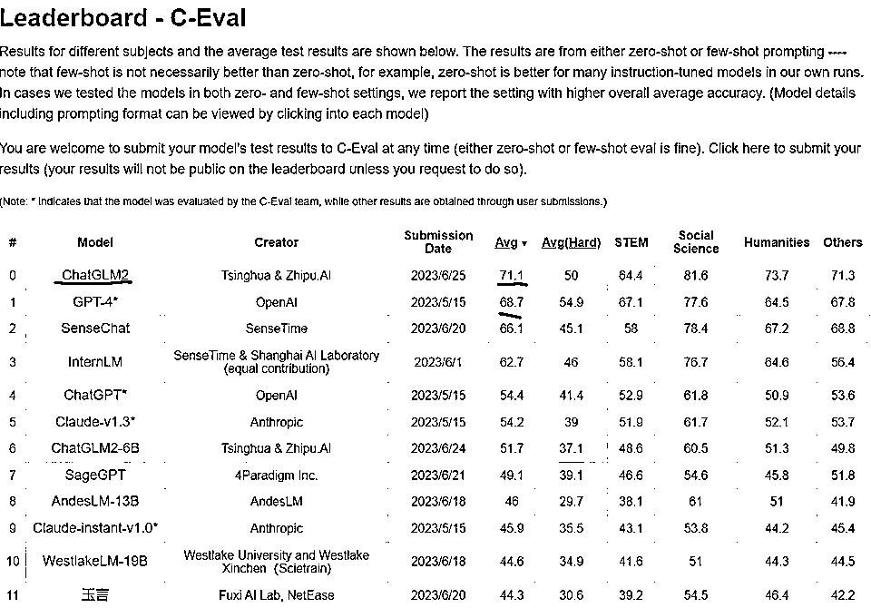

## 6 月 12 日～6 月 18 日

内容描述

内容来源

这是腾讯 AI Lab 发布的一个基于 CLIP、Whisper 和 LLaMA 构建的多模态项目。

CLIP：负责编码图像和视频帧。

Whisper：负责编码音频数据。

LLM（LLaMA/Vicuna/Bloom）：负责编码指令和生成响应的语言模型。

不过没看到线上演示地址，数据集看着不错：https://github.com/lyuchenyang/Macaw-LLM/tree/main/data

Releasing Hermes-Falcon-7b-8k, a Falcon model fine-tuned at 8k context length on the

@NousResearch

Hermes instruction dataset.

https://huggingface.co/conceptofmind/Hermes-Falcon-7b-8k

https://huggingface.co/DionTimmer/controlnet_qrcode

SD➕controlnet 最实用的落地场景之一二维码。

Advanced Techniques for Prompt Engineering - VIDEO

This looks like a comprehensive video about prompt engineering. It covers a number of techniques used in prompting large language models.

Watch the video here: https://youtube.com/watch?v=kr5X3QvPzvM

SD 插件：stablesr，可以高质量放大图片，生成图片细节。

https://github.com/pkuliyi2015/sd-webui-stablesr

New State of AI Edition is Out 🔥

And More... 🚀

Latest #AI Research Summaries Made and Curated by #GPT4

Read It Here 👇

https://stateofaigpt.substack.com/p/state-of-ai-9?r=jsoa9&utm_campaign=post&utm_medium=web&twclid=24rg2klkc1g5rn9eshvrhm3rtm

anandtech.com/show/18915/amd-expands-mi300-family-with-mi300x-gpu-only-192gb-memory

AMD 推出全新 AI 产品线，旗舰 GPU Instinct MI300X 内存达 192GB。

MI300X 是一款高性能 GPU，专为需要大型模型的客户设计。

MI300 系列预计将于今年晚些时候上市，包括 Zen 4 CPU 核心和 CDNA 3 GPU 核心在一个单一封装中。

评论区讨论了 NVIDIA 在机器学习领域的主导地位以及对更多竞争对手的需求，同时也探讨了 AMD 开发具有竞争力替代品所面临的挑战以及开源 CUDA 替代方案的必要性。

Introducing the AI Speech Classifier - our new authentication tool that enables users to upload audio samples and see if they were generated with ElevenLabs.

Read more: https://beta.elevenlabs.io/blog/ai-speech-classifier/

WizardCoder: a new open-source LLM for code generation

Impressive performance boost compared to StarCoder. It looks like an Orca-like training process could reach a performance level comparable to GPT-3.5.

🤗Huggingface: https://huggingface.co/WizardLM/WizardCoder-15B-V1.0

Stable Diffusion on iPhone is much faster now!

Same model, same phone (iPhone 13 Pro), same settings 🤯

The trick?

Check our post for details https://hf.co/blog/fast-diffusers-coreml

Are people trying to hack your LLM?

Rebuff is a toolkit for detecting prompt injection attempts. https://rebuff.ai

a) great to have tools in an arms race

b) they must be getting handy data on new ideas

c) luckily you can also run a local server! -

据《纽约时报》报道，美国一些中小学正在测试由在线教育机构可汗学院打造的自动化导师。 Khanmigo 聊天机器人的用户包括新泽西州的公立学校和硅谷的可汗实验室学校（由可汗学院创始人 Sal Khan 创立）等私立学校。

Khanmigo 基于 GPT-4。它不直接提供答案，而是用旨在鼓励批判性思维的问题来回答询问。

https://twitter.com/i/status/1669513581262688257

twitter.com/i/status/1669089526957084672

谷歌和麻省理工学院（MIT）的研究团队开发了一种新的表现学习方法，名为「StableRep」。

该方法利用图像生成 AI「Stable Diffusion」中的「仅生成图像」来进行自监督学习，从而能够获得强大的视觉表达，并且比在真实图像上进行训练时具有更好的性能。

相关研究成果已经发布在 arXiv 网站上：https://arxiv.org/abs/2306.00984

Introducing the Vercel AI SDK

Build AI-powered applications with React and Svelte.

Connect and integrate with popular open-source and cloud LLMs, including support for streaming generative responses.

npm i ai

https://vercel.com/blog/introducing-the-vercel-ai-sdk

MusicGen finetuner!

Really good work from Chavinlo!

I'm sure good things will become from this!

https://github.com/chavinlo/musicgen_trainer

StableSR 一个新的可以为模糊画面生成精致细节的超分辨率放大项目，现在已经来到 web-ui。官方演示的效果非常惊人，对模糊照片的修复效果几乎完美！插件对低显存进行了优化，可以在小于 12GB 显存的环境中进行 4K 图像放大。

web-ui 插件中文指南：

https://github.com/pkuliyi2015/sd-webui-stablesr/blob/master/README_CN.md

Baichuan-7B ：王小川团队弄的百川大规模预训练语言模型。

基于 Transformer 结构，在大约 1.2 万亿 tokens 上训练的 70 亿参数模型，支持中英双语，上下文窗口长度为 4096。

原始训练数据包括开源的中英文数据和自行抓取的中文互联网数据，以及部分高质量知识性数据，总量超过 10T。

https://github.com/baichuan-inc/baichuan-7B

@xiaohuggg

Applications of Transformers

New survey paper highlighting major applications of Transformers for deep learning tasks. Includes a comprehensive list of Transformer models.

https://arxiv.org/abs/2306.07303

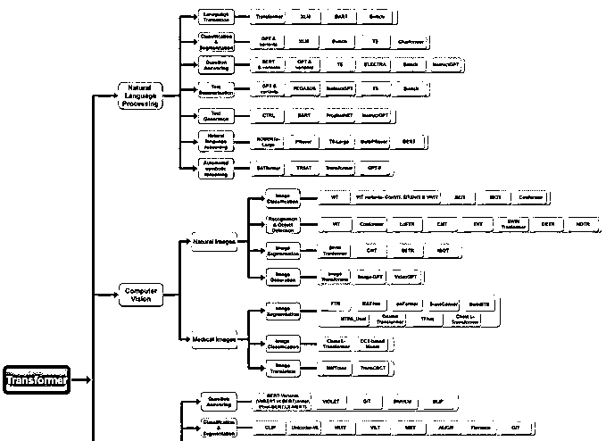

@omarsar0

Seeing the World through Your Eyes

paper page: https://huggingface.co/papers/2306.09348…

The reflective nature of the human eye is an underappreciated source of information about what the world around us looks like. By imaging the eyes of a moving person, we can collect multiple views of a scene outside the camera's direct line of sight through the reflections in the eyes. In this paper, we reconstruct a 3D scene beyond the camera's line of sight using portrait images containing eye reflections. This task is challenging due to 1) the difficulty of accurately estimating eye poses and 2) the entangled appearance of the eye iris and the scene reflections. Our method jointly refines the cornea poses, the radiance field depicting the scene, and the observer's eye iris texture. We further propose a simple regularization prior on the iris texture pattern to improve reconstruction quality. Through various experiments on synthetic and real-world captures featuring people with varied eye colors, we demonstrate the feasibility of our approach to recover 3D scenes using eye reflections.

通过眼睛反射拿到眼睛看到的图像

AK

宝玉

谷歌前两天发了一个 AI 试衣模型 TryOnDiffusion，想解决的是用户提供一张自己的全身照，就可以获得自己穿上对应服装的样子。

需要一张用户的全身照和服装模特穿着的照片，效果看起来非常好。

以往一个关键的挑战是在保留服装细节的同时，将服装进行变形以适应不同主体之间的重要姿势和形状变化。以往的方法要么只注重保留服装细节而无法有效处理姿势和形状的变化，要么允许尝试不同的形状和姿势，但缺乏服装细节。

他们提出了一种基于扩散的架构，将两个 UNet（称为 Parallel-UNet）统一起来，这使得能够在单个网络中保留服装细节并对服装进行重要的姿势和身体变化。

他们主要解决了两个问题：1）通过交叉注意机制隐式地对服装进行变形，2）服装的变形和人物的融合作为一个统一的过程，而不是两个独立任务的序列。

从数据和参考图上来看服装在人物上的变形非常自然，服装的细节也还原的非常好，现在的主要问题就是，演示所有的服装都没有 LOGO 和文字，不知道他们解决了没有，如果不能有文字的话实用性就大打折扣了。目前没有开源。

Google 文章链接：https://blog.google/products/shopping/virtual-try-on-google-generative-ai…

模型介绍页面：https://tryondiffusion.github.io

op7418

https://huggingface.co/papers/2306.08647…

大型语言模型 （LLM） 在通过上下文学习获得从逻辑推理到代码编写的各种新能力方面取得了令人振奋的进展。机器人研究人员还探索了使用 LLM 来提高机器人控制的能力。然而，由于低级机器人动作依赖于硬件并且在 LLM 训练语料库中代表性不足，因此将 LLM 应用于机器人技术的现有努力主要将 LLM 视为语义规划器或依赖人工设计的控制原语与机器人交互。另一方面，奖励函数被证明是灵活的表示，可以针对控制策略进行优化以实现不同的任务，而它们丰富的语义使它们适合由 LLM 指定。在这项工作中，我们引入了一种新范例，该范例通过利用 LLM 来定义可以优化的奖励参数并完成各种机器人任务，从而利用这种实现。使用奖励作为 LLM 生成的中间接口，我们可以有效地弥合高级语言指令或纠正低级机器人动作之间的差距。同时，将其与实时优化器 MuJoCo MPC 相结合，提供交互式行为创建体验，用户可以立即观察结果并向系统提供反馈。为了系统地评估我们提出的方法的性能，我们为一个模拟四足机器人和一个灵巧的机械手机器人设计了总共 17 个任务。我们证明，我们提出的方法可靠地解决了 90% 的设计任务，而使用原始技能作为与代码即策略的接口的基线实现了 50% 的任务。我们在真实的机器人手臂上进一步验证了我们的方法，在这个机器人手臂上，通过我们的交互系统出现了复杂的操作技能，例如非抓握式推动。

AK

h2oGPT: Democratizing Large Language Models

Presents h2oGPT, a suite of open-source code repositories for the creation and use of LLMs based on GPTs.

proj: https://h2o.ai

abs: https://arxiv.org/abs/2306.08161

LLM Agents Can Teach Weaker LLM Agents

-Teacher builds mental model of student

-Learning from explained data improves student on future unexplained data

-Misaligned teachers can lower student performance to random chance by intentionally misleading them

https://arxiv.org/abs/2306.09299

The new OpenAI Function API simplifies agent development by A LOT.

Our latest

@llama_index

release 🔥shows this:

Replace ReAct with a simple for-loop 💡👇

https://github.com/jerryjliu/llama_index/blob/main/docs/examples/agent/openai_agent.ipynb

AssistGPT: A General Multi-modal Assistant that can Plan, Execute, Inspect, and Learn

Proposes a multi-modal AI assistant with an interleaved code and language reasoning approach called PEIL to integrate LLMs with various tools

proj: https://showlab.github.io/assistgpt/

abs: https://arxiv.org/abs/2306.08640

https://twitter.com/willgibs/status/1669402884750950400

Designed this little promo video of my logo using ControlNet v1.1， here's how 做广告视频

LocalRF：可以从输入的视频中学习 3D 场景的结构，然后将这个学习到的结构用于从新的视角生成 3D 场景。

例如如果你有一个从多个角度拍摄的物体的视频，你可以使用 LocalRF 来学习这个物体的 3D 结构。然后，你可以使用这个学习到的结构来从一个新的角度渲染这个物体，即使这个角度在原始视频中并没有出现。

该项目在 GitHub 上提供了详细的设置和使用指南，包括预处理步骤、优化步骤等。 此外，他们还提供了一些脚本来帮助用户下载预训练权重、运行流和深度估计等。

论文下载：http://arxiv.org/pdf/2303.13791.pdf

项目信息：http://localrf.github.io

https://github.com/facebookresearch/localrf

Generalist LLM Agents Completing New Tasks On The Web

-2,000 open-ended tasks from 137 real-world sites

-Raw HTML of sites are often too large for context

-First filtering w/ a smaller LM significantly improves effectiveness & efficiency of larger LLMs

https://arxiv.org/abs/2306.06070

John Nay

@johnjnay

·

3 小时

Code, data, models for Mind2Web: Towards Generalist LLM Agents on the Web:

https://github.com/OSU-NLP-Group/

https://huggingface.co/papers/2306.08543

知识蒸馏 （KD） 是一种很有前途的技术，可以减少大型语言模型 （LLM） 的高计算需求。然而，以前的 KD 方法主要应用于白盒分类模型或训练小模型来模仿像 ChatGPT 这样的黑盒模型 API。如何有效地从白盒生成 LLM 中提取知识仍未得到充分探索，随着 LLM 的繁荣，这一点变得越来越重要。在这项工作中，我们提出了 MiniLLM，它从生成的较大语言模型中提取较小的语言模型。我们首先将标准 KD 方法中的前向 Kullback-Leibler 散度 （KLD） 目标替换为反向 KLD，这更适合生成语言模型上的 KD，以防止学生模型高估教师分布的低概率区域。然后，我们推导出一种有效的优化方法来学习这个目标。在指令跟随设置中的大量实验表明，MiniLLM 模型生成更精确的响应，具有更高的整体质量、更低的曝光偏差、更好的校准和更高的长文本生成性能。我们的方法还可以扩展到具有 120M 到 13B 参数的不同模型系列。

Introducing, Gen-2 Footage Packs.

Browse them all and download for free at http://runwayml.com/FootagePacks

LocalRF：可以从输入的视频中学习 3D 场景的结构，然后将这个学习到的结构用于从新的视角生成 3D 场景。

例如如果你有一个从多个角度拍摄的物体的视频，你可以使用 LocalRF 来学习这个物体的 3D 结构。然后，你可以使用这个学习到的结构来从一个新的角度渲染这个物体，即使这个角度在原始视频中并没有出现。

该项目在 GitHub 上提供了详细的设置和使用指南，包括预处理步骤、优化步骤等。 此外，他们还提供了一些脚本来帮助用户下载预训练权重、运行流和深度估计等。

论文下载：http://arxiv.org/pdf/2303.13791.pdf

项目信息：http://localrf.github.io

https://github.com/facebookresearch/localrf

LLM Agents Can Teach Weaker LLM Agents

-Teacher builds mental model of student

-Learning from explained data improves student on future unexplained data

-Misaligned teachers can lower student performance to random chance by intentionally misleading them

https://arxiv.org/abs/2306.09299

https://github.com/go-skynet/LocalAI

LocalAI is a drop-in replacement REST API that’s compatible with OpenAI API specifications for local inferencing. It allows you to run LLMs (and not only) locally or on-prem with consumer grade hardware, supporting multiple model families that are compatible with the ggml format. Does not require GPU.

自带 ChatGPT 的汽车

梅赛德斯奔驰把 ChatGPT 整合到奔驰汽车里，据说这样可以提高语音控制的品质，帮你更好地跟自己的汽车说话

6 月 16 日起车主可以升级这一功能

https://media.mercedes-benz.com

redd.it/149qpyf

一位不懂编程的 Reddit 用户使用 ChatGPT 和 Midjourney 制作了一款游戏，虽然不完美但已经实现了。

评论区有人祝贺作者，也有人询问制作细节和代码，还有人质疑 ChatGPT 的能力和作者的成就。

作者表示可以分享 ChatGPT 的记录和游戏链接。

## 6 月 19 日

https://bezier.method.ac

Design recommendation:

If you want to improve your pen tool game, look no further than the Bézier Game

Warning: it's addictive 😬

#AI 建站 推荐个低成本制作个人网站的新工具 #Framer，只需输入网页需求，它就会为你生成一个美观的网站，也可根据自己喜好进行定制，免费使用，感兴趣的可以关注下。看了宣传视频很酷哦，我准备去好好学一下，弄个旅游网站

https://www.framer.com/?via=home

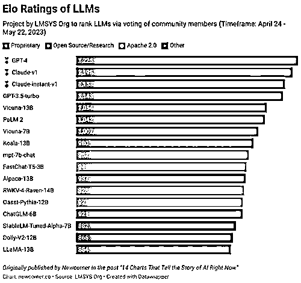

OpenAI 的 GPT-4 获得第一名🥇Anthropic 和开源项目 Vacuna 在 LLMs 中处于领先

Chatbot Arena（https://chat.lmsys.org/?leaderboard）是一个基于大众参与的大型语言模型（LLM）基准平台，通过匿名、随机的语言模型对决来进行评估。经过超过 27,000 次对决，OpenAI 的 GPT-4 获得了第一名。

与此同时，由 OpenAI 的离职员工创立的初创公司 Anthropic 凭借其 LLM 版本 Claude 分别获得了第二名和第三名。但最令人惊讶的排名出现在第五名的 Vicuna-13B 上。Vicuna 是一个开源语言模型，由多所大学合作于三月份推出，它是基于 Stable Diffusion 进行开发的。Vicuna 和其他开源模型的表现给人们带来了希望，即私人公司可能无法独占这场技术竞赛。

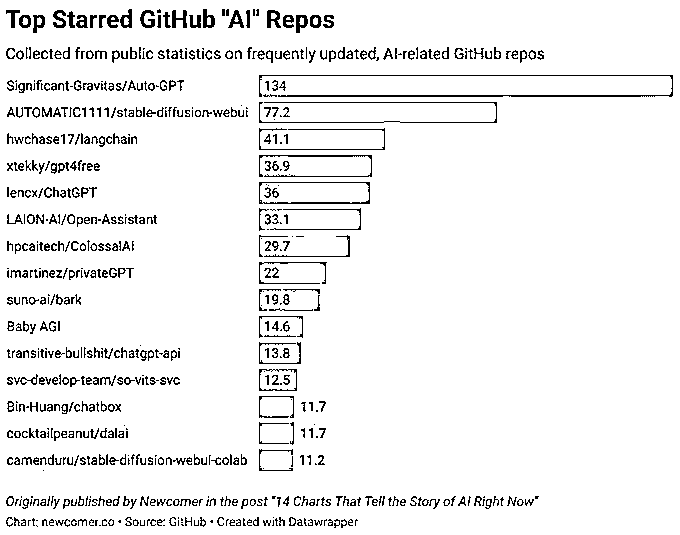

GitHub AI 明星榜：AutoGPT 排首位

GitHub 上的榜单让我们了解 AI 开发者项目的受欢迎程度，下面的图表显示了平台上一些最受关注的 AI 项目库。

到目前为止，最受欢迎的存储库是 Auto-GPT，它是一个开源尝试，旨在使 GPT-4 完全自主。其他一些非常活跃的存储库包括用于流行项目（如 Stable Diffusion）的协作 Web 用户界面，以及在本地计算机上运行 Facebook 开源项目 LLaMa 的方法，以及用于 GPT-4/GPT-3.5 驱动的聊天的桌面应用程序。此外，还有一些旨在简化 AI 开发的技术，如 LangChain（通过可组合性实现使用 LLM 构建应用程序）、Open-Assistant（基于聊天的助手）、ColossalAI（专注于分布式技术，使运行大型 AI 模型更便宜、更快）以及像 Bark 和 SoftVC VITS 这样的生成式音频模型。

GPT-Engineer just hit 12,000 stars on Github.

It's an AI agent that can write an entire codebase with a prompt and learn how you want your code to look.

▸ Asks clarifying questions

▸ Generates technical spec

▸ Writes all necessary code

▸ Easy to add your own reasoning steps, modify, and experiment

▸ Lets you finish a coding project in minutes.

https://github.com/AntonOsika/gpt-engineer

GAIA-1：一款先进的生成式 AI 模型，用于自主驾驶博客链接：https://wayve.ai/thinking/introducing-gaia1/

GAIA-1 是一种新型的生成式 AI 模型，可通过利用视频、文本和动作输入来创建逼真的行车视频。

它提供了对自我车辆行为和场景特征进行细粒度控制的能力，非常适合研究、仿真和培训等目的。

GAIA-1 的推出为自主驾驶领域中的研发和创新提供了无限可能性。

GAIA-1: A Cutting-Edge Generative AI Model for Autonomy

blog: https://wayve.ai/thinking/introducing-gaia1/

GAIA-1 is a new generative AI model for autonomy that creates realistic driving videos by leveraging video, text and action inputs. It offers fine-grained control over ego-vehicle behaviour and scene features, making it ideal for research, simulation, and training purposes. The launch of GAIA-1 provides endless possibilities for R&D and innovation in the field of autonomy.

Agents 🤖 built with the

@OpenAI

function API can do advanced data analysis out of the box 🕵️

We’re excited to introduce a brand-new cookbook highlighting these tasks + limitations! 🧑‍🍳👇

https://gpt-index.readthedocs.io/en/latest/examples/agent/openai_agent_query_cookbook.html

I made a little 3D modeller called #picoCAD !

Build tiny things!

🫧 https://johanpeitz.itch.io/picocad

https://twitter.com/i/status/1670190834732634113

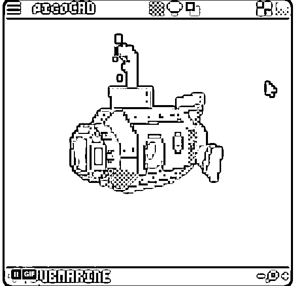

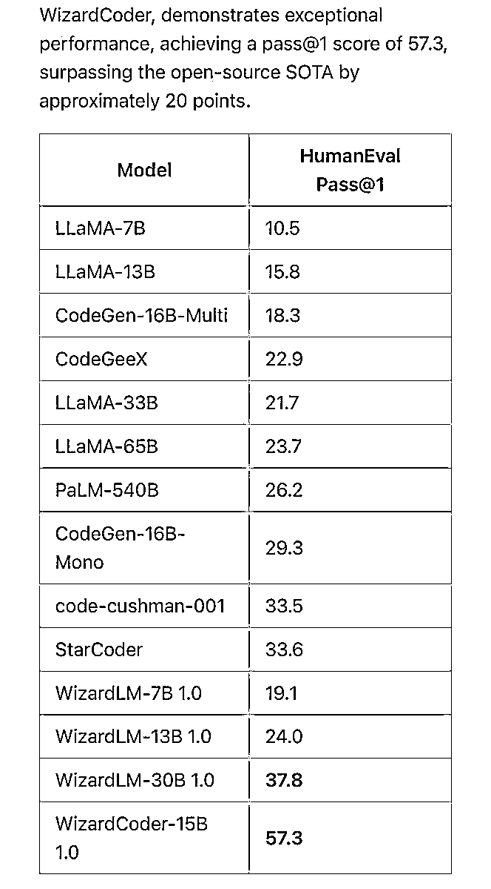

WizardCoder-15B is crushing it‼️🔥

Amazing progress in open-source code LLMs recently. I believe open-source may have progressed beyond closed-source models in this area.

https://github.com/nlpxucan/WizardLM

Robin-7b-v2 is a model finetuned from LLaMA-7B and it scored 51.7 in the OpenLLM leaderboard.

@ClementDelangue

Checkpoints are released: https://huggingface.co/OptimalScale/robin-7b-v2-delta

Try our online demo from HF space:

https://huggingface.co/spaces/OptimalScale/Robin-7b

You can run Stable Diffusion locally on your Macbook, iPad and iPhone, without cloud GPU. Thanks to Core ML and 6-bit palettization. Download the Diffuser app by

@huggingface

from App store.

https://apps.apple.com/app/diffusers/id1666309574

Prompt Share: Multi-Panel Art 🖼️🤯🖼️

Do you have a comic strip idea and would like to generate several comic panels? Or maybe you have an idea for a multiple panel wall art piece 🤔

While working on a comic today, I wanted to view multiple panels at once instead of having to perform several re-rolls and burn fast time.

This led me to coming up with the following simple prompt:

Prompt: [Number] panel [Comic Page or Wall Art] of [Scene], style of [Art Type], 2D --style raw

If you found this prompt tip helpful, likes and retweets are always appreciated ♻️

Enjoy and share away! 🤩

Prompt -> ALTS

10 倍提升工作效率？用好 ai 工具，10x 只是刚刚开始

22 款日常工作效率工具，轻松应对超级卷

http://Emailmagic.ai - 1 秒自动生成邮件回复，或一个指令快速生成邮件的工具

http://60sec.site - 在 60 秒内创建网站

http://Eightify.app - 1 分钟看完 1 小时的视频？YouTube 视频摘要可以做到

http://Scisummary.com/ai - 读长文神器：科学文章摘要工具

http://Vizologi.com - 商业计划工具

http://Krisp.ai - AI 会议助手

http://Aiseo.ai - AI 写作工具

http://Gptgo.ai - 使用 ChatGPT 的搜索引擎

http://Scribblediffusion.com - 将草图转换为图像的工具

http://Cohesive.so - AI 内容生成器

http://Ai.nero.com - AI 图像增强器

http://Magicbrief.com - 故事板和广告的 AI 工具

http://Chatling.ai - 自定义 AI 个人聊天机器人

http://Rows.com/ai - 数据分析和 Excel 的 AI 工具

http://Roomgpt.io - 使用 AI 重新设计房间的工具

http://Trinka.ai - 提升学术写作的工具

http://Genmo.ai - 从文本创建视频的工具

http://Lovo.ai - AI 语音生成器

http://Meetcody.ai - 商务助手

http://Gitmind.com - 头脑风暴工具

http://Translate.video - 一键翻译视频

http://2short.ai - 快速创建短视频的工具

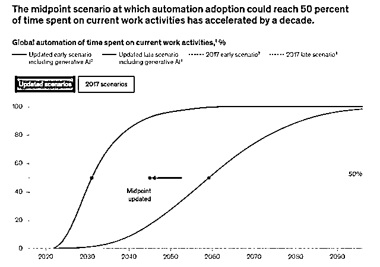

6 月 14 日，麦肯锡发布了的一份题为《生成式人工智能的经济潜力》的研究报告

报告中，分析师们通过对 47 个国家及地区的 850 种职业（全球 80%以上劳动人口）的研究，探讨了在 AI 成指数级发展背后，对全球经济将带来的影响，哪些行业冲击最大，哪些人面临失业威胁？以下为报告主要内容：

1、AI 取代人类工作的时间被大幅提前了 10 年，在 2030 年至 2060 年间（中点为 2045 年）50%的职业逐步被 AI 取代。

2、AI 每年可为全球经济带来 2.6 万亿至 4.4 万亿美元的增长，生产力提高 0.1%—0.6%，相当于每年贡献一个英国的 GDP。

3、全局上看 AI 对各行各业的发展有利，但是对个人不利，而高薪、高学历的脑力劳动者受到的冲击最大。

4、生成式 AI 带来的价值增长，主要（约 75%）集中在四个领域：客户运营、营销和销售、软件工程和研发，这也意味着四项业务受生成式 AI 影响最大。

5、生成式人 AI 及其他科技的发展或将使当前工作的 60%到 70%实现自动化。其中，银行业、高科技行业和生命科学等行业所受的影响最大。

https://twitter.com/i/status/1670219559511420929

VideoComposer: Compositional Video Synthesis

with Motion Controllability models are out!

paper page: https://huggingface.co/papers/2306.02018

github: https://github.com/damo-vilab/videocomposer

The pursuit of controllability as a higher standard of visual content creation has yielded remarkable progress in customizable image synthesis. However, achieving controllable video synthesis remains challenging due to the large variation of temporal dynamics and the requirement of cross-frame temporal consistency. Based on the paradigm of compositional generation, this work presents VideoComposer that allows users to flexibly compose a video with textual conditions, spatial conditions, and more importantly temporal conditions. Specifically, considering the characteristic of video data, we introduce the motion vector from compressed videos as an explicit control signal to provide guidance regarding temporal dynamics. In addition, we develop a Spatio-Temporal Condition encoder (STC-encoder) that serves as a unified interface to effectively incorporate the spatial and temporal relations of sequential inputs, with which the model could make better use of temporal conditions and hence achieve higher inter-frame consistency. Extensive experimental results suggest that VideoComposer is able to control the spatial and temporal patterns simultaneously within a synthesized video in various forms, such as text description, sketch sequence, reference video, or even simply hand-crafted motions

卧槽，这玩意有点离谱的，将 Chat GPT 和 SD 的能力进行了整合，在一个界面里用自然语言编写游戏代码，并且生成游戏素材，然后整合成一个游戏。

看起来完成度挺高的，视频里做了一个飞行弹幕射击游戏。

感兴趣可以这里加入等待列表：https://forms.clickup.com/36255767/f/12je0q-12000/TZ6KFY35F3LKVYU6CB

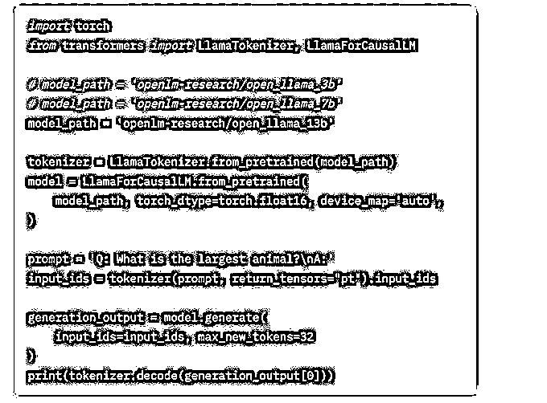

OpenLLaMA 13B Released

model: https://huggingface.co/openlm-research/open_llama_13b

present a permissively licensed open source reproduction of Meta AI's LLaMA large language model. We are releasing 3B, 7B and 13B models trained on 1T tokens. We provide PyTorch and JAX weights of pre-trained OpenLLaMA models, as well as evaluation results and comparison against the original LLaMA models.

一个 AI 换发型的工具，感觉这玩意会很有市场，在想更换发型之前做一个预览看看是否符合自己的需求。

而且现在用 SD 做这种工具也不是很难，这个应用只有男性应用，我记得这几天在 C 站也看到一个发型 Lora 连模型都不需要自己炼了。

感兴趣的朋友可以做一个试试看。

产品地址：https://barbergpt.ai

Chat Cat 是一个基于 ChatGPT 的智能助手应用，里面充满了可爱的猫咪角色。不同的猫咪拥有预设的不同提示，以应对不同的需求。

Chat Cat 不仅能够回答你的问题，还可以提供有趣的对话和交流。无论你需要获得实时的天气预报、寻求旅行建议，还是只是想和一只可爱的猫咪角色聊天，Chat Cat 都能够满足你的需求。

你可以在 App Store 上下载 Chat Cat，尽情享受与可爱猫咪助手的互动吧！

Autobet PRO 是一款利用人工智能技术进行即时体育博彩的强大工具。通过 Autobet PRO，您可以提高体育博彩的准确性和盈利潜力。

该软件采用先进的机器学习算法，结合大数据分析和实时比赛数据，为您提供全面的赛前和赛中分析，以辅助您做出更明智的博彩决策。无论您是新手还是有经验的博彩玩家，Autobet PRO 都能为您带来更高的胜率和更多的盈利。

您只需注册 Autobet PRO 平台，设置个人偏好和投注策略，即可轻松享受到人工智能为您带来的博彩优势。无论是足球、篮球、网球还是其他热门体育项目，Autobet PRO 都能为您提供精确的数据和分析，助您在博彩市场中获得更多胜利。

点击此处了解更多关于 Autobet PRO 的信息。

https://chatbene.com/autobetpro

Carlos App 是一款免费的 AI 语言辅导应用，提供覆盖 50 多种第二语言的语言辅导服务。

该应用通过语音为用户提供沉浸式培训，帮助用户提升语言水平。无论您想学习哪种语言，Carlos App 都可以成为您的个人语言导师。与 ChatGPT 对话，您可以用任何语言进行交流。

Carlos App 提供高质量的语音识别和语音合成技术，确保您可以自由地练习口语、听力和阅读。不论您是想提高商务沟通能力、准备国际考试，还是仅仅想学习新语言，Carlos App 都能满足您的需求。

欲了解更多信息，请访问 Carlos App 官网。

Qreative AI 是一个革命性的平台，利用 AI 技术创建引人注目、艺术化的 QR 码。它旨在为企业提供一个独特、吸引眼球的工具，增强其数字化存在和观众参与度。

无论是用于产品包装、海报、活动宣传还是广告媒体，Qreative AI 都能够为企业创造出与众不同的 QR 码设计。其强大的 AI 引擎可以将普通的黑白二维码转化为充满创意、具有艺术感的作品。不仅可以定制颜色、形状和纹理，还能通过不同的图案、图像和艺术效果展现品牌的独特风格和价值。

Qreative AI 的平台简单易用，无需任何设计技能或编程知识。只需上传您的标志、图像或文本，选择适合您品牌形象的风格，Qreative AI 将为您生成令人惊叹的艺术 QR 码。您可以将其应用于各种渠道，包括网站、社交媒体、产品包装、展览和印刷品，以吸引和引导目标受众。

您可以通过访问 Qreative AI 官网 获取更多信息。

Txt/Img to 3D model, that allow you to generate 3D model from txt or image, basing on OpenAI Shap-E.

The GitHub is https://github.com/jtydhr88/sd-webui-txt-img-to-3d-model

Or you can install from webui inside, it is already included in the extension index.

Key features: integrated OpenAI Shap-E in your webui and be able to generate 3D model by txt or image.

Chat2DB 是一款有开源免费的多数据库客户端工具，支持 windows、mac 本地安装，也支持服务器端部署，web 网页访问。和传统的数据库客户端软件 Navicat、DBeaver 相比 Chat2DB 集成了 AIGC 的能力，能够将自然语言转换为 SQL，也可以将 SQL 转换为自然语言，可以给出研发人员 SQL 的优化建议，极大的提升人员的效率，是 AI 时代数据库研发人员的利器，未来即使不懂 SQL 的运营业务也可以使用快速查询业务数据、生成报表能力。

https://github.com/alibaba/Chat2DB

GitHub CEO：很快 AI 将能实现 80%的编程

昨天，GitHub CEO Thomas Dohmke 与 Freethink 进行一个对话，在这个对话访谈中，Thomas Dohmke 说 Copilot 很快将可以实现 80%的代码编程（Copilot will write 80% of code “sooner than later”），而现在这个数字大概在 50%左右。

同时，Thomas Dohmke 分享说，在今年 2 月份正式发布 GitHub Copilot for Business 版本后，现在已经有超过 1 万家企业客户在使用 Copilot 的企业版，比方说像可口可乐以及 Airbnb 等这样的企业，而微软本身也有 3 万多名员工在使用企业版的 Copilot，并在其帮助下进行编程。

由于这整个对话比较长，我简单分享了几个我觉得有价值的点：

从系统思维的角度来看，未来的开发者需要做的事情是：理解软件的复杂性，并能够将一个非常大的问题、挑战或新特性分解成小问题，这将发挥越来越重要的作用。作为开发人员，我们需要能够管理解决大型复杂问题的大型复杂系统。而且，你需要能够将它们分解为小的构建块。有了 Copilot 后，程序员的工作将变得更加专注，它可以让你在有限的编程时间更加有创造力，因为你不再需要在各种其它产品（编辑器、浏览器、搜索引擎）之间来回切换。对于创业公司来说，快速行动是其生存的唯一途径，即使只是提高 20-25%的生产力，也可能会决定他们的生存能力。GitHub 在 2020 年正式开始研究 Copilot，在正式推出 Copilot 前他们在内部和 Github 客户里都做了一些测试，得到的反馈非常好，之前没有任何一款产品（功能）能获得这么好的反馈，无论是留存率还是其它指标，都没有一款产品可以与 Copilot 相比。GitHub 通过跟踪其客户和社区用户的使用习惯，得出目前已经有接近 50%的编程是通过 Copilot 完成的，而且这个比例还在不断提高。同时，通过对使用 Copilot 和没有使用 Copilot 的开发者进行的测试表明，使用 Copilot 比没有使用的效率提升了 55%，并且成功率也要高 78%vs70%，即使只是提高 55%，这也会改变整个行业。对于 AI 给教育带来的变革，Thomas Dohmke 认为知识的重要性将会降低，而掌握推理、探索内容的能力——知道如何确定 AI 提供的内容是否真正是正确答案——将变得至关重要。老师将与孩子们一起学习如何做到这一点。学生们必须弄清楚，AI 给出的是否真正是我正在解决的问题的答案，还是模型在产生幻觉？GitHub 一直在为开源开发者的权利而战，因为我们相信开源是实现人类进步的基础。开源所带来的协作模式可能是存在的最无边界和最无障碍的协作模式：来自全球各个国家的开发者相互合作，他们不关心我们在这个星球上所面临的所有其他冲突。

除了通过传统的打字输入，GitHub 也开发了一款通过声音输入实现编程的产品 Copilot Voice，这将解放你的双手，同时也让那些残疾人可以直接用语音实现编程的梦想。

MagicBrush：用于指令引导图像编辑的手动注释数据集

纸页： https://huggingface.co/papers/2306.10012

日常生活中广泛需要文本引导的图像编辑，从个人使用到 Photoshop 等专业应用程序。然而，现有方法要么是零样本，要么是在包含大量噪声的自动合成数据集上训练的。因此，它们仍然需要大量手动调整才能在实践中产生理想的结果。为了解决这个问题，我们引入了 MagicBrush （ https://osu-nlp-group.github.io/MagicBrush/ ），这是第一个用于指令引导的真实图像编辑的大规模、手动注释的数据集，涵盖了多种场景：单轮、多轮、掩模提供和掩模-免费编辑。 MagicBrush 包含超过 10K 个手动标注的三元组（源图像、指令、目标图像），支持训练大规模文本引导图像编辑模型。我们对 MagicBrush 上的 InstructPix2Pix 进行了微调，并表明新模型可以根据人类评估生成更好的图像。我们进一步进行了广泛的实验，以从多个维度评估当前的图像编辑基线，包括定量、定性和人类评估。结果揭示了我们数据集的挑战性以及当前基线与现实世界编辑需求之间的差距。

视频创作者必买工具、跨境电商必备工具 #heygen 它功能很全也很强就是贵

1、虚拟数字人

2、生成自己的头像，类似 D-ID

3、真人主播，可以上传自己的照片换脸

4、模版多可以随便用

5、内嵌 ChatGPT 直接生成文案

6、亚马逊链接一键生成真人卖货视频

好用推荐，直达传送门

https://bit.ly/46oo0n5

CLIPSonic: Text-to-Audio Synthesis with Unlabeled Videos and Pretrained Language-Vision Models

paper page: https://huggingface.co/papers/2306.09635…

Recent work has studied text-to-audio synthesis using large amounts of paired text-audio data. However, audio recordings with high-quality text annotations can be difficult to acquire. In this work, we approach text-to-audio synthesis using unlabeled videos and pretrained language-vision models. We propose to learn the desired text-audio correspondence by leveraging the visual modality as a bridge. We train a conditional diffusion model to generate the audio track of a video, given a video frame encoded by a pretrained contrastive language-image pretraining (CLIP) model. At test time, we first explore performing a zero-shot modality transfer and condition the diffusion model with a CLIP-encoded text query. However, we observe a noticeable performance drop with respect to image queries. To close this gap, we further adopt a pretrained diffusion prior model to generate a CLIP image embedding given a CLIP text embedding. Our results show the effectiveness of the proposed method, and that the pretrained diffusion prior can reduce the modality transfer gap. While we focus on text-to-audio synthesis, the proposed model can also generate audio from image queries, and it shows competitive performance against a state-of-the-art image-to-audio synthesis model in a subjective listening test. This study offers a new direction of approaching text-to-audio synthesis that leverages the naturally-occurring audio-visual correspondence in videos and the power of pretrained language-vision models.

由翻译自 英语

CLIPSonic：使用未标记视频和预训练语言视觉模型的文本到音频合成

纸页： https://huggingface.co/papers/2306.09635…

最近的工作使用大量成对的文本音频数据研究了文本到音频的合成。但是，很难获得带有高质量文本注释的录音。在这项工作中，我们使用未标记的视频和预训练的语言视觉模型来处理文本到音频的合成。我们建议通过利用视觉模态作为桥梁来学习所需的文本-音频对应关系。我们训练一个条件扩散模型来生成视频的音轨，给定一个由预训练的对比语言图像预训练 （CLIP） 模型编码的视频帧。在测试时，我们首先探索执行零样本模态传输，并使用 CLIP 编码的文本查询来调节扩散模型。但是，我们观察到图像查询的性能明显下降。为了缩小这一差距，我们进一步采用预训练的扩散先验模型在给定 CLIP 文本嵌入的情况下生成 CLIP 图像嵌入。我们的结果表明了所提出方法的有效性，并且预训练的扩散先验可以减少模态转移差距。虽然我们专注于文本到音频的合成，但所提出的模型还可以从图像查询生成音频，并且在主观听力测试中显示出与最先进的图像到音频合成模型相比具有竞争力的性能。这项研究提供了一种接近文本到音频合成的新方向，它利用视频中自然发生的视听对应和预训练语言视觉模型的力量。

## 6 月 20 日

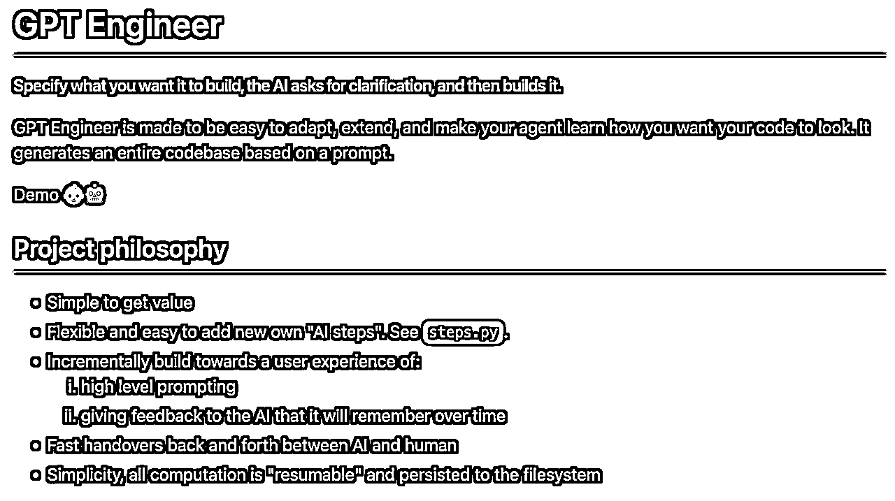

最近对 GPT-Engineer 评价不错

你只需要通过一个提示指定你想要构建什么，AI 代理就会构建整个代码库。

它完全免费且开源，而且在 GitHub 上已经接近 17000 颗星了🤯

In MyShell TTS, How to make AI mimic anyone's speech, in a casual way?

Only 1 minute of audio

https://app.myshell.ai/robot-workshop

Sundar Pichai 推出了一项革命性的#healthcare 技术，该技术采用#AI 和眼部扫描来预测心血管事件，并且非常准确。这一新发展可能会消除 CT 扫描、MRI 和 X 射线的必要性，使医生能够清楚、全面地了解患者的内部状况。皮查伊强调，这项突破性技术凸显了人工智能在彻底改变患者护理方面的变革潜力。

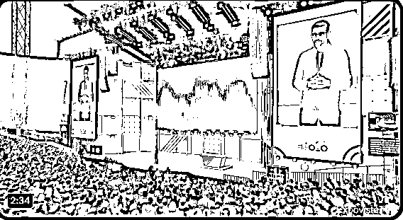

《又来 10 个 AI 新工具，让你效率倍增》

1。 AI 广告工具和数据大屏

http://Magicbrief.com

2。定制 AI 聊天机器人

http://Chatling.ai

3。 AI 版的 Excel

http://Rows.com/ai

4。 AI 室内设计

http://Roomgpt.io

5。总结科学论文

http://Scisummary.com/ai

6。升级您的学术写作

http://Trinka.ai

7。从文字中创建视频

http://Genmo.ai

8。 在线约会助理

http://Datingai.pro

9。生成 AI 表格网站

http://Feathery.io

10。业务助理

http://Meetcody.ai

20+ AI PPT 演示工具

1。 Tome

https://aimart.app/products/tome

2\. Gamma

https://aimart.app/products/gamma

3\. AudaOS

https://aimart.app/products/audaos

4\. AutoSlide

https://aimart.app/products/autoslide

5\. Beautiful AI

https://aimart.app/products/beautiful-ai

6\. ChatBA

https://aimart.app/products/chatba

7\. Chronicle

https://aimart.app/products/chronicle

8\. Decktopus

https://aimart.app/products/decktopus-ai

9\. Glimmer

https://aimart.app/products/glimmer

10\. MagicSlides

https://aimart.app/products/magicslides

11\. Motionit AI

https://aimart.app/products/motionit-ai

12\. Peach

https://aimart.app/products/peach

13\. Pitch

https://aimart.app/products/pitch

14\. Pitches AI

https://aimart.app/products/pitches-ai

15\. Plus AI

https://aimart.app/products/plus-ai-for-google-slides

16\. Powepresent AI

https://aimart.app/products/powepresent-ai

17\. Premast

https://aimart.app/products/premast

18\. Presentations AI

https://aimart.app/products/presentations-ai

19\. Prezo

https://aimart.app/products/prezo

20\. Sidebean

https://aimart.app/products/sidebean

21\. Slides AI

https://aimart.app/products/slides-ai

22\. Slidego

https://aimart.app/products/slidesgo

23\. Storyd

https://aimart.app/products/storyd

24\. Zillion Pitches

https://aimart.app/products/zillion-pitches

The Mathematical Playground（数学游乐场）一个有趣的地方

提供免费工具、课程和教具，使在线学习比以往任何时候都更具互动性和吸引力，发现数学的巨大力量和意想不到的美

https://mathigon.org

Farewell to Prompt ->🔴AutoPrompt: revolutionary

⌚️Create pro robots in 1 min

💡Inspired by 'division of labor' concept from #ToolMaker research, access web knowledge

@tianle_cai

🧠Self-learning & continuous optimization

https://app.myshell.ai/robot-workshop

告别提示 - >🔴自动提示：革命性的

⌚️ 1 分钟打造专业机器人

💡受#ToolMaker 研究中“分工”概念的启发，获取网络知识

@tianle_cai

🧠自学和持续优化

Just built this - generate a fully illustrated picture book using a single text prompt

Uses function calling with

@LangChainAI

@OpenAI

,

@replicatehq

for stable diffusion,

@activeloopai

Deep Lake to store prompts + images

Check it out: https://github.com/e-johnstonn/FableForge…

刚刚构建这个 - 使用单个文本提示生成一本插图完整的图画书

使用函数调用

@LangChainAI

@OpenAI

,

@replicatehq

稳定传播，

@activeloopai

Deep Lake 存储提示+图像

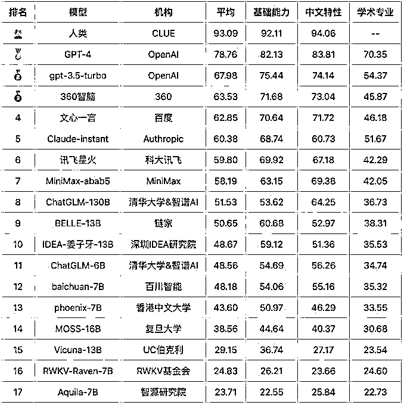

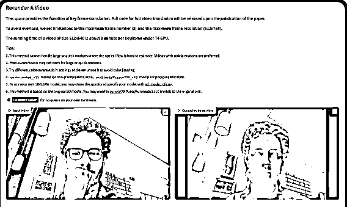

Every day, there's a new exciting paper demo on the hub, it's hard to keep up! New AI video-to-video translation

https://huggingface.co/spaces/Anonymous-sub/Rerender

OpenLLaMA 发布了！

这是 Meta AI 的 LLaMA 7B 和 13B 的开源再现（意味着可商用）。

这是一个在 RedPajama 数据集上训练的许可复制品。提供预训练的 OpenLLaMA 模型的 PyTorch 和 JAX 权重，以及评估结果和与原始 LLaMA 模型的比较

https://github.com/openlm-research/open_llama

4 free AI-powered resume builders:

1\. http://Resumaker.ai

Auto-complete and fill in data for you.

2\. http://Kickresume.com

Build a resume with ChatGPT.

3\. http://Rezi.ai

Create a resume with AI in minutes.

4\. http://ResumAI.com

AI resume writing assistant.

You Can Create Custom AI Videos In Just Seconds

Bookmark these 10 AI Video Generator Tools to make you a pro:

1) Pictory ➝ http://pictory.ai

2) Fliki ➝ http://fliki.ai

3) Hour One ➝ http://hourone.ai

4) D-ID ➝ http://d-id.com

5) Xpression Camera ➝ http://xpressioncamera.com

6) Colossyan ➝ http://colossyan.com

7) Rephrase .ai ➝ http://rephrase.ai

8) Deepbrain AI ➝ http://deepbrain.io

9) Vidyo .AI ➝ http://vidyo.ai

10) Synthesia ➝ http://synthesia.io

CLIP-based research is moving so fast that even authors cannot keep pace with arXiv

There are currently 3 MaskCLIP papers out there (all published in major conferences):

- https://arxiv.org/abs/2112.01071

- https://arxiv.org/abs/2208.08984

- https://arxiv.org/abs/2208.12262

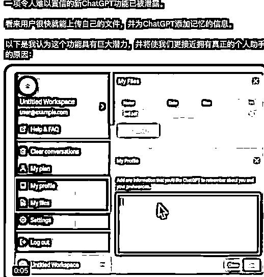

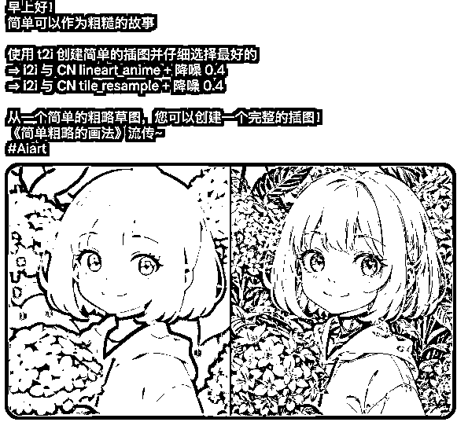

输入要修改的图片内容，一键完成 P 图。一般，胜在无需蒙板圈选 P 图区域。

项目地址：https://osu-nlp-group.github.io/MagicBrush/

Github: https://github.com/OSU-NLP-Group/MagicBrush

论文：https://arxiv.org/abs//2306.10012

fiverr.com 作为海外兼职平台，提供了各种 AI 相关的服务，包括 AI 写作、AI 绘画、ChatGPT 应用等，价格在几美元到几百美元不等

利用 ChatGPT，Midjourney 等 AI 工具，配合 Fiverr 这样的全球化交易平台，创造收益的途径变得越来越多元化

Come say hi at #CVPR23

Will be presenting the project behind WhisperX

AutoAD: Movie Description in Context. June 22, Thu AM

(Highlight, Poster 234).

We train a model to automatically generate audio descriptions

https://robots.ox.ac.uk/~vgg/research/autoad/

https://theregister.com/2023/06/08/scientists_ai_recognition/…

科学家声称 ChatGPT 内容识别率超过 99%

科学家们声称已经开发出一种机器学习算法，可以以超过 99% 的准确率检测出由 ChatGPT 生成的科学论文。

该算法经过训练，可以将科学家和 ChatGPT 撰写的论文进行分类，并且能够 100% 地区分人类真实科学写作和 AI 生成的论文。

然而，该研究的范围有限，需要进行后续研究以确定该方法的适用性。

一些评论者对研究方法和结果的有用性表示怀疑，而其他人则讨论了 AI 生成内容的潜在影响以及检测抄袭的难度。

FashionAI：一键换衣服的工具

可以一键修改服装的风格或者颜色、款式。例如，你可以将原始照片中的衬衫修改为带有花朵、蓝色闪光或黑色波点的样式。

http://fashionai.me

https://github.com/e-johnstonn/FableForge

一句话绘本生成

Running SXM2/SXM3/SXM4 NVidia data center GPUs in consumer PCs

https://l4rz.net/running-nvidia-sxm-gpus-in-consumer-pcs/?utm_source=moelove

低成本组装计算机用于 AI 计算

## 6 月 21 日

Midjourney 的免费平替

Stable Diffusion 保姆级入门手册

https://mp.weixin.qq.com/s/nhB7Hsjz_aLkSrUT0mqHWw…

一份由腾讯云开发者写的微信公众文章，给想玩 AI 的新手-Stable Diffusion 保姆级入门手册，从硬件要求、环境部署安装到参数配置、模型下载安装使用训练等等，手册手把手教大家入门 Stable Diffusion。

微软 2023 年 Build 大会演讲：如何训练和应用 GPT（中英文字幕）

这是本次微软 2023 年 Build 大会来自 OpenAI 的 AI 研究员和创始成员 Andrej Karpathy 的一个主题为 State of GPT 的演讲。

演讲主要有两部分内容：

都是非常有价值的分享。

首先对于如何训练 GPT，通常来说是四个阶段预训练（Pretraining），有监督的微调（Supervised Finetuning），奖励建模（Reward Modeling）和强化学习（Reinforcement Learning），这几个阶段通常是依次进行，每个阶段都有不同的数据集。

预训练（Pretraining）：

这个阶段的目标是让模型学习一种语言模型，用于预测文本序列中的下一个单词。训练数据通常是互联网上的大量文本。模型从这些文本中学习词汇、语法、事实以及某种程度的推理能力。这个阶段结束后，模型可以生成一些有意义且语法正确的文本，但可能无法理解具体任务的需求。

有监督的微调（Supervised Finetuning）：

在预训练后，模型会进入微调阶段。在这个阶段，人类评估员将参与并给出指导，他们会给模型提供对话样本，样本中包含了输入和期望的输出。这使得模型能更好地适应特定任务或应用，例如回答问题或编写文章。

奖励建模（Reward Modeling）：

评估员将对模型生成的不同输出进行排名，以表示它们的质量。这个排名将被用作奖励函数，指导模型优化其生成的输出。

强化学习（Reinforcement Learning）：

强化学习阶段是一个迭代的过程，模型会试图优化其行为以获得最大的奖励。在这个阶段，模型会产生新的输出，评估员会对这些输出进行排名，然后模型根据这个反馈调整其行为。

然后是如何有效应用 GPT

在演讲中 Andrej 举了一个非常好的例子：人类和大语言模型（LLM）都是如何写作的？从这个例子中你能明显感觉到人类和 GPT 之间的差异。

假设你要写一篇文章去比较加利福尼亚州和阿拉斯加州的人口，你的写作的过程中可能是像这样的：

也就是说，当人类写作时，哪怕是这样一个简单的句子，可能内心实际上进行了大量的运算的。

但当我们用 GPT 进行写作这样的句子看起来会是什么样呢？

从 GPT 的角度看，这只是一系列的标记（Tokens）。当 GPT 在接收到一个输入，比如你给出的主题。它会生成一段与输入相关的文本，GPT 的目标是预测下一个词，所以它会连续生成一串词，形成一段连贯的文本。

从本质上看，Transformer 只是标记模拟器，它不知道自己知道什么不知道什么，它不知道自己擅长什么或不擅长什么，它只是尽力生成下一个标记，它也不会进行反思，也不会不进行任何合理性检查。它不会纠正自己的错误，它只是产生抽样的标记序列，它没有像人类那样的内心独白流。

但是，GPT 有一些优势，如它们拥有大量的基于事实的知识，并且拥有相对大的并且完美的工作记忆。GPT 通过自我注意力机制，能立即获取到上下文窗口中的信息，从而进行无损记忆。然而，GPT 在推理和判断方面的能力相对较弱，如果提出的问题需要更复杂的推理，单凭一个标记的信息，GPT 往往无法给出正确的答案。

一些技巧可以提升 GPT 的表现，比如 Cot（Chain of Though）设定步骤来引导 GPT 展示其工作过程，或者通过多次抽样然后选择最佳结果等，或者可以让 GPT 检查自己的输出，比如询问它是否完成了任务，最好是在 Prompt 中明确的要求它检查自己的输出。

后面还介绍了目前比较流行的 GPT 应用，比如 Agent、Plugin、CoT、Embedding 等

最后他用 GPT-4 写了一个结尾：

“女士们，先生们，2023 年 Microsoft Build 的创新者和先驱者们，欢迎来到这个独一无二的卓越人才的集结地。你们是未来的架构师，是塑造数字领域的视野家，在那里人类繁荣发展。拥抱科技的无限可能，让你的想法飞得和你的想象力一样高。让我们一起创造一个更连通，更出色，更包容的世界，为未来的世代留下。准备好释放你的创造力，探索未知，把梦想变成现实。你的旅程今天开始。”

原始视频地址：

https://build.microsoft.com/en-US/sessions/db3f4859-cd30-4445-a0cd-553c3304f8e2

by 宝玉

熟悉 Prompt 的同学们应该都知道，通常在写 Prompt 的时候要先设定角色：“你是 XX 方面的专家”，这并非玄学，而是有科学根据的。

GPT 在训练的时候，有各种训练数据，有的质量高有的质量低，而默认情况下，生成高质量数据和低质量数据的概率差不多，但是当你给它设定 XX 专家的角色时，它会尽可能把概率分布在高质量的解决方案上。

详细内容建议看下面这段 Andrej Karpathy 在 State of GPT 中的一段演讲。

以下是这段视频的文字文字内容：

----------

下面我要讲的这点对 LLM 的理解非常有趣，我觉得这算是 LLM 的一种心理特性：LLM 并不追求成功，而是追求模仿。你希望它成功，那就需要向它明确要求。这里的意思是，在训练 Transformer 的过程中，它们有各种训练集，而这些训练数据中可能涵盖了各种不同质量的表现。比如，可能有一个关于物理问题的提示，然后可能有学生的解答完全错误，但也可能有专家的答案完全正确。尽管 Transformer 可以识别出低质量的解决方案和高质量的解决方案，但默认情况下，它们只会模仿所有的数据，因为它们仅仅是基于语言模型进行训练的。

在实际测试中，你其实需要明确要求它表现得好。在这篇论文的实验中，他们尝试了各种提示。例如，“让我们逐步思考”这种提示就很有效，因为它把推理过程分散到了许多记号上。但效果更好的是这样的提示：“让我们以一步一步的方式解决问题，以确保我们得到正确的答案。” 这就好像是在引导 Transformer 去得出正确的答案，这会使 Transformer 的表现更好，因为此时 Transformer 不再需要把它的概率质量分散到低质量的解决方案上，尽管这听起来很荒谬。

基本上，你可以自由地要求一个高质量的解决方案。比如，你可以告诉它，“你是这个话题的领先专家。假装你的智商是 120。” 但不要尝试要求太高的智商，因为如果你要求智商 400，可能就超出了数据分布的范围，更糟糕的是，你可能落入了类似科幻内容的数据分布，它可能会开始展现一些科幻的，或者说角色扮演类的东西。所以，你需要找到适合的智商要求。我想这可能是一个 U 型曲线的关系。

Infinite Photorealistic Worlds using Procedural Generation

paper page: https://huggingface.co/papers/2306.09310…

introduce Infinigen, a procedural generator of photorealistic 3D scenes of the natural world. Infinigen is entirely procedural: every asset, from shape to texture, is generated from scratch via randomized mathematical rules, using no external source and allowing infinite variation and composition. Infinigen offers broad coverage of objects and scenes in the natural world including plants, animals, terrains, and natural phenomena such as fire, cloud, rain, and snow. Infinigen can be used to generate unlimited, diverse training data for a wide range of computer vision tasks including object detection, semantic segmentation, optical flow, and 3D reconstruction. We expect Infinigen to be a useful resource for computer vision research and beyond.

由翻译自 英语

使用程序生成的无限逼真世界

纸页： https://huggingface.co/papers/2306.09310…

介绍 Infinigen，它是自然世界逼真的 3D 场景的程序生成器。 Infinigen 完全是程序化的：从形状到纹理的每项资产都是通过随机数学规则从头开始生成的，不使用外部源并允许无限变化和组合。 Infinigen 提供广泛的自然界对象和场景覆盖，包括植物、动物、地形以及火、云、雨和雪等自然现象。 Infinigen 可用于为广泛的计算机视觉任务生成无限多样的训练数据，包括对象检测、语义分割、光流和 3D 重建。我们希望 Infinigen 成为计算机视觉研究及其他领域的有用资源。

OpenAI 将发布模型商店！

据 The Information 最新消息，OpenAI 正准备发布一个「模型商店」（marketplace），类似 App Store，企业可以在这个市场里将根据自己需求定制的 AI 模型卖给其他公司。

OpenAI 将会发布一个新的平台，针对定制化模型/软件的交易市场，类似 App Store。目前还不知道它会采取怎样的盈利模式，是否会走 App Store 等平台商店的抽成模式。在这个「模型商店」上，开发者是自己开发定制模型的公司，消费者是需要垂直、定制模型的企业。如果「模型商店」最终落地，OpenAI 将有机会在领先的模型能力之外，再建立起一道生态的壁垒。

TI 采访的知情人士称，OpenAI 希望这种类似 App Store 的交易市场能成为企业获取最新最前沿的 LLM 的途径。举例来看，在垂直应用中，企业可以在模型商店里找到「识别电商交易中的金融欺诈」，或者「用最新消息回答有关特定市场的问题」等能力的模型。

举例来看，在垂直应用中，企业可以在模型商店里找到「识别电商交易中的金融欺诈」，或者「用最新消息回答有关特定市场的问题」等能力的模型。

消息人士认为，OpenAI 创建这样的市场，是为了「对冲未来没有 AI 模型占据绝对领先地位的风险」。目前还不知道 OpenAI 是否会从模型商店的交易中收取抽成，或建立其他盈利模式。「模型商店」也会为 OpenAI 的技术提供更广泛的客户群体，让它能在与 Anthropic 和 Cohere 等企业端竞争对手的竞争中取得优势。OpenAI 的模型商店，将会与它的客户或技术合作伙伴（包括 Salesforce 和微软等）产生竞争。开发者使用 OpenAI 软件创建的 chatbot，可以在这些应用商店上出售访问权限。

Just launched a step-by-step guide to Large Language Models.

Perfect for beginners & experts seeking to deepen their knowledge - from basics of ML/NLP to instruction fine-tuning and weight quantization. Every step backed by curated resources.

GitHub: https://github.com/mlabonne/llm-course

Local LLMs just got 2x faster on M1/M2 Macs



- Supports all LLaMA models

- GPT4All exclusively supports Replit for code gen!

This demo video is 13B parameters running on an M2 Macbook Pro with 16GB of RAM

Run powerful, privacy-aware LLMs anywhere at http://gpt4all.io

微软宣布允许企业在自己的数据上使用 Azure OpenAI 服务

该功能将激发世界各地的企业客户使用 Azure OpenAI 服务！

Azure OpenAI 服务可以直接在你的数据上运行，无需进行额外的训练或微调。这意味着你可以直接使用 OpenAI 的模型（如 ChatGPT 和 GPT-4）来处理你的数据，而无需对模型进行任何修改或调整。

https://techcommunity.microsoft.com/t5/ai-cognitive-services-blog/introducing-azure-openai-service-on-your-data-in-public-preview/ba-p/3847000

QR Code AI Art Generator

discussion: https://huggingface.co/spaces/huggingface-projects/QR-code-AI-art-generator/discussions/4…

demo: https://huggingface.co/spaces/huggingface-projects/QR-code-AI-art-generator…

prompt: A grand city in the year 2100, atmospheric, hyper realistic, 8k, epic composition, cinematic, octane render, artstation landscape vista photography by Carr Clifton & Galen Rowell, 16K resolution, Landscape veduta photo by Dustin Lefevre & tdraw, 8k resolution, detailed landscape painting by Ivan Shishkin, DeviantArt, Flickr, rendered in Enscape, Miyazaki, Nausicaa Ghibli, Breath of The Wild, 4k detailed post processing, artstation, rendering by octane, unreal engine

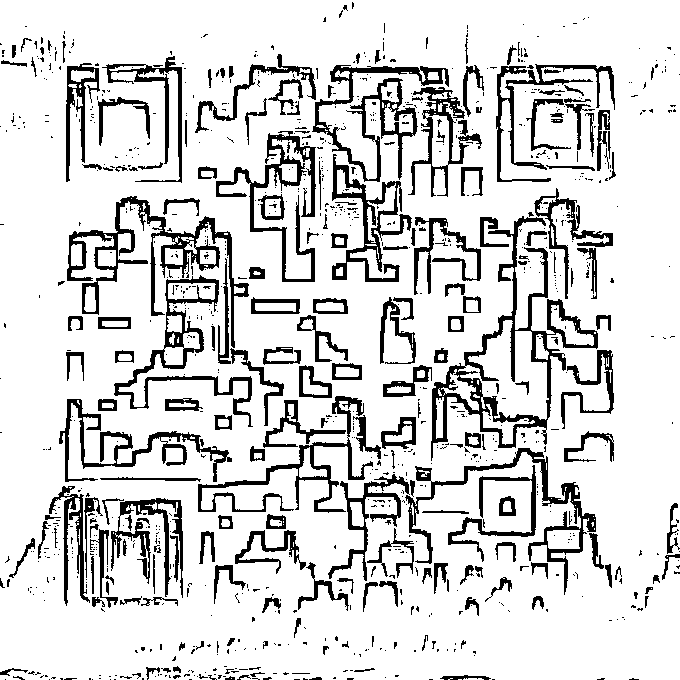

这是一个精心策划的多模态大型语言模型（MLLM）列表，包含了 260 个论文，Pdf 和 github 链接，整理的调理清晰，适合研究使用

包括两大部分：模型和数据集

模型论文

-基础模型，指令调整，情景学习，思维链条，视觉推理

数据集

-对齐预训练，指令调整，情景学习等数据集

https://github.com/BradyFU/Awesome-Multimodal-Large-Language-Models#awesome-multimodal-large-language-models

Thrilled to introduce vLLM with

@woosuk_k

!

vLLM is an open-source LLM inference and serving library that accelerates HuggingFace Transformers by 24x and powers

@lmsysorg

Vicuna and Chatbot Arena.

Github: https://github.com/vllm-project/vllm…

Blog: https://vllm.ai

Want to train your own Bark/MusicGen-like TTS/TTA models?

The SoTA Encodec model by

@MetaAI

has now landed in

Transformers!

It supports compression up to 1.5KHz and produces discrete audio representations.

Model: https://huggingface.co/docs/transformers/main/en/model_doc/encodec#overview…

Colab: https://github.com/Vaibhavs10/notebooks/blob/main/use_encodec_w_transformers.ipynb

DecodingTrust: A Comprehensive Assessment of Trustworthiness in GPT Models

paper page: https://huggingface.co/papers/2306.11698…

Generative Pre-trained Transformer (GPT) models have exhibited exciting progress in capabilities, capturing the interest of practitioners and the public alike. Yet, while the literature on the trustworthiness of GPT models remains limited, practitioners have proposed employing capable GPT models for sensitive applications to healthcare and finance - where mistakes can be costly. To this end, this work proposes a comprehensive trustworthiness evaluation for large language models with a focus on GPT-4 and GPT-3.5, considering diverse perspectives - including toxicity, stereotype bias, adversarial robustness, out-of-distribution robustness, robustness on adversarial demonstrations, privacy, machine ethics, and fairness. Based on our evaluations, we discover previously unpublished vulnerabilities to trustworthiness threats. For instance, we find that GPT models can be easily misled to generate toxic and biased outputs and leak private information in both training data and conversation history. We also find that although GPT-4 is usually more trustworthy than GPT-3.5 on standard benchmarks, GPT-4 is more vulnerable given jailbreaking system or user prompts, potentially due to the reason that GPT-4 follows the (misleading) instructions more precisely. Our work illustrates a comprehensive trustworthiness evaluation of GPT models and sheds light on the trustworthiness gaps

由翻译自 英语

DecodingTrust：GPT 模型中可信度的综合评估

纸页： https://huggingface.co/papers/2306.11698…

Generative Pre-trained Transformer （GPT） 模型在功能方面取得了令人兴奋的进展，引起了从业者和公众的兴趣。然而，虽然关于 GPT 模型可信度的文献仍然有限，但从业者已经提议将功能强大的 GPT 模型用于医疗保健和金融领域的敏感应用程序——在这些应用程序中，错误可能代价高昂。为此，这项工作提出了以 GPT-4 和 GPT-3.5 为重点的大型语言模型的综合可信度评估，考虑了不同的观点——包括毒性、刻板印象偏见、对抗性鲁棒性、分布外鲁棒性、对抗性鲁棒性示范、隐私、机器伦理和公平。根据我们的评估，我们发现了以前未发布的可信度威胁漏洞。例如，我们发现 GPT 模型很容易被误导以生成有毒和有偏见的输出，并在训练数据和对话历史记录中泄露私人信息。我们还发现，尽管 GPT-4 在标准基准测试中通常比 GPT-3.5 更值得信赖，但在越狱系统或用户提示下，GPT-4 更容易受到攻击，这可能是由于 GPT-4 更准确地遵循（误导性）指令。我们的工作展示了对 GPT 模型的综合可信度评估，并揭示了可信度差距

可将您的工作效率提高 10 倍的 8 大 AI 工具。

1\. 人工智能语音发生器

http://lovo.ai

2。人工智能网站建设者

http://10web.io

3。图片魔术

http://magicstudio.com

4。文字转视频

http://heygen.com

5。 演讲

http://tome.app

一篇论文公开了一种名为 Vid2Avatar 的技术，可以将 2D 动画中的人物和背景分离，制作成 3D 人物模型。

https://modelinghappy.com/archives/50704 #Vid2Avatar #3D 人物模型

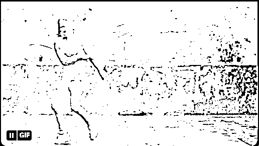

baichuan-7B

model on

@huggingface

: https://huggingface.co/baichuan-inc/baichuan-7B…

baichuan-7B is an open-source large-scale pre-trained model developed by Baichuan Intelligent Technology. Based on the Transformer architecture, it is a model with 7 billion parameters trained on approximately 1.2 trillion tokens. It supports both Chinese and English, with a context window length of 4096\. It achieves the best performance of its size on standard Chinese and English authoritative benchmarks (C-EVAL/MMLU).

https://twitter.com/i/status/1670853301062213634

Come check out 2 of our projects on generative avatars at CVPR 2023:

#CVPR23

The top 8 AI tools to boost your productivity by 10x in 2023:

http://lovo.ai

http://10web.io

http://magicstudio.com

http://heygen.com

http://tome.app

http://lucidpic.com

http://paraphrasingtool.ai

http://amilliondollaridea.com

HomeRobot: Open Vocabulary Mobile Manipulation

proj: https://ovmm.github.io

repo: https://github.com/facebookresearch/home-robot

abs: https://arxiv.org/abs/2306.11565

https://github.com/s0md3v/sd-webui-roop

stable diffusion 换脸

baichuan-7B

model on

@huggingface

: https://huggingface.co/baichuan-inc/baichuan-7B

baichuan-7B is an open-source large-scale pre-trained model developed by Baichuan Intelligent Technology. Based on the Transformer architecture, it is a model with 7 billion parameters trained on approximately 1.2 trillion tokens. It supports both Chinese and English, with a context window length of 4096\. It achieves the best performance of its size on standard Chinese and English authoritative benchmarks (C-EVAL/MMLU).

OpenAI functions

RetrievalQA

We've put a lot of effort into making

@OpenAI

functions usable as their own standalone chains

This now means that you can easily use them as part of other chains - including RetrievalQA and ConversationalRetrievalQA

Docs: https://python.langchain.com/docs/modules/chains/additional/openai_functions_retrieval_qa

https://twitter.com/XRarchitect/status/1671188550187110400

Stable Diffusion generates beautiful images, but can it be used for open-world recognition?

Try Demo! https://huggingface.co/spaces/xvjiarui/ODISE…

Our #CVPR2023 paper shows that the pre-trained diffusion model indeed is a good image parser, allows for open-vocabulary segmentation and detection.

https://twitter.com/xiaolonw/status/1633929301073756161

https://huggingface.co/papers/2306.10998

尽管大型语言模型 （LLM） 在 GitHub Copilot 等编码助手中取得了巨大成功，但这些模型难以理解存储库中存在的上下文（例如，导入、父类、具有相似名称的文件等），从而产生不准确的代码完成。当将这些助手用于模型在训练期间未见过的存储库时，例如专有软件或正在进行的代码项目，这种效果会更加明显。最近的工作表明在推理过程中使用存储库中的上下文是有希望的。在这项工作中，我们扩展了这个想法并提出了 RepoFusion，这是一个训练模型以合并相关存储库上下文的框架。单行代码完成实验表明，我们使用存储库上下文训练的模型明显优于更大的代码模型，如 CodeGen-16B-multi（大 73 倍），并且与使用 Fill- 训练的 70 倍大的 StarCoderBase 模型的性能非常接近。中间目标。我们发现这些结果新颖且令人信服地证明了使用存储库上下文进行培训可以带来的收益。我们进行了广泛的消融研究，以调查设计选择的影响，例如我们框架内的上下文类型、上下文数量、上下文长度和初始化。最后，我们发布了 Stack-Repo，这是一个包含 200 个 Java 存储库的数据集，这些存储库具有许可许可和近乎去重的文件，这些文件增加了三种类型的存储库上下文。

Textbooks Are All You Need

paper page: https://huggingface.co/papers/2306.11644…

introduce phi-1, a new large language model for code, with significantly smaller size than competing models: phi-1 is a Transformer-based model with 1.3B parameters, trained for 4 days on 8 A100s, using a selection of ``textbook quality" data from the web (6B tokens) and synthetically generated textbooks and exercises with GPT-3.5 (1B tokens). Despite this small scale, phi-1 attains pass@1 accuracy 50.6% on HumanEval and 55.5% on MBPP. It also displays surprising emergent properties compared to phi-1-base, our model before our finetuning stage on a dataset of coding exercises, and phi-1-small, a smaller model with 350M parameters trained with the same pipeline as phi-1 that still achieves 45% on HumanEval.

教科书是你所需要的

纸页： https://huggingface.co/papers/2306.11644…

介绍 phi-1，一种新的用于代码的大型语言模型，其大小明显小于竞争模型：phi-1 是一个基于 Transformer 的模型，具有 1.3B 参数，在 8 个 A100 上训练了 4 天，使用了``的选择来自网络的教科书质量”数据（6B 代币）和使用 GPT-3.5 综合生成的教科书和练习（1B 代币）。尽管规模很小，phi-1 在 HumanEval 上的 pass@1 准确率达到 50.6%，在 MBPP 上达到 55.5%。它与 phi-1-base 和 phi-1-small 相比，phi-1-base 是我们在编码练习数据集上的微调阶段之前的模型，phi-1-small 是一个具有 350M 参数的较小模型，使用与 phi-1 相同的管道进行训练，但仍然显示出令人惊讶的紧急属性在 HumanEval 上达到 45%。

使用预训练的文本到图像扩散模型完成点云

纸页： https://huggingface.co/papers/2306.10533…

在实际应用程序中收集的点云数据通常是不完整的。由于从部分视点观察对象，数据通常会丢失，这些视点仅捕获特定的视角或角度。此外，由于遮挡和低分辨率采样，数据可能不完整。现有的完成方法依赖于预定义对象的数据集来指导嘈杂和不完整的点云的完成。但是，这些方法在对分布外（OOD）对象进行测试时表现不佳，这些对象在训练数据集中表现不佳。在这里，我们利用了文本引导图像生成方面的最新进展，从而在文本引导形状生成方面取得了重大突破。我们描述了一种称为 SDS-Complete 的方法，它使用预训练的文本到图像扩散模型，并利用对象的给定不完整点云的文本语义，以获得完整的表面表示。 SDS-Complete 可以使用测试时间优化完成各种对象，而无需昂贵的 3D 信息收集。我们在不完整的扫描对象上评估 SDS Complete，这些对象由真实世界的深度传感器和 LiDAR 扫描仪捕获。我们发现它可以有效地重建常见数据集中不存在的对象，与当前方法相比，Chamfer 损失平均减少 50%。

## 6 月 25 日

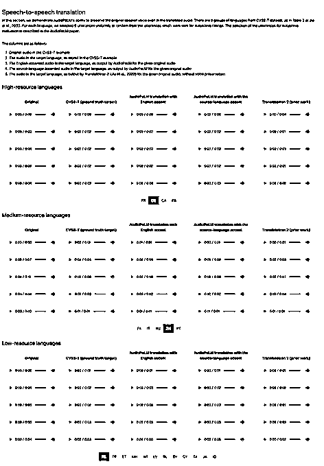

Google AudioPaLM ：能说能听的大型语言模型

AudioPaLM 可以处理和生成文本和语音，不仅能理解和生成语言的语义内容（即我们说的话的实际含义），还能捕捉到和保留说话者的特定声音特征。这些特征包括说话者的声音（可以用来识别说话者的身份）和语调（即声音的升降，可以传达情感或强调某些词语）

清华唐杰新作 WebGLM：参数 100 亿、主打联网搜索，性能超 OpenAI WebGPT

WebGLM，一个参数 100 亿的联网问答聊天机器人（论文入选 KDD2023）。

据介绍，WebGLM 的目标是通过 Web 搜索和检索功能，增强预训练大语言模型，同时可以进行高效的实际部署。作者基于三种策略进行开发。

首先是大模型增强检索器。

它主要是用于增强模型相关网络内容的检索能力，在给定查询的情况下查找相关引用，以便后面更好地准确回答问题。

它有两个阶段：粗粒度 web 搜索和细粒度 LLM 增 强密集检索。

其次是自举生成器。

它利用 GLM（比如清华之前发布的双语开源预训练模型 G LM-130B）的能力为问题生成回复，提供详细的答案。 H

＂

利用该生成器，作者得到 WebGLM-QA——一个 LLM 自举引用和长程的 QA 数据集。

它通过上下文学习等策略进行清洗和过滤，最终包括 45k 的高质量过滤样本和 83k 的噪声样本。

WebGLM 的 backbone 就是一个在该数据集上训练的 GLM 模型。

最后是基于人类偏好的打分器。

它通过优先考虑人类偏好而非昂贵的专家反馈来评估生成回复的质量，确保系统能够产生有用和吸引人的内容。

以上三大组件最终按顺序形成 WebGLM 的 pipeline

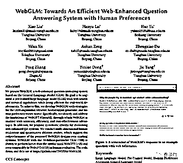

打算深入一下 AGI，然后找到了一个非常适合初学者的课程 https://course.fast.ai。这个课程非常适合做上层应用开发的同学，原因是课程里面不会直接给你教授深度学习、神经网络的底层细节，而是教你如何使用开源模型，训练数据，微调参数。就像是编程，你可以把编译原理扔一边的感觉。

https://reddit.com/r/StableDiffusion/comments/14hbv5k/miss_multiverse_2023/

如何在 stablediffusion 实现多个画风

New open source text to video AI model

576x320 model: https://huggingface.co/cerspense/zeroscope_v2_576w…

1024x576: https://huggingface.co/cerspense/zeroscope_v2_XL…

zeroscope_v2_576w, A watermark-free Modelscope-based video model optimized for producing high-quality 16:9 compositions and a smooth video output. This model was trained using 9,923 clips and 29,769 tagged frames at 24 frames, 576x320 resolution.

zeroscope_v2_XL is specifically designed for upscaling content made with zeroscope_v2_576w using vid2vid in the 1111 text2video extension by kabachuha

由翻译自 英语

新的开源文本到视频 AI 模型

576x320 型号： https://huggingface.co/cerspense/zeroscope_v2_576w…

1024x576： https://huggingface.co/cerspense/zeroscope_v2_XL…

Zeroscope_v2_576w，基于 Modelscope 的无水印视频模型，经过优化，可生成高质量的 16:9 合成和流畅的视频输出。该模型使用 24 帧、576x320 分辨率的 9,923 个剪辑和 29,769 个标记帧进行训练。

Zeroscope_v2_XL 专为使用 kabachuha 的 1111 text2video 扩展中的 vid2vid 来升级由 Zeroscope_v2_576w 制作的内容而设计

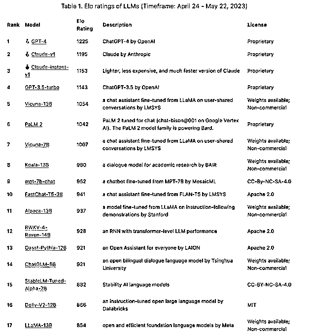

斯坦福发布最新大模型排行榜

来自斯坦福的团队，发布了一款 LLM 自动评测系统——AlpacaEval，以及对应的 AlpacaEval Leaderboard。这个全新的大语言模型排行榜 AlpacaEval，它是一种基于 LLM 的全自动评估基准，且更加快速、廉价和可靠。

在斯坦福的这个 GPT-4 评估榜单中：

•GPT-4 稳居第一，胜率超过了 95%；胜率都在 80% 以上的 Claude 和 ChatGPT 分别排名第二和第三，其中 Claude 以不到 3% 的优势超越 ChatGPT。

•值得关注的是，获得第四名的是一位排位赛新人——微软华人团队发布的 WizardLM。在所有开源模型中，WizardLM 以仅 130 亿的参数版本排名第一，击败了 650 亿参数量的 Guanaco。

•而在开源模型中的佼佼者 Vicuna 发挥依然稳定，凭借着超过 70%的胜率排在第六，胜率紧追 Guanaco 65B。

•最近大火的 Falcon Instruct 40B 表现不佳，仅位居 12 名，略高于 Alpaca Farm 7B。

Stable Diffusion 发布了新的图像模型 SDXL 0.9，这是文本到图像模型的一项突破性发展，相比前身在图像构成和细节上有显著的改进。

最主要的是 SDXL 0.9 可以在消费级 GPU 上运行，Windows 10 或 11，或 Linux 操作系统，16GB RAM，以及至少有 8GB VRAM 的 Nvidia GeForce RTX 20 显卡（或更高标准）即可运行。

https://struct.ai/blog/launching-struct-chat-platform…

Struct 推出知识丰富、AI 驱动的聊天平台

http://Struct.ai 推出了一款聊天平台，利用 AI 和 CRISPY 框架将现有平台（如 Slack 和 Discord）转化为可搜索的知识库。

该平台提取线程式对话，并为每个对话生成服务器端渲染页面的知识库。

Struct 的定价模型基于线程，每月收费 0.13 美元。

该平台旨在适应社区、团队和客户支持。

用户赞扬该平台能够总结讨论并供未来参考。

然而，一些人对定价和平台处理私人频道的能力提出了担忧。

ChatGPT and Bard cannot solve every problem for you.

1\. YouTube Summaries → http://eightify.app

2\. 3D Animations → http://moviebot.io

3\. AI Assistant → http://zipzap.ai

4\. Prompts → http://promptdrive.ai

5\. How-to-videos → http://teachomatic.net

昨天 Midjourney 发布了 zoom out 功能，这个功能及其强大，可以创造出一些神奇的图片出来，甚至可以做视频。

教程将给你展示如何使用这一改变游戏规则的功能来拍摄无缝的高清变焦视频。里面还有一部分将这个能力产品化的思路和开源资源。

https://twitter.com/op7418/status/1672457908939014145

AI 音乐（音乐生成等）

5 月流量一览

1 http://voicemod.net/text-to-song

2 http://musicfy.lol

3 http://soundraw.io

4 http://songtell.com 歌词分析

5 http://landr.com/en

6 http://my.brain.fm

7 http://voicify.ai 封面制作

8 http://boomy.com

https://openpm.ai

AI 插件的包管理器

Openpm 是一个 AI 插件的包管理器，帮助用户集成他们的 API 和 AI。

然而，一些评论者质疑「AI」一词的使用和平台的安全性。

还有关于 OpenAI 垄断「AI」一词和他们的商业实践的讨论。

Openpm 的创建者澄清说，他们正在使用像 OpenAPI 这样的开放协议，并且是开源的。

https://huggingface.co/psmathur/orca_mini_3b

Orca_Mini_3b by

@pankajmathur_

looks phenomenal. What a great idea!

It's not based on flan, but rather uses a variety of open datasets + Orca system prompts to make a very smart, tiny model that when quantized will run fast at the edge.

https://huggingface.co/psmathur/orca_mini_3b

@pankajmathur_

的 Orca_Mini_3b 看起来非常棒。真是个好主意！

它不是基于 flan，而是使用各种开放数据集 + Orca 系统提示来制作一个*非常*智能的微型模型，该模型在量化时会在边缘快速运行。

@erhartford

的新 33B 型号！

WizardLM 33B V1.0 Uncensored 是使用过滤数据集对

@WizardLM_AI

模型进行的重新训练，旨在减少拒绝、回避和偏见。

我的量化：

https://huggingface.co/TheBloke/WizardLM-33B-V1.0-Uncensored-GGML

https://huggingface.co/TheBloke/WizardLM-33B-V1.0-Uncensored-GPTQ

介绍

https://huggingface.co/ehartford/WizardLM-33B-V1.0-Uncensored

Midjourney V5.2 改进美学效果、连贯性、文本理解、更清晰的图像、更高的变异模式、缩小视角的外部绘画功能，以及一个新的 /shorten 命令用于分析你的提示词。

https://mp.weixin.qq.com/s/D9xxP8QOLq5q7pNRhYCc3w…

MJ 发布了 V5.2，SD 也不甘示弱！

https://mp.weixin.qq.com/s/rDWr0pkYsWKo83FxaMo1pA…

来看一下编程模型（CoderLLM）🚀

LLM 的子领域中，注重 coding 能力的是一个好切入点。

竞争激烈，且优秀的模型层出不穷，各领风骚十几天。

下面为您详细介绍几个模型：

🌟 StarCoder

⚡ StarCoder+

📚 Code T5

🕰️ LTM

🧩 DIDACT

🧙‍♂️ WizardCoder

🦅 FalCoder-7B

🎯 MPT30B

https://twitter.com/JefferyTatsuya/status/1672800772357263362

Open-source #TextToVideo community 🦒 colab 🥳

please try it 🐣 https://github.com/camenduru/text-to-video-synthesis-colab

LLM As Chatbot update

adding OpenLLaMA based DOLLY, OASST, HH-RLHF fine-tuned fully commercial free models (7B, 13B) from

@VMware

hope the logo looks appropriate :)

check out the repo: https://github.com/deep-diver/LLM-As-Chatbot

https://inflection.ai/inflection-1

http://Pi.ai LLM 超越 Palm/GPT3.5

Inflection 公司开发了自己的最先进的 LLM——Inflection-1，它的性能超越了广泛部署的 LLM，如 GPT-3.5 和 LLaMA。

该公司希望继续扩大规模和创新，构建最能胜任和安全的 AI 产品，让数百万用户可以使用。

然而，一些评论家对基准测试持怀疑态度，并指出这篇技术报告的主要受众是 Inflection 想要招募的 ML 研究人员和技术知识渊博的投资者，而不是最终用户。

一些人还质疑该公司声称是垂直整合的 AI 工作室以及使用公共互联网数据的做法。

此外，还有关于谷歌 PaLM-1 和 PaLM-2 模型性能的讨论。

理论上最接近 ChatGPT 的模型，终于有人训练出来了， orca_mini_3b！

基于 OpenLLaMa-3B 模型，运用 WizardLM，Alpaca 和 Dolly-V2 数据集的指导及输入，并采用 Orca 研究论文的数据集构建方法进行训练。

训练过程在 8 个 A100（80G）GPU 上进行，约需 4 小时，费用为 48 美元。https://huggingface.co/psmathur/orca_mini_3b

快去试试！

有人做了个 AI 川普和 AI 拜登

然后让他们不停的辩论，并在 Twitch 上不间断直播😂 俩人互相对骂 ！https://twitch.tv/trumporbiden2024

如何搭建情感陪伴 AI 机器人？

基于 A16z 推荐产品和服务整理拓展。

简单想：得有语言模型、声音、形象、交互界面，然后托管到服务器，对外提供服务。

【AI 核心：文本语言模型】

PygmalionAI

官网：http://pygmalion.ai

模型：https://huggingface.co/PygmalionAI/pygmalion-6b

项目本身想做 AI 生成内容和粉丝互动，比如 AI 生成博客、短视频等，自动发布并与粉丝在评论、私信、IM 和直播中持续互动。

估计在 AI 聊天对话方面有些技术实力。

VICUNAhttps://huggingface.co/lmsys/vicuna-13b-delta-v1.1

大名鼎鼎的羊驼，一个开源的聊天机器人。

采用了 http://ShareGPT.com 收集的聊天对话做的微调，支持 CPU 或 GPU 本地运行。

【AI 声音：文本转语音】

LLElevenLabshttps://beta.elevenlabs.io

可能是目前最好的文本生成语音产品（不支持中文），他们的 Prime Voice AI 可生成最真实的语音，并提供多种声音和风格选择。

PlayHThttps://play.ht

一款在线文本转语音工具，可使用 260 多种真实的语音 AI 声音创建高质量的配音。

VOICEVOXhttps://voicevox.hiroshiba.jp

日文产品，二次元语音很棒

中文语音合成：http://MURF.aihttps：//murf.ai/text-to-speech/chinese

火山引擎语音合成：https://volcengine.com/product/tts

如有其他中文语音合成工具，欢迎推荐。

【AI 形象：静态+动态】

静态：SD、Midjourney

动态：

D-ID: https://d-id.com

HeyGenhttps://heygen.com

【AI 聊天：UI 界面】

SillyTavern（愚蠢酒馆）https://sillytavernai.com

支持单聊和群聊，Prompt 管理优化，UI 界面设置，长记忆管理（chromaDB），支持移动设备和插件扩展，相当完整的解决方案。

oobabooga

目标是成为文本生成领域的 stable-diffusion-webui

项目地址：https://github.com/oobabooga/text-generation-webui

支持很多开源模型，如 LLaMA、GPT-J、RWKV、Alpaca、Vicuna 等，流式输出、Markdown/LaTeX 渲染、提供 API 等。

有缺省模式、Notebook 模式、聊天机器人模式。

官网：http://koblod.ai

项目：https://github.com/KoboldAI/KoboldAI-Client

基于浏览器的前端 Web 界面，支持本地或远程 AI 模型，用于搭建辅助写作、类 AI Dungeon 游戏、聊天机器人。

支持长记忆、世界信息、保存和加载、AI 设置等众多功能特性。

另外，A16z 也提供 AI 聊天机器人基建：https://github.com/a16z-infra/ai-getting-started

【AI 托管：服务商】

提到的服务：Google Cloud、 AWS、 Steamship

Steamship

官网：https://steamship.com

项目地址：https://github.com/steamship-core/python-client

提供 Serverless 云托管，支持向量搜索，Webhooks，回调等。

【AI 聊天产品推荐】

Character: https://beta.character.ai

Replika: https://replika.com

Chai: https://chai-research.com/get_chai.html

另外个人强烈推荐 PI，交互最简洁、最有人情味的聊天机器人：https://heypi.com

最近会提供 API，项目地址 https://inflection.ai/inflection-1

AI 自主代理的列表，包括开源和闭源项目。总结的很全面！

开源项目包括 AgentGPT、AI Legion、AutoGPT、BabyAGI、BabyBeeAGI、BabyCatAGI、BabyDeerAGI、Databerry...

闭源项目包括 Airplane Autopilot、Aomni、BitBuilder、Butternut AI、Cognosys、Diagram、Factory...

https://github.com/e2b-dev/awesome-ai-agents

An early version of the amazing zeroscope_v2 XL text to video model is now available to use on Replicate:

https://replicate.com/anotherjesse/zeroscope-v2-xl

We're hoping to add video2video and upscaling soon.

Great work

@anotherjesse

https://twitter.com/fofrAI/status/1672759576108646400

很惊艳

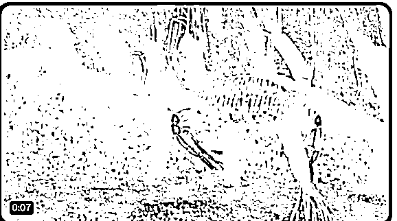

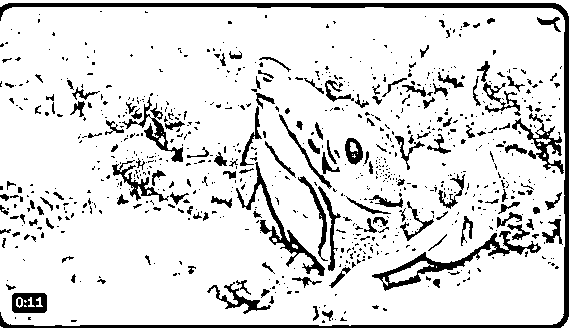