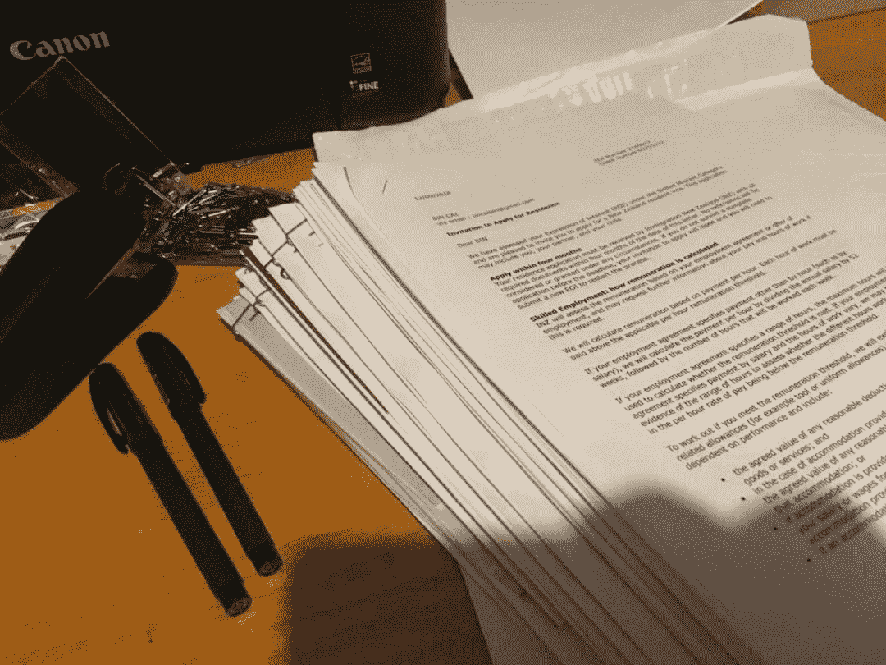
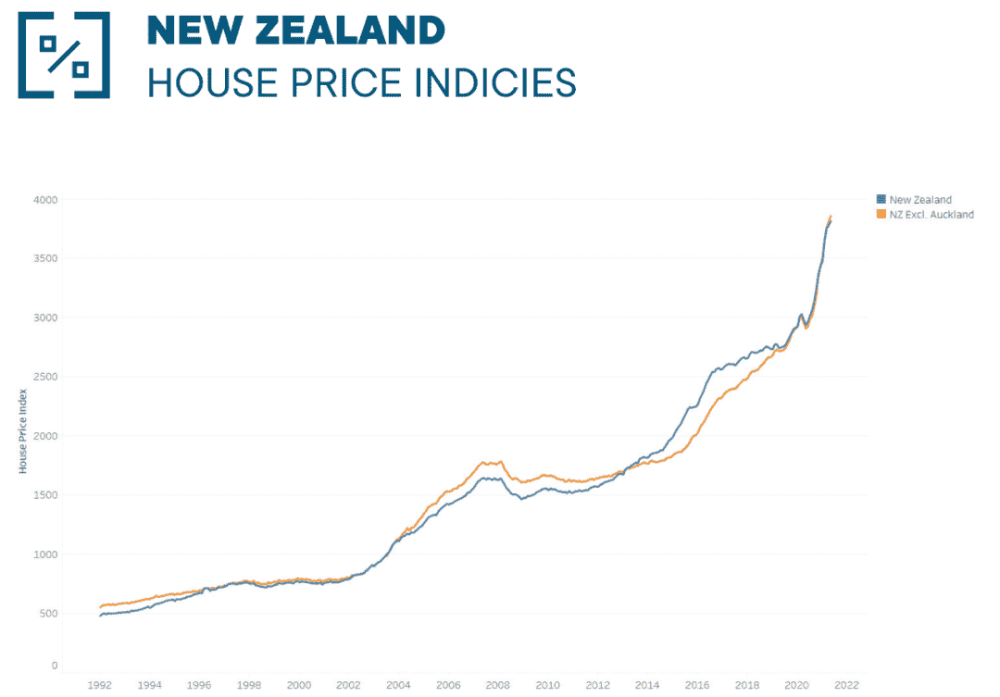
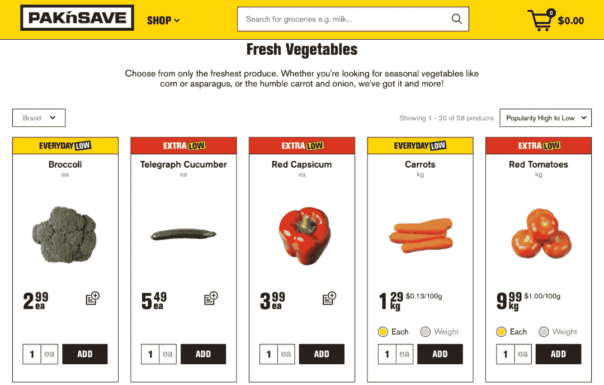

<!--yml
category: 访谈
date: 2022-06-28 10:38:23
-->

# No.21 你好鸭#海外工作者 | 我是VeryCB，2018 年离开北京来到奥克兰 | 电鸭

> 来源：[https://eleduck.com/posts/W9f3nY](https://eleduck.com/posts/W9f3nY)

**嗨，**

**你好鸭：）**

**我是VeryCB**。

### ▌在国外几年了？介绍下你本人的经历及当前所做的事情吧？

* * *

我是 VeryCB，2018 年离开北京来到奥克兰，先在一家云计算相关的 SaaS 公司做全栈开发，疫情开始后想把更多精力放在家里就离开了公司，后来也作为 contractor 远程工作了一段时间，然后就成了一名全职奶爸。

最近对区块链和 DeFi 比较感兴趣，正在学习 Solidity 和智能合约。

拍于 2018 年奥克兰

### ▌什么样的契机，让你有了出国（或移民）的想法？

* * *

最主要的原因是雾霾，特别是 2014-2016 年，北京的空气质量很差。本来我觉得问题不大，家里用空气净化器，外出戴口罩也可以接受。但老婆怀孕以后想法就彻底改变了，每次一想到孩子将要在这样的空气里成长心里就很不是滋味。

拍于 2014 年北京，坐在家里往窗外望，白茫茫一片的雾霾

第二个主要原因是不喜欢国内『鸡娃』式的应试教育，我更希望孩子按照自己的天性和兴趣自由发展，用有限的精力去学自己喜欢的东西，做自己喜欢的事情，不想刻意地把他们培养成别人眼里的『成功』人士。要做到这一点其实对家长的要求更高，我也在不断地学习如何成为一名合格的爸爸，希望我能作为孩子一生的朋友和榜样，而不是一个『家长』。

当然还有很多不重要的原因，比如汽车摇号七年未中、外地牌照限制太多、出去吃饭还要排队等等，这里就不展开说了。所有这些因素叠加在一起就让我产生了移民的想法。

### ▌为此都做了哪些准备？最终是如何实现出国（或移民）的？

* * *

从 2016 年底决定出国之后，先了解了一下各国的技术移民政策，以前一直觉得移民是一件遥不可及的事情，但了解之后才发现并没有想象中那么难，特别是对于在国内已经有多年工作经验的 IT 工程师，只要语言不成为障碍，机会还是很大的。

在比较了美国、加拿大、澳大利亚、新西兰等几个主要的移民国家之后，最终选择了新西兰作为目的地，主要原因也有几个：

1.  新西兰是唯一一个有『永久回头签』政策的国家，可以永久保有中国公民 + 新西兰居民身份，考虑到以后父母的养老问题和其他不可抗因素，这个政策的自由度最高；

2.  气候比较宜人，夏天不热，冬天也不算冷；

3.  自然环境优美；

4.  人们都很友好，几乎没有种族歧视；

5.  偏安一隅，相对更不容易受到难民、病毒、战争等世界性问题的影响；

6.  人少，适合我这种喜欢安静、讨厌社交的性格。

拍于 2018 年皇后镇

### 

决定了目的地之后就开始研究具体的可行性方案，新西兰的技术移民是打分制的，我当时的打分是 145 分，但不幸的是，就在我决定移民的一个月之前移民局把分数门槛从 140 分提高到了 160 分，这样我就错过了无工作离岸申请的机会，只能走找工作这条路了。

然后我开始在 Seek、Indeed 和 Stackoverflow 等网站上看新西兰的工作机会，投了一些简历，但绝大多数都石沉大海，只有一家公司给我提供了面试机会，最终也因为『没有工作签证』而被拒绝。通过跟其他朋友的交流，发现新西兰不像其他国家，没有签证离岸找工作的成功率非常低，除了个别大神以外鲜有成功案例。于是我就把目标修改为『先登陆新西兰，再找工作』。

要想登陆新西兰找工作，有这么几个选择：

1.  申请短期旅游签证，但拿这个签证找到工作的难度很大，需要十足的运气和实力，鲜有成功案例，pass；

2.  抢工作度假签证（WHV），针对中国有 1000 个名额，可行；

3.  抢银蕨签证（SFV），全球每年一共 300 个名额，可行，但要到 2017 年年底才能抢，所以优先抢 WHV；

4.  留学，时间和资金成本较高，优先级最低。

同时在准备的过程中，我进入了一家外企工作，想在工作中锻炼一下英语，同时外企的工作经验也会给后面的移民之路带来一些优势。

2017 年上半年先考了雅思，顺利抢到了 WHV 签证，然后就开始准备登陆新西兰和移民的材料、做各种公证、卖房子等等。那段时间女儿出生，我也想在家里多帮帮忙，就没有急于出国，直到 2018 年中才正式登陆新西兰。

拍于 2018 年奥克兰

登陆之后找工作就顺利很多了，第二周就签了 offer，然后换长期工签、申请技术移民就顺理成章了。我整理了一份时间表：

| 日期 | 步骤 |
| --- | --- |
| 2017.4.22 | 考雅思 |
| 2017.6.23 | WHV |
| 2018.5.17 | 登陆新西兰，开始找工作 |
| 2018.5.21 | 面试 |
| 2018.5.28 | 二面 |
| 2018.5.30 | 收到 Offer |
| 2018.7.12 | 提交工签 |
| 2018.8.9 | 拿到工签 |
| 2018.8.16 | 提交 EOI |
| 2018.8.22 | 被选中 Decision Successful (Selected) |
| 2018.9.12 | 邀请提交材料 Invite to Apply |
| 2018.11.10 | 提交材料 |
| 2018.11.28 | 扣款 |
| 2018.11.29 | 收到申请 Application Received |
| 2019.4.26 | 分到 Case Officer |
| 2019.8.16 | Second Person Check |
| 2019.9.9 | 移民申请被批准 Resident Visa Online Approved |
| 2019.10.1 | 拿到 eVisa |

拍于 2018 年奥克兰，准备好了所有申请材料

### ▌出国之后，工作和生活都发生了哪些变化？

* * *

最大的变化应该是工作和家庭之间的平衡（Work-life balance）做的更好了，国外的很多公司都很注重这一点，不加班，平时工作压力也不大，工作就是工作，生活就是生活，除非紧急情况，不会有同事休息时间还跟你讨论工作，所以我会有更多的时间和精力去做自己想做的事情。

拍于 2020 年奥克兰，业余有大量的时间可以陪孩子

另外可以感受到公司高层除了业务以外，也会关心员工的幸福感和社会问题，我之前所在公司的 CEO 曾经想在全公司推行一周 4 天工作制，后来由于人事问题没有最终实施，不过从去年开始已经转为全员远程办公了。

然后就是新西兰这边的互联网业务普遍都比较小，不会像国内那样对高并发、性能等有太高的要求，技术的发展不像国内那样日新月异，个人成长更多还是靠自己，同时也不会有像国内可以通过公司上市实现财务自由，所以心态上面就只是把工作当成是工作，平时也会划划水摸摸鱼。

生活上没有太大的变化，也可能是早已经适应了所以没有太多感受吧。

### ▌能从具体聊聊你所在城市的房价/物价/收入/教育吗？

* * *

先来说说房价。

新西兰过去 30 年的房价基本处于上升趋势中，不过涨幅没有国内那么大，从 2010 到 2020 的十年间也就只涨了 1 倍左右。但这个趋势从去年开始加速，根据 REINZ 今年 6 月份发布的最新数据，新西兰过去一年房价中位数同比上涨 29.8%，奥克兰作为最贵的地区也涨了 26.3%，来到了 114.8 万纽币（折合人民币 520 万左右）。

新西兰过去 30 年的房价走势

因为我是 2017 年卖了北京的房子之后来的奥克兰，刚来的时候奥克兰中位数大概在 80 万左右，当时觉得还挺便宜的，120-130 万纽币左右就可以买到一套还不错的独栋 House。根据不同的个人情况，首付可以低到 20% 甚至 10%（我的首付是 25%），贷款利率也比国内低很多，目前在 2% 多一点，交易也不需要交各种税，比北京的房子性价比高很多。当然这个价格主要还是看区域，我一直工作和生活的区域在奥克兰北岸，如果是中区的房子会更贵一点，学区房的话就更贵了。另外房子会有地税，一年大概 1000-3000 纽币左右，再加上维护费用，加在一起就是持有成本。

如果不是卖了国内的房子或者积蓄不多，想在奥克兰买房压力也挺大，有朋友就搬去了房价便宜很多的惠灵顿和基督城。

我居住的社区，网图

再来说一下程序员的收入水平，如果是国内有经验的 Senior 应该可以拿到 9-12 万纽币左右的年薪，刚毕业或者经验不多的话大概在 6-8 万左右。所得税跟国内一样实行阶梯税率，但税率比国内高，最高的一档是超过 18 万的部分交 39% 的税，不过普通人不会有这么高的工资，程序员一般需要交到 7 万以上的部分交 33% 这一档。据说今年工资水平涨了一些，因为我很久没找工作所以也不清楚最新的情况，但 Senior 的天花板应该在 15 万左右，比国内一线公司的工资水平还是要差一些，而且还没有股票、期权、加薪等福利，好处是工作压力小，按真正工作时间算时薪的话也挺高。

物价相比收入水平来说算比较高了，特别是冬天的蔬菜，经常贵的离谱，比如西红柿动辄 10 纽币/kg，黄瓜 5.5 纽币一根（注意是一根）。跟朋友下馆子的话人均 30-40 纽币左右，工作餐吃盖饭大概 12-15 纽币。如果要请电工等需要人工的服务也非常贵，所以在国外都是能自己动手的就自己动手了。打车很贵，自己开车去市中心停车也很贵，相对来说二手车会便宜很多，几千纽币就能买辆经济实用车，不过汽油不便宜，92 号汽油一升要 2.2 纽币左右。

Pak‘n Save 是新西兰价格较为便宜的平价超市，图为冬天的蔬菜价格

最后说一下教育，因为我两个孩子都没有到上小学的年龄，所以就只说一下幼儿园的情况吧。新西兰的公立幼儿园基本都要 3 岁以上才能读，否则只能去私立 child care。不管是公立还是私立都有每周 20 小时免费政策，超过 20 小时再额外收费。

我家上的是公立幼儿园，超过 20 小时之后每小时 6 纽币，另外还有每小时 1 纽币的非强制性捐款，每天从 8:30 上到 14:30，加起来一个月差不多 400 纽币。放学时间对于上班族来说有点早，所以很多家人会选择早上早上班，下午就可以早点下班去接孩子，也有家长会选择私立幼儿园，就是为了上的时间长一点。

这边的幼儿园环境普遍接近自然，玩具也都是木质的，很少用塑料。印象比较深的是老师为了让孩子们观察蝴蝶的成长周期，专门在院子里搭了一个蝴蝶房，每天带孩子们去观察，从毛毛虫到蛹，再到破茧成蝶的全过程。另外也很鼓励孩子们动手，比如用锤子、锯做东西，而不像我们总担心孩子受伤。

幼儿园老师带孩子们一起养的蝴蝶

### ▌有人说国内容不下肉身，国外留不住灵魂，你的感受如何？

* * *

这个主要还是看个人的追求吧，世界上没有完美的地方，每个地方都有优点和缺点，我们需要在了解清楚自己内心的追求之后做一些取舍，不同的人会有不同的选择，我觉得只要是适合自己的地方就可以，不管是国内还是国外。

未来如果有的选，我甚至想完全生活在数字世界里。

### ▌关于国内和海外在开发语言及技术选型上的的差异，能不能聊聊你的看法？

* * *

新西兰主流的后端开发用的是 [ASP.NET](http://ASP.NET)，前端以 React 为主，云服务主要是 AWS 和 Azure，第三方系统会尽量付费使用 SaaS 软件。

国内的主流应该是 Java 和 Go 的微服务，前端是 Vue/React，云服务用阿里云/腾讯云或者自建云，第三方系统也主要以自建为主。

上面这些是我目前的观察和认知，当然不一定对，我刚来新西兰的时候也会觉得用 [ASP.NET](http://ASP.NET) 有一些落后，但时间长了就觉得还挺适合新西兰的商业环境。毕竟技术选型不只是一个技术问题，还要涉及到业务、招聘、管理等各个方面。

### ▌有什么技能是你认为必备的呢？？

* * *

学会理财是一个很重要的技能，特别是在通胀水平越来越高的时代，很庆幸自己过去这几年一直在学习投资和理财相关的知识，也通过房产、基金、股票和虚拟货币实现了一定程度的自由。

但这个话题非常大，不太好展开说，而且我也不是专家，只能简单说一下自己的感受：

1.  认知水平跟财务水平是成正比的，要不断通过学习来提高自己的认知水平，让它能够匹配当前的财务水平，或者让财务水平追上你的认知。否则即使短期赚了钱最终也会还回去。

2.  投资不是炒股，要多关注基本面，忽略市场上的噪音，多做研究，少做交易。

3.  投资是反人性的，保持稳定的心态很重要，如果一个投资让你觉都睡不好，那就不是一个好投资。

4.  要建立适合自己的投资系统和体系，帮助你做出诸如『为什么买？』、『什么时候买？』、『什么时候卖？』等一系列决策。

5.  耐心是极其重要的素质，要耐心等待机会的到来，耐心持有已经买入的资产，做一个长期主义者。

6.  不要预测市场，也不要相信别人的预测，没有人可以一直预测准确，即使他曾经很成功。

7.  独立思考，独立判断。少加投资群，大部分群里的讨论都没有价值，反而会影响你的判断和心态。

8.  便宜是硬道理，不管买什么都要在便宜的时候买，切勿盲目追高。

9.  不要碰杠杆。

顺便推荐几本入门书：

1.  霍华德·马克斯《投资最重要的事》[https://book.douban.com/subject/10799082/](https://book.douban.com/subject/10799082/)

2.  邱国鹭《投资中最简单的事》[https://book.douban.com/subject/26163553/](https://book.douban.com/subject/26163553/)

3.  格雷厄姆《聪明的投资者》[https://book.douban.com/subject/5243775/](https://book.douban.com/subject/5243775/)

4.  清崎《富爸爸，穷爸爸》[https://book.douban.com/subject/1033778/](https://book.douban.com/subject/1033778/)

5.  巴菲特《巴菲特致股东的信》[https://book.douban.com/subject/1046164/](https://book.douban.com/subject/1046164/)

### ▌对于那些也想出国的同学，你有什么建议么？

* * *

1.  要综合了解各方面信息，想清楚为什么要出国，国外真的适合你吗；

2.  最好能有机会先在国外生活一段时间；

3.  如果真的决定出国，要趁早行动，因为大环境一直在变，各国的移民政策也一直在收紧，越晚行动就会越难。

### ▌如何联系我？

* * *

我的豆瓣：[https://douban.com/people/VeryCB/](https://douban.com/people/VeryCB/)

### ▌加入海外移民交流群

* * *

如你对海外移民有兴趣/有打算，

可以点此加入我们的群来交流。

[https://eleduck.com/groups](https://eleduck.com/groups)

