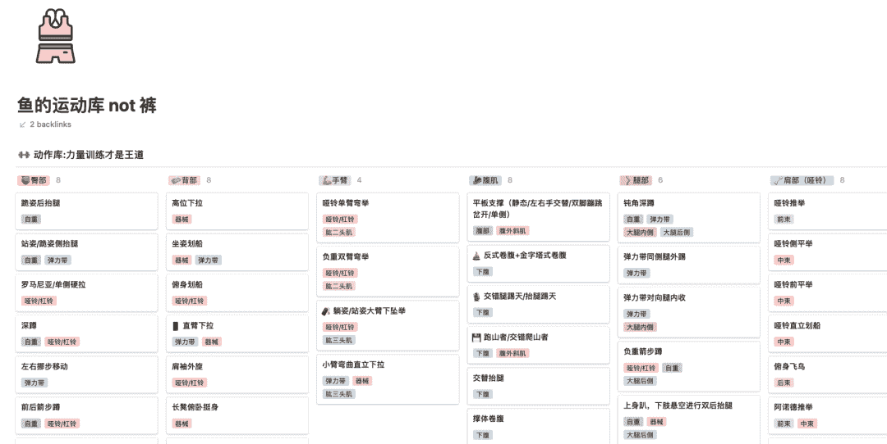

<!--yml
category: 访谈
date: 2022-06-28 10:38:14
-->

# No.22 你好鸭#远程工作者 | 我是胖鱼，爱撸铁健身，和大家聊聊我的开源和远程经历 | 电鸭

> 来源：[https://eleduck.com/posts/rdfEoD](https://eleduck.com/posts/rdfEoD)

**嗨，**

**你好鸭：）**

**本期主人公是胖鱼小姐姐。**

### 

****▌****介绍下你本人的经历及当前所做的事情吧？

我是一个兴趣爱好可能偏向男孩子的一个女生，喜欢研究一些数字化应用，没事也爱看看各种数码产品；一直没放弃英语，想要尝试在英语使用上有所成长的英文学习者；喜欢折腾各种新鲜有趣的 APP，关于电脑手机的使用有问题一定要自己解决的那种。虽然身材瘦小，但我巨爱撸铁，喜欢健身，每天都要保持运动（所以看起来已经不瘦弱了，虽然还没到90斤）。

身为一个非技术人员，却意外碰撞到了开源社区，还挺有意思的。2019-2021 年在 Apache Pulsar 社区担任 Community Manager，主要负责对 Pulsar 项目的一些国内内容支持和运营推广，还有技术文档相关支持与浅层翻译。目前在某互联网云公司进行 toB 产品的渠道运营。

******▌******什么样的契机，让你有了远程的想法？最近的一份远程工作是如何获得的？

契机的话其实还是因为疫情吧。但其实之前在的 Pulsar 项目公司本身就有支持远程工作的企业文化，老板跟一些国外工程师都保持着远程的状态。疫情之后全公司远程才算是真正意义上的一个远程体验吧。

说起来还挺感谢前公司给的远程机会体验和远程文化支持，我爱远程。

********▌********远程之后，工作和生活都发生了哪些变化？

我自己对于远程办公还是抱着接受的态度，实施后发现对我个人而言，远程的节奏跟我个人平日对时间规划的节奏更契合。相比于坐班的固定时间与通勤局限，远程可以说是让我在时间把控上更自由，也可以避免夏季高峰挤车的尴尬。

远程后早午饭的时间没有之前固定了，但是绝对也不会缺少。相比于通勤路上的精力消耗，远程后我觉得精力会更充沛一些，尤其是早上的工作节奏和能量储备。其次就是空隙时间的管理，相比于坐班的空间感压力下，远程空间的我会更自在自由一些，对于空隙时间的利用会大幅度提升。

我自己因为每天都要运动，所以一般会选择在下午3-4点时间段进行一些简短的力量训练去提神，因为居家会常备哑铃等健身器械，所以间隙时间就会用运动去填充起来。一顿肌肉锻炼后，精神和精力上都可以有所提高和集中。

最后就是远程免去了通勤路上的拥堵和时间成本，所以你的工作之外的个人时间就会大大增加，这对于额外的自我提升而言，可以说是锦上添花。

**********▌**********你每天的工作的时间和效率是怎么规划和保证的？

我的个人日常是比较偏向于按计划走的，就是我的个人时间安排里对每个事件的占用都是有个大体时间预估的，然后进行一个整体的编排。以前是利用 to do list 的形式去记录和提示自己所做事情，后来觉得在工作上有些太笼统。所以现在习惯用优先级来界定事件安排。通过重要且紧急，重要但不紧急，不重要但紧急，不重要也不紧急这四种情况来划分。相比之前的笼统罗列，按照这种方式划分后我觉得会更清晰，不会太容易手忙脚乱。

其次我是一个非常讨厌拖延的人，我自己做事一般都是尽量赶着我自己给自己定的ddl之前忙完，所以在面对同事共同工作时，总会把这种情绪带入到别人身上，就会出现一直催促的现象。这点我确实要反思，但是如果已经超出了我们商讨时间，那确实催促也是正常的。最后就是脱离工作后的生活，我也有每日的个人安排，所以我一般会很明确的分界好工作和生活，尽量在进入生活层面时，可以把工作上的事情全都结束掉，不要拖泥带水。不要带工作情绪进入休息生活。

▌能平时都用到哪些软件/工具来提升效率或者帮助工作呢？

就上方提到的优先级任务记录，我在手机上使用的 APP 是 Priori（iOS版本），它就是主要记录四象限的待办事项。以前我都是用滴答清单或者苹果自带提醒事项，现在基本都转移到 Priori 上了。可以通过四象限清晰分辨各任务的优先级，同时也可以设定提醒时间和优先级标注，我觉得功能上已经可以满足我的使用了。整体 UI 也比较简洁，免费下载使用无广告。

其次关于记录类，我都是在 Notion 进行记录，包括之前的[健身动作库整理](https://www.notion.so/magichouse/not-f71ef366623447219b52a2a837369784)（被好多朋友要过模版）、读书笔记记录等。Notion 作为一个「all in one」的工具，可以说是给大家的生活、工作记录带来了全新的体验和各种各样的展示。网上的 Notion 模版也是非常之多。

但是 Notion 的本地化其实还没有完善好，所以有时加载速度会有些慢，这时候就可以尝试去年新新起之秀 Craft（有 iOS、Mac 以及网页版），参与了他们的内测到正式发布，确实在本地功能上 Craft 比 Notion 更优秀，虽然一些文档记录功能上没有 Notion 那么全面，但是流畅度和更时尚的 UI 展示，我觉得在体现上丝毫不输。同时近期他们在功能上增加了日历层面，还可以记录每日，感觉像是加了个日记功能，也还不错。可以体验一下哦，免费下载，免费版有 1000 个 block 限制。

**********▌**********很多人说远程易孤独，你是如何排解的？

我觉得分人吧，对于我这种常年都是在城市独居的人来说，大学毕业后已经开始逐渐习惯自己独处。自己看电影、一人食探店等都已成为习惯，甚至很享受。所以对于远程尤其是一个人独居的远程，其实更像是给出了一个可以「冥想」、可以「自言自语」、可以更「畅快表达自己内心想法」的环境。

独居远程时，有些瞬间的想法可能是我在办公场所中不会去表达或记录的，但是一个人在单独空间远程工作时，瞬间的 Aha moment 都有可能成为头脑中两个不同小人的对话素材。以前我看到朋友自言自语时会觉得有些奇怪，后来到了自己无意中自言自语开始以另一个角度去交流本体、或者去安慰、鼓励自己时，发现其实自言自语也是一种默默地陪伴吧。

所以不要担心孤独，孤独这个过程本来就是一个被动想法，没有人会主动觉得孤独。一定是某个环境某个情景让你突然心头涌上一股孤独感，但其实当你去让自己生活丰富充实起来时，孤独这个词就基本不会出现在你的生活中。按照自己的节奏去生活，就是最好的方式。哪怕有孤独感，那就让我们去接受瞬间的孤独感，然后扭头继续做该做的事情。

孤独不可怕，我们要成长为可以接受孤独、享受孤独的人。

**********▌**********对于那些也想开始远程工作的同学，你有什么建议么？

勇敢大胆地去做吧，你会发现之后会爱上远程工作方式的，可以让你在自制力和时间把控上成为自己真正的主人！

▌说说你关于开源/开源社区及工作的经历吧

我的首次开源社区工作以及目前为止接触的都是 Apache Pulsar 项目。虽然在一开始应聘时，我对开源基本不了解，但是我知道是在 GitHub 上进行，Slack 软件上进行同事交流时还是很感兴趣的。因为这些软件我还都刚好熟悉，所以觉得上手程度上应该不是问题，就勇敢直上了。

之前做的就是 Apache Pulsar 社区更偏向国内方向的运营，包括中文文章（推广、干货编辑等）、技术文档翻译进程的把控，到后期线下活动筹备、线上活动直播的准备等都有涉及，也算接触了不少大佬，还是能感觉到自己在技术圈里慢慢在接触在成长。

▌什么样的契机，让你接触到了开源/开源社区？

其实也没有什么契机吧，就是当时来北京找工作时，找了几个月都没有合适的，中途有在亲戚的公司里凑合了一下，但我非常不喜欢那个公司的项目，所以后来还是又找起了工作，然后就遇到了负责 Apache Pulsar 国内项目推广的公司，谈了三轮之后觉得自己可以做的来，内容也是我想去接触和了解的，于是就来到了开源社区。

▌从事开源/开源社区相关的工作，有给你带来了哪些机会/变化吗？

因为接触开源，了解了社区文化，也更多地去接触了程序员们，确实也更了解了一个群体吧。

在社区内跟各种 Contributor 交流对话，或者是一起翻译某些文档，再或者是自己参与到某个 GitHub 项目，看到自己的名字出现在侧边贡献列表中，又是一番不一样的体验啦～

当然在开源社区中运营也开始发现 DevRel 其实更是各组织共同协作的状态，工程师们提供技术方面的支持，运营提供更多的平台展示和渠道推广，相辅相成。

当然在那一年的开源社区经历中，也有幸参与了 GDG DevFest 中国区活动，认识了至今都还给予很多帮助的朋友；也跟随工程师们参与了 GitHub 中国行，见到了更多大佬们的分享，开阔了技术眼界（虽然代码方面仍一头雾水），但我觉得确实更懂了「技术世界」。

▌对于那些也想参与开源/开源社区的同学，你有什么建议么？

开源社区终究还是一个共享、融合元素的社区，所以如果你想参与开源项目、开源社区，一定要抱着一颗善于分享、积极参与的心态。因为大家都是主动参与的，你只有更活跃、有成果，才会慢慢在开源环境中收获更多的回馈和支持，并且进步神速。

在开源社区运营的这段时间里，我觉得可能开源更应该关注过程的鼓励和交流，结果导向的优先级可能会稍后于「交流」的这个过程。开源社区中的交流，除了一些技术性、结果导向原因，我觉得更多应该抱有「去体会、去发散、去吸收、去学习、去共创、去分享」的这些心态，才会更适应更融入到开源环境中。不要像在工作中一样 Push Contributor 啦哈哈哈。

期待各位参与开源的宝宝们收获不一样的成长～

▌看你经常运动，给大家分享下你的运动心得/方法吧

作为一个「不运动就不舒服」人士，我非常不喜欢坐班氛围的长时间久坐。一个是坐久了屁股会非常难受，其次就是我不想肚子上的肉肉在坐着堆积时产生「游泳圈」。所以没有办法避免的情况下，我会采取多喝水多上厕所的措施，来给自己合适理由每小时多起来行走数次。同时还会趁机去拉伸或者深蹲几组调整一下身体状态。庆幸目前所在公司有健身房，每天都会在下午抽空去撸铁 20 分钟。

说的有些多，直接进入正题。去年疫情比较严重的时候，我在少数派上发布了自己的教程——[办公室轻健身指南](https://sspai.com/series/79)。这篇教程主要是为了帮助一些坐班人士/没有健身习惯的远程工作人员，提供了一些超级简单又实用的运动小动作，缓解长时间办公环境的久坐导致的身体疲劳等状况。

没有什么严格意义上的动作规范，更没有需要用到器械或者工具的动作，就是随时随地、在办公室的椅子上、桌子上都可以直接辅助使用的生活向运动小技巧。

我一直没有大范围地宣传这篇教程，但好像这一年都一直有读者在买教程并给予好评，我自己其实还蛮用心准备的。当时因为在家里，拉着家人又是帮忙拍又是当模板的，虽然整体效果没有很精良，但充满了生活的气息（俗称接地气qaq）。

如果你也感兴趣或者不想大动干戈地健身但又怕久坐身体难受，都可以尝试一下本教程哦，绝对买不了吃亏，只需29.9元，遇上节日搞活动还会有折扣优惠。

我身边好多朋友运动的时候，总是一味地去运动，却忘了运动过后的拉伸环节。因为拉伸真的对肌肉形状的塑造有着很大的作用，所以希望大家还是注重起来拉伸。每次运动后（长时间走路、久坐、跑步、力量训练等），一定要进行相关部位的拉伸，具体操作大家可以参考我之前的文章：[https://sspai.com/post/56274](https://sspai.com/post/56274)

▌最后，广告时间（征婚/征友/秀恩爱/合作等，说任何你想说的：）

哈哈我没有什么特殊的要求啦，大家如果看介绍觉得我还挺有意思的，就可以多交流呀，线下面基唠嗑我也没有问题。

我自己反正就是喜欢运动，除了健身以外，游泳、羽毛球、台球、乒乓球篮球（这俩比较菜）等都可以一起玩耍，目前人在杭州。

平时自己比较喜欢出门打卡一人食，每个月保持大众点评至少体验4家美食。然后喜欢拍风景照，擅长照片处理等后期，反正就是数字化的都还可以尝试啦。

▌如何联系你