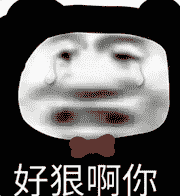

<!--yml
category: 游戏
date: 2022-05-04 19:38:23
-->

# Python：还搁这自己玩连连看呢？看我如何全程自动不需要你动_嗨学编程的博客-CSDN博客

> 来源：[https://blog.csdn.net/fei347795790/article/details/123927228](https://blog.csdn.net/fei347795790/article/details/123927228)

# 序言

最近女朋友在玩连连看，玩了一个星期了还没通关，真的是菜。

我实在是看不过去了，直接用python写了个脚本代码，一分钟一把游戏。

快是快，就是联网玩容易被骂，嘿嘿~



# 直接上代码

模块导入

```
import cv2
import numpy as np
import win32api
import win32gui
import win32con
from PIL import ImageGrab
import time
import random 
```

窗体标题 用于定位游戏窗体

```
WINDOW_TITLE = "连连看" 
```

时间间隔随机生成 [MIN,MAX]

```
TIME_INTERVAL_MAX = 0.06
TIME_INTERVAL_MIN = 0.1 
```

游戏区域距离顶点的x偏移

```
MARGIN_LEFT = 10 
```

游戏区域距离顶点的y偏移

```
MARGIN_HEIGHT = 180 
```

横向的方块数量

```
H_NUM = 19 
```

纵向的方块数量

```
V_NUM = 11 
```

方块宽度

```
POINT_WIDTH = 31 
```

方块高度

```
POINT_HEIGHT = 35 
```

空图像编号

```
EMPTY_ID = 0 
```

切片处理时候的左上、右下坐标：

```
SUB_LT_X = 8
SUB_LT_Y = 8
SUB_RB_X = 27
SUB_RB_Y = 27 
```

游戏的最多消除次数

```
MAX_ROUND = 200 
```

获取窗体坐标位置

```
def getGameWindow():

    window = win32gui.FindWindow(None, WINDOW_TITLE)

    while not window:
        print('Failed to locate the game window , reposition the game window after 10 seconds...')
        time.sleep(10)
        window = win32gui.FindWindow(None, WINDOW_TITLE)

    win32gui.SetForegroundWindow(window)
    pos = win32gui.GetWindowRect(window)
    print("Game windows at " + str(pos))
    return (pos[0], pos[1]) 
```

获取屏幕截图

```
def getScreenImage():
    print('Shot screen...')

    scim = ImageGrab.grab()
    scim.save('screen.png')

    return cv2.imread("screen.png") 
```

从截图中分辨图片 处理成地图

```
def getAllSquare(screen_image, game_pos):
    print('Processing pictures...')

    game_x = game_pos[0] + MARGIN_LEFT
    game_y = game_pos[1] + MARGIN_HEIGHT

    all_square = []
    for x in range(0, H_NUM):
        for y in range(0, V_NUM):

            square = screen_image[game_y + y * POINT_HEIGHT:game_y + (y + 1) * POINT_HEIGHT,
                     game_x + x * POINT_WIDTH:game_x + (x + 1) * POINT_WIDTH]
            all_square.append(square)

    finalresult = []
    for square in all_square:
        s = square[SUB_LT_Y:SUB_RB_Y, SUB_LT_X:SUB_RB_X]
        finalresult.append(s)
    return finalresult 
```

判断列表中是否存在相同图形
存在返回进行判断图片所在的id
否则返回-1

```
def isImageExist(img, img_list):
    i = 0
    for existed_img in img_list:

        b = np.subtract(existed_img, img)

        if not np.any(b):
            return i
        i = i + 1
    return -1 
```

获取所有的方块类型

```
def getAllSquareTypes(all_square):
    print("Init pictures types...")
    types = []

    number = []

    nowid = 0;
    for square in all_square:
        nid = isImageExist(square, types)

        if nid == -1:
            types.append(square)
            number.append(1);
        else:

            number[nid] = number[nid] + 1
            if (number[nid] > number[nowid]):
                nowid = nid

    global EMPTY_ID
    EMPTY_ID = nowid
    print('EMPTY_ID = ' + str(EMPTY_ID))
    return types 
```

将二维图片矩阵转换为二维数字矩阵
注意因为在上面对截屏切片时是以列为优先切片的
所以生成的record二维矩阵每行存放的其实是游戏屏幕中每列的编号
换个说法就是record其实是游戏屏幕中心对称后的列表

```
def getAllSquareRecord(all_square_list, types):
    print("Change map...")
    record = []
    line = []
    for square in all_square_list:
        num = 0
        for type in types:
            res = cv2.subtract(square, type)
            if not np.any(res):
                line.append(num)
                break
            num += 1

        if len(line) == V_NUM:
            print(line);
            record.append(line)
            line = []
    return record 
```

判断给出的两个图像能否消除

```
def canConnect(x1, y1, x2, y2, r):
    result = r[:]

    if result[x1][y1] == EMPTY_ID or result[x2][y2] == EMPTY_ID:
        return False
    if x1 == x2 and y1 == y2:
        return False
    if result[x1][y1] != result[x2][y2]:
        return False

    if horizontalCheck(x1, y1, x2, y2, result):
        return True

    if verticalCheck(x1, y1, x2, y2, result):
        return True

    if turnOnceCheck(x1, y1, x2, y2, result):
        return True

    if turnTwiceCheck(x1, y1, x2, y2, result):
        return True

    return False 
```

判断横向联通

```
def horizontalCheck(x1, y1, x2, y2, result):
    if x1 == x2 and y1 == y2:
        return False
    if x1 != x2:
        return False
    startY = min(y1, y2)
    endY = max(y1, y2)

    if (endY - startY) == 1:
        return True

    for i in range(startY + 1, endY):
        if result[x1][i] != EMPTY_ID:
            return False
    return True 
```

判断纵向联通

```
def verticalCheck(x1, y1, x2, y2, result):
    if x1 == x2 and y1 == y2:
        return False

    if y1 != y2:
        return False
    startX = min(x1, x2)
    endX = max(x1, x2)

    if (endX - startX) == 1:
        return True

    for i in range(startX + 1, endX):
        if result[i][y1] != EMPTY_ID:
            return False
    return True 
```

判断一个拐点可联通

```
def turnOnceCheck(x1, y1, x2, y2, result):
    if x1 == x2 or y1 == y2:
        return False

    cx = x1
    cy = y2
    dx = x2
    dy = y1

    if result[cx][cy] == EMPTY_ID:
        if horizontalCheck(x1, y1, cx, cy, result) and verticalCheck(cx, cy, x2, y2, result):
            return True
    if result[dx][dy] == EMPTY_ID:
        if verticalCheck(x1, y1, dx, dy, result) and horizontalCheck(dx, dy, x2, y2, result):
            return True
    return False 
```

判断两个拐点可联通

```
def turnTwiceCheck(x1, y1, x2, y2, result):
    if x1 == x2 and y1 == y2:
        return False

    for i in range(0, len(result)):
        for j in range(0, len(result[1])):

            if result[i][j] != EMPTY_ID:
                continue

            if i != x1 and i != x2 and j != y1 and j != y2:
                continue

            if (i == x1 and j == y2) or (i == x2 and j == y1):
                continue
            if turnOnceCheck(x1, y1, i, j, result) and (
                    horizontalCheck(i, j, x2, y2, result) or verticalCheck(i, j, x2, y2, result)):
                return True
            if turnOnceCheck(i, j, x2, y2, result) and (
                    horizontalCheck(x1, y1, i, j, result) or verticalCheck(x1, y1, i, j, result)):
                return True
    return False 
```

自动消除

```
def autoRelease(result, game_x, game_y):

    for i in range(0, len(result)):
        for j in range(0, len(result[0])):

            if result[i][j] != EMPTY_ID:

                for m in range(0, len(result)):
                    for n in range(0, len(result[0])):
                        if result[m][n] != EMPTY_ID:

                            if canConnect(i, j, m, n, result):

                                result[i][j] = EMPTY_ID
                                result[m][n] = EMPTY_ID
                                print('Remove ：' + str(i + 1) + ',' + str(j + 1) + ' and ' + str(m + 1) + ',' + str(
                                    n + 1))

                                x1 = game_x + j * POINT_WIDTH
                                y1 = game_y + i * POINT_HEIGHT
                                x2 = game_x + n * POINT_WIDTH
                                y2 = game_y + m * POINT_HEIGHT

                                win32api.SetCursorPos((x1 + 15, y1 + 18))
                                win32api.mouse_event(win32con.MOUSEEVENTF_LEFTDOWN, x1 + 15, y1 + 18, 0, 0)
                                win32api.mouse_event(win32con.MOUSEEVENTF_LEFTUP, x1 + 15, y1 + 18, 0, 0)

                                time.sleep(random.uniform(TIME_INTERVAL_MIN, TIME_INTERVAL_MAX))

                                win32api.SetCursorPos((x2 + 15, y2 + 18))
                                win32api.mouse_event(win32con.MOUSEEVENTF_LEFTDOWN, x2 + 15, y2 + 18, 0, 0)
                                win32api.mouse_event(win32con.MOUSEEVENTF_LEFTUP, x2 + 15, y2 + 18, 0, 0)
                                time.sleep(random.uniform(TIME_INTERVAL_MIN, TIME_INTERVAL_MAX))

                                return True
    return False 
```

效果的话得上传视频，截图展现不出来效果，大家可以自行试试。

> 素材在下方或者主页左侧扫码获取

# 全部代码

```
 import cv2
import numpy as np
import win32api
import win32gui
import win32con
from PIL import ImageGrab
import time
import random

WINDOW_TITLE = "连连看"

TIME_INTERVAL_MAX = 0.06
TIME_INTERVAL_MIN = 0.1

MARGIN_LEFT = 10

MARGIN_HEIGHT = 180

H_NUM = 19

V_NUM = 11

POINT_WIDTH = 31

POINT_HEIGHT = 35

EMPTY_ID = 0

SUB_LT_X = 8
SUB_LT_Y = 8
SUB_RB_X = 27
SUB_RB_Y = 27

MAX_ROUND = 200

def getGameWindow():

    window = win32gui.FindWindow(None, WINDOW_TITLE)

    while not window:
        print('Failed to locate the game window , reposition the game window after 10 seconds...')
        time.sleep(10)
        window = win32gui.FindWindow(None, WINDOW_TITLE)

    win32gui.SetForegroundWindow(window)
    pos = win32gui.GetWindowRect(window)
    print("Game windows at " + str(pos))
    return (pos[0], pos[1])

def getScreenImage():
    print('Shot screen...')

    scim = ImageGrab.grab()
    scim.save('screen.png')

    return cv2.imread("screen.png")

def getAllSquare(screen_image, game_pos):
    print('Processing pictures...')

    game_x = game_pos[0] + MARGIN_LEFT
    game_y = game_pos[1] + MARGIN_HEIGHT

    all_square = []
    for x in range(0, H_NUM):
        for y in range(0, V_NUM):

            square = screen_image[game_y + y * POINT_HEIGHT:game_y + (y + 1) * POINT_HEIGHT,
                     game_x + x * POINT_WIDTH:game_x + (x + 1) * POINT_WIDTH]
            all_square.append(square)

    finalresult = []
    for square in all_square:
        s = square[SUB_LT_Y:SUB_RB_Y, SUB_LT_X:SUB_RB_X]
        finalresult.append(s)
    return finalresult

def isImageExist(img, img_list):
    i = 0
    for existed_img in img_list:

        b = np.subtract(existed_img, img)

        if not np.any(b):
            return i
        i = i + 1
    return -1

def getAllSquareTypes(all_square):
    print("Init pictures types...")
    types = []

    number = []

    nowid = 0;
    for square in all_square:
        nid = isImageExist(square, types)

        if nid == -1:
            types.append(square)
            number.append(1);
        else:

            number[nid] = number[nid] + 1
            if (number[nid] > number[nowid]):
                nowid = nid

    global EMPTY_ID
    EMPTY_ID = nowid
    print('EMPTY_ID = ' + str(EMPTY_ID))
    return types

def getAllSquareRecord(all_square_list, types):
    print("Change map...")
    record = []
    line = []
    for square in all_square_list:
        num = 0
        for type in types:
            res = cv2.subtract(square, type)
            if not np.any(res):
                line.append(num)
                break
            num += 1

        if len(line) == V_NUM:
            print(line);
            record.append(line)
            line = []
    return record

def canConnect(x1, y1, x2, y2, r):
    result = r[:]

    if result[x1][y1] == EMPTY_ID or result[x2][y2] == EMPTY_ID:
        return False
    if x1 == x2 and y1 == y2:
        return False
    if result[x1][y1] != result[x2][y2]:
        return False

    if horizontalCheck(x1, y1, x2, y2, result):
        return True

    if verticalCheck(x1, y1, x2, y2, result):
        return True

    if turnOnceCheck(x1, y1, x2, y2, result):
        return True

    if turnTwiceCheck(x1, y1, x2, y2, result):
        return True

    return False

def horizontalCheck(x1, y1, x2, y2, result):
    if x1 == x2 and y1 == y2:
        return False
    if x1 != x2:
        return False
    startY = min(y1, y2)
    endY = max(y1, y2)

    if (endY - startY) == 1:
        return True

    for i in range(startY + 1, endY):
        if result[x1][i] != EMPTY_ID:
            return False
    return True

def verticalCheck(x1, y1, x2, y2, result):
    if x1 == x2 and y1 == y2:
        return False

    if y1 != y2:
        return False
    startX = min(x1, x2)
    endX = max(x1, x2)

    if (endX - startX) == 1:
        return True

    for i in range(startX + 1, endX):
        if result[i][y1] != EMPTY_ID:
            return False
    return True

def turnOnceCheck(x1, y1, x2, y2, result):
    if x1 == x2 or y1 == y2:
        return False

    cx = x1
    cy = y2
    dx = x2
    dy = y1

    if result[cx][cy] == EMPTY_ID:
        if horizontalCheck(x1, y1, cx, cy, result) and verticalCheck(cx, cy, x2, y2, result):
            return True
    if result[dx][dy] == EMPTY_ID:
        if verticalCheck(x1, y1, dx, dy, result) and horizontalCheck(dx, dy, x2, y2, result):
            return True
    return False

def turnTwiceCheck(x1, y1, x2, y2, result):
    if x1 == x2 and y1 == y2:
        return False

    for i in range(0, len(result)):
        for j in range(0, len(result[1])):

            if result[i][j] != EMPTY_ID:
                continue

            if i != x1 and i != x2 and j != y1 and j != y2:
                continue

            if (i == x1 and j == y2) or (i == x2 and j == y1):
                continue
            if turnOnceCheck(x1, y1, i, j, result) and (
                    horizontalCheck(i, j, x2, y2, result) or verticalCheck(i, j, x2, y2, result)):
                return True
            if turnOnceCheck(i, j, x2, y2, result) and (
                    horizontalCheck(x1, y1, i, j, result) or verticalCheck(x1, y1, i, j, result)):
                return True
    return False

def autoRelease(result, game_x, game_y):

    for i in range(0, len(result)):
        for j in range(0, len(result[0])):

            if result[i][j] != EMPTY_ID:

                for m in range(0, len(result)):
                    for n in range(0, len(result[0])):
                        if result[m][n] != EMPTY_ID:

                            if canConnect(i, j, m, n, result):

                                result[i][j] = EMPTY_ID
                                result[m][n] = EMPTY_ID
                                print('Remove ：' + str(i + 1) + ',' + str(j + 1) + ' and ' + str(m + 1) + ',' + str(
                                    n + 1))

                                x1 = game_x + j * POINT_WIDTH
                                y1 = game_y + i * POINT_HEIGHT
                                x2 = game_x + n * POINT_WIDTH
                                y2 = game_y + m * POINT_HEIGHT

                                win32api.SetCursorPos((x1 + 15, y1 + 18))
                                win32api.mouse_event(win32con.MOUSEEVENTF_LEFTDOWN, x1 + 15, y1 + 18, 0, 0)
                                win32api.mouse_event(win32con.MOUSEEVENTF_LEFTUP, x1 + 15, y1 + 18, 0, 0)

                                time.sleep(random.uniform(TIME_INTERVAL_MIN, TIME_INTERVAL_MAX))

                                win32api.SetCursorPos((x2 + 15, y2 + 18))
                                win32api.mouse_event(win32con.MOUSEEVENTF_LEFTDOWN, x2 + 15, y2 + 18, 0, 0)
                                win32api.mouse_event(win32con.MOUSEEVENTF_LEFTUP, x2 + 15, y2 + 18, 0, 0)
                                time.sleep(random.uniform(TIME_INTERVAL_MIN, TIME_INTERVAL_MAX))

                                return True
    return False

def autoRemove(squares, game_pos):
    game_x = game_pos[0] + MARGIN_LEFT
    game_y = game_pos[1] + MARGIN_HEIGHT

    while True:
        if not autoRelease(squares, game_x, game_y):

            return

if __name__ == '__main__':
    random.seed()

    game_pos = getGameWindow()
    time.sleep(1)

    screen_image = getScreenImage()

    all_square_list = getAllSquare(screen_image, game_pos)

    types = getAllSquareTypes(all_square_list)

    result = np.transpose(getAllSquareRecord(all_square_list, types))

    print('The total elimination amount is ' + str(autoRemove(result, game_pos))) 
```

兄弟们快去试试吧