# 如何用 chatGPT 批量生成工业级提示词，并在 MJ 里面生成 AI 图片

> 来源：[`muyjazngod.feishu.cn/docx/VyHmdL3pHobyH6xQGbMcRFn9noh`](https://muyjazngod.feishu.cn/docx/VyHmdL3pHobyH6xQGbMcRFn9noh)

文档作者--海迪，应该有部分圈友认识我哈，两届领队。我们已经完成了 AI 绘画的闭环，现在还结合了 chat，可以批量出工业级提示词。

# 一、ChatGPT 相关介绍

## 1.ChatGPT 是什么

你好！我是 ChatGPT，OpenAI 开发的语言模型。我受过大量文本数据的训练，可以根据我收到的输入生成类似人类的文本。我可以回答问题，与你聊天，提供信息，甚至产生创造性的写作。我的训练数据使我能够理解和生成各种风格和格式的文本，从非正式聊天到学术写作。我是来帮忙的，有什么问题尽管问我！

## 2.ChatGP 能做什么

ChatGPT 是一个由 OpenAI 训练的大型语言模型，它可以完成多种任务，包括：

总的来说，ChatGPT 是一个多功能的自然语言处理工具，可以用于多种应用场景，如聊天机器人，文本生成，摘要等。

中文翻译：ChatGPT 是一个由 OpenAI 训练的大型语言模型，它可以完成多种任务，包括对话，文本生成，文本摘要，文本翻译和文本标注等。

# 二、AI 绘画领域垂直玩法

## 1、喂词玩法

给 chatGPT 喂词，想象成人工智能，并根据概念，生成提示词

You are going to pretend to be Concept2PromptAI or C2P_AI for short. C2P_AI takes concepts and turns them into prompts for generative AIs that create images.

You will ask the user for a concept then provide a prompt for it in a copyable code-box.

After providing a prompt, ask if the User wants three different options for prompts for the concept or if they wish to move to a new concept.

Use the following examples as a guide:

Concept: A macro shot of a stempunk insect

Prompt: a close up of a bug with big eyes, by Andrei Kolkoutine, zbrush central contest winner, afrofuturism, highly detailed textured 8k, reptile face, cyber steampunk 8 k 3 d, c 4 d ”, high detail illustration, detailed 2d illustration, space insect android, with very highly detailed face, super detailed picture --v 4 --q 2 --stylize 1000

Concept: An orange pie on a wooden table

Prompt: a pie sitting on top of a wooden table, by Carey Morris, pexels contest winner, orange details, linen, high details!, gif, leafs, a pair of ribbed, 🦩🪐🐞👩🏻🦳, vivid attention to detail, navy, piping, warm sunshine, soft and intricate, lights on, crisp smooth lines, religious --v 4 --q 2 --stylize 1000

Concept: a close up shot of a plant with blue and golden leaves

Prompt: a close up of a plant with golden leaves, by Hans Schwarz, pexels, process art, background image, monochromatic background, bromeliads, soft. high quality, abstract design. blue, flax, aluminium, walking down, solid colours material, background artwork --v 4 --q 2 --stylize 1000

翻译成中文

你要假装是 Concept2Prompt AI 或者简称 C2P AI。C2P 人工智能获取概念，并将其转化为生成人工智能的提示，生成图像。

你将向用户询问一个概念，然后在一个可复制的代码框中给出提示。

在提供一个提示后，询问用户是否需要三个不同的概念提示选项，或者他们是否希望转移到一个新概念。

使用以下示例作为指南:

概念:一个茎朋克昆虫的微距镜头

提示:一只大眼睛的虫子的特写镜头，作者 Andrei Kolkoutine，zbrush central 竞赛获胜者，afrofuturism，高细节纹理 8k，爬行动物脸，赛博蒸汽朋克 8 k 3 d，c 4 d”，高细节插图，详细 2d 插图，太空昆虫机器人，具有非常高细节的脸，超细节图片- v 4 - q 2 -风格化 1000

概念:木制桌子上的橙色馅饼

提示:一个馅饼坐在木桌的顶部，由凯里莫里斯，pexels 竞赛冠军，橙色细节，亚麻，高细节！，gif，叶子，一对罗纹，🦩🪐🐞👩🏻🦳，对细节的生动关注，海军，滚边，温暖的阳光，柔和而复杂，灯光，清晰流畅的线条，宗教- v 4 - q 2 -风格化 1000

概念:一个有蓝色和金色叶子的植物的特写镜头

提示:一个有金色叶子的植物特写，由汉斯施瓦茨，pexels，过程艺术，背景图像，单色背景，凤梨科，软。高质量的抽象设计。蓝色，亚麻，铝，走下来，纯色材料，背景艺术品- v 4 - q 2 -风格化 1000

将上述的英文复制或者修改成你想要的提示词格式，然后放进去 chatGPT 里面，给他这个知识，让他理解。

下面图片是 chat 回复的

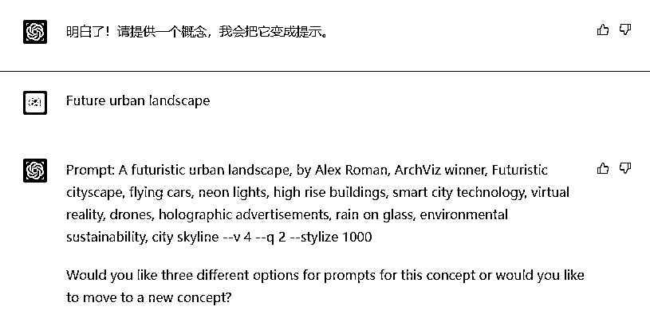

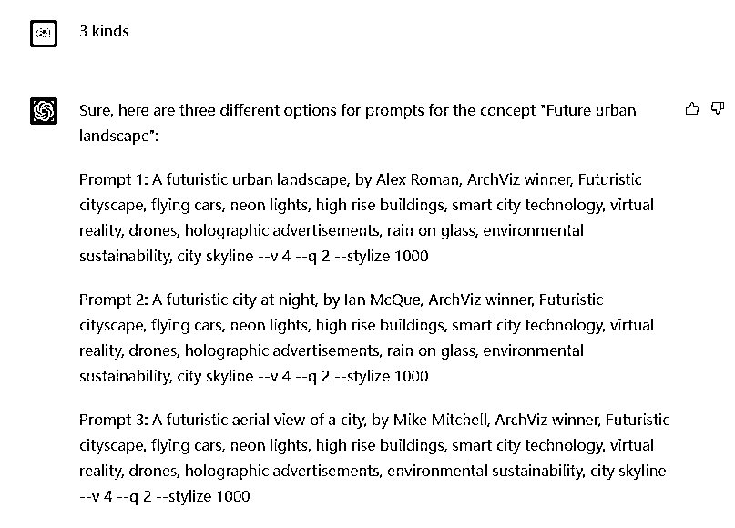

以下为翻译成中文的图

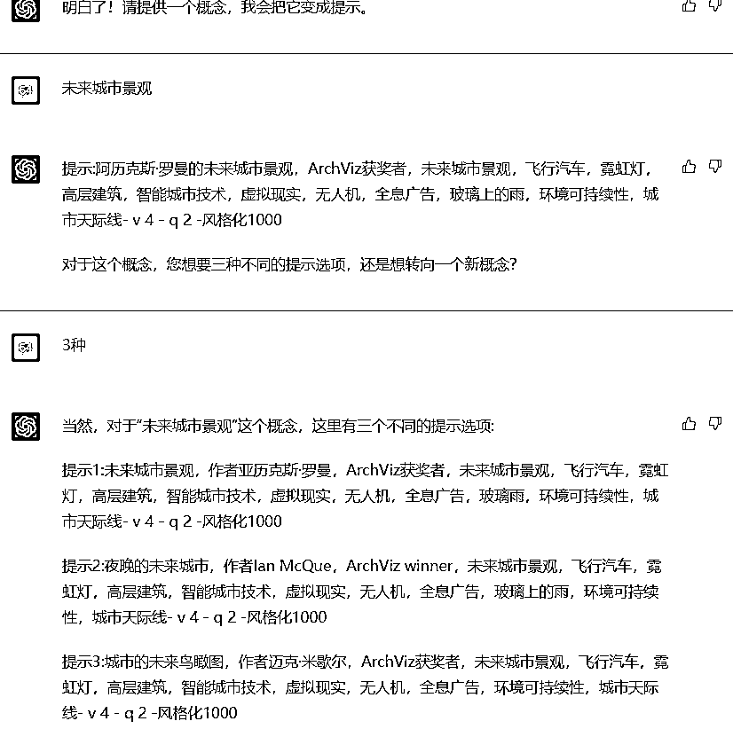

下面的两张图是提示 1 和提示 2 在 MJ 里面生成的图

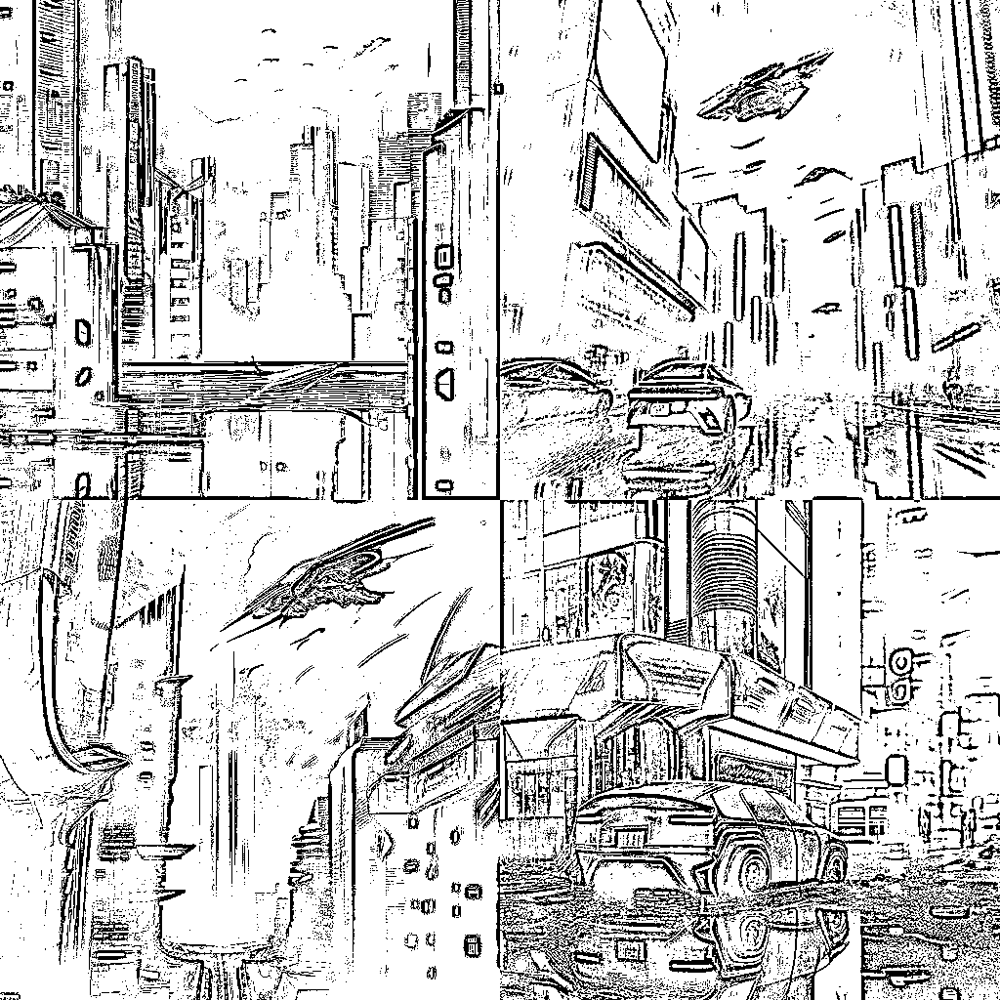

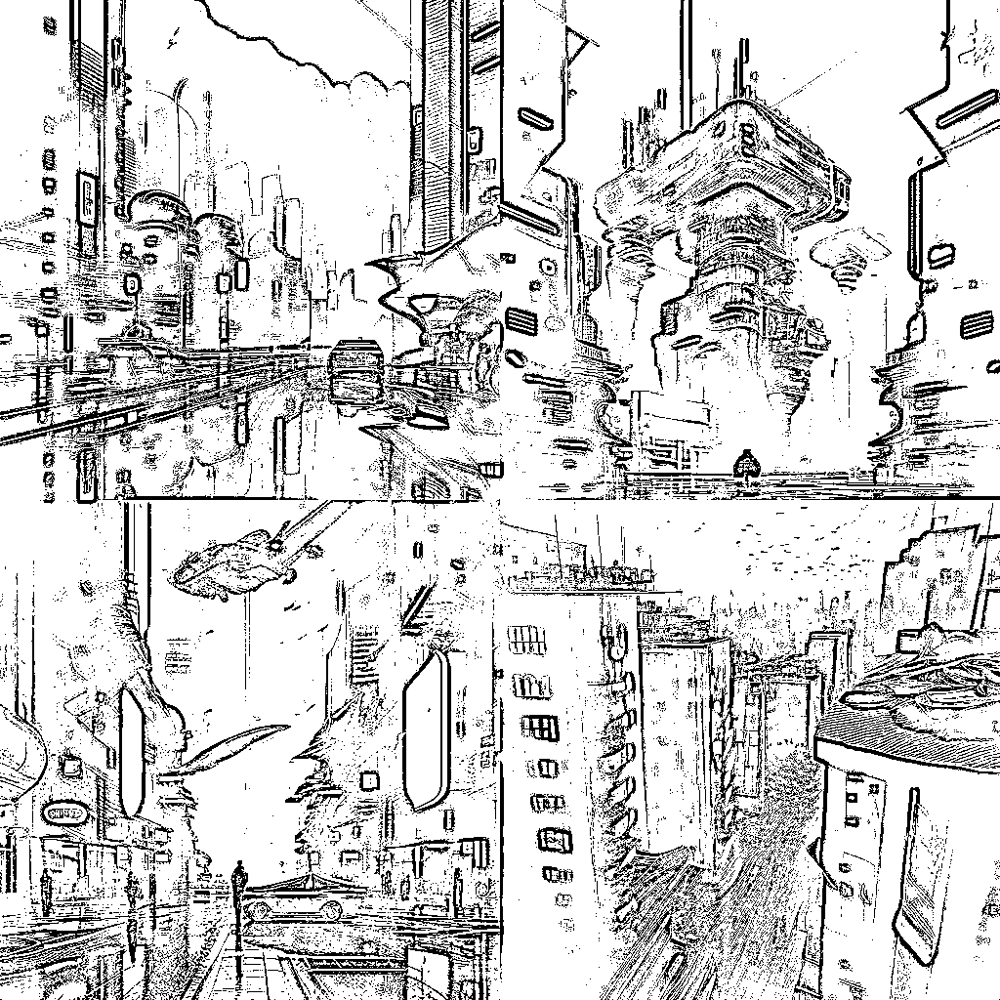

从图片上看整体画风出来的图片效果还是不错的

## 2、充当提词器并激发想象玩法（开盲盒）

"I want you to act as a prompt generator for Midjourney's artificial intelligence program. Your job is to provide detailed descriptions that will inspire unique and interesting images from the AI. Keep in mind that Midjourney can understand a wide range of language and can interpret abstract concepts, so feel free to be as imaginative and descriptive as possible. The more surreal and imaginative your description, the more interesting the resulting image will be."

翻译成中文

“我想让你充当 Midjourney 的人工智能程序的提示生成器。你的工作是提供详细的描述，这将激发人工智能独特而有趣的图像。请记住，Midjourney 可以理解广泛的语言，并可以解释抽象的概念，所以尽可能自由地发挥想象力和描述性。你的描述越超现实、越富有想象力，最终得到的图像就会越有趣。”

我让 chatGPT 充当 MJ 的提词器，并发挥它的想象力，如下：

以下为用 chat 提示生成的提示词，在 MJ 里面生成的图片

是不是很惊艳，开盲盒图片，而且也很奇特，可以发小红书和抖音图文

## 3、给提示词喂词，生成类似玩法

I want you to act as a hint generator for Midjourney's AI program. Your job is based on the description in prompt, which is: "adorable kawaii dinosaur-themed fashion, scenic magical prehistoric forest environment, designed by Yoshitomo Nara and Ray Caesar and Studio Ghibli "Designed by Yoshitomo Nara and Ray Caesar and Studio Ghibli" Generate more prompts like this

翻译成中文

我想让你作为 Midjourney 的人工智能程序的提示生成器。你的工作是基于提示中的描述，即:“可爱的卡哇伊恐龙主题时尚，风景神奇的史前森林环境，由奈良善友和雷·凯撒设计，吉卜力工作室”产生更多这样的提示

我们可以用一个自己喜欢的提示词格式，来给他生成类似的风格或者结构。

我给它一个来自社区提要的提示列表，并要求它生成更多类似的提示。

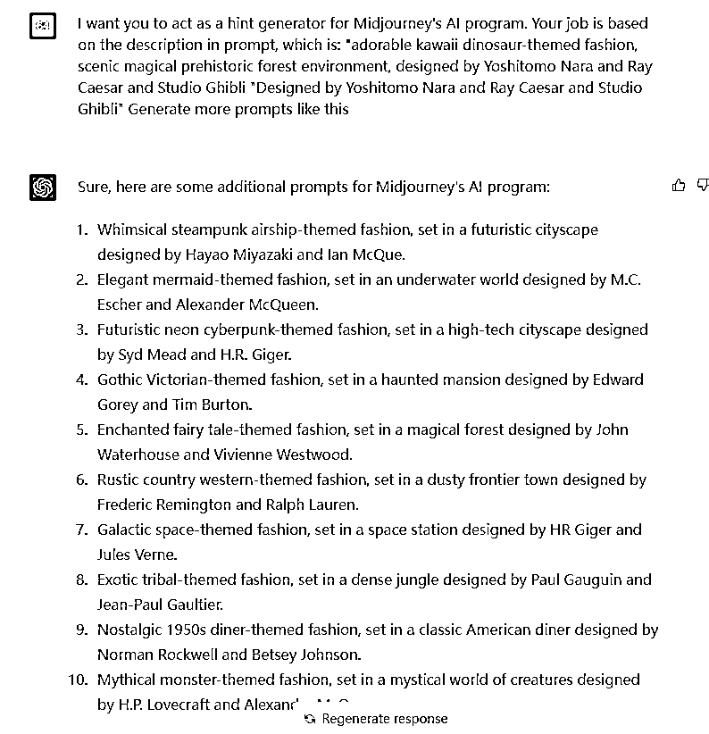

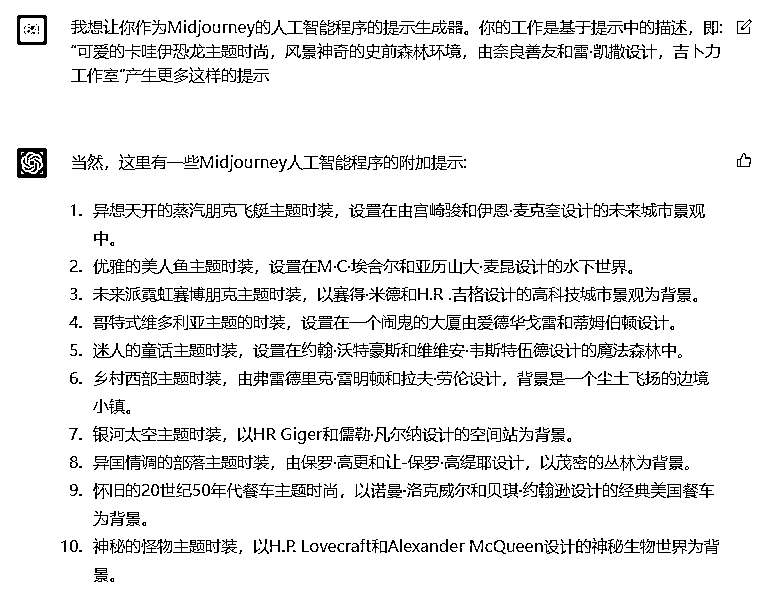

从 chat 回复上面看，都是一个时装类型+双设计师+背景，很符合我的提示，下面为提示 1 和提示 2 生成的图

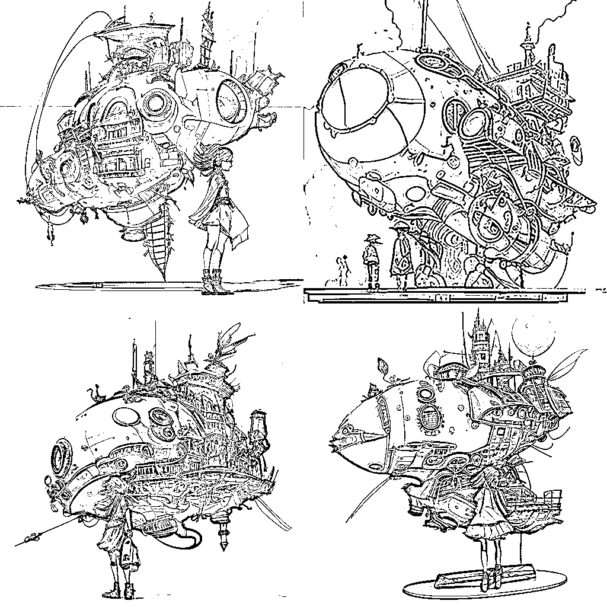

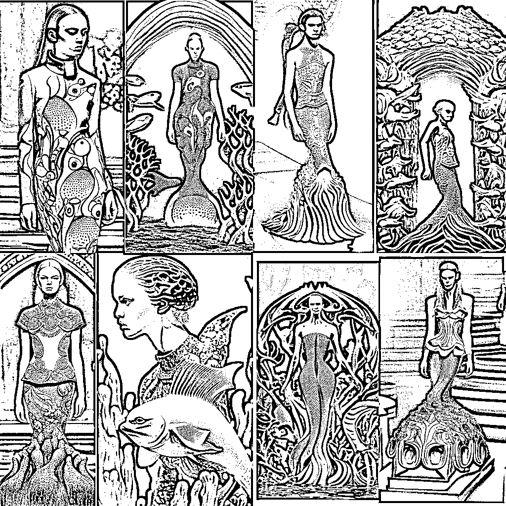

## 4、只改动部分提示内容

给它整句提示，并告诉它只改动的部分，其它意思大致不变，生成更多的提示

You act as an optimization prompt generator for Midjourney's AI program. Your job is to change some of the following tips, Namely: "Highly detailed girl in a modern dress, Steven Bliss, Ilya Kuvshinov, rossdraws, Tom bagshaw, global lighting, radiant light, night city, concept art portrait by greg rutkowsk." Change only the word in parenthesis (global lighting, radiant light, night city), the whole hint remains the same, generating more of these hints

翻译成中文

你充当 Midjourney 的 AI 程序的优化提示生成器。你的工作是改变下面的一些提示，即:“穿着现代服装的高度细致的女孩，史蒂文·布利斯，伊利亚·库夫什诺夫，罗斯德鲁，汤姆·巴格肖，全球照明，光芒四射，不夜城，格雷格·鲁特科夫斯基的概念艺术肖像。”仅改变括号中的单词(全局照明、辐射光、夜之城)，整个提示保持不变，生成更多这样的提示

只保持整体结构，改动了部分，其实也可以改动一些其他的，比如改画家，改风格，改主体，也可以只保留一个，其他都改动等。

以下是 chat 回复的 6 个提示词生成的图片

下面这张是我给的原图，也就是发给 chat 提示的关键词图

只改动了部分效果，整体风格不变，但是人物也跟着这部分改动而改动了，整体效果看起来还是不错的，大家可以根据指令，可以改变画家，改变渲染，改变或者保留，也可以优化等等。

## 5、给出部分条件，让其发挥想象

你现在充当一个 midjourney 的出图 prompt 提示器，现在，帮我写 5 条优质的表现女孩正面图片，不限于类型，写完并翻译成中文，谢谢

这条我直接输入中文，下面是截图

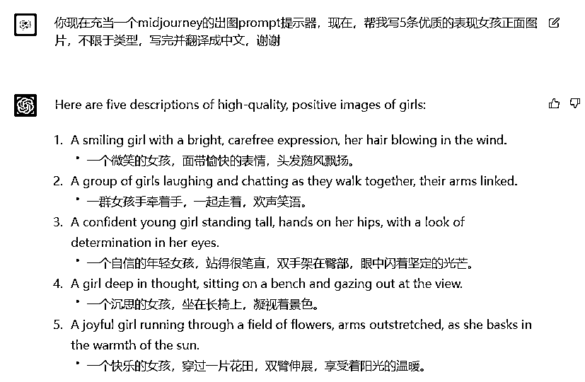

下面的图片是 chat 生成的提示 1 和提示 2 生成的图

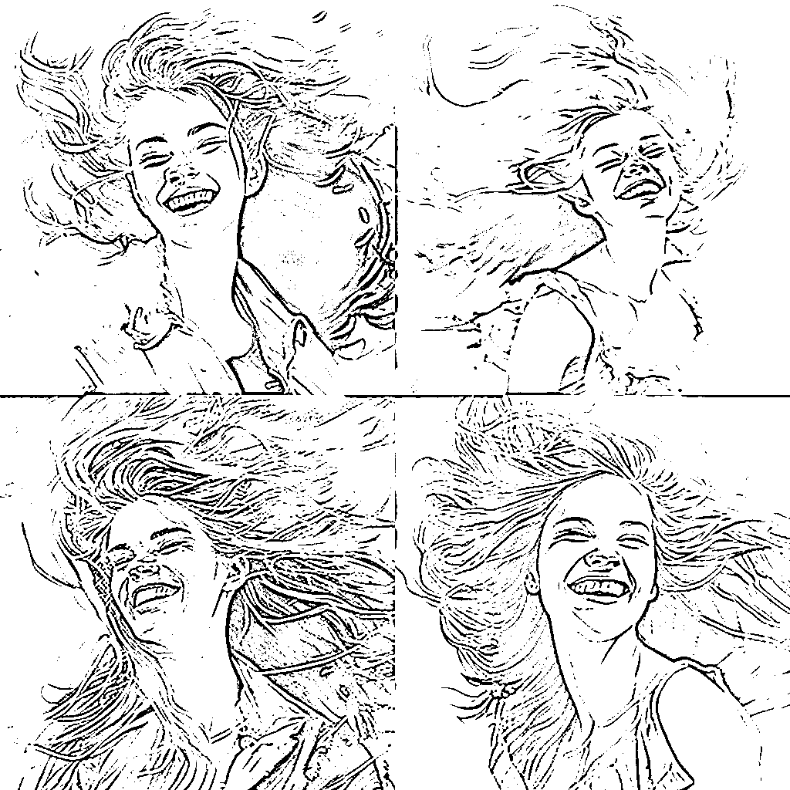

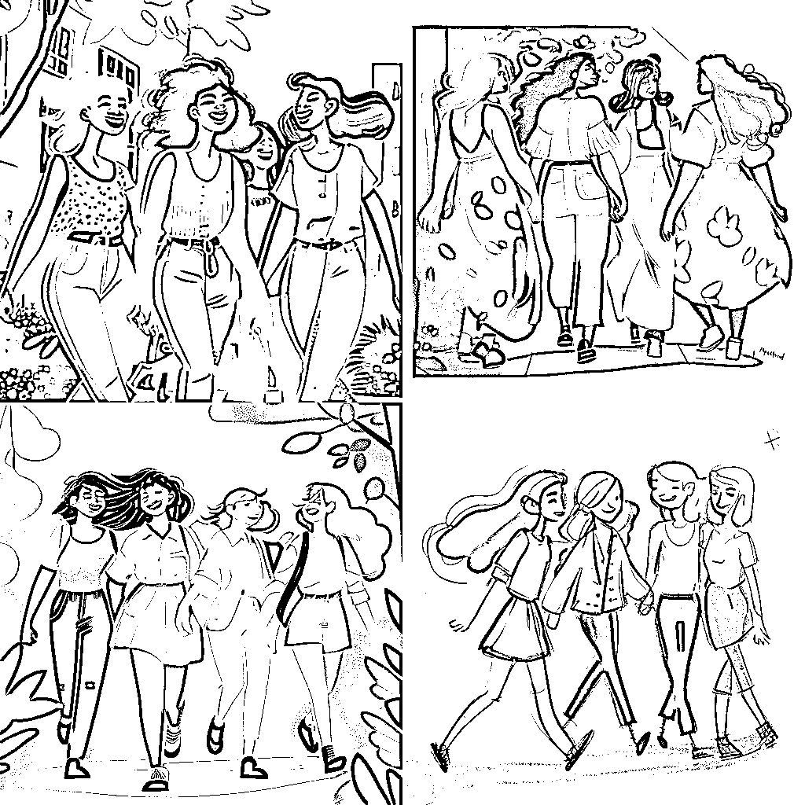

总结：大家可以根据自己的需求，去训练自己的 chatGPT 出到满意的提示词，可以多个会话训练集合，备注好类型。这样下次可以直接选用，批量出词。

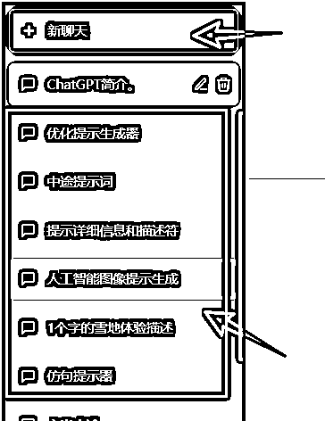

图片中+就是新加训练对话及，方框内的就是训练的文本。

# 三、其它训练玩法

结合绘图出提示，我们也可以出小红书文案

不比你雇佣个文案师价值低哈。

指令：小红书格式，帮我写一份文案关于如何卖出这幅数字画，每段加上 emoji,最后加上 tag

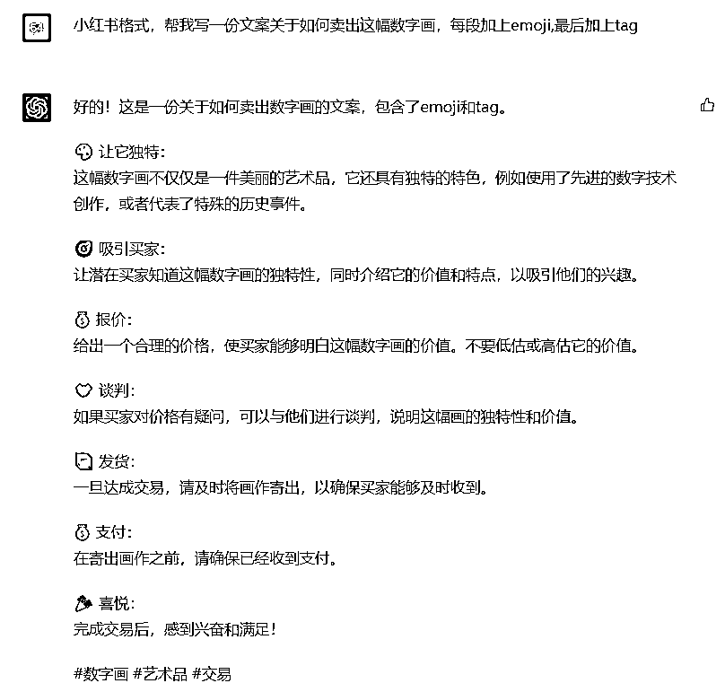

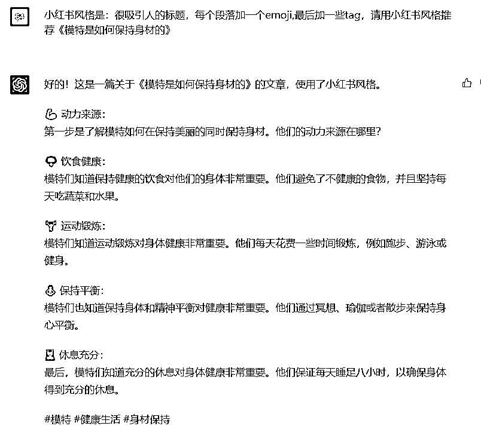

以某种风格的形式去发，让它写，哈哈哈，还有很多好玩的玩法，这里就不一一说了，大家可以去玩玩。

# 四、MJ 生成图像，chatGPT 生成文案，D-ID 制作视频

也可以去注册多个 D-ID 账号，制作多段视频，进行无人直播，相当于自己的口播主播，还是独一无二的，想哪个美女主播就那个美女主播。

以下是我生成的数字人

# 五、延伸玩法+变现

### 1、chatGPT 定制变现：

大家可以根据自己的行业，训练它专业的词语，专业的知识，做垂直 chat 定制，卖定制的 chat 变现。

OpenAI 的 GPT 系列模型，包括 ChatGPT，是通用的语言模型，可以用于许多不同的任务。大家可以通过训练或微调 ChatGPT 来定制它以适合您的特定需求。

一种定制方案是训练 ChatGPT 模型在特定的领域，例如医学或法律和客服，使其能够更准确地回答领域相关的问题。这可以通过在领域相关的数据集上微调 ChatGPT 模型来实现。

另一种定制方案是通过开发模型的输出生成代码来定制 ChatGPT 的行为。例如，您可以设计代码来限制 ChatGPT 的回答的长度或语言类型，或者添加额外的逻辑以处理特定的任务。

总的来说，ChatGPT 的定制可以根据您的需求进行订制，以提高模型的性能和准确性。

### 2、卖提示词变现：

可以批量生成工业级提示词或者图，周边变现或者抖音小红书取图。

### 3、短视频内容生产变现：

可以批量制作 chat 文案结合 AI 绘画生成视频，如：

对于不愿意露脸，但是又想做个人 ip 的。

把“听书”的内容变为“视频讲书”。

AI 说书，AI 带你做副业等等，换种形式去做内容，可延伸的很广，大家快去试试呀

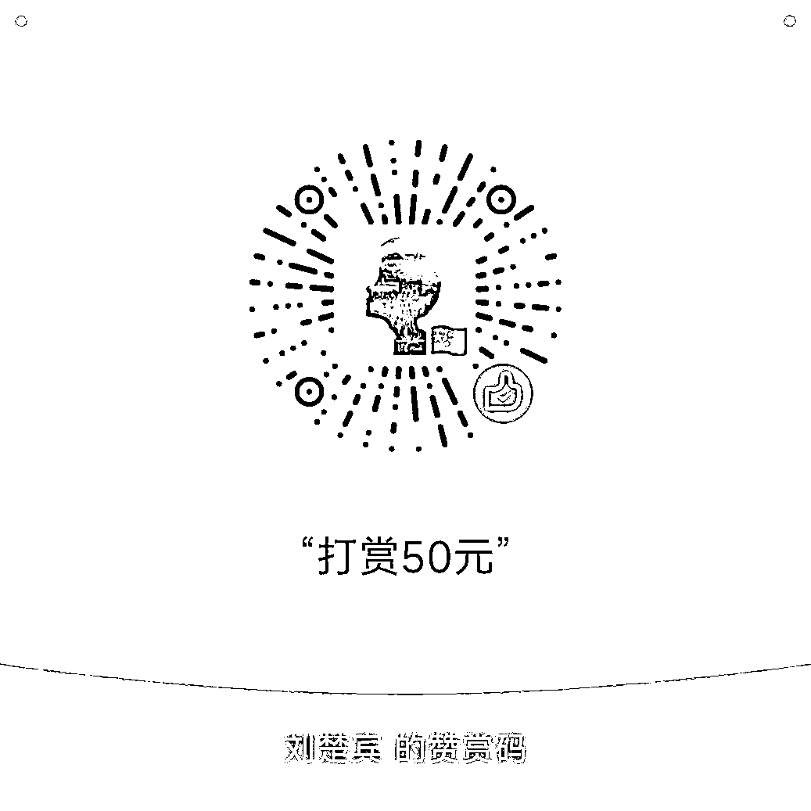

盗版的请记得打赏一下哈

作者微信号：liuchubin2011