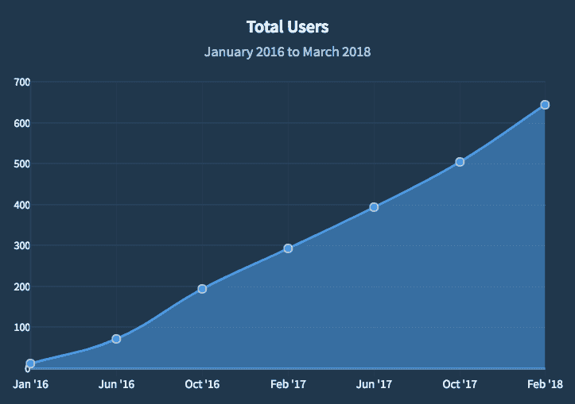

<!--yml
category: 访谈
date: 2022-06-28 10:41:37
-->

# [产品盈利故事]从外包到SaaS，给健身房和武术馆做的软件，月赚5000刀。 | 电鸭

> 来源：[https://eleduck.com/posts/MqzfQz](https://eleduck.com/posts/MqzfQz)

**摘要**

*   月收入￥3W
*   2015年开始
*   1个创始人，0个员工
*   美国
*   健身房管理软件

### 你好，请问你的背景是什么？最近忙什么？

我是 Eran Galperin，软件开发者和科技创业者。有14年软件开发经验。

我 2004 年学物理时就开始在软件行业工作。

大学时我和朋友创办了一个外包团队，专门做 SaaS 开发。

在积累一些经验和资本之后，我和之前一起做外包的一位创始人开始做 [Binpress](https://www.binpress.com/)，一个买卖开源代码的市场。

做 Binpress 期间我们去参加了500Startups 加速器，并获得了种子轮投资。

2015 年底我们把公司卖了，主要为了偿还投资者 （[完整的事后总结看这里](http://techfounder.net/2016/02/11/binpress-postmortem/) )

之后我开始做 [Martial Arts on Rails](https://www.maonrails.com/)， 一个管理系统，专门针对健身房和武术训练学校。 现在盈利是 $5000美金/月。

### 是什么激励你做 Martial Arts on Rails ？

我练巴西柔术十几年了。卖了上一个公司之后，开始想点子做下一个项目，我在想有没有办法把我对柔术的热爱和 SaaS 结合起来。

于是我去问我在的健身房的管理人员，

发现一个痛点：他们用的软件非常臃肿过时，用起来就像 Windows 3.1

因为有开发和用户体验设计的经验，我觉得我可以做的更好，所以我开始做原型，同时为了得到更多数据，在 reddit 上发帖，总体反馈很正面。有少数几个人觉得我做不成。

因为有做 SaaS 的经验，我预计可以几个月搞定。

有个设计师朋友帮忙设计了大致原型和风格。然后设计了使用流程。

开发过程中我经常把半成品给健身房管理人员看。确保方向是正确的。

这段时间里我没工作或其他收入，所以也没有预算来做广告，什么都是自己来。

目标是不拿外部资金 + 把产品做到盈利

### 第一版产品怎么做的？

从点子到开发完成，大概花了三个月。

期间我每周和不同的健身房管理者见面，聊他们现在在用的软件和痛点。

然后想怎么解决这些问题，把功能做进原型。

2016年2月第一版发布时，

产品功能很基本，功能都来自和健身房管理者的聊天。

尽管名字是叫 Martial Arts on Rails ，

但实际用的是 LEMP（Linux，Nginx，MySQL，PHP）

不是 Ruby on Rails

后端用 Zend Framework，之前做其他项目用过。

前端用 jQuery。所有使用流程都针对手机和平板做了优化

### 怎么增长用户的？

因为没预算做营销（Marketing）所以刚开始时是自然增长(organic) + 社交媒体

我想让一些新闻媒体报道产品上线，但很困难，

我在 Product Hunt 上了精选，但那上面不是目标客户

我开始在博客上写内容，重点是线上怎样运营健身房 -

怎么做网上宣传，做 SEO，引荐有奖之类的。

我还联系了很多健身和武术领域的网站，给他们写一些稿子，

这也给网站带来了一些流量。

我在推特上也很活跃，分享一些健身和武术相关内容。希望能涨点粉。

我之前用过一个 Twitter 自动化助手，但因为 Twitter API 的更改，现在用不了了。

我在一些 reddit 板块里也很活跃，那里有很多健身房的经营者，

我联系了之前聊过的健身房老板，让他们试用软件，看能不能代替现在在用的软件，

他们是我的第一批客户，健身这个社区其实很小，他们会互相推荐。

我试了下谷歌广告(AdWords)，但预算不多，而且需要对关键字有很深的了解，所以效果不好。

几个月后我在软件搜索引擎 Capterra 上放广告，

现在搜“武术健身软件”我们排第一，是我最大的付费客户来源。

最初我在 Capterra 上每月花180美元左右，现在接近400美元。

目前，Capterra 和其他搜索引擎是我最主要的客户来源

### 商业模式是什么？怎么增长盈利？

按月收费，有5种不同套餐。

提供30天免费试用，试用期间可以用所有功能

如果30天之后没转成付费套餐，功能会被限制。

增长的主要原因之一是网站上有实时沟通（我用Olark）

因为每天都有交流，我知道是什么吸引他们

我还利用邮件宣传，最开始时发一个定制欢迎邮件，

试用结束前 10 天发一封邮件问是否希望加长试用期，

很多用户会回复，帮我留住了很多客户

一开始，免费用户到付费用户转化率大概是 5％

产品发布四个月后，才得到 2 个付费用户，是我认识的健身房老板，

虽然认识但还是花了几个月他们才转成付费。

现在的转化率是8％多一点点，

主要是加了一些使用例子，以及上面提到的电子邮件营销。

之前在公司做软件开发时，不需要和客户打交道，

因为有联合创始人或者员工来和客户沟通。

但作为独立开发者，我很快意识到提供客户服务非常重要。

和客户沟通让我知道薄弱环节在哪里

比如：体验不好，文件丢失，功能让人看不懂等等。

因为做客服和客户沟通，使得我和很多付费用户建立了个人关系。

他们会推荐给其他人，不仅是因为产品本身，而是对客服也很满意

重点：经常和客户沟通 - 这样你才能理解别人怎样用你的产品

(图片是每月盈利数额，注意图中把日期标错了，忽略就好了）

### 未来目标是什么？

2017 年我主要都在看客户反馈然后一点点改进产品。

我感觉现在这个时间点，可以把精力放一些到宣传了。

虽然现在在没做什么更多宣传的情况下，利润在逐渐增加，贴近翻倍。

但我 2018 年的总体目标是把利润翻 4 倍

随着盈利增加，我也在想办法把盈利投入回去帮助增长。

2018 年的一些目标：

用 Google AdWords 达到回报大于投入，而且逐渐增加投入

雇一个销售

和更多商家合作，做互相推荐

做引荐有奖功能，激励用户推荐我们

最大的挑战是找一个合适的销售人员，销售人员通常在面试的时候很擅长推销自己。但我可能要试几个人才能找到合适的销售

面临过最大挑战是什么？克服过哪些障碍？ 如果重新开始会有什么不同？

刚开始时宣传很难，我四处跑只为了别人能发几篇文章，

而且有好几个月产品没有任何起色（getting zero traction）

如果我之前早点把对外销售的整个流程弄好，估计会不错。

除此之外，其他事情的进展和我的预期一样，因为之前做过其他公司

### 有没有什么特别有帮助的？

我在健身/武术行业作为消费者很多年了，对我理解市场挺有帮助的。我也认识一些人可以获得产品反馈以及早期客户。

我看到很多创业者想进入一个他们不了解的市场，尽管最后可能会成功，但我建议从熟悉的行业开始，增加成功机会。

运营方面有一些建议：

给网站做实时聊天，不管是用 Olark 还是 Intercom

做邮件营销 - 我是用 Mailgun 的 API 自己搭了一套，但你可以用现有的 Mailchimp 或什么其他产品。还有可以看看 [Patrick McKenzie 的邮件营销课]

如果是 B2B 产品，可以考虑在 Capterra 投放广告

经常和客户沟通，了解他们怎么用你的产品，痛点是什么。也和流失的用户沟通，了解他们为什么不再付费了。是缺了什么。

### 对刚开始的创业者有什么建议？

如果你一个人做不到：自己写代码+发布+宣传

强烈建议找联合创始人一起做。第一次很难做到完美，有人一起会很有帮助。

还有我再强调一次：和用户沟通。

很多技术创始人都会看技术指标分析，虽然这也有价值（我自己就跟踪了一堆指标）

但为了真正理解，只能和用户沟通。线上聊天，发邮件，打电话，面对面沟通，尽一切可能。