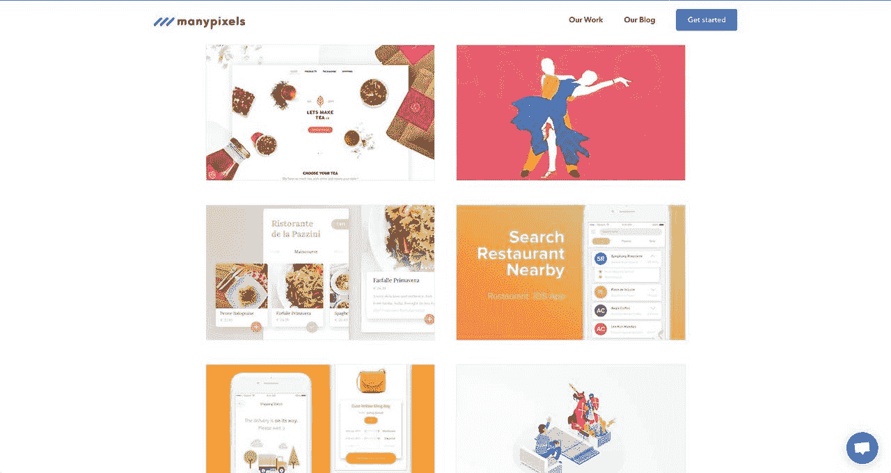

<!--yml
category: 访谈
date: 2022-06-28 10:39:37
-->

# [产品盈利访谈]一个人搞个网站，给客户提供高质量的设计服务，月赚30W | 电鸭

> 来源：[https://eleduck.com/posts/embfk5](https://eleduck.com/posts/embfk5)

**摘要**

> 为客户提供高质量设计服务

#### 你好，请问你的背景是什么？最近在忙什么？

大家好！我是 Robin Vander Heyden，[ManyPixels](https://www.manypixels.co/?utm_source=sideidea.com) 的创始人，
我们为初创公司提供设计服务，高质量+不限量，我们当前月盈利大约是 50,000 美元。

#### 是什么激励你做 ManyPixels ？

做 [ManyPixels](https://www.manypixels.co/?utm_source=sideidea.com) 之前我在荷兰学法律。
当时在做一个服务国际留学生的在线租房中介，做得挺成功，年收入25万欧元。
但之后一项针对房地产公司的法律通过了，年收入锐减到2万5欧元。
那项法律规定房地产公司只能向业主收费，不能向学生收费。所以我得找新点子做。

我毕业后飞去了乌干达的比利时大使馆实习（我第一份"真正意义上的工作"）
但我很不喜欢。于是我在附近旅行了一段时间，思考接下来该做什么。
我有法律学位，也发了一些简历申请工作，
我不断刷朋友的 LinkedIn（领英） 看有没有更新，
在想要不要像他们一样去找个公司上班。
因为之前做生意比较成功，还蛮有压力的，不知道接下来做的事能不能成功。
然后会怀疑自己上次是不是纯粹走运而已，没什么信心。

在非洲旅行完之后，因为朋友推荐，我买了张去亚洲的单程票。
我猜测到了新地方应该会获得一些灵感。
我先去了台北，然后决定在曼谷住两个月。
虽然不清楚接下来要做什么，但还是订了一个共享办公空间。

我到共享办公空间的门口时，看到有块板子，
上面贴着 『我们需要自由职业设计师』或『招聘UX设计师』这样的信息，
我听到有人在抱怨找设计师多么困难。
这个问题对我来说不是问题，我的 Skype 里有很多优秀的设计师朋友，
所以我想：
『也许我能解决这个问题。做一个保证质量（不满意就退款）而且使用简单的平台，
给设计师固定工资让他们留在平台，然后去找客户』

我没考虑太多就直接开始了，而且很快就管用了。
我在 Skype 上找设计师朋友，叫他们发最好的作品集过来，
然后买了个网站模版接上支付系统。花了差不多 5 个小时网站就上线了。
之后把链接发到一些 Facebook 群来找客户，
当天就获得了第一个单子（那天一共收入大概1,500美金）

#### 你是怎么做第一版产品的？

首先我想强调，虽然 ManyPixels 看起来像"一夜成功"，
但做这个之前发生过很多事情。
上大学时因为我的房地产生意做的挺成功，生活的很滋润，
但在读硕士时因为一项法律通过，限制了收费范围。
（我的年收入从25万欧元掉到2万5欧元）

其次，我有一定积蓄，够我旅行大概 1,2 年去找更多灵感。
Pieter Levels 说过 『旅行会让你更独特』
因为体验过不同文化的点点滴滴，会让你更有创造力。
我觉得大家其实都是“创意型创业者”，因为我们把生活中的经历，想法，各种点点滴滴汇聚起来变成一款产品。

具体怎么做产品：

*   找 Skype 上的设计师朋友要他们最好看的作品集
*   买了网站模版，把所有作品集放到网站上，加一个“购买”按钮和一个在线聊天插件

老实说：网站丑爆了。但谁会在意呢？
我们就像是街边那家奇怪的店，却卖着城里味道最好的甜甜圈。这才是人们在乎的。
（当然现在我们的网站好看多了😉）

我们还学到一件奇怪的事：
有些人会觉得『太便宜了，是不是真的啊？』
所以我们就提价了，感觉很傻但居然管用了。盈利额上升了。

我觉得"灵活应变"对尽早发布产品很重要：
我不会编程，所以得找个支付提供商来做。还得找个好看的网站模板。
如果我是出色的程序员或设计师，也许我会花更多时间让网站"更完美"

工具方面，最开始只是 Excel 表格。
我把所有新客户的资料放表里，然后把设计师的成品用邮件交付给客户。
也用 Skype 或 WhatsApp 和设计师沟通。也有很多客户用 WhatsApp 找我。

#### 你是怎么吸引用户的？

我们最早一批用户是通过 Facebook 群找的。
我加了很多 Facebook 群，写了篇文章问群里的人对 ManyPixels 给点意见。
我写的大致是：
『大家好，我们做了这个东西，大家有兴趣吗？[有/没有/试试呗]』
我们还说 "如果提供反馈的话，会发促销码噢"
还挺管用的，很多人发了反馈过来。

我认为我们做对的是：把合适的内容发给合适的用户群。
我很实在的说：
"我现在在曼谷做"数字游民"(Digital Nomad)，在试这个新点子看看是否管用"
大家都挺支持的（虽然有点像广告）

另一个优势是，因为我自己就是科技创业者。我清楚大家喜欢什么设计风格，
我知道创业者都在网上哪里汇集。不用做太多客户调研。 幸运的是这些社区里的人都很开放，愿意尝试新点子。

我试过：

*   在 Reddit 上发设计案例分析
*   在 Indie Hackers 和 Hacker News 积极参加讨论
*   在 Facebook 和 Angel List 上大量联系公司，结果我的帐户被冻结了几个星期。以后我会8换个策略来试。

接下来我们在考虑要不要做 Affiliates 和 Refrerals 系统
（意思就是推荐给别人，如果别人购买了你可以获得一定抽成。
或者是推荐给朋友，朋友注册之后你可以获得一定折扣之类的）

还有多写一些干货内容，弄 PR 和广告，
找合作伙伴，甚至可能还有 贴牌产品 (White Labeling）

你可能好奇，其中效果最好的策略是什么？
我之前提过，具体不是策略，而是把正确的信息放到正确的受众面前。
我们 Angel List 上发的邮件转换率有 25％，非常高。
之前我那个房地产生意里，我主要做销售（找新业主和新租户）
我喜欢和别人沟通，我觉得很有意思，如果成功了会很有动力。

我对刚开始的人的建议：专注做事然后尽早发布

和用户一起做产品，尽快获得反馈然后迭代。
作为人类我们本身就有偏见而且不完美，产品不可能从一开始就是完美的。
而且你也可能会在做对的同时错过其他更大的机会。

专注做事然后尽早发布，把产品放到用户面前，让自由市场来决定是干掉它还是捧起它。

#### 商业模式是什么？你是如何增长盈利的？

我们提供按月付费的设计服务。
用户每月支付固定费用来享受不限量的的高质量设计服务。

目前有两个套餐：基本版（259美元/月），高级版（349美元/月）
最开始的定价是：基本版（99美元/月） ，高级版（179美元/月）
支付用的是 Stripe

现在有 210 个客户，每月收入 50,000 美金

对营收帮助最大的有 2 个：Product Hunt 和 Hacker News 。
我们上过 Product Hunt 的首页第三，
我还写了篇文章，介绍 ManyPixels 是怎么开始的，
文章被顶到 Hacker News 首页差不多一整天。
我在 Reddit 上也获得了一些流量（比 Hacker News 容易些）
这些渠道每天能带来几十个新客户。

我对商业模式的建议是：尽早收费。 如果不盈利就算不上是生意。
（媒体公司或社交网络公司不算）

我们的利润率（margins）：
12月是 20-30％，1月增长到 50％ 多。 2月应该会更高。
转化率还没追踪，但从上线到现在的总流量大概是 30,000。

营收表

*   2017年12月： 8500
*   2018年1月： 15000
*   2018年2月： 50000

#### 未来的目标是什么？

我有 3 个商业目标和 1 个个人目标：

1.  2020 年达到1亿美元营收。希望客户一想到创造性工作就想到我们。

2.  解决设计的"主观性"问题，更加深入了解客户的要求。
    （也许开发一个 AI 系统来做这个）
    确保我们总是超出客户的期望。
    设计是非常主观的事情，最终会成为爆发式增长的瓶颈
    （业务从100万美元 -> 1亿美元）
    目前没人在解决这个问题。 所以如果我们能解决这个问题，
    更好得理解客户，超出他们的期望值，
    这样就再也没有天花板了，天空才是我们的极限

3.  我还想办一个像素学校（Pixel school)
    给亚洲主要城市里的企业家提供免费英语课，免费商业课，免费 UI / UX 课。
    加强品牌名声，帮助我们雇佣优秀设计师，同时也是回馈社会。
    我打算今年夏天先做一个小训练营来练手，看看大家的反馈如何，
    验证这个点子是否有价值

个人目标是，花更多时间在其他兴趣上。
我对其他学科也很感兴趣，比如建筑，设计和文学，
但自从弄了 ManyPixels，我发现自己只在思考商业问题。
总之，我想跟上这个时代。
我担心如果因为现在的小成功松懈了，以后就想不出什么好点子了。

#### 面临过的最大挑战是什么？克服了哪些障碍？ 如果重来会有什么不同？

我们是服务行业。 最大的障碍是管理人，以及不断招聘有才华的设计师。
我们和亚洲的自由设计师合作。我们用金钱来激励他们， 不过效果不如欧洲和美国那么好，他们对社区和家庭更看中，所以要考虑到这一点。
住过亚洲和非洲有助于我理解不同文化看重不同方面，但我现在也只是了解皮毛而已。

其次，我在之前的工作里（以及大学期间）过度追求完美，我会长时间工作。
要求员工每天打至少 100 个销售电话。这会把人累垮（包括我自己） (burn out）
所以现在意识到『做完』比『做完美』更重要。

有没有什么东西特别有帮助？
我最喜欢的博客是 Shane Parrish 的 [Farnam Street](https://www.fs.blog/?utm_source=sideidea.com) 。
几年前我第一次看到这个时，觉得有点无聊。
但随着我的生意发展，我开始觉得这些内容非常好。

第二，我最喜欢的信息来源是 Hacker News。
虽然有时候个别评论很消极，但总的来说里面的讨论水平比较高端。

我觉得最重要的一点是，我从不满足，我想把自己推到极限。
很努力的工作，尽可能赚多钱，尽可能产生最大的影响力（highest impact）

我最大的优势是，出生于比利时的一个中产家庭，
我有美好的童年，受过良好的教育，有很多自由。
从一出生我就有一手好牌，我所有一切成绩都主要归功于好环境。

小时候，父母每周至少有一天会带我去公共图书馆。
（我们可以想看什么看什么，当然我们大部分看的是漫画）
我还读了很多小说和经典名著。
图书馆里有家租游戏的店，我和父亲和兄弟会联机打游戏
（主要是雷神之锤III和虚幻竞技场）

我父亲是软件工程师，让我们经常用电脑，他帮我编写了我的第一个网站。
我10岁时很喜欢哈利波特，于是我父亲写了一个在线角色扮演游戏，
可以"入学"霍格沃茨（哈利波特小说中的学校名）
我父亲还教我用易趣（Ebay）卖东西。
教我用论坛（usenet）和 IRC（一个聊天软件，类似 QQ）

这样的童年对我的成功非常重要。我父母的要求是能毕业就行，
不要求特定成绩，不要求我从事任何特定职业，过得开心就行。
他们给了我很多自由。我的父母还帮我介绍学生工作和实习工作，
我还在澳大利亚和堂兄 (cousin) 住了几个月来学英语。

最后，虽然我总是在说自己的事，但我不是一个自大的人。
我只是想继续做有趣的事情（当然也要赚钱）
我不在乎会不会失败；我不在乎哪怕明天就失去所有的钱。

最让我兴奋的是创造出一个东西，发布，然后不断改进把它做大。
我有时会去卖车网站看我所有的钱可以买什么样的车，
但之后我会好奇，到底是买东西让我更快乐，还是创造东西让我快乐。

#### 你对刚开始创业的人有什么建议？

尽可能多尝试不同事情。
（The best advice I have is to try as many things as you can.）

保持灵感（inspired），一般来说人生经历中的点点滴滴最后都能连起来，
能对多个领域都保持兴趣是最好的，也许时不时会迷失方向，
但成长的过程就是这样的，能帮助我们重新找到重点并拨开分心的事情。

#### 哪里能了解更多？

可以看我的 [博客](https://www.vinrob.co/?utm_source=sideidea.com) 或 [推特](https://twitter.com/Vinrob?utm_source=sideidea.com)
欢迎提问和沟通