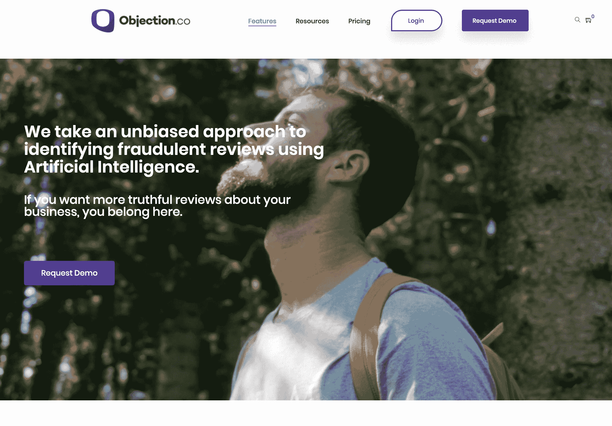
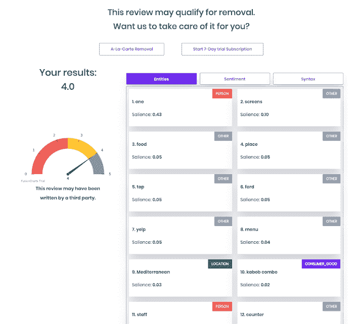
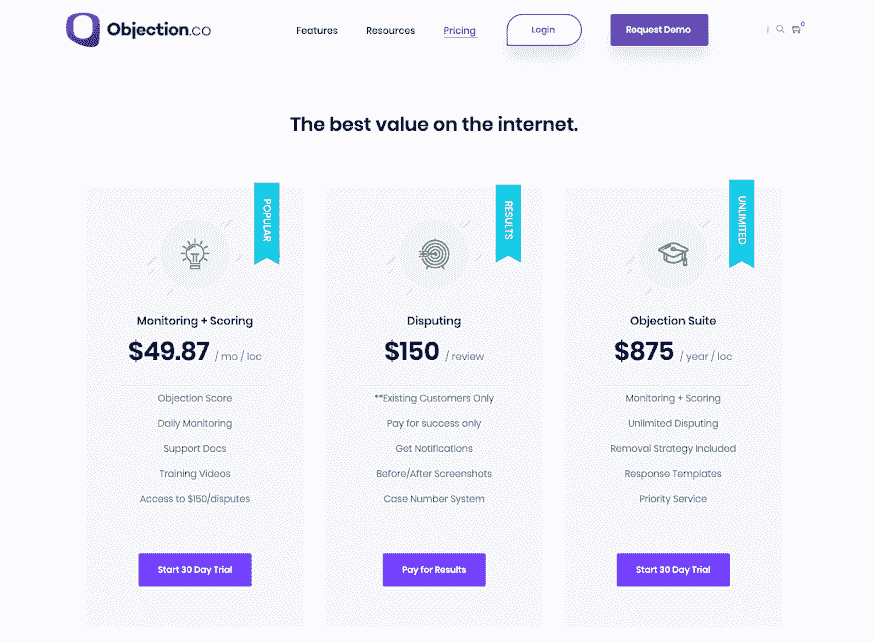

<!--yml
category: 访谈
date: 2022-06-28 10:39:53
-->

# [产品盈利访谈]从删除一条差评开始，做了一年，月赚7万 | 电鸭

> 来源：[https://eleduck.com/posts/e4lfpJ](https://eleduck.com/posts/e4lfpJ)

#### 你好，请问你的背景是什么？最近在忙什么呢？

关注我的独立黑客们，大家好！我是 Curtis Boyd ，[Objection Co](https://objection.co/) 的创始人。我之前做过护士。

Objection Co 是个利用 AI 识别商业恶意差评的 SaaS 产品。

#### 初衷是什么呢？

我创业的契机发生在我还在护理学校的时候。最后一个学期，我背着 3W 美元学贷，在急诊室轮班实习（在医学，专职健康，助产士，辅助医学，药学和护理教育中，导师是熟练的从业者或教职员工，负责在临床环境中监督学生，以便提供面对患者的实践经验——来自 wiki 词条 Preceptor#Health ）。

一位美容外科医生来我们急诊室参观。他心情不好，一位病人给了他糟糕的评价，影响到了他的个人执业。我告诉他我可以帮他删掉。他开玩笑说如果我帮忙他愿意帮我还清学贷。我告诉他我学贷有多少，他说差评挂一周他也许就会损失更多，因为会减少他七八次面诊。

第二天我打电话去他办公室问他在急诊室的邀约，他确定了。接下来的 72 个小时我努力研究，对疯狂的差评进行了标记和申诉。我无法删掉它。审核员非常顽固，我真的挺灰心的。

最后我周末飞去了旧金山，在这个评论网站总部附件的咖啡馆闲逛，看看能不能碰到可以帮忙的人。最后我遇到了一位在审核删除部门工作过的高管，告诉了我一些内幕。他详细说明了想删除评论要怎么做怎么说。得到这个建议，我飞回家开始工作。

48 小时内我删掉了评论。又过了 48 小时我就收到了 3W 美元的支票。那天我意识到我可以为成千上万的企业主解决问题，真正影响到他们的生活。那位医生是整个医师网络的董事会成员，所以一周内我就有了 500 多位客户，一位注册会计师，和自己的发展业务。那是六年前。

我们的 B2B ORM （Object-relational mapping，对象关系映射） SaaS 专注于在 18+ 个使用最广泛的评论网站 用 AI/ML（人工智能/机器学习）在线识别和举报非法评论。现在运营人员和企业主都在用它。最常见的行业有医疗、上门服务、法律和酒店管理。我们已经上线大概八个月，年营业额接近二十五万美元。

大约三年前，我意识到一台电脑大概就能完成我的工作。我决定停下其他统计数据的学习，返回学校学习如何写代码编程完成我的工作。学习编程时，我意识到与我之前用人工费时处理比起来，我能给无限的客户同时提供服务完成相同的任务。

我向许多客户和目前一起工作的顾问们提出了这个想法，他们都喜欢。我知道即使工作永远不会“消失”，但至少以后我可以用这点完成目标，可以花更少时间看糟糕的评论，专心对付可能有争议的非法评论。

先前我做在线公关顾问是雇佣人员查看、识别并投诉在线的非法评论。我从事这项工作大约六年，主要关注 Yelp 和 Google 的评论，我了解大部分评论内容的管理机制。

我没有想太多，考虑到现在这已经是我暂时的主要工作了。我的财务状况一直很难，有些月份很棒有些月份很糟。基于 SaaS 的业务无疑有助于稳定财务状况，所以我们有了个 dashboard 托管客户评论，这需要持续收费。

#### 怎么做第一版产品的呢？

Objection Co 的第一次迭代是我在 Upwork 找的印度的海外开发团队做的。讽刺的是，尽管都是好评，他们实在糟透了。项目推迟了六个月，他们在初始报价上又加了数千美元。本来我以为花费是 15000 美元。最终我换了一个团队。

第二个团队来自乌克兰，沟通和编程的质量大涨。印度团队花了超过一年时间，乌克兰团队大概三个月就搞定。

这些功能基于网络声誉管理中的决策树和应对负面评价的最佳实践。我不想和广泛覆盖网络声誉各个方面的大公司竞争——我只想做一个针对负面评价的 dashboard 。

从头到尾我都是花自己的钱自荐项目。我之前在一家本地标志公司做市场总监，直到我的公司赚的足够让我辞职，全力发展我们自己的客户和在该领域的权威。

Jason Brown 对作弊评论的研究非常有帮助，虽然他针对的是 Google 的评论，但作弊评论在所有评论网站的特点都很相似。Josh Prilloud是我的业务顾问，他帮我一起建了商业模型，了解我的产品会适合大的市场。

#### 你的技术栈是什么？

前端我们有一个 WordPress SaaS 主题。 后端我们使用 Laravel Vue 堆栈托管客户的 dashboard 。 我们有五个不同的 API 反馈客户的 dashboard 。

*   评论汇总 API （引入现有评论）
*   评论更新 API（每天监控评论）
*   评论打分 API（对可能被删除的评论打分）
*   作弊评论 API（对欺诈指标的评论者资料进行打分）
*   总体打分 API （编译星级和损失收入计算器）

我们的作弊评论 API 用来 4+ 种不同 AI 构架

*   Image Analysis
*   Clustering
*   BERT/NLP Analysis
*   NLTK/NLP Analysis

随着我们从差评发展到判定作弊评星的检测系统，我么你的技术栈完全变了。最开始，我们的 API 是沿着精巧的评论过滤方向做出来的，为了能删除评论囊括了大量词库。现在它朝着 AI 和机器学习方向发展，为各个评论网站创建新的作弊指标。

#### 你怎样吸引用户的呢？

我们从没有真正“上线”。我们刚开业，预计会有大量客户。当然，这没发生。我们能吸引到一些咨询客户，收入够从 ClearBanc 得到一些投资。

这些资金我们着重用在我们的对外销售工作和销售渠道上。我整理了一个可以监控每个企业新的差评的社交监听工具。然后用我们自己的软件检查是否符合删除标准。如果符合，商家会受到我们的推销电话和明信片。我们每天从收到差评的 40,000 多条业务清单中对潜在客户进行筛选。现在我们有个三人的全职团队负责电话销售，每周大概打给 2,500 家企业。

我们从第一个月 2K 美元到第二个月增长到 10K 美元。我们往往是卖年度订阅，所以增幅很大。不到四个月我们从 40 个用户增加到 300 多个用户。那时我们觉得对前端做重大更改。

我们意识到我们前端提供了“虚假承诺”方案，而不是给出识别和举报非法评论的数据。比起说服大家，我们认识到我们的价值取决于结果。我们开始用硬数据给客户展示我们能为他们做的。

业务进展缓慢，但是我们现在有了更优质的客户群体，更能理解我们的业务并和我们长期合作。

#### 商业模式是什么？怎么增长利润的？

我们有 3 种方式收费：

1.  年度订阅
2.  按月订阅
3.  定制收费

这样我们与最小和最大的企业都能合作。我们从 [Stripe](https://stripe.com/en-hk) 开始并且和他们合作愉快。

目前我们有望实现月收入 20K 美元。客户流失率一直很高；一旦客户得到了想要的他们就流失了。我们一直在努力希望能留住客户更长时间。

我们的新业务模式是针对和大型渠道伙伴达成战略合作的。虽然和小企业的合作没有问题，但我们也知道把我们的技术加到现有企业生态中会有巨大机遇。

#### 未来的目标是什么？

目前我们向我们的 API 库增加越来越多的作弊指标，以便我们可以从评论的图片里更好的了解到评论意图，创建各个评论网站的资料。

我得说我们前头还有个巨大的障碍。我们公司的天然属性导致发展就会自我蚕食。希望事情变严重时有科技巨头收购我们，但是如果他们用同样技术复制我们，那我们就只能被市场完全淘汰了。

#### 如果重来会有什么不同？

在营销支出上我做了一些最糟糕的决定，尤其是对营销供应商太相信。你需要找到一种一开始就有效果的策略并以此为基础。不要让人给你保证结果，让他们证明。

做A / B / C测试（或 multi-armed bandit 战术，如果适用）（这里都是编程技术上的术语）以优化内容、页面和复本。

我认为，引导 inbound 是最好的营销办法，如果你能在搜索里让人记住。

#### 有什么特别有帮助的吗？

[product-led growth](https://openviewpartners.com/product-led-growth/#.XizWB8hKiUk) （以产品主导的增长营销，简称PLG，是一种以用户为中心的增长模型，该模型以产品本身作为客户获取，转化和增长的主要驱动力）超有用。

Malcolm Gladwell 的书，尤其是[《引爆点》](https://www.gladwellbooks.com/titles/malcolm-gladwell/the-tipping-point/9780316316965/)（英文名 《Tipping Point》)，一些小事让产品或服务真正脱颖而出，让人大开眼界。

拖延会毁掉你的业务，也会因你缺乏生产力埋没你。现在就把事情做好，以任务为导向，把事情完成。

#### 对于刚刚开始做项目的独立开发者有什么建议吗？

尽量简洁。

让你的工作可以最简单的解释清楚。闷头做出产品卖，这是做梦。

#### 哪里可以了解更多？

[我们的网站](https://objection.co/)
[我们的 Twitter](https://twitter.com/objectionco)