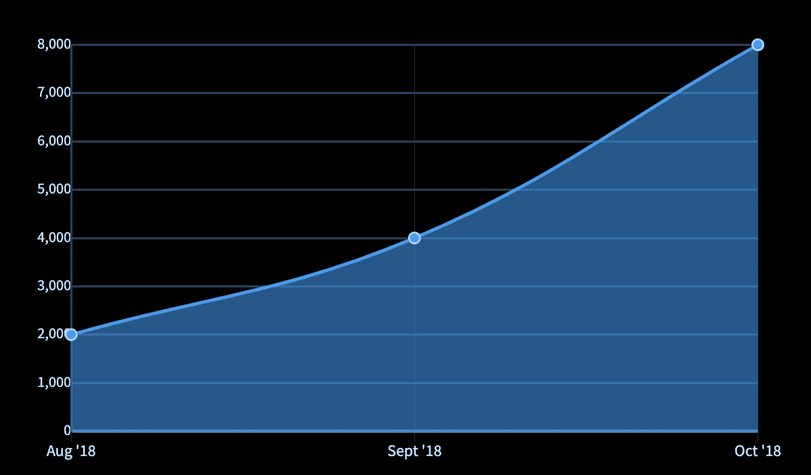
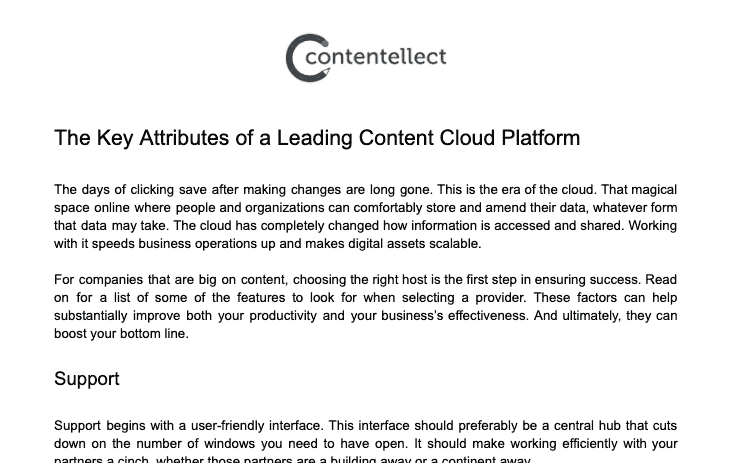

<!--yml
category: 访谈
date: 2022-06-28 10:40:05
-->

# [产品盈利访谈]月入 ￥7W 的contentellect，帮助小企业编写内容 | 电鸭

> 来源：[https://eleduck.com/posts/pqfxjb](https://eleduck.com/posts/pqfxjb)

Contentellect 是专业写内容博客的产品，客户主要为需要内容营销的中小型企业。

两位创始人都是内容营销背景，不会写代码，所以产品只是做成简单的 Wordpress 网站。但是两位创始人擅长的内容营销方向不同，所以 Contentellect 能提供全面的内容服务。最开始时员工都是自由职业者，因此没有财务负担。目标客户很明确，主要通过 Facebook 群组、电子邮件和 LinkedIn 来做推广。

Contentellect 在2018 年开始启动，目前月收入约人民币 7W ，最高时超过 ￥11W 。到目前为止的客观要点，第一是尽快做出了 MVP 让产品上线，第二点是产品功能明确，因此针对的客户明确，可以有针对性的推广。

#### 你好，请问你的背景是什么？最近在忙什么呢？

我是 Marc Bromhall ，我的背景是广告技术（AdTech）和营销技术（MarTech）。因为这些行业类别相对较新，所以我的工作经验大部分都在初创企业。

我是 Contentellect 公司的联合创始人。我们帮助中小型企业（SMB）扩大他们的内容规模。我们通过为客户撰写高质量博文来实现这一目标。我们的客户知道内容营销的价值，但在大多缺乏内部资源或时间来执行。目前我们的平均收入为 10K 美元/MRR（每月常规收入）。

我们写的博文对客户主要有三方面的帮助：

*   通过搜索引擎增加自然流量
*   让他们能开展思想领导工作
*   为销售和市场团队提供能用于营销渠道的标题和内容中的素材

#### 初衷是什么呢？

我和我的联合创始人有不同的内容营销背景。我的 AdTech/MarTech 背景让我知道在付费内容分发的时候什么内容最棒。我的联合创始人有建立 SEO 内容网站的背景。因此，他知道从引流的角度来看什么是优秀的内容。将这些经验结合在一起，我们能够在内容领域提供引人注目的全面服务。

时我们是好几个不同的 Facebook 联盟营销群组的成员，这些群组都是需要我们这样服务的受众。最终我们在群组中发布文章引起了大家的兴趣。当时我是做 AdTech 咨询的自由职业者，所以我能比较轻松的完成增加的咨询服务需求。

#### 怎么做第一版产品的呢？

幸运的是我们的 MVP 只需要很少的投入和技术专长。我们用 [Thrive Themes](https://thrivethemes.com/) 建了一个 Wordpress 网站，然后集成了 [WooCommerce](https://woocommerce.com/) 。我们花了大约三周的时间，才有了一个可以推向市场的精致产品。在这期间，我们也仍然在销售我们的内容服务并简单地通过 PayPal 交易。

我们一开始只是从我的联合创始人的另一家公司请来了几个自由撰稿人。由于他们都是自由职业者，所以我们没有每个月的财务负担。因此初始成本与我们的销售额相称。

最初，我们提供内容写作和访客发帖服务。访客发帖服务涉及到为客户在第三方网站上发布内容，从而帮助客户进行站外 SEO 。这项服务最终被证明相对于其产生的利润来说太过繁琐，所以我们在 2019 年初将其关停。

在建立业务的最初，我们最有价值的工具是 Google Suite 和 Facebook ，在这个阶段，我们使用群组，也进行了小型的、针对性很强的广告活动。

#### 你的技术栈是什么？

由于我和我的联合创始人都不写代码，所以我们选择了适合外行的工具。目前我们使用 WordPress 、 WooCommerce 和 PayPal 进行网站内外的所有业务。

我们有一个开发人员用 PHP 为 WooCommerce 做了一些定制功能。 我们目前正在使用 Laravel 更新我们的网站，包括将 Stripe 与 PayPa l整合在一起，并改进整体 UI 和 UX 。

#### 你怎样吸引用户的呢？

在 2018 年 5 月我们上线了产品，当时有 3 个客户和 2000 美元 MRR 。这些客户是通过联盟营销的 Facebook 群组、电子邮件和 LinkedIn 推广获得的。我们将这样的收入和客户量维持到了 2018 年 8 月。然后在 2018 年 9 月，我们的客户群翻倍，收入也翻了一番，达到了 4000 美元。2018 年 10 月，我们的 MRR 上升到了 8,000 美元。有趣的是，我们的客户数量没有变化，但我们能够用新的、价值更高的客户来替换流失的客户。

在这个阶段，我们主要的获客渠道是 Facebook 群组、 Facebook 广告、通过 [hunter.io](https://hunter.io/) 和 LinkedIn 外联的方式进行邮件推广。我们还开始使用自由职业者市场 [Legiit](https://www.legiit.com/) 作为额外的收入渠道。

我们早期获取客户的主要经验如下：

*   用尽可能多的办法（原文“ irons in the fire”）
*   倾听市场反馈，并相应地调整和迭代我们的产品
*   这就是一个量的游戏。不管是什么渠道，客户的转化率总是很小。因此，一旦你确定了谁是你的目标客户，以及他们在网上存在的地方，就去努力寻找他们。
*   要有条不紊、果断。销售外联工作可能是一个艰辛而又不断重复的过程。要想出一个成功的公式，每天都要有明确的微观和宏观目标。

#### 商业模式是什么？怎么增长利润的？

我们的内容收费是按每个单词 0.1 美元，所以一篇 1000 单词的文章需要 100 美元。然后，我们有两种不同方案，一种是 "现收现付方案"，客户可以随时购买内容，另一种是 “博客文章包月”，客户每月获得一定数量的博客文章。我们提供从只负责撰写内容的基础服务，到包括内容策略、创意、内容日程、并且使用内容管理软件发表的完全托管服务。

到目前为止，我们只使用 PayPal ，但我们将在 2020 年 5 月底上线新网站时整合 Stripe 。我们期待着增加 Stripe 能够提高用户的信任度，从而提高他们的付费倾向。我们平均每个月的 MRR 都在 1 万美元左右，几乎没有什么偏差。目前我们销量最好的一个月是在 2019 年 5 月，当时达到了 16000 美元！

我们花了大约四个月的时间从每月 8,000 美元到这个数字，但只用了两个月的时间就回到 8,000 美元。这是由于接触的更多客户群不够多元化。当时我们的固定客户数量不多。当他们在 5 月份增加购买只是偶然的，但没有增加客户群体意味着当这些主力客户恢复到正常的订单量时，我们的收入就受到了相应的影响。

#### 未来的目标是什么？

我们将在 2020 年 5 月底推出新的网站，更新服务内容，包括更流畅的 UI 和 UX ，并增加 Stripe 支付。此外，我们所有的客户都可以在我们的网站上进行购买。目前，我们的 “博客文章包月”的客户不能在我们的网站上购买，而是直接从 PayPal 付款。

新冠疫情当然会影响我们接下来几个月的市场推广。我们要确保疫情后安排好推广工作来激发大家最大的兴趣。这意味着要推迟几个月，就顺其自然吧。目前为止随着我们品牌实力的增强销售增长也令人放心。

#### 遇到过的最大挑战和阻碍是什么呢？

处理客户流失是很大的挑战。一个新客户可能需要三到四个月才能落地，但他们可能在一个月内离开。

幸运的是，我们只用负担三个全职员工的工资，其他人都是自由职业者。这降低了一个月内因客户流失而亏损的风险。

#### 如果重来会有什么不同？

事后回想起来，如果让我重新开始这项业务，在确定我们的服务范围、价值主张和目标群体时，我会对自己更加残酷。我认为尽可能地缩小这些参数非常重要。

当你认为自己已经达到了一个终点时，要进一步完善，直到你有了一个非常明确的服务方案，有一个符合目标客户需求的明确价值主张。也要更早开始做大规模的销售推广。

#### 有什么特别有帮助的吗？

有许多。我发现最有用的工具是 Google Suite 中帮助运营的一切东西， Trello 用于任务管理， Balsamiq 用于构建框架， Whereeby 用于电话会议。

我不喜欢使用太多工具，因为我认为，一个人很快就会达到一个饱和点，在这个点上，使用所有的工具的时间会超过单个工具所带来的生产力收益。

#### 对于刚刚开始做项目的独立开发者有什么建议吗？

永远不停完善你的产品和价值主张。行业、市场和社会都在发展。你的产品也必须不断发展，以适应不断变化的需求。

多关注公司的功能，减少关注美学。我看到一些创始人一直纠结公司的标志或品牌颜色。在创业初期，这些东西都是无关紧要的，而且很可能会在你的企业生命周期的某个阶段发生变化。相反，要注意你的目标市场，并花时间尽快做一个 MVP 给他们。

#### 哪里可以了解更多？

可以去 Contentellect 的网站了解：[https://contentellect.com/](https://contentellect.com/)

⚠️本篇翻译已征得sideidea翻译者的同意后转载，其他人转载前请联系原作者授权。