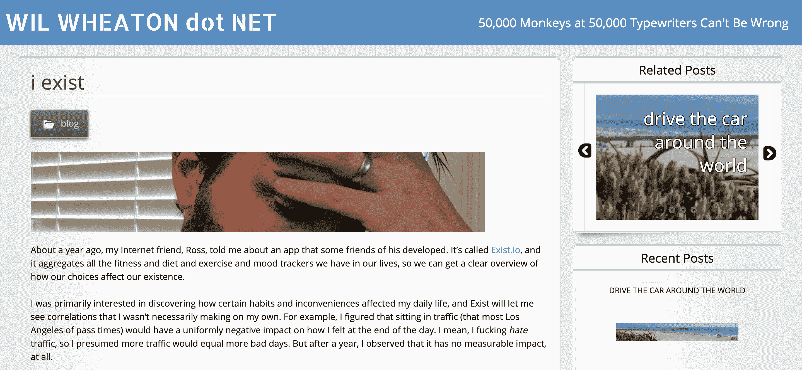
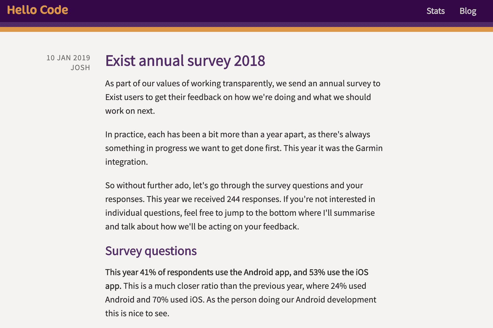
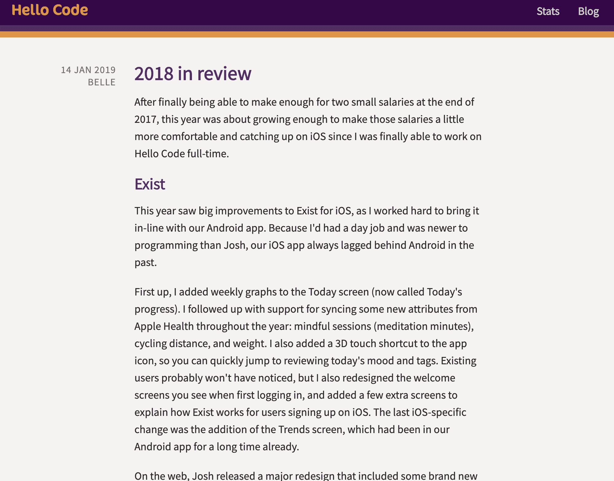

<!--yml
category: 访谈
date: 2022-06-28 10:41:06
-->

# [产品盈利访谈]月入￥ 9 w ：Exist，帮你了解生活状态的个人分析服务 | 电鸭

> 来源：[https://eleduck.com/posts/DjfADm](https://eleduck.com/posts/DjfADm)

Exist 这个产品通过整合与分析不同应用服务用户的运动和健康数据，帮用户更好的了解自己的生活状态。

两位创始人从刚刚开始出现量化自我运动就对此产生兴趣，并做了副产品 Exist ，推广以内容营销为主，从产品上线前就开始做大量内容营销。后来量化自我运动越来越火，Exist 也因此获得越来越多用户。两位创始人开始全职做 Exist 。

这个产品试用期限后必须购买使用，没有免费版本。同时创始人坚持开放和透明化的原则，让用户参与构建产品方向，这些都赢得了很多用户的信任。

#### 你好，请问你的背景是什么？最近在忙什么呢？

嗨，我是 Belle 。我是一名 iOS 开发工程师，是一家叫 [Hello Code](https://hellocode.co/) 的独立软件公司的联合创始人。我们总部在澳大利亚的墨尔本，只有我和我的联合创始人 Josh 。我们主要的 app 叫 [Exist](https://exist.io/) ，这是个有网页版、 iOS 版、Android 版的 SaaS 产品。

Exist 合并所有你用的服务中的数据（想想 Fitbit 、Apple Watch 、GitHub 、Twitter 等等），提供个人分析服务，从数据中找到你可能还没有发觉的趋势和关连。

目前，我们每月收入约 14,000 美元，这笔钱支付我们的全职薪水。

#### 初衷是什么呢？

在 Moves app 用手机内置加速度传感器追踪步数刚开始火的时候，我们开始做 Exist 。那阵子我很迷 Moves （现在已经关停），但是增加步数的新奇感很快就消失了。这发生在 Apple Watch 和 Android Wear 之前，在 Apple Health 和 Google Fit 之前，在 iPhone 内置特定运动检测处理器之前。Fitbit 和 Jawbone 刚刚开始让人们对健身追踪器产生兴趣，我们好奇这些健身追踪会带来什么。

我们看到的问题是人们尝试了 Moves 或者买了 Fitbit 后不久就放弃了活动追踪，当新奇感过去或者“数字疲劳”之后。我们想找到一种方式让这些数字成为更直观的观点和信息，帮助人们理解自己的行为。

我们意识到围绕你每天步数多少的很多背景信息有缺失，其中很多背景你自己也不清楚，所以我们从多个来源建立关联数据，发掘我们用户的行为的关联性和趋势。

#### 怎么做第一版产品的呢？

当我们刚开始做 Exist 的时候，Josh 是开发网页的自由职业者，我全职在 Buffer 做运营。Exist 从一个副产品开始直到发布 Beta 版本这期间，Josh 用空闲时间做了 MVP （minimum viable product 最小可行性产品），我致力于营销。

我们从 2013 年 6 月开始做 Exist ，到 11 月有了第一批 beta 测试员。早期我们做了登录页面，上面有邮件列表，大家可以加入该列表，到时就会收到我们的发布信息。这帮助很大，让我们保持动力（因为我们了解到大家对我们有兴趣），也帮我们找到产品发布后第一批用户。

在 2014 年初，我们对进展缓慢感到很沮丧，因为 Exist 必须迁就我们的主职工作。在 2014 年 2 月，我们进行了一次[众筹](https://exist.io/blog/u1k-backer-plan/)来资助我们的发展并找到了第一批付费用户。支持者可以用比正式发布后低的价格预购年度订阅，我们也希望能筹集到足够支持我们两个全职做 Exist 6 个月时间的资金。我们没有达成这个目标，但是我们确实获得了足够多对我们想法的认可和继续下去的动力。

在 2014 年 4 月，我们向早期支持者们开放了 beta 版，因为我们已经准备好了公开发布。这是我们第一次从 Exist 赚到钱，在这之前，Exist 一直是我们的心血结晶。这对我们来说是一个巨大的鼓舞，终于有一些收入，让真正的用户试用产品并提供反馈。

#### 创业后你的角色有了什么变化？

正如我之前说的，刚开始我在其他科技公司做内容运营，Josh 是开发网页的自由职业者。我们一开始只做了一个响应式网页应用，并没有打算做手机 app 。不过 Exist 上线运行后，我就开始尝试着开发 iOS 系统，并发现我很喜欢它。在学习一些教程后，我做的第一个 app 是一个基于 Exist API 建立的小型、单功能的 iOS app 。

之后我一直学习 iOS 开发，并不断在我的第一个 app 中继续开发直到它成为一个完整的 iOS 客户端 Exist 。Josh 已经有一些 Android 经验，所有他做了一个 Android 客户端。慢慢的我们发现移动应用成为我们更为关注的，很多用户在手机 app 花的时间比网页上更多。

Apple Health 也成为了我们的一个重点，因为随着时间的推移，Apple Health 增加了对更多数据的支持，很多第三方开发者都会把数据同步到里面，所以对于我们的 iOS 用户来说，这个是把大量的数据导入到 Exist 中的很好的方式。将网页的内容尽可能多的加到我们的移动 app 中，并做 Apple Health 支持，iOS app 已经成我的全职工作了。虽然我肯定要花更多的时间在营销上，但我更喜欢开发，所以这些天我的大部分时间都在开发。

#### 你怎样吸引用户的呢？

Exist 上我们做的最好的事情之一就是在上线前大力推广营销。我们做了一个登陆页面，让人们可以注册到邮件列表，在我们产品上线的时候就可以收到通知，我们很幸运地在产品发布前的阶段就得到了一些媒体的关注，帮助了我们的邮件列表的增长。

当量化自我运动开始受关注时我们也恰好抓住了机遇，在自我追踪变得越来越普遍时，我们能乘上这股浪潮。由此我们获得了更多的关注和媒体报道，因为很多杂志和网站都在找与量化自我相关的故事来写。

我们一直打算 Exist 是没有免费版本的付费产品，因为它要为每个用户存储大量数据，这让每个用户都大大增加了我们的服务器负载。 另外，我们想做可持续发展的业务，不愿意采用免费增值模式，因为在这种模式下我们要花费大量时间和精力来支持和转化免费用户。

我们一直专注内容运营，并开通博客定期发布关量化自我运动、自我追踪和一些相关主题文章，例如锻炼和养成良好习惯之类的。我们也把博客发布到其他网站获取流量，例如 Lifehacker 和 Zapier 。当时，大的内容网站像 Lifehacker 和 Fast Company 希望转载其他网站的帖子,因为他们每天需要发布海量内容。转载的文章一般包含原文链接和作者简介，所以这是建立受众和知名度的有效方法。

我们的博客在增长最快的几个月里到了 33,000 个独立点击，带来了非常多的入站流量。从在 Buffer 工作，到后来的 Ghost ，以及与 Campaign Monitor 和 Zapier 等公司合作，我也在自己的博客之外大量在线写作发表。只要有可能，我都会在我的简历中加上 Exist 的链接，来帮助我们的发展。

还有一件事也很有效，但时断时续的，那就是被一个有大量关注的人的提及。[Merlin Mann](http://www.merlinmann.com/) 在他的播客中提到过几次 Exist ，我们也因此获得了大量的注册用户。最近 [Wil Wheaton 的一篇博文](http://wilwheaton.net/2019/07/i-exist/)中也提到了我们，这也让我们获得了大量的注册用户。我们从来没有接触过有影响力的人（除了事后说声谢谢），所以当这样的事情发生时，总是很惊喜。他们往往会在我们不知道的情况下注册并使用 Exist 几个月，然后试着告诉他们的受众，这对我们的帮助很大。

有一件事对我们来说一直没效果，那就是直接接触媒体。这些年来我们很幸运，有一些记者主动联系我们，特别是在早期，我们在电台和在线文章中做了一些采访，甚至在《GQ》杂志上也有过小小的报道。但每次直接接触媒体都是失败的，所以我们已经不再用这种方式浪费时间了。

#### 商业模式是什么？怎么增长利润的？

虽然我们在早期就有过获得风险投资的想法，但很快就意识到这并不适合我们。我们想让 Exist 保持小规模，有意识的缓慢增长，因为我们不是为了卖掉；我们希望这是一个可持续发展的企业，我们可以在未来的几年里继续努力。我们喜欢看到更多可持续发展的独立软件企业涌现出来，而不是必须在压力下把自己的企业迅速发展成一个帝国。我们只想做一些人们喜欢并且愿意为之付费的东西，并能随着时间的推移不断改进。

Exist 从一开始就是一个 SaaS 产品，有月租和年租两种选择。我们没有分层定价，所以很简单：在你免费试用后，你要么付费，要么删除账户。我们的付费方案是 6 美元/月，57 美元/年，所以如果你按年付费，你可以省下两个半月的费用，但你得到的功能是一样的。这种方式让我们的事情变得简单，也让用户变得简单。永远不会有任何关于无法使用某些功能或限制使用之类的问题。

我们使用 Stripe 来处理信用卡交易，也用 Stripe 来处理我们的免费试用，这意味着用户需要输入信用卡来创建账户。这无疑让用户试用的门槛提高了，但也意味着人们更有可能转化为付费用户。这是一种权衡，这意味着注册更少但更高质量，到目前为止，我们对这种折中的做法很满意。

#### 你公司的运作非常开放和透明，对你的业务有什么影响呢？

刚开始做 Exist 的时候，我在Buffer工作。当时那是一家小得多的公司，我亲眼目睹了 Buffer 的领导们以各种方式探索开放和透明化。我对 Buffer 的透明度工作方式印象最深的一次是我们被黑客攻击的那一天。在全球范围内，Buffer 的远程团队中的每个人都轮番上阵，技术支援我们克服黑客的攻击，增强我们的安全性，为客户提供支持，并讨论我们哪里出了问题导致这样的攻击发生。

我当时在 Buffer 的营销团队，我们做的一件事就是发布了一篇博文，向客户解释发生了什么事。Buffer 的领导们对这次黑客事件的发生持公开态度，解释了哪些客户信息被曝光，攻击是如何发生的，以及我们计划如何改变来确保它不会再次发生。

那篇博文引起的反应，以及 Buffer 团队在其他平台上的公开信息，评价都是非常积极的。我本以为会是负面的，或者说是中立的，但是团队对所发生的事情如此公开，让很多客户更加喜欢 Buffer 。这段经历给我留下了深刻的印象，也让我意识到透明化在商业中有多么难得，客户有多么体谅。

我们还保留了一个[公开的统计页面](https://hellocode.co/stats/)，详细记录了我们的收入情况。我们还为 Exist 保留了一个[公开的计划图](https://changemap.co/hellocode/exist/)，用户可以在这里投票选出他们最喜欢的建议，帮我们确定工作的优先级。计划图帮助我们发现用户感兴趣的内容，同时也帮助我们沟通计划和现在正在进行的工作。我们很坦诚地告诉大家，我们只有两个人，并试着以个人间的方式进行沟通，而不是假装是一个大公司。我们发送的每一封邮件，包括接收邮件，都是来自于我们的个人邮箱，这样用户在需要帮助的时候可以随时直接回复我们。

为了更深入了解用户对 Exist 的使用情况，以及他们希望 Exist 在未来如何改进，我们每年都会向所有的用户发送一份调查报告。然后我们会把调查结果写在博客上，包括我们未来一年的计划，这些都受调查结果的影响。[这个是我们 2018 年调查结果的博文](http://blog.hellocode.co/post/exist-survey-2018/)，详细介绍了我们 2018 年的调查结果。

我们也尽量在博客上写出每一年的回顾，讨论这一年我们的计划完成了多少，以及发生的其他重大事件。比如这是 [2018 年的回顾](http://blog.hellocode.co/post/2018-review/)。最后，我们偶尔也会录一个[播客](https://hellocode.simplecast.com/)，介绍一下公司运营的幕后花絮，包括我们正在做的决定，正在经历的挣扎，以及我们的时间都花在了哪些方面。

#### 遇到过的最大挑战和阻碍是什么呢？如果重来会有什么不同？

我们已经建立了一个依赖其他公司的业务，这真的很艰难。我们反复整合，有的公司死掉了（比如 Jawbone ），或者改变了允许调用他们 API 的人以及方式（比如 Instagram 很快就会只允许企业调用他们 API ）。我们还发现不同的服务之间的 API 、文档和数据本身的质量也不尽相同，所以同样数据在 Exist 中或多或少会有问题，具体取决于你从哪里进行同步。

所有这些让我们的工作有时会很沮丧，因为在很多方面我们最终都是在为其他公司做客户支持，因为我们的用户试着让他们的账户和设备按照他们想要的方式来设置，当 Exist 的数据反映出原始服务中的问题时，就会来找我们。

我们的用户也向我们提出越来越多整合需求，很多服务无法通过 API 获取用户数据。我们花了很多时间向用户说明，如果其他设备或应用的开发者不向我们（以及用户）提供数据，我们也无能为力。有些应用只允许白名单访问他们的 API ，我们对访问权限的申请一次次被忽略，而且没有任何解释。这种事情可能很棘手，但我们尽量不要让它占用我们太多时间，而是把精力放在可能的整合上，同时鼓励其他开发者用创建 API 或者其他方式让用户拥有自己的数据。我们相信这是对的，对大家都有好处。

我们最好的防御措施是分散负载，我们不会把所有的鸡蛋放在一个篮子里。当 Jawbone 死了，我们不得不移除整合时，我们已经有了其他几个提供活动和睡眠数据的整合，所以并没有出现漏洞。这在社交媒体这样的行业中比较难做到，因为像 Instagram 和 Gmail 这样的已经垄断了市场，但在可能的情况下，我们会尽量将依赖性分散在多个服务中，以缓解产品价值依赖其他公司的压力。

#### 有什么特别有帮助的吗？

有几个东西我们发现对我们的业务特别有帮助。

首先，我们很幸运的是在我们做量化自我运动之后，量化自我运动不断发展。早期人们对自我追踪的兴趣让我们觉得很有趣，帮我们产生了 Exist 的想法，但我们能恰到好处乘上这个浪潮，完全是运气好。

其次是，作为一家只有两个人经营的独立公司，开放的态度帮助我们与用户建立了更强的联系和信任。

还有一点对我们有帮助的是，在早阶段就有一个 API ，特别是对于喜欢修改数据的开发者或用户。我们有一个小的用户社区，他们正在创建自己的集成，设置实验或分析数据，并在我们的用户群中共享我们的 API 创建的工具。

然后，一个简单的商业模式，没有免费方案，帮助我们与用户建立了信任。我们一直很明确，我们反对出售用户的数据，也反对引入可能影响我们决策的投资者。我们的用户一直被放在首位，因为他们为我们的产品付费，这让我们从同领域的其他产品中脱颖而出。

最后，我们的产品是建立在整合的基础上，我们惊奇地发现，这也是获得新的用户的好办法，因为我们的整合产品往往都有类似的受众群体，它们可以帮助我们接触到更多的受众。

#### 对于刚刚开始做项目的独立开发者有什么建议吗？

在发布产品之前先开始做营销。 这可以帮助你验证市场，在开发第一个版本时增强信心，并在准备发布时也能有很大帮助。

如果你找到了一个效果很好的营销渠道，那就坚持下去。要弄清楚哪些营销渠道或方法对你的业务管用，这真的蛮难（也很花费时间和金钱），所以不要浪费那些看起来有效的营销渠道。

我们还发现 dogfooding（即我们自己使用自己的产品）非常重要。它不仅能帮助我们抓住 BUG ，提升用户体验，还能帮我们制定产品愿景，并让我们有信心拒绝掉不符合我们想法的功能请求。指引我们做一些有价值的东西，这样我们就不会把用户建议的每一个小功能都加进去，而是更多思考新功能如何融入到产品的整体中去。

#### 哪里可以了解更多？

了解更多 Exist ：[https://exist.io/](https://exist.io/) ，或者[用我的推荐代码注册免费试用](https://exist.io/?referred_by=belle)，即可获得 60 天的免费试用期（而不是通常的 30 天）。您可以在 Hello Code 网站上了解更多关于我们[公司的信息](https://hellocode.co/)。

⚠️本篇翻译已征得sideidea翻译者的同意后转载，其他人转载前请联系原作者授权。