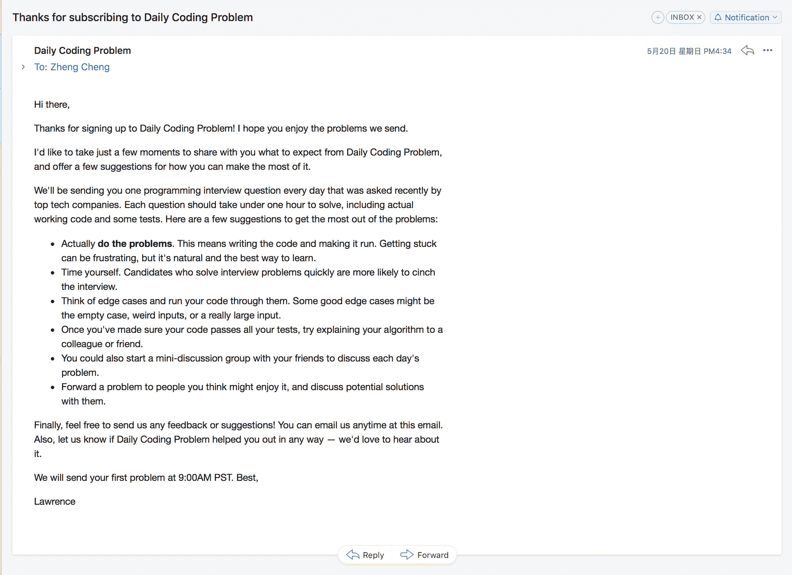

<!--yml
category: 访谈
date: 2022-06-28 10:40:09
-->

# [产品盈利访谈]每天一封代码面试题邮件，月入￥2w | 电鸭

> 来源：[https://eleduck.com/posts/erdf4O](https://eleduck.com/posts/erdf4O)

摘要：

*   月收入￥2w
*   2017年开始
*   2个创始人，0个员工
*   加拿大

> 每天一封代码面试题邮件

## 您好！请介绍一下你的背景，还有最近在忙什么？

你好! 我叫 Lawrence，我和联合创始人（co-founder）Jae 在做 [Daily Coding Problemn](https://www.dailycodingproblem.com/)。我们之前在多伦多大学读计算机科学专业

[Daily Coding Problemn](https://www.dailycodingproblem.com/) 会每天给用户发一封邮件，里面是一道代码面试题。
我们大学最后一年开始做 Daily Coding Problem，但几个月前才真正上线（这篇采访是2018年4月9号）。
现在盈利接近 3000 美元/月。

## 开发 Daily Coding Problem 的动力是什么？

大学最后一年我和朋友们都在准备技术面试。
我每天在聊天群里发"今日面试题"，然后大家会抢着做完。
他们入职成功时把功劳归功于我的面试题，我很开心，同时也好奇能不能靠这个做出一门生意。我参加过很多面试，也当过几次面试官，我面试的经验挺丰富的。

(填邮箱后收到的第一封邮件)

我之所以用邮件列表 (mailing list)，是因为：

1.  我看到之前 Scott Cheap Flights 的采访

2.  Ben Thompson 的 [Stratechery](https://stratechery.com/)

我对邮件列表挺乐观的。当时我还在学校，想着可以用专业知识来赚点啤酒钱。现在赚的钱都够付房租了！不过还没到够付旧金山的房租（译者注：美国旧金山房租很贵）。

## 怎么做第一版产品？

在做邮件列表之前，我原本是打算把代码评审、社交还有其他杂七杂八的功能加一起做个平台网站。
后来没这么做，我们直接花了一晚上做了个 landing page 来验证这个点子。然后发到 Hacker News 上。\

(当初的 landing page)

一开始没吸引到什么人。但之后我们写博客发到 Hacker News 和 Reddit。
其中几篇点击量很大，因此带来了我们第一批用户。

我们开始时成本很低，我们用 Heroku (服务器), Sendgrid (邮件), Netlify (静态网站) 和 Namecheap (域名)。第一个月不到 $50 美元。
大部分成本都是花时间写问题和答案，以及写代码来方便群发邮件。
以下是成本细节：

*   收款用 Stripe： 抽成是 2.9% + 30美分/每笔交易
*   Heroku：$7 美元/月
*   SendGrid：$10 美元/月（我们现在换到了80美元/月的套餐）
*   Netlify：免费
*   Namecheap：$10 美元/年

光看这里好像成本很低利润很高，但如果把时间算进去，包括写问题，写答案，改旧内容，回复读者等等，其实利润并不高。

## 你是怎么吸引用户的？

1.  用邮件列表的好处是，如果代码面试问题很难或是很有趣，用户会转发邮件给朋友看，所以我们会把内容好好过几遍，确保清晰简洁有意思。我觉得效果不错，经常有用户发邮件跟我们讨论问题。

2.  [博客](https://www.dailycodingproblem.com/blog)。我们写了：
    面试策略，问题解决技巧，编程概念讲解，也提供了代码面试题的例子和答案。吸引了一些新用户。

3.  有用的工具，比如最近开发 [求职信生成工具](https://xiaozhuanlan.com/topic/%5Bhttps://www.dailycodingproblem.com/coverletter%5D)。之前我找工作的时候，给每个公司写求职信写到烦。所以求职信生成很有用。

这个工具 [上了 Product Hunt "当日最火" 第 2 名](https://www.producthunt.com/posts/cover-letter-generator)
还上了 [/r/cscareerquestions "一周最火" 第 1 名](https://www.reddit.com/r/cscareerquestions/comments/855maw/i/_got/_tired/_of/_writing/_cover/_letters/_so/_i/_built/_a/)

求职信生成工具从 Reddit 和 Product Hunt 带了 1 万+ 访问量

## 你的商业模式是什么？怎么增加盈利？

我们用的是 freemium，就是有免费功能 + 付费功能。
你可以免费订阅，看到所有面试题。但如果想看答案，价格是 美元月（如果一次性买一年，那么是9美元/月（如果一次性买一年，那么是7.5美元/月）。

我们收费是为了能商业运作起来。
我们早期有篇博客上了 Hacker News 首页，当天就获得 $150 美元的订阅收入。验证了这个点子是有人需要的，所以之后我们马上开始开发。

以下是过去5个月的盈利状况：

增加盈利的方式是 不断推广 + 提升产品质量。
比如，我们注意到有很多用户在第 3 个问题之后就退订了。
调查后发现是问题太难了，
所以我们换成了更简单的题，把难题放后面。这些小修小改减少了用户流失，提升了产品质量。

## 未来目标是什么？

持续提供更好的面试题和答案。
我们给每个邮件的下方加了个反馈按钮，用户想反馈直接回复邮件就可以了。

我们也想开发一些有用的工具：有趣、可以重复使用，有市场前景。
之前的求职信生成工具，每天能带来几百的访问量，其中一部分人会转化变成付费用户，付费订阅邮件列表。

我们还在考虑卖广告位，比如和 Software Engineering Daily 以及 Scott Cheap Flights 合作。

## 有没有什么东西特别有帮助？

速度：我们有一堆大小事情要做，我们喜欢先做简单的，快速得到结果。

尽快给客户提供价值：听起来很简单，但很容易忘。
对我们技术人来说，总是去试各种自动化工具，新技术，等等。很容易过早自动化。
我们一开始时是手动用 Gmail 发邮件，客户不会在乎邮件是怎么发的。
这给我们节省了时间，我们可以和用户沟通，帮助用户等等。确保我们做的东西是有人要的。

最后一点是砍功能：这样能更快发布产品，更快给客户提供价值，也方便用户记住你的产品。"一天一个代码面试题"和"一个技术面试社交平台"哪个更好记？

(成功案例)

## 对刚开始的人有什么建议？

1.  多做试验，不要想太多。即使有些东西觉得八成不会管用，也可以试试。
    试验+失败会学到很多。很多你猜测的东西，实际情况可能会相差很多。

2.  尽早上线。刚发布时我们只有一个 landing page，我还挺不好意思的。然而非常有效。

写了这些我意识到听起来挺老套的，但管用。总结：大量尝试，尽早上线

## 哪里能了解更多？

希望这篇文章对你有用。
可以看我们的 [官网](https://www.dailycodingproblem.com/) 和 [博客](https://www.dailycodingproblem.com/blog)。