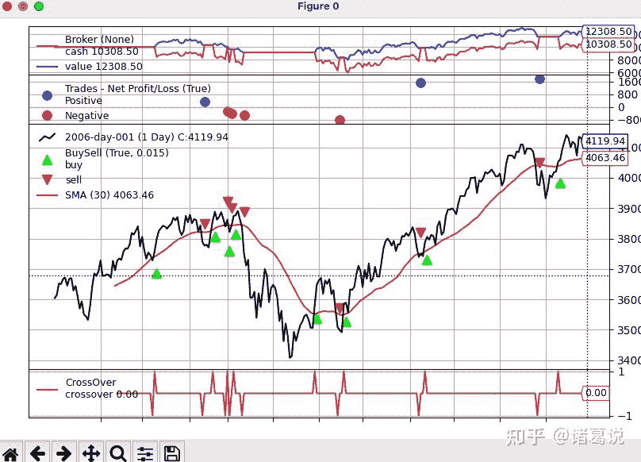

<!--yml
category: 交易
date: 2023-09-17 20:13:18
-->

# backtrader入门 - 知乎

> 来源：[https://zhuanlan.zhihu.com/p/493054559](https://zhuanlan.zhihu.com/p/493054559)

## **1\. 简介**

**[backtrader](https://link.zhihu.com/?target=https%3A//www.backtrader.com/)** 是一个用于回测和交易的python框架，它功能丰富，可以让你聚焦在设计可重用的交易策略、指标和分析上，而不用花大量时间在构建基础框架上面。

优点：

*   github开源，策略编写简单快速
*   安装方便，除了matplotlib外，不依赖其他外部lib
*   支持ib等券商实时交易
*   数据来源支持csv文件，在线数据源或pandas格式，同时支持多数据来源、多策略
*   支持TA-lib指标，方便支持自定义指标的开发，集成pyfolio分析模块等
*   支持品种多，运行速度快：pandas 矢量运算、多策略并行运算

缺点：

*   gpl 3.0授权，更改框架需要开源
*   画图界面风格比较老旧
*   框架代码抽象比较多，使用了大量的元编程，学习比较费劲

## **2\. 安装**

```
pip install backtrader
git clone https://github.com/mementum/backtrader.git
cd samples/commission-schemes
python commission-schemes.py --plot 
```

出现如下提示&图形，表明安装正常。

```
2006-03-09, BUY CREATE, 3757.59
2006-03-10, BUY EXECUTED, Price: 3754.13, Cost: 2000.00, Comm 2.00
2006-04-11, SELL CREATE, 3788.81
2006-04-12, SELL EXECUTED, Price: 3786.93, Cost: 2000.00, Comm 2.00
2006-04-12, TRADE PROFIT, GROSS 328.00, NET 324.00
2006-04-20, BUY CREATE, 3860.00
2006-04-21, BUY EXECUTED, Price: 3863.57, Cost: 2000.00, Comm 2.00
....... 
```



如果出现如下错误，说明matplotlib安装不对，`ImportError: cannot import name 'warnings' from 'matplotlib.dates'` 解决办法：`pip install matplotlib==3.2.2 -i https://pypi.tuna.tsinghua.edu.cn/simple`

## **3\. 代码框架介绍**

backtrader代码运行主要包括以下组成部分：

1.  Strategy交易策略模块：需要设计交易策略，根据信号进行买入/卖出

*   设计策略中用于生成交易信号的指标
*   编写买入、卖出的交易逻辑
*   按需打印交易信息

1.  DataFeeds数据模块: 将目标金融数据加载到回测框架中
2.  Cerebro回测框架设置：根据需要设置初始资金，佣金，数据来源，交易策略，交易头寸大小。通过Broker经纪商模块设置
3.  运行回测：运行Cerebro回测并打印出所有已执行的交易
4.  按需添加策略分析指标Analyzers或观测器Observers评估效果： 以图形和风险收益等指标对交易策略的回测结果进行评价

Lines说明：Lines是backtrader回测的数据，由一系列的点组成，通常包括以下类别的数据：Open（开盘价）, High（最高价）, Low（最低价）, Close（收盘价）, Volume（成交量）, OpenInterest（未平仓量，没有的话设置为0）。Data Feeds（数据加载）、Indicators（技术指标）和Strategies（策略）都会生成 Lines。价格数据中的所有”Open” (开盘价)按时间组成一条 Line。所以，一组含有以上6个类别的价格数据，共有6条 Lines。如果算上“DateTime”（时间，可以看作是一组数据的主键），一共有7条 Lines。当访问一条 Line 的数据时，会默认指向下标为 0 的数据，用于访问当前时刻。backtrader会将”0”一直指向当前值，下标 -1 来访问上一个值。比如：

```
self.dataclose[0] # 当日的收盘价
self.dataclose[-1] # 昨天的收盘价
self.dataclose[-2] # 前天的收盘价 
```

其他说明：

```
self.sma5 = bt.indicators.SimpleMovingAverage(
            self.datas[0], period=5)    # 返回MA5的相关数据

cerebro.broker.setcash(100000.0)    # 设定初始资金    
cerebro.broker.setcommission(0.005) # 每次交易都需要支付一定的佣金
cerebro.broker.getvalue() # 目前的资金
cerebro.addsizer(bt.sizers.FixedSize, stake=100) # 设定每次交易买入的股数 
```

以commission-schemes.py为例进行说明，代码如下，对应位置加上了注释说明。

```
import argparse 
import datetime

# 导入backtrader相关包
import backtrader as bt
import backtrader.feeds as btfeeds
import backtrader.indicators as btind

# 交易策略
class SMACrossOver(bt.Strategy):  
    params = (
        ('stake', 1),    # 交易股数
        ('period', 30),  # 周期长度
    )

    def log(self, txt, dt=None):
        ''' Logging function fot this strategy'''
        dt = dt or self.datas[0].datetime.date(0)
        print('%s, %s' % (dt.isoformat(), txt))

    # 打印订单信息，可选
    def notify_order(self, order):
        if order.status in [order.Submitted, order.Accepted]:
            # Buy/Sell order submitted/accepted to/by broker - Nothing to do
            return

        # Check if an order has been completed
        # Attention: broker could reject order if not enougth cash
        if order.status in [order.Completed, order.Canceled, order.Margin]:
            if order.isbuy():
                self.log(
                    'BUY EXECUTED, Price: %.2f, Cost: %.2f, Comm %.2f' %
                    (order.executed.price,
                     order.executed.value,
                     order.executed.comm))
            else:  # Sell
                self.log('SELL EXECUTED, Price: %.2f, Cost: %.2f, Comm %.2f' %
                         (order.executed.price,
                          order.executed.value,
                          order.executed.comm))

    # 打印交易信息，可选
    def notify_trade(self, trade):
        if trade.isclosed:
            self.log('TRADE PROFIT, GROSS %.2f, NET %.2f' %
                     (trade.pnl, trade.pnlcomm))

    # 初始化策略属性、指标，必须
    def __init__(self):
        sma = btind.SMA(self.data, period=self.p.period)
        # > 0 crossing up / < 0 crossing down
        self.buysell_sig = btind.CrossOver(self.data, sma)

    # 交易逻辑实现，必须
    def next(self):
        if self.buysell_sig > 0:
            self.log('BUY CREATE, %.2f' % self.data.close[0])
            self.buy(size=self.p.stake)  # keep order ref to avoid 2nd orders

        elif self.position and self.buysell_sig < 0:
            self.log('SELL CREATE, %.2f' % self.data.close[0])
            self.sell(size=self.p.stake)

def runstrategy():
    args = parse_args()

    # 实例化cerebro
    cerebro = bt.Cerebro()

    # Get the dates from the args
    fromdate = datetime.datetime.strptime(args.fromdate, '%Y-%m-%d')
    todate = datetime.datetime.strptime(args.todate, '%Y-%m-%d')

    # 从csv文件读取数据
    data = btfeeds.BacktraderCSVData(
        dataname=args.data,
        fromdate=fromdate,
        todate=todate)

    # 将数据传给cerebro
    cerebro.adddata(data)

    # 添加策略
    cerebro.addstrategy(SMACrossOver, period=args.period, stake=args.stake)

    # 设置初始资金
    cerebro.broker.setcash(args.cash)

    commtypes = dict(
        none=None,
        perc=bt.CommInfoBase.COMM_PERC,
        fixed=bt.CommInfoBase.COMM_FIXED)

    # 设置交易佣金
    cerebro.broker.setcommission(commission=args.comm,
                                 mult=args.mult,
                                 margin=args.margin,
                                 percabs=not args.percrel,
                                 commtype=commtypes[args.commtype],
                                 stocklike=args.stocklike)

    # 启动回测
    cerebro.run()

    # 绘图
    if args.plot:
        cerebro.plot(numfigs=args.numfigs, volume=False)

# 从命令行解析参数
def parse_args():
    parser = argparse.ArgumentParser(
        description='Commission schemes',
        formatter_class=argparse.ArgumentDefaultsHelpFormatter,)

    parser.add_argument('--data', '-d',
                        default='../../datas/2006-day-001.txt',
                        help='data to add to the system')

    parser.add_argument('--fromdate', '-f',
                        default='2006-01-01',
                        help='Starting date in YYYY-MM-DD format')

    parser.add_argument('--todate', '-t',
                        default='2006-12-31',
                        help='Starting date in YYYY-MM-DD format')

    parser.add_argument('--stake', default=1, type=int,
                        help='Stake to apply in each operation')

    parser.add_argument('--period', default=30, type=int,
                        help='Period to apply to the Simple Moving Average')

    parser.add_argument('--cash', default=10000.0, type=float,
                        help='Starting Cash')

    parser.add_argument('--comm', default=2.0, type=float,
                        help=('Commission factor for operation, either a'
                              'percentage or a per stake unit absolute value'))

    parser.add_argument('--mult', default=10, type=int,
                        help='Multiplier for operations calculation')

    parser.add_argument('--margin', default=2000.0, type=float,
                        help='Margin for futures-like operations')

    parser.add_argument('--commtype', required=False, default='none',
                        choices=['none', 'perc', 'fixed'],
                        help=('Commission - choose none for the old'
                              ' CommissionInfo behavior'))

    parser.add_argument('--stocklike', required=False, action='store_true',
                        help=('If the operation is for stock-like assets or'
                              'future-like assets'))

    parser.add_argument('--percrel', required=False, action='store_true',
                        help=('If perc is expressed in relative xx% rather'
                              'than absolute value 0.xx'))

    # -p或--plot 需要画图
    parser.add_argument('--plot', '-p', action='store_true',
                        help='Plot the read data')

    parser.add_argument('--numfigs', '-n', default=1,
                        help='Plot using numfigs figures')

    return parser.parse_args()

# 主函数
if __name__ == '__main__':
    runstrategy() 
```

## **交流**

关注微信公众号：诸葛说talk，获取更多内容。同时还能获取邀请加入量化投资研讨微信群， 与众多量化从业者&爱好者交流、切磋，不错过最新行业发展&技术进展。

## **参考**