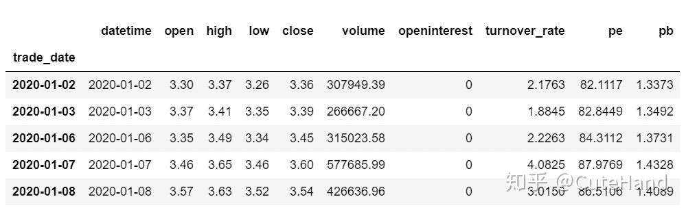
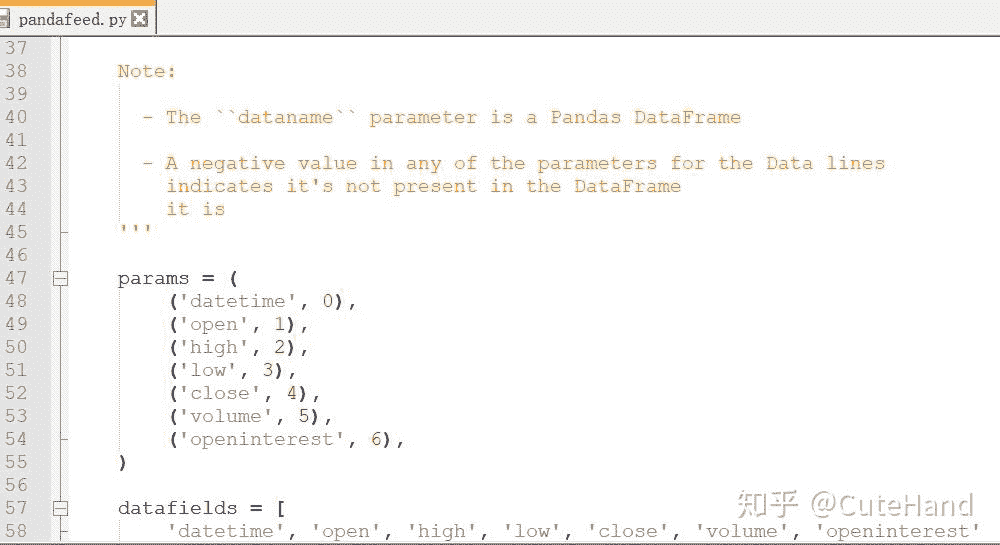
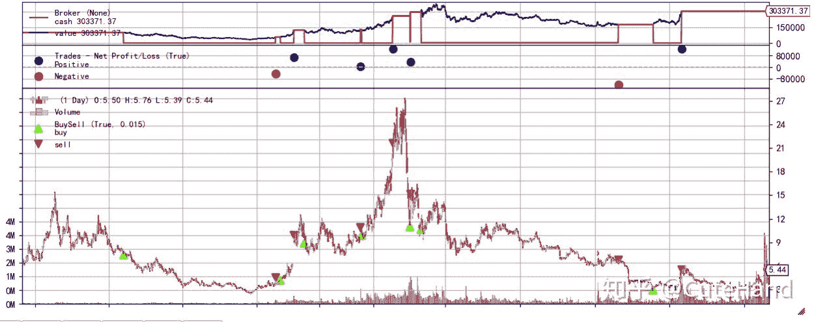
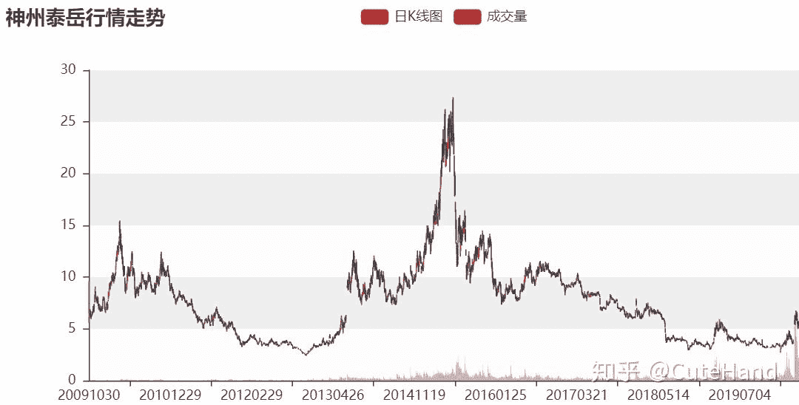
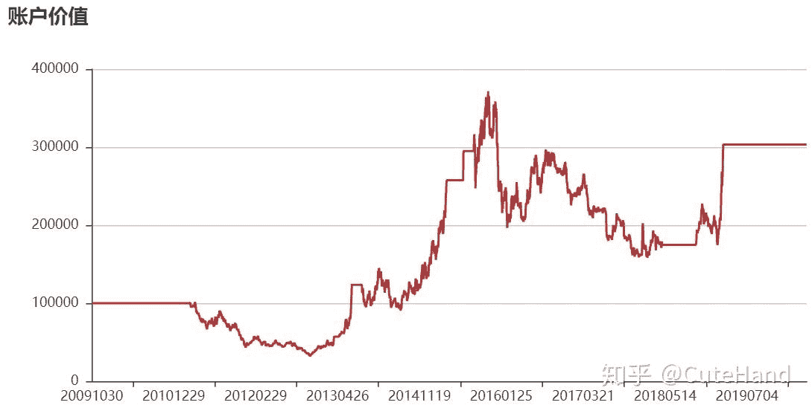
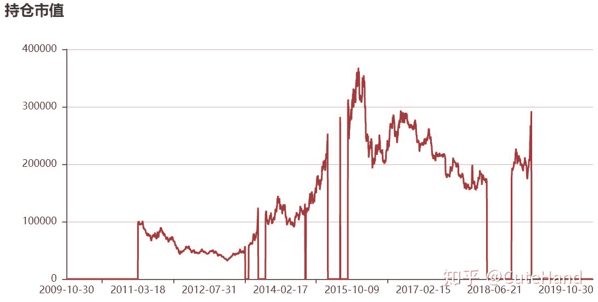
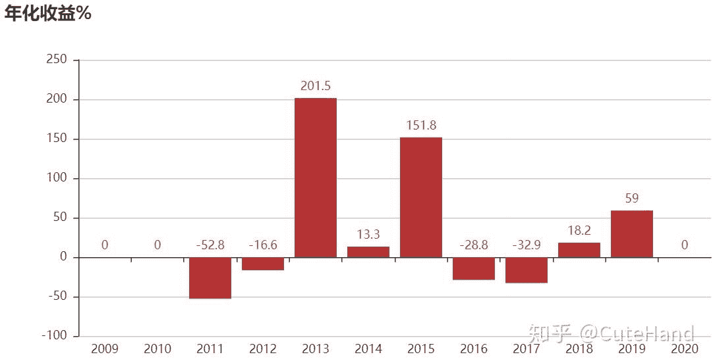
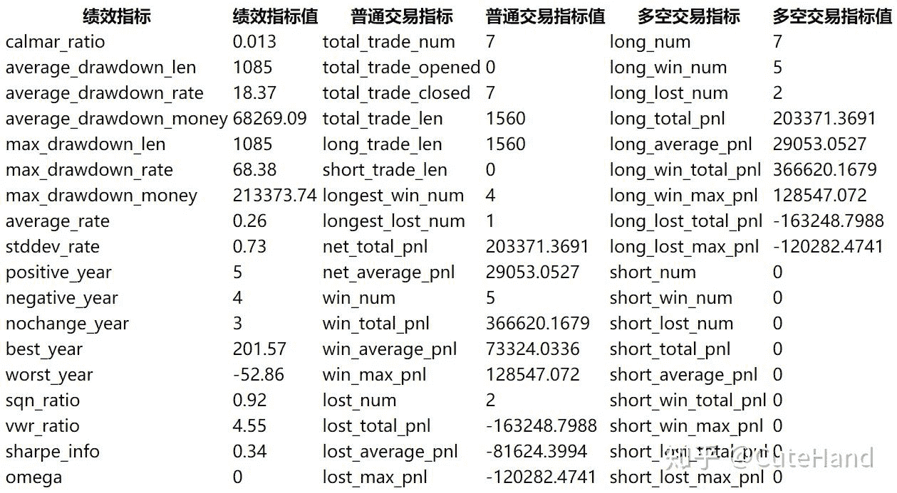

<!--yml
category: 交易
date: 2023-09-17 20:11:31
-->

# backtrader如何加载股票因子数据？以换手率、市盈率为例进行回测【附Python代码】 - 知乎

> 来源：[https://zhuanlan.zhihu.com/p/139056277](https://zhuanlan.zhihu.com/p/139056277)

## **1**引言

关于backtrader，公众号已连续发布了三篇推文：《**[【手把手教你】入门量化回测最强神器backtrader（一）](https://link.zhihu.com/?target=http%3A//mp.weixin.qq.com/s%3F__biz%3DMzUyMDk1MDY2MQ%3D%3D%26mid%3D2247484803%26idx%3D1%26sn%3D59502204fb39d150c98e9951a1614ec0%26chksm%3Df9e3c369ce944a7f9f8e83a7fc4aa9b1450ec98a41eefffda3158f75f824af88117f85be69ca%26scene%3D21%23wechat_redirect)**》、《**[【手把手教你】入门量化回测最强神器backtrader（二）](https://link.zhihu.com/?target=http%3A//mp.weixin.qq.com/s%3F__biz%3DMzUyMDk1MDY2MQ%3D%3D%26mid%3D2247484807%26idx%3D1%26sn%3D6eac4a86ee0e0f2ec06f5dfb4c9192a2%26chksm%3Df9e3c36dce944a7b67986f0b8adef4b0fc02bdcb6d88bdd33662ef9c2e713262dc60477523fe%26scene%3D21%23wechat_redirect)**》和《【手把手教你】入门量化回测最强神器backtrader（三）》，分别介绍了backtrader整个框架的组成部分、回测系统的运行、策略模块交易日志的编写和策略参数的寻优，以及Analyzers模块的用法，并对策略的业绩评价指标进行可视化分析。之前在回测中使用的数据仅限于系统默认的价格和成交量，那么如何加载其它数据或因子呢，如换手率、市盈率（PE）市净率（PB）和其他财务指标等？其实前面一直强调backtrader由于采用元编程，具有很强的扩展性，本文为大家展示如何扩展feeds模块中的数据加载，使系统能添加换手率、市盈率等数据，并以市盈率和换手率为指标构建交易策略进行回测。

## **2** 数据扩展实例

01**数据准备**

下面使用tushare pro获取个股交易数据，包含日期（datetime）、价格（open、high、low、close）和成交量(volume)、换手率（turnover_rate）、市盈率（pe）、市净率（pb）等数据。

```
import pandas as pd
import tushare as ts
#tushare pro需到官网注册并获取token才能用
token='输入你的token'
pro=ts.pro_api(token)

def get_data(code,date='20200101'):
    data1=ts.pro_bar(ts_code=code, adj='qfq', start_date=date)
    data1=data1[['trade_date','open','high','low','close','vol']]
    data2=pro.daily_basic(ts_code=code,fields='trade_date,turnover_rate,pe,pb')
    data=pd.merge(data1,data2,on='trade_date')
    data.index=pd.to_datetime(data.trade_date)
    data=data.sort_index()
    data['volume']=data.vol
    data['openinterest']=0
    data['datetime']=pd.to_datetime(data.trade_date)
    data=data[['datetime','open','high','low','close',\
               'volume','openinterest','turnover_rate','pe','pb']]
    data=data.fillna(0)
    return data 
```

查看数据并保存csv格式到本地，文件名为“test.csv”。

```
#数据保存到本地
get_data('300002.SZ').to_csv('test.csv',index=False)
get_data('300002.SZ').head() 
```

****

02**扩展feeds中的数据加载**

对backtrader相关模块进行扩展，首先要先研究一下原生代码的构成，找到安装文件夹，我装的是anaconda，所以backtrader所在文件夹路径为：

C:\Anaconda3\Lib\site-packages\backtrader\，进入该路径找到feeds文件夹，看到里面有很多py文件，说明backtrader支持加载的数据或类型，在线数据支持quandl和yahoo适合做美股分析。我们关注的是如何加载A股数据，目前只能通过pandas或csv格式导入，于是找到csvgeneric.py和pandafeed.py这两个文件，用软件Notepad++（可以打开大部分格式的文本文件）打开看看，以pandafeed.py为例，加载数据的类为class PandasData(feed.DataBase)，默认要输入的数据只有七列，即之前提到的价格和成交量数据，如下图所示。



对于元编程，要扩展相应参数，不需要修改源代码，只需要写一个class类，然后继承原来的类，加入新的参数即可，下面加入'turnover_rate','pe','pb'，这些指标在将要加载的数据表中分别在第7、8、9列。

扩展PandasData类，加载更多列数据

```
#pandas的数据格式
from backtrader.feeds import PandasData
class Addmoredata(PandasData):
    lines = ('turnover_rate','pe','pb',)
    params = (('turnover_rate',7),('pe',8),('pb',9),)

扩展GenericCSVData加载csv格式数据
#直接读取本地csv格式数据

from backtrader.feeds import GenericCSVData
class AddCsvData(GenericCSVData):
    lines = ('turnover_rate','pe','pb',)
    params = (('turnover_rate',7),('pe',8),('pb',9),) 
```

## 03**测试数据是否加载成功**

写一个简单策略，直接打印新加入的三列数据，加载数据的时候可以是单只股票，也可以是多只股票。多只股票这个很重要，以后可以用来全市场选股并进行回测。

```
import backtrader as bt
from datetime import datetime
class TestStrategy1(bt.Strategy):
    def log(self, txt, dt=None):
        dt = dt or self.datas[0].datetime.date(0)
        print('%s, %s' % (dt.isoformat(), txt))

    def next(self):
        self.log(f"换手率:{self.datas[0].turnover_rate[0]},\
          市净率:{self.datas[0].pb[0]},市盈率:{self.datas[0].pe[0]}") 
```

单只股票数据加载运行测试：

```
cerebro = bt.Cerebro()
cerebro.addstrategy(TestStrategy1)
feed = Addmoredata(dataname = get_data('300002.SZ','20200420'))
#如果是读取csv数据使用下式
#feed = AddCsvData(dataname = 'test.csv',dtformat=('%Y-%m-%d'))
cerebro.adddata(feed)
cerebro.run()

输出结果：
2020-04-20, 换手率:20.8743,市净率:3.3256,市盈率:158.3584
2020-04-21, 换手率:16.503,市净率:2.992,市盈率:142.4736
2020-04-22, 换手率:18.2413,市净率:3.2897,市盈率:156.6477
2020-04-23, 换手率:21.3831,市净率:3.0793,市盈率:146.6281
2020-04-24, 换手率:16.1957,市净率:3.1203,市盈率:148.5832
2020-04-27, 换手率:13.0385,市净率:2.874,市盈率:136.8529
2020-04-28, 换手率:10.3652,市净率:2.9355,市盈率:0.0
2020-04-29, 换手率:8.3977,市净率:2.797,市盈率:0.0
2020-04-30, 换手率:8.3719,市净率:2.8967,市盈率:0.0
2020-05-06, 换手率:9.4114,市净率:3.0462,市盈率:0.0
2020-05-07, 换手率:9.1606,市净率:3.013,市盈率:0.0 
```

## **多只股票数据加载测试：**

```
class TestStrategy2(bt.Strategy):
    def log(self, txt, dt=None):
        dt = dt or self.datas[0].datetime.date(0)
        print('%s, %s' % (dt.isoformat(), txt))

    def next(self):
        for data in self.datas:
            print(data._name)
            self.log(f"换手率:{data.turnover_rate[0]},\
            市净率:{data.pb[0]},市盈率:{data.pe[0]}")
```

运行回测，三只股票的指标数据都能加载进来。

```
cerebro = bt.Cerebro()
cerebro.addstrategy(TestStrategy2)
codes=['600862.SH','300326.SZ','300394.SZ']
#加载最近两日交易数据
for code in codes:
    feed = Addmoredata(dataname = get_data(code,'20200506'),name=code)
    cerebro.adddata(feed)
cerebro.run()

#输出结果：
600862.SH
2020-05-06, 换手率:3.3376,市净率:4.9646,市盈率:39.247
300326.SZ
2020-05-06, 换手率:1.8874,市净率:6.4762,市盈率:60.2625
300394.SZ
2020-05-06, 换手率:2.833,市净率:8.6431,市盈率:63.1617
600862.SH
2020-05-07, 换手率:1.8531,市净率:4.9486,市盈率:39.1208
300326.SZ
2020-05-07, 换手率:2.1378,市净率:6.5019,市盈率:60.5016
300394.SZ
2020-05-07, 换手率:2.7572,市净率:8.367,市盈率:61.1439
```

3 换手率、市盈率指标的交易策略实例

下面以加载的换手率和市盈率数据构建交易策略并进行回测。这里举例的个股为神州泰岳，考虑到其回测期间换手率均值为3%，75%分位数为3.98%，市盈率均值为52，最高166，负值设置为0。基于这些指标的统计规律，将交易策略简单设置为：当换手率小于3%且市盈率小于50倍时买入，当换手率大于10%或市盈率大于80倍时卖出。

```
class MyStrategy(bt.Strategy):

    def next(self):
        if not self.position: # 没有持仓
            if self.datas[0].turnover_rate[0]<3 and 0<self.datas[0].pe[0]<50:
                # 得到当前的账户价值
                total_value = self.broker.getvalue()
                #1手=100股，满仓买入
                ss=int((total_value/100)/self.datas[0].close[0])*100
                self.order=self.buy(size=ss)
        else:#持仓，满足条件全部卖出
            if self.datas[0].turnover_rate[0]>10 or self.datas[0].pe[0]>80 :
                self.close(self.datas[0])
```

运行回测：

```
cerebro = bt.Cerebro()  
cerebro.addstrategy(MyStrategy)
feed = Addmoredata(dataname = get_data('300002.SZ','20050101'))
cerebro.adddata(feed)
startcash = 100000
cerebro.broker.setcash(startcash) 
cerebro.broker.setcommission(commission=0.001) 
cerebro.run()
portvalue = cerebro.broker.getvalue()
pnl = portvalue - startcash
#打印结果
print(f'期初总资金: {round(startcash,2)}')
print(f'期末总资金: {round(portvalue,2)}')
print(f'净收益: {round(pnl,2)}')

期初总资金: 100000
期末总资金: 303371.37
净收益: 203371.37 
```

得到回测过程的原生图：

```
%matplotlib inline 
cerebro.plot(style='candlestick') 
```



获取回测的量化评价指标：注意，out_result是自己写的脚本zjy_plot.py里输出策略评价指标的函数，由于代码较长，此处省略，完整代码分享在“金融量化”知识星球上。

```
#addmoredata是在PandasData上的扩展
ddf=get_data('300002.SZ','20050101')
data = Addmoredata(dataname = ddf)
df00,df0,df1,df2,df3,df4=bt.out_result(MyStrategy,\
data,startcash = 100000,commission=0.001) 
```



对评价指标进行可视化：下面pyecharts用的是0.5.11版本，1.0以上版本用法基本上不同。

```
from pyecharts import*
def plot_result_py(data,v,title,plot_type='line',zoom=False):
    att=data.index
    try:
        attr=att.strftime('%Y%m%d')
    except:
        attr=att
    if plot_type=='line':
        p=Line(title)
        p.add('',attr,list(data[v].round(2)),
         is_symbol_show=False,line_width=2,
        is_datazoom_show=zoom,is_splitline_show=True)
    else:
        p=Bar(title)
        p.add('',attr,[int(i*1000)/10 for i in list(data[v])],
              is_label_show=True,
        is_datazoom_show=zoom,is_splitline_show=True)
    return p 
```

账户价值`plot_result_py(df0,'total_value','账户价值')`



持仓市值

```
plot_result_py(df4,'total_position_value','持仓市值') 
```



年化收益率

```
plot_result_py(df3,'year_rate','年化收益%',plot_type='bar') 
```



策略评价指标

`df00`



## **4** 结语

本文着重介绍了如何在backtrader上通过扩展类编程，加载除价格和成交量外的其他因子数据，并构建交易策略进行回测。文中利用换手率和市盈率指标构建的交易策略仅作为示例，并没有对相关参数进行优化，而且不同标的参数阈值设置可能存在较大差异，从回测结果的评价指标来看，该策略并不是很理想，尽管总收益率达到3倍，但最大回撤高达68%，夏普比率只有0.34。当然，本文的目的不是兜售交易某“成功”策略，而是介绍量化策略的构建与回测过程，希望能达到“授人以渔”和“抛砖引玉”的作用。

**参考资料：**backtrader官方文档和安装包原生代码

[https://www.backtrader.com/docu/](https://link.zhihu.com/?target=https%3A//www.backtrader.com/docu/)

**关于Python金融量化**

专注于分享Python在金融量化领域的应用。加入知识星球，可以免费获取量化投资视频资料、量化金融相关PDF资料、公众号文章Python完整源码、量化投资前沿分析框架，与博主直接交流、结识圈内朋友等。