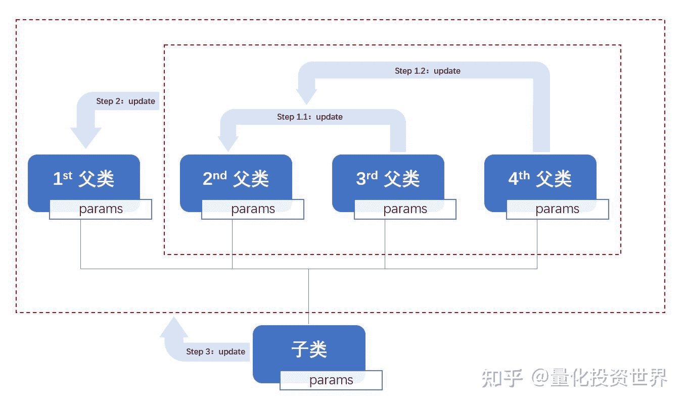

<!--yml
category: 交易
date: 2023-09-17 20:00:01
-->

# backtrader源码解读 (4)：底层基石——metabase模块 (下篇) - 知乎

> 来源：[https://zhuanlan.zhihu.com/p/602906986](https://zhuanlan.zhihu.com/p/602906986)

## **0\. 前文回顾**

在上篇文章《[backtrader源码解读 (3)：底层基石——metabase模块 (上篇)](https://zhuanlan.zhihu.com/p/600145210)》中，我们着重介绍了metabase模块中：

1.  元类MetaBase的__call__方法搭建了一个用于控制MetaBase及其子类所创建的类如何去创建和初始化实例对象的框架，该框架分为**创建前**、**创建中**、**初始化前**、**初始化中**、**初始化后**五个步骤，分别对应方法**doprenew**、**donew**、**dopreinit**、**doinit**、**dopostinit**；
2.  元类MetaParams的__new__方法对MetaParams及其子类所创建的类的**类变量params**进行加工处理：从由包含参数信息的元组或字典转变为AutoInfoClass类 (及其子类，下文中省略)，并实现整个继承链上的**参数整合**。

特别地，在第2点中，参数整合考虑了多继承的场景，处理步骤如下所示：

1.  第二顺位以及更靠后的父类顺次更新参数信息，生成中间产物obasesinfo;
2.  用obasesinfo去更新第一顺位父类的参数信息，生成中间产物baseinfo，对应_getpairsbase方法的返回值；
3.  用子类的参数信息去更新baseinfo，生成最终结果，对应_getpairs方法的返回值。

这里的"更新"指的是字典的update方法，遵循的原则是：遇到重复的键则覆盖对应的值，未遇到重复的键则添加键值对。



元类MetaParams的__new__方法在多继承场景下处理类变量params的方式

实际上，这里的处理方式和结果稍微有一些反直觉：一般情况下，我们可能会认为顺位靠前的父类更为重要；而在这里，当多个父类提供的参数信息出现冲突时，顺位靠后的父类会覆盖顺位靠前的父类。

对此我们的评价是：尽管通过修改源码改变上述父类之间参数整合的优先级并不困难，但是还是大可不必；因为我们建议根本就**不要使用多继承**，否则可能会给程序的运行和debug带来不必要的麻烦。

旧的知识回顾完毕，我们马不停蹄，开始新内容的讲解！

## **1\. MetaParams的donew方法**

元类MetaParams的donew方法是对元类MetaBase的donew方法的重写，实现了以下与参数相关的功能：

假设类Cls由元类MetaParams及其子类所创建，对象obj由类Cls所创建。MetaParams的donew方法，除了实现父类MetaBase的donew方法中Cls创建obj的基础功能之外，还为obj添加了**实例属性params**：它承接了类Cls的类变量params中的参数信息，同时也接受在创建对象obj时输入的关键字参数的修改。

### **1.1 源码解读**

code 1为元类MetaParams的donew方法的简版源码，我们删除了与参数无关的代码以增强可读性。

```
# code 1：metabase.py - 元类MetaParams：donew方法部分源码
class MetaParams(MetaBase):
    def donew(cls, *args, **kwargs):
        params = cls.params() #---------------------------------------------- 4
        for pname, pdef in cls.params._getitems(): #------------------------- 5
            setattr(params, pname, kwargs.pop(pname, pdef)) # --------------- 6

        _obj, args, kwargs = super(MetaParams, cls).donew(*args, **kwargs) #- 8
        _obj.params = params
        _obj.p = params #---------------------------------------------------- 10

        return _obj, args, kwargs
```

**第4行**

在赋值运算符的右边，cls.params已经是被元类MetaParams的__new__方法加工后的产物AutoInfoClass类。所以，cls.params() 是AutoInfoClass类的实例对象，在这里赋值给变量params。

**第5-6行**

```
for pname, pdef in cls.params._getitems():
    setattr(params, pname, kwargs.pop(pname, pdef))
```

第5行中，_getitems方法是AutoInfoClass类中定义的类方法，见code 2。

```
# code 2：metabase.py - AntoInfoClass类：_getitems方法
@classmethod
def _getitems(cls):
    return cls._getpairs().items()
```

在for循环中，cls.params._getitems() 以列表返回cls.params中包含的参数信息，供pname和pdef遍历参数名和参数值，并在第6行通过setattr函数为变量params (第4行生成的变量，一个AutoInfoClass类的实例对象) 依次添加实例属性：

*   属性名为pname；
*   如果关键字参数kwargs中包含键pname，属性值为kwargs中键pname对应的值；否则，属性值为pdef。

**第8-10行**

```
_obj, args, kwargs = super(MetaParams, cls).donew(*args, **kwargs)
_obj.params = params
_obj.p = params
```

交给MetaParams的父类MetaBase完成由cls创建实例对象_obj的基础工作。 接下来，为_obj添加实例属性params，值为经过第5-6行处理后的变量params；同时为_obj添加实例属性p，作用为实例属性params的别名。

### **1.2 案例展示**

example 1展示了元类MetaParams的donew方法实现的功能，该案例中：

*   类MyClass由元类MetaParams所创建，类变量params输入了参数信息：p1的值为1，p2的值为2；
*   对象myobj由类MyClass所创建，并通过关键字参数将p1的值修改为11。

```
# example 1
import backtrader as bt

class MyClass(metaclass = bt.MetaParams):
    params = {'p1': 1, 'p2': 2}

obj = MyClass(p1 = 11)

print('[1]', obj.params)
print('[2]', obj.params.p1)
print('[3]', obj.params.p2)
print('[4]', obj.params._getpairs())
```

> [1] <backtrader.metabase.AutoInfoClass_MyClass object at 0x0000018FA86FFBE0>
> [2] 11
> [3] 2
> [4] OrderedDict([('p1', 1), ('p2', 2)])

通过打印结果，我们可以看到：

1.  obj.params是一个AutoInfoClass_MyClass类的实例对象；
2.  obj.params.p1的值经过关键字参数的修改，变为11；
3.  obj.params.p2的值承接MyClass.params，依旧为2；
4.  obj.params自身是没有名为_getpairs的实例方法的，所以在语句obj.params._getpairs()中，obj.params调用的是它所属的类 (也就是MyClass.params，一个AutoInfoClass_MyClass类，见example 1.1) 的类方法_getpairs；需要注意的是，关键字参数"p1 = 11"设定的是obj.params的实例属性p1的属性值，而没有对MyClass.params做任何修改，所以这里打印的依旧是OrderedDict([('p1', 1), ('p2', 2)])。

```
# example 1.1
print('[1]', isinstance(myobj.params, MyClass.params))
print('[2]', MyClass.params)
```

> [1] True
> [2] <class 'backtrader.metabase.AutoInfoClass_MyClass'>

根据上述第4点，AutoInfoClass内置了实例方法**isdefault**和**notdefault**，用以判断是否存在修改默认参数值的情形，见example 1.2。

```
# example 1.2
print('[1]', obj.params.isdefault('p1'))
print('[2]', obj.params.isdefault('p2'))
print('[3]', obj.params.notdefault('p1'))
print('[4]', obj.params.notdefault('p2'))
```

> [1] False
> [2] True
> [3] True
> [4] False

## 2\. **MetaParams的实际应用**

元类MetaParams参与了backtrader中绝大多数关键类的创建，例如作为回测引擎的**类Cerebro**、作为数据源载体的**类GenericCSVData**和**类PandasData**、作为策略的**类Strategy**等等。在backtrader的实际应用中，元类MetaParams所实现的参数相关的功能可以说随处可见，我们在这里举两个例子。

### 2.2 案例：类PandasData

第一个例子是类PandasData，涉及MetaParams的__new__方法中有关参数整合的应用。

在backtrader中，类PandasData是加载pandas DataFrame的框架。DataFrame是pandas包中的二维数据结构，是Python进行数据分析的工具，常用来处理历史行情数据。

默认情况下，类PandasData只允许加载datatime (日期时间)、open (开盘价)、high (最高价)、low (最低价)、close (收市价)、volume (成交量)、openinterest (持仓兴趣)这7列数据，见example 2.1的打印结果中最后7个参数名。

```
# example 2.1
from backtrader.feeds import PandasData

print(PandasData.params._getpairs())
```

> OrderedDict([('dataname', None), ('name', ''), ('compression', 1), ('timeframe', 5), ('fromdate', None), ('todate', None), ('sessionstart', None), ('sessionend', None), ('filters', []), ('tz', None), ('tzinput', None), ('qcheck', 0.0), ('calendar', None), ('nocase', True), ('datetime', None), ('open', -1), ('high', -1), ('low', -1), ('close', -1), ('volume', -1), ('openinterest', -1)])

如果我们想要加载更多列的数据，例如换手率turnover，我们可以按照example 2.2中的方式，自定义类MyPandasData来拓展类PandasData的加载功能。我们可以看到，类MyPandasData继承类PandasData，类MyPandasData的类变量params整合了自身以及父类中的参数信息。

至于类变量lines起到什么作用以及类变量params中列名的值为何设为-1，我们将在未来详细讲解。

```
# example 2.2
class MyPandasData(PandasData):
    lines = ('turnover', )
    params = (('turnover', -1),)

print(MyPandasData.params._getpairs())
```

> OrderedDict([('dataname', None), ('name', ''), ('compression', 1), ('timeframe', 5), ('fromdate', None), ('todate', None), ('sessionstart', None), ('sessionend', None), ('filters', []), ('tz', None), ('tzinput', None), ('qcheck', 0.0), ('calendar', None), ('nocase', True), ('datetime', None), ('open', -1), ('high', -1), ('low', -1), ('close', -1), ('volume', -1), ('openinterest', -1), ('turnover', -1)])

### 2.3 案例：类Cerebro

第二个例子是类Cerebro，涉及MetaParams的donew方法中关键字参数的应用。

code 3是类Cerebro开头部分的源码，这里的类变量params是由元组：(参数名, 参数值) 组成的元组，代表了系统默认的参数设置。参数的具体含义不是本文的重点，我们会在未来详细讲解。

```
# code 3：cerebro.py - 类Cerebro部分源码
class Cerebro(with_metaclass(MetaParams, object)):
    params = (
        ('preload', True),
        ('runonce', True),
        ('maxcpus', None),
        ('stdstats', True),
        ('oldbuysell', False),
        ('oldtrades', False),
        ('lookahead', 0),
        ('exactbars', False),
        ('optdatas', True),
        ('optreturn', True),
        ('objcache', False),
        ('live', False),
        ('writer', False),
        ('tradehistory', False),
        ('oldsync', False),
        ('tz', None),
        ('cheat_on_open', False),
        ('broker_coo', True),
        ('quicknotify', False),
    )
```

当我们使用backtrader进行回测时，首先需要将类Cerebro进行实例化。在实例化过程中，我们可以通过关键字参数修改默认参数，也可以不输入关键字参数使用系统默认参数，见example 3。

```
# example 3
import backtrader as bt

cerebro1 = bt.Cerebro()
cerebro2 = bt.Cerebro(preload = False)

print('[1]', cerebro1.params.preload)
print('[2]', cerebro2.params.preload)
```

> [1] True
> [2] False

## 3\. **MetaParams：动态加载包和模块**

在前文，我们已经介绍了元类MetaParams最为常用的**参数整合**功能。除此之外，MetaParams还有一个不太常用的功能：**动态加载包和模块**。

具体来说，在由元类MetaParams及其子类所创建的类中，我们可以通过**类变量packages**和**frompackages**以元组的形式来设定拟加载的包和模块的名称及其别名。在创建类的过程中，MetaParams的__new__方法会对继承链上所有类变量packages和frompackages中所包含的信息进行整合，见example 4。

【注】由于这里的处理方式和处理类变量params几乎一样，我们就不再贴出源码赘述。

```
# example 4
import backtrader as bt

class MyClass1(metaclass = bt.MetaParams):
    packages = (('numpy', 'np'),)
    frompackages = (('datetime', ('date', 'time')),)

class MyClass2(MyClass1):
    packages = (('pandas', 'pd'),)
    frompackages = (('datetime', (('datetime', 'dt'), )),)

print('[1]', MyClass2.packages)
print('[2]', MyClass2.frompackages)
```

> [1] (('numpy', 'np'), ('pandas', 'pd'))
> [2] (('datetime', ('date', 'time')), ('datetime', (('datetime', 'dt'),)))

在创建实例对象的过程中，MetaParams的donew方法动态加载类变量packages和frompackages中记录的包和模块，见example 4.1。

```
# # example 4.1
myobj = MyClass2()

print('[1]', np)
print('[2]', pd)
print('[3]', date)
print('[4]', time)
print('[5]', dt)
```

> [1] <module 'numpy' from 'D:\\Application\\Anaconda\\lib\\site-packages\\numpy\\__init__.py'>
> [2] <module 'pandas' from 'D:\\Application\\Anaconda\\lib\\site-packages\\pandas\\__init__.py'>
> [3] <class 'datetime.date'>
> [4] <class 'datetime.time'>
> [5] <class 'datetime.datetime'>

在该案例中，此处就相当于运行了：

```
import numpy as np
import pandas as pd
from datetime import date, time
form datetime import datetime as dt
```

## 小结

本文中，我们在前文的基础之上继续讲解matabase模块中元类MetaParams的donew方法，并展示了MetaParams的参数整合功能在backtrader实操中的具体应用。除此之外，我们还介绍了MetaParams的动态加载包和模块的功能。

实际上，metabase模块并没有涉及到任何回测相关的内容，更多地可以看成是元类知识的应用。通过该模块源码的解析，我们应当对元类的__new__方法、__call__方法有了更深刻的理解，这对于往后源码的理解可以起到事半功倍的效果。

在接下来的文章中，我们将要讲解backtrader中有关数据的模块，包括**lineroot**、**lineseries**、**dataseries**、**feed**等，敬请期待！

* * *

**往期回顾**

[backtrader源码解读 (1)：读懂源码的钥匙——认识元类](https://zhuanlan.zhihu.com/p/594948193)

[backtrader源码解读 (2)：读懂源码的钥匙——元类进阶](https://zhuanlan.zhihu.com/p/597309489)

[backtrader源码解读 (3)：底层基石——metabase模块 (上篇)](https://zhuanlan.zhihu.com/p/600145210)

**原创不易，您的赞同、评论、收藏和分享对于我来说非常重要~**