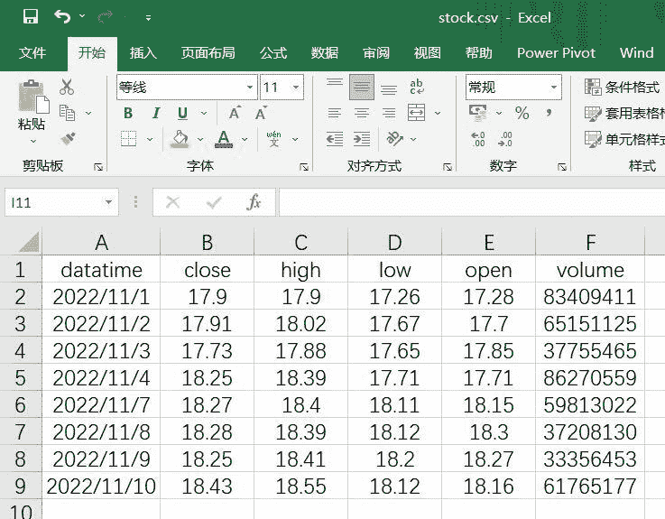
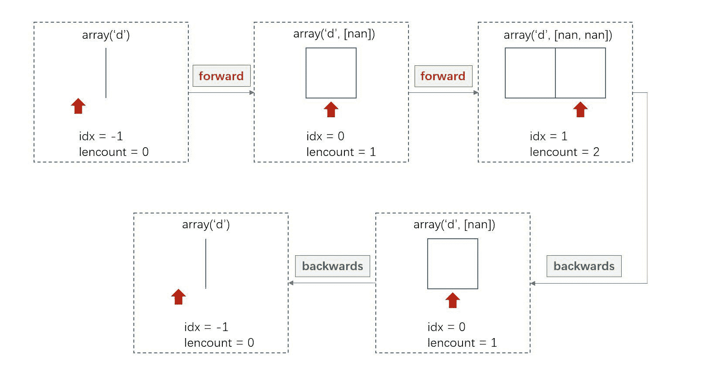
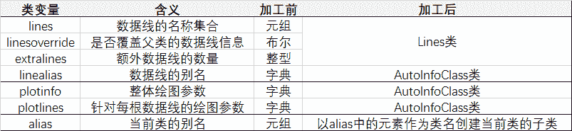
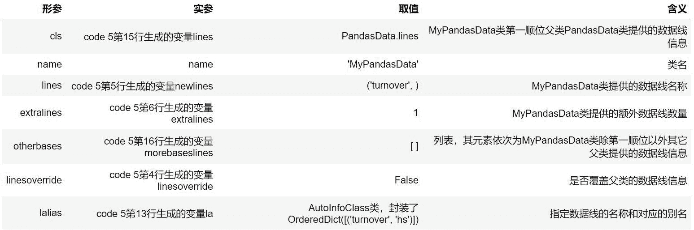
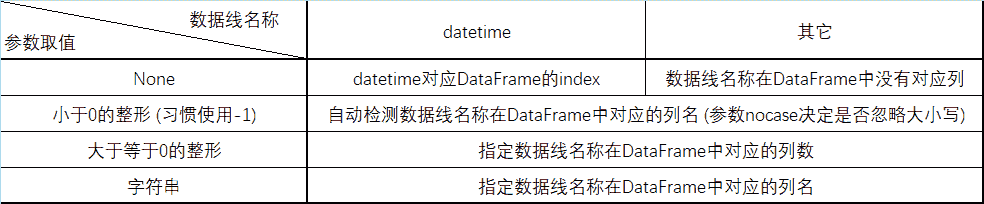

<!--yml
category: 交易
date: 2023-09-17 19:59:51
-->

# backtrader源码解读 (5)：数据源与数据加载 - 知乎

> 来源：[https://zhuanlan.zhihu.com/p/608124423](https://zhuanlan.zhihu.com/p/608124423)

## 1\. 前言

我们都知道，量化投资是一种利用大量数据和数学模型来进行投资决策的方法。 俗话说："巧妇难为无米之炊"——这就好比在进行量化投资时，**数据源** (Data Feed) 的重要性是不言而喻的。

作为一个功能强大且全面的量化投资框架，backtrader提供了丰富的数据源选项：

*   在**历史回测**场景中，backtrader可以通过本地或者线上载入由csv文件或者pandas DataFrame构建的历史数据集；
*   在**实盘交易**场景中，backtrader的事件驱动机制可以方便地与数据提供商 (例如：Interactive Brokers、Visual Chart、Oanda) 集成，获取实时数据流并实现自动化交易。

在本篇文章中，我们将着重讲解**backtrader如何加载pandas DataFrame数据源**，并通过解读源码揭示其背后的机制。 众所周知，[pandas](https://link.zhihu.com/?target=https%3A//pandas.pydata.org/docs/user_guide/)是Python著名的数据分析库，DataFrame是pandas库中的二维数据结构 (类似Excel中的电子表格，每行表示一个观测值，每列表示一种属性)，在金融数据领域有很广泛的应用。

Example 1是backtrader加载pandas DataFrame数据源的使用示例。

```
# Example 1：加载pandas DataFrame数据源的使用示例
import backtrader as bt
import pandas as pd
from datetime import datetime

stock = pd.read_csv('stock.csv', index_col=0, parse_dates=True, encoding='gbk')
start = datetime(2022, 11, 2)
end = datetime(2022, 11, 9)

data = bt.feeds.PandasData(dataname=stock, fromdate=start, todate=end) # 第10行

cerebro = bt.Cerebro()
cerebro.adddata(data)
cerebro.run()
```

具体来说，我们在本地文件'stock.csv'中记录了某只股票从2022-11-1至2022-10-10共8个交易日的OHLCV数据，即每个交易日的开盘价 (open)、最高价 (high)、最低价 (low)、收盘价 (close) 和成交量 (volume)，如图1所示。



图1：本地文件 stock.csv

接下来，在第6行，我们通过pandas的read_csv方法将该csv文件读取为pandas DataFrame对象stock。

需要注意的是，backtrader是无法直接对pandas DataFrame对象stock进行操作的，而是提供了专门的数据源接口**PandasData**。PandasData是在feeds.pandafeed模块中定义的类。在第10行，我们创建PandasData对象data，并通过关键字参数dataname、fromdate和todate指定数据源、回测的开始日期和结束日期。

在第12-14行，我们创建Cerebro对象cerebro作为回测引擎，然后通过cerebro的adddata方法关联PandasData对象data，并调用cererbro的run方法运行回测。

【注】"Cerebro"是西班牙语单词，中文翻译为"大脑"。Cerebro是定义在cerebro模块中的类，作为backtrader的核心，作用是聚合回测所需的组件 (Data Feeds、Strategies、Observers、Analyzers、Writers)、执行回测或实时交易、返回结果及画图。我们会在后续的文章中详细介绍Cerebro。

Example 1-1的打印结果显示，从回测起始日2022-11-2至结束日2022-11-9的各列数据已经被成功加载到回测引擎cerbero中，为后续的指标计算和策略回测奠定了基础。

```
# Example 1-1
print('[1]', cerebro.datas[0].datetime.array)
print('[2]', cerebro.datas[0].close.array)
print('[3]', cerebro.datas[0].high.array)
print('[4]', cerebro.datas[0].low.array)
print('[5]', cerebro.datas[0].open.array)
print('[6]', cerebro.datas[0].volume.array)
```

> [1] array('d', [738461.0, 738462.0, 738463.0, 738466.0, 738467.0, 738468.0])
> [2] array('d', [17.91, 17.73, 18.25, 18.27, 18.28, 18.25])
> [3] array('d', [18.02, 17.88, 18.39, 18.4, 18.39, 18.41])
> [4] array('d', [17.67, 17.65, 17.71, 18.11, 18.12, 18.2])
> [5] array('d', [17.7, 17.85, 17.71, 18.15, 18.3, 18.27])
> [6] array('d', [65151125.0, 37755465.0, 86270559.0, 59813022.0, 37208130.0, 33356453.0])

虽然Example 1中的代码易于理解和操作，但其所涉及的概念和机制仍然相当复杂。 因此，本文将围绕这段代码以及其背后的原理进行深入讲解。

## **2\. 数据线和LineBuffer类**

在最开始，我们引入backtrader中最为重要的概念之一：**数据线** (line)。 简单来说，数据线泛指一维数据。例如，图1表格中的每一列数据都可以称为一根数据线。 在backtrader中，隶属linebuffer模块的**LineBuffer类**是用于存储和管理数据线的数据结构。

### 2.1 **LineBuffer类：类关系图**

图2是LineBuffer类的类关系图，展示了LineBuffer类是如何被元类创建和继承父类的。为了更好地理解类关系图，我们需要规定图中形状和颜色的含义：

*   粉红色框代表元类，浅蓝色框代表类；
*   在框的内部，我们用树状图来表示元类或类的结构：树状图的根节点代表元类或类的名称，分别由红色椭圆单元格或蓝色矩形单元格来表示；子节点代表方法名、类变量名、实例属性名，分别由白色、浅蓝色、浅绿色的单元格来表示；特别地，这些单元格后可能会跟随额外的单元格，用于显示注释和默认值；
*   元类之间的红色箭头表示继承关系，箭头指向父类；类之间的蓝色箭头表示继承关系，箭头指向父类；元类和类之间的黄色箭头表示创建关系，箭头指向被创建的对象。

【注】在本文及后续文章中，我们将会绘制许多类关系图。为了保持一致性，除非特别说明，我们将保持图形和颜色所代表的含义。


图2：LineBuffer类-类关系图

### 2.2 **LineBuffer类的数据结构**

我们回到关于LineBuffer类的数据结构的讲解。对于本文，我们需要了解以下几个知识点。

**模式 (mode)**

LineBuffer对象有两种模式：Unbounded和QBuffer，分别对应**数组模式**和**队列模式**。 LineBuffer对象的实例属性mode用以选择其中之一，默认为数组模式，激活队列模式需调用qbuffer方法 (见Code 1)。

```
# Code 1：linebuffer.py - LinBuffer类 - __init__方法、qbuffer方法源码
def __init__(self):
    self.lines = [self]
    self.mode = self.UnBounded
    self.bindings = list()
    self.reset()
    self._tz = None

def qbuffer(self, savemem=0, extrasize=0):
    self.mode = self.QBuffer
    self.maxlen = self._minperiod
    self.extrasize = extrasize
    self.lenmark = self.maxlen - (not self.extrasize)
    self.reset()
```

**底层数据容器 (array)**

如果要问LineBuffer对象的这两种模式有什么不同，它们的差异体现在底层数据容器的数据结构上。 具体而言，我们来看LineBuffer类中__init__方法中调用reset方法的部分源码 (见Code 2)。

```
# Code 2：linebuffer.py - LinBuffer类 - reset方法源码
def reset(self):
    if self.mode == self.QBuffer:
        self.array = collections.deque(maxlen=self.maxlen + self.extrasize)
        self.useislice = True
    else:
        self.array = array.array(str('d'))
        self.useislice = False

    self.lencount = 0
    self.idx = -1
    self.extension = 0
```

根据Code 2，我们可知：

*   LineBuffer对象的实例属性array代表底层数据容器；
*   在数组模式下，实例属性array是一个双精度浮点型数组**array.array('d')**； 具体来说，array是Python的内置模块，提供了一种称为数组 (array) 的高效数据结构 (详见[array官方文档](https://link.zhihu.com/?target=https%3A//docs.python.org/zh-cn/3/library/array.html))； 数组的行为与列表非常相似，区别在于数组的元素必须具有相同的数据类型，该数据类型需要在创建数组时使用类型码 (typecode) 来指定； 在这里，类型码'd'表示该底层数据容器存储的对象类型为双精度浮点数；
*   在队列模式下，实例属性array是一个限定了最大长度的双端队列**collection.deque(maxlen = ...)**； 具体来说，collections是Python的内置模块，提供了多种有用的数据结构 (详见[collections官方文档](https://link.zhihu.com/?target=https%3A//docs.python.org/zh-cn/3/library/collections.html))，双端队列deque就是其中一员； deque是类似列表的容器，并且实现了在两端快速添加和弹出； 此外，deque可以通过参数maxlen来限定其最大长度：当deque已满时，往其中一端添加新元素会导致另一端的元素弹出； 在Example 2中，我们展示了双端队列deque的一些基本操作。

```
# Example 2：collections.deque功能展示
import collections

# 创建一个元素为1、2、3，最大长度为3的双端队列
deq = collections.deque([1, 2, 3], maxlen=3)
print('[1]', deq)

# 在右端添加元素4，另一端的元素1自动弹出
deq.append(4)
print('[2]', deq)

# 在左端添加元素0，另一端的元素4自动弹出
deq.appendleft(0)
print('[3]', deq)
```

> [1] deque([1, 2, 3], maxlen=3)
> [2] deque([2, 3, 4], maxlen=3)
> [3] deque([0, 2, 3], maxlen=3)

deque的限定最大长度的机制非常适用于需要控制数据量或缓存数据的场景。 在backtrader中，我们可以在创建Cerebro对象时，通过设置可选参数**exactbars**来决定是否利用这种机制来节约内存。 参数exactbars的默认值为False，如果将其设置为True，那么该Cerebro对象下的所有底层数据容器都将从数组转换为双端队列，且双端队列的参数maxlen将设置为最小周期 (minperiod)。

特别地，最小周期是backtrader中的专业术语，指的是计算指标所需要的最小数据数量。 例如，5日均线的最小周期为5，这意味着我们需要至少5个数据点来计算出5日均线。 关于最小周期的概念、计算以及更多细节，我们将在后续文章中详细讲解。

需要注意的是，为了使本文的讲解更加清晰明了，我们将不考虑backtrader节约内存的场景。因此，所有LineBuffer对象的底层数据容器都将使用数组来实现。

**索引0**

在Python中，数组的索引0指向数组的第一个元素，索引1指向第二个元素，而索引-1指向数组的最后一个元素。 然而，对于backtrader中的数据线，**索引0指向系统当前正在处理的数据**，而索引1和-1分别指向系统当前正在处理数据的后一个和前一个数据。 在这种数据处理策略下，我们只需要关注当前正在处理数据的相对位置，而无需在代码中显式地进行索引位置的转换，这更符合人类的直觉，同时也让代码更加直观易读。

**指针位置 (idx)**

上述"索引0"机制的核心是LineBuffer对象的实例属性idx，称为指针位置，其含义代表系统正在处理的数据的索引。 在Code 3所展示的LineBuffer类的__getitem__和__setitem__方法源码中，我们可以看到，无论是取值还是赋值，索引0都指向指针位置处的数据。

```
# Code 3：linebuffer.py - LinBuffer类 - __getitem__、__setitem__方法源码
def __getitem__(self, ago):
    return self.array[self.idx + ago]

def __setitem__(self, ago, value):
    self.array[self.idx + ago] = value

    for binding in self.bindings:
    binding[ago] = value
```

**已处理数据数 (lencount)、添加/删除数据 (forward/backwards)**

LineBuffer对象的实例属性lencount代表已处理数据数量。在Code 1中，我们可以看到，初始状态下，底层数据容器array为空数组，对应idx值为-1，lencount值为0。 值得注意的是，"索引0"机制的实现依赖于一系列为底层数据容器添加、删除数据以及移动指针的方法，其中比较常用的方法包括forward和backwards，其源码展示在Code 4中。

```
# Code 4：linebuffer.py - LinBuffer类 - forward、backwards方法源码
def forward(self, value=NAN, size=1):
    self.idx += size
    self.lencount += size

    for i in range(size):
        self.array.append(value)

def backwards(self, size=1, force=False):
    self.set_idx(self._idx - size, force=force)
    self.lencount -= size
    for i in range(size):
        self.array.pop()
```

在默认情况下，forward方法会向底层容器array添加一个"nan"元素，并且将指针位置idx向右移动一位，同时已处理的数据数量lencount加一； backwards方法则会删除底层容器array中的最后一个元素，并将指针位置idx向左移动一位，同时已处理的数据数量lencount减一。 图3展示了调用forward和backwards方法时实例属性array、idx、lencount相应的变化。



图3：LineBuffer对象调用forward和backwards方法

关于LineBuffer类的介绍就到此为止。 事实上，LineBuffer类还具有其它重要功能，例如错位索引、运算管理等。 然而，本文的主题是数据源加载，这些功能尚且用不到。 我们会在后续文章中用到这些功能时再次介绍。

## 3\. **PandasData类的解读思路**

在对描述数据线的LineBuffer类有所了解之后，我们可以开始讲解位于Example 1中第10行的关键代码。

```
# Example 1：第10行
data = bt.feeds.PandasData(dataname=stock, fromdate=start, todate=end)
```

首先，这一行代码可以拆分为两个步骤：

1.  相应的元类创建PandasData类；
2.  PandasData类接收关键字参数dataname等创建实例对象，并将其赋值给变量data。

在进一步拆分之前，让我们简要回顾有关元类的知识点：

*   假设元类Meta创建类Cls，类Cls创建对象obj；那么，类Cls的创建由Meta的__new__方法控制，对象obj的创建和初始化由Meta的__call__方法控制；
*   特别地，在backtrader中，最底层的元类MetaBase中的__call__方法调用了5个方法：doprenew、donew、dopreinit、doinit、dopostinit，分别对应对象在创建前、创建中、初始化前、初始化中、初始化后这五个阶段的加工；其中，doinit方法会调用在类中定义的__init__方法。

因此，我们可以总结出以下解读思路：

*   如需了解某个类是如何被创建的，可以查看创建该类的元类的__new__方法；
*   如需了解该类的实例对象是如何被创建的，可以查看创建该类的元类的doprenew、donew方法；
*   如需了解该类的实例对象是如何被初始化的，可以查看创建该类的元类的dopreinit、doinit、dopostinit方法，以及该类和其父类的__init__方法。

按照这个思路，我们继续解读Example 1的第10行代码。 图4是PandasData类的类关系图。


图4：PandasData类-类关系图

根据该图，我们可知：

*   创建PandasData类的元类按照继承顺序自上而下为：type、MetaBase、MetaParams、MetaLineRoot、MetaLineSeries、MetaAbstractDataBase，其中定义了__new__方法的元类为MetaParams和MetaLineSeries；
*   在创建PandasData类的元类中，MetaParams、MetaLineRoot、MetaLineSeries定义了donew方法，MetaAbstractDataBase定义了dopreinit和dopostinit方法；PandasData类及其父类中，LineSeries类和PandasData类定义了__init__方法。

需要注意的是，backtrader中的元类和类通常都是为了实现特定的目的而存在。在这些类中，子类的方法通常不会去重写父类的同名方法，而是会调用它来实现父类功能，并在此基础之上拓展子类自身的功能。 举例来说，元类MetaParams的__new__方法的功能是整合参数，而元类MetaLineSeries的__new__方法中调用了MetaParams的__new__方法，并在此基础之上实现了其它功能。

在接下来的篇幅中，我们会重点介绍元类MetaLineSeries的__new__方法，从而完成PandasData类的创建。 特别地，我们会在这个过程中引入多线数据结构Lines类的介绍。 此外，我们还会介绍元类MetaLineRoot和MetaLineSeries的donew方法、元类MetaAbstractDataBase的dopreinit和dopostinit方法，以及PandaData类的__init__方法，最终完成PandasData对象的创建。

## 4\. **元类MetaLineSeries**

### **4.1 __new__方法**

MetaLineSeries是定义在lineseries模块中的元类，其__new__方法的核心功能是**整合数据线信息**。 具体来说，假设类Cls是由元类MetaLineSeries或其子类所创建。 那么，用户可以在定义类Cls时通过特定的类变量输入数据线的相关信息。 接下来，元类MetaLineSeries的__new__方法会对这些类变量进行加工。 类变量的名称和对应的含义，以及加工前后的变量类型如表1所示。



表1：元类MetaLineSeries的__new__方法对类变量的加工

在这些类变量中，最为关键的是lines。由于篇幅限制，我们接下来将着重对类变量lines的加工流程进行讲解。

数据线最为重要的信息是它的名称。 在使用backtrader时，我们通常会同时处理多根数据线，这就需要通过名称进行区分和标识。 具体来说，用户可以通过类变量lines来提供数据线的名称。 例如，PandasData类的父类OHLC类和OHLCDateTime类的源码 (见Code 5) 展示了如何使用类变量lines提供数据线的名称。

```
# Code 5：dataseries.py - OHLC类和OHLCDateTime类源码
class OHLC(DataSeries):
    lines = ('close', 'low', 'high', 'open', 'volume', 'openinterest',)

class OHLCDateTime(OHLC):
    lines = (('datetime'),)
```

Code 6是元类MetaLineSeries的__new__方法的部分源码，展示了它对类变量lines的加工流程。

```
# Code 6：lineseries.py - 元类MetaLineSeries - __new__方法部分源码
class MetaLineSeries(LineMultiple.__class__):
    def __new__(meta, name, bases, dct):
        linesoverride = dct.pop('linesoverride', False)
        newlines = dct.pop('lines', ())
        extralines = dct.pop('extralines', 0)
        newlalias = dict(dct.pop('linealias', {}))

        cls = super(MetaLineSeries, meta).__new__(meta, name, bases, dct)

        lalias = getattr(cls, 'linealias', AutoInfoClass)
        oblalias = [x.linealias for x in bases[1:] if hasattr(x, 'linealias')]
        cls.linealias = la = lalias._derive('la_' + name, newlalias, oblalias)

        lines = getattr(cls, 'lines', Lines)
        morebaseslines = [x.lines for x in bases[1:] if hasattr(x, 'lines')]
        cls.lines = lines._derive(name, newlines, extralines, morebaseslines,
                                  linesoverride, lalias=la)

        return cls
```

值得注意的是，这里处理类变量lines的方式和元类MetaParams的__new__方法处理类变量params的方式非常相似。具体来看：

**第4-7行**

从参数dct中剥离在当前类中通过类变量lines、linesoveride、extralines和linealias输入的数据线信息，并分别存放在变量newlines、linesoverride、extralines和newlalias中。这么做的目的是避免覆盖当前类的父类同名类变量所包含的数据线信息。

**第9行**

调用type的__new__方法来创建一个新的类cls，其中参数name表示类名，bases表示父类，dct是一个字典对象，存储着类的属性和方法。在这里，dct已经剥离了当前类中的信息。

**第11-13行**

这几行代码为类cls添加了名为linealias的类变量，其属性值是一个AutoInfoClass类 (或其子类)，并通过调用它的_derive方法整合了当前类和其父类中类变量linealias所包含的信息。整合结果同时储存在变量la中。 有关AutoInfoClass类的介绍详见前文《[backtrader源码解读 (3)：底层基石——metabase模块 (上篇)](https://zhuanlan.zhihu.com/p/600145210)》。

**第15-18行**

这几行代码为类cls添加了名为lines的类变量，其属性值是一个Lines类 (或其子类)，并通过调用它的_derive方法整合了当前类的和其父类中有关数据线的信息。

**第20行**

返回类cls，完成类的创建。

需要注意的是，在第15-18行代码中涉及到backtrader中非常重要的Lines类。如果想要了解经MetaLineSeries加工后的类变量lines的功能，则需要进一步阅读和理解Line类的源码。

### 4.2 **Lines类**

Lines类是一个在lineseries模块中自定义的类，它的父类为object。 如果说LineBuffer类是用于存储和管理单根数据线的数据结构，那么**Lines类就是用于管理多根数据线的数据结构**。

为了更好地理解元类MetaLineSeries的__new__方法是如何加工类变量lines以及Lines类的功能，我们引入下面的示例Example 3。 在该示例中，我们定义了一个继承自PandasData类的MyPandasData类。 在MyPandasData类中，我们通过以下类变量输入相应的数据线信息：

*   lines：添加一根名称为'turnover'的数据线；
*   extralines：在初始化时，可以额外添加数据线的数量+1；
*   linesoverride：不覆盖父类的数据线信息；
*   linealias：数据线turnover的别名为'hs'。

```
# Example 3
from backtrader.feeds import PandasData
from backtrader import Lines, LineBuffer

class MyPandasData(PandasData):
    lines = ('turnover', )
    extralines = 1
    linesoverride = False
    linealias = {'turnover': 'hs'}

print('[1]', MyPandasData.lines)
print('[2]', issubclass(MyPandasData.lines, Lines))
```

> [1] <class 'backtrader.lineseries.Lines_LineSeries_DataSeries_OHLC_OHLCDateTime_AbstractDataBase_DataBase_PandasData_MyPandasData'>
> [2] True

根据Example 3的打印结果，我们可以得知，MyPandasData类经过元类加工后的类变量lines是一个Lines类的子类，其类名以'Lines'开头，并通过下划线连接继承链上的类名，从'LineSeries'到'MyPandasData'。

**4.2.1 获取数据线信息**

Lines类可以通过以下类方法获取数据线信息 (见Example 3-1)：

*   _getlines：获取当前类和父类提供的数据线名称集合；
*   _getlinesbase：获取父类提供的数据线名称集合；
*   _getlinesextra：获取当前类和父类指定可以额外添加的数据线的数量总和；
*   _getlinesextrabase：获取父类指定可以额外添加的数据线的数量总和。

```
# Example 3-1
print('[1]', MyPandasData.lines._getlines())
print('[2]', MyPandasData.lines._getlinesbase())
print('[3]', MyPandasData.lines._getlinesextra())
print('[4]', MyPandasData.lines._getlinesextrabase())
```

[1] ('close', 'low', 'high', 'open', 'volume', 'openinterest', 'datetime', 'turnover')
[2] ('close', 'low', 'high', 'open', 'volume', 'openinterest', 'datetime')
[3] 1
[4] 0

Code 7-1展示的是Lines类中上述四个类方法的源码。在初始状态下，这些类方法的返回值是空元组或零。 之所以得到Example 3-1所示的结果，是由于调用了Lines类的_derive方法进行信息迭代。 我们稍后会详细介绍_derive方法的功能。

```
# Code 7-1: lineseries.py - 类Lines - 获取数据线信息
class Lines(object):
    _getlines = classmethod(lambda cls: ())
    _getlinesbase = classmethod(lambda cls: ())
    _getlinesextra = classmethod(lambda cls: 0)
    _getlinesextrabase = classmethod(lambda cls: 0)
```

**4.2.2 __init__方法**

Lines类的初始化方法__init__的作用是提供了一个可以容纳多根数据线的容器。 该方法在元类MetaLinesSeries的donew方法中被调用。

根据Code 7-2展示的源码，我们可知，该初始化方法为Lines对象添加了一个名为lines的实例属性，该属性是一个列表。 随后，根据数据线的数量 (即_getlines方法返回的元组的长度)，相应数量的LineBuffer对象将被添加到这个列表中。 此外，如果额外可添加数据线的数量 (即_getlinesextra方法的返回值) 不为零，默认情况下相应数量的LineBuffer对象将被添加到列表中；或者，也可以通过传递参数来指定额外添加的数据线对象。

```
# Code 7-2: lineseries.py - 类Lines - __init__方法源码
class Lines(object):
    def __init__(self, initlines=None):
        self.lines = list()

        for line, linealias in enumerate(self._getlines()):
            kwargs = dict()
            self.lines.append(LineBuffer(**kwargs))

        for i in range(self._getlinesextra()):
            if not initlines:
                self.lines.append(LineBuffer())
            else:
                self.lines.append(initlines[i])
```

Example 3-2是Lines类实例化的示例。

首先，根据Example 3和Example 3-1的打印结果，我们已知，MyPandasData.lines是一个Lines类的子类，它提供的数据线名称数量为8，额外可添加数据线的数量为1。 接下来，创建一个名为my_extraline的LineBuffer对象。 此外，创建一个名为my_lines的MyPandasData.lines对象，并传入[my_extraline]作为参数。

根据打印结果，我们可以看到，my_lines的实例属性lines是一个容纳了9个LineBuffer对象的列表，其中最后一个元素是my_extraline。

```
# Example 3-2
my_extraline = LineBuffer()
my_lines = MyPandasData.lines([my_extraline])

print('[1]', my_extraline)
print('[2]', len(MyPandasData.lines._getlines()))
print('[3]', MyPandasData.lines._getlinesextra())

for k, v in enumerate(my_lines.lines, start = 1):
    print(k, v)
```

> [1] <backtrader.linebuffer.LineBuffer object at 0x0000020A3C3686D0>
> [2] 8
> [3] 1
> 1 <backtrader.linebuffer.LineBuffer object at 0x0000020A3C368850>
> 2 <backtrader.linebuffer.LineBuffer object at 0x0000020A3F2B2E20>
> 3 <backtrader.linebuffer.LineBuffer object at 0x0000020A3C368760>
> 4 <backtrader.linebuffer.LineBuffer object at 0x0000020A3C368A00>
> 5 <backtrader.linebuffer.LineBuffer object at 0x0000020A3C368A30>
> 6 <backtrader.linebuffer.LineBuffer object at 0x0000020A3C368DF0>
> 7 <backtrader.linebuffer.LineBuffer object at 0x0000020A3C368640>
> 8 <backtrader.linebuffer.LineBuffer object at 0x0000020A3C368790>
> 9 <backtrader.linebuffer.LineBuffer object at 0x0000020A3C3686D0>

在之前的介绍中，我们提到了LineBuffer对象具有一系列实例方法，用于在底层数据容器中添加、删除数据以及移动指针，例如forward、backwards等。Lines对象也具有这些实例方法，实现将对数据容器的操作推广到Lines对象的实例属性lines中的每个LineBuffer对象 (见Code 7-3)。

```
# Code 7-3: lineseries.py - 类Lines - forward、backwards方法源码
class Lines(object):
    def forward(self, value=NAN, size=1):
        for line in self.lines:
            line.forward(value, size=size)

    def backwards(self, size=1, force=False):
        for line in self.lines:
            line.backwards(size, force=force)
```

**4.2.3 _derive方法**

Lines类的类方法_derive在元类MetaLineSeries的__new__方法中被调用 (见Code 6：第17-18行)，实现了以下四个功能：

1.  派生Lines类的子类；
2.  整合当前类和父类的数据线信息；
3.  为Lines对象添加名为数据线名称的属性，返回对应的LineBuffer对象；
4.  为Lines对象添加名为数据线别名的属性，返回对应的LineBuffer对象。

Code 7-4展示的是Lines类的类方法_derive的源码。

```
# Code 7-4: lineseries.py - 类Lines - _derive方法源码
class Lines(object):
    @classmethod
    def _derive(cls, name, lines, extralines, otherbases,
                linesoverride=False, lalias=None):

        obaseslines = () # 第7行
        obasesextralines = 0

        for otherbase in otherbases:
            if isinstance(otherbase, tuple):
                obaseslines += otherbase
            else:
                obaseslines += otherbase._getlines()
                obasesextralines += otherbase._getlinesextra() # 第15行

        if not linesoverride: # 第17行
            baselines = cls._getlines() + obaseslines
            baseextralines = cls._getlinesextra() + obasesextralines
        else:
            baselines = ()
            baseextralines = 0

        clslines = baselines + lines
        clsextralines = baseextralines + extralines # 第25行
        lines2add = obaseslines + lines # 第26行

        basecls = cls if not linesoverride else Lines # 第28行
        newcls = type(str(cls.__name__ + '_' + name), (basecls, ), {})
        clsmodule = sys.modules[cls.__module__]
        newcls.__module__ = cls.__module__
        setattr(clsmodule, str(cls.__name__ + '_' + name), newcls) # 第32行

        setattr(newcls, '_getlinesbase', classmethod(lambda cls: baselines)) # 第34行
        setattr(newcls, '_getlines', classmethod(lambda cls: clslines))
        setattr(newcls, '_getlinesextrabase', classmethod(lambda cls: baseextralines))
        setattr(newcls, '_getlinesextra', classmethod(lambda cls: clsextralines)) # 第37行

        l2start = len(cls._getlines()) if not linesoverride else 0 # 第39行
        l2add = enumerate(lines2add, start=l2start)

        for line, linealias in l2add:
            if not isinstance(linealias, string_types):
                linealias = linealias[0]
            desc = LineAlias(line)
            setattr(newcls, linealias, desc) # 第46行

        l2alias = {} if lalias is None else lalias._getkwargsdefault() # 第48行

        for line, linealias in enumerate(newcls._getlines()):
            if not isinstance(linealias, string_types):
                linealias = linealias[0]
            desc = LineAlias(line)
            if linealias in l2alias:
                extranames = l2alias[linealias]
                if isinstance(linealias, string_types): # 第56行
                    extranames = [extranames]
                for ename in extranames:
                    setattr(newcls, ename, desc) # 第59行

        return newcls
```

为了方便理解，我们在表2中梳理了_derive方法的形参 (Code 7-4：第4-5行) 和元类MetaLineSeries的__new__方法调用_derive方法时使用的实参 (Code 6：第17-18行) 的对应关系，以及Example 3中创建MyPandasData类过程中调用_derive方法时实参的取值和含义。



表2：Lines类的_derive方法形参和实参

接下来是对Code 7-4中_derive方法源码的逐行解读。

**第7-15行**

变量obaseslines和obasesextralines初始值分别为空元组和0。 通过遍历otherbases并获取其元素的数据线信息，obaseslines和obasesextralines分别整合了除第一顺位以外其它父类提供的数据线名称和额外可添加的数据线数量。

**第17-25行**

如果参数linesoverride为False，则表示不覆盖父类的数据线信息，此时变量baselines和baseextralines分别整合了所有父类提供的数据线名称和额外可添加的数据线数量； 否则, 变量baselines和baseextralines分别赋值为空元组和0。

在baselines和baseextralines的基础之上，变量clslines和clsextralines分别添加了当前类提供的数据线名称和额外可添加的数据线数量。

**第28-32行**

创建一个新类newcls，其类名由cls的类名和name通过下划线拼接而成，父类为basecls (如果参数linesoverride为False，变量basecls被赋值cls，否则被赋值Lines类)，并添加到cls所在的模块。

这里实现了_derive方法的第一个功能：派生Lines类的子类。

**第34-37行**

为新创建的类newcls添加类方法_getlines、_getlinesbase、_getlinesextra和_getlinesextrabase，返回值分别为先前生成的变量clslines、baselines、clsextralines和baseextralines。

这里实现了_derive方法的第二个功能：整合当前类和父类的数据线信息。

**第26行、第39-46行**

这几行代码使用描述器LineAlias实现了_derive方法的第三个功能：为Lines对象添加名为数据线名称的属性，返回对应的LineBuffer对象。

在Example 3-3中，我们可以看到功能的展示效果。 根据Example 3-2的打印结果，我们已知my_lines.lines是一个包含9个LineBuffer对象的列表。 以列表的第一个元素为例，其对应的数据线名称是'close'。 Example 3-3的打印结果显示，my_lines.close对应的就是列表的第一个元素。

```
# Example 3-3
print('[1]', my_lines.lines[0])
print('[2]', my_lines.close)
```

> [1] <backtrader.linebuffer.LineBuffer object at 0x0000020A3C368850>
> [2] <backtrader.linebuffer.LineBuffer object at 0x0000020A3C368850>

【注】由于篇幅限制，我们将在后续文章中详细介绍有关描述器 (descriptor)的基础知识和LineAlias类实现的功能。

**第48-59行**

这几行代码同样使用描述器LineAlias实现了_derive方法的第四个功能：为Lines对象添加名为数据线别名的属性，返回对应的LineBuffer对象。

在Example 3-4中，我们展示了这个功能。 在MyPandasData类中，我们定义了类变量：linealias = {'turnover': 'hs'}。 Example 3-4的打印结果显示：列表my_lines.lines的第8个元素、my_lines.turnover和my_lines.hs指向同一个LineBuffer对象。

```
# Example 3-4
print('[1]', my_lines.lines[7])
print('[2]', my_lines.turnover)
print('[3]', my_lines.hs)
```

> [1] <backtrader.linebuffer.LineBuffer object at 0x0000020A3C368790>
> [2] <backtrader.linebuffer.LineBuffer object at 0x0000020A3C368790>
> [3] <backtrader.linebuffer.LineBuffer object at 0x0000020A3C368790>

【注】源码中有一个typo：Code 7-4的第56行中，'if isinstance(linealias, string_types):'应当改为'if isinstance(extranames, string_types):'。

### 4.3 **donew方法**

假设类Cls由元类MetaLineSeries或其子类所创建，对象obj由类Cls所创建。 那么，元类MetaLineSeries的donew方法实现的功能为：

*   为对象obj添加实例属性lines (别名为l)、plotinfo、plotlines，属性值分别为类Cls的类变量lines、plotinfo、plotlines的实例对象；
*   为对象obj添加实例属性line，属性值为列表obj.lines.lines中的第一个LineBuffer对象；为对象obj添加实例属性line{d}和line_{d}，其中d为整数，属性值为obj.lines.lines列表中的第d+1个LineBuffer对象。

Code 8是元类MetaLineSeries的donew方法的源码。

```
# Code 8：lineseries.py - 元类MetaLineSeries - donew方法源码
class MetaLineSeries(LineMultiple.__class__):
    def donew(cls, *args, **kwargs):
        plotinfo = cls.plotinfo()

        for pname, pdef in cls.plotinfo._getitems():
            setattr(plotinfo, pname, kwargs.pop(pname, pdef))

        _obj, args, kwargs = super(MetaLineSeries, cls).donew(*args, **kwargs)

        _obj.plotinfo = plotinfo
        _obj.lines = cls.lines()
        _obj.plotlines = cls.plotlines()

        _obj.l = _obj.lines
        if _obj.lines.fullsize():
            _obj.line = _obj.lines[0]

        for l, line in enumerate(_obj.lines):
            setattr(_obj, 'line_%s' % l, _obj._getlinealias(l))
            setattr(_obj, 'line_%d' % l, line)
            setattr(_obj, 'line%d' % l, line)

        return _obj, args, kwargs
```

这段代码并不复杂，因此我们就不进行逐行解读，而是通过Example 4展示该方法实现的主要功能。

```
# Example 4
import backtrader as bt
import pandas as pd
from datetime import datetime

stock = pd.read_csv('stock.csv', index_col=0, parse_dates=True, encoding='gbk')
start = datetime(2022, 11, 2)
end = datetime(2022, 11, 9)

# data是一个PandasData对象
data = bt.feeds.PandasData(dataname=stock, fromdate=start, todate=end)

# data的实例属性lines是一个Lines对象
# data的实例属性l作为lines的别名，指向同一个Lines对象
print('[1]', data.lines)
print('[2]', data.l is data.lines)

# data.lines.lines是一个包含7个LineBuffer对象的列表
# data的实例属性line指向列表的第一个元素
print('[3]', data.lines.lines[0])
print('[4]', data.line is data.lines.lines[0])

# data的实例属性line{d}和line_{d}指向列表的第d+1个元素
print('[5]', data.lines.lines[1])
print('[6]', data.line1 is data.lines.lines[1])
print('[7]', data.line_1 is data.lines.lines[1])
```

> [1] <backtrader.lineseries.Lines_LineSeries_DataSeries_OHLC_OHLCDateTime_AbstractDataBase_DataBase_PandasData object at 0x0000020A3F61A8B0>
> [2] True
> [3] <backtrader.linebuffer.LineBuffer object at 0x0000020A3F61A910>
> [4] True
> [5] <backtrader.linebuffer.LineBuffer object at 0x0000020A3F61A9A0>
> [6] True
> [7] True

## 5\. **元类MetaLineRoot**

MetaLineRoot是定义在lineroot模块中的元类，它继承元类MetaParams，重写了donew方法。

源码中元类MetaLineRoot的注释为：'Once the object is created (effectively pre-init) the "owner" of this class is sought'。 直译过来就是：当对象被创建时 (准确来说是初始化前)，寻找它的"主人"。换作更直白的话来说：如果对象obj的创建发生在对象obj_owner的创建过程中，给obj添加实例属性_owner，其值为obj_owner。

### 5.1 **donew方法**

Example 4-1是Example 4的后续，展示了元类MetaLineRoot的donew方法实现的功能。 通过Example 4-1的打印结果，我们可以看到，列表data.lines.lines中的LineBuffer对象的"主人"为data，即这些LineBuffer对象的实例属性_owner的值设置为data。

```
# Example 4-1
print('[1]', data)
print('[2]', data.lines.lines[0])
print('[3]', data.lines.lines[0]._owner)
```

> [1] <backtrader.feeds.pandafeed.PandasData object at 0x0000020A3F61A790>
> [2] <backtrader.linebuffer.LineBuffer object at 0x0000020A3F61A910>
> [3] <backtrader.feeds.pandafeed.PandasData object at 0x0000020A3F61A790>

Code 9是元类MetaLineRoot的源码。 我们可以看到，在MetaLineRoot的donew方法中，首先调用父类的donew方法创建对象_obj，然后为对象_obj添加实例属性_owner，其属性值为调用metabase模块中findowner函数的返回值。

```
# Code 9：lineroot.py - 元类MetaLineRoot源码
class MetaLineRoot(metabase.MetaParams):
    def donew(cls, *args, **kwargs):
        _obj, args, kwargs = super(MetaLineRoot, cls).donew(*args, **kwargs)

        ownerskip = kwargs.pop('_ownerskip', None)
        _obj._owner = metabase.findowner(_obj,
                                         _obj._OwnerCls or LineMultiple,
                                         skip=ownerskip)

        return _obj, args, kwargs
```

Code 10是findowner函数的源码，它是元类MetaLineRoot实现寻找"主人"功能的核心。

```
# Code 10：metabase.py - 函数findowner源码
def findowner(owned, cls, startlevel=2, skip=None):

    for framelevel in itertools.count(startlevel):
        try:
            frame = sys._getframe(framelevel)
        except ValueError:
            break

        self_ = frame.f_locals.get('self', None)
        if skip is not self_:
            if self_ is not owned and isinstance(self_, cls):
                return self_

        obj_ = frame.f_locals.get('_obj', None)
        if skip is not obj_:
            if obj_ is not owned and isinstance(obj_, cls):
                return obj_

    return None
```

**第4-8行**

通过迭代器itertool.count循环调用sys模块的_getframe函数依次获取调用栈第startlevel层至底层的栈帧。

这里补充一些概念：**调用栈** (call stack) 是一种后进先出（LIFO）的数据结构，它记录了程序执行过程中**函数调用**的情况：在函数被调用时，一个存储了函数的参数、局部变量、返回地址等信息的**栈帧** (stack frame) 将被创建，并它将被放入栈顶；当函数返回时，它将从栈顶弹出。

**第10-13行**

在每层栈帧的局部名称空间中搜寻名称为"self"的变量，若该变量同时满足三个条件：

1.  不是skip，
2.  不是owned，
3.  属于cls类，

则findowner函数返回该变量。

结合Code 9中第7-9行调用findowner函数为对象_obj寻找"主人"的代码一起来看，

*   满足条件1是为了通过设置关键字参数skip排除"主人"人选；
*   将_obj传递给位置参数owned并满足条件2是为了避免将_obj选为它自己的"主人"；
*   满足条件3是为了通过位置参数cls来指定"主人"的所属类。

**第15-18行**

除了将搜寻的变量名称改为"_obj"，其余代码同10-13行一样。

**第20行**

如果在第10-13行和第15-18行都没有找到符合要求的变量，findowner函数返回None。

经过源码分析之后，我们回头再看Example 4-1，就可以更加清晰地理解列表data.lines.lines中的LineBuffer对象是如何找到它们所属的"主人"data。

以data.lines.lines[0]为例，它是一个LineBuffer对象。 该对象的创建是在创建data.lines时完成的，data.lines是一个Lines对象。 在创建Lines对象的过程中，会调用__init__方法，并且局部变量self为该Lines对象。 然而，self不属于LineMultiple类，因此不满足findowner函数中的条件3，因此不能作为"主人"。

接下来，data.lines的创建是在创建data时完成的，data是一个PandasData对象。 在创建该PandasData对象的过程中，会调用MetaBase的__call__方法，并且局部变量_obj就是data。 由于data满足findowner函数中的三个条件，因此它最终成为data.lines.lines[0]的"主人"。

## 6\. **PandasData对象的初始化**

PandasData对象的初始化会依次调用元类MetaAbstractDataBase的dopreinit方法、PandasData类的__init__方法和元类MetaAbstractDataBase的dopostinit方法。 元类MetaAbstractDataBase的dopreinit方法和dopostinit方法的主要作用是为PandasData对象添加一些辅助性的实例属性。由于篇幅限制，我们在此不再详细展开。

### 6.1 **参数设置**

Code 11是AbstractDataBase类中设置类变量params的源码。

在之前的文章中，我们已经介绍了元类MetaBase的__new__方法如何处理类变量params，以及元类MetaBase的donew方法为对象添加实例属性params (别名为p) 接收类变量params中的参数信息，并允许通过关键字参数修改参数值。

需要注意的是，在创建PandasData对象时，**必须通过关键字参数dataname将默认值None修改为一个pandas DataFrame对象**，否则会报错。

```
# Code 11：feed.py - AbstractDataBase类 - params源码
class AbstractDataBase(with_metaclass(MetaAbstractDataBase,
                                      dataseries.OHLCDateTime)):
    params = (
        ('dataname', None),
        ('name', ''),
        ('compression', 1),
        ('timeframe', TimeFrame.Days),
        ('fromdate', None),
        ('todate', None),
        ('sessionstart', None),
        ('sessionend', None),
        ('filters', []),
        ('tz', None),
        ('tzinput', None),
        ('qcheck', 0.0),  
        ('calendar', None),
    )
```

Code 12是PandasData类设置类变量params的源码。

在前文中，我们提及PandasData类的父类OHLC类和OHLCDateTime类通过类变量lines提供数据线的名称：close、low、high、open、volume、openinterest和datetime (见Code 4)。在Code 11-1中，我们通过类变量params为每个数据线名称设置了参数。其中，datetime对应的参数值为None，其余数据线名称对应的参数值为-1。

```
# Code 12：feeds.pandafeed.py - PandasData类 - params源码
class PandasData(feed.DataBase):
    params = (
        ('nocase', True),
        ('datetime', None),
        ('open', -1),
        ('high', -1),
        ('low', -1),
        ('close', -1),
        ('volume', -1),
        ('openinterest', -1),
    )
```

为数据线名称设置参数的目的是为了指定其在DataFrame中对应的列。 表3列出了数据线名称的参数取值和对应的含义。



表3：数据线名称参数取值的含义

此外，Code 12中，参数nocase的取值决定了在自动检测数据线名称在DataFrame中对应列时是否忽略字符串的大小写。

PandasData类默认提供close、low、high、open、volume、openinterest和datetime这7根数据线。 如果我们想要使用更多的数据线，如果我们需要使用更多的数据线，可以创建PandasData类的子类，并通过类变量lines提供额外的数据线名称。 同时，我们还**必须通过类变量params为新的数据线名称设置参数**，否则会在实例化时报错 (见Example 5)。

```
# Example 5：引入新数据线的使用示例
class MyPandasData(PandasData):
    lines = ('turnover', )
    params = {'turnover': -1}
```

### 6.2 __init__方法

Code 13是PandasData的__init__方法的源码。 该方法会为PandasData对象添加实例属性_colmapping，属性值是一个字典，用来反映表3中数据线名称和DataFrame对应列的映射关系。

需要注意的是，代码的第6行需要获取self.p.dataname的columns属性，这是必须将参数dataname设置为pandas DataFrame对象的原因；而代码的第10行需要获取self.params的datafield属性，datafield会遍历所有数据线名称，这是必须为所有数据线名称设置参数的原因。

```
# Code 13：feeds.pandafeed.py - PandasData类 - __init__方法源码
class PandasData(feed.DataBase):
    def __init__(self):
        super(PandasData, self).__init__()

        colnames = list(self.p.dataname.columns.values)
        self._colmapping = dict()

        for datafield in self.getlinealiases():
            defmapping = getattr(self.params, datafield)

            if isinstance(defmapping, integer_types) and defmapping < 0:
                for colname in colnames:
                    if isinstance(colname, string_types):
                        if self.p.nocase:
                            found = datafield.lower() == colname.lower()
                        else:
                            found = datafield == colname
                        if found:
                            self._colmapping[datafield] = colname
                            break

                if datafield not in self._colmapping:
                    self._colmapping[datafield] = None
                    continue
            else:
                self._colmapping[datafield] = defmapping
```

## 7\. **数据加载**

到目前为止，我们已经讲解完了PandasData类的创建，以及PandasData对象的创建和初始化。 这对应Example 1中的第10行，PandasData对象data已经成功创建。

```
# Example 1：第10行
data = bt.feeds.PandasData(dataname=stock, fromdate=start, todate=end)
```

然而，到这一步时，原始数据pandas DataFrame对象stock仅仅是存放在PandasData对象data名为dataname的参数中，并没有加载到data的底层数据容器LineBuffer对象的实例属性array中，如Example 6所示。

```
# Example 6
import backtrader as bt
import pandas as pd
from datetime import datetime

stock = pd.read_csv('stock.csv', index_col=0, parse_dates=True, encoding='gbk')
start = datetime(2022, 11, 2)
end = datetime(2022, 11, 9)

data = bt.feeds.PandasData(dataname=stock, fromdate=start, todate=end)

print('[1]')
print(data.params.dataname.head())
print('[2]', data.lines.lines[0].array)
print('[3]', data.lines.lines[1].array)
```

> [1]
> close high low open volume
> datatime
> 2022-11-01 17.90 17.90 17.26 17.28 83409411
> 2022-11-02 17.91 18.02 17.67 17.70 65151125
> 2022-11-03 17.73 17.88 17.65 17.85 37755465
> 2022-11-04 18.25 18.39 17.71 17.71 86270559
> 2022-11-07 18.27 18.40 18.11 18.15 59813022
> [2] array('d')
> [3] array('d')

事实上，数据加载发生在回测引擎的运行过程中。在Example 1中的第12-14行，我们创建了一个Cerebro对象cerebro作为回测引擎，并通过cerebro的adddata方法将PandasData对象data与回测引擎关联起来，最后通过cerebro的run方法来运行回测。 在运行回测时，Cerebro对象会自动加载pandas DataFrame对象的数据到PandasData对象的底层数据容器LineBuffer对象中，以供策略的计算和分析。

```
# Example 1：第12-14行
cerebro = bt.Cerebro()
cerebro.adddata(data)
cerebro.run()
```

当然，在cerebro运行回测时，除了数据加载以外，还会执行许多其他操作，我们将在后续文章中讨论这些内容。本文重点介绍数据加载，并将相关流程展示在图5中。


图5：PandasData数据加载流程

**PandasData数据加载流程**

1.  在创建Cerebro对象cerebro时，通过__init__方法为cerebro添加实例属性datas，属性值是一个空列表，用来存储各种数据源对象。
2.  cerebro调用adddata方法将PandasData对象data放入cerebro的实例属性datas中。
3.  cerebro调用run方法开始回测，参数preload和exactbars使用默认值True和False，分别代表预加载数据和不节约内存；接下来，在runstrategy方法中，对列表datas中的每个元素 (此时列表datas中仅有一个元素data) 进行数据加载操作:

1.  ) data调用reset方法重置底层数据容器；
2.  ) data调用_start方法进行加载数据前的准备，其中包括调用start方法为data添加实例属性_idx用来标记读取DataFrame的行数并对data的实例属性_colmapping作最终调整，以及调用_strat_finish方法对时区/时间相关参数进行最终调整；
3.  ) data调用preload方法进行数据加载；在该方法中，data循环调用load方法一行行地读取存放在参数dataname中的pandas DataFrame中的数据，直至读取完pandas DataFrame中的所有行。

第3)步中，加载pandas DataFrame某行数据的具体方式如下：

*   首先通过data的forward方法为所有数据线的底层数据容器添加一个空位并移动指针；
*   接下来，对每一根数据线，先通过data的实例属性_colmapping找到其在pandas DataFrame中的对应列数；
*   最后，通过pandas DataFrame的iloc方法读取到对应行和列的数据，并存放在该数据线的底层数据容器指针为0的位置上。

需要注意的是，**即使我们通过参数fromdate和todate设置了回测的起始和终止日期，程序依旧会读取pandas DataFrame的每一行数据**。当读取到pandas DataFrame某行所对应的datetime没有落在fromdate和todate的区间之内，data会调用backwards方法把已经读取的数据退回，并接着读取pandas DataFrame的下一行数据，这样会造成不必要的资源浪费。

Example 7展示了一个比对实验。'stock_largedata.csv'是某只股票从2003-1-6至2022-11-10共计4820行的OHLCV数据。 如果我们只想对2022-11-2至2022-11-9这6行数据进行回测，可以采用如下两种不同的方式。

在场景一中，我们在创建PandasData对象时通过参数fromdate和todate设置了回测的起始和终止日期。 在场景二中，我们对pandas DataFrame对象stock进行预处理，删除了index不落在回测起始和终止日期之间的行。

通过打印结果，我们可以看到，场景一的数据加载时间大约为0.7秒，而场景二的数据加载时间大约为0.002秒。

```
# Example 7
import backtrader as bt
import pandas as pd
from datetime import datetime
import time

stock = pd.read_csv('stock_largedata.csv', index_col=0, 
                    parse_dates=True, encoding='gbk')
start = datetime(2022, 11, 2)
end = datetime(2022, 11, 9)

# 场景一
data = bt.feeds.PandasData(dataname=stock, fromdate=start, todate=end)
cerebro = bt.Cerebro()
cerebro.adddata(data)

t1 = time.time()
cerebro.run()
t2 = time.time()

print('[1]', t2-t1)

# 场景二
stock1 = stock[(stock.index >= start) & (stock.index <= end)]
data1 = bt.feeds.PandasData(dataname=stock1, fromdate=start, todate=end)
cerebro1 = bt.Cerebro()
cerebro1.adddata(data1)

t1 = time.time()
cerebro1.run()
t2 = time.time()

print('[2]', t2-t1)
```

> [1] 0.7049868106842041
> [2] 0.0019941329956054688

## 8\. 小结

本文详细介绍了backtrader如何加载pandas DataFrame数据源，其中主要介绍了PandasData类的创建、PandasData对象的创建和初始化以及PandasData数据加载的流程。特别地，我们发现在使用PandasData加载数据的过程中可能存在资源浪费的情况，对原始数据源pandas DataFrame进行预处理是解决方法之一。

本文篇幅较长，目的是尽可能细致地展现backtrader源码中的细节。如有疏漏，还望指正。创作不易，希望各位读者可以多多点赞支持~

P.S. 在书写本文过程中，反复阅读了 [@仓鼠王](https://www.zhihu.com/people/76dab5f2536382a648e62867e1520f0d) [@知了](https://www.zhihu.com/people/b8afc14791938cb410098b29ef3da9e8) [@optMaster](https://www.zhihu.com/people/980f44984b360c93218d9bf5ce414410) 有关backtrader的文章，深受启发，在此表示感谢~

* * *

**往期回顾**

[backtrader源码解读 (1)：读懂源码的钥匙——认识元类](https://zhuanlan.zhihu.com/p/594948193)

[backtrader源码解读 (2)：读懂源码的钥匙——元类进阶](https://zhuanlan.zhihu.com/p/597309489)

[backtrader源码解读 (3)：底层基石——metabase模块 (上篇)](https://zhuanlan.zhihu.com/p/600145210)

[backtrader源码解读 (4)：底层基石——metabase模块 (下篇)](https://zhuanlan.zhihu.com/p/602906986)