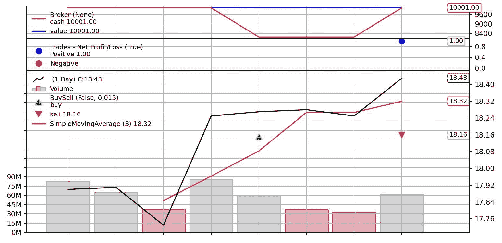
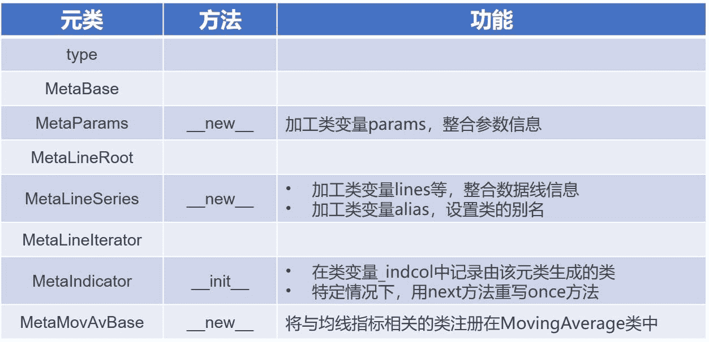
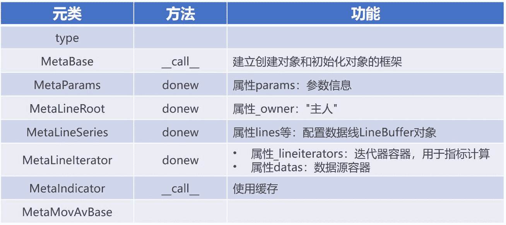

<!--yml
category: 交易
date: 2023-09-17 19:57:35
-->

# backtrader源码解读 (7)：指标 - 知乎

> 来源：[https://zhuanlan.zhihu.com/p/624747048](https://zhuanlan.zhihu.com/p/624747048)

## 1\. 前言

本文将介绍backtrader回测框架中的另一个核心组件——**指标** (Indicator)。简单来说，指标是用于计算和展示价格和交易量等数据的统计量，是技术分析和交易策略开发中必不可少的工具。在backtrader的回测流程中，指标和策略密不可分：它一般作为策略中的一个组件使用，为策略提供更加复杂和全面的信号和决策依据，从而进一步提高策略的性能和有效性。

在本文中，我们首先会展示一个基于简单移动平均线 (Simple Moving Average) 的策略，即"**上穿均线买入，下穿均线卖出**"。接下来，我们将从策略的__init__方法中的创建该指标的语句入手，深入介绍backtrader中指标构造的机制。此外，我们还将详细阐述策略对象调用_once方法时进行指标计算的流程。

## 2\. 示例策略

Example 1展示的是示例策略"上穿均线买入，下穿均线卖出"的代码。

```
# Example 1：示例策略 "上穿均线买入，下穿均线卖出"
import backtrader as bt
import pandas as pd

# --- part 1\. 数据预处理 ---
stock = pd.read_csv('stock.csv', index_col=0, parse_dates=True, encoding='gbk')
data = bt.feeds.PandasData(dataname=stock)

# --- part 2\. 构建策略 ---
class MyStrategy(bt.Strategy):
    params = {'period': 1}

    def log(self, txt, dt=None):  # 日志打印
        dt = dt or self.data.datetime.date(0)
        print(f'[{dt.isoformat()}] {txt}')

    def __init__(self):  # 初始化方法，构建策略要素
        self.close = self.data.close
        self.sma = bt.indicators.SimpleMovingAverage(self.close, period=self.p.period)   # 20行
        self.diff = self.close - self.sma                                                # 21行
        self.order = None

    def notify_order(self, order):  # 订单通知
        if order.status in [order.Submitted]:
            self.log('Order Submitted')
            return

        if order.status in [order.Accepted]:
            self.log('Order Accepted')
            return

        if order.status in [order.Completed]:
            if order.isbuy():
                self.log(f'Buy Executed at price {order.executed.price:.2f}')
            elif order.issell():
                self.log(f'Sell Executed at price {order.executed.price:.2f}')

        if order.status in [order.Canceled, order.Margin, order.Rejected]:
            self.log('Order Canceled/Margin/Rejected')

        self.order = None

    def notify_trade(self, trade):  # 交易通知
        if not trade.isclosed:
            return
        self.log(f'Trade P&L {trade.pnl:.2f}')

    def next(self):  # 策略操作
        self.log('Next')

        if self.order:
            self.log('Open Order Pending')
            return

        if not self.position:
            if self.diff > 0:
                self.order = self.buy(size=100)
        else:
            if self.diff < 0:
                self.order = self.sell(size=100)

# --- part 3\. 执行回测 ---
cerebro = bt.Cerebro()
cerebro.adddata(data)
cerebro.addstrategy(MyStrategy, period = 3)   # 67行

start_value = cerebro.broker.getvalue()
print(f'Starting Portfolio Value: {start_value}')

strats = cerebro.run(oldbuysell=True)

end_value = cerebro.broker.getvalue()
print(f'Final Portfolio Value: {end_value}')
cerebro.plot()
```

本文和上篇文章《[backtrader源码解读 (6)：策略](https://zhuanlan.zhihu.com/p/621758956)》中的示例策略在数据源和基础功能方面保持一致。 一方面，我们将继续使用本地文件"stock.csv"作为策略回测标的，该文件记录了某只股票从2022-11-1至2022-11-10的OHLCV数据 (见图1)。 另一方面，MyStrategy类中的方法log、notify_order和notify_trade也维持不变，分别实现日志打印、订单通知和交易通知的功能。


图1：本地文件stock.csv

在上篇文章的基础之上，本文将**简单移动平均** (Simple Moving Average, SMA) 指标纳入策略买卖信号中。 简单移动平均是一种常见的技术分析指标，用于平滑价格数据并描绘其趋势。它通过计算一段时间内收盘价的算术平均值来确定当前的平均价格。

在MyStrategy类的__init__方法中，我们创建策略信号所需的要素：

*   指定实例变量`close`为数据源的收盘价数据线；
*   指定实例变量`sma`为backtrader内置的SimpleMovingAverage指标对象；在创建该指标对象时，我们将收盘价数据线`close`作为位置参数，并且在cerebro调用addstrategy方法时将策略参数period设置为3，代表计算过去3日的收盘价的平均值；
*   指定实例变量`diff`为`close`和`sma`之差，将其作为一个新的指标。

在MyStrategy类的next方法中，我们使用`diff`构建策略操作的逻辑：

*   当`diff`>0时，提交买单；
*   当`diff`<0时，提交卖单。

图2展示了示例Example 1的回测结果。在图中的BuySell板块中，黑线代表了股票的日收盘价走势，红线代表了3日简单移动平均线的走势。在第4天 (2022-11-4)，均线上穿收盘价，策略提交买单，并于次日 (2022-11-7) 的开盘价成交。在第7天 (2022-11-9)，均线下穿收盘价，策略提交卖单，并于次日 (2022-11-10) 的开盘价成交。



图2：示例Example 1回测结果

以下是示例Example 1的策略执行日志。

> Starting Portfolio Value: 10000.0
> [2022-11-03] Next
> [2022-11-04] Next
> [2022-11-07] Order Submitted
> [2022-11-07] Order Accepted
> [2022-11-07] Buy Executed at price 18.15
> [2022-11-07] Next
> [2022-11-08] Next
> [2022-11-09] Next
> [2022-11-10] Order Submitted
> [2022-11-10] Order Accepted
> [2022-11-10] Sell Executed at price 18.16
> [2022-11-10] Trade P&L 1.00
> [2022-11-10] Next
> Final Portfolio Value: 10001.0

## 3\. 指标构造机制

通过示例Example 1的展示，我们不难感受到backtrader中指标的使用极为简便，代码也非常易读。然而，其背后的实现机制却相对复杂。

接下来，我们将对示例Example 1的第20行代码进行解读，从而更加深入地了解backtrader中指标的构建原理。

```
# Example 1 - 第20行
# 隶属 MyStrategy类__init__方法

self.sma = bt.indicators.SimpleMovingAverage(self.close, period=self.p.period)
```

### 3.1 **SimpleMovingAverage类**

在Example 1的第20行，我们创建了一个SimpleMovingAverage对象。 为了方便后续引用，我们将该SimpleMovingAverage对象命名为`sma_obj`。

SimpleMovingAverage是在indicators.sma模块中定义的MovingAverageSimple类的别名。 图3展示了MovingAverageSimple类的类关系图。 可以看到，该类关系图从"元类MetaLineIterator/LineIterator类"那一层开始向上的部分和Strategy类是相同的。 该结构反映了Strategy类和Indicator类共用一些功能，例如参数整合、数据线信息整合、迭代器管理等。


图3：MovingAverageSimple类和Average类 - 类关系图

我们按照惯例，对MovingAverageSimple类进行解析，具体包括**类的创建**、**对象的创建**以及**对象的初始化**这三个步骤。

### 3.1.1 类的创建

表1按照继承顺序自上而下列出了创建MovingAverageSimple类的元类名称，并在相应的元类后标识出参与类的创建的方法，并简单描述方法实现的功能。

【注】严格来说，元类的__init__方法用来进行类的初始化工作。然而，在backtrader中，元类的__init__方法使用较少，且通常用于实现非关键功能。因此，在叙述上，我们将元类的__init__方法并入类的创建过程中。



表1：MovingAverageSimple类的创建

在MovingAverageSimple类中，定义了类变量lines和alias (见Code 1)。经过元类MetaLineSeries的__new__方法的处理，MovingAverageSimple类会对数据线名称'sma'进行记录； 此外，系统将创建与MovingAverageSimple类功能相同的子类：SMA类和SimpleMovingAverage类，**这三者在使用上是等效的**。

```
# Code 1
# indicators.sma.py/MovingAverageSimple类/类变量

class MovingAverageSimple(MovingAverageBase):

    lines = ('sma',)
    alias = ('SMA', 'SimpleMovingAverage',)
    ...
```

### 3.1.2 对象的创建

表2在创建MovingAverageSimple类的元类名称后标识出参与创建对象的方法，并列举出方法为对象添加的重要属性以及实现的功能。



表2：MovingAverageSimple对象的创建

我们对MovingAverageSimple对象的关键实例属性进行梳理，这对于理解指标构建的机制非常重要。

**※ lines**

通过《[backtrader源码解读 (5)：数据源与数据加载](https://zhuanlan.zhihu.com/p/608124423)》的第4章，我们了解到，在经过元类MetaLineSeries的加工之后，实例属性lines成为数据线LineBuffer对象的容器。具体来说，属性lines是Lines类 (及其派生子类) 的实例对象，其属性lines是一个列表，用来存放LineBuffer对象。

在示例Example 1中，SimpleMovingAverage类的类属性lines中记录了一个数据线名称'sma'。因此，SimpleMovingAverage对象`sma_obj`的属性lines中相应会配置一个LineBuffer对象。 为了方便后续引用，我们将该LineBuffer对象命名为`sma_line`。

**※ _owner**

在《[backtrader源码解读 (5)：数据源与数据加载](https://zhuanlan.zhihu.com/p/608124423)》的第5章，我们详细介绍了实例属性_owner的作用及其实现细节。 简单来说，如果对象obj2的创建发生在对象obj1的创建过程中，那么obj2的属性_owner将被设置为obj1，我们也称obj1是obj2的"主人"。 属性_owner的作用是为了将backtrader中不同的组件进行关联，使得它们之间可以传递信息。

根据示例Example 1的第20行代码，我们不难看出，SimpleMovingAverage对象`sma_obj`是在MyStrategy对象的创建过程中生成的。为了方便后续引用，我们将该MyStrategy对象命名为`strat_obj`。因此，`sma_obj`的"主人" (属性_owner) 是`strat_obj`。

**※ _lineiterators**

属性_lineiterators是存放迭代器的容器。它是一个字典，其数字键0、1、2分别对应存放指标、策略、观察者的列表。 为了表述方便，我们在后文中如果说将某指标添加进属性_lineiterators，实际上指的是将该指标添加到属性_lineiterator的键0所对应的列表中。

**※ datas**

属性datas是存放数据源的容器。在上篇文章《[backtrader源码解读 (6)：策略](https://zhuanlan.zhihu.com/p/621758956)》中，策略对象的属性datas中存放的是一个PandasData对象，代表策略所作用的数据源。在本文中，SimpleMovingAverage对象`sma_obj`的属性datas中存放的是由PandasData对象的数据线close所生成的LineSeriesStub对象，这代表了计算指标所使用的数据源。这里，LineSeriesStub类的作用是让单线对象模拟多线对象，以满足接口需求。为了方便后续引用，我们将该LineSeriesStub对象命名为`close_data`。

此外，属性data代表属性datas的第一个元素，即datas[0]。

### 3.1.3 对象的初始化

以下方法依次参与了MovingAverageSimple对象的初始化工作：

1.  元类MetaLineIterator的dopreinit方法；
2.  MovingAverageSimple类的__init__方法；
3.  元类MetaLineIterator的dopostinit方法。

具体来说，元类MetaLineIterator的dopreinit方法 (见Code 2) 会为MovingAverageSimple对象添加实例属性_clock和_minperiod。其中，_clock代表基准数据源，用于提供时间刻度；_minperiod代表最小周期，指的是计算指标所需要的最少数据数量。例如，计算3日均线需要至少3个数据点。在这里，我们对最小周期进行了初步计算，采用的逻辑是对象的最小周期不小于其数据源的最小周期。这样设计主要考虑到了通过指标计算指标的情况。

```
# Code 2
# lineiterator.py/元类MetaLineIterator/dopreinit方法

def dopreinit(cls, _obj, *args, **kwargs):
    _obj, args, kwargs = super(MetaLineIterator, cls).dopreinit(_obj, *args, **kwargs)

    _obj.datas = _obj.datas or [_obj._owner]

    # 基准数据源是数据源容器中的首个元素
    _obj._clock = _obj.datas[0]   

    # 对象的最小周期不小于其数据源的最小周期
    _obj._minperiod = max([x._minperiod for x in _obj.datas] or [_obj._minperiod])

    # 对象的数据线的最小周期不能小于对象的最小周期
    for line in _obj.lines:
        line.addminperiod(_obj._minperiod)

    return _obj, args, kwargs
```

MovingAverageSimple类的__init__方法中涉及Average对象的创建，我们放在章节3.2中讲解。

元类MetaLineIterator的dopostinit方法（见Code 3）会对最小周期 (实例属性_minperiod) 进行再次计算，以确保对象的最小周期不小于其所包含的数据线和指标的最小周期。

```
# Code 3
# lineiterator.py/元类MetaLineIterator/dopostinit方法

def dopostinit(cls, _obj, *args, **kwargs):
    _obj, args, kwargs = super(MetaLineIterator, cls).dopostinit(_obj, *args, **kwargs)

    # 对象的最小周期不小于其所包含的数据线的最小周期
    _obj._minperiod = max([x._minperiod for x in _obj.lines])    # 8行

    # 对象的最小周期不小于其所包含的指标的最小周期
    _obj._periodrecalc()

    # 关联操作
    if _obj._owner is not None:              # 14行
        _obj._owner.addindicator(_obj)       # 15行

    return _obj, args, kwargs
```

此外，dopostinit方法还执行了非常重要的**关联操作**。在示例Example 1中，SimpleMovingAverage对象`sma_obj`的"主人"——MyStrategy对象`strat_obj`通过调用addindicator方法 (见Code 4) 将`sma_obj`添加到其迭代器容器 (属性_lineiterators) 中，从而将`sma_obj`与其关联起来。

```
# Code 4
# lineiterator.py/LineIterator类/addindicator方法 (部分)

def addindicator(self, indicator):
    self._lineiterators[indicator._ltype].append(indicator)
    ...
```

### 3.2 Average类

接下来，让我们回到MovingAverageSimple类的__init__方法 (见Code 5)。其中，第5行的代码是迄今为止最难解读的一行。

```
# Code 5
# indicators.sma.py/MovingAverageSimple类/__init__方法

def __init__(self):
    self.lines[0] = Average(self.data, period=self.p.period)   # 5行

    super(MovingAverageSimple, self).__init__()
```

首先，我们来看这行代码中赋值运算符的右侧，此处创建了一个Average对象。 为方便后续引用，我们将该Average对象命名为`avg_obj`。

Average类的类关系图在图3中展示。可以看到，Average类和MovingAverageSimple类的结构非常类似。 由于我们已经详细讲解了MovingAverageSimple类的创建、对象的创建和初始化过程，为了避免重复，我们不再按照同样的步骤来解读Average类，而是重点介绍Average对象`avg_obj`的关键特性。

**※ 数据线与别名**

在Average类中，定义了类变量lines和alias (见Code 6)。 经过元类MetaLineSeries的处理之后，Average类的类属性lines中会记录了一个数据线名称'av'，且`avg_obj`的属性lines会相应配置一个数据线LineBuffer对象。为方便后续引用，我们将该LineBuffer对象命名为`avg_line`。

此外，ArithmeticMean类和Mean类是与Average类具有相同功能的子类。

```
# Code 6
# indicators.basicops.py/Average类/类变量

class Average(PeriodN):

    lines = ('av',)
    alias = ('ArithmeticMean', 'Mean',)

    ...
```

**※ _owner**

`avg_obj`的实例属性_owner (即"主人") 为SimpleMovingAverage对象`sma_obj`。根据Code 5的第5行代码，我们可知，`avg_obj`是在`sma_obj`的创建过程中生成的。

**※ datas**

`avg_obj`和`sma_obj`的实例属性datas (即数据源容器) 中存储着同一个LineSeriestStub对象`close_data`，该对象是由数据源PandasData对象的数据线close所生成，代表指标计算的数据源。

此外，`avg_obj`和`sma_obj`的实例属性data为`close_data`。

**※ _minperiod**

`avg_obj`的实例属性_minperiod (即最小周期) 的变动流程如下：

1.  首先，在调用cerebro的addstrategy方法时 (见Example 1: 67行)，我们将参数period的值设置为3。这个值会逐级传递给`strat_obj`、`sma_obj`和`avg_obj`的参数period；
2.  接着，在初始化__init__方法中 (见Code 7)，`avg_obj`会调用addminperiod方法，将其所包含的数据线`avg_line`的最小周期调整为3；
3.  最后，经过元类MetaLineIterator的dopostinit方法处理之后 (见Code 3: 8行)，`avg_obj`的最小周期会与`avg_line`的最小周期同步为3。

【注】在第2步中，由于Average类中没有定义__init__方法，因此会调用其父类PeriodN的__init__方法。

```
# Code 7
# indicators.basicops.py/PeriodN类

class PeriodN(Indicator):
    params = (('period', 1), )

    def __init__(self):
        super(PeriodN, self).__init__()
        self.addminperiod(self.p.period)
```

**※ 关联操作**

在经过元类MetaLineIterator的dopostinit方法的处理后，`avg_obj`将被添加到其"主人"——`sma_obj`的属性_lineiterators中，这是由`sma_obj`调用addindicator方法 (见Code 3: 14-15行) 来实现的。这样一来，`avg_obj`就与`sma_obj`建立了关联。

### 3.3 __setitem__方法

让我们回到Code 5的第5行代码继续分析。

在Python中，当我们通过'[ ]'操作符进行索引赋值操作时，例如'a[i] = x'，会调用a对象的__setitem__方法。 因此，语句'self.lines[0] = avg_obj'会调用self.lines的__setitem__方法，此处self是SimpleMovingAverage对象`sma_obj`，而self.lines是Lines类派生子类的实例对象。

Code 8是Lines类的__setitem__方法的源码。 此处，形参line传入实参0，形参value传入实参`avg_obj`，而`sma_obj`调用_getlinealias(0)返回其第一根数据线的名称'sma'。因此，语句'self.lines[0] = avg_obj'等价于语句'self.lines.sma = avg_obj'。

```
# Code 8
# lineseries.py/Lines类/__setitem__方法

def __setitem__(self, line, value):
    setattr(self, self._getlinealias(line), value)
```

### 3.4 描述器

到这一步，代码'self.lines.sma = avg_obj'看起来像是把`avg_obj`赋值给`sma_obj`中包含的数据线`sma_line`，但实际上事情并不那么简单。 我们的目标是计算动态窗口内的收盘价的算术平均值，然而在目前阶段，我们尚未读取任何股票数据，根本就是"无值可算，无值可赋"。

实际上，这里实现的操作是将指标`avg_obj`与数据线`sma_line`进行关联，并且在后续阶段数据载入后，`avg_obj`会根据其所蕴含的指标公式进行指标计算，而数据线`sma_obj`可以获取相应的计算结果。

需要注意的是，上述一系列操作并不能仅仅通过普通的赋值运算符来完成。在这里，我们使用了**描述器** (descriptor) 来实现这个操作。

### 3.4.1 描述器简介

简单来说，描述器是一个至少定义了以下三个方法：

*   __get__(self, obj, cls=None)
*   __set__(self, obj, value)
*   __delete__(self, obj)

其中之一的类，其功能是让我们可以自定义属性的访问、赋值和删除行为，从而实现更加灵活的控制和处理。

通过示例Example 2，我们展示了描述器的基础用法。我们创建了一个名为Student的类，并实例化了一个对象s。我们想要在该对象的实例属性name上实现以下功能：在获取该属性值时，要求输入密码'123'，而在设置该属性值时，需要输入密码'321'，否则操作将不会成功。

```
# Example 2：
# step 1：定义描述器

class Name:
    def __get__(self, obj, cls=None):
        pwd = input('请输入获取密码')
        if pwd == '123':
            return obj._name
        else:
            print('密码不正确，获取失败')

    def __set__(self, obj, value):
        pwd = input('请输入设置密码')
        if pwd == '321':
            obj._name = value
            print('设置成功')
        else:
            print('密码不正确，设置失败')
```

需要重点注意的是，**描述器仅在作为类变量时才会起作用**。 在该示例中，我们必须将描述器实例赋予Student类的类变量name，而不是实例变量name，否则描述器将不起作用。

```
# Example 2：
# step 2：部署描述器

class Student:
    name = Name()

s = Student()
```

当我们给对象s的属性name进行赋值时，会调用描述器Name的__set__方法。

```
# Example 2：
# step 3-1：属性赋值

s.name = '小明'
```

> 请输入设置密码321
> 设置成功

当我们访问对象s的属性name时，会调用描述器Name的__get__方法。

```
# Example 2：
# step 3-2：属性访问

print(s.name)
```

> 请输入获取密码123
> 小明

以上提及的知识点足以帮助理解backtrader中描述器的使用。更多有关描述器的原理和用法详见《[Python官方描述器使用指南](https://link.zhihu.com/?target=https%3A//docs.python.org/zh-cn/3/howto/descriptor.html%3Fhighlight%3Ddescriptor%23closing-thoughts)》。

### 3.4.2 描述器LineAlias

描述器LineAlias (见Code 9) 实现了Code 5第5行的等价代码'self.lines.sma = avg_obj'所涉及的一系列操作，奠定了backtrader中指标构建和计算的基础。

```
# Code 9
# lineseries.py/描述器LineAlias

class LineAlias(object):

    def __init__(self, line):
        self.line = line

    def __get__(self, obj, cls=None):
        return obj.lines[self.line]

    def __set__(self, obj, value):

        if isinstance(value, LineMultiple):
            value = value.lines[0]

        if not isinstance(value, LineActions):
            value = value(0)

        value.addbinding(obj.lines[self.line])
```

**描述器部署**

在代码'self.lines.sma = avg_obj'中，self是SimpleMovingAverage对象`sma_obj`，self.lines是Lines类的子类的实例对象。在Lines类派生子类所调用的_derive方法中，与数据线名称同名的类变量'sma'被部署为描述器LineAlias对象 (见Code 10)。

```
# Code 10
# lineseries.py/Lines类/_derive方法
# 部署描述器LineAlias相关代码

class Lines(object):
    ...
    def _derive(cls, name, lines, extralines, otherbases, linesoverride=False,lalias=None):
        ...

        # 派生Lines类的子类newclas 
        newcls = type(str(cls.__name__ + '_' + name), (basecls,), {})
        ...
        l2start = len(cls._getlines()) if not linesoverride else 0
        l2add = enumerate(lines2add, start=l2start)

        for line, linealias in l2add:
            # linealias为数据线名称，line为数据线对应序号
            if not isinstance(linealias, string_types):
                linealias = linealias[0]

            # 部署描述器LineAlias 
            desc = LineAlias(line)
            setattr(newcls, linealias, desc)
```

**访问操作**

当我们访问sma_obj.lines的属性sma时，描述器LineAlias的__get__方法就会被调用，该方法的形参obj传入实参sma_obj.lines，返回值为sma_obj.lines.lines[0]，也就是数据线`sma_line`。

**赋值操作**

当我们执行代码'self.lines.sma = avg_obj' (此处self是`sma_obj`) 时，描述器LineAlias的__set__方法会被调用，形参obj和value分别传入实参self.lines和`avg_obj`。

描述器LineAlias的__set__方法所执行的操作为以下三个步骤。

**※ 步骤一**：提取数据线对象

该步骤所涉及的代码见Code 11。

```
# Code 11
# lineseries.py/描述器LineAlias/__set__方法/步骤一

if isinstance(value, LineMultiple):   # 4行
    value = value.lines[0]            # 5行
```

在Code 11的第4行，我们对形参value进行判断，检查它是否是LineMultiple类的实例对象。由于我们给形参value传入的实参`avg_obj`是一个Average对象，因此条件判断为真，代码继续执行到第5行。

在Code 11的第5行，我们从`avg_obj`中获取其所包含的第一根数据线LineBuffer对象，也就是`avg_line`，然后将其赋值给变量value。

**※ 步骤二**：创建_LineDelay对象

该步骤所涉及的代码见Code 12。

```
# Code 12
# lineseries.py/描述器LineAlias/__set__方法/步骤二

if not isinstance(value, LineActions):  # 4行
    value = value(0)                    # 5行
```

这段代码中，LineActions类是LineBuffer类的子类，它的作用是实现数据线的**错位索引** (对应子类_LineDelay和_LineForward) 以及数据线的**运算符操作** (对应子类LinesOperation和LineOwnOperation)，相关类的类关系图如图4所示。


图4：LineActions类及其子类 - 类关系图

在Code 12的第4行，我们判断变量value是否不属于LineActions类的实例对象。此时，变量value是LineBuffer对象`avg_line`，因而判断通过，代码执行下一行。

在Code 12的第5行，赋值运算符右侧的'value(0)'会调用LineBuffer类的__call__方法，其中形参ago传入0，在经过LineDelay函数处理后返回一个_LineDelay对象 (见Code 13)，赋值给变量value。为了方便后续引用，我们将该_LineDelay对象命名为`delayed_line`。

```
# Code 13
# linebuffer.py/LineBuffer类/__call__方法

def __call__(self, ago=None):

    from .lineiterator import LineCoupler
    if ago is None or isinstance(ago, LineRoot):
        return LineCoupler(self, ago)

    return LineDelay(self, ago)

# linebuffer.py/LineDelay函数

def LineDelay(a, ago=0, **kwargs):
    if ago <= 0:
        return _LineDelay(a, ago, **kwargs)  # 17行

    return _LineForward(a, ago, **kwargs)
```

为避免重复，我们不再赘述_LineDelay类和对象的创建过程，而是着重讲解_LineDelay对象`delayed_line`的初始化过程，其中：

*   **元类MetaLineActions的dopreinit方法** (见Code 14) 为_LineDelay对象`delayd_line`添加实例属性_clock、_datas和_minperiod，分别代表数据源基准、数据源容器和最小周期，此处属性值分别为`avg_line`、[`avg_line`, ]和3。

```
# Code 14
# linebuffer.py/元类MetaLineActions/dopreinit方法

def dopreinit(cls, _obj, *args, **kwargs):
    _obj, args, kwargs = super(MetaLineActions, cls).dopreinit(_obj, *args, **kwargs)

    _obj._clock = _obj._owner  
    if isinstance(args[0], LineRoot):
        _obj._clock = args[0]

    _obj._datas = [x for x in args if isinstance(x, LineRoot)]

    _minperiods = [x._minperiod for x in args if isinstance(x, LineSingle)]
    mlines = [x.lines[0] for x in args if isinstance(x, LineMultiple)]
    _minperiods += [x._minperiod for x in mlines]

    _minperiod = max(_minperiods or [1])
    _obj.updateminperiod(_minperiod)

    return _obj, args, kwargs
```

*   **_LineDelay的__init__方法** (见Code 15) 调用父类LineBuffer的__init__方法，使_LineDelay对象继承了_LineBuffer的数据结构。在此基础之上，_LineDelay对象添加了实例属性a和ago (ago为非正整数)，分别代表基准数据线和延迟数量。简单来说，_LineDelay对象是数据线a的ago的绝对值个时间刻度的延迟，并根据ago对其最小周期进行了相应调整。此处，`delayed_line`的属性a的值为`avg_line`，属性ago值为0。

```
# Code 15
# linebuffer.py/_LineDelay类/__init__方法

class _LineDelay(LineActions):
    def __init__(self, a, ago):
        super(_LineDelay, self).__init__()
        self.a = a
        self.ago = ago

        self.addminperiod(abs(ago) + 1)
```

**元类MetaLineActions的dopostinit方法** (见Code 16) 实现了关联操作，将`delayed_line`与其"主人" ——SimpleMovingAverage对象`sma_obj`关联起来。这是通过`sma_obj`调用addindicator方法将`delayed_line`添加到其属性_lineiterators (即迭代器容器) 中完成的。需要注意的是，此时`sma_obj`的迭代器容器_lineiterators中已经有两名成员：Average对象`avg_obj`和_LineDelay对象`delayed_line`。

```
# Code 16
# linebuffer.py/元类MetaLineActions/dopostinit方法

def dopostinit(cls, _obj, *args, **kwargs):
    _obj, args, kwargs = super(MetaLineActions, cls).dopostinit(_obj, *args, **kwargs)

    _obj._owner.addindicator(_obj)

    return _obj, args, kwargs
```

**※ 步骤三**：关联操作

该步骤所涉及的代码见Code 17。

```
# Code 17
# lineseries.py/描述器LineAlias/__set__方法/步骤三

value.addbinding(obj.lines[self.line])
```

此时，变量value是_LineDelay对象`delayed_line`。可以看到，`delayed_line`调用addbinding方法 (见Code 18)，传入参数obj.lines[self.line]为数据线`sma_line` ，执行操作是将`sma_line`添加至`delayed_line`属性bindings中，从而实现指标与数据线的关联。

```
# Code 18
# linebuffer.py/LineBuffer类/addbinding方法

def addbinding(self, binding):
    self.bindings.append(binding)

    binding.updateminperiod(self._minperiod)
```

### 3.5 关联关系总结

至此，示例Example 1中的SimpleMovingAverage对象创建完成。由于在该过程中涉及到了多个角色，可能会让你感到有些困惑。因此，在开始讲解指标计算流程之前，让我们通过图5来梳理一下这些角色之间的关系：

*   红色箭头代表对象之间的关联操作，指的是在元类MetaLineIterator或者MetaLineActions的dopostinit方法中，对象被添加至其"主人" (即属性_owner) 的迭代器容器 (属性_lineiterator) 中；
*   蓝色箭头代表指标与数据线的关联操作，指的是描述器LineAlias的__set__方法自定义了指标对数据线的赋值操作。


图5：示例Example 1 - 关联关系图

## 4\. 指标计算流程

在上篇文章《[backtrader源码解读 (6)：策略](https://zhuanlan.zhihu.com/p/621758956)》的第3章中，我们详细梳理了backtrader实现回测的流程。在此基础之上，本文将指标纳入到策略构建中。

本文将沿用在上篇文章中使用的回测流程步骤序号 (见图6)，并对once模式下的指标计算过程进行讲解。在once模式下，指标的计算发生在数据源加载 (步骤4.1) 之后，此时系统会对指标进行一次性计算（步骤5.1），从而在while循环模拟数据逐条到来时 (步骤5.2) 可以直接调用指标的计算结果。


图6：backtrader回测流程核心 - runstrategies方法

具体来说，在步骤5.1中，策略对象会调用_once方法进行指标计算 (见Code 19)。

```
# Code 19
# lineiterator.py/LineIterator类/_once方法

def _once(self):
    self.forward(size=self._clock.buflen())                       # 5行

    for indicator in self._lineiterators[LineIterator.IndType]:   # 7行
        indicator._once()                                         # 8行

    for observer in self._lineiterators[LineIterator.ObsType]:
        observer.forward(size=self.buflen())

    for data in self.datas:
        data.home()

    for indicator in self._lineiterators[LineIterator.IndType]:
        indicator.home()

    for observer in self._lineiterators[LineIterator.ObsType]:
        observer.home()

    self.home()

    self.preonce(0, self._minperiod - 1)                          # 24行
    self.oncestart(self._minperiod - 1, self._minperiod)          # 25行
    self.once(self._minperiod, self.buflen())                     # 26行

    for line in self.lines:
        line.oncebinding()
```

在示例Example 1中，_once方法会按照以下三个层级进行迭代调用：

**※ 层级一**：`strat_obj`调用_once方法

该步骤对于`strat_obj`本身无实质性影响，因为在步骤5.1中，`strat_obj`接下来还会调用reset方法进行重置。 该步骤的真正作用是让`strat_obj`的属性_lineiterators中的SimpleMovingAverage对象`sma_obj`调用_once方法 (Code 19: 7-8行)。

**※ 层级二**：`sma_obj`调用_once方法

该步骤中，首先为`sma_obj`中包含的数据线`sma_line`腾出与数据源`close_data`长度匹配的空位 (Code 19: 5行)；接着，让`sma_obj`的属性_lineiterators中的`avg_obj`和`delayed_line`依次调用_once方法 (Code 19: 7-8行)。

**※ 层级三 (a)**：`avg_obj`调用_once方法

该步骤中，首先为`avg_obj`中包含的数据线`avg_line`腾出与数据源`close_data`长度匹配的空位 (Code 19: 5行)，随后，依次调用preonce方法、oncestart方法和once方法 (Code 19: 24-26行)。这三个方法分别表示以下含义：

*   preonce方法：当不满足最小周期要求时，为指标计算做准备；
*   oncestart方法：当刚满足最小周期要求时，启动指标计算；
*   once方法：当满足最小周期要求时，进行指标计算。

这三个方法中，once方法是计算简单移动平均指标的核心，其具体实现包括以下几个方面：

*   指标计算的数据源是`close_data` (Code 20: 15行)；
*   指标计算公式 (Code 20: 19-20行)；
*   指标计算结果存放在`avg_line` (Code 20: 16行)。

```
# Code 20

# lineiterator.py/LineIterator类/preonece和oncestart方法

def preonce(self, start, end):
    pass

def oncestart(self, start, end):
    self.once(start, end)

# indicators.basicops.py/Average类/once方法

def once(self, start, end):
    src = self.data.array   # 15行 
    dst = self.line.array   # 16行
    period = self.p.period

    for i in range(start, end):                                  # 19行
        dst[i] = math.fsum(src[i - period + 1:i + 1]) / period   # 20行
```

**※ 层级三 (b)**：`delayed_line`调用_once方法

由于`delayed_line`是_LineDelay对象，属于单线对象，所以其调用的_once方法并不是LineIterator类的_once方法，而是LineActions类的_once方法 (见Code 21)。

```
# Code 21
# linebuffer.py/LineActions类/_once方法

def _once(self):
    self.forward(size=self._clock.buflen())   # 5行
    self.home()

    self.preonce(0, self._minperiod - 1)                  # 8行
    self.oncestart(self._minperiod - 1, self._minperiod)  # 9行
    self.once(self._minperiod, self.buflen())             # 10行

    self.oncebinding()                                    # 12行
```

该步骤中，首先为`delayed_line`腾出与数据源`avg_line`长度匹配的空位 (Code 21: 5行) ；随后，依次调用preonce方法、oncestart方法和once方法 (Code 21: 8-10行)。这三个方法的源码见Code 22。与之前类似，真正起到计算作用的是once方法，其具体实现包括以下几个方面：

*   指标计算的数据源是`avg_line` (Code 22: 16行)；
*   指标计算公式 (Code 22: 19-20行)；
*   计算结果存放在`delayed_line`中 (Code 22: 15行)。

总的来说，这一步将`avg_line`中的指标计算结果同步给`delayed_line`。

```
# Code 22

# lineroot.py/LineRoot类/preonece和oncestart方法

def preonce(self, start, end):
    pass

def oncestart(self, start, end):
    self.once(start, end)

# linebuffer.py/_LineDelay类/once方法

def once(self, start, end):
    dst = self.array         # 15行
    src = self.a.array       # 16行
    ago = self.ago

    for i in range(start, end):   # 19行
        dst[i] = src[i + ago]     # 20行
```

在这之后，`delayed_line`调用oncebinding方法 (见Code 23)，将`delayed_line`中的指标计算结果同步给属性bindings中的存放的`sma_line`，从而最终完成了简单移动平均线指标的计算。

```
# Code 23
# linebuffer.py/LineBuffer类/oncebinding方法

def oncebinding(self):
    larray = self.array
    blen = self.buflen()
    for binding in self.bindings:
        binding.array[0:blen] = larray[0:blen]
```

完整的指标计算流程如图7所示。


图7：指标计算 (_once方法) 流程

## 5\. 小结与展望

本文通过一个基于简单移动平均线的策略深度剖析了backtrader中指标构造的机制以及指标计算的流程。

由于篇幅限制，本文无法囊括指标相关的所有话题，其中包括但不限于：

*   本文主要介绍的Example 1的第20行是通过公式生成指标，而第21行是通过数据线运算生成指标，其机制是什么？
*   在SimpleMovingAverage指标生成过程中，为什么要多绕一圈引入_LineDelayed对象，作者的目的是什么？
*   在once模式下，backtrader的指标计算究竟有没有用到矢量计算 (chatGPT斩钉截铁地告诉我用到了lol)，和next模式相比能提速多少？

如果觉得文章有帮助的话，希望大家可以多多关注、点赞~

五一假期回来啦，正在努力更新ing~

* * *

**往期回顾**

[backtrader源码解读 (1)：读懂源码的钥匙——认识元类](https://zhuanlan.zhihu.com/p/594948193)

[backtrader源码解读 (2)：读懂源码的钥匙——元类进阶](https://zhuanlan.zhihu.com/p/597309489)

[backtrader源码解读 (3)：底层基石——metabase模块 (上篇)](https://zhuanlan.zhihu.com/p/600145210)

[backtrader源码解读 (4)：底层基石——metabase模块 (下篇)](https://zhuanlan.zhihu.com/p/602906986)

[backtrader源码解读 (5)：数据源与数据加载](https://zhuanlan.zhihu.com/p/608124423)

[backtrader源码解读 (6)：策略](https://zhuanlan.zhihu.com/p/621758956)