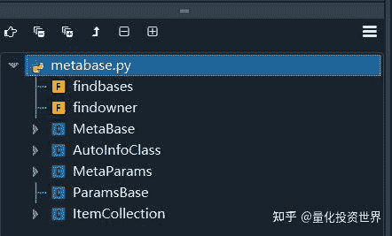
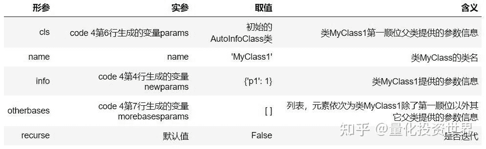
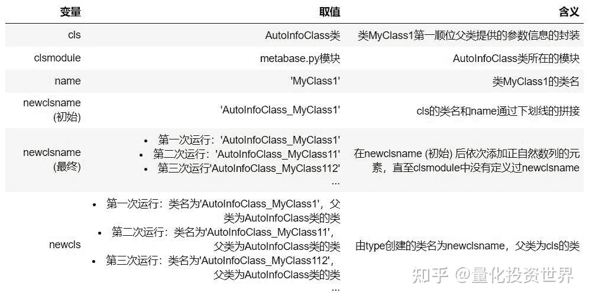
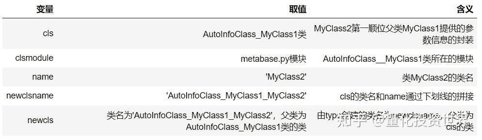
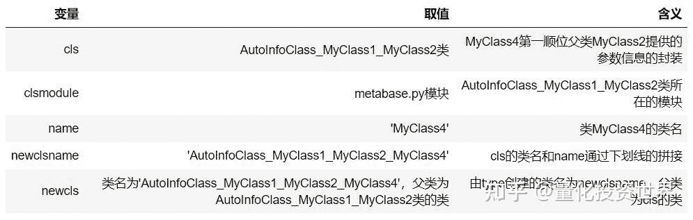

<!--yml
category: 交易
date: 2023-09-17 20:00:11
-->

# backtrader源码解读 (3)：底层基石——metabase模块 (上篇) - 知乎

> 来源：[https://zhuanlan.zhihu.com/p/600145210](https://zhuanlan.zhihu.com/p/600145210)

针对backtrader采用的元编程技术，我们在前两篇文章中着重介绍了元类的概念和常用方法。从本文起，我们将正式开始backtrader源码的解读。

源码路径的获取如下所示。

```
import backtrader as bt
print(bt.__path__)
```

> ['D:\\Application\\Anaconda\\lib\\site-packages\\backtrader']

我们将从metabase模块开始解读。请注意，**metabase模块是backtrader的底层基石**，几乎所有其它模块都会调用该模块。metabase模块一共有331行代码，其中定义了两个函数和五个类。



metabase模块概览

由于篇幅限制，该模块将分为上下两篇文章来讲解。本文为上篇，主要内容包括元类MetaBase、AutoInfoClass类和元类MetaParams的__new__方法。在下篇中，我们将介绍元类MetaParams的donew方法以及一些有关该模块的具体应用与技巧。

话不多说，让我们开始吧！

## 1\. 元类MetaBase

MetaBase直接继承type (见code 1)，所以，MetaBase是一个元类。不光如此，**MetaBase是backtrader中最为底层的元类**，它搭建了一个可供子类使用的控制框架。

```
# code 1：metabase.py-元类MetaBase源码
class MetaBase(type):
    def doprenew(cls, *args, **kwargs):
        return cls, args, kwargs

    def donew(cls, *args, **kwargs):
        _obj = cls.__new__(cls, *args, **kwargs)
        return _obj, args, kwargs

    def dopreinit(cls, _obj, *args, **kwargs):
        return _obj, args, kwargs

    def doinit(cls, _obj, *args, **kwargs):
        _obj.__init__(*args, **kwargs)
        return _obj, args, kwargs

    def dopostinit(cls, _obj, *args, **kwargs):
        return _obj, args, kwargs

    def __call__(cls, *args, **kwargs):
        cls, args, kwargs = cls.doprenew(*args, **kwargs)
        _obj, args, kwargs = cls.donew(*args, **kwargs)
        _obj, args, kwargs = cls.dopreinit(_obj, *args, **kwargs)
        _obj, args, kwargs = cls.doinit(_obj, *args, **kwargs)
        _obj, args, kwargs = cls.dopostinit(_obj, *args, **kwargs)
        return _obj
```

具体而言，MetaBase中重写了__call__方法。通过先前的学习我们已经知道，元类的__call__方法在元类所创建的类使用( )运算符时被调用，也就是用来控制元类所创建的类如何去创建对象。

在MetaBase的__call__方法中，除了创建对象、初始化对象以及返回对象这些最为基础的事情，重点是将对象的创建和初始化拆分为**创建前**、**创建中**、**初始化前**、**初始化中**、**初始化后**五个步骤，分别由下面五个方法所管控：

1.  **doprenew**：cls创建对象前，当前什么也没做；
2.  **donew**：调用cls的__new__方法创建对象_obj；
3.  **dopreinit**：_obj初始化前，当前什么也没做；
4.  **doinit**：调用_obj的__init__方法进行初始化；
5.  **dopostinit**：_obj初始化后，当前什么也没做。

【注】这里的cls是__call__方法的第一个形参，会自动绑定__call__方法的调用者，也就是MetaBase所创建的类。

MetaBase通过上述的步骤拆分完成了控制框架的搭建：**MetaBase的子类通过重写这五个方法就可以精准地在对象创建和初始化的各个流程中实现想要的操作**。比方说，我们在下篇文章中就会介绍MetaBase的子类MetaParams重写donew方法。

## 2\. 元类MetaParams

MetaParams继承MetaBase。所以说，MetaParams也是一个元类。MetaParams重写了__new__方法和donew方法，实现的功能是**参数整合**。

具体是什么意思呢？

我们在使用backtrader时，需要给系统设定不同参数以实现不同的功能。在backtrader中，**参数通过类变量params来设定**，参数的形式可以是字典或者是元组。

举例来说，code 2是cerebro模块中Cerebro类开头部分的源码。在Cerebro类的主体中，类变量params被赋值一个元组，该元组的元素是由参数名和参数值构成的元组。

```
# code 2：cerebro.py-类Cerebro部分源码
class Cerebro(with_metaclass(MetaParams, object)):
    params = (
        ('preload', True),
        ('runonce', True),
        ('maxcpus', None),
        ('stdstats', True),
        ('oldbuysell', False),
        ('oldtrades', False),
        ('lookahead', 0),
        ('exactbars', False),
        ('optdatas', True),
        ('optreturn', True),
        ('objcache', False),
        ('live', False),
        ('writer', False),
        ('tradehistory', False),
        ('oldsync', False),
        ('tz', None),
        ('cheat_on_open', False),
        ('broker_coo', True),
        ('quicknotify', False),
    )
```

code 3是用户自定义策略MyStrategy类开头部分的代码。这里类变量params被赋值一个字典，字典的键为参数名，值为参数值。

```
# code 3：用户自定义策略MyStrategy部分代码
class MyStrategy(bt.Strategy):
    params = {'maperiod', 10}
    ...
```

example 1简单展示了MetaParams所实现的功能。

类MyClass1由元类MetaParams所创建，类MyClass2继承类MyClass1。在类MyClass1和MyClass2中都定义了类变量params，但是对应的参数输入不尽相同。事实上，这非常符合惯常的使用场景：不同的类用于实现不同的功能，因此需要输入不同的参数。

```
# example 1
import backtrader as bt

class MyClass1(metaclass = bt.metabase.MetaParams):
    params = {'p1': 1}

class MyClass2(MyClass1):
    params = {'p2': 2}

print('[1]', MyClass2.params)
print('[2]', MyClass2.params._getpairsbase())
print('[3]', MyClass2.params._getpairs())
```

> [1] <class 'backtrader.metabase.AutoInfoClass_MyClass1_MyClass2'>
> [2] OrderedDict([('p1', 1)])
> [3] OrderedDict([('p1', 1), ('p2', 2)])

通过打印结果，我们可以看到类MyClass2的类变量params是一个类，并有以下几个特征：

*   类名为AutoInfoClass_MyClass1_MyClass2；
*   调用_getpairsbase方法返回一个OrderedDict对象，包含类MyClass2所有父类的参数信息；
*   调用_getpairs方法返回一个OrderedDict对象，包含类MyClass2自身和它所有父类的参数信息。

【注】为了表述简洁，本文中参数信息指的是由参数名和参数值组成的键值对的集合，参数信息的形式可以是形式如code 2中的元组，可以是字典，也可以是有序字典OrderedDict。

是不是非常神奇呢？这究竟是如何实现的呢？在追根究底之前，我们需要先了解用来整合参数信息的AutoInfoClass类。

### 2.1 AutoInfoClass类

AutoInfoClass类是在metabase模块中自定义的一个类，**本质上是对有序字典OrderedDict的封装**。字典dict我们都很熟悉，什么是有序字典OrderedDict呢？我们做一个简单介绍。

### 2.1.1 有序字典OrderedDict

有序字典OrderedDict是字典dict的子类，它除了有和字典几乎相同的使用方法和功能，还有记住插入顺序的能力。

事实上，在Python 3.6之前的版本，字典dict对象是完全无序的。例如，如果example 2.1在Python 3.6之前的版本中运行，每次打印键值对的顺序都是随机的。然而，在Python 3.6版本之后，字典dict对象也变为有序了，example 2.1的打印顺序会按照键值对插入的顺序。这个改动使得有序字典OrderedDict变得没那么重要。

```
# example 2.1
d = {}
d['[1]'] = 'A'
d['[2]'] = 'B'
d['[3]'] = 'C'

for k,v in d.items():
    print(k, v)
```

> [1] A
> [2] B
> [3] C

然而，通过example 2.2我们可以看到字典和有序字典的不同：相同键值对、不同插入顺序的字典对象是被视为相等的；而相同键值对、不同插入顺序的有序字典对象是被视为不相等的。

```
# example 2.2
from collections import OrderedDict

d1 = {}
d1['[1]'] = 'A'
d1['[2]'] = 'B'
d1['[3]'] = 'C'

d2 = {}
d2['[3]'] = 'C'
d2['[2]'] = 'B'
d2['[1]'] = 'A'

od1 = OrderedDict()
od1['[1]'] = 'A'
od1['[2]'] = 'B'
od1['[3]'] = 'C'

od2 = OrderedDict()
od2['[3]'] = 'C'
od2['[2]'] = 'B'
od2['[1]'] = 'A'

print('[1]', d1 == d2)
print('[2]', od1 == od2)
```

> [1] True
> [2] False

### 2.1.2 案例展示

每一个AutoInfoClass类都封装着两个OrderedDict对象，分别可以通过类方法**_getpairsbase**和**_getpairs**获取。

接下来，我们通过example 3来进一步探索元类MetaParams和AutoInfoClass类的特性。example 3是example 1的复杂版本，涉及到**多继承**和**参数修改**，描述如下：

*   类MyClass1由元类MetaParams所创建；
*   类MyClass2和MyClass3分别继承类MyClass1，类MyClass4多继承类MyClass2和MyClass3；
*   结合前两点，意味着类MyClass2、MyClass3和MyClass4都是由元类MetaParams所创建；
*   类MyClass1、类MyClass2、类MyClass3、类MyClass4分别通过类变量params设定了参数p1、p2、p3、p4的值；特别地，类MyClass2和类MyClass3对p2设定的值不相同，类MyClass1和类MyClass4对p1设定的值不相同。

我们将继承链上每一个类的类变量params以及它调用类方法_getpairsbase和_getpairs的返回值进行打印。

```
# example 3
import backtrader as bt

class MyClass1(metaclass = bt.metabase.MetaParams):
    params = {'p1': 1}

class MyClass2(MyClass1):
    params = {'p2': 2}

class MyClass3(MyClass1):
    params = {'p2':22, 'p3': 3}

class MyClass4(MyClass2, MyClass3):
    params = {'p1': 11, 'p4': 4}

print('[1.1]', MyClass1.params)
print('[1.2]', MyClass1.params._getpairsbase())
print('[1.3]', MyClass1.params._getpairs())

print('[2.1]', MyClass2.params)
print('[2.2]', MyClass2.params._getpairsbase())
print('[2.3]', MyClass2.params._getpairs())

print('[3.1]', MyClass3.params)
print('[3.2]', MyClass3.params._getpairsbase())
print('[3.2]', MyClass3.params._getpairs())

print('[4.1]', MyClass4.params)
print('[4.2]', MyClass4.params._getpairsbase())
print('[4.3]', MyClass4.params._getpairs())
```

> [1.1] <class 'backtrader.metabase.AutoInfoClass_MyClass1'>
> [1.2] OrderedDict()
> [1.3] OrderedDict([('p1', 1)])
> [2.1] <class 'backtrader.metabase.AutoInfoClass_MyClass1_MyClass2'>
> [2.2] OrderedDict([('p1', 1)])
> [2.3] OrderedDict([('p1', 1), ('p2', 2)])
> [3.1] <class 'backtrader.metabase.AutoInfoClass_MyClass1_MyClass3'>
> [3.2] OrderedDict([('p1', 1)])
> [3.2] OrderedDict([('p1', 1), ('p2', 22), ('p3', 3)])
> [4.1] <class 'backtrader.metabase.AutoInfoClass_MyClass1_MyClass2_MyClass4'>
> [4.2] OrderedDict([('p1', 1), ('p2', 22), ('p3', 3)])
> [4.3] OrderedDict([('p1', 11), ('p2', 22), ('p3', 3), ('p4', 4)])

通过比对，我们发现，类变量params大体上符合以下特征：

*   params所属类的名称以AutoInfoClass开头，并以下划线依次连接继承链上的类名；
*   params调用_getpairsbase返回包含当前类所有父类参数信息的OrderedDict；
*   params调用_getpairs返回包含当前类和当前类所有父类参数信息的OrderedDict。

之所以说"大体上"，是因为我们确实也看到了类MyClass4的类变量params的"异常"之处：

*   类MyClass4的类变量params所属类的名称是AutoInfoClass_MyClass1_MyClass2_MyClass4，中间跳过了MyClass3；
*   调用_getpairsbase方法返回的是OrderedDict([('p1', 1), ('p2', 22), ('p3', 3)])，其中，p1的值为类MyClass1中设定的1，p2的值为类MyClass3中设定的22；
*   调用_getpairs方法返回的是OrderedDict([('p1', 11), ('p2', 22), ('p3', 3), ('p4', 4)])，其中，p1的值更新为类MyClass4中设定的11。

为什么会这样呢？要彻底回答这个问题，我们需要对元类MetaParams的__new__方法进行梳理。

### 2.2 **MetaParams的__new__方法**

我们在先前的文章中已经介绍：元类的__new__方法可以介入类的创建并对类进行修改。这里，MetaParams的__new__方法实现的主要功能就是对类变量params做出以下修改：

*   将类变量params从字典或元组转化为AutoInfoClass类；
*   加工后的类变量params不仅囊括当前类中params所包含的参数信息，还整合了它所有父类的params所包含的参数信息。

code 4为元类MetaParams的__new__方法的简版源码，为了增强代码的可读性，我们删除了与参数整合无关的代码。

```
# code 4：metabase.py-元类MetaParams：__new__方法部分源码
class MetaParams(MetaBase):
    def __new__(meta, name, bases, dct): #--------------------------------------- 第3行
        newparams = dct.pop('params', ()) #-------------------------------------- 第4行
        cls = super(MetaParams, meta).__new__(meta, name, bases, dct) #---------- 第5行 
        params = getattr(cls, 'params', AutoInfoClass) #------------------------- 第6行
        morebasesparams = [x.params for x in bases[1:] if hasattr(x, 'params')] # 第7行
        cls.params = params._derive(name, newparams, morebasesparams) #---------- 第8行
        return cls #------------------------------------------------------------- 第9行
```

尽管这里代码行数不多，但是要做到完全理解是有难度的。接下来，我们通过剖析example 3来帮助大家掌握所有细节。

### **2.2.1 案例解读：类MyClass1**

在example 3中，类MyClass1至类MyClass4都是由元类MetaParams所创建。其中，类MyClass1的创建最为简单，不涉及继承和参数修改。

我们就从它开始，讲解在类MyClass1被创建的过程中，元类MetaParams的__new__方法 (code 4) 的每一行代码都具体发生了什么。

**第3行**

```
def __new__(meta, name, bases, dct):
```

MetaParams的__new__方法的形参meta，name，bases，dct接受实参，其中，

*   meta接受元类MetaParams；
*   name接受类MyClass1的类名，即字符串'MyClass1'；
*   bases接受类MyClass1的父类组成的元组，即空元组( )；
*   dct接受类MyClass1的属性名或方法名为键，对应的属性值或函数为值所组成的字典；在类MyClass1的主体中，定义了params = {'p1': 1}，所以，dct所接受的字典包含字符串'params'和字典{'p1': 1}组成的键值对。

**第4行**

```
newparams = dct.pop('params', ())
```

从字典dct中将键'params'剥离出来，并其将对应的值{'p1': 1}赋值给**变量newparams**。这里，变量newparams的含义是类MyClass1提供的参数信息。

这里用到了字典的pop方法，见example 4。

```
# example 4
dct = {'a':1, 'b':2, 'params': {'p1': 1}}
newparams = dct.pop('params', ())

print('[1]', newparams)
print('[2]', dct)
```

> [1] {'p1': 1}
> [2] {'a': 1, 'b': 2}

**第5行**

```
cls = super(MetaParams, meta).__new__(meta, name, bases, dct)
```

调用MetaParams的父类type的__new__方法创建一个新的**类cls**，使用的参数为meta，name，bases和的dct，注意这里的dct已经剔除了键'params'。

**第6行**

```
params = getattr(cls, 'params', AutoInfoClass)
```

通过getattr函数在类cls中搜寻params属性。

由于在创建类cls的时候，字典dct已经剔除了键'params'，所以说类cls自身肯定是没有params属性的。所以，接下来会去类cls的父类中继续搜寻params属性。

然而，由于在创建类cls的时候，参数bases是一个空元组，这意味着类cls父类是object，也是没有params属性的。所以，getattr函数最终找不到params属性从而返回默认值：一个初始的AutoInfoClass类，并将其赋值给**变量params**。

什么是初始的AutoInfoClass类？code 5.1是AutoInfoClass类的类方法_getpairsbase和_getpairs被初始设置的源码。我们可以看到，这两个类方法默认都是返回一个空的OrderedDict对象。这种状态下的AutoInfoClass类就是初始的。

```
# code 5.1：metabase.py-类AutoInfoClass部分源码：_getpairsbase、_getpairs
class AutoInfoClass(object):
    _getpairsbase = classmethod(lambda cls: OrderedDict())
    _getpairs = classmethod(lambda cls: OrderedDict())
```

需要重点注意的是，在这里，变量params是AutoInfoClass类，它的含义是类MyClass1第一顺位父类提供的参数信息的封装。

**第7行**

```
morebasesparams = [x.params for x in bases[1:] if hasattr(x, 'params')]
```

依次在类cls除了第一顺位以外其它父类中搜寻params属性，并顺次放入列表中。刚才已经说明，bases是一个空元组，所以这里的**变量morebasesparams**会被赋值空列表[ ]。

这里，变量morebasesparams的含义是一个列表，其元素依次是类MyClass1除了第一顺位以外其它父类提供的参数信息。

**第8行**

```
cls.params = params._derive(name, newparams, morebasesparams)
```

变量params调用_derive方法，返回值是AutoInfoClass类的子类，并将该返回值赋值给类cls的类变量params。

【注】赋值运算符左右两边的params代表不同的含义：右边的params是code 4第6行生成的变量，它是一个AutoInfoClass类；左边的params是类cls动态创建的类变量。

**第9行**

将在以上步骤中创建并修改后的cls返回，随即完成类MyClass1的创建。

需要注意的是，第8行出现的_derive方法是AutoInfoClass类的类方法，也是元类MetaPrams实现参数整合功能的核心。我们接下来将进行重点解读。code 5.2是_derive方法的源码。

```
# code 5.2：metabase.py-类AutoInfoClass部分源码：_derive
class AutoInfoClass(object):
    @classmethod
    def _derive(cls, name, info, otherbases, recurse=False):
        baseinfo = cls._getpairs().copy() #-------------------------- 第5行
        obasesinfo = OrderedDict() #--------------------------------- 第6行
        for obase in otherbases:
            if isinstance(obase, (tuple, dict)):
                obasesinfo.update(obase)
            else:
                obasesinfo.update(obase._getpairs()) #--------------- 第11行

        baseinfo.update(obasesinfo) #-------------------------------- 第13行

        clsinfo = baseinfo.copy() #---------------------------------- 第15行
        clsinfo.update(info) #--------------------------------------- 第16行

        info2add = obasesinfo.copy()
        info2add.update(info)

        clsmodule = sys.modules[cls.__module__] #-------------------- 第21行
        newclsname = str(cls.__name__ + '_' + name)

        namecounter = 1
        while hasattr(clsmodule, newclsname):
            newclsname += str(namecounter)
            namecounter += 1

        newcls = type(newclsname, (cls,), {})
        setattr(clsmodule, newclsname, newcls) #--------------------- 第30行

        setattr(newcls, '_getpairsbase', classmethod(lambda cls: baseinfo.copy())) #- 第32行
        setattr(newcls, '_getpairs', classmethod(lambda cls: clsinfo.copy())) #------ 第33行
        setattr(newcls, '_getrecurse', classmethod(lambda cls: recurse))

        for infoname, infoval in info2add.items():
            if recurse:
                recursecls = getattr(newcls, infoname, AutoInfoClass)
                infoval = recursecls._derive(name + '_' + infoname, infoval, [])

            setattr(newcls, infoname, infoval)

        return newcls #---------------------------------------------- 第43行
```

为了方便理解，我们在下表中梳理了_derive方法形参 (code 5.2第4行) 和实参 (code 4第8行) 的对应关系，以及类MyClass1案例中实参的取值和含义。



接下来，我们将逐行讲解类MyClass1案例中调用_derive方法 (code 4第8行) 时对应_derive方法的源码 (code 5.2) 具体发生了什么。

【注】这里的参数recurse为默认值False。我们在未来lineseries模块的讲解中会涉及到recurse为Ture的场景。

**第5行**

```
baseinfo = cls._getpairs().copy()
```

在这里，cls取值初始的AutoInfoClass类，含义是MyClass1第一顺位父类提供的参数信息的封装。所以，该行代码通过_getpairs方法获取了类MyClass1第一顺位父类提供的所有参数信息：一个空的OrderedDict对象，并将其赋值给变量baseinfo。

**第6-11行**

```
obasesinfo = OrderedDict()
for obase in otherbases:
    if isinstance(obase, (tuple, dict)):
        obasesinfo.update(obase)
    else:
        obasesinfo.update(obase._getpairs())
```

变量obasesinfo起初是一个空的OrderedDict对象。接下来，依次获取类MyClass1除了第一顺位以外其他父类提供的参数信息，并顺次更新obasesinfo。

这里所谓的"更新"就是调用有序字典的update方法，该方法可以让一个元组 (该元组的元素为键值对构成的元组)、字典或者有序字典中所包含的键值对去更新己有字典，遵循的原则是：**如果遇到重复的键则覆盖对应的值，如果没有遇到重复的键则添加键值对**。

example 5是OrderedDict对象调用update方法的案例。

```
# example 5
from collections import OrderedDict

info = OrderedDict()

t = (('p1', 1), ('p2', 2))
d = {'p2': 22, 'p3': 3}
od = OrderedDict([('p3', 333), ('p4', 4)])

info.update(t)
print('[1]', info)

info.update(d)
print('[2]', info)

info.update(od)
print('[3]', info)
```

> [1] OrderedDict([('p1', 1), ('p2', 2)])
> [2] OrderedDict([('p1', 1), ('p2', 22), ('p3', 3)])
> [3] OrderedDict([('p1', 1), ('p2', 22), ('p3', 333), ('p4', 4)])

**第13行**

```
baseinfo.update(obasesinfo)
```

用类MyClass1除了第一顺位以外其他父类提供的参数信息obasesinfo去更新类MyClass1第一顺位父类提供的参数信息baseinfo，从而，baseinfo完成了类MyClass1所有父类参数信息的整合。这里，更新后的baseinfo依旧是一个空的OrderedDict对象。

**第15-16行**

```
clsinfo = baseinfo.copy()
clsinfo.update(info)
```

变量clsinfo起初被赋值类MyClass1所有父类参数信息baseinfo的复制。接下来，用类MyClass1提供的参数信息info去更新类clsinfo，从而，clsinfo完成了类MyClass1自身和它所有父类的参数信息的整合。在这里，更新后的clsinfo是OrderedDict([('p1', 1)])。

**第21-30行**

```
clsmodule = sys.modules[cls.__module__]
newclsname = str(cls.__name__ + '_' + name)

namecounter = 1
while hasattr(clsmodule, newclsname):
    newclsname += str(namecounter)
    namecounter += 1

newcls = type(newclsname, (cls,), {})
setattr(clsmodule, newclsname, newcls)
```

derive方法的返回值是一个类，这几行代码完成了对这个类的取名和创建的工作，具体的步骤如下所示：

1.  这里的cls取值为AutoInfoClass类，那么，变量clsmodule则被赋值AutoInfoClass类所在的模块，也就是metabase模块；
2.  暂定一个类名，构成方法是cls的类名 (取值'AutoInfoClass') 和参数name (取值'MyClass1') 通过下划线的拼接，即'AutoInfoClass_MyClass1'，并赋值给变量newclsname；
3.  在clsmodule中搜寻是否已经对名为newclsname的变量进行了定义：如果有，则通过while循环在newclsname后依次添加正自然数列的元素构成新的newclsname，直至clsmodule中没有对名为newclsname的变量进行过定义；
4.  由type创建一个类名为newclsname，父类为cls的类，赋值给newcls，并在模块clsmodule中将名为newclsname的变量定义为newcls。

第3步中的while循环确保了如果一个变量名已经被定义，那么会重新找一个未定义过的变量名。这么做的目的是为了**避免因为变量名重复而导致的信息覆盖**。

有趣的是，如果我们将类MyClass1案例的代码多次运行，那么每次类变量params所属的类名都会发生改变，见example 6。

```
# example 6
import backtrader as bt

# 第一次运行
class MyClass1(metaclass = bt.metabase.MetaParams):
    params = {'p1': 1}
print('[1]', MyClass1.params)

# 第二次运行
class MyClass1(metaclass = bt.metabase.MetaParams):
    params = {'p1': 1}
print('[2]', MyClass1.params)

# 第三次运行
class MyClass1(metaclass = bt.metabase.MetaParams):
    params = {'p1': 1}
print('[3]', MyClass1.params)
```

> [1] <class 'backtrader.metabase.AutoInfoClass_MyClass1'>
> [2] <class 'backtrader.metabase.AutoInfoClass_MyClass11'>
> [3] <class 'backtrader.metabase.AutoInfoClass_MyClass112'>

这里稍微有些绕。为了帮助大家理清思路，我们在下面的表格中梳理上述步骤中的出现的变量以及在类MyClass1案例中的对应的取值和含义。



**第32-33行**

```
setattr(newcls, '_getpairsbase', classmethod(lambda cls: baseinfo.copy()))
setattr(newcls, '_getpairs', classmethod(lambda cls: clsinfo.copy()))
```

为第29行新创建的类newcls添加类方法_getpairsbase和_getpairs， 返回值分别为第13行生成的变量baseinfo和第16行生成的变量clsinfo，在这里取值分别为一个空的OrderedDict对象和OrderedDict([('p1', 1)])。

**第43行**

将在以上步骤中创建并修改后的newcls返回，随即完成code 4第8行赋值运算符的右边部分。类MyClass1的类变量params所拥有的特性都是来源于此。

### 2.2.2 案例解读：类MyClass2和MyClass3

类MyClass2/类MyClass3与类MyClass1相比有着相同的创建流程，但是在细节上稍稍复杂，涉及到单继承。我们以类MyClass2为例，着重讲解与类MyClass1的不同之处。

**code 4：第5-6行**

在这里，参数bases取值 (类MyClass1, )，这意味着cls的父类是类MyClass1，所以getattr函数会获取类MyClass1的params属性，并赋值给变量params。

我们通过上一小节的推导已经知晓，这里params变量会被赋值一个类名为'AutoInfoClass_MyClass1' (假设为第一次运行时)，父类为AutoInfoClass类的类，并且调用其类方法_getpairs返回OrderedDict([('p1', 1)])。

**code 5.2：第5-16行**

在这里，cls取值AutoInfoClass_MyClass1类，含义是MyClass2第一顺位父类MyClass1提供的参数信息的封装。

变量baseinfo起初被赋值OrderedDict([('p1', 1)])，变量obasesinfo依旧被赋值空的OrderedDict对象。用obasesinfo更新baseinfo后，变量baseinfo值为OrderedDict([('p1', 1)])，对应类MyClass2的类变量params调用_getpairsbase方法的返回值。

变量clsinfo起初被赋值OrderedDict([('p1', 1)])，类MyClass2提供的参数信息info取值{'p2': 2}。用info去更新clsinfo后，变量clsinfo值为OrderedDict([('p1', 1), ('p2', 2)])，对应类MyClass2的类变量params调用_getpairs方法的返回值。

**code 5.2：第21-30行**

我们通过表格来梳理在这几行代码中出现的变量以及在类MyClass2案例中对应的取值和含义。在这里，我们仅考虑第一次运行时的场景。



### 2.2.3 案例解读：类MyClass4

类MyClass4的创建涉及到多继承和参数修改，情况最为复杂。我们在先前的案例展示中发现类MyClass4的类变量params似乎结果也有"异常"之处。事实上，通过下面的代码解读，所有的原委都会浮出水面。

**code 4：第5-6行**

在这里，参数bases取值 (类MyClass2, 类MyClass3)，这意味着cls的父类是类MyClass2和类MyClass3，两者都有params属性。所以，getattr函数会优先获取第一顺位父类MyClass2的params属性：一个类名为'AutoInfoClass_MyClass1_MyClass2' (假设为第一次运行时)，父类为AutoInfoClass_MyClass1类的类，并且调用其类方法_getpairs返回OrderedDict([('p1', 1), ('p2', 2)])。

**code 4：第7行**

由于bases[1:]取值 (类MyClass3, )，变量morebasesparams被赋值[MyClass3.params]，即将类MyClass3的类变量params，一个AutoInfoClass_MyClass1_MyClass3类，放在列表中。

**code 5.2：第5-16行**

在这里，cls取值AutoInfoClass_MyClass1_MyClass2类，含义是MyClass4第一顺位父类MyClass2提供的参数信息的封装。

变量baseinfo起初被赋值类MyClass2提供的参数信息：OrderedDict([('p1', 1), ('p2', 2)])，变量obasesinfo经处理后被赋值类MyClass3提供的参数信息：OrderedDict([('p1', 1), ('p2', 22), ('p3', 3)])。用obasesinfo更新baseinfo后，变量baseinfo值为OrderedDict([('p1', 1), ('p2', 22), ('p3', 3)])，对应类MyClass2的类变量params调用_getpairsbase方法的返回值。所以说，我们发现了一个隐藏得非常深的机制：**如果涉及多继承，顺位靠后父类的参数信息会更新顺位靠前父类的参数信息**。我对这个机制的评价是：**如果不是万不得已，不要使用多继承**。

变量clsinfo起初被赋值OrderedDict([('p1', 1), ('p2', 22), ('p3', 3)])，类MyClass4提供的参数信息info取值{'p1': 11, 'p4': 4}。用info去更新clsinfo后，变量clsinfo值为OrderedDict([('p1', 11), ('p2', 22), ('p3', 3), ('p4', 4)])，对应类MyClass2的类变量params调用_getpairs方法的返回值。所以说，**子类的参数信息会更新父类的参数信息**。

**code 5.2：第21-30行**

我们依旧通过表格来梳理这几行代码中出现的变量以及在类MyClass4案例中对应的取值和含义。



## 3\. 小结

在本文中，我们对metabase模块做了以下介绍：

**元类MetaBase**：MetaBase继承type，是backtrader中最底层的元类；MetaBase中重写了__call__方法，并在该方法中搭建了一个框架，用以控制MetaBase及其子类所创建的类如何去创建实例对象；

**元类MetaParams**：MetaParams继承MetaBase，实现的功能是**参数整合**。简而言之，如果类Cls是由元类MetaParams及其子类所创建，那么元类MetaParmas会对类Cls中的类变量params进行加工处理：加工前的params为包含键值对的元组或字典，用户通过这种方式输入参数，加工后的params转变为AutoInfoClass类，会将类Cls自身和其父类提供的参数信息进行归集和整理。通过深入研究，我们还发现：**子类的参数信息会更新父类的参数信息**；**如果涉及多继承，顺位靠后父类的参数信息会更新顺位靠前父类的参数信息**。

* * *

**往期回顾**

[量化投资世界：backtrader源码解读 (1)：读懂源码的钥匙——认识元类](https://zhuanlan.zhihu.com/p/594948193)

[量化投资世界：backtrader源码解读 (2)：读懂源码的钥匙——元类进阶](https://zhuanlan.zhihu.com/p/597309489)

**原创不易，如果觉得文章很硬核、很细致，欢迎您的赞同、评论、收藏和分享~**