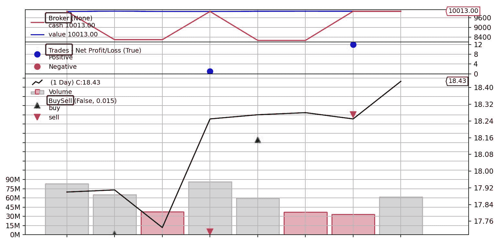
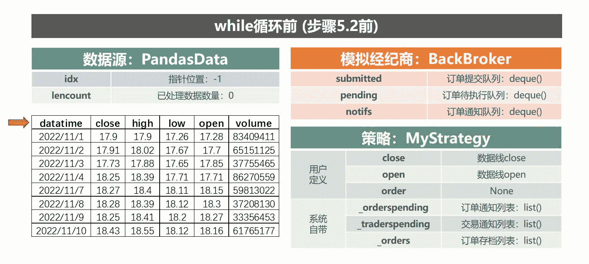
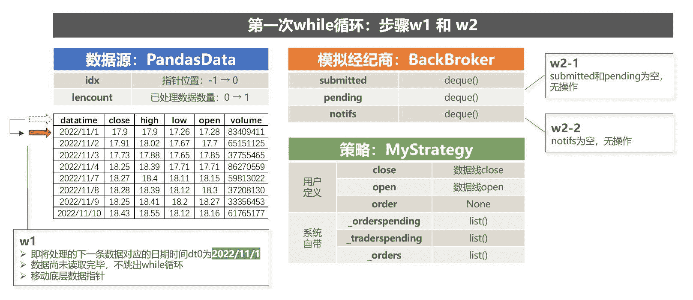
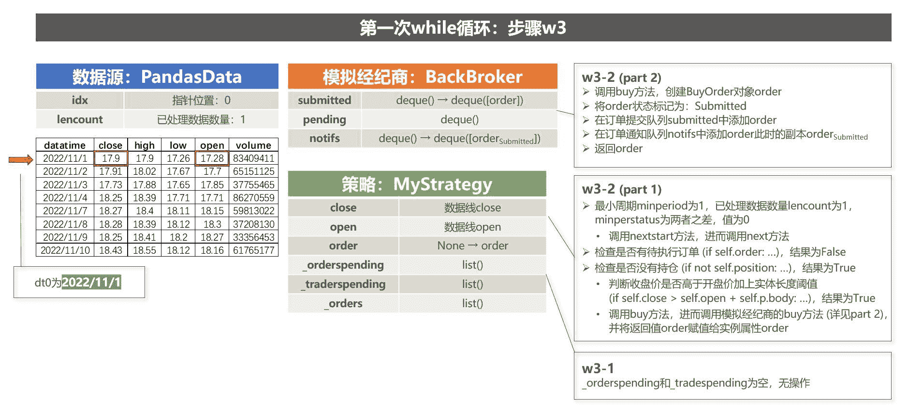
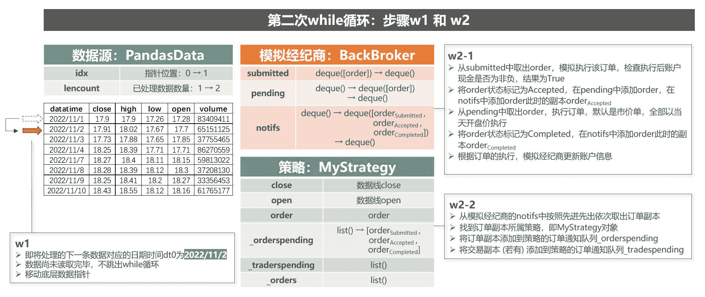
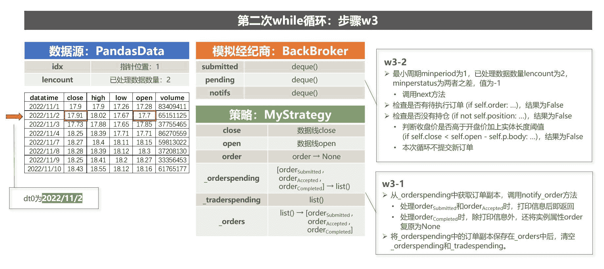

<!--yml
category: 交易
date: 2023-09-17 19:58:41
-->

# backtrader源码解读 (6)：策略 - 知乎

> 来源：[https://zhuanlan.zhihu.com/p/621758956](https://zhuanlan.zhihu.com/p/621758956)

## 1\. 前言

在上一篇文章中，我们详细介绍了backtrader中与数据加载相关的内容，其中包括将数据源pandas DataFrame对象转化为可被回测引擎cerebro识别的PandasData对象，以及梳理了在cerebro进行回测过程中加载PandasData对象的流程。

在本文中，我们将继续探讨backtrader另一个重要的组成部分——**策略** (Strategy)，它是backtrader中用于制定交易规则和逻辑的核心组件。

具体来说，我们首先将展示如何使用backtrader来实现一个非常简单的策略："阳线买入，阴线卖出"。 虽然该策略本身并无投资指导意义，但其目的在于让我们熟悉利用backtrader进行回测的基本方法，以及策略书写的基本范式。 接下来，我们将详细解读backtrader实现策略回测的具体流程，即cerebro调用run方法后发生的一系列操作。通过这一步，我们可以更加清晰和深入地了解backtrader的回测机制，为今后构建更加复杂的策略打下坚实的基础。

需要注意的是，为了避免本文过于冗长，我们的示例策略暂未涉及指标 (Indicator) 的使用。这是由于指标的生成和计算涉及到一些其它机制，我们将在下一篇文章中单独介绍。 此外，在策略实现流程中，我们还会涉及到许多其它组件，例如模拟经纪商（BackBroker）、订单（Order）、交易（Trade）和仓位（Position）等。 由于篇幅限制，我们无法介绍这些组件的所有功能，但是我们会顺带介绍它们在实现示例策略回测过程中用到的功能。

## 2\. 示例策略

Example 1展示的是示例策略"阳线买入，阴线卖出"的代码。该段代码由数据预处理，构建策略，执行回测三个部分组成。

```
# Example 1：示例策略 "阳线买入，阴线卖出"
import backtrader as bt
import pandas as pd

# --- part 1\. 数据预处理 ---
stock = pd.read_csv('stock.csv', index_col=0, parse_dates=True, encoding='gbk')   # 第6行
data = bt.feeds.PandasData(dataname=stock)  # 第7行

# --- part 2\. 构建策略 ---
class MyStrategy(bt.Strategy):   # 第10行
    params = {'body': 0.0} # 参数body：阳线/阴线实体长度的阈值

    def log(self, txt, dt=None):
        dt = dt or self.data.datetime.date(0)
        print(f'[{dt.isoformat()}] {txt}')

    def __init__(self):
        self.open = self.data.open
        self.close = self.data.close
        self.order = None

    def notify_order(self, order):
        if order.status in [order.Submitted]:
            self.log('Order Submitted')
            return

        if order.status in [order.Accepted]:
            self.log('Order Accepted')
            return

        if order.status in [order.Completed]:
            if order.isbuy():
                self.log(f'Buy Executed at price {order.executed.price:.2f}')
            elif order.issell():
                self.log(f'Sell Executed at price {order.executed.price:.2f}')

        if order.status in [order.Canceled, order.Margin, order.Rejected]:
            self.log('Order Canceled/Margin/Rejected')

        self.order = None

    def notify_trade(self, trade):
        if not trade.isclosed:
            return
        self.log(f'Trade P&L {trade.pnl:.2f}')

    def next(self):
        self.log('Next')

        if self.order:
            self.log('Open Order Pending')
            return

        if not self.position:
            if self.close > self.open + self.p.body:
                self.order = self.buy(size=100)
        else:
            if self.close < self.open - self.p.body:
                self.order = self.sell(size=100)  # 第59行

# --- part 3\. 执行回测 ---
cerebro = bt.Cerebro()   # 第62行
cerebro.adddata(data)
cerebro.addstrategy(MyStrategy)

start_value = cerebro.broker.getvalue()
print(f'Starting Portfolio Value: {start_value}')

strats = cerebro.run(oldbuysell = True)

end_value = cerebro.broker.getvalue()
print(f'Final Portfolio Value: {end_value}')
cerebro.plot()   # 第73行
```

### 2.1 数据预处理

在本文中，我们沿用上篇文章中使用的数据源作为策略回测标的，即一份名为"stock.csv"的本地文件，其中记录了某只股票从2022-11-1至2022-11-10日期间的OHLCV数据，具体如图1所示。


图1：本地文件stock.csv

在示例Example 1的第6行，我们通过pandas的read_csv方法将该csv文件读取为pandas DataFrame对象stock。接着，我们在第7行将stock作为参数创建PandasData对象data，将数据源转化为backtrader能够识别的数据格式。

### 2.2 策略构建

首先，我们给出"阳线买入，阴线卖出"策略的具体定义。

*   该策略的参数body代表阳线/阴线实体长度的阈值，body默认为0.0；
*   在该策略中，如果我们未持仓该股票，买入信号将在当日阳线实体长度大于body (即当日收盘价减去开盘价大于body) 时触发；此时，我们将提交100股市价单买单，并在隔日以开盘价全部成交；
*   另一方面，如果我们已持仓该股票，卖出信号将在当日阴线实体长度大于body (即当日收盘价减去开盘价小于-body) 时触发；此时，我们将提交100股市价单卖单，并在隔日以开盘价全部成交。

在Example 1的第10行至第59行，我们定义了一个名为MyStrategy的新类，该类继承自backtrader内置的Strategy类。 继承Strategy类是backtrader中创建任何自定义策略所必须的步骤。

接下来，我们将简单介绍MyStrategy类中的属性和方法。

**params：策略参数**

类变量params用来设置策略的参数名称和默认值。例如在本示例策略中，参数body的默认值为0.0。

需要注意的是，元类MetaParams参与了MyStrategy类的创建，因而对类变量params进行了加工处理。 根据前文《[backtrader源码解读 (4)——metabase模块 (下篇)](https://zhuanlan.zhihu.com/p/602906986)》，我们可知：在MyStrategy类的实例方法中，可以通过self.parmas.body或者self.p.body来调用参数body的值。 此外，在创建MyStrategy对象时，可以通过关键字参数对默认参数值进行修改，该机制将在参数最优化时用到。

**log：日志函数**

log方法的作用是将日志信息输出到屏幕上。该方法不仅允许我们通过参数txt传递需要打印在屏幕上的信息，还会打印数据对象指针指向行的日期时间，方便我们跟踪策略执行的进度。

让我们解读一下log方法中的代码：

```
self.data.datetime.date(0)
```

这里，self是MyStrategy对象，self.data是PandasData对象，而self.data.datetime是LineBuffer对象，代表PandasData对象中的datetime数据线。通过调用date方法并将参数设置为0，self.data.datetime.date(0)返回当前指针所指向的日期时间。

**__init__：初始化**

在__init__方法中，我们需要定义构建策略买入卖出信号所需的要素，以方便我们在后续进行引用。 例如，在本示例策略中，买入卖出信号是利用当日开盘价和收盘价所构建。 在这里，我们创建实例变量close和open，并赋值PandasData对象中对应的close和open数据线。

特别地，如果策略的构建需要用到指标 (Indicator)，同样也是在__init__方法中进行定义。关于指标的使用我们会在后续的文章中进行讲解。

此外，我们在__init__方法中还创建了实例变量order，初始赋值为None。该实例变量是用来储存当前正在交易的订单，以便我们了解是否有订单在等待被执行。

事实上，实例变量order的创建是为了实现本示例策略的"隐藏规则"：在我们提交一个订单之后，如果该订单处于等待被执行的状态，那么我们会等到该订单被执行 (Completed) 或取消 (Canceled/Margin/Rejected) 后再进行下一步的买入卖出信号的判断。需要注意的是，实现该规则需要next方法和notify_order方法中相应代码配合。 更多细节，我们会在稍后章节的策略回测流程中详细描述。

**next：策略操作**

next方法是制定策略逻辑和规则的核心，通常是用户使用backtrader时最经常编写的部分。

我们可以看到，这部分代码的可读性很强。例如，使用实例属性order来判断是否有订单等待被执行，使用property属性position来判断是否持仓，以及调用buy/sell方法提交买/卖单，其参数size代表订单的股数。这些代码让人一看就知道这个策略要做什么。

**notify_order：订单通知**

顾名思义，notify_order方法用于在提交订单之后根据订单的状态将信息输出到屏幕上，以方便我们了解策略的执行进程。在本示例策略中，除了提供订单状态的通知，该方法还提供了订单的执行价格。

**notify_trade：交易通知**

在backtrader中，一个交易指的是一个标的的仓位从0开始，通过开多头或空头仓位构成一个持仓，然后通过平仓操作使仓位再次回到0的过程。举个简单例子，如果我们先买100股，再卖100股，就构成了一个交易。但如果我们先买100股，再卖200股，那么卖的200股要分解为先卖100股平掉之前的多头仓位，构成一个交易，再卖100股新开100股的空头仓位。

在本示例策略中，notify_trade方法提供了交易的盈亏金额信息。

### 2.3 执行回测

在Example 1的第62至73行，我们实现了使用MyStrategy策略对数据源data进行回测。

具体来说，这段代码执行了以下操作： 首先，我们创建了一个回测引擎——Cerebro对象cerebro； 接着，cerebro调用adddata方法添加PandasData对象data， 并调用addstrategy方法添加MyStrategy类； 最后也是最为关键的一步，cerebro调用run方法执行回测。 此外， 我们在cerebro调用run方法前后使用cerebro.broker.getvalue()命令来获取组合的价值（默认初始现金为10000.0），以便更好地了解策略的执行效果。

以下是示例Example 1的打印结果。

> Starting Portfolio Value: 10000.0
> [2022-11-01] Next
> [2022-11-02] Order Submitted
> [2022-11-02] Order Accepted
> [2022-11-02] Buy Executed at price 17.70
> [2022-11-02] Next
> [2022-11-03] Next
> [2022-11-04] Order Submitted
> [2022-11-04] Order Accepted
> [2022-11-04] Sell Executed at price 17.71
> [2022-11-04] Trade P&L 1.00
> [2022-11-04] Next
> [2022-11-07] Order Submitted
> [2022-11-07] Order Accepted
> [2022-11-07] Buy Executed at price 18.15
> [2022-11-07] Next
> [2022-11-08] Next
> [2022-11-09] Order Submitted
> [2022-11-09] Order Accepted
> [2022-11-09] Sell Executed at price 18.27
> [2022-11-09] Trade P&L 12.00
> [2022-11-09] Next
> [2022-11-10] Next
> Final Portfolio Value: 10013.0

## 3\. 策略回测流程

到目前为止，我们已经初步掌握了使用backtrader进行回测的基本方法。 接下来，我们将以示例Example 1为例，通过阅读源码的方式剖析backtrader执行回测的流程，以帮助我们更加深入地了解backtrader实现回测的机制和细节。

### **3.1 添加数据源和策略**

首先，在创建Cerebro对象cerebro时，初始化方法__init__的调用为cerebro添加实例属性datas和strats。 它们的初始值均为一个空列表，datas用来存储数据源对象，strats用来存储策略类以及策略参数 (见Code 1)。

```
# Code 1
# cerebro.py/Cerebro类/__init__方法 (部分)

def __init__(self):
    self.datas = list()
    self.strats = list()
    ...
```

接下来， cerebro调用adddata方法将PandasData对象data添加到实例属性datas中， 同时调用addstrategy方法将MyStrategy类及其策略参数添加到实例属性strats中 (见Code 2)。

```
# Code 2
# cerebro.py/Cerebro类/adddata和addstrategy方法 (部分)

def adddata(self, data, name=None):
    if name is not None:
        data._name = name
    self.datas.append(data)
    ...
    return data

def addstrategy(self, strategy, *args, **kwargs):
    self.strats.append([(strategy, args, kwargs)])
    return len(self.strats) - 1
```

需要注意的是，如果策略涉及处理多个资产，可以使用adddata方法添加多个数据源对象。此外，可以使用addstrategy方法添加多个策略，cerebro会依次将这些策略应用到数据源上。

### 3.2 run方法

在添加数据源和策略之后，cerebro会调用run方法执行回测。Code 3是run方法的简版源码。

```
# Code 3
# cerebro.py/Cerebro类/run方法 (简版)

def run(self, **kwargs):
    self.runstrats = list()
    iterstrats = itertools.product(*self.strats)

    for iterstrat in iterstrats:
        runstrat = self.runstrategies(iterstrat)
        self.runstrats.append(runstrat)

    return self.runstrats[0]
```

不难发现，run方法的核心在于调用runstrategies方法。 此外，通过测试Test 1的打印结果，我们可以看到示例Example 1中传递给runstrategies方法的参数iterstrat的格式。 该参数是一个可迭代对象，其元素为包含策略类和策略参数的元组。

```
# Test 1
# Example 1中runstrategies方法参数iterstrat测试

import itertools
strats = cerebro.strats # 此cerebro为Example 1中创建的回测引擎对象
iterstrats = itertools.product(*strats)

for i, iterstrat in enumerate(iterstrats):
    print(f'[{i}] {iterstrat}')
```

> [0] ((<class '__main__.MyStrategy'>, (), {}),)

### 3.3 **runstrategies方法 (part 1)**

现在，我们将对runstrategies方法进行解读。 在图2中，我们展示了runstrategies方法的主要操作流程，并标注了每个步骤所涉及的关键代码和注释。 这将有助于我们更加清晰地理解回测机制的实现。 接下来，我们将按照图中的编号对每个步骤进行讲解。


图2：runstrategies方法流程

**步骤 1：启动模拟经纪商**

在cerebro进行初始化时，默认会使用BackBroker对象作为模拟经纪商 (见Code 4)。

```
# Code 4
# cerebro.py/Cerebro类/__init__方法 (部分)

def __init__(self):
    self._broker = BackBroker()
    self._broker.cerebro = self
    ...
```

我们可以在brokers.bbroker模块中查看BackBroker类的源码。 简单来说，BackBroker主要实现了以下功能：

1.  **账户管理**：BackBroker对回测账户的可用资金、持仓信息、资产价值等进行维护，并且提供了相应的接口用于查询和修改这些信息；
2.  **执行管理**：BackBroker负责接收和处理交易指令，根据当前账户状况进行交易执行，同时还会维护订单和成交记录等信息；
3.  **滑点和手续费管理**：BackBroker可以根据用户指定的滑点和手续费计算出实际的交易成本，并在执行交易时进行扣除。

图3展示了BackBroker类的类关系图。


图3：BackBroker类 - 类关系图

在这一步中，BackBroker对象调用start方法，进而调用init方法，实现了回测账户的初始配置 (见Code 5)。 在图2中BackBroker类的init方法分支，我们列出了BackBroker对象的实例属性名称及其所代表的回测账户组件的含义。

```
# Code 5
# cerebro.py/Cerebro类/runstrategies方法
# 步骤 1

self._broker.start()
```

**步骤 2：数据加载**

这一步的操作是对数据源容器datas中的每个数据源对象进行数据加载 (见Code 6)。

```
# Code 6
# cerebro.py/Cerebro类/runstrategies方法
# 步骤 2 (简版)

for data in self.datas:
    data.reset()
    data._start()
    data.preload()
```

在示例Example 1中，容器datas中仅包含一个PandasData对象。 这一步所做的就是将参数dataname (即原始数据pandas DataFrame对象) 中的数据加载到该PandasData对象对应的数据线（例如close、open等，均为LineBuffer对象）的底层数据容器中。更多细节，可以参见上一篇文章《[backtrader源码解读 (5)：数据源与数据加载](https://zhuanlan.zhihu.com/p/608124423)》的第7章。

**步骤 3：创建策略对象**

在这一步中，我们使用for循环遍历iterstrat中的每个元组：(策略类, 位置参数, 关键字参数)； 接着，我们将数据容器datas和位置参数拼接起来，生成新的位置参数； 最后，我们使用这些参数创建策略对象，并将其添加到列表runstrats中 (见Code 7)。 在示例Example 1中，这一步创建了MyStrategy类的实例对象。

```
# Code 7
# cerebro.py/Cerebro类/runstrategies方法
# 步骤 3 (简版)

runstrats = list()

for stratcls, sargs, skwargs in iterstrat:
    sargs = self.datas + list(sargs)
    strat = stratcls(*sargs, **skwargs)
    runstrats.append(strat)
```

接下来，我们将开辟一个章节专门对Strategy类进行解读，这将有助于我们更好地了解策略对象的功能。

### **3.4 解读Strategy类**

首先，让我们简单回顾上篇文章中提及的backtrader中类的解读思路。

假设元类Meta创建类Cls，类Cls创建对象obj。那么，

*   Meta的__new__方法控制Cls的创建；
*   Meta的doprenew和donew方法控制obj的创建；
*   Meta的dopreinit、doinit和dopostinit方法控制obj的初始化，且doint方法会调用Cls的__init__方法。

因此，类的解读思路可以总结为：根据**类的创建**、**对象的创建**和**对象的初始化**这三个步骤，在元类的继承链中找到对应的方法，并依次解读。

Strategy类的类关系图如图4所示。


图4：Strategy类 - 类关系图

**3.4.1 Strategy类的创建**

根据图4可知，创建Strategy类的元类按照继承顺序自上而下为：type、MetaBase、MetaParams、MetaLineRoot、MetaLineSeries、MetaLineIterator、MetaStrategy，其中定义了__new__方法的元类有MetaParams、MetaLineSeries、MetaStrategy。

在之前的文章中，我们已经详细介绍了前两个元类的__new__方法。 相比之下，元类MetaStrategy的__new__方法 (见Code 8) 较为简单，它只是为了版本兼容而做了一些类变量的改名工作：将notify改名为notify_order，以及将notify_operation改名为notify_trade。

```
# Code 8
# strategy.py/元类MetaStrategy/__new__方法

def __new__(meta, name, bases, dct):
    if 'notify' in dct:
        dct['notify_order'] = dct.pop('notify')
    if 'notify_operation' in dct:
        dct['notify_trade'] = dct.pop('notify_operation')
    return super(MetaStrategy, meta).__new__(meta, name, bases, dct)
```

**3.4.2 Strategy对象的创建**

在创建Strategy类的元类中，定义了donew方法的元类有MetaParams、MetaLineRoot、MetaLineSeries、MetaLineIterator、MetaStrategy。 前三个元类的donew方法我们已经在之前的文章中介绍过了，接下来我们将介绍后两个元类的donew方法。

为了方便描述，在本小结中，我们令Strategy类 (或其子类) 所创建的对象名称为strat。

元类MetaStrategy的donew方法 (见Code 9) 实现的功能如下：

1.  为strat添加实例属性env，表示strat的配置环境；env的属性值是调用metabase模块中的findowner函数找到strat的"主人"：Cerebro对象cerebro；
2.  为strat添加实例属性_id，用于为strat进行编号。

```
# Code 9
# strategy.py/元类MetaStrategy/donew方法

def donew(cls, *args, **kwargs):
    _obj, args, kwargs = super(MetaStrategy, cls).donew(*args, **kwargs)
    _obj.env = _obj.cerebro = cerebro = findowner(_obj, bt.Cerebro)
    _obj._id = cerebro._next_stid()
    return _obj, args, kwargs
```

元类Metalineiterator的donew方法 (见Code 10) 实现的功能如下：

1.  为strat添加实例属性_lineiterators，初始值为defaultdict(list)，用来对相关指标 (Indicator) 和观察者 (Observer) 进行计算；该实例属性的更多细节和用法将在下篇文章中详细展开；
2.  为strat添加实例属性datas，用于存储strat所作用的数据源对象；datas的初始值为空列表，在示例Example 1中，该方法将从位置参数中取出PandasData对象，并将其添加到该列表中；
3.  为strat添加以下实例属性 (如下表所示)，以方便访问datas中存储的数据源对象及其数据线。

| 属性名称 | 含义 |
| data | datas[0]：列表datas中首个数据源 |
| data_s, s为列名 | data中列名为s对应的数据线 |
| data_i, i为数字 | data中第i+1列对应的数据线 |
| datai，i为数字 | datas[i]：列表datas中第i+1个数据源 |
| datai_s, i为数字，s为列名 | data[i]中列名为s对应的数据线 |
| datai_j, i和j为数字 | data[i]中第j+1列对应的数据线 |

```
# Code 10
# lineiterator.py/元类MetaLineIterator/donew方法

def donew(cls, *args, **kwargs):
    _obj, args, kwargs = super(MetaLineIterator, cls).donew(*args, **kwargs)

    _obj._lineiterators = collections.defaultdict(list)

    mindatas = _obj._mindatas
    lastarg = 0
    _obj.datas = []
    for arg in args:
        if isinstance(arg, LineRoot):
            _obj.datas.append(LineSeriesMaker(arg))

        elif not mindatas:
            break
        else:
            try:
                _obj.datas.append(LineSeriesMaker(LineNum(arg)))
            except:
                break

        mindatas = max(0, mindatas - 1)
        lastarg += 1

    newargs = args[lastarg:]

    if not _obj.datas and isinstance(_obj, (IndicatorBase, ObserverBase)):
        _obj.datas = _obj._owner.datas[0:mindatas]

    _obj.ddatas = {x: None for x in _obj.datas}

    if _obj.datas:
        _obj.data = data = _obj.datas[0]

        for l, line in enumerate(data.lines):
            linealias = data._getlinealias(l)
            if linealias:
                setattr(_obj, 'data_%s' % linealias, line)
            setattr(_obj, 'data_%d' % l, line)

        for d, data in enumerate(_obj.datas):
            setattr(_obj, 'data%d' % d, data)

            for l, line in enumerate(data.lines):
                linealias = data._getlinealias(l)
                if linealias:
                    setattr(_obj, 'data%d_%s' % (d, linealias), line)
                setattr(_obj, 'data%d_%d' % (d, l), line)

    _obj.dnames = DotDict([(d._name, d) for d in _obj.datas
                           if getattr(d, '_name', '')])

    return _obj, newargs, kwargs
```

**3.4.3 Strategy对象的初始化**

在创建Strategy类的元类中，MetaLineIterator和MetaStrategy分别定义了dopreinit和dopostinit方法。

元类MetaStrategy的dopreinit和dopostinit方法 (见Code 11) 用于为策略对象配置组件，这些组件包括经纪商、订单通知列表、交易通知列表等。 在图3中，元类MetaStrategy的dopreinit方法分支列出了实例属性名称以及相应策略组件的含义。 在后续的回测流程中，我们将进一步讲解这些组件的使用。

```
# Code 11
# strategy.py/元类MetaStrategy/dopreinit和dopostinit方法

def dopreinit(cls, _obj, *args, **kwargs):
    _obj, args, kwargs = \
        super(MetaStrategy, cls).dopreinit(_obj, *args, **kwargs)
    _obj.broker = _obj.env.broker
    _obj._sizer = bt.sizers.FixedSize()
    _obj._orders = list()
    _obj._orderspending = list()
    _obj._trades = collections.defaultdict(AutoDictList)
    _obj._tradespending = list()

    _obj.stats = _obj.observers = ItemCollection()
    _obj.analyzers = ItemCollection()
    _obj._alnames = collections.defaultdict(itertools.count)
    _obj.writers = list()

    _obj._slave_analyzers = list()

    _obj._tradehistoryon = False

    return _obj, args, kwargs

def dopostinit(cls, _obj, *args, **kwargs):
    _obj, args, kwargs = \
        super(MetaStrategy, cls).dopostinit(_obj, *args, **kwargs)

    _obj._sizer.set(_obj, _obj.broker)

    return _obj, args, kwargs
```

元类MetaLineIterator的dopreinit和dopostinit方法涉及最小周期的计算和指标关联操作。具体内容将在下一篇文章中进行讲解。

至此，策略对象的创建已经完成。总的来说，以上步骤实现了策略对象的组件配置：将策略与回测引擎、数据源、模拟经纪商等进行关联，并提供了与订单、指标、观察者、分析者、书写者等进行交互的接口。

### **3.5 runstrategies方法 (part 2)**

让我们回到runstrategies方法的流程讲解 (回到图2)。

**步骤 4.1：添加插件**

这一步的操作是将指标、观察者、分析者、头寸规模等插件添加到策略对象的对应接口中 (见Code 12)。这样在策略执行过程中就可以调用这些插件，以实现相应的功能。

```
# Code 12
# cerebro.py/Cerebro类/runstrategies方法
# 步骤 4.1

defaultsizer = self.sizers.get(None, (None, None, None))

for idx, strat in enumerate(runstrats):

    if self.p.stdstats: 
        strat._addobserver(False, observers.Broker)
        if self.p.oldbuysell:
            strat._addobserver(True, observers.BuySell)
        else:
            strat._addobserver(True, observers.BuySell, barplot=True)

        if self.p.oldtrades or len(self.datas) == 1:
            strat._addobserver(False, observers.Trades)
        else:
            strat._addobserver(False, observers.DataTrades)

        for multi, obscls, obsargs, obskwargs in self.observers:
            strat._addobserver(multi, obscls, *obsargs, **obskwargs)

        for indcls, indargs, indkwargs in self.indicators:
            strat._addindicator(indcls, *indargs, **indkwargs)

        for ancls, anargs, ankwargs in self.analyzers:
            strat._addanalyzer(ancls, *anargs, **ankwargs)

        sizer, sargs, skwargs = self.sizers.get(idx, defaultsizer)
            if sizer is not None:
                strat._addsizer(sizer, *sargs, **skwargs)
```

默认情况下，backtrader会向策略对象添加三个观察者：Broker、Trades、BuySell，它们分别用来在策略执行期间监测账户的现金和组合价值、交易盈亏以及买卖行为。 当我们使用指令'**cerebro.plot()**'进行可视化时，绘图会分为三个部分，分别对应这三个观察者的监测结果 (见图5)。



图5：示例Example 1可视化结果

此外，用户定义的指标、观察者、分析者和头寸规模也会添加到策略对象相应的接口中。

**步骤 4.2：启动策略**

这一步的操作是启动策略，完成回测前的准备工作 (见Code 13)。

```
# Code 13
# cerebro.py/Cerebro类/runstrategies方法
# 步骤 4.2

for idx, strat in enumerate(runstrats):
    ...
    strat._start()
```

具体来说，准备工作 (见Code 14) 包括 ：

1.  调用_periodset方法，根据策略对象所关联的数据源和指标计算最小周期，并赋值给策略对象的实例属性_minperiod；示例Example 1中，最小周期为1；
2.  启动策略对象的观察者和分析者；
3.  将运算符阶段设置为阶段2；
4.  用户自定义的操作。

```
# Code 14
# strategy.py/Strategy类/_start方法

def _start(self):
    self._periodset()

    for analyzer in itertools.chain(self.analyzers, self._slave_analyzers):
        analyzer._start()

    for obs in self.observers:
        if not isinstance(obs, list):
            obs = [obs]
        for o in obs:
            o._start()

    self._stage2()
    self._dlens = [len(data) for data in self.datas]
    self._minperstatus = MAXINT
    self.start()
```

在这里，我们解释一下什么是运算符阶段 (operator stage)。 在backtrader中，运算符分为**阶段1**和**阶段2**两个阶段。 简单来说，在阶段1，运算符是针对线的运算，而在阶段2，运算符是针对点的运算。

在步骤4.2之前，运算符处于阶段1，这包括策略对象的__init__方法。在__init__方法中，以减法为例，语句self.data.close - self.data.open会创建一个LinesOperation对象 (LinesOperation类是LineBuffer类的子类)，并作为一个指标添加到策略对象的实例属性_lineiterators中，并在后续阶段进行指标计算。在步骤4.2之后，运算符处于阶段2，这包括我们接下来要讲解的策略对象的next方法。在next方法中，同样的语句self.data.close - self.data.open会进行close和open这两根数据线的指针分别指向的两个数字的减法，最终返回一个数字。

**步骤 5：回测**

在这一步中，我们正式进入回测流程，调用的方法为_runonce或者_runnext (见Code 15)。

```
# Code 15
# cerebro.py/Cerebro类/runstrategies方法
# 步骤 5 (简版)

if self._dopreload and self._dorunonce:
    self._runonce(runstrats)
else:
    self._runnext(runstrats)
```

这两个方法的主要区别在于，前者多用于预加载数据后的历史回测，后者多用于实时交易。 具体而言，在进行历史回测时，我们会预先将历史数据加载，这样_runonce方法就能对指标计算进行矢量计算。 而在实时交易时，由于无法预先加载数据，我们必须等待实时数据一条一条地到来，_runnext方法则会进行实时数据读取以及指标逐一计算。

这两个方法共同点在于，在处理用户定义的策略逻辑以及交易指令时，它们都会逐条处理数据。 也就是说，即使在调用_runonce方法时已经预加载了全部数据，系统仍会模拟数据按照时间线逐条到来。

接下来，我们将对_runone方法进行更进一步的解读。

**步骤 5.1：指标计算**

这一步的操作是对策略对象中的指标进行矢量计算。由于示例Example 1不涉及指标计算，涉及的细节我们会放在下一篇文章中阐述。

此外，在Strategy类中定义了类变量lines = ('datetime',)。因此，策略对象包含一根数据线datetime。 在这一步中，还会将策略对象所包含的datetime数据线重置为初始状态 (见Code 16)。

```
# Code 16
# cerebro.py/Cerebro类/_runonce方法
# 步骤 5.1

def _runonce(self, runstrats):
    for strat in runstrats:
        strat._once()
        strat.reset()
        ...
```

**步骤 5.2：while循环模拟数据逐条到来**

这是backtrader实现回测最为核心的步骤。在这一步中，系统通过while循环模拟数据逐条到来，backtrader的回测组件包括回测引擎、数据源、模拟经纪商和策略之间进行了一系列的交互与操作 (见Code 17)。

```
# Code 17
# cerebro.py/Cerebro类/_runonce方法
# 步骤 5.2 (简版)

def _runonce(self, runstrats):
    ...

    while True:
        dts = [d.advance_peek() for d in datas]  # 9行
        dt0 = min(dts)                           
        if dt0 == float('inf'):                  
            break                                

        for i, dti in enumerate(dts):            
            if dti <= dt0:
                datas[i].advance()               # 16行

        self._brokernotify()                     # 18行

        for strat in runstrats:                  # 20行
            strat._oncepost(dt0)                 # 21行
```

为了更加清晰地了解backtrader的回测机制，我们以Example 1为例， 在各个关键步骤捕获**数据源PandasData对象**、**模拟经纪商BackBroker对象**和**策略MyStrategy对象**这三个回测组件的快照。

在图6中，我们展示了while循环前 (即步骤5.2前) 各组件的状态。 我们可以看到：

*   PandasData对象的指针位置为-1，已处理数据数量为0；
*   BackBroker对象的实例属性submitted、pending和notifs初始值均为空的双端队列，分别代表经纪商的订单提交队列、订单待执行队列和订单通知队列；
*   MyStrategy对象中，由用户在__init__方法中定义的实例属性close、open、order分别代表PandasData对象的数据线close和open，以及正在交易订单；此外，MyStrategy对象的实例属性_orderspending、_tradespending、_orders初始值均为空列表，分别代表策略的订单通知列表、交易通知列表、订单存档列表。



图6：while循环前 (步骤5.2前) - 回测组件快照

接下来，我们进入**第一次while循环**。值得注意的是，为方便引用，在图1中，while循环 (步骤5.2) 的分支步骤序号已改为以字母w开头。

在图7中，我们展示了第一次while循环中，步骤w1和w2的操作以及组件快照。



图7：第一次while循环步骤w1和w2 - 操作与回测组件快照

具体来说，步骤w1和w2对应的源码和解读如下所示：

**※ 步骤w1** (Code 17: 9-16行)：

模拟新的OHLCV数据到达，具体操作包括：

1.  根据PandasData对象的指针位置确认下一条数据对应的时间日期dt0，此时dt0值为2022/11/1；
2.  判断数据是否读取完毕，此时判断为否，不跳出while循环；
3.  移动PandasData对象的指针，移动指针后指针位置为0，已处理数据数量为1。

**※ 步骤w2** (Code 17: 18行)：

调用cerebro的_brokernotify方法 (见Code 18)，该方法的作用是通知BackBroker对象执行用户提交的订单并将执行结果反馈给MyStrategy对象。然而，此时用户尚未提交过订单，BackBroker对象的submitted、pending和notifs队列均为空，因而无操作。

```
# Code 18
# cerebro.py/Cerebro类/_brokernotify方法
# 步骤w2

def _brokernotify(self):
    self._broker.next()     # 6行

    while True:             # 8行
        order = self._broker.get_notification()
        if order is None:
            break

        owner = order.owner
        if owner is None:
            owner = self.runningstrats[0]

        owner._addnotification(order, quicknotify=self.p.quicknotify)   # 17行
```

接下来进入步骤w3，即MyStrategy对象调用_oncepost方法 (Code 17：20-21行)。 在图8中，我们展示了第一次while循环中，步骤w3的操作以及组件快照。



图8：第一次while循环步骤w3 - 操作与回测组件快照

步骤w3分为w3-1和w3-2两个小步骤。 其中，步骤w3-1的作用是将BackBroker对象反馈给MyStrategy对象的订单执行结果进行用户自定义的打印通知，对应的源码 (见Code 19) 和解读如下所示。

**※ 步骤w3-1** (Code 19：7-8行)：

由于此时MyStrategy对象尚未接收到BackBroker对象的反馈，_orderspending和_tradespending列表均为空，因而无操作。

```
# Code 19
# strategy.py/Strategy/_oncepost方法 (part 1)
# 步骤w5-1至w5-3

def _oncepost(self, dt):
    ...
    self._notify()               # 7行
    self.clear()                 # 8行
    ...
```

步骤w3-2的作用是执行策略操作并提交新订单，对应的源码 (见Code 20) 和解读如下所示:

**※ 步骤w3-2** (Code 20：6-12行)：

变量minperstatus是由最小周期与已处理数据量相减而得；随着指针移动模拟数据的逐条到来，已处理数据量从0开始逐渐增加，变量minperstatus亦会随之变动，从而决定策略操作：

*   如果minperstatus<0 (已处理数据量小于最小周期要求)，调用MyStrategy对象的prenext方法进行策略前操作；
*   如果minperstatus=0 (已处理数据量首次达到最小周期要求)，调用MyStrategy对象的nextstart方法，进而调用MyStrategy对象的next方法进行策略操作；
*   如果minperstatus<0 (已处理数据量大于最小周期要求)，调用MyStrategy对象的next方法进行策略操作。

```
# Code 20
# strategy.py/Strategy/_oncepost方法 (part 2)
# 步骤w5-4

def _oncepost(self, dt):
    minperstatus = self._getminperstatus() # 6行
    if minperstatus < 0:                   
        self.next()                      
    elif minperstatus == 0:
        self.nextstart()
    else:
        self.prenext()                     # 12行
    ...
```

在示例Example 1中，最小周期为1，因此在第一次while循环 (已处理数据数量为1) 时便会调用MyStrategy对象的nextstart方法，进而调用next方法。在next方法中，我们经过以下逻辑判断：

首先，检查是否有待执行订单 (if self.order: …)，此处结果为False，因此不执行return结束next方法，执行下一步操作；

接着，检查是否没有持仓 (if not self.position: …)，此处结果为True，进入下一层检查是否触发买入条件：

*   判断收盘价是否高于开盘价加上实例长度阈值 (if self.close > self.open + self.p.body: …)，此处结果为True，执行下一步操作；
*   调用MyStrategy对象的buy方法，进而调用BackBroker对象的buy方法。

BackBroker对象的buy方法执行的操作如下：

1.  创建BuyOrder对象order;
2.  将order状态标记为'Submitted';
3.  在BackBroker对象的订单提交队列submitted中添加order;
4.  在BackBroker对象的订单通知队列notifs中添加order此时的副本order_Submitted;
5.  返回order，赋值给MyStrategy对象的实例属性order。

需要注意的是，BackBroker对象的buy方法中还包含处理OCO订单和Bracket订单的代码 (见图2中BackBroker类buy/sell分支)。但由于示例Example 1中未涉及这两种订单，所以在上述步骤中未提及。

至此，第一次while循环结束。

接下来，我们进入**第二次while循环**。图9展示的是第二次while循环中步骤w1和w2的操作以及组件快照。



图9：第二次while循环步骤w1和w2 - 操作与回测组件快照

具体来说：

**※ 步骤w1** (Code 17: 9-16行)：

模拟新的OHLCV数据到达，这里和第一次while循环时操作一致：

1.  根据PandasData对象的指针位置确认下一条数据对应的时间日期dt0，此时dt0值为2022/11/2；
2.  判断数据是否读取完毕，此时判断为否，不跳出while循环；
3.  移动PandasData对象的指针，移动指针后指针位置为1，已处理数据数量为2。

**※ 步骤w2** (Code 17: 18行)： 调用cerebro的_brokernotify方法 (见Code 18)，该步骤分为w2-1和w2-2两个部分。

在步骤w2-1中，调用BackBroker对象的next方法 (Code 18: 6行)，进行的操作如下：

1.  将订单order从BackBroker对象的submitted队列中取出，模拟执行该订单，检查执行后BackBroker对象的账户中现金是否为非负，此时判断为True；
2.  将order的状态标记为'Accepted'，添加到BackBroker对象的pending队列中，并将order此时的副本order_Accepted添加到在BackBroker对象的notifs队列中；
3.  将order从BackBroker对象的pending队列中取出，执行该订单，默认是市价单，全部按照当日 (即2022/11/2) 开盘价执行；
4.  将order的状态标记为'Completed'，将order此时的副本order_Completed添加到BackBroker对象的notifs队列中；
5.  根据该订单的执行，BackBroker对象更新账户信息。

在步骤w2-2 (Code 18: 8-17行) 中，进行的操作如下：

1.  从BackBroker对象的notifs队列中按照先进先出依次取出订单副本：order_Submitted、order_Accepted、order_Completed;
2.  找到订单副本所属策略，即MyStrategy对象；
3.  将这些订单副本添加到MyStrategy对象的订单通知列表_orderspending中；
4.  将交易副本 (若有) 添加到MyStrategy对象的订单通知列表_tradespending中。

在图10中，我们展示了第二次while循环中，步骤w3的操作以及组件快照。



图10：第二次while循环步骤w3 - 操作与回测组件快照

具体来说：

**※ 步骤w3-1**(Code 19：7-8行)：

对订单执行信息进行用户自定义打印通知，具体操作为：

*   从MyStrategy对象的订单通知列表_orderspending中获取订单副本，调用notify_order方法：处理订单副本order_Submitted和order_Accepted时，打印信息后即返回；处理订单副本order_Completed时，除打印信息外，还将MyStrategy对象的实例属性order复原为None，表明已无正在交易订单；
*   将订单通知列表_orderspending中的订单副本保存在订单存档列表_orders中后，清空_orderspending和_tradespending。

**※ 步骤w3-2** (Code 20：6-12行)：

在第二次while (已处理数据数量为2) 时会调用MyStrategy对象的next方法，经过以下逻辑判断：

首先，检查是否有待执行订单 (if self.order: …)，此处结果为False，因此不执行return结束next方法，执行下一步操作；

接着，检查是否没有持仓 (if not self.position: …)，此处结果为False，进入下一层检查是否触发卖出条件：

*   判断收盘价是否低于开盘价减去实例长度阈值 (if self.close < self.open - self.p.body: …)，此处结果为False，这意味着本次循环中不提交新订单。

到此为止，第二次while循环结束。while循环将持续进行，直到在某轮循环的步骤w1中判断数据已经读取完毕并跳出循环，从而完成回测。

## 4\. 小结

通过本文分析，我们可以深刻感受到backtrader是一个事件驱动型的回测框架，它模拟了现实交易场景下使用到的各种组件，如数据、指标、策略、经纪商、订单、交易等。这些组件都通过事件进行交互。在回测过程中，每当发生一个事件，backtrader都会相应地调用相应的组件来处理这个事件，如数据更新、指标计算、策略决策、订单生成等。通过这种事件驱动的方式，backtrader可以高效地模拟实际交易过程，使得回测结果更加真实可信。

总的来说，本文通过一个简单的交易策略，阐述了backtrader进行回测的基本流程。由于backtrader的框架较为复杂，本文无法囊括方面方面，错误可能也在所难免，但依旧希望本文可以给各位带来一些启发，同时也欢迎随时交流。

* * *

**往期回顾**

[backtrader源码解读 (1)：读懂源码的钥匙——认识元类](https://zhuanlan.zhihu.com/p/594948193)

[backtrader源码解读 (2)：读懂源码的钥匙——元类进阶](https://zhuanlan.zhihu.com/p/597309489)

[backtrader源码解读 (3)：底层基石——metabase模块 (上篇)](https://zhuanlan.zhihu.com/p/600145210)

[backtrader源码解读 (4)：底层基石——metabase模块 (下篇)](https://zhuanlan.zhihu.com/p/602906986)

[backtrader源码解读 (5)：数据源与数据加载](https://zhuanlan.zhihu.com/p/608124423)