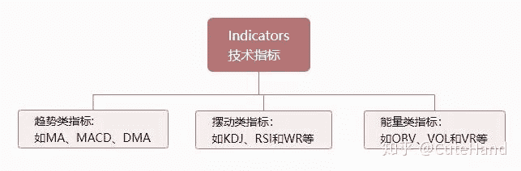
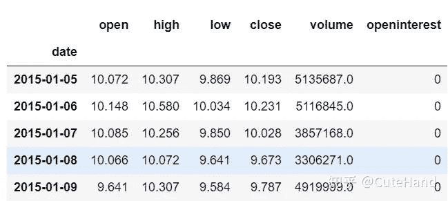
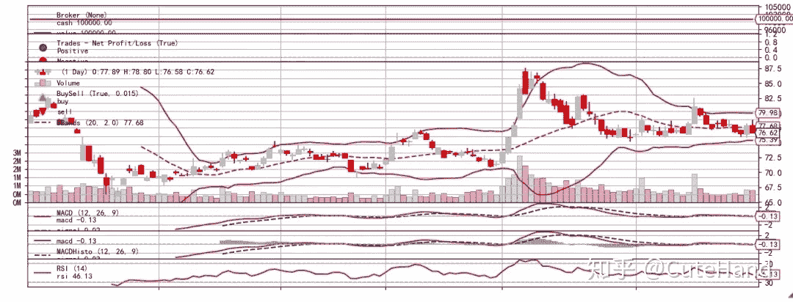
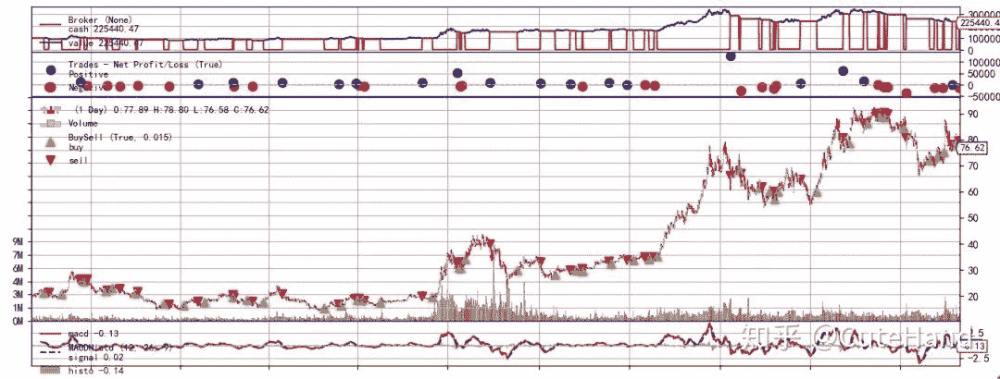
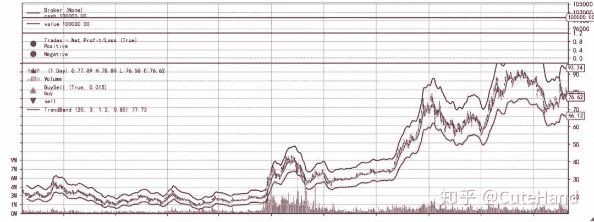
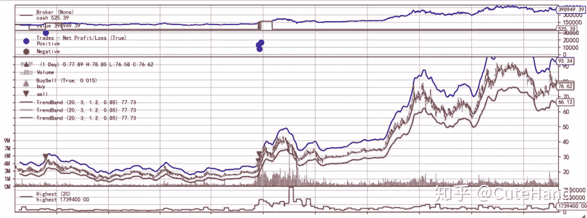
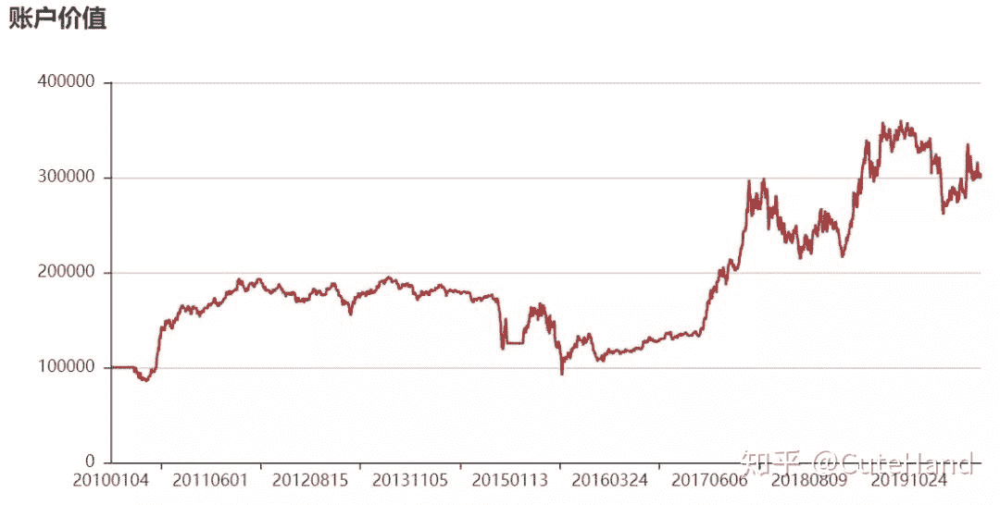
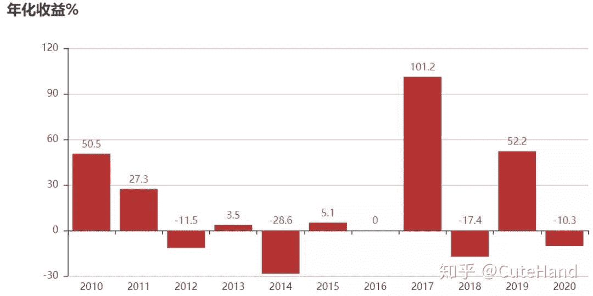

<!--yml
category: 交易
date: 2023-09-17 20:10:35
-->

# backtrader股票技术指标自定义与量化回测 - 知乎

> 来源：[https://zhuanlan.zhihu.com/p/211251288](https://zhuanlan.zhihu.com/p/211251288)

**01引言**

股票市场自交易以来，人们就开始孜孜不倦地探索各种各样的投资理论，其中技术分析是重要的理论之一。实际上，技术分析是100多年前创建的股票投资理论，是投资者对股票量价变化长期观察归纳总结的若干“规律”。技术分析以市场行为（价格和成交量）为研究对象，以判断市场趋势并跟随趋势的周期性变化来指导交易，认为市场行为包容一切信息、价格以趋势方式波动、历史会重演。目前，股票分析的技术指标超过1000多种，从功能角度而言，总体可以分为趋势类、摆动类和能量类指标。趋势类指标结合均线特征，根据股价与指标之间的关系分析股价趋势强弱，如MACD指标。摆动类指标根据股票的成交量、价格和时空，通过公式得出一个数值，通过该数值波动规律指导交易，如KDJ、RSI指标。能量类指标通过分析成交量变化来预测股价波动，如OBV、VOL指标等。本文主要介绍backtrader回测框架中技术分析指标（indicators）的调用方法、自定义指标的编写以及技术指标的历史回测。



**02 Indicators指标调用**

backtrader回测框架内置了很多技术分析指标，封装在indicators中。打开backtrader安装路径，以Anaconda为例，打开\Lib\site-packages\backtrader\，进入indicators文件夹，可以看到里面有48个py文件，文件名是各个技术指标或公示的简称，打开这些文件可以进一步了解包含的具体指标，以及调用的函数名和参数等。


以MACD指标为例，使用Notepad++软件打开macd.py文件，可以看到MACD和MACDHisto两个类，其中MACD是计算MACD指标的类，而MACDHisto则是MACD的子类，增加了macd和信号线之间差异的“直方图”，调用的时候直接使用bt.ind.MACD(参数)。下面以常用的MACD、RSI、布林带指标为例，为大家展示其调用方法。

使用tushare获取数据，并设置为backtrader的数据格式。

```
import backtrader as bt
import pandas as pd
import numpy as np
import tushare as ts 
def get_data(code,start='2010-01-01',end='2020-08-31'):
    df=ts.get_k_data(code,autype='qfq',start=start,end=end)
    df.index=pd.to_datetime(df.date)
    df['openinterest']=0
    df=df[['open','high','low','close','volume','openinterest']]
    return df
dataframe=get_data('600000',start='2015-01-01')
dataframe.head()
```



写一个测试策略，在输出图形中呈现MACD、MACD带柱、RSI和布林带技术指标。

class TestStrategy(bt.Strategy):

def __init__(self):
bt.ind.MACD(self.data)
bt.ind.MACDHisto(self.data)
bt.ind.RSI(self.data,period=14)
bt.ind.BBands(self.data)

将回测系统设置封装成main函数，后面还会反复用到。

```
def main(data,strategy,pf=False):
    cerebro = bt.Cerebro()
    feed = bt.feeds.PandasData(dataname=data)
    cerebro.adddata(feed) 
    #加载策略
    cerebro.addstrategy(strategy)
    # 设置初始资本为10,000
    startcash = 100000
    cerebro.broker.setcash(startcash) 
    # 设置交易手续费为 0.1%
    cerebro.broker.setcommission(commission=0.001) 
    cerebro.run()
    #获取回测结束后的总资金
    portvalue = cerebro.broker.getvalue()
    pnl = portvalue - startcash
    if pf:
        print(f'总资金: {round(portvalue,2)}')
        print(f'净收益: {round(pnl,2)}')
    %matplotlib inline
    cerebro.plot()
```

回测结果如下图所示。

data=get_data('601318','2020-03-01')
main(data,TestStrategy)



上述策略只是调用了技术指标用于画图，下面以MACD指标为例，调用该指标计算MACD柱，当MACD柱大于0（金叉）时发出买入信号，当MACD柱小于0（死叉）时发出卖出信号。

```
class TradeStrategy(bt.Strategy):
    params=(('p1',12),('p2',26),('p3',9),)
    def __init__(self):
        self.order = None
        #获取MACD柱
        self.macdhist = bt.ind.MACDHisto(self.data,
                        period_me1=self.p.p1, 
                        period_me2=self.p.p2, 
                        period_signal=self.p.p3)
    def next(self):
        if not self.position:
            # 得到当前的账户价值
            total_value = self.broker.getvalue()
            #1手=100股，满仓买入
            ss=int((total_value/100)/self.datas[0].close[0])*100
            #当MACD柱大于0（红柱）且无持仓时满仓买入
            if self.macdhist > 0:
                self.order=self.buy(size=ss)
        else:
            #当MACD柱小于0（绿柱）且持仓时全部清仓
            if self.macdhist < 0:
                self.close()
```

以中国平安股票为例，使用MACD指标对2010.1-2020.9年数据进行历史回测。

```
data=get_data('601318','2010-03-01')
main(data,TradeStrategy,pf=True)

#期初资金：100000
#期末资金: 225440.47
#净收益: 125440.47
```



**03 自定义指标**

backtrader的可扩展性很强，除了内置的技术分析指标外，可以通过类的扩展进行自定义指标。20日均线在实战中具有一定的指导意义，可以根据价格偏离20日均线的某个阈值构建类似于布林带的通道线指标。

定义一个指标的类，该类继承bt.Indicator，均线采用20日周期，上下限阈值分别为20%和15%。

```
class TrendBand(bt.Indicator):

    lines = ('mid','top','bot',)
    params = (('maperiod',20),
              ('period',3),
              ('highRate',1.2),
              ('lowRate',0.85),)
    #与价格在同一张图
    plotinfo = dict(subplot=False)

    def __init__(self):
        ema = bt.ind.EMA(self.data, period=self.p.maperiod)
        #计算上中下轨线
        self.l.mid=bt.ind.EMA(ema,period=self.p.period)
        self.l.top=bt.ind.EMA(self.mid*self.p.highRate,\
                              period=self.p.period)
        self.l.bot=bt.ind.EMA(self.mid*self.p.lowRate,\
                              period=self.p.period)
        super(TrendBand, self).__init__()
```

首先看一下该指标的图形。

```
class TestStrategy2(bt.Strategy):
    def __init__(self):
        TrendBand(self.data)
```

回测结果：

```
data=get_data('601318','2010-01-01')
main(data,TestStrategy2)
```



下面基于该指标构建交易策略并回测，当价格站在中轨线上，且成交量突破20日新高时买入，当价格突破上轨线时卖出。

```
class MyStrategy(bt.Strategy):
    params=(('period',20),)
    def __init__(self):
        self.order = None
        self.mid = TrendBand(self.data).mid 
        self.top = TrendBand(self.data).top
        self.bot = TrendBand(self.data).bot
        #设置买入信号
        self.buy_sig=bt.And(\
           self.data.close>self.mid,\
           self.data.volume==bt.ind.Highest(\
           self.data.volume,period=self.p.period))
        #卖出信号
        self.sell_sig=self.data.close>self.top
    def next(self):
        if not self.position:
            # 得到当前的账户价值
            total_value = self.broker.getvalue()
            #1手=100股，满仓买入
            ss=int((total_value/100)/self.datas[0].close[0])*100
            if self.buy_sig:
                self.order=self.buy(size=ss)
        else:
            if self.sell_sig:
                self.close()
```

仍然以中国平安为例，回测结果如下图所示：

```
data=get_data('601318','2010-01-01')
main(data,MyStrategy,True)

#期初资金：100000.00
#期末资金: 398949.39
#净收益: 298949.39
```



**04结语**

本文主要介绍了backtrader回测框架中indicators的调用、自定义指标的编写以及历史回测。其中自定义指标主要是示例作用，不构成任何投资建议。历史回测中仅以中国平安个股为例，具有一定的局限性，感兴趣的读者可以参考组合回测那篇推文，对全市场股票进行组合回测以进一步判断自定义指标的实用性。最后再强调一句，学习没有捷径，要想全面而深入地学习backtrader回测框架，最好的方法是研读其官方文档。

**参考资料：**

backtrader官方文档和安装包原生代码

[https://www.backtrader.com/docu/](https://link.zhihu.com/?target=https%3A//www.backtrader.com/docu/)